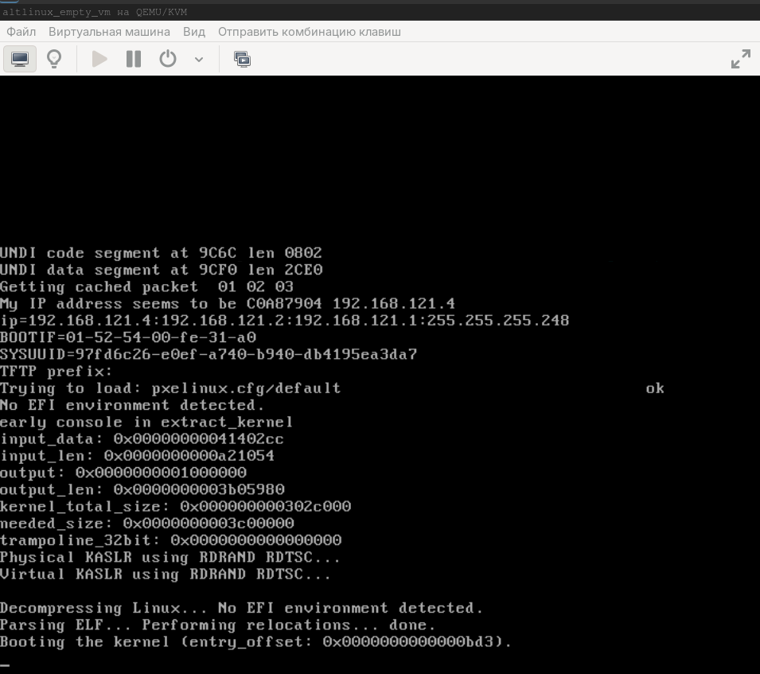

# Лабораторная работа 1. «`Установка ОС Альт`» `Скворцов Денис`
### Предварительно
1. Скачайте дистрибутивы для платформы x86_64
• Альт Сервер
• Альт Рабочая станция
[>>Дистрибутива устновки<<](https://getalt.org)
• Объем загрузок - около 9Гб.
----
### Задание 1.1. Установка Альт Сервер (вручную)
##### 1. Создайте в среде виртуализации (VirtualBox или другой используемой) виртуальную машину с характеристиками
• 2Гб ОЗУ
• 1 ядро CPU
• 1 сетевой интерфейс (типа NAT)
• Диск размером не менее 40 Гб
• Подсоедините к ВМ ISO-образ с дистрибутивом Альт Сервера

```bash
mkdir my-dummy-box

cd my-dummy-box

touch box.img

cat>metadata.json<<'EOF'
{
  "provider": "libvirt",
  "format": "qcow2",
  "virtual_size": 1048576
}
EOF

tar czvf ../my-dummy-box.tar.gz ./*
cd ..

wget -P /home/shoel/iso/ https://download.basealt.ru/pub/distributions/ALTLinux/p11/images/server/x86_64/alt-server-11.0-x86_64.iso

cat>vagrantfile<<'OEF'
# -*- mode: ruby -*-
# vi: set ft=ruby :

Vagrant.configure("2") do |config|

  # Путь к ISO образу ALT Linux p11
  altlinux_iso_path = "/home/shoel/iso/alt-server-11.0-x86_64.iso"

  # Конфигурация для libvirt (общая)
  config.vm.provider :libvirt do |libvirt|
    libvirt.driver = "kvm"
    libvirt.uri = 'qemu:///system'
    libvirt.memory = 4096
    libvirt.cpus = 2
    libvirt.nested = true
    libvirt.disk_driver :cache => 'none'
    libvirt.disk_bus = "virtio"
    libvirt.default_prefix = "altlinux_"
    libvirt.nic_model_type = "virtio"
    libvirt.management_network_mode = "route"
    libvirt.management_network_guest_ipv6 = "no"
  end

  # Определение ВМ для установки с ISO
  config.vm.define "altlinux_install" do |iso_vm|
    iso_vm.vm.hostname = "altlinux-install"
    iso_vm.vm.communicator = "none"
    iso_vm.vm.box = "my-dummy"
    iso_vm.vm.network "forwarded_port", guest: 80, host: 8082
    iso_vm.vm.network "forwarded_port", guest: 8080, host: 8081
    iso_vm.vm.provider :libvirt do |libvirt|
      libvirt.storage :file, :size => '30G', :type => 'qcow2'
      libvirt.storage :file, :device => :cdrom, :path => altlinux_iso_path
      libvirt.boot 'hd'
      libvirt.boot 'cdrom'
    end
    iso_vm.vm.provision "shell", inline: "echo 'VM created.'", run: "never"
  end

  # Определение пустой виртуальной машины
  config.vm.define "empty_vm" do |empty|
    empty.vm.hostname = "empty-vm"
    empty.vm.communicator = "none"
    empty.vm.box = "my-dummy"

    empty.vm.provider :libvirt do |libvirt|
      libvirt.storage :file, :size => '30G', :type => 'qcow2'
      libvirt.disk_bus = "virtio"
      libvirt.boot 'hd'
      libvirt.boot 'network'
    end
    # Отключаем provisioner'ы
    empty.vm.provision "shell", inline: "echo 'Подготовлено для PXE или ручной установки ОС.'", run: "never"
  end
end
OEF

vagrant up --no-destroy-on-error

sudo virsh list --all

sudo virsh destroy --graceful 3

sudo virsh destroy --graceful 4

sudo virsh net-list --all

sudo virsh net-destroy vagrant-libvirt

sudo virsh net-edit --network vagrant-libvirt

sudo virsh net-start vagrant-libvirt

sudo virsh start --domain altlinux_altlinux_install
```

##### 2. Выполните установку ОС Альт Сервер в рамках созданной виртуальной машины.
• используйте параметры по умолчанию
• установите графический интерфейс (MATE)
### Задание 1.2. Развертывание сервера сетевых установок
##### 1. Выполните установку пакетов необходимых для настройки сервера сетевых
установок
##### 2. В соответствии с инструкциями в пособии и в записи выполните действия,
необходимые для настройки сервера сетевых установок
• добавьте в виртуальную машину второй сетевой интерфейс, подклю-
чив его в режиме Внутренняя сеть
• присвойте статический адрес второму сетевому интерфейсу (подклю-
ченному к внутренней сети гипервизора)
• настройте имя домена
• настройте DHCP на динамическую выдачу адресов IPv4 в сети, к кото-
рой подключен и интерфейс со статическим адресом
##### 3. Выполните настройку сервера сетевых установок
• загрузите образ дистрибутива Альт Рабочая Станция
• выберите этот образ как Текущий в сервере сетевых установок
##### 4. По конфигурации службы DHCP, содержимому каталогов TFTP и NFS-сервера, убедитесь, что сервер сетевых установок настроен.

```bash
ssh-keygen -t ed25519 -f ~/.ssh/id_kvm_host -C "kvm-host-access-key"
ssh-keygen -t ed25519 -f ~/.ssh/id_vm -C "vm-access-key"

ssh-copy-id -i ~/.ssh/id_kvm_host.pub shoel@shoellin

ssh-copy-id -i ~/.ssh/id_vm.pub -o "ProxyJump shoel@shoellin" admin@192.168.121.2

ssh -i D:\Users\shoel\AppData\Roaming\MobaXterm\home\.ssh\id_kvm_host -o "ProxyJump shoel@shoellin" -i D:\Users\shoel\AppData\Roaming\MobaXterm\home\.ssh\id_vm admin@192.168.121.2

su -

apt-get update

update-kernel

apt-get dist-upgrade

apt-get install alterator-fbi alterator-netinst alterator-net-domain

systemctl enable --now alteratord ahttpd

systemctl restart alteratord ahttpd

wget -P /srv/public/ https://download.basealt.ru/pub/distributions/ALTLinux/p11/images/workstation/x86_64/alt-workstation-11.1-x86_64.iso
```
https://192.168.121.2:8080


```bash
ss -ulpn | grep -e ":6."

sed -i 8s/yes/no/ /etc/xinetd.d/tftp 

systemctl restart xinetd

systemctl status  tftp.service
```


```bash
systemctl enable --now  tftp.service

systemctl status  tftp.service
```


```bash
ss -ulpn | grep -e ":6."
```


```bash
control rpcbind

cat /etc/exports

systemctl status nfs
```


```bash
systemctl enable --now  nfs

systemctl status nfs
```


### Задание 1.3. Установка Альт Рабочая станция по-сети
##### 1. Создайте в среде виртуализации виртуальную машину с характеристиками
• 1 Гб ОЗУ
• 1 ядро CPU
• 1 сетевой интерфейс (внутренняя сеть)
• Диск размером не менее 40 Гб

```bash
sudo virsh list --all

sudo virsh start --domain altlinux_empty_vm
```
##### 2. Выполните загрузку виртуальной машины по сети и установку ОС Альт
Рабочая Станция с сервера сетевых установок на созданную виртуальную
машину.
• используйте параметры по умолчанию


##### 3. Проверьте работоспособность созданной виртуальной машины.

