# Лабораторная работа 2.«`Запуск и остановка системы и ПО`» `Скворцов Денис`
### Задание 2.1. Загрузка в текстовой режим (третий уровень исполнения)
• Задание выполняется в контексте безопасности суперпользователя
##### 1. Посмотрите текущий уровень работы операционной системы инструментарием SystemV
```bash
# runlevel
```
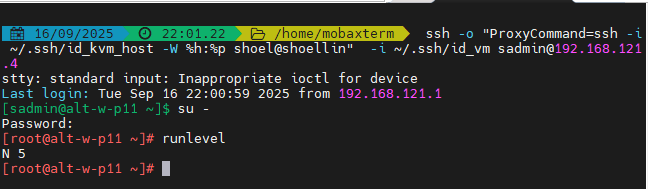
##### 2. Посмотрите цель инициализации системы по-умолчанию
```bash
# systemctl get-default
```
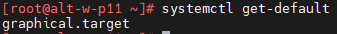
##### 3. Выполните перезагрузку системы
```bash
# systemctl reboot
```
##### 4. В момент работы загрузчика GRUB перейдите в режим редактирования опций загрузки
```yaml
• e
```
##### 5. Допишите в строчке загрузки ядра - начинается с linux указание загрузиться
в 3ий уровень выполнения, дописав в конце строки номер уровня
```yaml
• 3
```
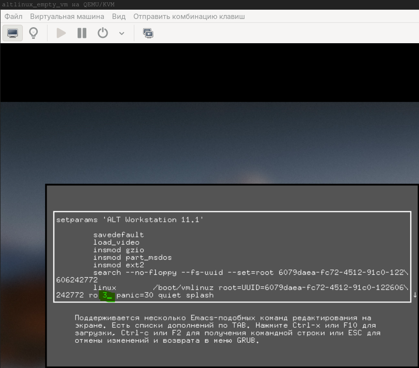
##### 6. Выполните загрузку
```yaml
• F10
```
##### 7. По окончании загрузки войдите в систему и перейдите в контекст безопасности суперпользователя
##### 8. Посмотрите текущий уровень работы операционной системы инструментарием SystemV
```bash
# runlevel
```
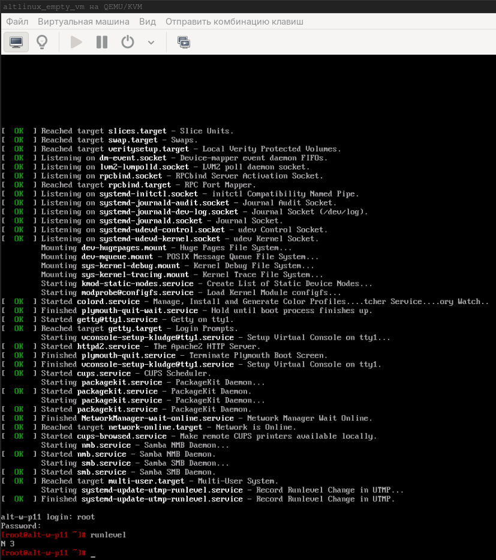
### Задание 2.2. Загрузка с замененным процессом init
• Задание выполняется в контексте безопасности суперпользователя
##### 1. С использованием команды which определите путь к исполняемому файлукомандного интерпретатора bash. Запомните/запишите его.
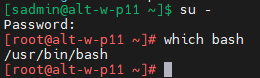
##### 2. Выполните перезагрузку системы
##### 3. В момент работы загрузчика GRUB перейдите в режим редактирования опций загрузки
##### 4. Допишите в строчке загрузке ядра ОС необходимость использовать командный интерпретатор вместо процесса init
```yaml
init=<путь к bash>
```
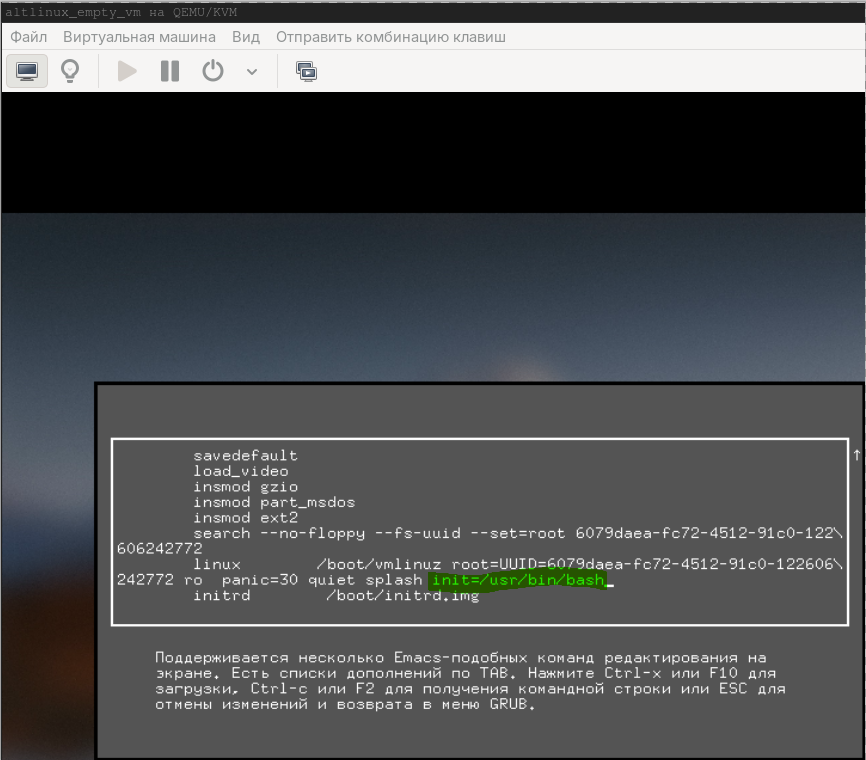
##### 5. Выполните загрузку операционной системы
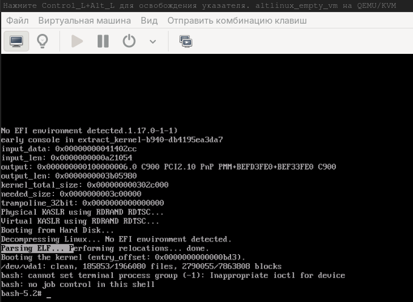
### Задание 2.3. Создание описания для сервиса
##### 1. Перезагрузите систему в режиме загрузки по-умолчанию
##### 2. Задание выполняется в контексте безопасности суперпользователя
##### 3. Запросите с github.com получение дополнительных файлов для проведения лабораторных занятий
```bash
$ git clone https://github.com/hse-labs/linux-lf.git
```
##### 4. При необходимости выполните установку пакета git-core средствами apt-get
```bash
# apt-get install git-core
```
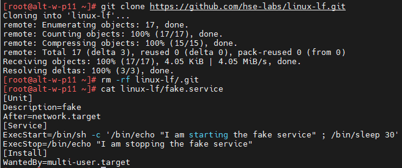
##### 5. Ознакомьтесь с содержимым файла fake.service (Unit-файл сервиса) в полученном каталоге
```bash
# cat linux-lf/fake.service
```
```bash
[Unit]
Description=fake
After=network.target
[Service]
ExecStart=/bin/sh -c '/bin/echo "I am starting the fake service" ; /bin/sleep 30'
ExecStop=/bin/echo "I am stopping the fake service"
[Install]
WantedBy=multi-user.target
```
##### 6. Ознакомьтесь с текущим списком описаний сервисов для SystemD
```bash
# ls /etc/systemd/system
```
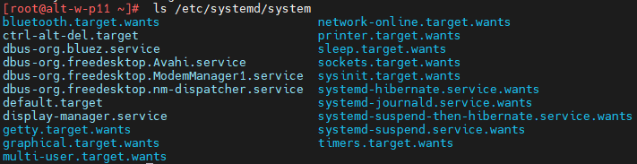
```bash
# ls /lib/systemd/system
```
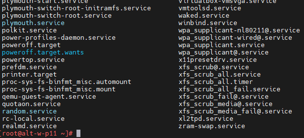
##### 7. Скопируйте файл fake.service с описанием сервиса в каталог /etc/systemd/system
```bash
# cp linux-lf/fake.service /etc/systemd/system/
```
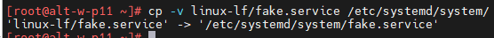
##### 8. Убедитесь, что описание сервиса скопировано
```bash
# ls /etc/systemd/system/fake.service
```
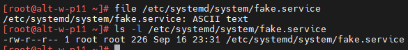
### Задание 2.4. Запуск-статус-остановка сервиса
##### 1. Задание выполняется в контексте безопасности суперпользователя
• Для выполнения дальнейших действий используйте утилиту systemctl
##### 2. Выполните запуск созданного сервиса fake.service
##### 3. Посмотрите статус работы сервиса
##### 4. Перезапустите созданный сервис
##### 5. Остановите сервис
##### 6. Настройте сервис на автоматический запуск
```bash
systemctl start fake.service \
&& systemctl status fake
systemctl restart fake \
&& systemctl stop fake \
&& systemctl enable fake
```

### Задание 2.5. Управление сервисами
##### 1. Задание выполняется в контексте безопасности суперпользователя
• Для выполнения дальнейших действий (п.2,4,6,7,8,10) используйте утилиту systemctl
##### 2. Уберите сервис CUPS (cups.service) из автозагрузки.
##### 3. Перезагрузитесь в третий уровень загрузки.
```bash
# telinit 3
```
##### 4. Проверьте, запущен ли CUPS.
##### 5. Залогиньтесь пользователем sadmin и перейдите в пятый уровень загрузки.
```bash
# telinit 5
```
##### 6. Проверьте, запущен ли CUPS.
##### 7. Запустите CUPS.
##### 8. Верните CUPS в автозагрузку.
##### 9. Перезагрузитесь в пятый уровень загрузки
```bash
# telinit 5
```
##### 10. Проверьте, запущен ли CUPS.
### Задание 2.6. Журнал событий journald
##### 1. Задание выполняется в контексте безопасности суперпользователя
##### 2. Ознакомьтесь с настройками системы журнализации journald
```bash
# cat /etc/systemd/journald.conf
```
##### 3. Обратите внимание на значение параметров
```yaml
• Storage
```
```yaml
• ForwardToSyslog
```
##### 4. Ознакомьтесь с расположением файлов журналов journald
• в каталоге на диске /var/log/journal (если есть)
• в каталоге в RAM-диске /run/log/journal (если есть)
### Задание 2.7. Запросы средствами journalctl
##### 1. Задание выполняется в контексте безопасности суперпользователя
##### 2. Ознакомьтесь со встроенной справкой утилиты journalctl
```bash
$ man journalctl
```
```bash
$ journalctl --help
```
##### 3. Выполните вывод событий приоритета emerg
```bash
# journalctl -p emerg
```
##### 4. Выполните вывод событий ядра
```bash
# journalctl -k
```
##### 5. Выполните вывод событий службы sshd
```bash
# journalctl $(which sshd)
```
##### 6. Выполните вывод событий пользователя sadmin
```bash
# journalctl _UID=$(id -u sadmin)
```
##### 7. Выполните вывод событий с момента загрузки системы
```bash
# journalctl -b
```
##### 8. Выполните вывод последних сообщений с возможной расшифровкой
```bash
# journalctl -xe
```