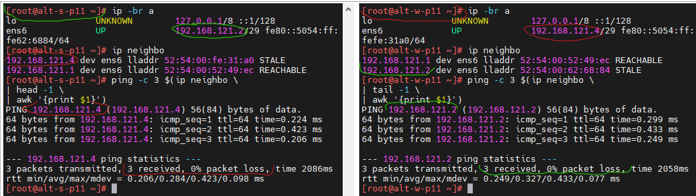
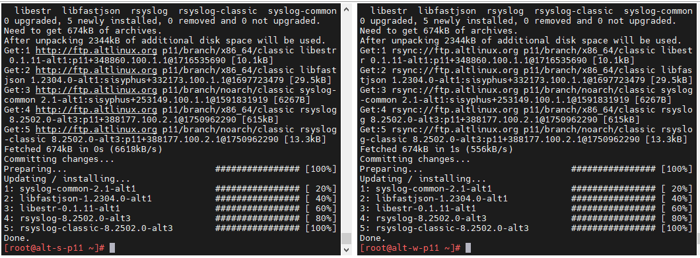
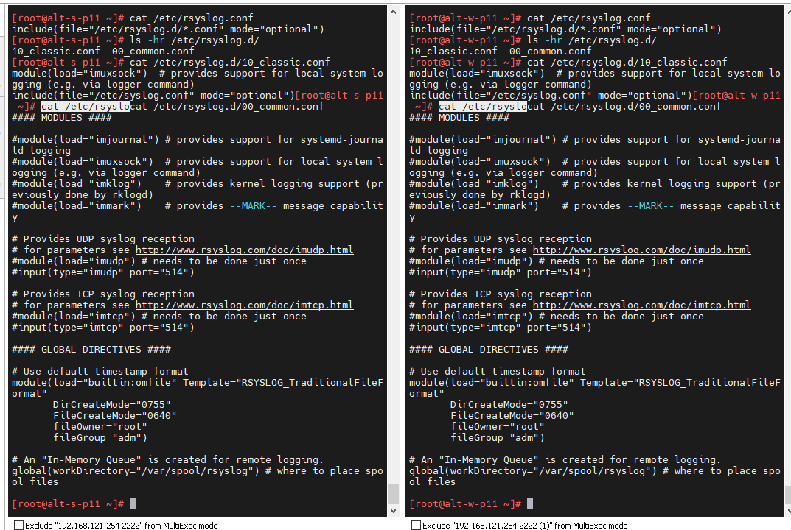
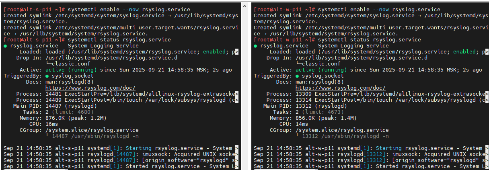
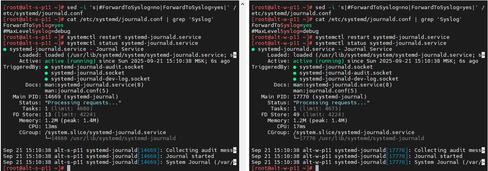
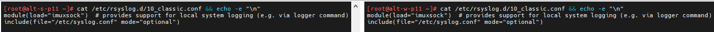
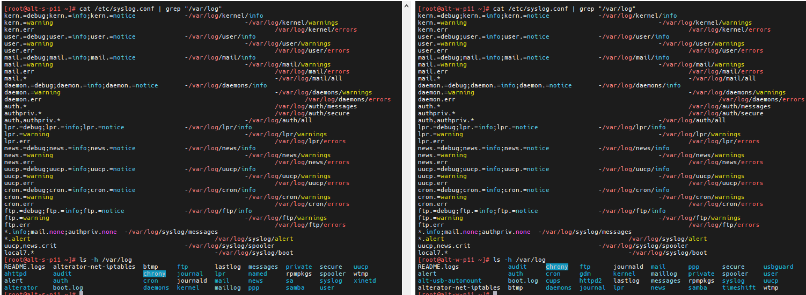

# Лабораторная работа 3.«`Настройка rsyslogd в ОС Альт`» `Скворцов Денис`

### Задание 3.1. Подготовка
* Внимание! Для выполнения задания потребуется 2 ВМ с ОС Альт (например можно использовать ВМ altwks1.p10 и altwks2.p10 из виртуального стенда). Далее по тексту - ВМ-1 и ВМ-2
* Так же можно использовать ВМ с Альт Сервер и Альт Рабочая станция, развернутых при выполнении Лабораторной работы №1.
* Обеспечьте сетевую связность между узлами, для этого в ВМ удобно использовать сетевой интерфейс, подключенный в режиме Внутренняя сеть
  * убедитесь в настройках VirtualBox, что на обоих ВМ есть сетевые интерфейсы, подключенные к одной и той же Внутренней сети, если необходимо настройте их на использование одной и той же внутренней сети.`
  * загрузившись в ВМ посмотрите настройки соответствующих сетевых интерфейсов и при необходимости настройте их на использование разных IP-адресов из одной и той же IP-сети (например 192.168.100.101/24 и 192.168.100.102/24)
  * убедитесь в наличии связности между узлами с использованием утилиты ping
  

### Задание 3.2. Установка и базовая настройка
##### 1. Установите пакет `rsyslog-classic` в ОС Альт на обоих ВМ
```bash
apt-get update \
&& update-kernel -y \
&& apt-get dist-upgrade -y \
&& apt-get -y rsyslog-classic
```

##### 2. Ознакомьтесь с конфигурацией rsyslog по-умолчанию и запустите службу `rsyslog` на обоих узлах.


##### 3. Выполните на обоих узлах настройку journald на передачу сообщений в syslog-совместимую службу и перезапустите службу `systemd-journald`
```bash
sed -i 's|#ForwardToSyslog=no|ForwardToSyslog=yes|' /etc/systemd/journald.conf

cat /etc/systemd/journald.conf | grep 'Syslog'

systemctl restart systemd-journald.service

systemctl status systemd-journald.service

cat /etc/rsyslog.d/10_classic.conf && echo -e "\n"
```


##### 4. Убедитесь, что сообщения записываются в текстовые журналы на обоих узлах в соответствии с конфигурацией rsyslog
```bash
cat /etc/syslog.conf | grep "/var/log"

ls -h /var/log
```

### Задание 3.3. Централизация сбора событий
##### 1. На узле ВМ-2(выполняет роль сервера сбора событий, т.е. приемник сообщений) выполните установку пакета с конфигурацией rsyslog для сбора сообщений по сети `rsyslog-server-listen`
##### 2. Перезапустите службу rsyslog. Убедитесь, что узел ВМ-2 прослушивает порт 514 протокола UDP
##### 3. Выполните настройку rsyslog узла ВМ-1 (выполняет роль источника для собираемых сообщений) на отправку всех сообщений приоритета не ниже `info` на syslog-сервер узла ВМ-2 по протоколу UDP
##### 4. Выполните на узле ВМ-1 перезапуск службы `rsyslogd` и после этого какой-нибудь службы (например `crond` или `sshd`)
##### 5. На узле ВМ-2 найдите в соответствующем журнале сообщения о перезапуске службы (`crond`/`sshd`) с узла ВМ-1
##### 6. На узле ВМ-2 выполните настройку на раскладывание сообщений по каталогам, соответствующим именам узлов и файлы в них по именам приложений 
```bash
$template   DynFile,"/var/log/%HOSTNAME%/%PROGRAMNAME%.log"
*.*         ?DynFile
```
##### 7. Перезапустите службу `rsyslog` на узле ВМ-2. Выполните на узле ВМ-1 какие-либо действия, приводящие к записи сообщений в журнал, например вход пользователя в систему, перезапуск службы и т.п.
##### 8. Проверьте результат на узле ВМ-2, убедитесь, что сообщения раскладыва ются по заданной структуре.

#### Подгрузите файлы, подтверждающие выполнение заданий Лабораторной работы 3, а именно:

* Скриншот с результатами выполнения команды ping в конце Задания 3.1 - файл 

* По итогам выполнения Задания 3.3. с узла-источника сообщений (ВМ-1 в задании) подгрузите файлы `vm1.confs`,`vm1.hostinfo`,`vm1.messages`, полученные в результате выполнения следующих команд (все команды выполнять под суперпользователем):
```bash
(cat /etc/syslog.conf \
; cat /etc/rsyslog.conf \
; cat /etc/rsyslog.d/*.conf \
; cat /etc/systemd/journald.conf) \
> vm1.confs
```
```bash
(hostname ; ip a \
| grep 'e[tn].*\: ' -A3) \
> vm1.hostinfo
```
```bash
(ls -la /var/log/ \
; ls -la /var/log/syslog \
; grep -i cron /var/log/syslog/messages) \
> vm1.messages
```
* И скриншоты с того же узла с выводом команд
```bash
tail -n 30 /var/log/messages && systemctl \
| grep syslog
```
```bash
cat /etc/systemd/journald.conf
```
* По итогам выполнения Задания 3.3. с узла-получателя сообщений (ВМ-2 в задании) подгрузите файлы `vm2.confs`, `vm2.hostinfo`, `vm2.messages`, полученные в результате выполнения следующих команд (все команды выполнять под суперпользователем):
```bash
(cat /etc/syslog.conf ; cat /etc/rsyslog.conf ; cat /etc/rsyslog.d/*.conf ) > vm2.confs
```
```bash
(hostname ; ip a | grep 'e[tn].*\: ' -A3) > vm2.hostinfo
```
```bash
(ls -la /var/log/ \
; ls -la /var/log/syslog \
; ls -laR /var/log/<имя_хоста_1> \
; ls -laR /var/log/<имя_хоста_2> \
; grep -i cron /var/log/<имя_хоста_1>/systemd.log  \
; grep -i cron /var/log/<имя_хоста_2>/systemd.log) \
> vm2.messages
```

- команда в 1 строку, при этом `<имя_хоста_1>`,`<имя_хоста_2>` заменить на имена используемых вами узлов (например `altwks1` и `altwks2`)

- И скриншот с того же узла с выводом команды
```bash
tail -n 30 /var/log/messages && systemctl \
| grep syslog
```