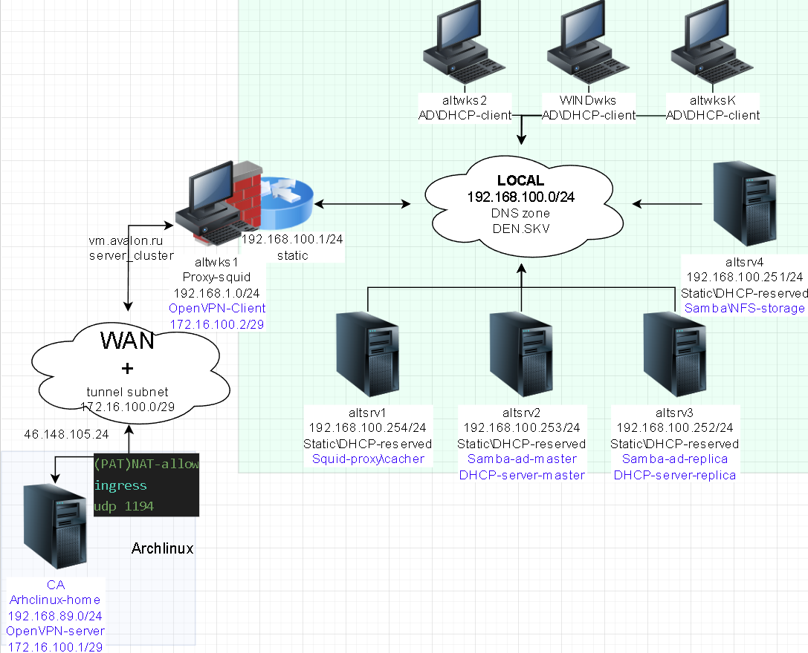

# Впускная квалификационная работа
# Проектирование и автоматизация внедрения гибридной сетевой инфраструктуры на базе Ansible в составе домена AD, прокси-сервера SQUID и Динамического DNS



#### ПАМЯТКА ВХОДА

```bash
# Включаем агента в текущей оснастке и прописываем в базу агента созданные и переправленные ключи
eval $(ssh-agent) \
&& ssh-add  \
~/.ssh/id_skv_VKR_vpn
```
```bash
# вход на bastion хост по ключу по ssh
> ~/.ssh/known_hosts \
&& ssh -t -o StrictHostKeyChecking=accept-new \
sysadmin@172.16.100.2 \
"su -"
```
```bash
# Вход на altsrv1 по новому Ip
ssh -t \
-i ~/.ssh/id_skv_VKR_vpn \
-J sysadmin@172.16.100.2 \
-o StrictHostKeyChecking=accept-new \
sysadmin@192.168.100.254 \
"su -"
```
```bash
# Вход на altsrv2(AD1) по новому Ip
ssh -t \
-i ~/.ssh/id_skv_VKR_vpn \
-J sysadmin@172.16.100.2 \
-o StrictHostKeyChecking=accept-new \
sysadmin@192.168.100.253 \
"su -"
```
```bash
# Вход на altsrv3(AD2) по новому Ip
ssh -t \
-i ~/.ssh/id_skv_VKR_vpn \
-J sysadmin@172.16.100.2 \
-o StrictHostKeyChecking=accept-new \
sysadmin@192.168.100.252 \
"su -"
```
```bash
# Вход на altsrv4 по новому Ip
ssh -t \
-i ~/.ssh/id_skv_VKR_vpn \
-J sysadmin@172.16.100.2 \
-o StrictHostKeyChecking=accept-new \
sysadmin@192.168.100.251 \
"su -"
```
```bash
# Вывод у dhcp сервера об аренде ip на примере у хоста altwks2
ssh -t \
-i ~/.ssh/id_skv_VKR_vpn \
-J sysadmin@172.16.100.2 \
-o StrictHostKeyChecking=accept-new \
sysadmin@192.168.100.253 \
'su -c \
"grep -B10 altwks2 \
/var/lib/dhcp/dhcpd/state/dhcpd.leases" | grep lease'
```
# `AD.BASH.Replica`


<details>
<summary>xxxx</summary>

```log

```

</details>


cat > <<'EOF'
EOF