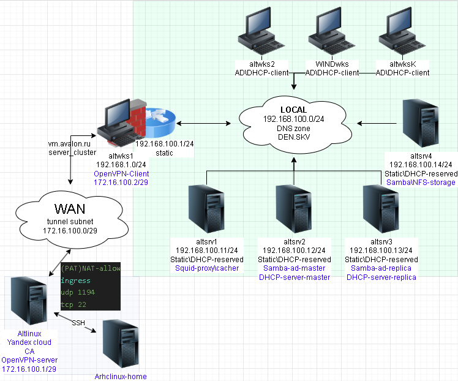

# Впускная квалификационная работа
# `Проектирование и автоматизация внедрения гибридной сетевой инфраструктуры на базе Ansible в составе домена AD, прокси-сервера SQUID и Динамического DNS`



# Памятка входа
```bash
export ANSIBLE_CONFIG=./ansible.cfg

# Для вывода playbook с первым уровнем детализации в yaml формате
export ANSIBLE_CALLBACK_RESULT_FORMAT=yaml

# Команда вызова редактирования файла с паролями
EDITOR=nano \
ansible-vault edit \
./inventory/group_vars/all/vault \
--vault-password-file ./va_pa
```
```bash
# Включаем агента в текущей оснастке
eval $(ssh-agent) \
&& ssh-add  \
~/.ssh/id_skv_VKR_vpn
```
```bash
# вход на bastion(altwks1) хост по ключу по ssh через yandex cloud vm
> ~/.ssh/known_hosts \
&& ssh -t \
-i ~/.ssh/id_skv_VKR_vpn \
-J skv@158.160.201.144 \
-o StrictHostKeyChecking=accept-new \
sysadmin@172.16.100.2 \
"su -"
```

# Ход выполнения Автоматизации
## Предварительные действия перед выполнением (Доступ до закрытого контура через Openvpn)
### Развертывание сервера Сертификации на сервере Openvpn
#### Установка пакетов на сервере Openvpn
```bash
# Вход в каталога с подготовленным terraform для развертывания openvpn-сервер узла
cd  VKR/0.vpn/tf
```
```bash
# Вывод рабочего облака
yc config get cloud-id
```

<details>
<summary>yandex cloud-id</summary>

```log
b1gkumrn87pei2831blp
```

</details>

```bash
# вывод рабочего каталога YC
yc config get folder-id
```

<details>
<summary>yandex folder-id</summary>

```log
b1gkumrn87pei2831blp
```

</details>

```bash
# Проверка готовых конфигов проекта и вывод плана развертывания
terraform validate \
&& terraform fmt \
&& terraform init --upgrade \
&& terraform plan -out=tfplan
```
```bash
# Формирование Сервера
terraform apply "tfplan"
```
```bash
# вывод имеющихся виртуальных машин
yc compute instance list
```
|          ID          | NAME |    ZONE ID    | STATUS  |   EXTERNAL IP   | INTERNAL IP  |
|----------------------|------|---------------|---------|-----------------|--------------|
| fv4clqtg1jq6rde85jcc | vkr  | ru-central1-d | RUNNING | 158.160.201.144 | 10.10.10.254 |


```bash
# Вход на сервер для openvpn
ssh \
-o StrictHostKeyChecking=accept-new \
-i ~/.ssh/id_skv_VKR_vpn \
skv@81.26.176.3
```
```bash
# вход под сперпользователем YC ВМ
sudo su
```
```bash
# Обновление системы и установка easyrsa
apt-get update \
&& update-kernel -y \
&& apt-get dist-upgrade -y \
&& apt-get install -y easy-rsa tree \
&& systemctl reboot
```
```bash
# Генерация структуры каталогов PKI и генерация сертификата CA
cd /srv \
&& easyrsa init-pki \
&& easyrsa build-ca
```
```bash
# Группа Диффи-Хелмана
easyrsa gen-dh
```
```bash
# сертификат\ключ VPN-сервера
easyrsa build-server-full \
vkr \
nopass
```
```bash
# сертификат\ключ VPN-клиента
easyrsa build-client-full \
altwks1 \
nopass
```
```bash
# перенос генерации Диффи-Хелмана и пары сертификата\ключа для VPN-сервера
cp /srv/pki/{ca.crt,dh.pem} \
/srv/pki/{private,issued}/altwks1.* \
/home/skv/
```
```bash
chow skv:skv /home/skv/altwks1*

chow skv:skv /home/skv/{ca.crt,dh.pem}
```

```bash
# =====| Со стороны Altwks1 | ======
# перенос генерации Диффи-Хелмана и пары сертификата\ключа для VPN-сервера
# Копирование файлов
scp \
-o StrictHostKeyChecking=accept-new \
-i ~/.ssh/id_skv_VKR_vpn \
skv@158.160.201.144:~/altwks1.* \
./

scp \
-o StrictHostKeyChecking=accept-new \
-i ~/.ssh/id_skv_VKR_vpn \
skv@158.160.201.144:~/{ca.crt,dh.pem} \
./
```
```bash
# вход под суперпользователем
su -
```
```bash
# обновление системы и установка openvpn easy-rsa на клиенте соединения
apt-get update \
&& update-kernel -y \
&& apt-get dist-upgrade -y \
&& apt-get install -y \
openvpn \
easy-rsa
```
```bash
# Генерация Ключ HMAC
openvpn --genkey \
secret \
/etc/openvpn/keys/ta.key
```
```bash
# Копируем сгенерированный HMAC в домашний каталог для обмена через файловое облако между VPN-сервер\клиентом
cp /etc/openvpn/keys/ta.key \
/home/sysadmin/
```
```bash
# взаимодействовать с файлом на уровне пользователя
chown sysadmin:sysadmin \
/home/sysadmin/ta.key
```
```bash
# Копируем Генерацию Ключа HMAC на openvpn-server
scp \
-o StrictHostKeyChecking=accept-new \
-i /home/sysadmin/.ssh/id_skv_VKR_vpn \
/home/sysadmin/ta.key \
skv@158.160.201.144:~/ \
```
```bash
# Копирование всех необходимых файлов для настройки клиента
cp /home/sysadmin/{altwks1.*,ta.key,ca.crt,dh.pem} \
/etc/openvpn/keys/
```
```bash
# Выставление желательных прав для ключей\сертификатов
chmod -R 600 /etc/openvpn/keys
```
```bash
# Добавляем в hosts ip и имя внешнего сервера VPN 
# имя указанного хоста соответствует на чье имя был выписан сертификат из CA (openvpn-altserver)
sed -i '/**vkr$/d' /etc/hosts
echo "158.160.201.144 \
vkr" \
>> /etc/hosts
```

#### Создание конфига туннельного соединения-клиента по subnet топологии

<details>
<summary>/etc/openvpn/client/tun0.conf</summary>

```bash
cat > /etc/openvpn/client/tun0.conf <<'EOF'
dev tun0
  client
  nobind
  remote vkr 1194
  proto udp4
  topology subnet
  pull
  cipher AES-256-CBC
  data-ciphers-fallback AES-256-CBC
  ca /etc/openvpn/keys/ca.crt
  cert /etc/openvpn/keys/altwks1.crt
  key /etc/openvpn/keys/altwks1.key
  tls-client
  remote-cert-eku "TLS Web Server Authentication"
  tls-auth /etc/openvpn/keys/ta.key 1
  auth-nocache
EOF
```

</details>

```bash
# Включение и запуск службы VPN-клиента
systemctl enable \
--now \
openvpn-client@tun0
```
```bash
# =====| На стороне сервера openVPN |=====
# Создание каталога для пары ключей и сертификатов
mkdir -p \
/etc/openvpn/keys/
```
```bash
# Копирование подготовленных файлов пары ключей и сертификатов для сервера
cp pki/{issued,private}/vkr.* \
/srv/pki/{ca.crt,dh.pem} \
/etc/openvpn/keys/
```
```bash
# Копирование Ключа HMAC созданного с VPN-клиента
cp /home/skv/ta.key \
/etc/openvpn/keys/
```
```bash
# Смена владельцев пользования ключами
chown \
root:openvpn -R \
/etc/openvpn/keys
```
```bash
# Выставление желательных прав для ключей\сертификатов
chmod -R 600 \
/etc/openvpn/keys
```

#### Создание конфига туннельного соединения-клиента по subnet топологии

<details>
<summary>/etc/openvpn/server/tun0.conf</summary>

```bash
cat > /etc/openvpn/server/tun0.conf <<'EOF'
dev tun0
  local 10.10.10.254
  port 1194
  proto udp4
  keepalive 10 60
  topology subnet
  server 172.16.100.0 255.255.255.248
  data-ciphers-fallback AES-256-CBC
  cipher AES-256-CBC
  ca /etc/openvpn/keys/ca.crt
  dh /etc/openvpn/keys/dh.pem
  cert /etc/openvpn/keys/vkr.crt
  key /etc/openvpn/keys/vkr.key
  tls-server
  remote-cert-eku "TLS Web Client Authentication"
  tls-auth /etc/openvpn/keys/ta.key 0
EOF
```

</details>

```bash
# ЗАпуск службы
systemctl enable \
--now \
openvpn-server@tun0
```
```bash
# Проверка соединения
ping -c2 172.16.100.2
```

<details>
<summary>ping</summary>

```log
PING 172.16.100.2 (172.16.100.2) 56(84) bytes of data.
64 bytes from 172.16.100.2: icmp_seq=1 ttl=64 time=16.6 ms
64 bytes from 172.16.100.2: icmp_seq=2 ttl=64 time=16.2 ms

--- 172.16.100.2 ping statistics ---
2 packets transmitted, 2 received, 0% packet loss, time 1001ms
rtt min/avg/max/mdev = 16.166/16.386/16.606/0.220 ms
```

</details>

### SSH обмен ключами
```bash
# Запуск агента
eval $(ssh-agent) \
&& ssh-add  \
~/.ssh/id_skv_VKR_vpn
```
```bash
# копирование ключа на промежуточный сервер на YC
scp -v \
-o StrictHostKeyChecking=accept-new \
-i ~/.ssh/id_skv_VKR_vpn.pub \
~/.ssh/id_skv_VKR_vp* \
skv@158.160.201.144:~/.ssh/
```
```bash
# Вход на промежуточный сервер с Openvpn
ssh \
-i ~/.ssh/id_skv_VKR_vpn \
-o StrictHostKeyChecking=accept-new \
skv@158.160.201.144
```
```bash
# Изменение прав 
chmod 640 \
~/.ssh/id_skv_VKR_vpn.pub
chmod 600 \
~/.ssh/id_skv_VKR_vpn
```
```bash
# проброс ключа до altwks1 через Openvpn
> ~/.ssh/known_hosts \
&& ssh-copy-id \
-o StrictHostKeyChecking=accept-new \
-i ~/.ssh/id_skv_VKR_vpn.pub \
sysadmin@172.16.100.2
```

<details>
<summary>лог проброса ключа</summary>

```log
/usr/bin/ssh-copy-id: INFO: Source of key(s) to be installed: "/home/skv/.ssh/id_skv_VKR_vpn.pub"
/usr/bin/ssh-copy-id: INFO: attempting to log in with the new key(s), to filter out any that are already installed
/usr/bin/ssh-copy-id: INFO: 1 key(s) remain to be installed -- if you are prompted now it is to install the new keys
Number of key(s) added: 1

Now try logging into the machine, with: "ssh -i /home/skv/.ssh/id_skv_VKR_vpn -o 'StrictHostKeyChecking=accept-new' 'sysadmin@172.16.100.2'"
and check to make sure that only the key(s) you wanted were added.
```

</details>

```bash
# копирование ключа на удаленный хост клиента openvpn
scp -v \
-o StrictHostKeyChecking=accept-new \
-i ~/.ssh/id_skv_VKR_vpn.pub \
~/.ssh/id_skv_VKR_vp* \
sysadmin@172.16.100.2:~/.ssh/
```
```bash
# Выход с сервера openvpn-server
exit
```
```bash
# вход на удаленный хост по ключу по ssh через yandex cloud
> ~/.ssh/known_hosts \
&& ssh -t \
-i ~/.ssh/id_skv_VKR_vpn \
-J skv@158.160.201.144 \
-o StrictHostKeyChecking=accept-new \
sysadmin@172.16.100.2 \
"hostname && hostname -i"
```

<details>
<summary>Тестовое подключение</summary>

```log
altwks1
192.168.1.186 192.168.100.1 172.16.100.2
Connection to 172.16.100.2 closed.
```

</details>

### Подготовка Управляющего узла
```bash
# вход на bastion хост по ключу по ssh через yandex cloud
ssh -t \
-i ~/.ssh/id_skv_VKR_vpn \
-J skv@158.160.201.144 \
-o StrictHostKeyChecking=accept-new \
sysadmin@172.16.100.2 \
"su -"
```
```bash
# Смена прав на использование ssh ключей
chown -v sysadmin:sysadmin \
/home/sysadmin/.ssh/id_skv_VKR_vp* \
&& chmod -v 600 \
/home/sysadmin/.ssh/id_skv_VKR_vpn \
&& chmod -v 640 \
/home/sysadmin/.ssh/id_skv_VKR_vpn.pub
```

<details>
<summary>Лог смены прав ssh ключей</summary>

```log
ownership of '/home/sysadmin/.ssh/id_skv_VKR_vpn' retained as sysadmin:sysadmin
ownership of '/home/sysadmin/.ssh/id_skv_VKR_vpn.pub' retained as sysadmin:sysadmin
mode of '/home/sysadmin/.ssh/id_skv_VKR_vpn' retained as 0600 (rw-------)
mode of '/home/sysadmin/.ssh/id_skv_VKR_vpn.pub' changed from 0644 (rw-r--r--) to 0640 (rw-r-----)
```

</details>

```bash
# Обновление и установка необходимых пакетов Управляющему узлу
apt-get update \
&& update-kernel -y \
&& apt-get dist-upgrade -y \
&& apt-get install ansible sshpass -y \
&& apt-get autoremove -y \
&& systemctl reboot
```
### Подготовка Управляемых узлов
#### Проброс ключей для работы ansible
```bash
# вход на bastion хост по ключу по ssh через yandex cloud
ssh -t \
-i ~/.ssh/id_skv_VKR_vpn \
-J skv@158.160.201.144 \
-o StrictHostKeyChecking=accept-new \
sysadmin@172.16.100.2 \
"su -"
```
```bash
# проброс ключа до Управляемых хостов
> ~/.ssh/known_hosts
for ip in {2,11,12,13,14}; do \
ssh-copy-id \
-o StrictHostKeyChecking=accept-new \
-i /home/sysadmin/.ssh/id_skv_VKR_vpn.pub \
sysadmin@192.168.100.$ip; done
```
<details>
<summary>Вывод Проброса ключей</summary>

```log
/usr/bin/ssh-copy-id: INFO: Source of key(s) to be installed: "/home/sysadmin/.ssh/id_skv_VKR_vpn.pub"
/usr/bin/ssh-copy-id: INFO: attempting to log in with the new key(s), to filter out any that are already installed
/usr/bin/ssh-copy-id: INFO: 1 key(s) remain to be installed -- if you are prompted now it is to install the new keys
sysadmin@192.168.100.2's password: 

Number of key(s) added: 1

Now try logging into the machine, with:   "ssh -o 'StrictHostKeyChecking=accept-new' 'sysadmin@192.168.100.2'"
and check to make sure that only the key(s) you wanted were added.

/usr/bin/ssh-copy-id: INFO: Source of key(s) to be installed: "/home/sysadmin/.ssh/id_skv_VKR_vpn.pub"
/usr/bin/ssh-copy-id: INFO: attempting to log in with the new key(s), to filter out any that are already installed
/usr/bin/ssh-copy-id: INFO: 1 key(s) remain to be installed -- if you are prompted now it is to install the new keys
sysadmin@192.168.100.11's password: 

Number of key(s) added: 1

Now try logging into the machine, with:   "ssh -o 'StrictHostKeyChecking=accept-new' 'sysadmin@192.168.100.11'"
and check to make sure that only the key(s) you wanted were added.

/usr/bin/ssh-copy-id: INFO: Source of key(s) to be installed: "/home/sysadmin/.ssh/id_skv_VKR_vpn.pub"
/usr/bin/ssh-copy-id: INFO: attempting to log in with the new key(s), to filter out any that are already installed
/usr/bin/ssh-copy-id: INFO: 1 key(s) remain to be installed -- if you are prompted now it is to install the new keys
sysadmin@192.168.100.12's password: 

Number of key(s) added: 1

Now try logging into the machine, with:   "ssh -o 'StrictHostKeyChecking=accept-new' 'sysadmin@192.168.100.12'"
and check to make sure that only the key(s) you wanted were added.

/usr/bin/ssh-copy-id: INFO: Source of key(s) to be installed: "/home/sysadmin/.ssh/id_skv_VKR_vpn.pub"
/usr/bin/ssh-copy-id: INFO: attempting to log in with the new key(s), to filter out any that are already installed
/usr/bin/ssh-copy-id: INFO: 1 key(s) remain to be installed -- if you are prompted now it is to install the new keys
sysadmin@192.168.100.13's password: 

Number of key(s) added: 1

Now try logging into the machine, with:   "ssh -o 'StrictHostKeyChecking=accept-new' 'sysadmin@192.168.100.13'"
and check to make sure that only the key(s) you wanted were added.

/usr/bin/ssh-copy-id: INFO: Source of key(s) to be installed: "/home/sysadmin/.ssh/id_skv_VKR_vpn.pub"
/usr/bin/ssh-copy-id: INFO: attempting to log in with the new key(s), to filter out any that are already installed
/usr/bin/ssh-copy-id: INFO: 1 key(s) remain to be installed -- if you are prompted now it is to install the new keys
sysadmin@192.168.100.14's password: 

Number of key(s) added: 1

Now try logging into the machine, with:   "ssh -o 'StrictHostKeyChecking=accept-new' 'sysadmin@192.168.100.14'"
and check to make sure that only the key(s) you wanted were added.
```

</details>

#### Установка необходимых пакетов на управляемых хостах
```bash
# Установка пакетов с заранее известных хостов
for ip in {2,11,12,13,14}; do \
ssh -t \
-i /home/sysadmin/.ssh/id_skv_VKR_vpn \
-o StrictHostKeyChecking=accept-new \
sysadmin@192.168.100."$ip" \
"su -c 'apt-get update \
&& apt-get install -y \
python3 \
python3-module-yaml \
python3-module-jinja2 \
python3-module-jsonobject \
&& systemctl reboot'" ; done
```

### Формирование Структуры папок и файлов
#### Создание общей коллекции
```bash
# создании структуры коллекции Ansible
ansible-galaxy collection \
init \
VKR.ans_vkr_skv
```

<details>
<summary>Collection was created successfully</summary>

```log
- Collection VKR.ans_vkr_skv was created successfully
```

</details>

#### создание ролей
```bash
#  Вход в namespace коллекции Ansible
cd VKR/
```
```bash
# Переименование коллекции Ansible
mv ans_vkr_skv \
7.Ansible_automation
```
```bash
# Создание ролей ansible
for r in {base_setup,chrony_sync,samba_ad_dc,dhcp_server,smb_shares,nfs_server,squid_proxy,sysvol_replication,monitoring_scripts}; do \
ansible-galaxy role \
init \
roles/$r \
; done
```

<details>
<summary>Лог вывода о создании ролей</summary>

```log
- Role roles/base_setup was created successfully
- Role roles/chrony_sync was created successfully
- Role roles/samba_ad_dc was created successfully
- Role roles/dhcp_server was created successfully
- Role roles/smb_shares was created successfully
- Role roles/nfs_server was created successfully
- Role roles/squid_proxy was created successfully
- Role roles/sysvol_replication was created successfully
- Role roles/monitoring_scripts was created successfully
```

</details>

#### Настройка конфигурации ansible локального проекта `ansible.cfg`

<details>
<summary>./ansible.cfg</summary>

```bash
cat > ansible.cfg <<'EOF'
[defaults]
home=./
inventory=./inventory
roles_path=./roles
vault_password_file=./va_pa
host_key_checking=False
interpreter_python=auto_silent
deprecation_warnings=False
retry_files_enabled=False
callback_enabled=profile_tasks

[privilege_escalation]
become=true
become_method=su

[connection]
ssh_agent=auto

[paramiko_connection]
host_key_checking=False

[ssh_connection]
host_key_checking=False
EOF
```

</details>

```bash
# создание каталога inventory и глобальных переменных для хостов
mkdir -vp inventory/{group_vars,host_vars}

mkdir -vp inventory/group_vars/all
```
```bash
# Для nfs сетевого хранилища и отключения сообщения
# "Ansible is being run in a world writable directory ...
# ignoring it as an ansible.cfg source"
export ANSIBLE_CONFIG=./ansible.cfg
```

#### Создаем файл Управляемых хостов

<details>
<summary>./inventory/inventory.yaml</summary>

```bash
cat > ./inventory/inventory.yaml << 'EOF'
---
all:
  hosts: {}
  children:
    domain_controllers:
      hosts:
        altsrv2:
          ansible_host: 192.168.100.12
        altsrv3:
          ansible_host: 192.168.100.13
    file_servers:
      hosts:
        altsrv4:
          ansible_host: 192.168.100.14
    proxy_servers:
      hosts:
        altsrv1:
          ansible_host: 192.168.100.11
...
EOF
```

</details>

#### создание переменных для всех групп

<details>
<summary>./inventory/group_vars/all/all.yml</summary>

```bash
cat > inventory/group_vars/all/all.yml <<'EOF'
---
#====| Общие параметры |===#
# параметры суперпользователя
ansible_ssh_private_key_file: "~/.ssh/id_skv_VKR_vpn"
# параметры домена
ad_workgroup: "den.skv"
ad_realm: "DEN.SKV"
ad_domain: "DEN"
ad_admin_user: "Administrator"
dns_forwarder: "77.88.8.8"
# Хост имена и ip контроллеров домена
primary_dc: "{{ groups['domain_controllers'][0] }}"
primary_dc_ip: "{{ hostvars[primary_dc]['ansible_host'] }}"
secondary_dc: "{{ groups['domain_controllers'][1] }}"
secondary_dc_ip: "{{ hostvars[secondary_dc]['ansible_host'] }}"
# Сеть
network_subnet: "192.168.89.0"
network_netmask: "255.255.255.0"
network_gateway: "192.168.89.1"

#====| Переназначенные параметры ролей |===#
# роль chrony
allow_clients: "192.168.89.0/24"
#AD роль
ptr_zone: "89.168.192.in-addr.arpa"

# включаем(true)\выключаем(false) роли
base_setup: true

# Отдельные задачи включения пакетов
dist_upd: true # Обновление кеша пакетов
dist_upgrd: false # обновление установленных приложений
kernel_upd: false # обновление ядра

chrony_sync: false

sysvol_replication: false # на эту переменную завязаны репликации служб AD и DHCP
monitoring_scripts: false
samba_ad_dc: false
dhcp_server: false

smb_shares: true
nfs_server: false

squid_proxy: false
...
EOF
```

</details>

```bash
# Archlinux
# Генерация пароля (pwgen) и запись значения в файл 
# для доступа к зашифрованному файлу переменных vault.yml
# Создание зашифрованного файла vault.yml с паролями
# и переход сразу к редактированию
tee ./va_pa <<< $(pwgen -1) \
&& chmod -x ./va_pa \
&& EDITOR=nano \
ansible-vault create \
--encrypt-vault-id default \
--vault-password-file ./va_pa \
./inventory/group_vars/all/vault
```

<details>
<summary>Содержимое vault</summary>

```yaml
---
vault_omapi_secret: "KsP/KnIQcoQF5fMMjBcOhg=="
ad_admin_password: "1qaz@WSX"
ansible_user: "sysadmin"
ansible_become_password: "netlab123"
...
```

</details>

##### Команда вызова редактирования файла с паролями
```bash
EDITOR=nano \
ansible-vault edit \
./inventory/group_vars/all/vault \
--vault-password-file ./va_pa
```
### создание основы главного playbook

<details>
<summary>./main.yaml</summary>

```bash
cat > ./main.yaml<< 'EOF'
#!/usr/bin/env ansible-playbook
---
- name: Развертывание гибридной инфраструктуры
  hosts: all
  become: true
  become_method: su
  become_user: root
  gather_facts: true

- name: Базовая настройка хостов
  import_playbook: base_setup.yaml
  when: base_setup | bool

- name: Настройка синхронизации времени
  import_playbook: chrony_sync.yaml
  when: chrony_sync | bool

- name: Установка Samba Active Directory DC
  import_playbook: samba_ad_dc.yaml
  when: samba_ad_dc | bool

- name: DHCP с failover и DDNS
  import_playbook: dhcp_server.yaml
  when: dhcp_server | bool

- name: Репликация SysVol между DC
  import_playbook: sysvol_replication.yaml
  when: sysvol_replication | bool

- name: Smb файловый сервер
  import_playbook: smb_shares.yaml
  when: smb_shares | bool

- name: NFS с Kerberos
  import_playbook: nfs_server.yaml
  when: nfs_server | bool

- name: SQUID с Kerberos-аутентификацией
  import_playbook: squid_proxy.yaml
  when: squid_proxy | bool

- name: Скрипты мониторинга и failover
  import_playbook: monitoring_scripts.yaml
  when: monitoring_scripts | bool
...
EOF
```

</details>

### playbook Роли базовых настроек хостов

<details>
<summary>./base_setup.yaml</summary>

```bash
cat > ./base_setup.yaml << 'EOF'
#!/usr/bin/env ansible-playbook
---
- name: Базовая настройка хостов
  hosts: all
  become: true
  become_method: su
  become_user: root
  roles:
    - base_setup
...
EOF
```

</details>


#### Главный файл задач Роли базовых настроек

<details>
<summary>./roles/base_setup/tasks/main.yml</summary>

```bash
cat > roles/base_setup/tasks/main.yml <<'EOF'
---
- name: Обновление кеша пакетов
  apt_rpm:
    update_cache: true
  when: dist_upd | bool

- name: Установка базовых пакетов при вводе в домен
  apt_rpm:
    name: "{{ base_pkg }}"
    state: installed
  when:
    - inventory_hostname not in groups['domain_controllers']
    - dist_upd | bool

- name: Обновление пакетов
  apt_rpm:
    dist_upgrade: true
  when: dist_upgrd | bool

- name: Обновление ядра
  apt_rpm:
    update_kernel: true
  environment:
    PATH: "{{ ansible_env.PATH }}:/usr/sbin"
  ignore_errors: true
  when: kernel_upd | bool

- name: Установка имени хоста
  hostname:
    name: "{{ inventory_hostname ~'.'~ ad_workgroup }}"

- name: Определить основной интерфейс
  set_fact:
    primary_iface_name: >-
      {{
          ansible_interfaces
          | difference(['lo'])
          | select('match', '^(eth|en)[a-z0-9]*')
          | first
      }}

- name: Настройка DNS резолвера
  template:
    src: resolv.conf.j2
    dest: "/etc/net/ifaces/{{ primary_iface_name }}/resolv.conf"
  when:
    - inventory_hostname not in groups['domain_controllers']
    
- name: Отключение IPv6 прописываем конфиг
  sysctl:
    name: net.ipv6.conf.all.disable_ipv6
    value: "1"
    state: present
    sysctl_file: /etc/sysctl.conf
    reload: true
  
- name: Отключение IPv6 применение конфига
  command: /sbin/sysctl -p

- name: Создание службы применения sysctl после загрузки
  copy:
    src: apply-sysctl.service
    dest: /etc/systemd/system/apply-sysctl.service
    mode: '0755'

- name: Включить сервис apply-sysctl
  systemd:
    name: apply-sysctl
    enabled: true
    masked: false
    daemon_reload: true

- name: Перезагрузка после обновлений
  reboot:
    reboot_timeout: 240
...
EOF
```

</details>

#### Переменные по умолчанию роли базовых настроек

<details>
<summary>./roles/base_setup/defaults/main.yml</summary>

```bash
cat > roles/base_setup/defaults/main.yml <<'EOF'
---
dist_upd: true # Обновление кеша пакетов
dist_upgrd: true # обновление установленных приложений
kernel_upd: true # обновление ядра
base_setup: true
...
EOF
```

</details>

#### Постоянные переменные роли базовых настроек

<details>
<summary>./roles/base_setup/vars/main.yml</summary>

```bash
cat > roles/base_setup/vars/main.yml <<'EOF'
---
base_pkg:
  - task-auth-ad-sssd
  - chrony
  - samba-common-tools
  - samba-client
  - avahi-daemon
  - libnss-role
...
EOF
```

</details>

#### Шаблоны Роли базовых настроек
##### Шаблон resolver Роли базовых настроек

<details>
<summary>./roles/base_setup/templates/resolv.conf.j2</summary>

```bash
cat > roles/base_setup/templates/resolv.conf.j2 <<'EOF'

nameserver {{ hostvars[server].ansible_host }}

search {{ ad_workgroup }}
options rotate
EOF
```

</details>

##### Шаблон службы применения настроек sysctl Роли базовых настроек

<details>
<summary>./roles/base_setup/files/apply-sysctl.service</summary>

```bash
cat > roles/base_setup/files/apply-sysctl.service <<'EOF'
[Unit]
Description=Apply sysctl settings after boot
After=multi-user.target

[Service]
Type=oneshot
ExecStart=/sbin/sysctl -p
RemainAfterExit=yes

[Install]
WantedBy=multi-user.target
EOF
```

</details>

### Роль `chrony_sync` - Синхронизация времени
#### Playbook роли Синхронизации времени

<details>
<summary>./chrony_sync.yaml</summary>

```bash
cat > ./chrony_sync.yaml << 'EOF'
#!/usr/bin/env ansible-playbook
---
- name: Настройка синхронизации времени
  hosts: all
  become: true
  become_method: su
  become_user: root
  roles:
    - chrony_sync
...
EOF
```

</details>

#### Главный файл задач Роли Синхронизация времени

<details>
<summary>./roles/chrony_sync/tasks/main.yml</summary>

```bash
cat > roles/chrony_sync/tasks/main.yml <<'EOF'
---
- name: Обновление кеша пакетов
  apt_rpm:
    update_cache: true

- name: Установка базовых пакетов при вводе в домен
  apt_rpm:
    name:
      - chrony
    state: installed
    
- name: Настройка chrony.conf для основного DC
  template:
    src: chrony.conf.dc_main.j2
    dest: /etc/chrony.conf
    backup: true
  notify: Restart chronyd
  when:
  - inventory_hostname == (groups['domain_controllers'] | list)[0]

- name: Настройка chrony.conf для вторичного DC
  template:
    src: chrony.conf.dc_second.j2
    dest: /etc/chrony.conf
    backup: true
  notify: Restart chronyd
  when:
  - inventory_hostname == (groups['domain_controllers'] | list)[1]

- name: Настройка chrony.conf для пользователей домена
  template:
    src: chrony.conf.members.j2
    dest: /etc/chrony.conf
    backup: true
  notify: Restart chronyd
  when:
  - inventory_hostname not in groups['domain_controllers']

- name: Запуск и включение службы chronyd
  systemd:
    name: "{{ item }}"
    state: started
    enabled: true
    masked: false
    daemon_reload: true
  loop:
    - chronyd
...
EOF
```

</details>

#### Шаблоны сервера времени роли Синхронизация времени
##### Для основного сервера времени Роли Синхронизация времени

<details>
<summary>./roles/chrony_sync/templates/chrony.conf.dc_main.j2</summary>

```bash
cat > roles/chrony_sync/templates/chrony.conf.dc_main.j2 <<'EOF'
server {{ exter_ntp }} iburst


server {{ host }}.{{ ad_workgroup }} iburst


driftfile /var/lib/chrony/drift
makestep 1.0 3
rtcsync
allow {{ allow_clients }}
local stratum 10
ntsdumpdir /var/lib/chrony
logdir /var/log/chrony
EOF
```

</details>

##### Для вторичного сервера времени Роли Синхронизация времени

<details>
<summary>./roles/chrony_sync/templates/chrony.conf.dc_second.j2</summary>

```bash
cat > roles/chrony_sync/templates/chrony.conf.dc_second.j2 <<'EOF'


server {{ host }}.{{ ad_workgroup }} iburst


server {{ exter_ntp }} iburst
driftfile /var/lib/chrony/drift
makestep 1.0 3
rtcsync
allow {{ allow_clients }}
local stratum 10
ntsdumpdir /var/lib/chrony
logdir /var/log/chrony
EOF
```

</details>

##### Для пользователей домена Роли Синхронизация времени

<details>
<summary>./roles/chrony_sync/templates/chrony.conf.members.j2</summary>

```bash
cat > roles/chrony_sync/templates/chrony.conf.members.j2 <<'EOF'
driftfile /var/lib/chrony/drift
makestep 1.0 3
rtcsync
ntsdumpdir /var/lib/chrony
logdir /var/log/chrony

server {{ host }}.{{ ad_workgroup }} iburst

EOF
```

</details>

#### Обработчики роли Синхронизация времени

<details>
<summary>./roles/chrony_sync/handlers/main.yml</summary>

```bash
cat > roles/chrony_sync/handlers/main.yml <<'EOF'
---
- name: Перезапуск chronyd обработчиком
  systemd:
    name: "{{ item }}"
    state: restarted
    enabled: true
    masked: false
    daemon_reload: true
  loop:
    - chronyd
  listen: Restart chronyd
...
EOF
```

</details>

### Переменные по умолчанию роли Синхронизация времени

<details>
<summary>./roles/chrony_sync/defaults/main.yml</summary>

```bash
cat > roles/chrony_sync/defaults/main.yml<<'EOF'
---
chrony_sync: true
exter_ntp: ntp3.vniiftri.ru
allow_clients: "192.168.100.0/24"
...
EOF
```

</details>

### Роль `samba_ad_dc` - Контроллер домена Active Directory
#### Playbook роли Контроллер домена Active Directory

<details>
<summary>./samba_ad_dc.yaml</summary>

```bash
cat > ./samba_ad_dc.yaml << 'EOF'
#!/usr/bin/env ansible-playbook
---
- name: Samba Active Directory DC
  hosts: domain_controllers
  become: true
  become_method: su
  become_user: root
  roles:
    - samba_ad_dc
...
EOF
```

</details>

#### Главный файл задач роли Контроллер домена Active Directory

<details>
<summary>./roles/samba_ad_dc/tasks/main.yml</summary>

```bash
cat > roles/samba_ad_dc/tasks/main.yml <<'EOF'
---
- name: Базовая подготовка серверов AD
  include_tasks: base.yml
  when:
    - inventory_hostname in groups['domain_controllers']

- name: Развертывание основного домен контролера
  include_tasks: primary_dc.yml
  when:
    - inventory_hostname == (groups['domain_controllers'] | list)[0]

- name: Развертывание вторичного домен контролера
  include_tasks: second_dc.yml
  when:
    - inventory_hostname == (groups['domain_controllers'] | list)[1]
    - sysvol_replication | bool
...
EOF
```

</details>

#### Файл базовых задач роли Контроллер домена Active Directory

<details>
<summary>./roles/samba_ad_dc/tasks/base.yml</summary>

```bash
cat > roles/samba_ad_dc/tasks/base.yml <<'EOF'
---
- name: Остановка конфликтующих служб
  systemd:
    name: "{{ item }}"
    state: stopped
    masked: true
    enabled: false
  loop: "{{ smaba_conflicts }}"
  ignore_errors: true

- name: Обновление кеша пакетов
  apt_rpm:
    update_cache: true

- name: Установка пакетов Samba DC
  apt_rpm:
    name: "{{ samba_ad_pkg }}"
    state: present

- name: Определить основной интерфейс
  set_fact:
    primary_iface_name: >-
      {{
          ansible_interfaces
          | difference(['lo'])
          | select('match', '^(eth|en)[a-z0-9]*')
          | first
      }}

- name: Настройка DNS резолвера дополнительного DC
  template:
    src: resolv.conf_second_dc_before.j2
    dest: "/etc/net/ifaces/{{ primary_iface_name }}/resolv.conf"
  notify:
    - restart network dc2
    - restart interface dc2
  when:
    - inventory_hostname == (groups['domain_controllers'] | list)[1]
    - sysvol_replication | bool

- meta: flush_handlers

- name: Ждём восстановления связи вторичного сервера
  wait_for_connection:
    timeout: 120
  when:
    - inventory_hostname == groups['domain_controllers'][1]
    - sysvol_replication | bool

- name: Очистка дефолтных конфигов Samba
  file:
    path: "{{ item }}"
    state: absent
  loop: "{{ smaba_conflicts_files }}"

- name: создание каталога для работы Домена
  file:
    path: /var/lib/samba/sysvol
    state: directory
...
EOF
```

</details>

#### Файл задач развертывания основного DC роли Контроллер домена Active Directory

<details>
<summary>./roles/samba_ad_dc/tasks/primary_dc.yml</summary>

```bash
cat > roles/samba_ad_dc/tasks/primary_dc.yml <<'EOF'
---
- name: Provisioning основного домен-контроллера
  command: >
    samba-tool domain provision
    --realm={{ ad_realm }}
    --domain={{ ad_domain }}
    --server-role=dc
    --dns-backend="{{ ad_backend }}"
    --use-rfc2307
    --adminpass='{{ ad_admin_password }}'
    --option="dns forwarder={{ dns_forwarder }}"
    --option="interfaces= lo {{ primary_iface_name }}"
    --option="bind interfaces only=yes"
    --option="dns zone scavenging=yes"
    --option="allow dns updates=secure only"
  args:
    creates: /var/lib/samba/private/sam.ldb
  no_log: true

- name: Запуск samba AD сервер
  systemd:
    name: "{{ item }}"
    state: started
    masked: false
    enabled: true
  loop: 
    - samba

- name: Ожидание готовности Samba
  wait_for:
    port: 53
    host: 127.0.0.1
    timeout: 60
    delay: 5

- name: Очистка с интервалом обновления 30 дней
  command: >
    samba-tool dns zoneoptions
    {{ inventory_hostname }}
    {{ ad_workgroup }}
    --aging=1
    --refreshinterval={{ dns_refresh }}
    -U'{{ ad_admin_user }}%{{ ad_admin_password }}'
  no_log: true

- name: Создание обратной - PTR зоны
  command: >
    samba-tool dns zonecreate
    {{ inventory_hostname }}
    {{ ptr_zone }}
    -U'{{ ad_admin_user }}%{{ ad_admin_password }}'
  no_log: true

- name: Добавление записи типа PTR для обратной зоны самого домен контролера
  command: >
    samba-tool dns add
    {{ inventory_hostname }}
    {{ ptr_zone }}
    {{ ptr_ip_main_dc }} PTR
    {{ inventory_hostname }}.{{ ad_workgroup }}
    -U'{{ ad_admin_user }}%{{ ad_admin_password }}'
  no_log: true

- name: Добавление А записи для вторичного контролера
  command: >
    samba-tool dns add
    {{ inventory_hostname }}
    {{ ad_workgroup }}
    {{ secondary_dc | upper }}
    A
    {{ secondary_dc_ip }}
    -U'{{ ad_admin_user }}%{{ ad_admin_password }}'
  no_log: true
  when:
    - sysvol_replication | bool

- name: Добавление записи типа PTR для обратной зоны вторичного домен контролера
  command: >
    samba-tool dns add
    {{ inventory_hostname }}
    {{ ptr_zone }}
    {{ ptr_ip_second_dc }} PTR
    {{ secondary_dc }}.{{ ad_workgroup }}
    -U'{{ ad_admin_user }}%{{ ad_admin_password }}'
  no_log: true
  when:
    - sysvol_replication | bool

- name: Настройка DNS резолвера основного DC
  template:
    src: resolv.conf_dc_main.j2
    dest: "/etc/net/ifaces/{{ primary_iface_name }}/resolv.conf"
  notify:
    - restart network
    - restart interface

- name: Заменяем настройки Kerberos для клиентского обращение
  copy:
    src: "/var/lib/samba/private/krb5.conf"
    dest: "/etc/krb5.conf"
    remote_src: true
    backup: true
...
EOF
```

</details>

#### Файл задач развертывания вторичного DC роли Контроллер домена Active Directory

<details>
<summary>./roles/samba_ad_dc/tasks/second_dc.yml</summary>

```bash
cat > roles/samba_ad_dc/tasks/second_dc.yml <<'EOF'
---
- name: Настройка krb5.conf для вторичного DC
  template:
    src: krb5.conf.dc_second.j2
    dest: /etc/krb5.conf
    backup: true

- name: Получаем kerberos билет на имя входящего в доменную группу Domain Admins
  shell: printf '%s\n' '{{ ad_admin_password }}' | kinit Administrator
  no_log: true

- name: Присоединение вторичного контроллера домена
  command: >
    samba-tool domain join
    {{ ad_realm }}
    DC
    -U'{{ ad_admin_user }}%{{ ad_admin_password }}'
    --realm={{ ad_realm }}
    --option="dns forwarder={{ dns_forwarder }}"
    --option='idmap_ldb:use rfc2307 = yes'
    --option="interfaces= lo {{ primary_iface_name }}"
    --option="bind interfaces only=yes"
    --option="dns zone scavenging=yes"
    --option="allow dns updates=secure only"
  no_log: true
  args:
    creates: /var/lib/samba/private/secrets.tdb
  
- name: Запуск samba AD сервер
  systemd:
    name: "{{ item }}"
    state: started
    masked: false
    enabled: true
  loop: 
    - samba

- name: Ожидание готовности Samba
  wait_for:
    port: 53
    host: 127.0.0.1
    timeout: 60
    delay: 5

- name: Настройка DNS резолвера дополнительного DC
  template:
    src: resolv.conf_dc_second.j2
    dest: "/etc/net/ifaces/{{ primary_iface_name }}/resolv.conf"
  notify:
    - restart network dc2
    - restart interface dc2

- name: Репликация с первого контроллера домена на второй
  command: >
    samba-tool drs replicate 
    {{ inventory_hostname }}.{{ ad_workgroup }}
    {{ primary_dc }}.{{ ad_workgroup }}
    {{ ldap_search }}
    -U'{{ ad_admin_user }}%{{ ad_admin_password }}'
  no_log: true
...
EOF
```

</details>

#### Шаблон kerberos роли домен контроллеров

<details>
<summary>./roles/samba_ad_dc/templates/krb5.conf.dc_second.j2</summary>

```bash
cat > roles/samba_ad_dc/templates/krb5.conf.dc_second.j2 <<'EOF'
cat /etc/krb5.conf
includedir /etc/krb5.conf.d/
[logging]
[libdefaults]
 dns_lookup_kdc = true
 dns_lookup_realm = false
 ticket_lifetime = 24h
 renew_lifetime = 7d
 forwardable = true
 rdns = false
 default_realm = {{ ad_realm }}
 default_ccache_name = KEYRING:persistent:%{uid}
[realms]
[domain_realm]
EOF
```

</details>

#### Шаблон resolver роли домен контроллеров
##### Шаблон resolver для основного DC роли домен контроллеров

<details>
<summary>./roles/samba_ad_dc/templates/resolv.conf_dc_main.j2</summary>

```bash
cat > roles/samba_ad_dc/templates/resolv.conf_dc_main.j2 <<'EOF'
nameserver 127.0.0.1


nameserver {{ hostvars[server].ansible_host }}


search {{ ad_workgroup }}
EOF
```

</details>

##### Шаблон resolver для вторичного DC роли домен контроллеров
###### до ввода в домен роли домен контроллеров

<details>
<summary>./roles/samba_ad_dc/templates/resolv.conf_second_dc_before.j2</summary>

```bash
cat > roles/samba_ad_dc/templates/resolv.conf_second_dc_before.j2 <<'EOF'
nameserver {{ primary_dc_ip }}
nameserver {{ dns_forwarder }}
search {{ ad_workgroup }}
EOF
```

</details>

###### после ввода в домен роли домен контроллеров

<details>
<summary>./roles/samba_ad_dc/templates/resolv.conf_dc_second.j2</summary>

```bash
cat > roles/samba_ad_dc/templates/resolv.conf_dc_second.j2 <<'EOF'
nameserver 127.0.0.1


nameserver {{ hostvars[server].ansible_host }}


search {{ ad_workgroup }}
EOF
```

</details>

#### Переменные по умолчанию роли домен контроллеров

<details>
<summary>./roles/samba_ad_dc/defaults/main.yml</summary>

```bash
cat > roles/samba_ad_dc/defaults/main.yml<<'EOF'
---
samba_ad_dc: true
ad_backend: 'SAMBA_INTERNAL'
dns_refresh: 720
ptr_zone: "100.168.192.in-addr.arpa"
ptr_ip_main_dc: 12
ptr_ip_second_dc: 13
ldap_search: "dc=den,dc=skv"
sysvol_replication: true
...
EOF
```

</details>

#### Постоянные Переменные роли домен контроллеров

<details>
<summary>./roles/samba_ad_dc/vars/main.yml</summary>

```bash
cat > roles/samba_ad_dc/vars/main.yml<<'EOF'
---
smaba_conflicts:
  - smb
  - nmb
  - krb5kdc
  - slapd
  - bind
  - dnsmasq
smaba_conflicts_files:
  - /etc/samba/smb.conf
  - /var/lib/samba
  - /var/cache/samba
samba_ad_pkg:
  - task-samba-dc
  - alterator-net-domain
  - alterator-datetime

samba_handlers:
  - network
  - samba
...
EOF
```

</details>

#### Обработчики роли Контроллера домена

<details>
<summary>./roles/samba_ad_dc/handlers/main.yml</summary>

```bash
cat > roles/samba_ad_dc/handlers/main.yml <<'EOF'
---
- name: перезапуск интерфейса основного dc
  shell: ifdown {{ ansible_interfaces }} && ifup {{ ansible_interfaces }}
  listen: "restart interface"
  async: 10
  poll: 0
  ignore_unreachable: true
  when:
    - inventory_hostname == (groups['domain_controllers'] | list)[0]

- name: Перезапуск сетевых служб основного dc
  systemd:
    name: "{{ item }}"
    state: restarted
    enabled: true
    masked: false
    daemon_reload: true
  listen: "restart network"
  async: 10
  poll: 0
  loop: "{{ samba_handlers }}"
  ignore_unreachable: true
  when:
    - inventory_hostname == (groups['domain_controllers'] | list)[0]

- name: перезапуск интерфейса вторичного dc
  shell: ifdown {{ ansible_interfaces }} && ifup {{ ansible_interfaces }}
  listen: "restart interface dc2"
  async: 10
  poll: 0
  ignore_unreachable: true
  when:
    - inventory_hostname == (groups['domain_controllers'] | list)[1]

- name: Перезапуск сетевых служб вторичного dc
  systemd:
    name: "{{ item }}"
    state: restarted
    enabled: true
    masked: false
    daemon_reload: true
  listen: "restart network dc2"
  async: 10
  poll: 0
  loop: "{{ samba_handlers }}"
  ignore_unreachable: true
  when:
    - inventory_hostname == (groups['domain_controllers'] | list)[1]
...
EOF
```

</details>

### Роль `dhcp_server` - DHCP с failover и DDNS
#### Playbook роли DHCP с failover и DDNS

<details>
<summary>./dhcp_server.yaml</summary>

```bash
cat > ./dhcp_server.yaml << 'EOF'
#!/usr/bin/env ansible-playbook
---
- name: DHCP с failover и DDNS
  hosts: domain_controllers
  become: true
  become_method: su
  become_user: root
  roles:
    - dhcp_server
...
EOF
```

</details>

#### Главный файл задач роли DHCP

<details>
<summary>./roles/dhcp_server/tasks/main.yml</summary>

```bash
cat > roles/dhcp_server/tasks/main.yml <<'EOF'
---
- name: Обновление кеша пакетов
  apt_rpm:
    update_cache: true

- name: Установка пакетов DHCP сервера
  apt_rpm:
    name:
      - dhcp-server
    state: present

- name: Создание пользователя для DDNS
  command: >
    samba-tool user create
    {{ dhcpduser }}
    --description="Пользователь обновления DNS через DHCP-сервер"
    --random-password
    -U'{{ ad_admin_user }}%{{ ad_admin_password }}'
  ignore_errors: true
  no_log: true
  when:
    - inventory_hostname == (groups['domain_controllers'] | list)[0]

- name: Добавление пользователя в группу DnsAdmins
  command: >
    samba-tool group addmembers
    'DnsAdmins'
    {{ dhcpduser }}
    -U'{{ ad_admin_user }}%{{ ad_admin_password }}'
  ignore_errors: true
  no_log: true
  when:
    - inventory_hostname == (groups['domain_controllers'] | list)[0]

- name: Включить пользователя {{ dhcpduser }}
  command: >
    samba-tool user setexpiry
    {{ dhcpduser }}
    --noexpiry
    -U'{{ ad_admin_user }}%{{ ad_admin_password }}'
  ignore_errors: true
  no_log: true
  when:
    - inventory_hostname == (groups['domain_controllers'] | list)[0]

- name: Экспорт файла keytab
  command: >
    samba-tool domain exportkeytab
    --principal={{ dhcpduser }}@"{{ ad_realm }}"
    {{ keytab_export_path }}
    -U'{{ ad_admin_user }}%{{ ad_admin_password }}'
  no_log: true
  args:
    creates: "{{ keytab_export_path }}"

- name: Изменение прав на файл kerberos пользователя {{ dhcpduser }}
  file:
    path: "{{ keytab_export_path }}"
    owner: dhcpd
    group: dhcp
    mode: '0400'

- name: Развертывание скрипта обновления DNS
  copy:
    src: dhcp-dyndns.sh
    dest: /usr/local/bin/dhcp-dyndns.sh
    mode: '0755'

- name: Развертывание конфигурации dhcpd.conf
  template:
    src: dhcpd.conf.j2
    dest: /etc/dhcp/dhcpd.conf
  notify: Restart dhcpd
  when:
    - not sysvol_replication | bool

- name: Развертывание конфигурации dhcpd.conf под failover
  template:
    src: dhcpd_failover_primary.conf.j2
    dest: /etc/dhcp/dhcpd.conf
  notify: Restart dhcpd
  when:
    - sysvol_replication | bool
    - inventory_hostname == (groups['domain_controllers'] | list)[0]

- name: Развертывание конфигурации dhcpd.conf под failover
  template:
    src: dhcpd_failover_second.conf.j2
    dest: /etc/dhcp/dhcpd.conf
  notify: Restart dhcpd
  when:
    - sysvol_replication | bool
    - inventory_hostname == (groups['domain_controllers'] | list)[1]

- name: Отключение chroot для DHCP-сервера
  shell: /usr/sbin/control dhcpd-chroot disabled
...
EOF
```

</details>

#### Шаблоны конфигурационного файла роли DHCP
##### Шаблон файла-скрипта для DDNS роли DHCP

<details>
<summary>./roles/dhcp_server/files/dhcp-dyndns.sh</summary>

```bash
cat > roles/dhcp_server/files/dhcp-dyndns.sh <<'EOT'
#!/bin/bash
#
# This script is for secure DDNS updates on Samba,
# it can also add the 'macAddress' to the Computers object.
#
# Version: 0.9.6
#

##########################################################################
#                                                                        #
#    You can optionally add the 'macAddress' to the Computers object.    #
#    Add 'dhcpduser' to the 'Domain Admins' group if used                #
#    Change the next line to 'yes' to make this happen                   #
Add_macAddress='no'
#                                                                        #
##########################################################################

keytab=/etc/dhcp/dhcpduser.keytab

usage()
{
  cat <<-EOF
  USAGE:
    $(basename "$0") add ip-address dhcid|mac-address hostname
    $(basename "$0") delete ip-address dhcid|mac-address
EOF
}

_KERBEROS()
{
  # get current time as a number
  test=$(date +%d'-'%m'-'%y' '%H':'%M':'%S)
  # Note: there have been problems with this
  # check that 'date' returns something like

  # Check for valid kerberos ticket
  #logger "${test} [dyndns] : Running check for valid kerberos ticket"
  klist -c "${KRB5CCNAME}" -s
  ret="$?"
  if [ $ret -ne 0 ]
  then
    logger "${test} [dyndns] : Getting new ticket, old one has expired"
    kinit -F -k -t $keytab "${SETPRINCIPAL}"
    ret="$?"
    if [ $ret -ne 0 ]
    then
      logger "${test} [dyndns] : dhcpd kinit for dynamic DNS failed"
      exit 1
    fi
  fi
}

rev_zone_info()
{
  local RevZone="$1"
  local IP="$2"
  local rzoneip
  rzoneip="${RevZone%.in-addr.arpa}"
  local rzonenum
  rzonenum=$(echo "$rzoneip" |  tr '.' '\n')
  declare -a words
  for n in $rzonenum
  do
    words+=("$n")
  done
  local numwords="${#words[@]}"

  unset ZoneIP
  unset RZIP
  unset IP2add

  case "$numwords" in
    1)
      # single ip rev zone '192'
      ZoneIP=$(echo "${IP}" | awk -F '.' '{print $1}')
      RZIP="${rzoneip}"
      IP2add=$(echo "${IP}" | awk -F '.' '{print $4"."$3"."$2}')
      ;;
    2)
      # double ip rev zone '168.192'
      ZoneIP=$(echo "${IP}" | awk -F '.' '{print $1"."$2}')
      RZIP=$(echo "${rzoneip}" | awk -F '.' '{print $2"."$1}')
      IP2add=$(echo "${IP}" | awk -F '.' '{print $4"."$3}')
      ;;
    3)
      # triple ip rev zone '0.168.192'
      ZoneIP=$(echo "${IP}" | awk -F '.' '{print $1"."$2"."$3}')
      RZIP=$(echo "${rzoneip}" | awk -F '.' '{print $3"."$2"."$1}')
      IP2add=$(echo "${IP}" | awk -F '.' '{print $4}')
      ;;
    *)
      # should never happen
      exit 1
      ;;
  esac
}

BINDIR=$(samba -b | grep 'BINDIR' | grep -v 'SBINDIR' | awk '{print $NF}')
[[ -z $BINDIR ]] && printf "Cannot find the 'samba' binary, is it installed ?\\nOr is your path set correctly ?\\n"
WBINFO="$BINDIR/wbinfo"

SAMBATOOL=$(command -v samba-tool)
[[ -z $SAMBATOOL ]] && printf "Cannot find the 'samba-tool' binary, is it installed ?\\nOr is your path set correctly ?\\n"

MINVER=$($SAMBATOOL -V | grep -o '[0-9]*' | tr '\n' ' ' | awk '{print $2}')
if [ "$MINVER" -gt '14' ]
then
  KTYPE="--use-kerberos=required"
else
  KTYPE="-k yes"
fi

# DHCP Server hostname
Server=$(hostname -s)

# DNS domain
domain=$(hostname -d)
if [ -z "${domain}" ]
then
  logger "Cannot obtain domain name, is DNS set up correctly?"
  logger "Cannot continue... Exiting."
  exit 1
fi

# Samba realm
REALM="${domain^^}"

# krbcc ticket cache
export KRB5CCNAME="/tmp/dhcp-dyndns.cc"

# Kerberos principal
SETPRINCIPAL="dhcpduser@${REALM}"
# Kerberos keytab as above
# krbcc ticket cache : /tmp/dhcp-dyndns.cc
TESTUSER="$($WBINFO -u | grep 'dhcpduser')"
if [ -z "${TESTUSER}" ]
then
  logger "No AD dhcp user exists, need to create it first.. exiting."
  logger "you can do this by typing the following commands"
  logger "kinit Administrator@${REALM}"
  logger "$SAMBATOOL user create dhcpduser --random-password --description='Unprivileged Пользователь обновления DNS через DHCP-сервер'"
  logger "$SAMBATOOL user setexpiry dhcpduser --noexpiry"
  logger "$SAMBATOOL group addmembers DnsAdmins dhcpduser"
  exit 1
fi

# Check for Kerberos keytab
if [ ! -f "$keytab" ]
then
  logger "Required keytab $keytab not found, it needs to be created."
  logger "Use the following commands as root"
  logger "$SAMBATOOL domain exportkeytab --principal=${SETPRINCIPAL} $keytab"
  logger "chown dhcpd:dhcp $keytab"
  logger "Replace 'dhcpd:dhcp' with the user & group that dhcpd runs as on your distro"
  logger "chmod 400 $keytab"
  exit 1
fi

# Variables supplied by dhcpd.conf
action="$1"
ip="$2"
DHCID="$3"
name="${4%%.*}"

# Exit if no ip address
if [ -z "${ip}" ]
then
  usage
  exit 1
fi

# Exit if no computer name supplied, unless the action is 'delete'
if [ -z "${name}" ]
then
  if [ "${action}" = "delete" ]
  then
    name=$(host -t PTR "${ip}" | awk '{print $NF}' | awk -F '.' '{print $1}')
  else
    usage
    exit 1
  fi
fi

# exit if name contains a space
case ${name} in
  *\ * )
    logger "Invalid hostname '${name}' ...Exiting"
    exit
    ;;
esac

# if you want computers with a hostname that starts with 'dhcp' in AD
# comment the following block of code.
if [[ $name == dhcp* ]]
then
  logger "not updating DNS record in AD, invalid name"
  exit 0
fi

## update ##
case "${action}" in
  add)
    _KERBEROS
    count=0
    # does host have an existing 'A' record ?
    mapfile -t A_REC < <($SAMBATOOL dns query "${Server}" "${domain}" "${name}" A "$KTYPE" 2>/dev/null | grep 'A:' | awk '{print $2}')
    if [ "${#A_REC[@]}" -eq 0 ]
    then
      # no A record to delete
      result1=0
      $SAMBATOOL dns add "${Server}" "${domain}" "${name}" A "${ip}" "$KTYPE"
      result2="$?"
    elif [ "${#A_REC[@]}" -gt 1 ]
    then
      for i in "${A_REC[@]}"
      do
        $SAMBATOOL dns delete "${Server}" "${domain}" "${name}" A "${i}" "$KTYPE"
      done
      # all A records deleted
      result1=0
      $SAMBATOOL dns add "${Server}" "${domain}" "${name}" A "${ip}" "$KTYPE"
      result2="$?"
    elif [ "${#A_REC[@]}" -eq 1 ]
    then
      # turn array into a variable
      VAR_A_REC="${A_REC[*]}"
      if [ "$VAR_A_REC" = "${ip}" ]
      then
        # Correct A record exists, do nothing
        logger "Correct 'A' record exists, not updating."
        result1=0
        result2=0
        count=$((count+1))
      elif [ "$VAR_A_REC" != "${ip}" ]
      then
        # Wrong A record exists
        logger "'A' record changed, updating record."
        $SAMBATOOL dns delete "${Server}" "${domain}" "${name}" A "${VAR_A_REC}" "$KTYPE"
        result1="$?"
        $SAMBATOOL dns add "${Server}" "${domain}" "${name}" A "${ip}" "$KTYPE"
        result2="$?"
      fi
    fi

    # get existing reverse zones (if any)
    ReverseZones=$($SAMBATOOL dns zonelist "${Server}" "$KTYPE" --reverse | grep 'pszZoneName' | awk '{print $NF}')
    if [ -z "$ReverseZones" ]; then
      logger "No reverse zone found, not updating"
      result3='0'
      result4='0'
      count=$((count+1))
    else
      for revzone in $ReverseZones
      do
        rev_zone_info "$revzone" "${ip}"
        if [[ ${ip} = $ZoneIP* ]] && [ "$ZoneIP" = "$RZIP" ]
        then
          # does host have an existing 'PTR' record ?
          PTR_REC=$($SAMBATOOL dns query "${Server}" "${revzone}" "${IP2add}" PTR "$KTYPE" 2>/dev/null | grep 'PTR:' | awk '{print $2}' | awk -F '.' '{print $1}')
          if [[ -z $PTR_REC ]]
          then
            # no PTR record to delete
            result3=0
            $SAMBATOOL dns add "${Server}" "${revzone}" "${IP2add}" PTR "${name}"."${domain}" "$KTYPE"
            result4="$?"
            break
          elif [ "$PTR_REC" = "${name}" ]
          then
            # Correct PTR record exists, do nothing
            logger "Correct 'PTR' record exists, not updating."
            result3=0
            result4=0
            count=$((count+1))
            break
          elif [ "$PTR_REC" != "${name}" ]
          then
            # Wrong PTR record exists
            # points to wrong host
            logger "'PTR' record changed, updating record."
            $SAMBATOOL dns delete "${Server}" "${revzone}" "${IP2add}" PTR "${PTR_REC}"."${domain}" "$KTYPE"
            result3="$?"
            $SAMBATOOL dns add "${Server}" "${revzone}" "${IP2add}" PTR "${name}"."${domain}" "$KTYPE"
            result4="$?"
            break
          fi
        else
          continue
        fi
      done
    fi
    ;;
  delete)
    _KERBEROS

    count=0
    $SAMBATOOL dns delete "${Server}" "${domain}" "${name}" A "${ip}" "$KTYPE"
    result1="$?"
    # get existing reverse zones (if any)
    ReverseZones=$($SAMBATOOL dns zonelist "${Server}" --reverse "$KTYPE" | grep 'pszZoneName' | awk '{print $NF}')
    if [ -z "$ReverseZones" ]
    then
      logger "No reverse zone found, not updating"
      result2='0'
      count=$((count+1))
    else
      for revzone in $ReverseZones
      do
        rev_zone_info "$revzone" "${ip}"
        if [[ ${ip} = $ZoneIP* ]] && [ "$ZoneIP" = "$RZIP" ]
        then
          host -t PTR "${ip}" > /dev/null 2>&1
          ret="$?"
          if [ $ret -eq 0 ]
          then
            $SAMBATOOL dns delete "${Server}" "${revzone}" "${IP2add}" PTR "${name}"."${domain}" "$KTYPE"
            result2="$?"
          else
            result2='0'
            count=$((count+1))
          fi
          break
        else
          continue
        fi
      done
    fi
    result3='0'
    result4='0'
    ;;
	*)
    logger "Invalid action specified"
    exit 103
  ;;
esac

result="${result1}:${result2}:${result3}:${result4}"

if [ "$count" -eq 0 ]
then
  if [ "${result}" != "0:0:0:0" ]
  then
    logger "DHCP-DNS $action failed: ${result}"
    exit 1
  else
    logger "DHCP-DNS $action succeeded"
  fi
fi

if [ "$Add_macAddress" != 'no' ]
then
  if [ -n "$DHCID" ]
  then
    Computer_Object=$(ldbsearch "$KTYPE" -H ldap://"$Server" "(&(objectclass=computer)(objectclass=ieee802Device)(cn=$name))" | grep -v '#' | grep -v 'ref:')
    if [ -z "$Computer_Object" ]
    then
      # Computer object not found with the 'ieee802Device' objectclass, does the computer actually exist, it should.
      Computer_Object=$(ldbsearch "$KTYPE" -H ldap://"$Server" "(&(objectclass=computer)(cn=$name))" | grep -v '#' | grep -v 'ref:')
      if [ -z "$Computer_Object" ]
      then
        logger "Computer '$name' not found. Exiting."
        exit 68
      else
        DN=$(echo "$Computer_Object" | grep 'dn:')
        objldif="$DN
changetype: modify
add: objectclass
objectclass: ieee802Device"

        attrldif="$DN
changetype: modify
add: macAddress
macAddress: $DHCID"

        # add the ldif
        echo "$objldif" | ldbmodify "$KTYPE" -H ldap://"$Server"
        ret="$?"
        if [ $ret -ne 0 ]
        then
          logger "Error modifying Computer objectclass $name in AD."
          exit "${ret}"
        fi
        sleep 2
        echo "$attrldif" | ldbmodify "$KTYPE" -H ldap://"$Server"
        ret="$?"
        if [ "$ret" -ne 0 ]; then
          logger "Error modifying Computer attribute $name in AD."
          exit "${ret}"
        fi
        unset objldif
        unset attrldif
        logger "Successfully modified Computer $name in AD"
      fi
  else
    DN=$(echo "$Computer_Object" | grep 'dn:')
    attrldif="$DN
changetype: modify
replace: macAddress
macAddress: $DHCID"

    echo "$attrldif" | ldbmodify "$KTYPE" -H ldap://"$Server"
    ret="$?"
    if [ "$ret" -ne 0 ]
    then
      logger "Error modifying Computer attribute $name in AD."
      exit "${ret}"
    fi
      unset attrldif
      logger "Successfully modified Computer $name in AD"
    fi
  fi
fi

exit 0
EOT
```

</details>

##### Шаблон конфигурационного файла без failover роли DHCP

<details>
<summary>./roles/dhcp_server/templates/dhcpd.conf.j2</summary>

```bash
cat > roles/dhcp_server/templates/dhcpd.conf.j2 <<'EOF'
authoritative;
ddns-update-style none;

subnet {{ network_subnet }} netmask {{ network_netmask }} {
        option broadcast-address        {{ broadcast }};
        option time-offset              0;
        option routers                  {{ network_gateway }};
        option subnet-mask              {{ network_netmask }};

        option nis-domain               "{{ ad_workgroup }}";
        option domain-name              "{{ ad_workgroup }}";
        option domain-name-servers      {{ primary_dc_ip }}, {{ dns_forwarder }};
        option ntp-servers              {{ primary_dc }}.{{ ad_workgroup }};

        pool {
            default-lease-time {{ lease_time }};
            max-lease-time {{ max_lease_time }};
            range {{ dhcp_range }};
        }
}

on commit {
set noname = concat("dhcp-", binary-to-ascii(10, 8, "-", leased-address));
set ClientIP = binary-to-ascii(10, 8, ".", leased-address);
set ClientDHCID = concat (
suffix (concat ("0", binary-to-ascii (16, 8, "", substring(hardware,1,1))),2), ":",
suffix (concat ("0", binary-to-ascii (16, 8, "", substring(hardware,2,1))),2), ":",
suffix (concat ("0", binary-to-ascii (16, 8, "", substring(hardware,3,1))),2), ":",
suffix (concat ("0", binary-to-ascii (16, 8, "", substring(hardware,4,1))),2), ":",
suffix (concat ("0", binary-to-ascii (16, 8, "", substring(hardware,5,1))),2), ":",
suffix (concat ("0", binary-to-ascii (16, 8, "", substring(hardware,6,1))),2)
);
set ClientName = pick-first-value(option host-name, config-option host-name, client-name, noname);
log(concat("Commit: IP: ", ClientIP, " DHCID: ", ClientDHCID, " Name: ", ClientName));
execute("/usr/local/bin/dhcp-dyndns.sh", "add", ClientIP, ClientDHCID, ClientName);
}

on release {
set ClientIP = binary-to-ascii(10, 8, ".", leased-address);
set ClientDHCID = concat (
suffix (concat ("0", binary-to-ascii (16, 8, "", substring(hardware,1,1))),2), ":",
suffix (concat ("0", binary-to-ascii (16, 8, "", substring(hardware,2,1))),2), ":",
suffix (concat ("0", binary-to-ascii (16, 8, "", substring(hardware,3,1))),2), ":",
suffix (concat ("0", binary-to-ascii (16, 8, "", substring(hardware,4,1))),2), ":",
suffix (concat ("0", binary-to-ascii (16, 8, "", substring(hardware,5,1))),2), ":",
suffix (concat ("0", binary-to-ascii (16, 8, "", substring(hardware,6,1))),2)
);
log(concat("Release: IP: ", ClientIP));
execute("/usr/local/bin/dhcp-dyndns.sh", "delete", ClientIP, ClientDHCID);
}

on expiry {
set ClientIP = binary-to-ascii(10, 8, ".", leased-address);
log(concat("Expired: IP: ", ClientIP));
execute("/usr/local/bin/dhcp-dyndns.sh", "delete", ClientIP, "", "0");
}
EOF
```

</details>

##### Шаблоны конфигурационного файла с участием failover для primary роли DHCP

<details>
<summary>roles/dhcp_server/templates/dhcpd_failover_primary.conf.j2</summary>

```bash
cat > roles/dhcp_server/templates/dhcpd_failover_primary.conf.j2 <<'EOF'
authoritative;
ddns-update-style none;

omapi-port 7911;
omapi-key omapi_key;
key "omapi_key" {
        algorithm hmac-md5;
        secret "{{ vault_omapi_secret }}";
};

failover peer "dhcp-failover" {
  primary;
  # Полное DNS-имя основного DHCP-сервера
  address {{ primary_dc }}.{{ ad_workgroup }};
  port 847;
  # Полное DNS-имя имя резервного DHCP-сервера
  peer address {{ secondary_dc }}.{{ ad_workgroup }};
  peer port 647;
  max-response-delay 10;
  max-unacked-updates 5;
  mclt 1800;
  split 255;
  load balance max seconds 2;
}

subnet {{ network_subnet }} netmask {{ network_netmask }} {
        option broadcast-address        {{ broadcast }};
        option time-offset              0;
        option routers                  {{ network_gateway }};
        option subnet-mask              {{ network_netmask }};

        option nis-domain               "{{ ad_workgroup }}";
        option domain-name              "{{ ad_workgroup }}";
        option domain-name-servers      {{ primary_dc_ip }}, {{ secondary_dc_ip }};
        option ntp-servers              {{ primary_dc_ip }}, {{ secondary_dc_ip }};

        pool {
            failover peer "dhcp-failover";
            default-lease-time {{ lease_time }};
            max-lease-time {{ max_lease_time }};
            range {{ dhcp_range }};
        }
}

on commit {
set noname = concat("dhcp-", binary-to-ascii(10, 8, "-", leased-address));
set ClientIP = binary-to-ascii(10, 8, ".", leased-address);
set ClientDHCID = concat (
suffix (concat ("0", binary-to-ascii (16, 8, "", substring(hardware,1,1))),2), ":",
suffix (concat ("0", binary-to-ascii (16, 8, "", substring(hardware,2,1))),2), ":",
suffix (concat ("0", binary-to-ascii (16, 8, "", substring(hardware,3,1))),2), ":",
suffix (concat ("0", binary-to-ascii (16, 8, "", substring(hardware,4,1))),2), ":",
suffix (concat ("0", binary-to-ascii (16, 8, "", substring(hardware,5,1))),2), ":",
suffix (concat ("0", binary-to-ascii (16, 8, "", substring(hardware,6,1))),2)
);
set ClientName = pick-first-value(option host-name, config-option host-name, client-name, noname);
log(concat("Commit: IP: ", ClientIP, " DHCID: ", ClientDHCID, " Name: ", ClientName));
execute("/usr/local/bin/dhcp-dyndns.sh", "add", ClientIP, ClientDHCID, ClientName);
}

on release {
set ClientIP = binary-to-ascii(10, 8, ".", leased-address);
set ClientDHCID = concat (
suffix (concat ("0", binary-to-ascii (16, 8, "", substring(hardware,1,1))),2), ":",
suffix (concat ("0", binary-to-ascii (16, 8, "", substring(hardware,2,1))),2), ":",
suffix (concat ("0", binary-to-ascii (16, 8, "", substring(hardware,3,1))),2), ":",
suffix (concat ("0", binary-to-ascii (16, 8, "", substring(hardware,4,1))),2), ":",
suffix (concat ("0", binary-to-ascii (16, 8, "", substring(hardware,5,1))),2), ":",
suffix (concat ("0", binary-to-ascii (16, 8, "", substring(hardware,6,1))),2)
);
log(concat("Release: IP: ", ClientIP));
execute("/usr/local/bin/dhcp-dyndns.sh", "delete", ClientIP, ClientDHCID);
}
EOF
```

</details>

##### Шаблоны конфигурационного файла с участием failover для secondray роли DHCP

<details>
<summary>./roles/dhcp_server/templates/dhcpd_failover_second.conf.j2</summary>

```bash
cat > roles/dhcp_server/templates/dhcpd_failover_second.conf.j2 <<'EOF'
authoritative;
ddns-update-style none;

omapi-port 7911;
omapi-key omapi_key;
key "omapi_key" {
        algorithm hmac-md5;
        secret "{{ vault_omapi_secret }}";
};

failover peer "dhcp-failover" {
  secondary;
  address {{ secondary_dc }}.{{ ad_workgroup }};
  port 647;
  peer address {{ primary_dc }}.{{ ad_workgroup }};
  peer port 847; 
  max-response-delay 10;
  max-unacked-updates 5;
  load balance max seconds 2;
}

subnet {{ network_subnet }} netmask {{ network_netmask }} {
        option broadcast-address        {{ broadcast }};
        option time-offset              0;
        option routers                  {{ network_gateway }};
        option subnet-mask              {{ network_netmask }};

        option nis-domain               "{{ ad_workgroup }}";
        option domain-name              "{{ ad_workgroup }}";
        option domain-name-servers      {{ primary_dc_ip }}, {{ secondary_dc_ip }};
        option ntp-servers              {{ primary_dc_ip }}, {{ secondary_dc_ip }};

        pool {
            failover peer "dhcp-failover";
            default-lease-time {{ lease_time }};
            max-lease-time {{ max_lease_time }};
            range {{ dhcp_range }};
        }
}

on commit {
set noname = concat("dhcp-", binary-to-ascii(10, 8, "-", leased-address));
set ClientIP = binary-to-ascii(10, 8, ".", leased-address);
set ClientDHCID = concat (
suffix (concat ("0", binary-to-ascii (16, 8, "", substring(hardware,1,1))),2), ":",
suffix (concat ("0", binary-to-ascii (16, 8, "", substring(hardware,2,1))),2), ":",
suffix (concat ("0", binary-to-ascii (16, 8, "", substring(hardware,3,1))),2), ":",
suffix (concat ("0", binary-to-ascii (16, 8, "", substring(hardware,4,1))),2), ":",
suffix (concat ("0", binary-to-ascii (16, 8, "", substring(hardware,5,1))),2), ":",
suffix (concat ("0", binary-to-ascii (16, 8, "", substring(hardware,6,1))),2)
);
set ClientName = pick-first-value(option host-name, config-option host-name, client-name, noname);
log(concat("Commit: IP: ", ClientIP, " DHCID: ", ClientDHCID, " Name: ", ClientName));
execute("/usr/local/bin/dhcp-dyndns.sh", "add", ClientIP, ClientDHCID, ClientName);
}

on release {
set ClientIP = binary-to-ascii(10, 8, ".", leased-address);
set ClientDHCID = concat (
suffix (concat ("0", binary-to-ascii (16, 8, "", substring(hardware,1,1))),2), ":",
suffix (concat ("0", binary-to-ascii (16, 8, "", substring(hardware,2,1))),2), ":",
suffix (concat ("0", binary-to-ascii (16, 8, "", substring(hardware,3,1))),2), ":",
suffix (concat ("0", binary-to-ascii (16, 8, "", substring(hardware,4,1))),2), ":",
suffix (concat ("0", binary-to-ascii (16, 8, "", substring(hardware,5,1))),2), ":",
suffix (concat ("0", binary-to-ascii (16, 8, "", substring(hardware,6,1))),2)
);
log(concat("Release: IP: ", ClientIP));
execute("/usr/local/bin/dhcp-dyndns.sh", "delete", ClientIP, ClientDHCID);
}
EOF
```

</details>

#### Переменные по умолчанию роли DHCP

<details>
<summary>./roles/dhcp_server/defaults/main.yml</summary>

```bash
cat > roles/dhcp_server/defaults/main.yml<<'EOF'
---
dhcp_server: true
sysvol_replication: true
network_subnet: "192.168.100.0"
network_netmask: "255.255.255.0"
network_gateway: "192.168.100.1"
broadcast: "192.168.100.255"
dhcp_range: "192.168.100.50 192.168.100.254"
...
EOF
```

</details>

#### Постоянные переменные роли DHCP

<details>
<summary>./roles/dhcp_server/vars/main.yml</summary>

```bash
cat > roles/dhcp_server/vars/main.yml<<'EOF'
---
dhcpduser: dhcpduser
keytab_export_path: "/etc/dhcp/dhcpduser.keytab"
lease_time: "172800"
max_lease_time: "259200"
...
EOF
```

</details>

#### Обработчики роли dhcp сервера

<details>
<summary>./roles/dhcp_server/handlers/main.yml</summary>

```bash
cat > roles/dhcp_server/handlers/main.yml <<'EOF'
---
- name: Перезапуск dhcp 
  systemd:
    name: "{{ item }}"
    state: restarted
    enabled: true
    masked: false
    daemon_reload: true
  listen: "Restart dhcpd"
  async: 10
  poll: 0
  loop:
    - dhcpd
  ignore_unreachable: true
  when:
    - inventory_hostname in groups['domain_controllers']
...
EOF
```

</details>

### Роль `sysvol_replication` - репликация SysVol
#### Playbook роли репликации SysVol

<details>
<summary>./sysvol_replication.yaml</summary>

```bash
cat > ./sysvol_replication.yaml << 'EOF'
#!/usr/bin/env ansible-playbook
---
- name: Двунаправленная репликации SysVol
  hosts: domain_controllers
  become: true
  become_method: su
  become_user: root
  roles:
    - sysvol_replication
...
EOF
```

</details>

#### Главный файл задач роли репликации SysVol

<details>
<summary>./roles/sysvol_replication/tasks/main.yml</summary>

```bash
cat > roles/sysvol_replication/tasks/main.yml <<'EOF'
---
- name: Обновление кеша пакетов
  apt_rpm:
    update_cache: true

- name: Установка пакетов для стнхронизации
  apt_rpm:
    name: "{{ sysvol_pkg }}"
    state: installed

- name: Генерация SSH-ключей для репликации sysvol
  openssh_keypair:
    path: "{{ ssh_sysvol_path }}"
    owner: root
    group: root
    mode: '0600'
    type: ed25519
    comment: "rsync SysVol"
    force: false
  when:
    - inventory_hostname == (groups['domain_controllers'] | list)[0]

- name: Изменение прав на публичный ключ
  file:
    path: "{{ ssh_sysvol_path }}.pub"
    owner: root
    group: root
    mode: '0640'
  when:
    - inventory_hostname == (groups['domain_controllers'] | list)[0]

- name: Чтение содержимого публичного ключа
  slurp:
    src: "{{ ssh_sysvol_path ~'.pub' }}"
  register: public_key_content
  changed_when: false
  delegate_to: "{{ (groups['domain_controllers'] | list)[0] }}"
  when:
    - inventory_hostname == (groups['domain_controllers'] | list)[1]

- name: Добавление публичного ключа в authorized_keys
  authorized_key:
    user: root
    state: present
    key: "{{ public_key_content.content | b64decode }}"
  when:
    - inventory_hostname == (groups['domain_controllers'] | list)[1]

- name: создание каталога для конфига Unison
  file:
    path: "{{ usnison_dir }}"
    state: directory

- name: Развертывание конфига Unison
  template:
    src: sync_dc2.prf.j2
    dest: "{{ usnison_dir }}/sync_dc2.prf"
    mode: '0600'
  when:
    - inventory_hostname == (groups['domain_controllers'] | list)[0]

- name: Ручной запуск синхронизации rsync
  command: >
    /usr/bin/rsync -XAavz
    --rsh='ssh -p 22 -o StrictHostKeyChecking=accept-new
    -i {{ ssh_sysvol_path }}'
    --log-file /var/log/sysvol-sync.log \
    --delete-after -f"+ */" -f"- *" {{ synchron_path }}
    root@{{ secondary_dc }}:/var/lib/samba
  when:
    - inventory_hostname == (groups['domain_controllers'] | list)[0]

- name: Ручной запуск синхронизации unison через ssh-agent
  shell: >
    ssh-agent bash -c "ssh-add {{ ssh_sysvol_path }} && /usr/bin/unison sync_dc2"
  environment:
    HOME: /root
  no_log: false
  when:
    - inventory_hostname == (groups['domain_controllers'] | list)[0]
  become: true
  become_user: root

- name: Установка systemd timer для синхронизации
  template:
    src: "{{ item }}.j2"
    dest: "/etc/systemd/system/{{ item }}"
    owner: root
    group: root
    mode: '0775'
  loop: "{{ sysvol_services }}"
  notify:
    - Enable sysvol-sync timer
  when:
    - inventory_hostname == (groups['domain_controllers'] | list)[0]

- name: Обновление конфигурации systemd
  systemd:
    name: "{{ item }}"
    masked: false
    daemon_reload: true
  loop: "{{ sysvol_services }}"
  when:
    - inventory_hostname == (groups['domain_controllers'] | list)[0]
...
EOF
```

</details>

#### Шаблоны роли репликации SysVol
##### Шаблон Файла настроек синхронизации роли репликации SysVol

<details>
<summary>./roles/sysvol_replication/templates/sync_dc2.prf.j2</summary>

```bash
cat >  roles/sysvol_replication/templates/sync_dc2.prf.j2 <<'EOF'
root = /var/lib/samba
root = ssh://root@{{ secondary_dc }}.{{ ad_workgroup }}//var/lib/samba
# Список подкаталогов, которые нужно синхронизировать
path = sysvol
# Список подкаталогов, которые нужно игнорировать
#ignore = Path
auto=true
batch=true
perms=0
rsync=true
maxthreads=1
retry=3
confirmbigdeletes=false
servercmd=/usr/bin/unison
copythreshold=0
copyprog = /usr/bin/rsync -XAavz --rsh="ssh -o StrictHostKeyChecking=accept-new -i "{{ ssh_sysvol_path }}" -p 22" --inplace --compress
copyprogrest = /usr/bin/rsync -XAavz --rsh="ssh -o StrictHostKeyChecking=accept-new -i "{{ ssh_sysvol_path }}" -p 22" --partial --inplace --compress
copyquoterem = true
copymax = 1
copyquoterem = false

sshargs=-o StrictHostKeyChecking=accept-new -o UserKnownHostsFile=/root/.ssh/known_hosts_unison

# Сохранять журнал с результатами работы в отдельном файле
logfile = /var/log/sysvol-sync.log
EOF
```

</details>

##### Шаблон службы systemd разового запуска роли репликации SysVol

<details>
<summary>./roles/sysvol_replication/templates/sysvol-sync.service.j2</summary>

```bash
cat > ./roles/sysvol_replication/templates/sysvol-sync.service.j2 <<'EOF'
[Unit]
Description=Sysvol sync
After=network.target

[Service]
Type=oneshot
Environment=HOME=/root
Environment=SSH_AUTH_SOCK=/run/sysvol-ssh-agent.sock
ExecStartPre=/usr/bin/ssh-agent -a /run/sysvol-ssh-agent.sock
ExecStart=/usr/bin/ssh-add {{ ssh_sysvol_path }}
ExecStart=/usr/bin/unison sync_dc2 -silent
ExecStartPost=/usr/bin/pkill -f "ssh-agent -a /run/sysvol-ssh-agent.sock"
EOF
```

</details>

##### Шаблон таймера systemd запуска службы роли репликации SysVol

<details>
<summary>./roles/sysvol_replication/templates/sysvol-sync.timer.j2</summary>

```bash
cat > ./roles/sysvol_replication/templates/sysvol-sync.timer.j2 <<'EOF'
[Unit]
Description=Cинхронизация sysvol каждые 5 минуты с основного DC

[Timer]
OnBootSec=1min
OnUnitActiveSec=5min
Unit=sysvol-sync.service

[Install]
WantedBy=timers.target
EOF
```

</details>

#### Переменные по умолчанию роли репликации SysVol

<details>
<summary>./roles/sysvol_replication/defaults/main.yml</summary>

```bash
cat >roles/sysvol_replication/defaults/main.yml<<'EOF'
---
ssh_sysvol_path: "/root/.ssh/id_sysvol_ed25519"
synchron_path: "/var/lib/samba/sysvol"
...
EOF
```

</details>

#### Постоянные Переменные роли репликации SysVol

<details>
<summary>./roles/sysvol_replication/vars/main.yml</summary>

```bash
cat >roles/sysvol_replication/vars/main.yml<<'EOF'
---
sysvol_pkg:
  - unison
  - rsync
  - openssh-clients

sysvol_services:
  - sysvol-sync.service
  - sysvol-sync.timer

usnison_dir: "/root/.unison"
...
EOF
```

</details>

#### Обработчики роли репликации SysVol

<details>
<summary>./roles/sysvol_replication/handlers/main.yml</summary>

```bash
cat > ./roles/sysvol_replication/handlers/main.yml <<'EOF'
---
- name: Включение таймера sysvol-sync
  systemd:
    name: "{{ item }}"
    state: started
    enabled: true
    masked: false
    daemon_reload: true
  listen: "Enable sysvol-sync timer"
  async: 10
  poll: 0
  loop:
    - sysvol-sync.timer
  ignore_unreachable: true
  when:
    - inventory_hostname == (groups['domain_controllers'] | list)[0]
...
EOF
```

</details>

### Роль `smb_shares` - Smb файловый сервер
#### Playbook роли Smb сервер

<details>
<summary>./smb_shares.yaml</summary>

```bash
cat > ./smb_shares.yaml << 'EOF'
#!/usr/bin/env ansible-playbook
---
- name: Smb файловый сервер
  hosts: file_servers
  become: true
  become_method: su
  become_user: root
  roles:
    - smb_shares
...
EOF
```

</details>

#### Главный файл задач роли Smb сервер

<details>
<summary>./roles/smb_shares/tasks/main.yml</summary>

```bash
cat > roles/smb_shares/tasks/main.yml <<'EOF'
---
- name: Обновление кеша пакетов
  apt_rpm:
    update_cache: true

- name: Установка пакетов для SMB
  apt_rpm:
    name: "{{ smb_pkg }}"
    state: installed

- name: Включение работы с ролями
  command: >
      /usr/sbin/control
      libnss-role
      enabled
  changed_when: false

- name: Проверка Присоединения к домену
  shell: net ads testjoin
  register: join_status_result
  ignore_errors: true
  changed_when: false

- name: Присоединение к домену через system-auth с паролем администратора
  shell: |
      /bin/bash -lc \
      '/usr/sbin/system-auth write ad \
      {{ ad_workgroup }} \
      {{ inventory_hostname }} \
      {{ ad_domain | lower }} \
      {{ ad_admin_user }} \
      {{ ad_admin_password }}'
  environment:
    PATH: '/sbin:/bin:/usr/sbin:/usr/bin:$PATH'
  no_log: true
  when: >
    join_status_result.rc != 0
    or ('Join is OK' not in join_status_result.stdout)
    or join_status_result.stderr != ""

- name: Развертывание конфига SMB
  template:
    src: smb.conf.j2
    dest: /etc/samba/smb.conf
    backup: true
    mode: '0644'
  notify: перезапуск smb

- name: Включение службу avahi-daemon
  systemd:
    name: "{{ item }}"
    state: started
    masked: false
    enabled: true
    daemon_reload: true
  loop: "{{ smb_services }}"

- name: Предварительное создание ресурсов smb
  file:
    path: "{{ item.value.path }}"
    state: directory
    owner: Administrator
    group: Domain Users
    mode: '0755'
  loop: "{{ smb_shares_config | dict2items }}"

- name: Распределение ресурсов для папок общего обмена
  file:
    path: '{{ smb_shares_config.trash.path }}'
    state: directory
    owner: Administrator
    group: Domain Users
    mode: '2775'

- name: Распределение ресурсов для папок административного доступа
  file:
    path: '{{ smb_shares_config.IT.path }}'
    state: directory
    owner: Administrator
    group: Domain Admins
    mode: '0770'

- name: Распределение ресурсов для рабочих папок
  file:
    path: '{{ smb_shares_config.Work.path }}'
    state: directory
    owner: Administrator
    group: Domain Users
    mode: '0770'

- name: Распределение ресурсов для специальной группы
  file:
    path: '{{ smb_shares_config.VG.path }}'
    state: directory
    owner: Administrator
    group: Domain Users
    mode: '0770'

- name: Развертывание дополнительного конфига SMB под сетевые ресурсы
  template:
    src: usershares.conf.j2
    dest: /etc/samba/usershares.conf
    mode: '0644'
  notify: перезапуск smb
...
EOF
```

</details>

#### Шаблоны роли Smb сервер
##### Шаблон общих настроек роли Smb сервер
<details>
<summary>./roles/smb_shares/templates/smb.conf.j2</summary>

```bash
cat >  roles/smb_shares/templates/smb.conf.j2 <<'EOF'
[global]
        security = ads
        realm = {{ ad_realm }}
        workgroup = {{ ad_domain }}
        netbios name = {{ inventory_hostname | upper}}
        template shell = /bin/bash
        kerberos method = system keytab
        wins support = no
        winbind use default domain = yes
        winbind enum users = no
        winbind enum groups = no
        template homedir = /home/{{ ad_realm }}/%U
        idmap config * : range = 200000-2000200000
        idmap config * : backend = sss
        machine password timeout = 0
        include = /etc/samba/usershares.conf
EOF
```

</details>

##### Шаблон настроек сетевых ресурсов роли Smb сервер

<details>
<summary>./roles/smb_shares/templates/susershares.conf.j2</summary>

```bash
cat >  roles/smb_shares/templates/usershares.conf.j2 <<'EOF'

[{{ share_name }}]
        comment = {{ share_opts.comment }}
        path = {{ share_opts.path }}
        writable = {{ share_opts.writable }}
        guest ok = {{ share_opts.guest_ok }}
        read list = {{ share_opts.read_list }}
        write list = {{ share_opts.write_list }}
        browseable = {{ share_opts.browseable }}
        create mask = {{ share_opts.create_mask }}
        directory mask = {{ share_opts.directory_mask }}

EOF
```

</details>

#### Переменные по умолчанию роли Smb сервер

<details>
<summary>./roles/smb_shares/defaults/main.yml</summary>

```bash
cat > roles/smb_shares/defaults/main.yml<<'EOF'
---
smb_shares_config:
  trash:
    comment: "TyT /7OJLHbIU TRASH"
    path: "/srv/smb/trash"
    writable: "yes"
    guest_ok: "no"
    read_list: "'+Domain Users' '+Domain Admins'"
    write_list: "'+Domain Users' '+Domain Admins'"
    browseable: "yes"
    create_mask: "2775"
    directory_mask: "1775"

  IT:
    comment: "Для администраторов"
    path: "/srv/smb/NOTadmins"
    writable: "yes"
    guest_ok: "no"
    read_list: "'+Domain Admins'"
    write_list: "'+Domain Admins'"
    browseable: "no"
    create_mask: "0770"
    directory_mask: "0770"

  Work:
    comment: "Для работы пользователям домена"
    path: "/srv/smb/work"
    writable: "yes"
    guest_ok: "no"
    read_list: "'+Domain Users' '+Domain Admins'"
    write_list: "'+Domain Users' '+Domain Admins'"
    browseable: "yes"
    create_mask: "0770"
    directory_mask: "0770"

  VG:
    comment: "Для работы специальной группе"
    path: "/srv/smb/spec_GR1"
    writable: "yes"
    guest_ok: "no"
    read_list: "'+Domain Users' '+Domain Admins'"
    write_list: "'+Domain Users' '+Domain Admins'"
    browseable: "yes"
    create_mask: "0770"
    directory_mask: "0770"
...
EOF
```

</details>

#### Постоянные Переменные роли Smb сервер

<details>
<summary>./roles/smb_shares/vars/main.yml</summary>

```bash
cat > roles/smb_shares/vars/main.yml<<'EOF'
---
smb_pkg:
  - samba
  - avahi-daemon
  - libnss-role

smb_services:
  - smb
  - avahi-daemon
...
EOF
```

</details>

#### Обработчики роли Smb сервер

<details>
<summary>./roles/smb_shares/handlers/main.yml</summary>

```bash
cat > roles/smb_shares/handlers/main.yml <<'EOF'
---
- name: Перезапуск smb
  systemd:
    name: "{{ item }}"
    state: restarted
    enabled: true
    masked: false
    daemon_reload: true
  listen: "перезапуск smb"
  async: 10
  poll: 0
  loop: "{{ smb_services }}"
...
EOF
```

</details>

### Роль `nfs_server` - nfs файловый сервер
#### Playbook роли nfs сервер

<details>
<summary>./nfs_server.yaml</summary>

```bash
cat > ./nfs_server.yaml << 'EOF'
#!/usr/bin/env ansible-playbook
---
- name: NFS файловый сервер
  hosts: file_servers
  become: true
  become_method: su
  become_user: root
  roles:
    - nfs_server
...
EOF
```

</details>

#### Главный файл задач роли nfs сервер

<details>
<summary>./roles/nfs_server/tasks/main.yml</summary>

```bash
cat > roles/nfs_server/tasks/main.yml <<'EOF'
---
- name: Обновление кеша пакетов
  apt_rpm:
    update_cache: true

- name: Установка пакетов для NFS
  apt_rpm:
    name: "{{ nfs_pkg }}"
    state: installed

- name: Включение SECURE_NFS
  copy:
    src: nfs
    dest: /etc/sysconfig/nfs

- name: Проверка Присоединения к домену
  shell: net ads testjoin
  register: join_status_result
  ignore_errors: true
  changed_when: false

- name: Присоединение к домену через system-auth с паролем администратора
  shell: |
      /bin/bash -lc \
      '/usr/sbin/system-auth write ad \
      {{ ad_workgroup }} \
      {{ inventory_hostname }} \
      {{ ad_domain | lower }} \
      {{ ad_admin_user }} \
      {{ ad_admin_password }}'
  environment:
    PATH: '/sbin:/bin:/usr/sbin:/usr/bin:$PATH'
  no_log: true
  when: >
    join_status_result.rc != 0
    or ('Join is OK' not in join_status_result.stdout)
    or join_status_result.stderr != ""

- name: Проверка существования каталогов
  file:
    path: "{{ item.value.path }}"
    state: directory
  loop: "{{ nfs_shares | dict2items }}"
  register: dir_check_result

- name: Предварительное создание ресурсов nfs ресурсов
  file:
    path: "{{ item.value.path }}"
    state: directory
    owner: Administrator
    group: Domain Users
    mode: '0755'
  loop: "{{ nfs_shares | dict2items }}"
  when: dir_check_result.changed

- name: Распределение ресурсов для папок общего обмена
  file:
    path: '{{ nfs_shares.root.path }}'
    state: directory
    owner: Administrator
    group: Domain Users
    mode: '2775'
  when: dir_check_result.changed

- name: Распределение ресурсов для папок административного доступа
  file:
    path: '{{ nfs_shares.NOTadmins.path }}'
    state: directory
    owner: Administrator
    group: Domain Admins
    mode: '0770'
  when: dir_check_result.changed

- name: Распределение ресурсов для рабочих папок
  file:
    path: '{{ nfs_shares.work.path }}'
    state: directory
    owner: Administrator
    group: Domain Users
    mode: '0770'
  when: dir_check_result.changed

- name: Распределение ресурсов для специальной группы
  file:
    path: '{{ nfs_shares.spec_GR1.path }}'
    state: directory
    owner: Administrator
    group: Domain Users
    mode: '0770'
  when: dir_check_result.changed

- name: Развертывание конфига экспорта NFS
  template:
    src: exports.j2
    dest: /etc/exports
    owner: root
    group: root
    mode: '0644'

- name: Получение Принципала для службы nfs
  shell: |
    printf '%s\n' '{{ ad_admin_password }}' \
    | /usr/bin/net ads keytab add nfs -U{{ ad_admin_user }}
  no_log: true

- name: Запуск и включение служб связности до kdc и nfs сервера
  systemd:
    name: "{{ item }}"
    state: started
    enabled: true
    masked: false
    daemon_reload: true
  loop: "{{ nfs_services }}"

- name: Экспорт NFS ресурсов
  command: /usr/sbin/exportfs -vra
...
EOF
```

</details>

#### Шаблоны конфигурационного файла роли nfs сервер
##### Шаблон файла sysconfig для работы NFS-сервера в защищенном режиме

<details>
<summary>./roles/nfs_server/files/nfs</summary>

```bash
cat > roles/nfs_server/files/nfs <<'EOF'
SECURE_NFS=yes
EOF
```

</details>

##### Шаблон файла sysconfig для работы NFS-сервера в защищенном режиме

<details>
<summary>./roles/nfs_server/templates/exports.j2</summary>

```bash
cat > roles/nfs_server/templates/exports.j2 <<'EOF'

{{ fullpath.path }} {{ network_subnet }}/24({{ main_nfs_options }}{{ secure_nfs_options }},fsid=0)

EOF
```
</details>

#### Переменные по умолчанию роли nfs сервер

<details>
<summary>./roles/nfs_server/defaults/main.yml</summary>

```bash
cat > roles/nfs_server/defaults/main.yml<<'EOF'
---
nfs_shares:
  root:
    path: "/srv/smb"
  trash:
    path: "/srv/smb/trash"
  NOTadmins:
    path: "/srv/smb/NOTadmins"
  work:
    path: "/srv/smb/work"
  spec_GR1:
    path: "/srv/smb/spec_GR1"
main_nfs_options: "rw,no_subtree_check"
secure_nfs_options: ",sec=krb5:krb5i:krb5p"
...
EOF
```

</details>

#### Постоянные Переменные роли nfs сервер

<details>
<summary>./roles/nfs_server/vars/main.yml</summary>

```bash
cat > roles/nfs_server/vars/main.yml<<'EOF'
---
nfs_pkg:
  - rpcbind
  - nfs-clients
  - nfs-server

nfs_services:
  - rpc-gssd.service
  - nfs-server
...
EOF
```

<details>

### Роль `squid_proxy` - прокси сервер
#### Playbook роли прокси сервера

<details>
<summary>./squid_proxy.yaml</summary>

```bash
cat > ./squid_proxy.yaml << 'EOF'
#!/usr/bin/env ansible-playbook
---
- name: SQUID с Kerberos-аутентификацией
  hosts: [proxy_servers, domain_controllers]
  become: true
  become_method: su
  become_user: root
  roles:
    - squid_proxy
...
EOF
```

</details>

#### Главный файл задач роли прокси сервера

<details>
<summary>./roles/squid_proxy/tasks/main.yml</summary>

```bash
cat > roles/squid_proxy/tasks/main.yml <<'EOF'

- name: Создание групп для Прокси
  include_tasks: groups_proxy_add.yml
  when:
    - inventory_hostname == (groups['domain_controllers'] | list)[0]

- name: Установка proxy squid
  include_tasks: install_squid.yml
  when:
    - inventory_hostname in groups['proxy_servers']
EOF
```

</details>

#### Создание группы и пользователей для выхода в интернет сеть

<details>
<summary>./roles/squid_proxy/tasks/groups_proxy_add.yml</summary>

```bash
cat > roles/squid_proxy/tasks/groups_proxy_add.yml <<'EOF'
---
- name: Создание группы {{ proxy_group }}
  command: >
    samba-tool group add
    {{ proxy_group }}
    -U'{{ ad_admin_user }}%{{ ad_admin_password }}'
  ignore_errors: true
  changed_when: false
  no_log: true

- name: Создание доменного пользователя {{ samba_users.user1.given_name }}
  command: >
    samba-tool user add
    {{ samba_users.user1.name }}
    '{{ samba_users.user1.password }}'
    --given-name="{{ samba_users.user1.given_name }}"
    --mail-address="{{ samba_users.user1.mail }}"
    -U'{{ ad_admin_user }}%{{ ad_admin_password }}'
  ignore_errors: true
  changed_when: false
  no_log: true

- name: Разблокировка доменного пользователя {{ samba_users.user1.given_name }}
  command: >
    samba-tool user
    setexpiry
    {{ samba_users.user1.name }}
    --noexpiry
    -U'{{ ad_admin_user }}%{{ ad_admin_password }}'
  ignore_errors: true
  changed_when: false
  no_log: true

- name: Создание доменного пользователя {{ samba_users.user2.given_name }}
  command: >
    samba-tool user add
    {{ samba_users.user2.name }}
    {{ samba_users.user2.password }}
    --given-name='{{ samba_users.user2.given_name }}'
    --mail-address='{{ samba_users.user2.mail }}'
    -U'{{ ad_admin_user }}%{{ ad_admin_password }}'
  ignore_errors: true
  changed_when: false
  no_log: true

- name: Разблокировка доменного пользователя {{ samba_users.user2.given_name }}
  command: >
    samba-tool user
    setexpiry
    {{ samba_users.user2.name }}
    --noexpiry
    -U'{{ ad_admin_user }}%{{ ad_admin_password }}'
  ignore_errors: true
  changed_when: false
  no_log: true

- name: Добавление группы для доступа в интернет 
  command: >
    samba-tool group addmembers
    {{ proxy_group }}
    'Domain Admins'
    -U'{{ ad_admin_user }}%{{ ad_admin_password }}'
  ignore_errors: true
  changed_when: false
  no_log: true

- name: Добавление пользователя для доступа в интернет
  command: >
    samba-tool group addmembers
    {{ proxy_group }}
    {{ samba_users.user1.name }}
    -U'{{ ad_admin_user }}%{{ ad_admin_password }}'
  ignore_errors: true
  changed_when: false
  no_log: true
...
EOF
```
</details>

#### Установка службы squid в режиме прямого прокси 

<details>
<summary>./roles/squid_proxy/tasks/install_squid.yml</summary>

```bash
cat > roles/squid_proxy/tasks/install_squid.yml <<'EOF'
---
- name: Обновление кеша пакетов
  apt_rpm:
    update_cache: true

- name: Установка пакетов squid
  apt_rpm:
    name: "{{ proxy_pkg }}"
    state: installed

- name: Проверка Присоединения к домену
  shell: net ads testjoin
  register: join_status_result
  ignore_errors: true
  changed_when: false

- name: Присоединение к домену через system-auth с паролем администратора
  shell: |
      /bin/bash -lc \
      '/usr/sbin/system-auth write ad \
      {{ ad_workgroup }} \
      {{ inventory_hostname }} \
      {{ ad_domain | lower }} \
      {{ ad_admin_user }} \
      {{ ad_admin_password }}'
  environment:
    PATH: '/sbin:/bin:/usr/sbin:/usr/bin:$PATH'
  no_log: true
  when: >
    join_status_result.rc != 0
    or ('Join is OK' not in join_status_result.stdout)
    or join_status_result.stderr != ""

- name: Получение Принципала для службы http
  shell: |
    printf '%s\n' '{{ ad_admin_password }}' \
    | /usr/bin/net ads keytab add HTTP -U{{ ad_admin_user }}
  no_log: true

- name: Добавление пользователя squid в группу _keytab
  user:
    name: squid
    groups: "_keytab"
    append: yes
  no_log: true

- name: Настройка конфигурации proxy squid
  template:
    src: squid.conf.j2
    dest: "/etc/squid/squid.conf"
    backup: true
    mode: '0644'
  notify: Перезапуск squid

- name: Построение кеша согласно конфигурации
  command: /usr/sbin/squid -z
  ignore_errors: true
  changed_when: false

- name: Запуск squid 
  systemd:
    name: "{{ item }}"
    state: started
    enabled: true
    masked: false
    daemon_reload: true
  async: 30
  poll: 3
  loop:
    - squid

- name: Перепрочтение конфигурации
  command: /usr/sbin/squid -k reconfigure
  ignore_errors: true
  changed_when: false
...
EOF
```

</details>

#### Переменные по умолчанию роли прокси сервера

<details>
<summary>./roles/squid_proxy/defaults/main.yml</summary>

```bash
cat > roles/squid_proxy/defaults/main.yml<<'EOF'
---
squid_proxy: true
proxy_group: proxy_acc

samba_users:
  user1:
    name: "samba_u1"
    password: "1qaz@WSX"
    given_name: 'Василий Иванович Чапаев'
    mail: 'chapay_vi@den.skv'
  user2:
    name: "samba_u2"
    password: "1qaz@WSX"
    given_name: 'Моледцев Владимир Александрович'
    mail: 'syn_polka@den.skv'

negotiate_param: "children 20 startup=0 idle=1"
cache_mem: "1024 MB"
cache_dir: "ufs /var/spool/squid 2048 16 256"
max_obj_size: "100 MB"
max_obj_size_mem: "1 MB"
...
EOF
```

</details>

#### Постоянные Переменные роли прокси сервера

<details>
<summary>./roles/squid_proxy/vars/main.yml</summary>

```bash
cat > roles/squid_proxy/vars/main.yml<<'EOF'
---
proxy_pkg:
  - squid
  - squid-helpers
...
EOF
```

</details>

#### Шаблон конфигурации прокси сервера 

<details>
<summary>./roles/squid_proxy/templates/squid.conf.j2</summary>

```bash
cat > roles/squid_proxy/templates/squid.conf.j2<<'EOF'
auth_param negotiate program /usr/lib/squid/negotiate_kerberos_auth -d -s HTTP/{{ ansible_nodename }}@{{ ad_realm }}
auth_param negotiate {{ negotiate_param }}
auth_param negotiate keep_alive on
external_acl_type kerberos_access ttl=900 negative_ttl=900 %LOGIN /usr/lib/squid/ext_kerberos_ldap_group_acl -d -a -g {{ proxy_group }} -D {{ ad_realm }}
acl localnet src 0.0.0.1-0.255.255.255  # RFC 1122 "this" network (LAN)
acl localnet src 10.0.0.0/8             # RFC 1918 local private network (LAN)
acl localnet src 100.64.0.0/10          # RFC 6598 shared address space (CGN)
acl localnet src 169.254.0.0/16         # RFC 3927 link-local (directly plugged) machines
acl localnet src 172.16.0.0/12          # RFC 1918 local private network (LAN)
acl localnet src 192.168.0.0/16         # RFC 1918 local private network (LAN)
acl localnet src fc00::/7               # RFC 4193 local private network range
acl localnet src fe80::/10              # RFC 4291 link-local (directly plugged) machines
acl SSL_ports port 443
acl Safe_ports port 80          # http
acl Safe_ports port 21          # ftp
acl Safe_ports port 443         # https
acl Safe_ports port 70          # gopher
acl Safe_ports port 210         # wais
acl Safe_ports port 1025-65535  # unregistered ports
acl Safe_ports port 280         # http-mgmt
acl Safe_ports port 488         # gss-http
acl Safe_ports port 591         # filemaker
acl Safe_ports port 777         # multiling http
acl kerberos_access external kerberos_access
acl auth proxy_auth REQUIRED
http_access deny !Safe_ports
http_access deny CONNECT !SSL_ports
http_access allow localhost manager
http_access deny manager
http_access allow localhost
http_access deny to_localhost
http_access deny to_linklocal
http_access allow kerberos_access auth
http_access deny all
http_port 3128
coredump_dir /var/spool/squid
refresh_pattern ^ftp:           1440    20%     10080
refresh_pattern -i (/cgi-bin/|\?) 0     0%      0
refresh_pattern .               0       20%     4320
cache_mem {{ cache_mem }}
cache_dir {{ cache_dir }}
maximum_object_size {{ max_obj_size }}
maximum_object_size_in_memory {{ max_obj_size_mem }}
EOF
```

</details>

#### Обработчики роли прокси сервера

<details>
<summary>./roles/squid_proxy/handlers/main.yml</summary>

```bash
cat > roles/squid_proxy/handlers/main.yml <<'EOF'
---
- name: Перезапуск squid 
  systemd:
    name: "{{ item }}"
    state: restarted
    enabled: true
    masked: false
    daemon_reload: true
  listen: "Перезапуск squid"
  async: 30
  poll: 3
  loop:
    - squid
  ignore_unreachable: true
...
EOF
```

</details>

# gitflic_github репозиторий
```bash
# Добавляем ключи агенту ssh от репозитория gitflic и github
eval $(ssh-agent) \
&& ssh-add ~/.ssh/id_gitflic_2026_ed25519 \
&& ssh-add ~/.ssh/id_github_2026_ed25519

git branch -v

git log --oneline

git switch main

git status

pushd \
..

git rm -r --cached \
. ../

git add . ../ \
&& git status

git remote -v

git commit -am "[upd15]ansible" \
&& git push \
--set-upstream \
altlinux \
main \
&& git push \
--set-upstream \
altlinux_gf \
main
```