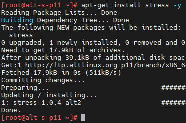
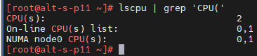
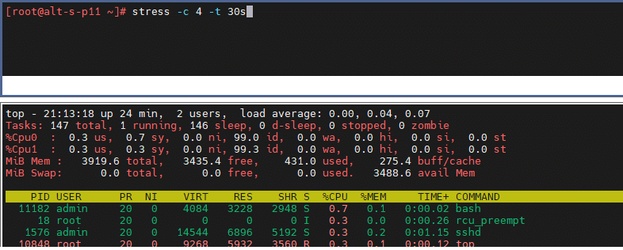
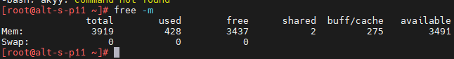
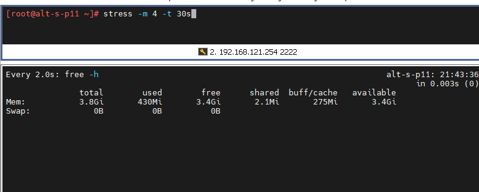
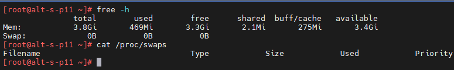
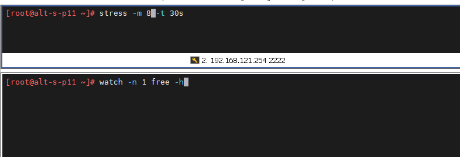
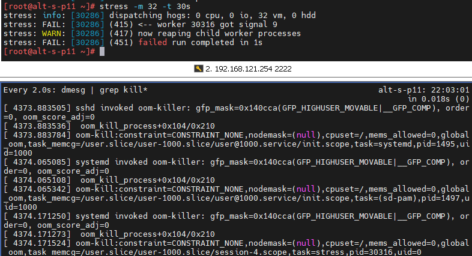
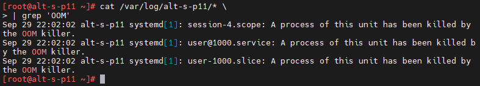

# Лабораторная работа 4.«`Мониторинг работы системы`» `Скворцов Денис`

### Задание 4.1. Установка и знакомство с утилитой stress
* Задание выполняется в контексте безопасности суперпользователя
* Поставьте утилиту `stress` средствами менеджера зависимостей
  * Утилита предназначена для создания нагрузки на систему. В следующих заданиях мы будем использовать ее для эмуляции стрессовой нагрузки и отслеживания данной нагрузки инструментами мониторинга.

```bash
# apt-get install stress
```

* Ознакомьтесь со встроенной справкой по его использованию
```bash
$ man stress
$ stress --help
```
---
### Задание 4.2. Создание нагрузки по процессору
*Задание выполняется в контексте безопасности суперпользователя*
1. Продолжайте выполнять задание в той же ВМ, в которой делали предыдущее
2. При помощи утилиты `lscpu` определите количество доступных процессорных ядер в вашей системе

```bash
# lscpu
```


3. Запустите утилиту `stress` c опциями для создания 2 процессов, каждый из которых интенсивно (полностью) использует CPU на 30 секунд
```bash
# stress -c 4 -t 30s &
```
4. Средствами мониторинга top оцените создаваемую нагрузку
```bash
# top
```


5. Сколько процессов `stress` вы видите, какую нагрузку на процессор создает каждый из них? 
`на 2 CPU *для 4-х процессов по 50% нагрузки*`
6. Как бы выглядела загрузка CPU при данном вызове `stress` для случая систе мы с 1 ядром CPU, 2 ядер, 4 ядер?
`на 1 CPU *для 4-х процессов  по 25% нагрузки* `
`на 4 CPU *для 4-х процессов  по 100% нагрузки* `
7. Дождавшись завершения 30-секундного интервала создаваемой нагрузки убедитесь, что `stress` больше не потребляет ресурсов процессора
8. Завершите работу с утилитой top при помощи комбинации `Ctrl-C`
---
###  Задание 4.3. Создание нагрузки по памяти
*Задание выполняется в контексте безопасности суперпользователя*
1. Продолжайте выполнять задание в той же ВМ, в которой делали предыдущее
2. При помощи утилиты free определите текущее распределение памяти в вашей системе

```bash
# free -m
```



3. Запустите утилиту `stress` с опциями для создания 2 процессов интенсивно использующих память на 30 секунд
```bash
# stress -m 4 -t 30s &
```

4. При помощи утилиты free определите текущее распределение памяти в вашей системе

```bash
# watch free -m
```



---
### Задание 4.4. Отключение подкачки страниц (свопинга)
*Задание выполняется в контексте безопасности суперпользователя*
1. Продолжайте выполнять задание в той же ВМ, в которой делали предыдущее
2. Посмотрите текущие используемые своп-разделы
```bash
$ cat /proc/swaps
```
3. Отключите механизм подкачки страниц в системе
```bash
# swapoff -a
```
4. Посмотрите текущие используемые своп-разделы
```bash
# cat /proc/swaps
```
5. Убедитесь, что система более не использует механизм подкачки страниц



---
###  Задание 4.5. Создание сверх-нагрузки по памяти
*Задание выполняется в контексте безопасности суперпользователя*
1. Продолжайте работу в той же ВМ, в которой вы ранее отключили свопинг
2. Запустите утилиту `stress` опциями для создания 8 процессов интенсивно использующих память на 30 секунд

```bash
# stress -m 8 -t 30s
```


3. Вы должны увидеть действие OOM (Out of Memory) killer
4. Проследите действие OOM killer по `dmesg` и журналам

```bash
# stress -m 32 -t 30s
```

```bash
# dmesg
# journalctl -xe
```
5. Обратите внимание на сообщения об исчерпании памяти и действию OOM по завершению процессов, потребляющих память

 

---