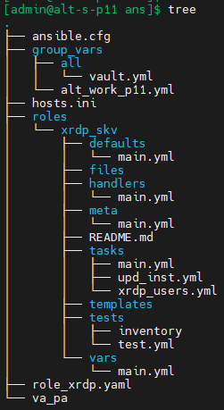
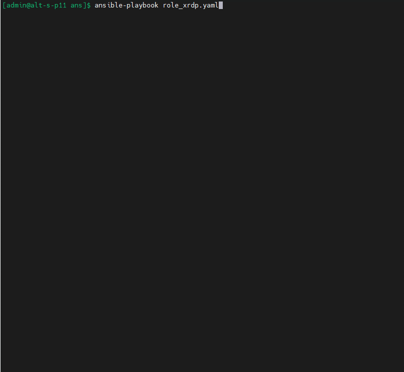

# Набор удачных команд для Лабораторной работы 4
###### имхо

### Оформление лабараторной работы и подготовка подключения
```bash
mkdir -p ~/altlinux/adm \
&& cd ~/altlinux/adm

git init

git config --global user.email "shoelacevip21@gmail.com"

git config --global user.name "shoelacevip12"

git config --global --add safe.directory .

git remote add altlinux https://github.com/shoelacevip12/altlinux_study.git

git pull altlinux main

git log --oneline

git branch -M main

mkdir adm3 \
&& cd !$

touch alt_adm3_lab4_commands.md

mkdir lab4 \
&& cd !$ \
&& mkdir img \
&& touch README.MD

sudo bash -c "virsh net-start --network vagrant-libvirt \
&& virsh start altlinux_altlinux_install \
&& virsh start altlinux_empty_vm"

git status

git add .. .

git log --oneline

git commit -am "Обновление_для_след_модул_обучения"

git status

git push -u altlinux main
```
#### После оформения
##### Подготовка Управляющего узла
```bash
# Подключение к Управляющему узлу
ssh -o "ProxyCommand=ssh -i ~/.ssh/id_kvm_host -W %h:%p shoel@shoellin" \
-i ~/.ssh/id_vm admin@192.168.121.2

# Вход под суперпользователем
su -

# Генерация ключей для общения Управляемого и Управляющего узлов
ssh-keygen -t ed25519 \
-f ~/.ssh/id_xrdp_host \
-C "xrdp_host-access-key"

# Отправка ключа на Управляемый хост
ssh-copy-id -i ~/.ssh/id_xrdp_host.pub \
sadmin@192.168.121.4

# Проверка соединения в виде вывода имени с Управляемого хоста
ssh -i ~/.ssh/id_xrdp_host \
sadmin@192.168.121.4 \
"hostname"

# Дублирование пары открытого\закрытого ключа с суперпользователя
# на пользователя с котрого будем производить действия ansible
cp ~/.ssh/id_xrdp_host* \
/home/admin/.ssh/ \
&& chown admin:admin \
/home/admin/.ssh/id_xrdp_host* \
&& chmod 600 /home/admin/.ssh/id_xrdp_host*

# проверка связи выхода в интернет
ping -c 3 ya.ru

# Обновление и установка необходимых пакетов Управляющему узлу
apt-get update \
&& update-kernel -y \
&& apt-get dist-upgrade -y \
&& apt-get install ansible sshpass -y \
&& apt-get autoremove -y \
&& systemctl reboot
```
##### Подготовка Управляемого узла
```bash
# Подключение к Управляемому узлу
ssh -o "ProxyCommand=ssh -i ~/.ssh/id_kvm_host -W %h:%p shoel@shoellin" \
-i ~/.ssh/id_vm sadmin@192.168.121.4

# Вход под суперпользователем
su -

# Прописываем публичный ключ для доступа 
# к суперпользователю по ssh на Управляемом узле
cat /home/sadmin/.ssh/authorized_keys \
>> ~/.ssh/authorized_keys

# проверка связи выхода в интернет
ping -c 3 ya.ru

# Обновление и установка необходимых пакетов Управляемому узлу
apt-get update \
&& apt-get install \
python3 \
python3-module-yaml \
python3-module-jinja2 \
python3-module-json5 -y \
&& systemctl reboot
```
### Выполнение работы
##### Подготовка Управляющего узла для подключения без запросов пароля по ssh
```bash
# Подключение к Управляющему узлу
ssh -o "ProxyCommand=ssh -i ~/.ssh/id_kvm_host -W %h:%p shoel@shoellin" \
-i ~/.ssh/id_vm admin@192.168.121.2

# Запускаем  программу-менеджер SSH-ключей (ssh-agent)
# В текущей сессии shell (eval)
# Добавляет приватный ключ из файла в запущенный ssh-agent для хранения ключа в памяти (ssh-add)
# В дальнейшем предоставляется для аутентификации при подключении
# Без пароля к ключу если был задан
eval $(ssh-agent) \
&& ssh-add ~/.ssh/id_xrdp_host
```
##### Настройка конфигурации ansible
```bash
# Создание каталога проекта
mkdir ans \
&& cd !$

# Создаем конфигурацию ansible со всеми отключенными(выставленными по умолчанию) параметрами 
ansible-config init --disabled -t all > ./ansible.cfg

# Выставляем домашний каталог проекта текущий каталог "./"
sed -i 's|;home=~/.ansible|home=./|' ansible.cfg \
&& grep "home=./" ansible.cfg

# Выставляем автоматический запуск ssh-agent при подключении к узлам
sed -i 's|;ssh_agent=.*|ssh_agent=auto|' ansible.cfg  \
&& grep "ssh_agent=" ansible.cfg

# Отключаем запрос fingerprints при подключении по ssh к Управляемым хостам
sed -i 's|;host_key_checking.*|host_key_checking=False|' ansible.cfg \
&& grep "host_key_checking=" ansible.cfg

# Создаем папку расположения ролей проекта
mkdir roles

# Выставляем папку расположения ролей проекта "./roles"
sed -i 's|;roles_path=\/.*|roles_path=./roles|' ansible.cfg \
&& grep "roles_path=" ansible.cfg

# Создаем файл Управляемых хостов
cat >  ~/ans/hosts.ini << 'EOF'
[alt_work_p11]
# 192.168.121.[4:6]
192.168.121.4
EOF

# Выставляем ранее созданный файл Управляемых хостов как по умолчанию
sed -i 's|;inventory=\[.*\]|inventory=./hosts.ini|' ansible.cfg \
&& grep "inventory=" ansible.cfg

# Создаем папки и файлы куда будут прописаны переменные для проекта в этой папке:
# ./group_vars/alt_work_p11.yml - для группы управляемых хостов [alt_work_p11]
# group_vars/all папка с переменными для всех хостов проекта
mkdir -p  group_vars group_vars/all \
&& touch  group_vars/alt_work_p11.yml

# Генерация пароля (pwqgen) и запись значения в файл 
# для доступа к зашифрованному файлу переменных vault.yml
# Создание зашифрованного файла vault.yml с паролями
# и переход сразу к редактированию
tee ./va_pa <<< $(pwqgen) \
&& EDITOR=nano \
ansible-vault create \
--vault-password-file ./va_pa \
~/ans/group_vars/all/vault.yml

# Выставляем ранее созданный файл с паролем доступа как по умолчанию ко всем зашифрованным файлам
# Для исключения применения переменной "-vault-password-file ./va_pa" при каждом запуске playbook`а
sed -i 's|;vault_password_file=*|vault_password_file=./va_pa|' ansible.cfg \
&& grep "vault_password_file=" ansible.cfg

```
##### Команда вызова редактирования файла с паролями
```bash
EDITOR=nano \
ansible-vault edit \
~/ans/group_vars/all/vault.yml
```
##### Создание роли
```bash
# Генерация шаблона(файлов и папок) роли в папку ./roles 
ansible-galaxy init roles/xrdp_skv

# Создание файла переменных применимых для группы хостов [alt_work_p11]
# Переназначаем стандартные переменные ansible_* на:
# на расположение приватного файла ключа для подключения по ssh
# Исполняемым интерпретатор на управляемых хостах при выполнений модулей ansible
# Имя удаленной учетной записи для подключения
# пароль для входа под суперпользователя на управляемом хосте
cat > ~/ans/group_vars/alt_work_p11.yml<< 'EOF'
ansible_ssh_private_key_file: "~/.ssh/id_xrdp_host"
ansible_python_interpreter: "/usr/bin/python3"
ansible_user: "{{ su_wheel_user }}"
ansible_become_password: "{{ su_password }}"
EOF

# Создание файла переменных по умолчанию с указанием:
# группы пользователей для на управляемом хосте
cat > ~/ans/roles/xrdp_skv/defaults/main.yml<< 'EOF'
---
xrdp_groups: 
  - tsusers
  - users
EOF

# Создание файла переменных в виде словаря с указанием:
# Переменной в виде списка пользователей xrdp_users:
# Значением переменной имени пользователей xrdpuser_№ (item.key)
# Присвоение каждому пользователю свое значение переменной password (item.value.password)
cat > ~/ans/roles/xrdp_skv/vars/main.yml<< 'EOF'
---
# Список пользователей и их пароли
xrdp_users:
  xrdpuser_1:
    password: "{{ password1 }}"
  xrdpuser_2: 
    password: "{{ password2 }}"
  xrdpuser_3:
    password: "{{ password3 }}"
  xrdpuser_4:
    password: "{{ password4 }}"
EOF
```
##### Создание playbook
```bash
# Создание файла основной логики выполняемого процесса playbook
# На который мы будем ссылаться при использовании команды ansible-playbook
# c указанием:
# 1. на какой группе хостов будет выполнено действие
# 2. Вход под суперпользователем (become: yes)
# 3. Методы авторизации под суперпользователем
# 4. Сбор дополнительных переменных(фактов) для взаимодействия с группой хостов
# 5. Указанием списка ролей где название берется из названия каталога ./roles/xrdp_skv
cat > ~/ans/role_xrdp.yaml<< 'EOF'
---
- name: Установки RDP-сервера в ОС Альт
  hosts: alt_work_p11
  become: yes
  become_method: su
  become_user: root
  gather_facts: yes

  # vars_prompt:
  #   - name: "su_password"
  #     prompt: "Введите пароль для su (пользователя {{ ansible_user }})"
  #     private: yes

  roles:
    - xrdp_skv
EOF
```
##### Создание Задач
```bash
# Редактируем шаблон файла с задачами к которому идет первое обращение
# При запуске роли ../tasks/main.yml
# Создано обращение к отдельным файлам задач
cat > ~/ans/roles/xrdp_skv/tasks/main.yml << 'EOF'
---
- name: Обновление пакетов и установка xrdp
  include_tasks:
    file: upd_inst.yml

- name: Создание пользователей RDP
  include_tasks:
    file: xrdp_users.yml
EOF

# Создание файла с отдельными задачами к которому идет обращение в ../tasks/main.yml
# 1. Обновление списка пакетов и обновление установленных программ
# 2. Установка пакета glibc на случай отсутствия /usr/sbin/ldconfig
# 3. Обновление ядра системы с указанием 
# /usr/sbin в переменной окружения PATH для суперпользователя на удаленном хосте
# 4. Удаление пакета xrdp для тестового прогона
# 5. Установка пакета xrdp и обращение (notify) к обработчику если будут изменения
cat > ~/ans/roles/xrdp_skv/tasks/upd_inst.yml << 'EOF'
---
- name: Обновление пакетов
  apt_rpm:
    update_cache: true
    dist_upgrade: true

- name: Установка glibc для обновления ядра через Ansible
  apt_rpm:
    name: 
      - glibc
    state: installed

- name: Обновление ядра
  apt_rpm:
    update_kernel: true
  environment:
    PATH: "{{ ansible_env.PATH }}:/usr/sbin"
  ignore_errors: yes

- name: удаление для теста xrdp
  apt_rpm:
    name: 
      - xrdp
    state: absent

- name: Установка xrdp
  apt_rpm:
    name: 
      - xrdp
    state: installed
    # clean: true
  notify: start_xrdp_alt
EOF

# Создание файла с отдельными задачами к которому идет обращение в ../tasks/main.yml
# 1. Удаляем пользователей для теста
# 2. Установка пакета glibc на случай отсутствия /usr/sbin/ldconfig
# 3. Обновление ядра системы с указанием 
# /usr/sbin в переменной окружения PATH для суперпользователя на удаленном хосте
# 4. Удаление пакета xrdp для тестового прогона
# 5. Установка пакета xrdp и обращение (notify) к обработчику если будут изменения
cat > ~/ans/roles/xrdp_skv/tasks/xrdp_users.yml << 'EOF'
---
# - debug:
#     var: xrdp_groups

- name: Удаление пользователей для теста
  user:
    name: "{{ item.key }}"
    state: absent
    remove: yes
  loop: "{{ xrdp_users | dict2items }}"
  no_log: true

- name: Создание пользователей xrdp-seasman
  user:
    name: "{{ item.key }}"
    password: "{{ item.value.password | password_hash('sha512') }}"
    groups: "{{ xrdp_groups }}"
    append: yes
  loop: "{{ xrdp_users | dict2items }}"
  no_log: true

- name: Добавление пользователей sadmin xrdp-seasman
  user:
    name: "{{ ansible_user }}"
    groups: "{{ xrdp_groups }}"
    append: yes
  no_log: true
EOF

# Редактируем шаблон файла роли с обработчиками ../handlers/main.yml
# к которому идет разовое обращение: 
# 1. При вызове notify в задачах c указанием именем обработчика(name) или значения listen
# 2. После отработки всех задач 
# или при использовании meta: flush_handlers после конкретной задачи
# Производим:
# перезапуск служб по списку
# Выставление в автозагрузку
# Исключение из маскирования(блокировок) службы
cat > ~/ans/roles/xrdp_skv/handlers/main.yml << 'EOF'
---
- name: Запуск xrdp alt обработчиком
  systemd:
    name: "{{ item }}"
    state: started
    enabled: yes
    masked: no
  loop:
    - xrdp
    - xrdp-sesman
  listen: start_xrdp_alt
EOF
```


### Окончание Оформления лабораторной работы 4 и отправка на github
```bash
# Выходим с Управляющего хоста
exit

# Копируем проект с Управляющего хоста
cd ~/altlinux/adm/adm3/lab4

rsync \
-e "ssh -i ~/.ssh/id_vm" \
-aP admin@192.168.121.2:~/ans/* .

# Подготовка на отправку на github
git status

git add . .. ../.. \
&& git status

git log --oneline

git commit -am "для 4-ей лабы_adm4_END_1" \
&& git push -u altlinux main
```
