# «`Настройка локального стенда ОС Альт`»
### памятка для входа на машины локальной сети
```bash
# включаем агента и запущенному процессу регистрируем используемые ключи
eval $(ssh-agent) \
&& ssh-add ~/.ssh/id_vm \
&& ssh-add  ~/.ssh/id_kvm_host_to_vms

# вход через шлюз 192.168.121.2 как прокси на машину локальной сети 10.10.10.241
ssh -i ~/.ssh/id_kvm_host_to_vms \
-o "ProxyJump sadmin@192.168.121.2" \
-i ~/.ssh/id_vm sadmin@10.10.10.241
```

### Предварительно

##### Для github
```bash
cd ~/altlinux/adm

git init

git config --global user.email "shoelacevip21@gmail.com"

git config --global user.name "shoelacevip12"

git config --global --add safe.directory .

git remote add altlinux https://github.com/shoelacevip12/altlinux_study.git

git log --oneline

git pull altlinux main
```
дистрибутивы для платформы x86_64
- Альт Сервер
- Альт Рабочая станция
- [>>Дистрибутивы установки<<](https://getalt.org)
  - [>>Alt p11 server 11.0<<](https://download.basealt.ru/pub/distributions/ALTLinux/p11/images/server/x86_64/alt-server-11.0-x86_64.iso)
  - [>>Alt p11 рабочая станция 11.1<<](https://download.basealt.ru/pub/distributions/ALTLinux/p11/images/workstation/x86_64/alt-workstation-11.1-x86_64.iso)
##### Создаем в среде виртуализации libvirt 5 виртуальных машины с характеристиками
- 3Гб ОЗУ
- 2 ядро CPU
- 1 сетевой интерфейс (типа bridge) для 1 из ВМ
- 1 сетевой интерфейс типа isolated для всех ВМ
- Диск размером 40 Гб
- Подсоединяем к ВМ ISO-образы с дистрибутивом Альт Сервера\Рабочая станция

```bash
mkdir amd4

cd !$

mkdir -p lab1/img

wget -P \
~/iso/ \
https://download.basealt.ru/pub/distributions/ALTLinux/p11/images/server/x86_64/alt-server-11.0-x86_64.iso
wget -P \
~/iso/ \
https://download.basealt.ru/pub/distributions/ALTLinux/p11/images/workstation/x86_64/alt-workstation-11.1-x86_64.iso
```
##### Создаем файл vagrant для автоматического создания ВМ в количестве 5 шт
```bash
cat>vagrantfile<<'OEF'
# -*- mode: ruby -*-
# vi: set ft=ruby :

Vagrant.configure("2") do |config|

  # Путь к ISO образу ALT Linux p11
  altlinux_iso_path_s = "/home/shoel/iso/alt-server-11.0-x86_64.iso"
  altlinux_iso_path_w = "/home/shoel/iso/alt-workstation-11.1-x86_64.iso"

  # Общие настройки для провайдера libvirt
  config.vm.provider :libvirt do |libvirt|
    libvirt.driver = "kvm"
    libvirt.uri = 'qemu:///system'
    libvirt.memory = 3072
    libvirt.cpus = 2
    libvirt.nested = true
    libvirt.disk_driver :cache => 'none'
    libvirt.disk_bus = "virtio"
    libvirt.nic_model_type = "virtio"
    libvirt.storage :file, :size => '40G', :type => 'qcow2'
    libvirt.boot 'hd' # Загрузка с жесткого диска
    libvirt.boot 'cdrom' # Загрузка с CDROM (вторая опция)
    libvirt.management_network_name = "vagrant-libvirt"
    libvirt.management_network_mode = "route"
    # libvirt.management_network_mode = "none" # Альтернатива route, если dhcp_enabled не срабатывает
    libvirt.management_network_guest_ipv6 = "no"
  end

  # --- Создание 3 ВМ для altlinux_s ---
  # Цикл для создания трёх одинаковых серверных ВМ
  # Все они будут использовать одну и ту же сеть 's_private_network'
  (1..3).each do |i|
    config.vm.define "altlinux_s#{i}" do |node_2|
      node_2.vm.hostname = "altlinux-s#{i}" # Устанавливаем имя хоста для ВМ
      node_2.vm.communicator = "none" # Отключаем стандартный communicator (SSH), так как используется ISO

      # Настройки сети: только private_network
      node_2.vm.network "private_network",
                             libvirt__network_name: "s_private_network", # Имя создаваемой сети
                             libvirt__forward_mode: "none", # Режим маршрутизации
                             libvirt__dhcp_enabled: false  # Отключаем DHCP в этой сети

      # Настройки провайдера libvirt для конкретной ВМ
      node_2.vm.provider :libvirt do |libvirt|
        libvirt.storage :file, :device => :cdrom, :path => altlinux_iso_path_s
      end

      # Заглушка для provisioner (не запускается)
      node_2.vm.provision "shell", inline: "echo 'altlinux_s#{i} VM created.'", run: "never"
    end
  end

  # --- Создание 2 ВМ для altlinux_w ---
  # Цикл для создания двух одинаковых desktop ВМ
  # Все они будут использовать одну и ту же сеть 's_private_network'
  (1..2).each do |i|
    # --- Создание 2 ВМ для altlinux_w ---
    config.vm.define "altlinux_w#{i}" do |node_3|
      # Исправлено: имя хоста должно зависеть от переменной цикла i
      node_3.vm.hostname = "altlinux-w#{i}"
      node_3.vm.communicator = "none"
      # Настройки сети: только private_network
      node_3.vm.network "private_network",
                            libvirt__network_name: "s_private_network",
                            libvirt__forward_mode: "none",
                            libvirt__dhcp_enabled: false

      node_3.vm.provider :libvirt do |libvirt|
        libvirt.storage :file, :device => :cdrom, :path => altlinux_iso_path_w
        
      end
      node_3.vm.provision "shell", inline: "echo 'altlinux_w#{i} VM created.'", run: "never"
    end
  end
end
OEF

vagrant up --no-destroy-on-error

sudo virsh list --all
```
##### Принудительная остановка машин и удаление секции DHCP libvirt в созданных сетях
```bash
sudo virsh list --all

# Остановка всех ВМ содержащих "nux" 
sudo bash -c \
"for i in \$(virsh list --all \
| awk '/nux/ {print \$1}'); do \
virsh destroy \$i; done"

sudo virsh net-list --all

# Остановка всех сетей Libvirt начиная со 2ого по списку
sudo virsh net-list --all \
| awk 'NR > 3 {print $1}' \
| xargs -I {} sudo virsh net-destroy {}

# Запуск редактора сети vagrant-libvirt для выхода в интернет
sudo virsh net-edit --network vagrant-libvirt

# экспорт настроек созданных сетей Libvirt
sudo virsh net-dumpxml vagrant-libvirt \
> ./mngt_net.xml

sudo chmod 777 !$

sudo virsh net-dumpxml s_private_network \
> ./s_private_network.xml

sudo chmod 777 !$
```
```xml
<network>
  <name>vagrant-libvirt</name>
  <uuid>5cb32edc-2eeb-4054-a4a3-e66c54106877</uuid>
  <forward mode='route'/>
  <bridge name='virbr1' stp='on' delay='0'/>
  <mac address='52:54:00:b6:12:f7'/>
  <ip address='192.168.121.1' netmask='255.255.255.0'>
  </ip>
</network>
```
```xml
<network connections='2' ipv6='yes'>
  <name>s_private_network</name>
  <uuid>41af5786-fff1-4621-9746-c525cbc0bcf9</uuid>
  <bridge name='virbr2' stp='on' delay='0'/>
  <mac address='52:54:00:43:f4:0a'/>
</network>
```
##### Удаление постоянного интерфейса со всех виртуальных машин кроме adm4_altlinux_w2
```bash
# определяем список виртуальных машин поименно
sudo bash -c \
"virsh list --all \
| awk '/nux/ && !/x_w2/ {print \$2}'"

# определяем мак адреса интерфейсов для отключения
sudo bash -c \
"virsh list --all \
| awk '/nux/ && !/x_w2/ {print \$2}' \
| xargs -I {} virsh dumpxml {} \
| grep -B1 vagrant-libvir" \
| sed -n "s/.*<mac address='\([^']*\)'.*/\1/p"

# поочередное удаление интерфейсов выхода в интернет 
sudo virsh detach-interface \
adm4_altlinux_s1 \
--type network \
--mac 52:54:00:fa:48:ad \
--config

sudo virsh detach-interface \
adm4_altlinux_s2 \
--type network \
--mac 52:54:00:81:6e:fb \
--config

sudo virsh detach-interface \
adm4_altlinux_s3 \
--type network \
--mac 52:54:00:8b:0b:c9 \
--config

sudo virsh detach-interface \
adm4_altlinux_w1 \
--type network \
--mac 52:54:00:1c:86:b6 \
--config

# Экспорт настроек созданных ВМ
sudo bash -c \
"for i in \$(virsh list --all \
| awk '/nux/ {print \$2}') ; do \
virsh dumpxml \$i \
> \$i.xml; done"

sudo chmod 777 *.xml
```
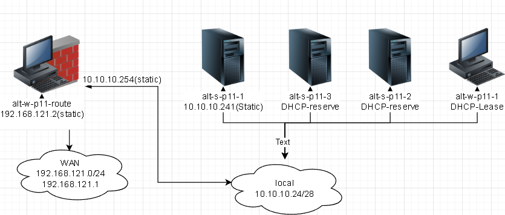
##### Запуск отредактированной сети, виртуальных машин
```bash
# поочередный запуск всех сетей libvirt со 2ого по списку
sudo virsh net-list --all \
| awk 'NR > 3 {print $1}' \
| xargs -I {} sudo virsh net-start {}

# поочередный запуск всех ВМ содержащих "nux"
sudo bash -c \
"for i in \$(virsh list --all \
| awk '/nux/ {print \$2}') ; do \
virsh start --domain \$i; done"

# добавление статического маршрута с хостовой машины до изолированной сети между ВМ
sudo ip route \
add 10.10.10.240/28 \
via 192.168.121.2 \
dev virbr1
```

##### Ручная установка ОС Альт рабочая станция.

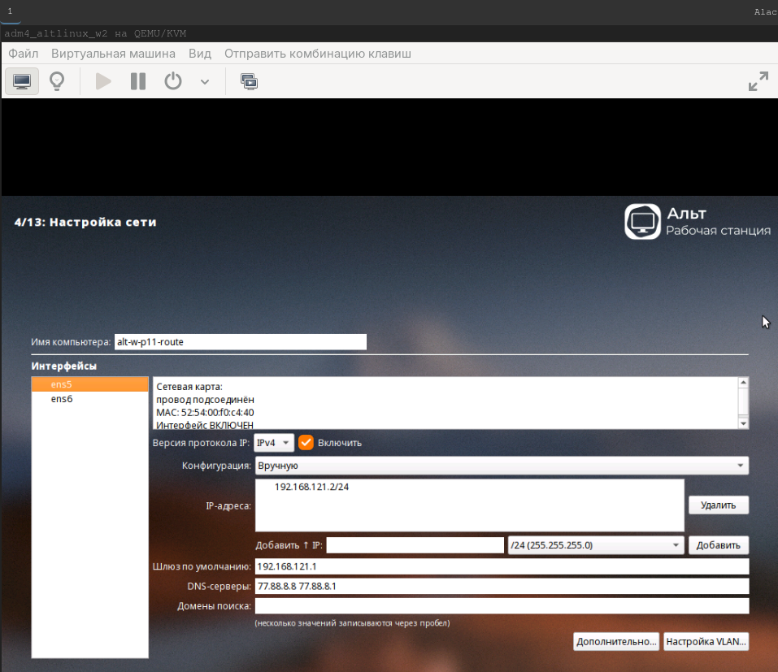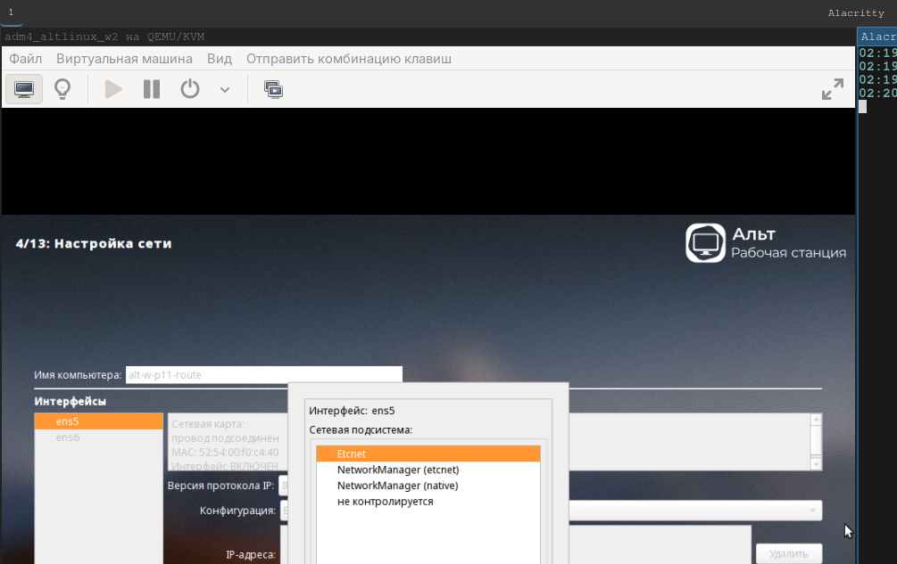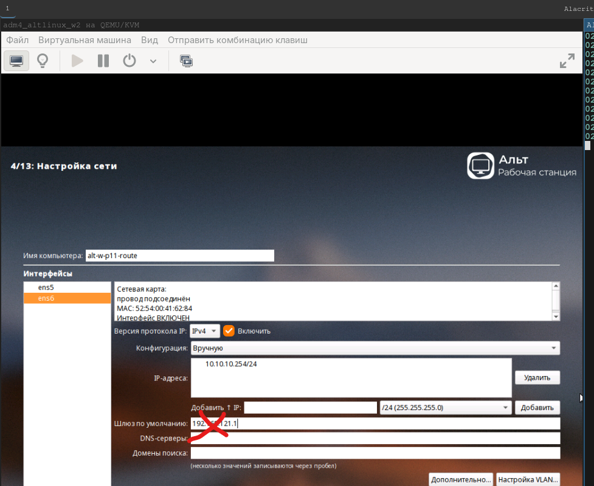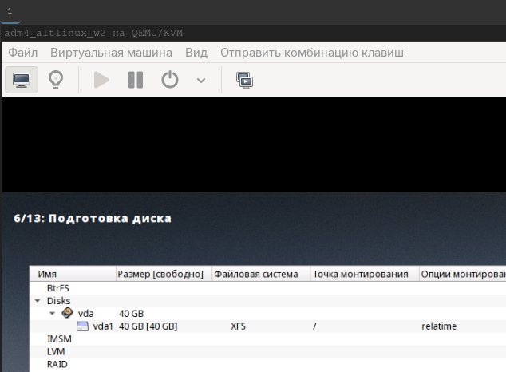

##### для других машин
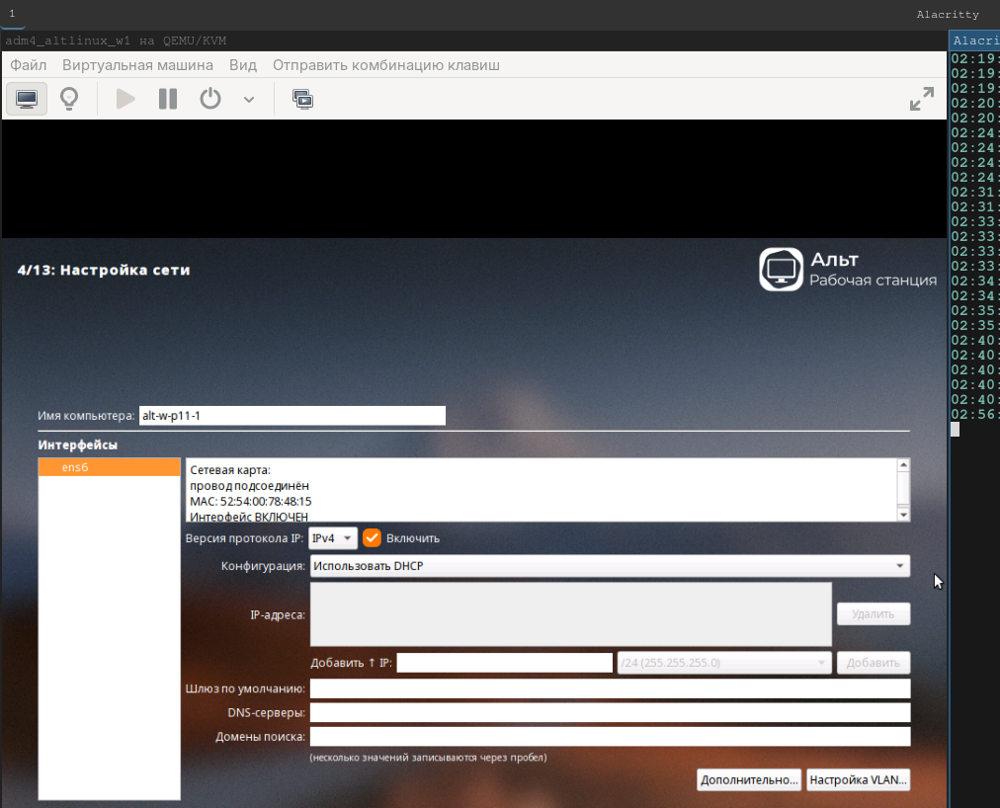

##### Ручная установка ОС Альт Сервер.

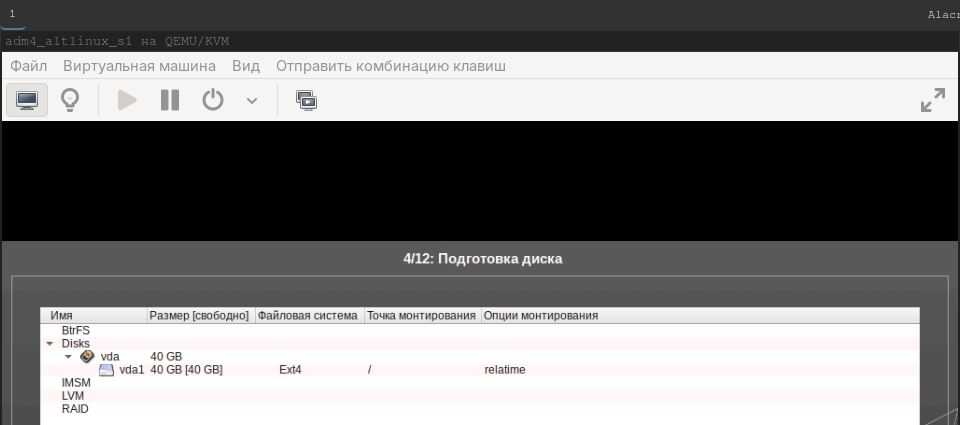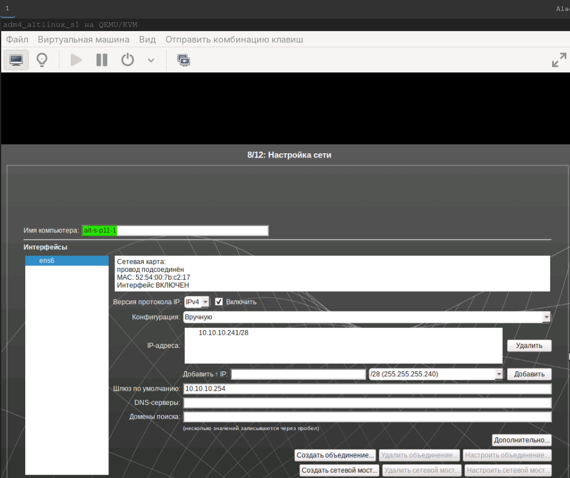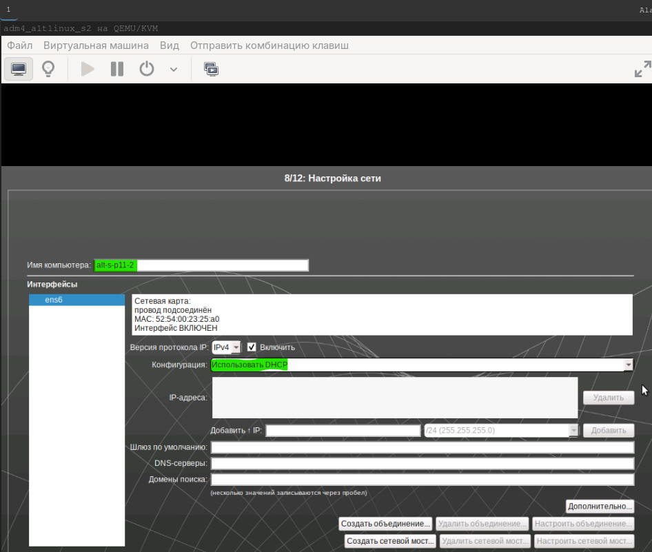


##### Организация NAT – маршрутизации на узле с 2мя сетевыми интерфейсами
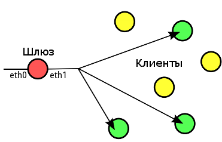

```bash
su -

# Отключение из автозагрузки служб для графического взаимодействия
systemctl isolate multi-user.target
systemctl set-default multi-user.target

runlevel

# включение внутренней маршрутизации пакетов между интерфейсами
sed -i 's/rd\ =\ 0/rd\ =\ 1/' \
/etc/net/sysctl.conf

systemctl restart network

# обновление системы и установка пакетов для nat-маршрутизации
apt-get update \
&& update-kernel -y \
&& apt-get dist-upgrade -y \
&& apt-get install -y \
nftables

# Включаем и добавляем в автозагрузку службу nftables:
systemctl enable --now nftables

# Создаём необходимую структуру для nftables (семейство, таблица, цепочка) для настройки NAT:
nft add table ip nat
nft add chain ip nat postrouting '{ type nat hook postrouting priority 0; }'
nft add rule ip nat postrouting ip saddr 10.10.10.240/28 oifname "ens5" counter masquerade

# Сохраняем правила nftables
nft list ruleset \
| tail -n6 \
| tee -a /etc/nftables/nftables.nft

systemctl reboot

su -

nft list ruleset
```
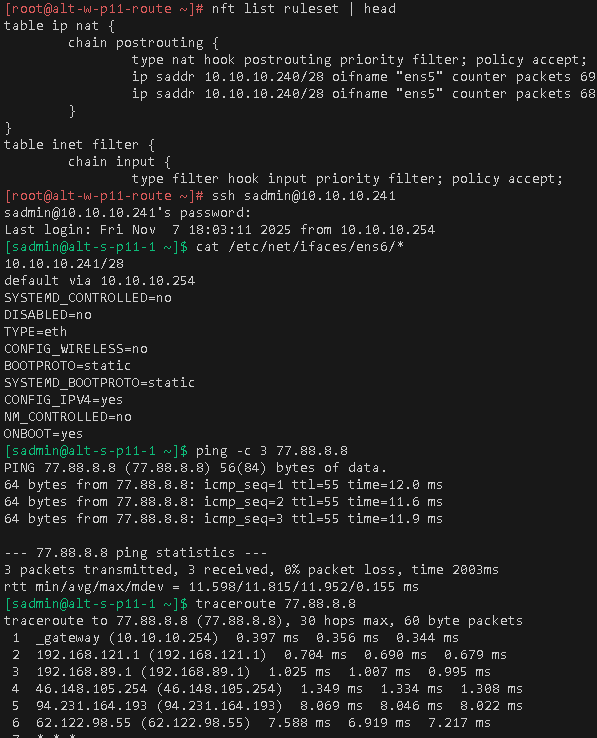

##### Организовываем подключение к серверному узлу
```bash
# создаем ключ для подключения к шлюзу
ssh-keygen -t ed25519 \
-f ~/.ssh/id_kvm_host_to_vms \
-C "kvm-host_access_to_vms"

# создаем ключ для подключения к виртуальным машинам
ssh-keygen -t ed25519 \
-f ~/.ssh/id_vm \
-C "vm-access-key"

# проброс ключа до шлюза
ssh-copy-id \
-i ~/.ssh/id_kvm_host_to_vms.pub \
sadmin@192.168.121.2

# проброс ключа до виртуальных машин через шлюз как прокси-сервер
ssh-copy-id \
-i ~/.ssh/id_vm.pub \
-o "ProxyJump sadmin@192.168.121.2" \
sadmin@10.10.10.241

# Включаем агента в текущей оснастке и прописываем в базу агента созданные и переправленные ключи
eval $(ssh-agent) \
&& ssh-add ~/.ssh/id_vm \
&& ssh-add  ~/.ssh/id_kvm_host_to_vms

# вход через шлюз 192.168.121.2 как прокси на виртуальные машины локальной сети
# сервер DHCP
ssh -i ~/.ssh/id_kvm_host_to_vms \
-o "ProxyJump sadmin@192.168.121.2" \
-i ~/.ssh/id_vm sadmin@10.10.10.241

exit

# libvirt выключение машины и создание snapshot
sudo virsh destroy \
--domain adm4_altlinux_s1 \
--graceful

sudo virsh snapshot-create-as \
--domain adm4_altlinux_s1 \
--name 1 \
--description "1" --atomic

sudo virsh destroy \
--domain adm4_altlinux_s2 \
--graceful

sudo virsh snapshot-create-as \
--domain adm4_altlinux_s2 \
--name 1 \
--description "1" --atomic

sudo virsh destroy \
--domain adm4_altlinux_s3 \
--graceful

sudo virsh snapshot-create-as \
--domain adm4_altlinux_s3 \
--name 1 \
--description "1" --atomic

sudo virsh destroy \
--domain adm4_altlinux_w1 \
--graceful

sudo virsh snapshot-create-as \
--domain adm4_altlinux_w1 \
--name 1 \
--description "1" --atomic

sudo virsh destroy \
--domain adm4_altlinux_w2 \
--graceful

sudo virsh snapshot-create-as \
--domain adm4_altlinux_w2 \
--name 1 \
--description "1" --atomic

# libvirt удаление snapshot
sudo virsh snapshot-delete \
adm4_altlinux_s1 \
--snapshotname 1

sudo virsh snapshot-delete \
adm4_altlinux_s2 \
--snapshotname 1

sudo virsh snapshot-delete \
adm4_altlinux_s3 \
--snapshotname 1
sudo virsh snapshot-delete \
adm4_altlinux_w1 \
--snapshotname 1

sudo virsh snapshot-delete \
adm4_altlinux_w2 \
--snapshotname 1
```
### ansible. Проектирование автоматизации
```bash
mkdir -p ~/altlinux/adm/adm4/ansible-automation

cp -r ~/altlinux/adm/adm3/lab4/* ~/altlinux/adm/adm4/ansible-automation

cd !$

rm -rf img README*

sed -i -e '/^[[:space:]]*\(#\|;\)/d' -e '/^[[:space:]]*$/d' ansible.cfg

# доступ до хранилища
EDITOR=nano \
ansible-vault edit \
./group_vars/all/vault.yml

# включаем агента и запущенному процессу регистрируем используемые ключи
eval $(ssh-agent) \
&& ssh-add ~/.ssh/id_vm \
&& ssh-add  ~/.ssh/id_kvm_host_to_vms
```
### в playbook меняем переменные vars на true\false для включения\отключения обновлений\установки дистрибутивов
```yaml
vars:
  install_soft: false # включаем(true)\выключаем(false) установку софта
  kernel_upd: false # включаем(true)\выключаем(false) обновление ядра
  dist_upd: false # включаем(true)\выключаем(false) только обновление кеша
```
### в hosts.ini комментируем или раскомментируем необходимые группы\хосты
```ini
[alt_p11:children]
; alt_p11_group0
alt_p11_group1
alt_p11_group2
```
запуск
```bash
ansible-playbook role_bind.yaml
```

##### Для github
```bash
cp ~/gited/.gitignore ../../.gitignore

git add . .. ../.. \
&& git status

git log --oneline

git commit -am "оформление для ADM4_upd_6" \
&& git push -u altlinux main
```