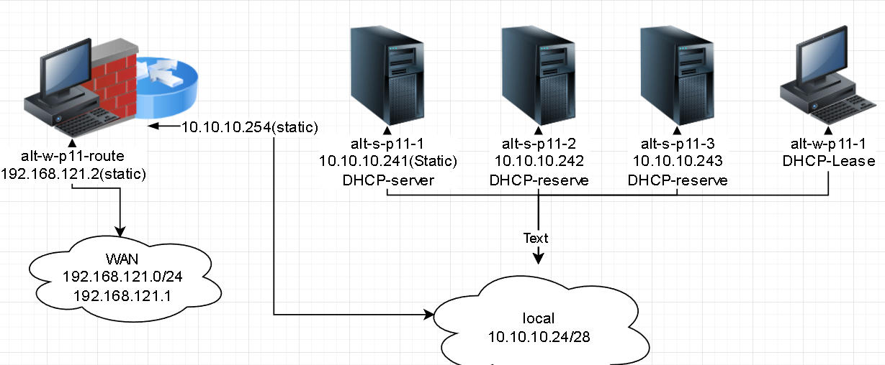
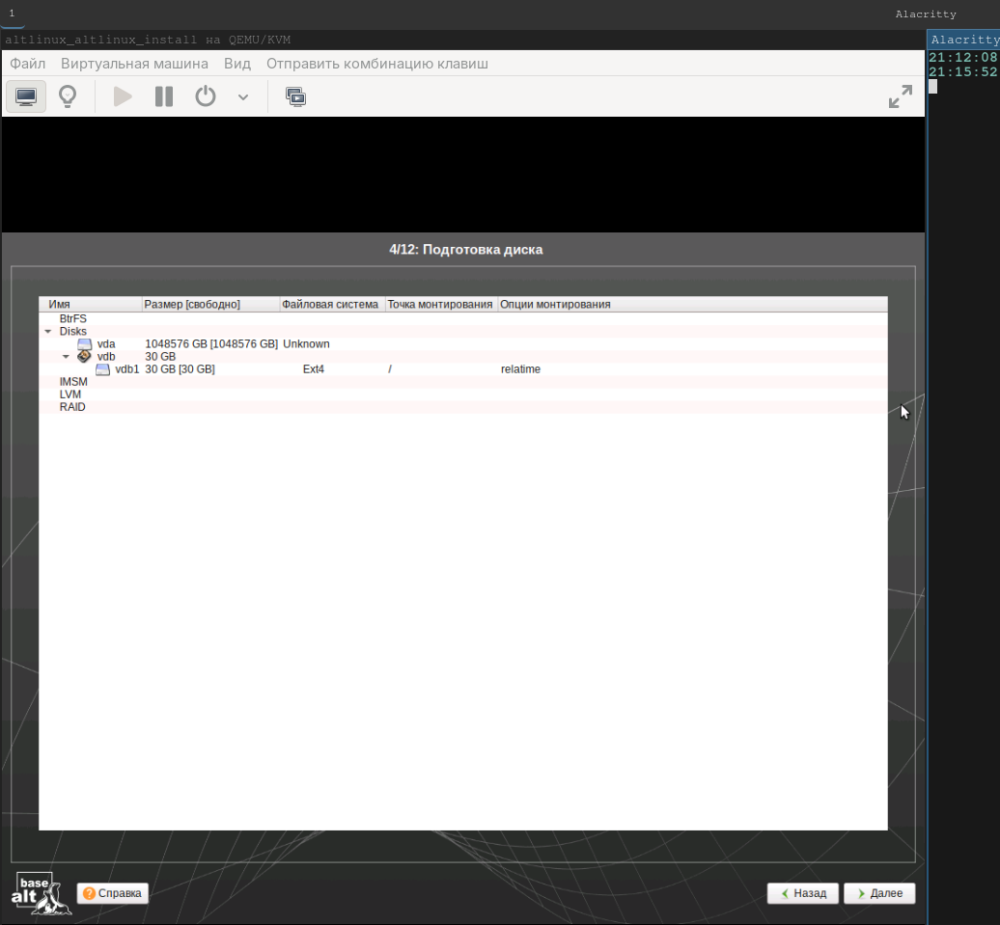
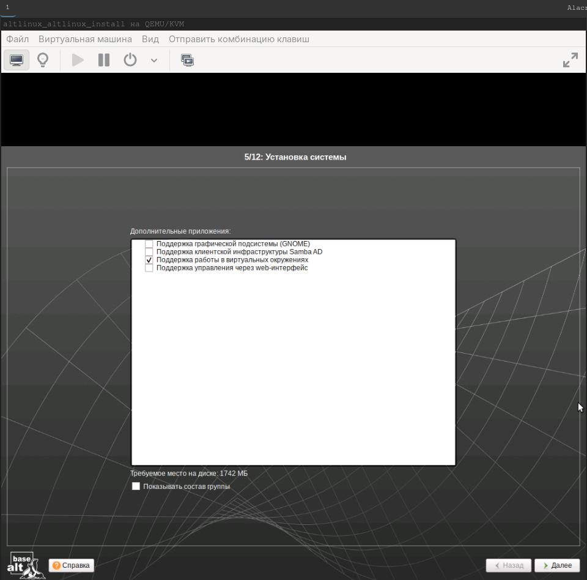
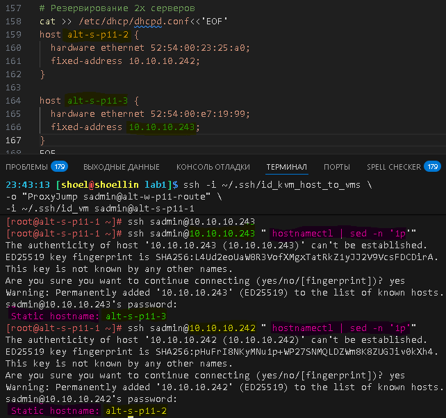
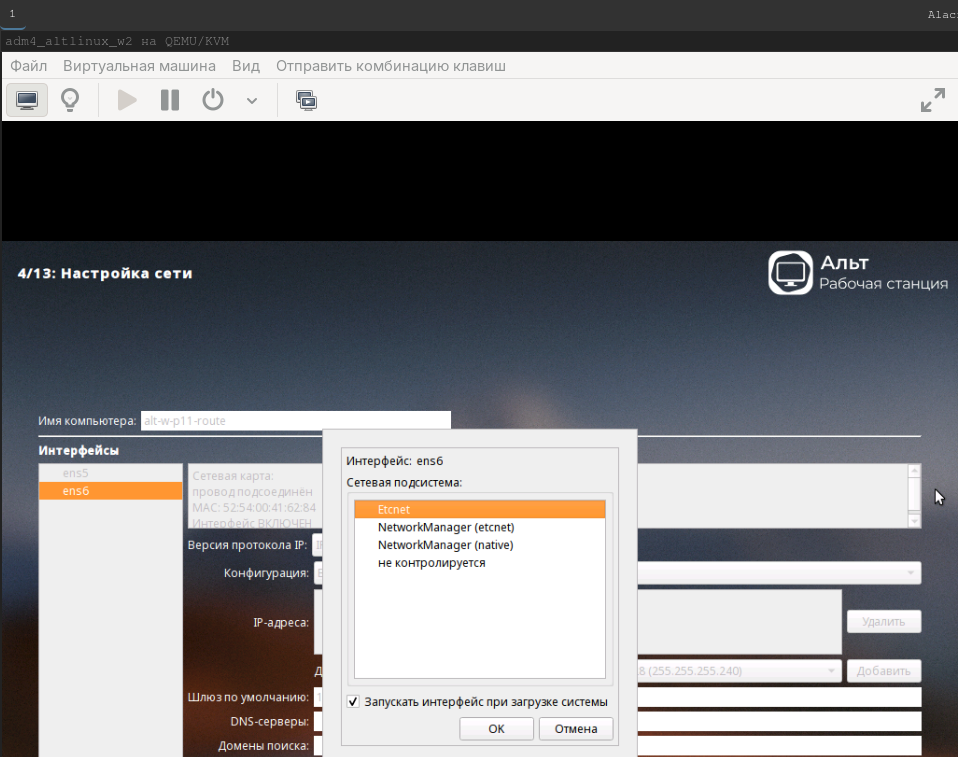
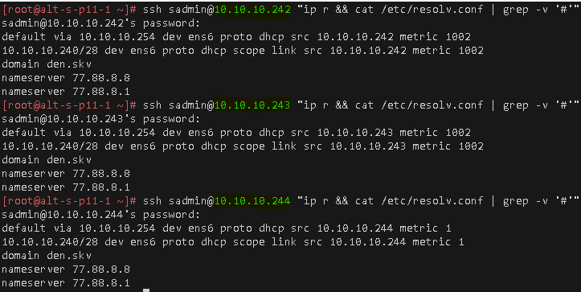

# Лабораторная работа 1 «`Настройка DHCP-сервера в ОС Альт`»
#### памятка для входа на машины локальной сети
```bash
# включаем агента и запущенному процессу регистрируем используемые ключи
eval $(ssh-agent) \
&& ssh-add ~/.ssh/id_vm \
&& ssh-add  ~/.ssh/id_kvm_host_to_vms

# Шлюз
ssh \
-i ~/.ssh/id_kvm_host_to_vms \
sadmin@alt-w-p11-route

# Основной сервер локальной сети
ssh -i ~/.ssh/id_kvm_host_to_vms \
-o "ProxyJump sadmin@alt-w-p11-route" \
-i ~/.ssh/id_vm sadmin@alt-s-p11-1
```
### Предварительно
##### Для github
```bash
cd ~/altlinux/adm/adm4

git branch -v

git remote -v


git remote add altlinux https://github.com/shoelacevip12/altlinux_study.git

git log --oneline

git pull altlinux main
```
### Запуск стенда
```bash
mkdir -p lab1/img

cd lab1

# Поочередный запуск всех сетей libvirt со 2ого по списку
sudo virsh net-list --all \
| awk 'NR > 3 {print $1}' \
| xargs -I {} sudo virsh net-start {}

# Поочередный запуск всех ВМ содержащих "nux"
sudo bash -c \
"for i in \$(virsh list --all \
| awk '/nux/ {print \$2}') ; do \
virsh start --domain \$i; done"
```
### Ожидаемый план работы по организации DHCP

### Выполнение работы
##### Установка имен узлов
```bash
sudo cp  /etc/hosts{,.bak}
# Добавляем именное подключение к ВМ c хостовой машины
sudo cp  /etc/hosts{,.bak}

sudo bash -c "cat >> /etc/hosts<<'EOF'
192.168.121.2 alt-w-p11-route alt-w-p11-route.den.skv
10.10.10.241 alt-s-p11-1 alt-s-p11-1.den.skv
EOF"

# Включаем агента и запущенному процессу регистрируем используемые ключи
eval $(ssh-agent) \
&& ssh-add ~/.ssh/id_vm \
&& ssh-add  ~/.ssh/id_kvm_host_to_vms

# Подключаемся к ВМ выступающий шлюзом
ssh \
-i ~/.ssh/id_kvm_host_to_vms \
sadmin@alt-w-p11-route

su -

# Добавляем именное подключение к ВМ c шлюза
cp  /etc/hosts{,.bak}

cat >> /etc/hosts<<'EOF'
10.10.10.241 alt-s-p11-1 alt-s-p11-1.den.skv
EOF
```
##### Восстановление Nat настроек на шлюзе
```bash
# Создаём необходимую структуру для nftables (семейство, таблица, цепочка) для настройки NAT:
nft add table ip nat
nft add chain ip nat postrouting '{ type nat hook postrouting priority 0; }'
nft add rule ip nat postrouting ip saddr 10.10.10.240/28 oifname "ens5" counter masquerade

# Сохраняем правила nftables
nft list ruleset \
| tail -n6 \
| tee -a /etc/nftables/nftables.nft

# Включаем и добавляем в автозагрузку службу nftables:
systemctl enable --now nftables

exit

exit
```
```bash
# Вход через шлюз 192.168.121.2 как прокси на машину локальной сети 10.10.10.241
ssh -i ~/.ssh/id_kvm_host_to_vms \
-o "ProxyJump sadmin@alt-w-p11-route" \
-i ~/.ssh/id_vm sadmin@alt-s-p11-1

# Добавляем именное подключение к ВМ шлюзу
cp /etc/hosts{,.bak}

cat >> /etc/hosts<<'EOF'
10.10.10.254 alt-w-p11-route alt-w-p11-route.den.skv
EOF
```
##### забыл прописать серверы имен на интерфейсе со статикой
```bash
cat > /etc/net/ifaces/ens6/resolv.conf<<'EOF'
nameserver 77.88.8.8
nameserver 77.88.8.1
EOF

systemctl restart network
```
##### обновление системы и установка пакетов для DHCP-server
```bash
apt-get update \
&& update-kernel -y \
&& apt-get dist-upgrade -y \
&& apt-get install -y \
dhcp-server
```
##### редактирование dhcpd
```bash
cp /etc/dhcp/dhcpd.conf{.sample,}

# Обозначение сети
sed -i '5s|192.168.0.0|10.10.10.240|' /etc/dhcp/dhcpd.conf
sed -i 's|255.255.255.0|255.255.255.240|g' /etc/dhcp/dhcpd.conf

# Шлюз по умолчанию
sed -i '6s|192.168.0.1|10.10.10.254|' /etc/dhcp/dhcpd.conf

# Доменные суффиксы
sed -i 's|domain.org|den.skv|g' /etc/dhcp/dhcpd.conf

# внешние DNS
sed -i '11s|192.168.1.1|77.88.8.8, 77.88.8.1|' /etc/dhcp/dhcpd.conf

# Определение диапазона
sed -i '13s|192.168.0.128 192.168.0.254|10.10.10.242 10.10.10.253|' /etc/dhcp/dhcpd.conf

# Предоставляется аренда IP-адреса на 2 дня
sed -i 's|21600|172800|' /etc/dhcp/dhcpd.conf

# Максимально возможный срок аренды IP-адреса 3 дня
sed -i 's|43200|259200|' /etc/dhcp/dhcpd.conf

# Резервирование 2х серверов
cat >> /etc/dhcp/dhcpd.conf<<'EOF'
host alt-s-p11-2 {
  hardware ethernet 52:54:00:23:25:a0;
  binding state active;
  fixed-address 10.10.10.242;
}

host alt-s-p11-3 {
  hardware ethernet 52:54:00:e7:19:99;
  binding state active;
  fixed-address 10.10.10.243;
}
EOF

# проверка конфига
dhcpd -t

systemctl enable --now dhcpd

systemctl status dhcpd | grep Active
```
#### конфиг /etc/dhcp/dhcpd.conf
```xml
# See dhcpd.conf(5) for further configuration

ddns-update-style none;

subnet 10.10.10.240 netmask 255.255.255.240 {
        option routers                  10.10.10.254;
        option subnet-mask              255.255.255.240;

        option nis-domain               "den.skv";
        option domain-name              "den.skv";
        option domain-name-servers      77.88.8.8, 77.88.8.1;

        range dynamic-bootp 10.10.10.242 10.10.10.253;
        default-lease-time 172800;
        max-lease-time 259200;
}
host alt-s-p11-2 {
  hardware ethernet 52:54:00:23:25:a0;
  fixed-address 10.10.10.242;
}

host alt-s-p11-3 {
  hardware ethernet 52:54:00:e7:19:99;
  fixed-address 10.10.10.243;
}
```
```bash

# Из-за заранее созданного резерва до первого запуска службы 
# произошло задвоение ip между alt-s-p11-2 и alt-w-p11-1 (выдача первого IP)
# Предварительно на хосте alt-w-p11-1 выполнил команду "dhcpd -k ens6"
sed -i 's|10.242|10.244|' /var/lib/dhcp/dhcpd/state/dhcpd.leases

systemctl enable --now dhcpd

exit

exit
```


##### Для github
```bash
git add . .. \
&& git status

git log --oneline

git commit -am "оформление для ADM4_lab1_upd_2" \
&& git push -u altlinux main
```