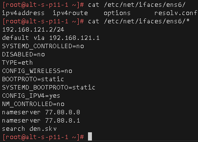
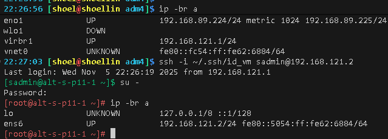

# Лабораторная работа 1. «`Настройка DHCP-серверав ОС Альт`» `Скворцов Денис`
### Предварительно

##### Для github
```bash
cd ~/altlinux/adm

git init

git config --global user.email "shoelacevip21@gmail.com"

git config --global user.name "shoelacevip12"

git config --global --add safe.directory .

git remote add altlinux https://github.com/shoelacevip12/altlinux_study.git

git log --oneline

git pull altlinux main
```
дистрибутивы для платформы x86_64
• Альт Сервер
• Альт Рабочая станция
[>>Дистрибутива устновки<<](https://getalt.org)
##### Создаем в среде виртуализации libvirt 2 виртуальные машины с характеристиками
• 4Гб ОЗУ
• 2 ядро CPU
• 1 сетевой интерфейс (типа bridge)
• Диск размером не менее 30 Гб
• Подсоедините к ВМ ISO-образ с дистрибутивом Альт Сервера 

```bash
mkdir amd4

cd !$

mkdir lab1

cd !$

mkdir my-dummy-box

cd !$

touch box.img

cat>metadata.json<<'EOF'
{
  "provider": "libvirt",
  "format": "qcow2",
  "virtual_size": 1048576
}
EOF

tar czvf ../my-dummy-box.tar.gz ./*
cd ..

wget -P /home/shoel/iso/ https://download.basealt.ru/pub/distributions/ALTLinux/p11/images/server/x86_64/alt-server-11.0-x86_64.iso

cat>vagrantfile<<'OEF'
# -*- mode: ruby -*-
# vi: set ft=ruby :

Vagrant.configure("2") do |config|

  # Путь к ISO образу ALT Linux p11
  altlinux_iso_path = "/home/shoel/iso/alt-server-11.0-x86_64.iso"

  # Конфигурация для libvirt (общая)
  config.vm.provider :libvirt do |libvirt|
    libvirt.driver = "kvm"
    libvirt.uri = 'qemu:///system'
    libvirt.memory = 4096
    libvirt.cpus = 2
    libvirt.nested = true
    libvirt.disk_driver :cache => 'none'
    libvirt.disk_bus = "virtio"
    libvirt.default_prefix = "altlinux_"
    libvirt.nic_model_type = "virtio"
    libvirt.management_network_mode = "route"
    libvirt.management_network_guest_ipv6 = "no"
  end

  # Определение ВМ для установки с ISO
  config.vm.define "altlinux_install" do |iso_vm|
    iso_vm.vm.hostname = "altlinux-install"
    iso_vm.vm.communicator = "none"
    iso_vm.vm.box = "my-dummy"
    iso_vm.vm.network "forwarded_port", guest: 80, host: 8082
    iso_vm.vm.network "forwarded_port", guest: 8080, host: 8081
    iso_vm.vm.provider :libvirt do |libvirt|
      libvirt.storage :file, :size => '30G', :type => 'qcow2'
      libvirt.storage :file, :device => :cdrom, :path => altlinux_iso_path
      libvirt.boot 'hd'
      libvirt.boot 'cdrom'
    end
    iso_vm.vm.provision "shell", inline: "echo 'VM created.'", run: "never"
  end

  # Определение пустой виртуальной машины
  config.vm.define "empty_vm" do |empty|
    empty.vm.hostname = "empty-vm"
    empty.vm.communicator = "none"
    empty.vm.box = "my-dummy"

    empty.vm.provider :libvirt do |libvirt|
      libvirt.storage :file, :size => '30G', :type => 'qcow2'
      libvirt.disk_bus = "virtio"
      libvirt.boot 'hd'
      libvirt.boot 'network'
    end
    # Отключаем provisioner'ы
    empty.vm.provision "shell", inline: "echo 'Подготовлено для PXE или ручной установки ОС.'", run: "never"
  end
end
OEF

vagrant up --no-destroy-on-error

sudo virsh list --all
```
##### Принудительная остановка машин и удаление секции DHCP libvirt поднятой сети
```bash

sudo virsh destroy --graceful 3

sudo virsh destroy --graceful 4

sudo virsh net-list --all

sudo virsh net-destroy vagrant-libvirt

sudo virsh net-edit --network vagrant-libvirt

sudo virsh net-dumpxml vagrant-libvirt
```
```xml
<network connections='1'>
  <name>vagrant-libvirt</name>
  <uuid>fdb9ee35-d722-42a7-b211-56d33f876800</uuid>
  <forward mode='route'/>
  <bridge name='virbr1' stp='on' delay='0'/>
  <mac address='52:54:00:52:49:ec'/>
  <ip address='192.168.121.1' netmask='255.255.255.0'>
  </ip>
</network>
```
##### Запуск отредактированной сети и 1 виртуальной машины роли сервера
```bash
sudo virsh net-start vagrant-libvirt

sudo virsh start --domain altlinux_altlinux_install
```

##### Ручная установка ОС Альт Сервер.



##### Организовываем подключение к серверному узлу
```bash
ssh-keygen -t ed25519 -f ~/.ssh/id_kvm_host -C "kvm-host-access-key"
ssh-keygen -t ed25519 -f ~/.ssh/id_vm -C "vm-access-key"

ssh-copy-id -i ~/.ssh/id_kvm_host.pub shoel@shoellin

ssh-copy-id -i ~/.ssh/id_vm.pub -o "ProxyJump shoel@shoellin" sadmin@192.168.121.2

ssh -i D:\Users\shoel\AppData\Roaming\MobaXterm\home\.ssh\id_kvm_host -o "ProxyJump shoel@shoellin" -i D:\Users\shoel\AppData\Roaming\MobaXterm\home\.ssh\id_vm sadmin@192.168.121.2

su -

ip -br a

exit

exit

sudo virsh dumpxml altlinux_altlinux_install > ./altlinux_server.xml

# sudo virsh snapshot-create-as --domain altlinux_altlinux_install --name 1 --description "1" --atomic

# sudo virsh snapshot-delete altlinux_altlinux_install --snapshotname 1
```



##### Для github
```bash
git add . .. \
&& git status

git log --oneline

git commit -am "оформение для ADM4" \
&& git push -u altlinux main
```
