# Лабораторная работа 2 «`Настройка DNS-сервера в ОС Альт`»
#### памятка для входа на машины локальной сети
```bash
# включаем агента и запущенному процессу регистрируем используемые ключи
eval $(ssh-agent) \
&& ssh-add ~/.ssh/id_vm \
&& ssh-add  ~/.ssh/id_kvm_host_to_vms

# Шлюз
ssh \
-i ~/.ssh/id_kvm_host_to_vms \
sadmin@alt-w-p11-route

# Основной сервер локальной сети
ssh -i ~/.ssh/id_kvm_host_to_vms \
-o "ProxyJump sadmin@alt-w-p11-route" \
-i ~/.ssh/id_vm sadmin@alt-s-p11-1

# сервер alt-s-p11-2
ssh -i ~/.ssh/id_kvm_host_to_vms \
-o "ProxyJump sadmin@192.168.121.2" \
-i ~/.ssh/id_vm sadmin@10.10.10.242

# сервер alt-s-p11-3
ssh -i ~/.ssh/id_kvm_host_to_vms \
-o "ProxyJump sadmin@192.168.121.2" \
-i ~/.ssh/id_vm sadmin@10.10.10.243

# сервер alt-w-p11-1
ssh -i ~/.ssh/id_kvm_host_to_vms \
-o "ProxyJump sadmin@192.168.121.2" \
-i ~/.ssh/id_vm sadmin@10.10.10.244
```
### Предварительно
##### Для github
```bash
cd ~/altlinux/adm/adm4

git branch -v

git remote -v


git remote add altlinux https://github.com/shoelacevip12/altlinux_study.git

git log --oneline

git pull altlinux main
```
### Подготовка и Запуск стенда
```bash
# включаем агента-ssh
eval $(ssh-agent) \
&& ssh-add ~/.ssh/id_vm \
&& ssh-add  ~/.ssh/id_kvm_host_to_vms

mkdir -p lab2/img

cd lab2

touch README.md

# Поочередный запуск всех сетей libvirt со 2ого по списку
sudo virsh net-list --all \
| awk 'NR > 3 {print $1}' \
| xargs -I {} sudo virsh net-start {}

# Создание snapshot
### Основного сервера сети
sudo virsh snapshot-create-as \
--domain adm4_altlinux_s1 \
--name 2 \
--description "before_lab2" --atomic

### Вторичного сервера сети
sudo virsh snapshot-create-as \
--domain adm4_altlinux_s2 \
--name 2 \
--description "before_lab2" --atomic

#### Основного шлюза сети
sudo virsh snapshot-create-as \
--domain adm4_altlinux_w2 \
--name 2 \
--description "before_lab2" --atomic

# Поочередный запуск всех ВМ содержащих "nux"
sudo bash -c \
"for i in \$(virsh list --all \
| awk '/nux/ {print \$2}') ; do \
virsh start --domain \$i; done"
```
#### Проверка работы DHCP с прошлой лабораторной работы
```bash
# Подключение к основному серверу локальной сети
ssh -i ~/.ssh/id_kvm_host_to_vms \
-o "ProxyJump sadmin@alt-w-p11-route" \
-i ~/.ssh/id_vm sadmin@alt-s-p11-1

su -

# Проверка работы DHCP
journalctl -feu dhcpd

# для формирования arp таблицы на интерфейсе
for c in {2..4}; do
ping -c 1 10.10.10.24$c; done

# проверка получившейся связности связности между узлами локальной сети
ip nei

exit

exit
```
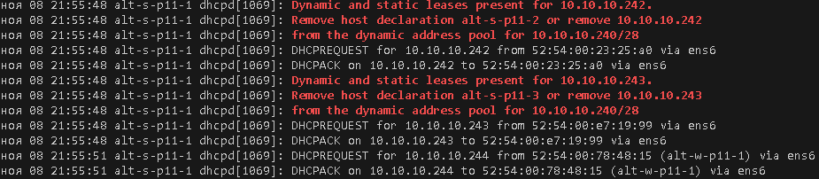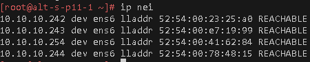
#### Проброс ключей с хостовой машины на оставшиеся ВМ
```bash
ssh-copy-id \
-i ~/.ssh/id_vm.pub \
-o "ProxyJump sadmin@192.168.121.2" \
sadmin@10.10.10.242

ssh-copy-id \
-i ~/.ssh/id_vm.pub \
-o "ProxyJump sadmin@192.168.121.2" \
sadmin@10.10.10.243

ssh-copy-id \
-i ~/.ssh/id_vm.pub \
-o "ProxyJump sadmin@192.168.121.2" \
sadmin@10.10.10.244
```
## План для выполнения 
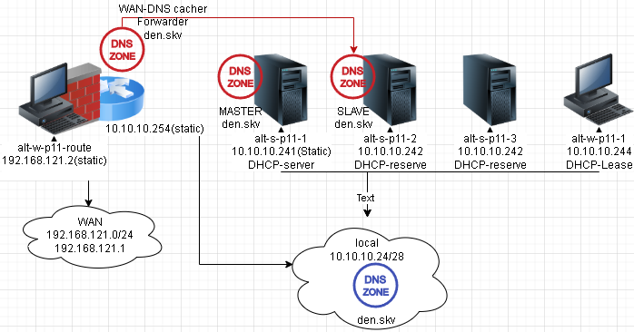

### Выполнение работы
#### установка bind на шлюзе, alt-s-p11-1 и alt-s-p11-2
```bash
cd ../ansible-automation/

ansible-playbook role_bind.yaml

cd -
```
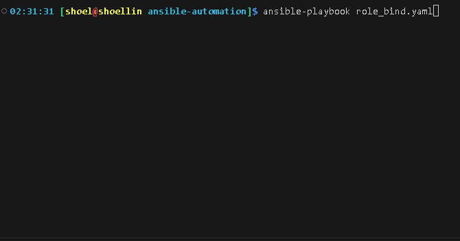
#### Настройка службы BIND на кэширование на шлюзе сети и forward на зону den.skv.
```bash
# Шлюз
ssh \
-i ~/.ssh/id_kvm_host_to_vms \
sadmin@alt-w-p11-route

su -

systemctl stop bind

cd /var/lib/bind

# даем доступ на dump кеша согласно пути по умолчанию в ./etc/options.conf
chmod g+x var 

# Прослушивать только локальный порт и Loopback интерфейс
sed -i 's/0.1;/0.1; 10.10.10.240\/28;/' etc/options.conf

# Разрешение запросов только с локальных IP и IP Loopback интерфейса
sed -i 's|//allow-query { localnets; };|allow-query { 127.0.0.1; 10.10.10.240/28; };|' etc/options.conf

# Указываем на работу только на IPv4
sed -i 's/S=""/S="-4"/' /etc/sysconfig/bind

# Ограничиваем рекурсию запросов
sed -i 's|//allow-recursion { localnets|allow-recursion { 10.10.10.240/28|' \
etc/options.conf
```
##### тестовый запуск
```bash
systemctl start bind

host ya.ru 10.10.10.254

host mail.ru 127.0.0.1

systemctl stop bind
```
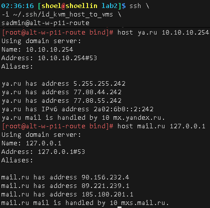
#### Настраиваем Forward запросов на наш домен на наши сервера
```bash
# Зону прямого просмотра 
cat >>./etc/local.conf<<'EOF'
zone "den.skv" {
    type forward;
    forward only;
    forwarders { 10.10.10.242; 10.10.10.241; };
};
EOF

# Зону обратного просмотра 
cat >>./etc/local.conf<<'EOF'
zone "10.10.10.in-addr.arpa" {
    type forward;
    forward only;
    forwarders { 10.10.10.242; 10.10.10.241; };
};
EOF

# проверка конфига на корректность
named-checkconf -p

systemctl start bind

journalctl -efu bind

exit

exit
```

#### Настройка службы BIND на мастера зоны den.skv.
```bash
# Основной сервер локальной сети
ssh -i ~/.ssh/id_kvm_host_to_vms \
-o "ProxyJump sadmin@alt-w-p11-route" \
-i ~/.ssh/id_vm sadmin@alt-s-p11-1

su -

# Заменяем внешние DNS на интерфейсе хоста со статикой
echo "nameserver 10.10.10.254" \
> /etc/net/ifaces/ens6/resolv.conf

# Заменяем внешние DNS на сервере DHCP
# 1 выступает кеширующий сервер шлюза
# 2 Выступает вторичный сервер (slave)
sed -i '11s|77.88.8.8, 77.88.8.1|10.10.10.254, 10.10.10.242|' /etc/dhcp/dhcpd.conf

systemctl stop bind

systemctl restart dhcpd

systemctl restart network
```
##### Проверка работы через кеширующий DNS
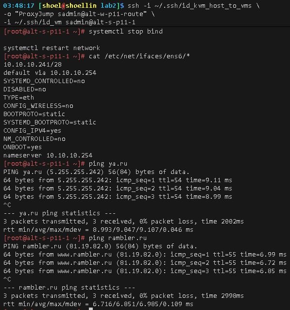
```bash
cd /var/lib/bind

# даем доступ на dump кеша согласно пути по умолчанию в ./etc/options.conf
chmod g+x var 

# Прослушивать только локальный порт и Loopback интерфейс
sed -i 's/0.1;/0.1; 10.10.10.240\/28;/' etc/options.conf

# Разрешение запросов только с локальных IP и IP Loopback интерфейса
sed -i 's|//allow-query { localnets; };|allow-query { 127.0.0.1; 10.10.10.240/28; };|' etc/options.conf

# Указываем на работу только на IPv4
sed -i 's/S=""/S="-4"/' /etc/sysconfig/bind

# Ограничиваем рекурсию запросов
sed -i 's|//allow-recursion { localnets|allow-recursion { 10.10.10.240/28|' \
etc/options.conf


# разрешаем трансфер до описанных серверов (нужно для вторичного сервера)
sed -i '/::1; };/a\        allow-transfer { localhost; 10.10.10.242; };' etc/options.conf

# ограничиваем оповещение определенным DNS серверам
sed -i '/::1; };/a\        allow-notify { 10.10.10.242; };' etc/options.conf


# проверка конфига на корректность
named-checkconf -p
```
##### Создание ddns зоны
```bash
mkdir zone/ddns

# зона прямого просмотра
cat >>zone/ddns/den.skv.zone<<'EOF'
$TTL 1w
@           IN      SOA     alt-s-p11-1.den.skv. ya.den.skv. (
                              2025110901         ; формат Serial: YYYYMMDDNN, NN - номер ревизии
                              2d                 ; Refresh (2 дня)
                              1h                 ; Retry (2 часа)
                              1w                 ; Expire (1 неделя)
                              1w )               ; Negative Cache TTL (1 неделя)

; Определение серверов имён (NS)
            IN      NS      alt-s-p11-1
            IN      NS      alt-s-p11-2

; Записи A для серверов имён
alt-s-p11-1 IN      A       10.10.10.241
alt-s-p11-2 IN      A       10.10.10.242

; A-запись для самого домена
@           IN      A       10.10.10.241
EOF

# Зона обратного просмотра
cat >>zone/ddns/10.10.10.zone<<'EOF'
$TTL 1w
10.10.10.in-addr.arpa.        IN      SOA     alt-s-p11-1.den.skv. ya.den.skv. (
                              2025110901         ; формат Serial: YYYYMMDDNN, NN - номер ревизии
                              2d                 ; Refresh (2 дня)
                              1h                 ; Retry (2 часа)
                              1w                 ; Expire (1 неделя)
                              1w )               ; Negative Cache TTL (1 неделя)

; Определение серверов имён (NS)
                              IN      NS      alt-s-p11-1.den.skv.
                              IN      NS      alt-s-p11-2.den.skv.

; Записи A для серверов имён
241                           IN      PTR     alt-s-p11-1.den.skv.
242                           IN      PTR     alt-s-p11-2.den.skv.
EOF

```
```bash
# Копируем уже имеющийся ключ авторизации для изменения зоны полученный при первом запуске Bind
cp etc/{rndc,ddns}.key

# предоставляем доступ службе bind до скопированного ключа авторизации
chown named:named etc/bind/ddns.key

# Даем уникальное имя для ключа авторизации для обновления зоны ddns
sed -i 's/rndc-key/ddns-key-skv/' etc/ddns.key

# присваиваем данному серверу роль мастера зоны прямого просмотра
cat >>./etc/local.conf<<'EOF'
include "/etc/bind/ddns.key";
zone "den.skv" {
    type master;
    file "ddns/den.skv.zone";
    notify yes;
    allow-update { key ddns-key-skv; };
};
EOF

# присваиваем данному серверу роль мастера зоны прямого просмотра
cat >>./etc/local.conf<<'EOF'

zone "10.10.10.in-addr.arpa" {
    type master;
    file "ddns/10.10.10.zone";
    notify yes;
    allow-update { key ddns-key-skv; };
};
EOF

# проверка конфига на корректность
named-checkconf -p

# Даем доступ службе Bind до созданной зоны
chown named:named -R zone/ddns

# Проверка зоны на корректность
named-checkzone den.skv. zone/ddns/den.skv.zone
```


##### обновление DHCP для обновления ddns зоны
```bash
# Включаем обновление зоны ddns
sed -i '2a\ddns-updates on;' \
/etc/dhcp/dhcpd.conf

# обозначаем механизм добавления записей в зону
sed -i '3s/none;/interim;/' \
/etc/dhcp/dhcpd.conf

# создаем символьную ссылку до файла ключа для обновления записей
ln -s /var/lib/bind/etc/ddns.key /etc/dhcp/

# Указываем путь до ссылки на файл ключа
sed -i '4a\include "/etc/dhcp/ddns.key";' \
/etc/dhcp/dhcpd.conf

# позволяем записывать в зону зарезервированные адреса
sed -i '4a\update-static-leases on;' \
/etc/dhcp/dhcpd.conf

# описываем зону в которую будем автоматически вносить A и TXT записи 
sed -i '/.key";/r /dev/stdin' /etc/dhcp/dhcpd.conf << 'EOF'
zone den.skv {
        primary 10.10.10.241;
        key ddns-key-skv;
}
EOF

# описываем обратную зону в которую будем автоматически вносить PTR записи 
sed -i '/.key";/r /dev/stdin' /etc/dhcp/dhcpd.conf << 'EOF'

zone 10.10.10.in-addr.arpa {
        primary 10.10.10.241;
        key ddns-key-skv;
}

EOF

systemctl restart dhcpd

systemctl restart bind

journalctl -efu bind

exit

exit
```
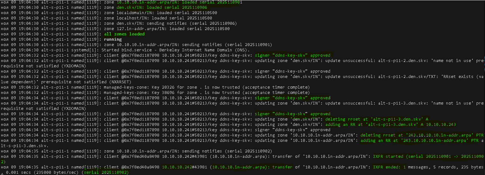

#### Настройка службы BIND на вторичный сервер зоны den.skv.
```bash
# сервер alt-s-p11-2
ssh -i ~/.ssh/id_kvm_host_to_vms \
-o "ProxyJump sadmin@192.168.121.2" \
-i ~/.ssh/id_vm sadmin@10.10.10.242

su -

systemctl stop bind

cd /var/lib/bind

# даем доступ на dump кеша согласно пути по умолчанию в ./etc/options.conf
chmod g+x var 

# Прослушивать только локальный порт и Loopback интерфейс
sed -i 's/0.1;/0.1; 10.10.10.240\/28;/' etc/options.conf

# Разрешение запросов только с локальных IP и IP Loopback интерфейса
sed -i 's|//allow-query { localnets; };|allow-query { 127.0.0.1; 10.10.10.240/28; };|' etc/options.conf

# Указываем на работу только на IPv4
sed -i 's/S=""/S="-4"/' /etc/sysconfig/bind

# Ограничиваем рекурсию запросов
sed -i 's|//allow-recursion { localnets|allow-recursion { 10.10.10.240/28|' \
etc/options.conf

# Переводим сервер DNS в режим вторичного сервера
control bind-slave enabled

# проверка конфига на корректность
named-checkconf -p
```
```bash
# присваиваем данному серверу роль slave зоны прямого просмотра den.svk
cat >>./etc/local.conf<<'EOF'
zone "den.skv" {
    type slave;
    masters { 10.10.10.241; };
    file "slave/den.skv.zone";
};
EOF

cat >>./etc/local.conf<<'EOF'

zone "10.10.10.in-addr.arpa" {
    type slave;
    masters { 10.10.10.241; };
    file "slave/10.10.10.zone";
};
EOF

# проверка конфига на корректность
named-checkconf -p

systemctl restart bind

journalctl -efu bind

cat /etc/resolv.conf

cat /etc/net/ifaces/ens6/*

control bind-slave

ls zone/slave/

host ya.ru

host -t NS den.skv

host den.skv 127.0.0.1

host den.skv 10.10.10.241

exit

exit
```
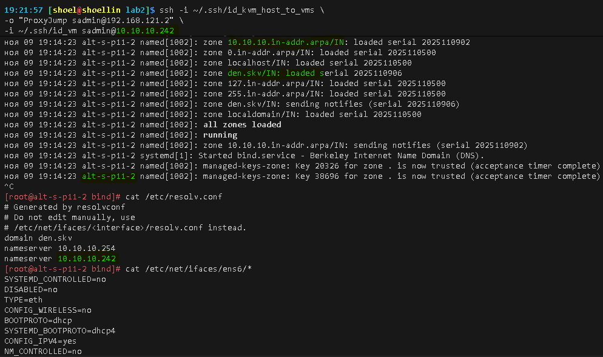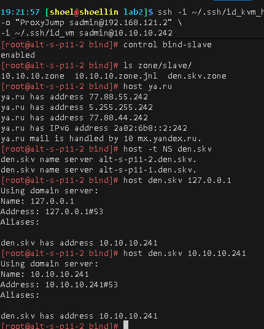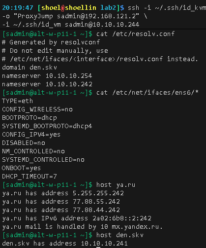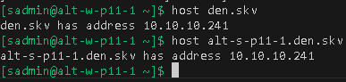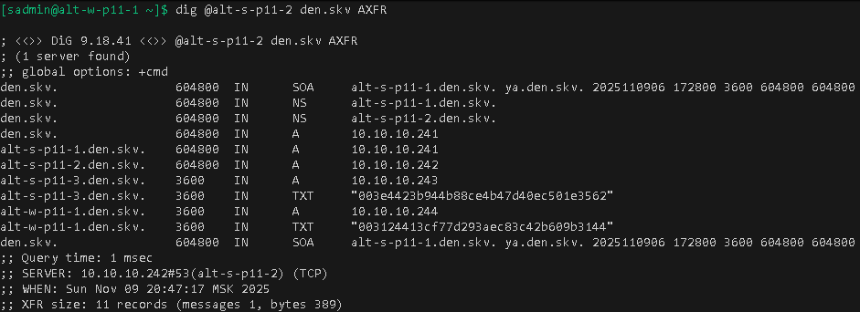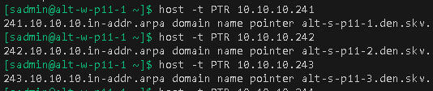

#### Выгрузка конфигов работы
```bash
mkdir -p configs_bind_dhcp/{etc,zone/ddns}

ssh \
-i ~/.ssh/id_kvm_host_to_vms \
sadmin@alt-w-p11-route

su -

rsync -aP \
/var/lib/bind/etc/options.conf \
shoel@192.168.121.1:~/altlinux/adm/adm4/lab2/configs_bind_dhcp/etc/options.conf_GW

rsync -aP \
/var/lib/bind/etc/local.conf \
shoel@192.168.121.1:~/altlinux/adm/adm4/lab2/configs_bind_dhcp/etc/local.conf_GW
```
##### Конфиг шлюза /var/lib/bind/etc/local.conf
```ini
include "/etc/bind/rfc1912.conf";

// Consider adding the 1918 zones here,
// if they are not used in your organization.
//	include "/etc/bind/rfc1918.conf";

// Add other zones here
zone "den.skv" {
    type forward;
    forward only;
    forwarders { 10.10.10.242; 10.10.10.241; };
};
zone "10.10.10.in-addr.arpa" {
    type forward;
    forward only;
    forwarders { 10.10.10.242; 10.10.10.241; };
};
```
##### Конфиг шлюза /var/lib/bind/etc/options.conf
```ini
options {
	version "unknown";
	directory "/etc/bind/zone";
	dump-file "/var/run/named/named_dump.db";
	statistics-file "/var/run/named/named.stats";
	recursing-file "/var/run/named/named.recursing";
	secroots-file "/var/run/named/named.secroots";

	// disables the use of a PID file
	pid-file none;

	/*
	 * Oftenly used directives are listed below.
	 */

	listen-on { 127.0.0.1; 10.10.10.240/28; };
	listen-on-v6 { ::1; };

	/*
	 * If the forward directive is set to "only", the server will only
	 * query the forwarders.
	 */
	//forward only;
	//forwarders { };

	/*
	 * Specifies which hosts are allowed to ask ordinary questions.
	 */
	allow-query { 127.0.0.1; 10.10.10.240/28; };

	/*
	 * This lets "allow-query" be used to specify the default zone access
	 * level rather than having to have every zone override the global
	 * value. "allow-query-cache" can be set at both the options and view
	 * levels.  If "allow-query-cache" is not set then "allow-recursion" is
	 * used if set, otherwise "allow-query" is used if set unless
	 * "recursion no;" is set in which case "none;" is used, otherwise the
	 * default (localhost; localnets;) is used.
	 */
	//allow-query-cache { localnets; };

	/*
	 * Specifies which hosts are allowed to make recursive queries
	 * through this server.  If not specified, the default is to allow
	 * recursive queries from all hosts.  Note that disallowing recursive
	 * queries for a host does not prevent the host from retrieving data
	 * that is already in the server's cache.
	 */
	allow-query { 127.0.0.1; 10.10.10.240/28; };

	/*
	 * Sets the maximum time for which the server will cache ordinary
	 * (positive) answers.  The default is one week (7 days).
	 */
	//max-cache-ttl 86400;

	/*
	 * The server will scan the network interface list every
	 * interface-interval minutes.  The default is 60 minutes.
	 * If set to 0, interface scanning will only occur when the
	 * configuration file is loaded.  After the scan, listeners will
	 * be started on any new interfaces (provided they are allowed by
	 * the listen-on configuration).  Listeners on interfaces that
	 * have gone away will be cleaned up.
	 */
	//interface-interval 0;
};

logging {
	// The default_debug channel has the special property that it only
	// produces output when the server’s debug level is non-zero. It
	// normally writes to a file called named.run in the server’s working
	// directory.

	// For security reasons, when the -u command-line option is used, the
	// named.run file is created only after named has changed to the new
	// UID, and any debug output generated while named is starting - and
	// still running as root - is discarded. To capture this output, run
	// the server with the -L option to specify a default logfile, or the
	// -g option to log to standard error which can be redirected to a
	// file.

	// channel default_debug {
	// 	file "/var/log/named/named.run" versions 10 size 20m;
	// 	print-time yes;
	// 	print-category yes;
	// 	print-severity yes;
	// 	severity dynamic;
	// };
};

```

```bash
ssh -i ~/.ssh/id_kvm_host_to_vms \
-o "ProxyJump sadmin@alt-w-p11-route" \
-i ~/.ssh/id_vm sadmin@alt-s-p11-1

su -

rsync -aP \
/var/lib/bind/etc/options.conf \
shoel@192.168.121.1:~/altlinux/adm/adm4/lab2/configs_bind_dhcp/etc/options.conf_MASTER

rsync -aP \
/var/lib/bind/etc/local.conf \
shoel@192.168.121.1:~/altlinux/adm/adm4/lab2/configs_bind_dhcp/etc/local.conf_MASTER


rsync -aP \
/var/lib/bind/zone/ddns/*.zone \
shoel@192.168.121.1:~/altlinux/adm/adm4/lab2/configs_bind_dhcp/zone/ddns

rsync -aP \
/etc/dhcp/dhcpd.conf \
shoel@192.168.121.1:~/altlinux/adm/adm4/lab2/configs_bind_dhcp/dhcpd.conf_SERVER
```
##### Конфиг Мастер-зоны /var/lib/bind/etc/options.conf
```ini
options {
	version "unknown";
	directory "/etc/bind/zone";
	dump-file "/var/run/named/named_dump.db";
	statistics-file "/var/run/named/named.stats";
	recursing-file "/var/run/named/named.recursing";
	secroots-file "/var/run/named/named.secroots";

	// disables the use of a PID file
	pid-file none;

	/*
	 * Oftenly used directives are listed below.
	 */

	listen-on { 127.0.0.1; 10.10.10.240/28; };
	listen-on-v6 { ::1; };
        allow-notify { 10.10.10.242; };
        allow-transfer { localhost; 10.10.10.242; };

	/*
	 * If the forward directive is set to "only", the server will only
	 * query the forwarders.
	 */
	//forward only;
	//forwarders { };

	/*
	 * Specifies which hosts are allowed to ask ordinary questions.
	 */
	allow-query { 127.0.0.1; 10.10.10.240/28; };

	/*
	 * This lets "allow-query" be used to specify the default zone access
	 * level rather than having to have every zone override the global
	 * value. "allow-query-cache" can be set at both the options and view
	 * levels.  If "allow-query-cache" is not set then "allow-recursion" is
	 * used if set, otherwise "allow-query" is used if set unless
	 * "recursion no;" is set in which case "none;" is used, otherwise the
	 * default (localhost; localnets;) is used.
	 */
	//allow-query-cache { localnets; };

	/*
	 * Specifies which hosts are allowed to make recursive queries
	 * through this server.  If not specified, the default is to allow
	 * recursive queries from all hosts.  Note that disallowing recursive
	 * queries for a host does not prevent the host from retrieving data
	 * that is already in the server's cache.
	 */
	allow-recursion { 10.10.10.240/28; };

	/*
	 * Sets the maximum time for which the server will cache ordinary
	 * (positive) answers.  The default is one week (7 days).
	 */
	//max-cache-ttl 86400;

	/*
	 * The server will scan the network interface list every
	 * interface-interval minutes.  The default is 60 minutes.
	 * If set to 0, interface scanning will only occur when the
	 * configuration file is loaded.  After the scan, listeners will
	 * be started on any new interfaces (provided they are allowed by
	 * the listen-on configuration).  Listeners on interfaces that
	 * have gone away will be cleaned up.
	 */
	//interface-interval 0;
};

logging {
	// The default_debug channel has the special property that it only
	// produces output when the server’s debug level is non-zero. It
	// normally writes to a file called named.run in the server’s working
	// directory.

	// For security reasons, when the -u command-line option is used, the
	// named.run file is created only after named has changed to the new
	// UID, and any debug output generated while named is starting - and
	// still running as root - is discarded. To capture this output, run
	// the server with the -L option to specify a default logfile, or the
	// -g option to log to standard error which can be redirected to a
	// file.

	// channel default_debug {
	// 	file "/var/log/named/named.run" versions 10 size 20m;
	// 	print-time yes;
	// 	print-category yes;
	// 	print-severity yes;
	// 	severity dynamic;
	// };
};
```
##### Конфиг Мастер-зоны /var/lib/bind/etc/local.conf
```ini
include "/etc/bind/rfc1912.conf";

// Consider adding the 1918 zones here,
// if they are not used in your organization.
//	include "/etc/bind/rfc1918.conf";

// Add other zones here
include "/etc/bind/ddns.key";
zone "den.skv" {
    type master;
    file "ddns/den.skv.zone";
    notify yes;
    allow-update { key ddns-key-skv; };
};

zone "10.10.10.in-addr.arpa" {
    type master;
    file "ddns/10.10.10.zone";
    notify yes;
    allow-update { key ddns-key-skv; };
};
```
##### Конфиг Мастер-зоны /var/lib/bind/zone/ddns/10.10.10.zone
```ini
$ORIGIN .
$TTL 604800	; 1 week
10.10.10.in-addr.arpa	IN SOA	alt-s-p11-1.den.skv. ya.den.skv. (
				2025110902 ; serial
				172800     ; refresh (2 days)
				3600       ; retry (1 hour)
				604800     ; expire (1 week)
				604800     ; minimum (1 week)
				)
			NS	alt-s-p11-1.den.skv.
			NS	alt-s-p11-2.den.skv.
$ORIGIN 10.10.10.in-addr.arpa.
241			PTR	alt-s-p11-1.den.skv.
242			PTR	alt-s-p11-2.den.skv.
$TTL 3600	; 1 hour
243			PTR	alt-s-p11-3.den.skv.
```

##### Конфиг Мастер-зоны /var/lib/bind/zone/ddns/den.skv.zone
```ini
$ORIGIN .
$TTL 604800	; 1 week
den.skv			IN SOA	alt-s-p11-1.den.skv. ya.den.skv. (
				2025110906 ; serial
				172800     ; refresh (2 days)
				3600       ; retry (1 hour)
				604800     ; expire (1 week)
				604800     ; minimum (1 week)
				)
			NS	alt-s-p11-1.den.skv.
			NS	alt-s-p11-2.den.skv.
den.skv			IN A	10.10.10.241
$ORIGIN den.skv.
alt-s-p11-1		A	10.10.10.241
alt-s-p11-2		A	10.10.10.242
$TTL 3600	; 1 hour
alt-s-p11-3		A	10.10.10.243
			TXT	"003e4423b944b88ce4b47d40ec501e3562"
alt-w-p11-1		A	10.10.10.244
			TXT	"003124413cf77d293aec83c42b609b3144"
```

##### Конфиг DHCP Мастер-зоны /etc/dhcp/dhcpd.conf
```ini
# See dhcpd.conf(5) for further configuration
ddns-updates on;
ddns-update-style interim;
update-static-leases on;
include "/etc/dhcp/ddns.key";

zone 10.10.10.in-addr.arpa {
        primary 10.10.10.241;
        key ddns-key-skv;
}

zone den.skv {
        primary 10.10.10.241;
        key ddns-key-skv;
}

subnet 10.10.10.240 netmask 255.255.255.240 {
	option routers			10.10.10.254;
	option subnet-mask		255.255.255.240;

	option nis-domain		"den.skv";
	option domain-name		"den.skv";
	option domain-name-servers	10.10.10.254, 10.10.10.242;

	range dynamic-bootp 10.10.10.242 10.10.10.253;
	default-lease-time 172800;
	max-lease-time 259200;
}
host alt-s-p11-2 {
  hardware ethernet 52:54:00:23:25:a0;
  fixed-address 10.10.10.242;
}

host alt-s-p11-3 {
  hardware ethernet 52:54:00:e7:19:99;
  fixed-address 10.10.10.243;
}
```
```bash
ssh -i ~/.ssh/id_kvm_host_to_vms \
-o "ProxyJump sadmin@192.168.121.2" \
-i ~/.ssh/id_vm sadmin@10.10.10.242

su -

rsync -aP \
/var/lib/bind/etc/options.conf \
shoel@192.168.121.1:~/altlinux/adm/adm4/lab2/configs_bind_dhcp/etc/options.conf_SLAVE

rsync -aP \
/var/lib/bind/etc/local.conf \
shoel@192.168.121.1:~/altlinux/adm/adm4/lab2/configs_bind_dhcp/etc/local.conf_SLAVE
```
##### Конфиг вторичной-зоны /var/lib/bind/etc/options.conf
```ini
options {
	version "unknown";
	directory "/etc/bind/zone";
	dump-file "/var/run/named/named_dump.db";
	statistics-file "/var/run/named/named.stats";
	recursing-file "/var/run/named/named.recursing";
	secroots-file "/var/run/named/named.secroots";

	// disables the use of a PID file
	pid-file none;

	/*
	 * Oftenly used directives are listed below.
	 */

	listen-on { 127.0.0.1; 10.10.10.240/28; };
	listen-on-v6 { ::1; };

	/*
	 * If the forward directive is set to "only", the server will only
	 * query the forwarders.
	 */
	//forward only;
	//forwarders { };

	/*
	 * Specifies which hosts are allowed to ask ordinary questions.
	 */
	allow-query { 127.0.0.1; 10.10.10.240/28; };

	/*
	 * This lets "allow-query" be used to specify the default zone access
	 * level rather than having to have every zone override the global
	 * value. "allow-query-cache" can be set at both the options and view
	 * levels.  If "allow-query-cache" is not set then "allow-recursion" is
	 * used if set, otherwise "allow-query" is used if set unless
	 * "recursion no;" is set in which case "none;" is used, otherwise the
	 * default (localhost; localnets;) is used.
	 */
	//allow-query-cache { localnets; };

	/*
	 * Specifies which hosts are allowed to make recursive queries
	 * through this server.  If not specified, the default is to allow
	 * recursive queries from all hosts.  Note that disallowing recursive
	 * queries for a host does not prevent the host from retrieving data
	 * that is already in the server's cache.
	 */
	allow-recursion { 10.10.10.240/28; };

	/*
	 * Sets the maximum time for which the server will cache ordinary
	 * (positive) answers.  The default is one week (7 days).
	 */
	//max-cache-ttl 86400;

	/*
	 * The server will scan the network interface list every
	 * interface-interval minutes.  The default is 60 minutes.
	 * If set to 0, interface scanning will only occur when the
	 * configuration file is loaded.  After the scan, listeners will
	 * be started on any new interfaces (provided they are allowed by
	 * the listen-on configuration).  Listeners on interfaces that
	 * have gone away will be cleaned up.
	 */
	//interface-interval 0;
};

logging {
	// The default_debug channel has the special property that it only
	// produces output when the server’s debug level is non-zero. It
	// normally writes to a file called named.run in the server’s working
	// directory.

	// For security reasons, when the -u command-line option is used, the
	// named.run file is created only after named has changed to the new
	// UID, and any debug output generated while named is starting - and
	// still running as root - is discarded. To capture this output, run
	// the server with the -L option to specify a default logfile, or the
	// -g option to log to standard error which can be redirected to a
	// file.

	// channel default_debug {
	// 	file "/var/log/named/named.run" versions 10 size 20m;
	// 	print-time yes;
	// 	print-category yes;
	// 	print-severity yes;
	// 	severity dynamic;
	// };
};
```
##### Конфиг вторичной-зоны /var/lib/bind/etc/local.conf
```ini
include "/etc/bind/rfc1912.conf";

// Consider adding the 1918 zones here,
// if they are not used in your organization.
//	include "/etc/bind/rfc1918.conf";

// Add other zones here
zone "den.skv" {
    type slave;
    masters { 10.10.10.241; };
    file "slave/den.skv.zone";
};

zone "10.10.10.in-addr.arpa" {
    type slave;
    masters { 10.10.10.241; };
    file "slave/10.10.10.zone";
};
```

##### Для github
```bash

git add . .. ../.. \
&& git status

git log --oneline

git commit -am "оформление для ADM4_lab2_upd9" \
&& git push -u altlinux main
```