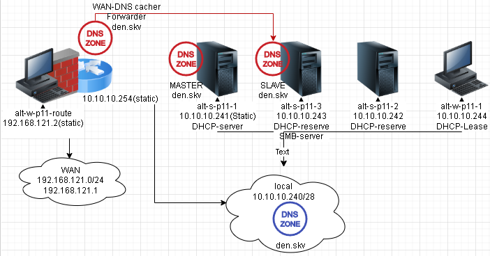
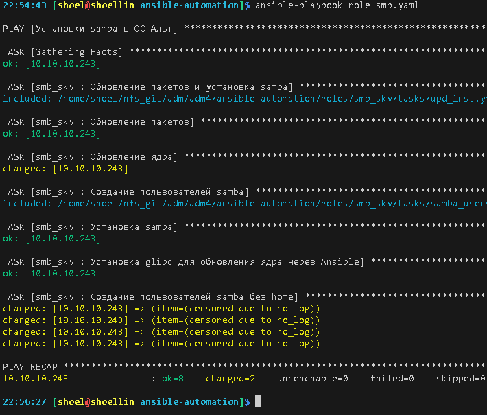
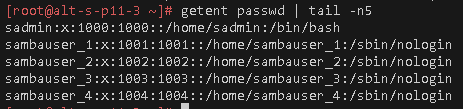
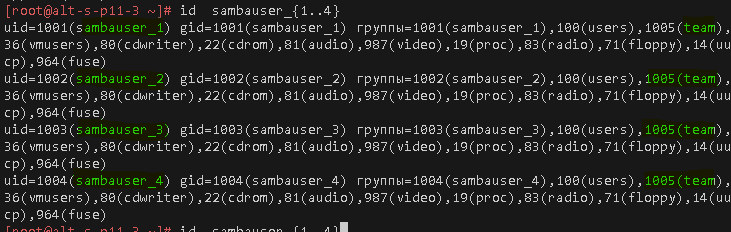
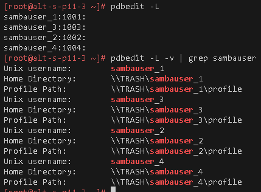
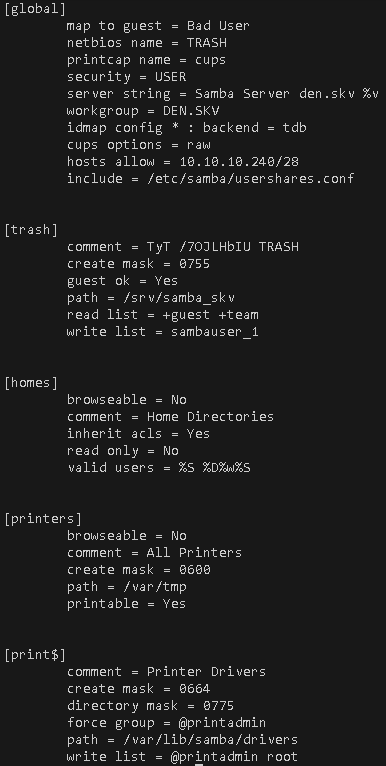
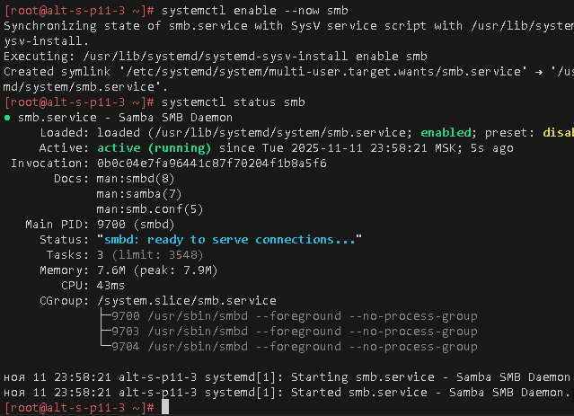
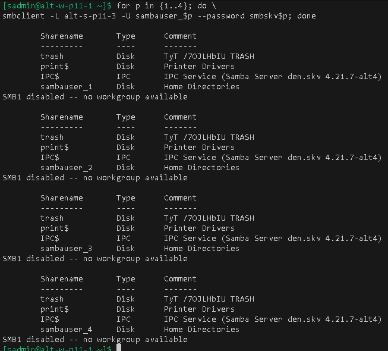

# Лабораторная работа 3 «`Сетевой доступ по протоколу SMB`»
#### памятка для входа на машины локальной сети
```bash
# включаем агента и запущенному процессу регистрируем используемые ключи
eval $(ssh-agent) \
&& ssh-add ~/.ssh/id_vm \
&& ssh-add  ~/.ssh/id_kvm_host_to_vms

# Шлюз и кеширующий сервер DNS
ssh \
-i ~/.ssh/id_kvm_host_to_vms \
sadmin@alt-w-p11-route

# Основной DNS-мастер
ssh -i ~/.ssh/id_kvm_host_to_vms \
-o "ProxyJump sadmin@alt-w-p11-route" \
-i ~/.ssh/id_vm sadmin@alt-s-p11-1

# сервер вторичный DNS
ssh -i ~/.ssh/id_kvm_host_to_vms \
-o "ProxyJump sadmin@192.168.121.2" \
-i ~/.ssh/id_vm sadmin@10.10.10.242

# сервер alt-s-p11-3
ssh -i ~/.ssh/id_kvm_host_to_vms \
-o "ProxyJump sadmin@192.168.121.2" \
-i ~/.ssh/id_vm sadmin@10.10.10.243

# сервер alt-w-p11-1
ssh -i ~/.ssh/id_kvm_host_to_vms \
-o "ProxyJump sadmin@192.168.121.2" \
-i ~/.ssh/id_vm sadmin@10.10.10.244
```
### Предварительно
##### Для github
```bash
git config --global --add safe.directory .

git branch -v

git remote -v


git remote add altlinux https://github.com/shoelacevip12/altlinux_study.git

git log --oneline

git pull altlinux main
```
### Подготовка стенда
```bash
# включаем агента-ssh
eval $(ssh-agent) \
&& ssh-add ~/.ssh/id_vm \
&& ssh-add  ~/.ssh/id_kvm_host_to_vms

cd ~/altlinux/adm/adm4

mkdir -p lab3/img

cd lab3

touch README.md

# Поочередный запуск всех сетей libvirt со 2ого по списку
sudo virsh net-list --all \
| awk 'NR > 3 {print $1}' \
| xargs -I {} sudo virsh net-start {}

# Создание snapshot
### Основного сервера сети
sudo virsh snapshot-create-as \
--domain adm4_altlinux_s1 \
--name 3 \
--description "before_lab3" --atomic

### Вторичного сервера сети
sudo virsh snapshot-create-as \
--domain adm4_altlinux_s2 \
--name 3 \
--description "before_lab3" --atomic

### Планируемый сервер smb
sudo virsh snapshot-create-as \
--domain adm4_altlinux_s3 \
--name 3 \
--description "before_lab3" --atomic

#### Основного шлюза сети
sudo virsh snapshot-create-as \
--domain adm4_altlinux_w2 \
--name 3 \
--description "before_lab3" --atomic
```
### Запуск стенда
```bash
# Запуск шлюза
sudo virsh start \
--domain adm4_altlinux_w2

# Запуск основного DNS сервера
sudo virsh start \
--domain adm4_altlinux_s1

# Поочередный запуск всех ВМ содержащих "nux"
sudo bash -c \
"for i in \$(virsh list --all \
| awk '/nux/ {print \$2}') ; do \
virsh start --domain \$i; done"
```
## План для выполнения 


### Выполнение работы
#### установка SMB на alt-s-p11-3 и создание пользователей без home
```bash

cd ../ansible-automation/

ansible-galaxy init roles/smb_skv

chmod 755 -R .

chmod -x  va_pa

EDITOR=nano \
ansible-vault edit \
--vault-password-file ./va_pa \
./group_vars/all/vault.yml

sudo pacman -Syu python-passlib

ansible-playbook role_smb.yaml

cd -
```


##### проверка пользователей
```bash
eval $(ssh-agent) \
&& ssh-add ~/.ssh/id_vm \
&& ssh-add  ~/.ssh/id_kvm_host_to_vms

ssh -i ~/.ssh/id_kvm_host_to_vms \
-o "ProxyJump sadmin@192.168.121.2" \
-i ~/.ssh/id_vm sadmin@10.10.10.243

su -

getent passwd \
| tail -n5
```


#### Создание пользователей для доступа к samba
```bash
groupadd team

for n in {1..4}; do \
usermod -aG team sambauser_$n; done

id  sambauser_{1..4}
```


#### Создание пользователей samba
```bash
smbpasswd -a sambauser_1
smbskv1

smbpasswd -a sambauser_2
smbskv2

smbpasswd -a sambauser_3
smbskv3

smbpasswd -a sambauser_4
smbskv4

apt-get install samba-common-tool

pdbedit -L

pdbedit -L -v \
| grep sambauser
```


#### Создание каталогов сетевой шары и настройка сервера
```bash
mkdir /srv/samba_skv

sed -i 's/SAMBA/DEN.SKV/' \
/etc/samba/smb.conf

sed -i '/DEN.SKV/a\        netbios name = TRASH' \
/etc/samba/smb.conf

sed -i '/DEN.SKV/a\        server string = Samba Server den.skv %v' \
/etc/samba/smb.conf

sed -i '/= user/a\        hosts allow = 10.10.10.240\/28' \
/etc/samba/smb.conf

cat >>/etc/samba/usershares.conf<<'EOF'
[trash]
        comment = TyT /7OJLHbIU TRASH
        path = /srv/samba_skv
        writable = yes
        guest ok = yes
        read list = guest
        write list = +team
        browseable = yes
EOF

systemctl enable --now smb
```

```ini
[global]
        netbios name = TRASH
        printcap name = cups
        security = USER
        server string = Samba Server den.skv %v
        workgroup = DEN.SKV
        idmap config * : backend = tdb
        cups options = raw
        hosts allow = 10.10.10.240/28
        include = /etc/samba/usershares.conf


[trash]
        comment = TyT /7OJLHbIU TRASH
        guest ok = Yes
        path = /srv/samba_skv
        read list = guest
        read only = No
        write list = +team


[homes]
        browseable = No
        comment = Home Directories
        inherit acls = Yes
        read only = No
        valid users = %S %D%w%S


[printers]
        browseable = No
        comment = All Printers
        create mask = 0600
        path = /var/tmp
        printable = Yes


[print$]
        comment = Printer Drivers
        create mask = 0664
        directory mask = 0775
        force group = @printadmin
        path = /var/lib/samba/drivers
        write list = @printadmin root
```
#### Проверка работы

```bash
for p in {1..4}; do \
smbclient -L alt-s-p11-3 -U sambauser_$p --password smbskv$p; done

smbclient -L TRASH -U sambauser_1
```

##### Для github
```bash

git add . .. ../.. \
&& git status

git log --oneline

git commit -am "оформление для ADM4_lab3_upd2" \
&& git push -u altlinux main
```