# Лабораторная работа 4 «`Active Directory`»
#### памятка для входа на машины локальной сети
```bash
# включаем агента и запущенному процессу регистрируем используемые ключи
eval $(ssh-agent) \
&& ssh-add ~/.ssh/id_vm \
&& ssh-add  ~/.ssh/id_kvm_host_to_vms

# Шлюз и кеширующий сервер DNS
ssh \
-i ~/.ssh/id_kvm_host_to_vms \
sadmin@alt-w-p11-route

# Основной DC
ssh -i ~/.ssh/id_kvm_host_to_vms \
-o "ProxyJump sadmin@alt-w-p11-route" \
-i ~/.ssh/id_vm sadmin@10.10.10.241

# сервер вторичный DC
ssh -i ~/.ssh/id_kvm_host_to_vms \
-o "ProxyJump sadmin@192.168.121.2" \
-i ~/.ssh/id_vm sadmin@10.10.10.242

# сервер alt-s-p11-3
ssh -i ~/.ssh/id_kvm_host_to_vms \
-o "ProxyJump sadmin@192.168.121.2" \
-i ~/.ssh/id_vm sadmin@10.10.10.243

# сервер alt-w-p11-1
ssh -i ~/.ssh/id_kvm_host_to_vms \
-o "ProxyJump sadmin@192.168.121.2" \
-i ~/.ssh/id_vm sadmin@10.10.10.244
```
### Предварительно
##### Для github
```bash
git config --global --add safe.directory .

git branch -v

git remote -v


git remote add altlinux https://github.com/shoelacevip12/altlinux_study.git

git log --oneline

git pull altlinux main

cd ~/nfs_git/adm/adm4

mkdir -p lab4/img

cd lab4

touch README.md
```
### Подготовка стенда
```bash
# включаем агента-ssh
eval $(ssh-agent) \
&& ssh-add ~/.ssh/id_vm \
&& ssh-add  ~/.ssh/id_kvm_host_to_vms

# Выводим список ВМ стенда для напоминания
sudo virsh list --all

# Выводим список снэпшотов ВМ стенда
sudo bash -c \
"for i in \$(virsh list --all \
| awk '/nux/ {print \$2}') ; do \
echo "\$i" && \
virsh snapshot-list --domain \$i; done"

# Удаляем снэпшот цепочки основного сервера alt-s-p11-1 после настройки DNS службы
sudo virsh snapshot-delete \
--domain adm4_altlinux_s1 \
--snapshotname 3

# Откатываем основной сервер alt-s-p11-1 на снэпшот до настройки DNS службы
sudo virsh snapshot-revert \
--snapshotname 2 \
--domain adm4_altlinux_s1

# Удаляем снэпшот цепочки сервера alt-s-p11-2 после настройки DNS службы
sudo virsh snapshot-delete \
--domain adm4_altlinux_s2 \
--snapshotname 3

# Откатываем Вторичный сервер alt-s-p11-2 на снэпшот до настройки DNS службы
sudo virsh snapshot-revert \
--snapshotname 2 \
--domain adm4_altlinux_s2

# Откатываем сервер alt-s-p11-3 на снэпшот до настройки standalone SMB сервера
sudo virsh snapshot-revert \
--snapshotname 2 \
--domain adm4_altlinux_s3
```
### Запуск стенда
```bash
# Поочередный запуск всех сетей libvirt со 2ого по списку
sudo virsh net-list --all \
| awk 'NR > 3 {print $1}' \
| xargs -I {} sudo virsh net-start {}

# Запуск шлюза
sudo virsh start \
--domain adm4_altlinux_w2

# Запуск основного DNS сервера
sudo virsh start \
--domain adm4_altlinux_s1

# Поочередный запуск всех ВМ содержащих "nux"
sudo bash -c \
"for i in \$(virsh list --all \
| awk '/nux/ {print \$2}') ; do \
virsh start --domain \$i; done"
```
## План для выполнения 


### Обновление и установка клиентских пакетов на всех узлах через Ansible
```bash
cd ../ansible-automation/

# Используем роль для установки BIND, исключив установку BIND
# только обновление пакетов для всех узлов
sed -i 's/soft: true/soft: false/' ./role_bind.yaml

ansible-playbook role_bind.yaml

cd -
```
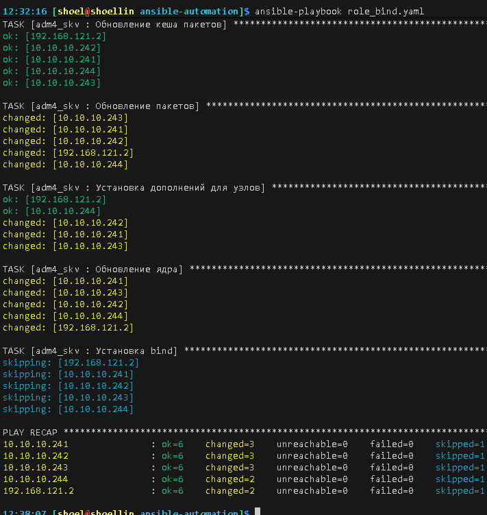

### Выполнение работы
#### Установка необходимых пакетов для SAMBA-DC
```bash
# Подключение к основному серверу SAMBA-DC
ssh -i ~/.ssh/id_kvm_host_to_vms \
-o "ProxyJump sadmin@alt-w-p11-route" \
-i ~/.ssh/id_vm sadmin@10.10.10.241

su -

# Если присутствую останавливаем конфликтующие службы
systemctl stop smb nmb krb5kdc slapd bind dnsmasq

# Чистка имеющихся настроек SAMBA
rm -f /etc/samba/smb.conf
rm -rf /var/lib/samba
rm -rf /var/cache/samba

# создание каталога для работы Домена
mkdir -p /var/lib/samba/sysvol

# Устанавливаем пакеты для SAMBA-DC и графическое управление его настройками
apt-get install alterator-net-domain task-samba-dc alterator-datetime

# Переименовываем имя сервера согласно FQDN имени домена 
hostnamectl set-hostname alt-s-p11-1.den.skv

# Устанавливаем имя NIS-домена
domainname den.skv

# Меняем на интерфейсе со статикой серверы DNS на внешний (в моем случае на кеширующий с внешними сетями DNS)
cat > /etc/net/ifaces/ens6/resolv.conf<<'EOF'
nameserver 10.10.10.254
EOF

resolvconf -a ens6 < /etc/net/ifaces/ens6/resolv.conf

# перезапускаем службу etcnet управления сетью
systemctl restart network

# перезапускам интерфейс
ifdown ens6; ifup ens6

# проверка работы через кеширующий DNS
cat /etc/resolv.conf

ping ya.ru -c 2
```
#### Создание домена с командной строки
```bash
# –realm задает область Kerberos (LDAP), и DNS имени домена;
# –domain задает имя домена (имя рабочей группы);
# –adminpass пароль основного администратора домена;
# –server-role тип серверной роли.
# –use-rfc2307 схема Совмести UNIX систем с Active Directory 
# при использовании открытых SMB ресурсов sysvol и netlogon на контроллере домена
samba-tool domain provision \
--realm=den.skv \
--domain den \
--adminpass='1qaz@WSX' --dns-backend=SAMBA_INTERNAL \
--server-role=dc \
--use-rfc2307

# Указание прослушивания только интерфейса локальной сети
sed -i '/7 = yes/r /dev/stdin' /etc/samba/smb.conf << 'EOF'
        bind interfaces only = yes
        interfaces = lo ens6
EOF

# Запуск/автозапуск служб Домена
systemctl enable --now samba

# Заменяем ip внешних DNS на самого себя после запуска служб Домена
cat > /etc/net/ifaces/ens6/resolv.conf<<'EOF'
nameserver 127.0.0.1
search den.skv
EOF

resolvconf -a ens6 < /etc/net/ifaces/ens6/resolv.conf

# перезапускаем службу etcnet управления сетью
systemctl restart network

# перезапускам интерфейс
ifdown ens6; ifup ens6

# проверка работы через кеширующий DNS
cat /etc/resolv.conf

# Для сервиса DHCP поменяем внешние DNS на локальные
sed -i 's/77.88.8.8, 77.88.8.1/10.10.10.241, 10.10.10.254/' /etc/dhcp/dhcpd.conf

systemctl restart dhcpd
```
#### Проверка поднятого домена
```bash
systemctl status samba

samba-tool domain info 127.0.0.1

cat /etc/samba/smb.conf
smbclient -L localhost -U Administrator

cat /etc/resolv.conf
ping pub.ru -c 2

host den.skv
host alt-s-p11-1.den.skv
host -t NS den.skv
host -t SRV _kerberos._udp.den.skv
host -t SRV _ldap._tcp.den.skv
```
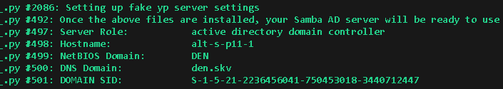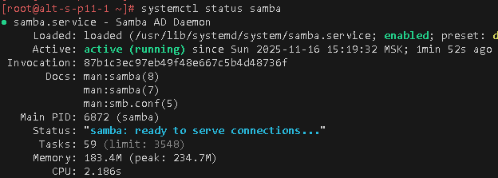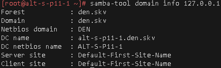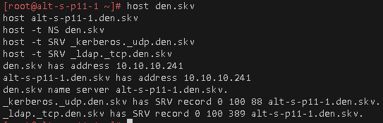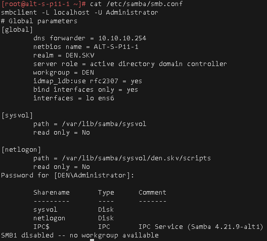

#### Проверка работы Kerberos
```bash
# Заменяем настройки Kerberos для клиентского обращение к серверу созданные доменом
cp /var/lib/samba/private/krb5.conf /etc/krb5.conf

# выходим из супер пользователя
exit

# проверка имеющихся белетов kerberos
klist

# удаление имеющихся ключей kerberos
kdestroy

# Получение белета kerberos
kinit Administrator

# Проверка получения белета
klist
```
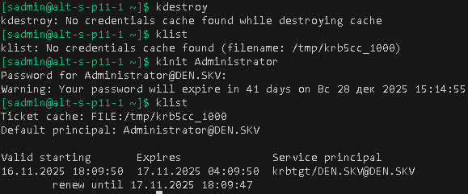
#### Создание пользователей
```bash
su -

samba-tool user create \
smaba_u1 \
--given-name='Василий Иванович Чапаев' \
--mail-address='chapay_vi@den.skv'

samba-tool user create \
smaba_u2 \
--given-name='Моледцев Владимир Александрович' \
--mail-address='syn_polka@den.skv'

samba-tool user create \
smaba_u3 \
--given-name='Колкин Павел Сергеевич' \
--mail-address='garaj@den.skv'

# Просмотр списка имеющихся пользователей
samba-tool user list

# Подробный просмотр пользователя LDAP 
samba-tool user show smaba_u2

# Разблокировка созданных учетных записей
for n in {1..3}; do \
samba-tool user \
setexpiry smaba_u$n \
--noexpiry; done
```
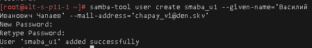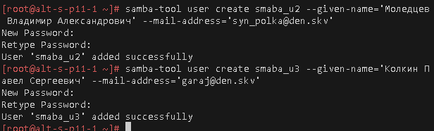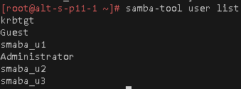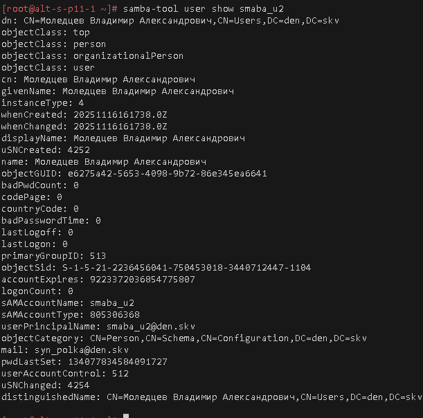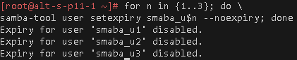

#### Создание групп пользователей
```bash
# Создание групп
samba-tool group add \
'Вымышленные_герои'

samba-tool group add \
'Доменные_Администраторы'

# Списки имеющихся групп
samba-tool group list 

# Добавление пользователей в группы
for n in {1..3}; do \
samba-tool group addmembers \
'Вымышленные_герои' \
smaba_u$n ; done

samba-tool group addmembers \
'Доменные_Администраторы' \
smaba_u1

for n in {1,2}; do \
samba-tool group addmembers \
'Доменные_Администраторы' \
smaba_u$n ; done

samba-tool group addmembers \
'Domain Admins' \
smaba_u1

# Проверка членства в группах
for g in \
{'Доменные_Администраторы','Вымышленные_герои','Domain Users','Domain Admins'}; do \
echo "---$g---"
samba-tool group listmembers "$g"; done
```
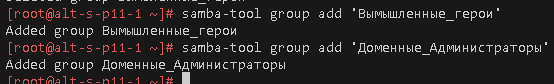
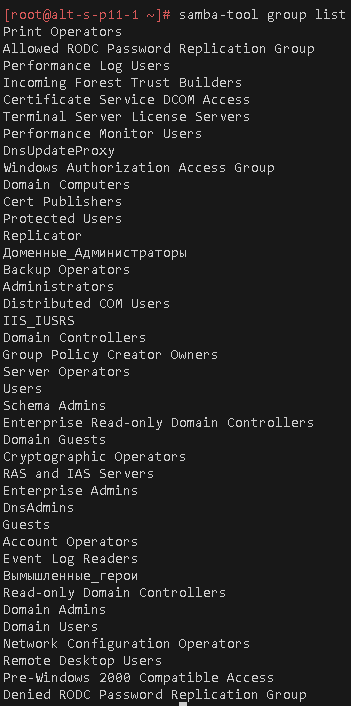
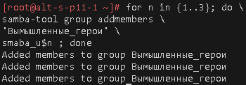
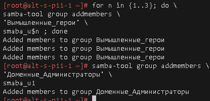
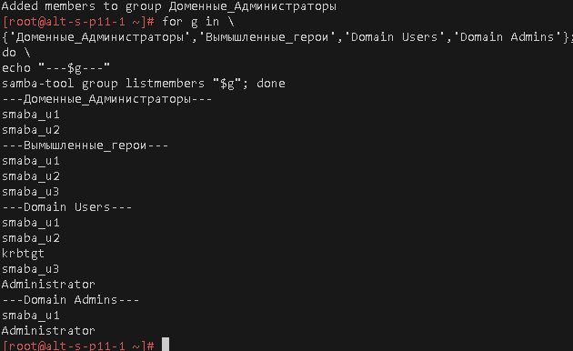

#### Подготовка сервера времени к основному SAMBA-DC серверу
```bash
# Перенастраиваем на Московские серверы ВНИИФТРИ ntp3.vniiftri.ru
sed -i 's/pool pool.ntp.org/server ntp3.vniiftri.ru/' \
/etc/chrony.conf

# Указание что данный сервер выступает в роли сервера времени
sed -i 's|#allow 192.168.0.0/16|allow 10.10.10.240/28|' \
/etc/chrony.conf

# Указываем возможность отвечать клиентам, если к внешнему NTP серверу нет доступа
sed -i 's|#local|local|' \
/etc/chrony.conf

# Перезапуск служб NTP
systemctl restart \
chrony-wait.service \
chronyd.service \
chrony.service

# Проверка NTP с новым сервером
chronyc tracking
chronyc sources -v

# Проверка открытого порта для клиентов
ss -ulnp | grep :123
```
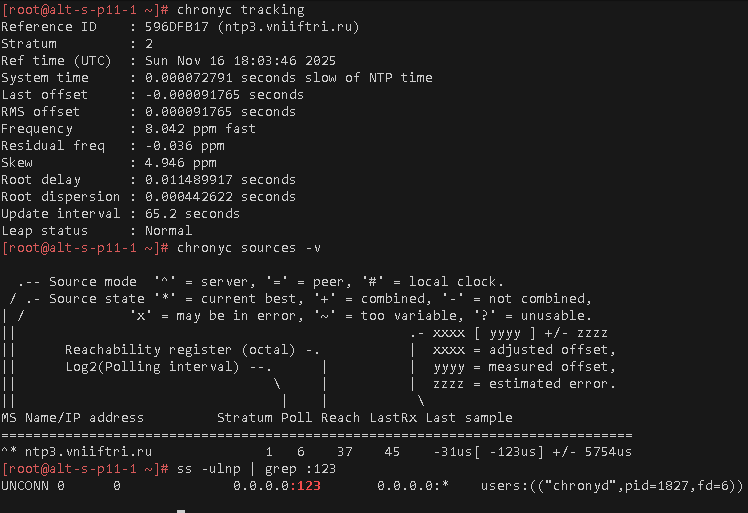

#### Подключение хостов к домену
```bash
# Подключение к Рабочей станции станция alt-w-p11-1
ssh -i ~/.ssh/id_kvm_host_to_vms \
-o "ProxyJump sadmin@192.168.121.2" \
-i ~/.ssh/id_vm sadmin@10.10.10.244

su -

# Перезапускаем сетевые службы для обновления DNS по DHCP
systemctl restart network
systemctl restart NetworkManager

# Проверка связи через внешние и локальные DNS
cat /etc/resolv.conf
ping pub.ru -c 2; \
ping den.skv -c 2

cat 
# Переименовываем имя хоста согласно FQDN имени домена 
hostnamectl set-hostname alt-w-p11-1.den.skv

# Перенастраиваем сервер времени на домен контроллер сети alt-s-p11-1
sed -i 's/pool pool.ntp.org/server alt-s-p11-1.den.skv/' \
/etc/chrony.conf

# Перезапуск служб NTP
systemctl restart \
chrony-wait.service \
chronyd.service \
chrony.service

# Проверка NTP с новым сервером
chronyc tracking
chronyc sources -v

# Установка пакетов для авторизации машины в Домен
apt-get update; \
apt-get -y install task-auth-ad-sssd

# Ввод в домен через командную строку 
# alt-w-p11-1 имя вводимого хоста
system-auth write ad \
den.skv alt-w-p11-1 den \
'smaba_u1' '1qaz@WSX'

# Проверка подсоединенного узла
net ads testjoin

ls -ld /etc/krb5*

cat /etc/krb5.conf

id smaba_u{1..3}

getent passwd smaba_u{1..3}
```
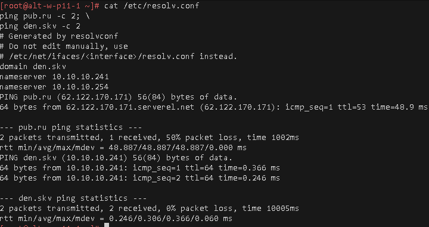
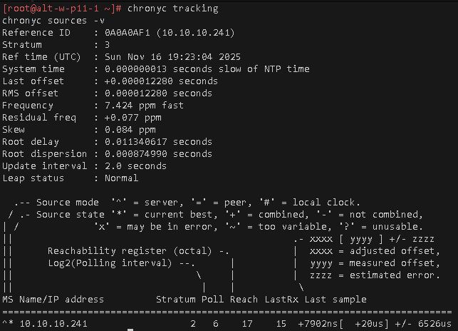
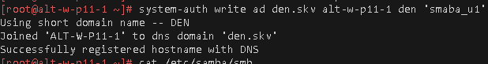
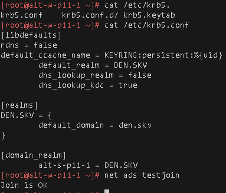
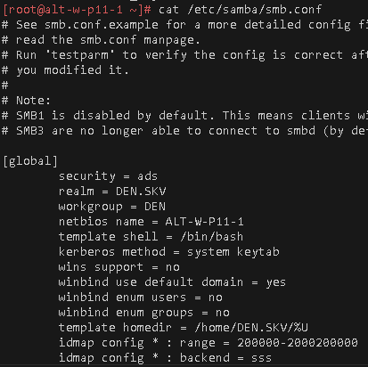
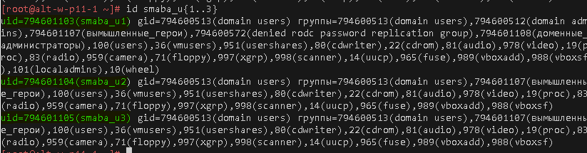
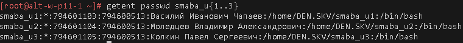

#### Установка ролей
```bash
# Проверка работы ролей на хосте введённого в домен
control libnss-role

# Вывод списка ролей хоста
rolelst

# Добавление доменной группы в роль local admins
echo 'Доменные_Администраторы:localadmins' >> /etc/role
```
#### Проверки входа
```bash
# Выход из-под суперпользователя
exit

# Выход с управляемого хоста
exit

# Подключение доменными учётными записями smaba_u1@DEN.SKV smaba_u2@DEN.SKV smaba_u3@DEN.SKV
# Напоминание иерархии
ssh -i ~/.ssh/id_kvm_host_to_vms -o "ProxyJump sadmin@192.168.121.2"  smaba_u3@DEN.SKV@10.10.10.244

# Проверка получения kerberos билета при входе
klist

# Проверка членства в группах и ролях
id

# Проверка авторизации суперпользователем хоста
su -
```
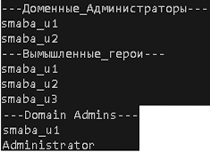
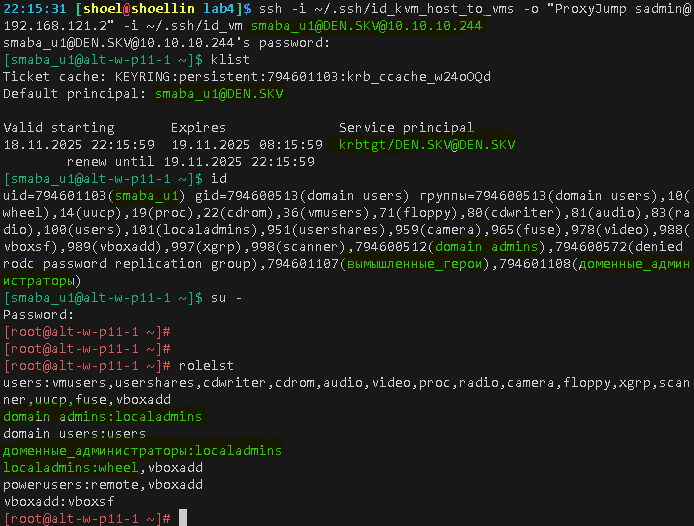
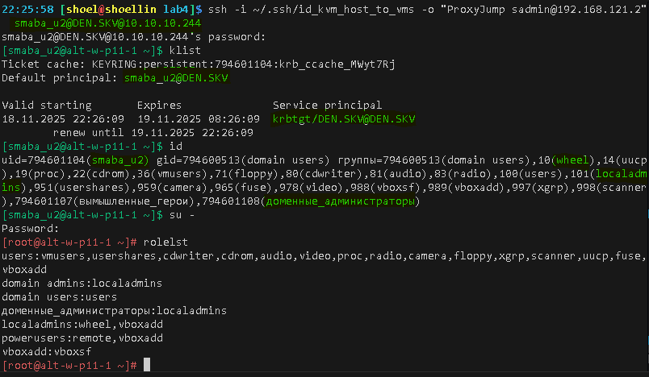
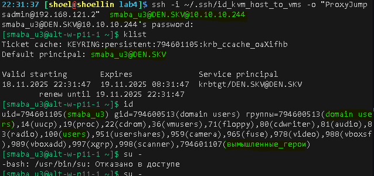

#### Подготовка Стенда перед созданием Вторичного домен контроллера
```bash
# Вход на основной сервер
ssh -i ~/.ssh/id_kvm_host_to_vms \
-o "ProxyJump sadmin@alt-w-p11-route" \
-i ~/.ssh/id_vm sadmin@10.10.10.241

su -

# выключаем машину
systemctl poweroff

# Вход на сервер вторичного DC
ssh -i ~/.ssh/id_kvm_host_to_vms \
-o "ProxyJump sadmin@192.168.121.2" \
-i ~/.ssh/id_vm sadmin@10.10.10.242

su -

# выключаем машину
systemctl poweroff


# Выводим список снэпшотов ВМ стенда
sudo bash -c \
"for i in \$(virsh list --all \
| awk '/nux/ {print \$2}') ; do \
echo "----\$i"
virsh snapshot-list --domain \$i; done"

# Создание snapshot
### Основного сервера сети
sudo virsh snapshot-create-as \
--domain adm4_altlinux_s1 \
--name 3 \
--description "before_lab4-4" --atomic


### Дополнительного сервера сети
sudo virsh snapshot-create-as \
--domain adm4_altlinux_s2 \
--name 3 \
--description "before_lab4-4" --atomic


# Поочередный запуск всех ВМ содержащих "nux"
sudo bash -c \
"for i in \$(virsh list --all \
| awk '/nux/ {print \$2}') ; do \
virsh start --domain \$i; done"
```

#### Подготовка создания Вторичного домен контроллера
```bash
# Вход на вторичный DC
ssh -i ~/.ssh/id_kvm_host_to_vms \
-o "ProxyJump sadmin@192.168.121.2" \
-i ~/.ssh/id_vm sadmin@10.10.10.242

su -

# Переименовываем имя хоста согласно FQDN имени домена 
hostnamectl set-hostname alt-s-p11-2.den.skv

# Перенастраиваем сервер времени на домен контроллер сети alt-s-p11-1
sed -i 's/pool pool.ntp.org/server alt-s-p11-1.den.skv/' \
/etc/chrony.conf

# Указание что данный сервер выступает в роли сервера времени
sed -i 's|#allow 192.168.0.0/16|allow 10.10.10.240/28|' \
/etc/chrony.conf

# Указываем возможность отвечать клиентам, если к внешнему NTP серверу нет доступа
sed -i 's|#local|local|' \
/etc/chrony.conf

# Перезапуск служб NTP
systemctl restart \
chrony-wait.service \
chronyd.service \
chrony.service

# Проверка NTP с новым сервером
chronyc tracking
chronyc sources -v
ss -ulpn | grep ":123"

# Установка необходимых пакетов
apt-get update; \
apt-get -y install \
task-samba-dc

# Подготовка kerberos 
sed -i 's/lm = true/lm = false/' \
/etc/krb5.conf

sed -i 's/# default_realm = EXAMPLE.COM/\ default_realm = DEN.SKV/' \
/etc/krb5.conf

# Вход на основной контроллер домена
ssh sadmin@alt-s-p11-1

su -

# Создание A DNS записи для вторичного DC
## 127.0.0.1 на DC этого сервера
## В зоне DNS den.skv
## Добавляем хост с именем alt-s-p11-2
## под соответствующей A записью ipv4 10.10.10.242
## Процедуру выполняем под доменным пользователем входящих в Domain Admins smaba_u1
samba-tool dns add \
127.0.0.1 \
den.skv \
alt-s-p11-2 \
A 10.10.10.242 \
-Usmaba_u1

# Проверка созданной записи
samba-tool dns query \
127.0.0.1 \
den.skv \
alt-s-p11-2 \
ALL \
-Usmaba_u1


# Возвращаемся на вторичный сервер
exit

exit

# проверка что DNS вторичного сервера подхватил настройки с DHCP
cat /etc/resolv.conf

# Получаем kerberos билет на имя входящего в доменную группу Domain Admins 
kinit smaba_u1

# проверка полученного билета
klist

# Остановка служб мешающих развертыванию
systemctl disable --now smb nmb krb5kdc slapd bind dnsmasq

# Чиста конфигов, настроенных и по умолчанию
rm -f /etc/samba/smb.conf
rm -rf /var/lib/samba
rm -rf /var/cache/samba

# Создание каталога для домен-контроллера
mkdir -p /var/lib/samba/sysvol

# Развертывание второго DC
## den.skv указание подключения к домену
## Роль в домене DC
## -Usmaba_u1 аутентифицироваться под указанным пользователем
## опции
### --realm=den.skv как зарегистрировать realm
### Перенаправление запросов внешних DNS через указанный сервер
samba-tool domain join \
den.skv \
DC \
-Usmaba_u1 \
--realm=den.skv \
--option="dns forwarder=10.10.10.254"
```
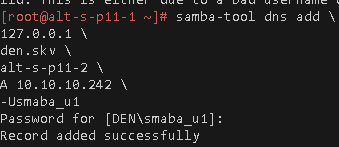
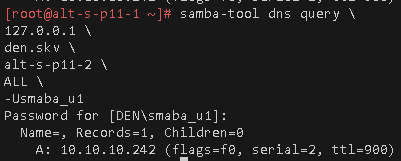
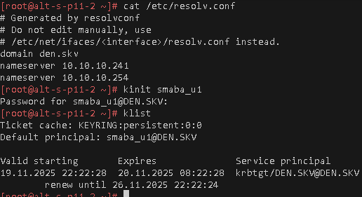
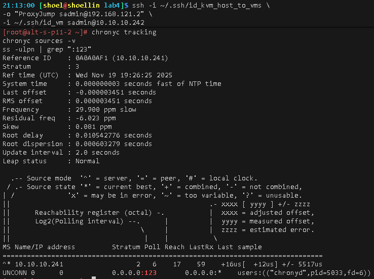
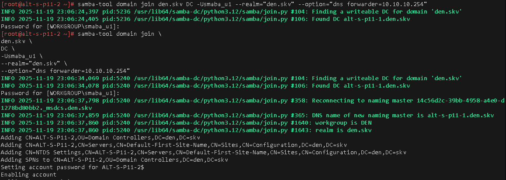


#### перевод работы интерфейса Вторичного сервера с DHCP адресации на static
```bash
# выставляем статический Ip
echo "10.10.10.242/28" \
> /etc/net/ifaces/ens6/ipv4address

# Выставляем шлюз
echo "default via 10.10.10.254" \
> /etc/net/ifaces/ens6/ipv4route

# указываем основным DNS самого себя
touch /etc/net/ifaces/ens6/resolv.conf
cat > /etc/net/ifaces/ens6/resolv.conf <<'EOF' 
nameserver 127.0.0.1
search den.skv
EOF

# Доступность сети во время загрузки
echo "ONBOOT=yes" >> /etc/net/ifaces/ens6/options

# Проставляем режим получения адресов IP интерфейса хоста в static режиме
sed -i 's/\bdhcp\b/static/; s/dhcp4/static/' \
/etc/net/ifaces/ens6/options

# Перезапускаем сетевые службы для обновления настроек интерфейса или reboot
systemctl restart network
ifdown ens6; ifup ens6
```
# Запуск вторичного сервера и проверки
```bash
# запускаем службу вторичного DC
kinit smaba_u1

systemctl enable --now samba

# Проверки

cat /etc/resolv.conf
host den.skv
host -t NS den.skv
host ya.ru
host -t SRV _ldap._tcp.den.skv
samba-tool computer list
journalctl -efu samba
```
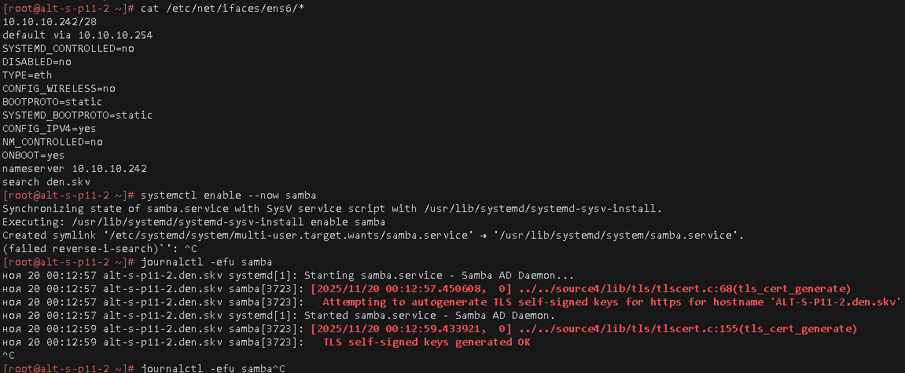
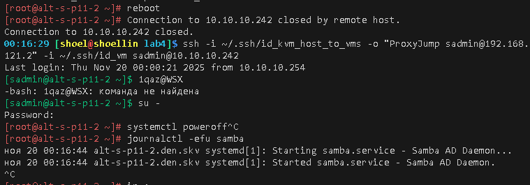
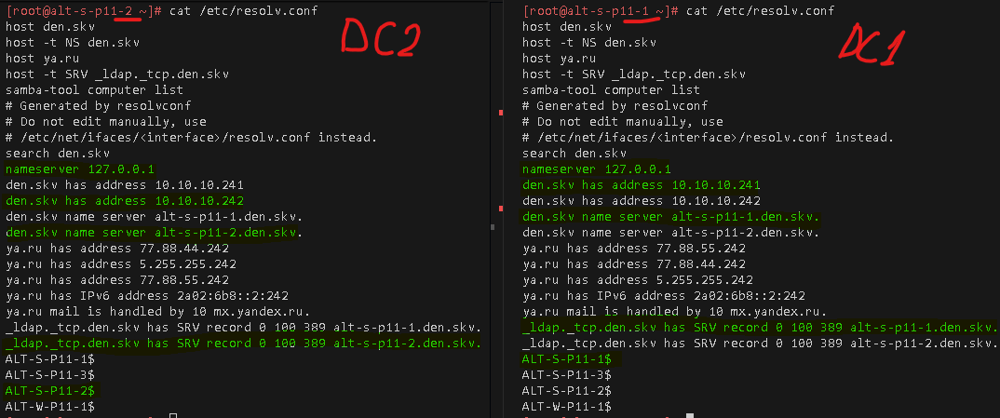
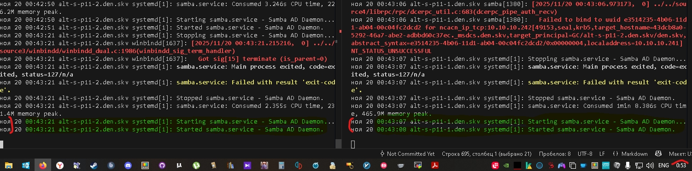
### Для github
```bash
git add . .. ../.. \
&& git status

git log --oneline

git commit -am "оформление для ADM4_lab4_upd7" \
&& git push -u altlinux main
```