# Лабораторная работа 5 «`Создание доменной инфраструктуры FreeIPA`»
#### памятка для входа на машины локальной сети
```bash
# включаем агента и запущенному процессу регистрируем используемые ключи
eval $(ssh-agent) \
&& ssh-add ~/.ssh/id_vm \
&& ssh-add  ~/.ssh/id_kvm_host_to_vms

# Шлюз и кеширующий сервер DNS
ssh \
-i ~/.ssh/id_kvm_host_to_vms \
sadmin@alt-w-p11-route

# Основной DC
ssh -i ~/.ssh/id_kvm_host_to_vms \
-o "ProxyJump sadmin@alt-w-p11-route" \
-i ~/.ssh/id_vm sadmin@10.10.10.241

# сервер вторичный DC
ssh -i ~/.ssh/id_kvm_host_to_vms \
-o "ProxyJump sadmin@192.168.121.2" \
-i ~/.ssh/id_vm sadmin@10.10.10.242

# сервер alt-s-p11-3
ssh -i ~/.ssh/id_kvm_host_to_vms \
-o "ProxyJump sadmin@192.168.121.2" \
-i ~/.ssh/id_vm sadmin@10.10.10.243

# сервер alt-w-p11-1
ssh -i ~/.ssh/id_kvm_host_to_vms \
-o "ProxyJump sadmin@192.168.121.2" \
-i ~/.ssh/id_vm sadmin@10.10.10.244
```
### Предварительно
##### Для github
```bash
git config --global --add safe.directory .

git branch -v

git remote -v


git remote add altlinux https://github.com/shoelacevip12/altlinux_study.git

git log --oneline

git pull altlinux main

cd ~/nfs_git/adm/adm4

mkdir -p lab5/img

cd lab5

touch README.md
```

### Подготовка стенда
```bash
# включаем агента-ssh
eval $(ssh-agent) \
&& ssh-add ~/.ssh/id_vm \
&& ssh-add  ~/.ssh/id_kvm_host_to_vms

# Выводим список ВМ стенда для напоминания
sudo virsh list --all

# Выводим список снэпшотов ВМ стенда
sudo bash -c \
"for i in \$(virsh list --all \
| awk '/nux/ {print \$2}') ; do \
echo "\$i" && \
virsh snapshot-list --domain \$i; done"

# Создаем снэпшот переустановленного клиента
sudo virsh snapshot-create-as \
--domain adm4_altlinux_w1 \
--name 1 \
--description "before_lab5" --atomic

# Удаляем снэпшот цепочки основного сервера alt-s-p11-1 после настройки DNS службы
sudo virsh snapshot-delete \
--domain adm4_altlinux_s1 \
--snapshotname 3

# Откатываем основной сервер alt-s-p11-1 на снэпшот до настройки DNS службы
sudo virsh snapshot-revert \
--snapshotname 2 \
--domain adm4_altlinux_s1

# Удаляем снэпшот цепочки сервера alt-s-p11-2 после настройки DNS службы
sudo virsh snapshot-delete \
--domain adm4_altlinux_s2 \
--snapshotname 3

# Откатываем Вторичный сервер alt-s-p11-2 на снэпшот до настройки DNS службы
sudo virsh snapshot-revert \
--snapshotname 2 \
--domain adm4_altlinux_s2

# Откатываем сервер alt-s-p11-3 на снэпшот до настройки standalone SMB сервера
sudo virsh snapshot-revert \
--snapshotname 2 \
--domain adm4_altlinux_s3
```
### Запуск стенда
```bash
# Поочередный запуск всех сетей libvirt со 2ого по списку
sudo virsh net-list --all \
| awk 'NR > 3 {print $1}' \
| xargs -I {} sudo virsh net-start {}

# Запуск шлюза
sudo virsh start \
--domain adm4_altlinux_w2

# Запуск основного DNS сервера
sudo virsh start \
--domain adm4_altlinux_s1

# Поочередный запуск всех ВМ содержащих "nux"
sudo bash -c \
"for i in \$(virsh list --all \
| awk '/nux/ {print \$2}') ; do \
virsh start --domain \$i; done"
```
## План для выполнения 
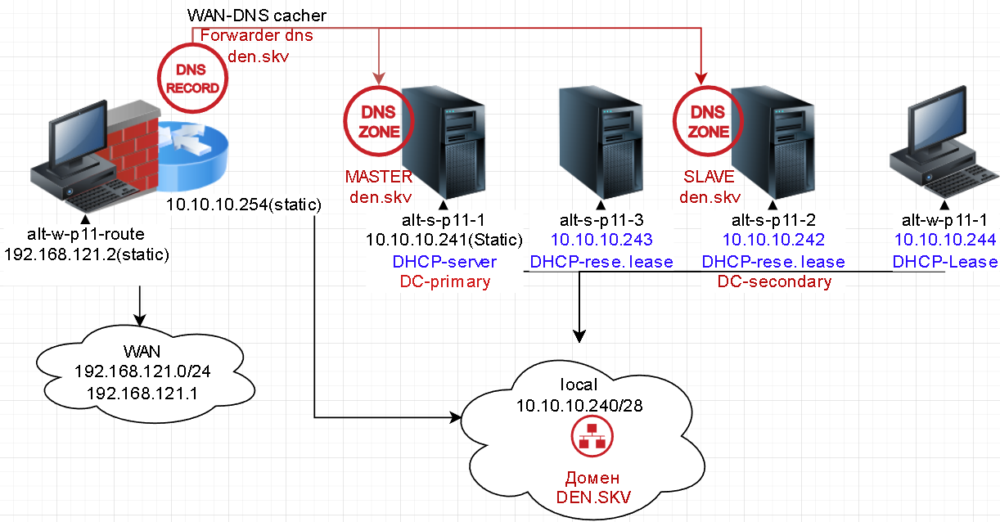

### подготовка RDP на шлюзе для взаимодействия с сетевыми службами локальной сети
```bash
# вход на шлюз
ssh \
-i ~/.ssh/id_kvm_host_to_vms \
sadmin@alt-w-p11-route

su -

# Возвращаем runlevel с 3 до 5 уровня ядра для графического взаимодействия
systemctl isolate graphical.target
systemctl set-default graphical.target

exit

exit
```


### Обновление и установка для работы со стендом на всех узлах через Ansible
```bash
cd ../ansible-automation/

# Используем роль для установки BIND, исключив установку BIND
# только обновление пакетов для всех узлов
ansible-playbook role_bind.yaml

# УСтановка RDP сервера на шлюзе для взаимодействия с сетевыми службами локальной сети по браузеру
ansible-playbook role_xrdp.yaml

cd -
```
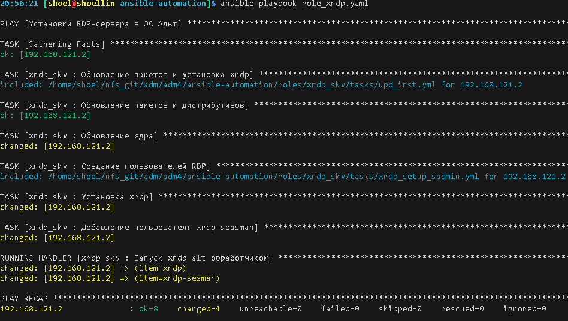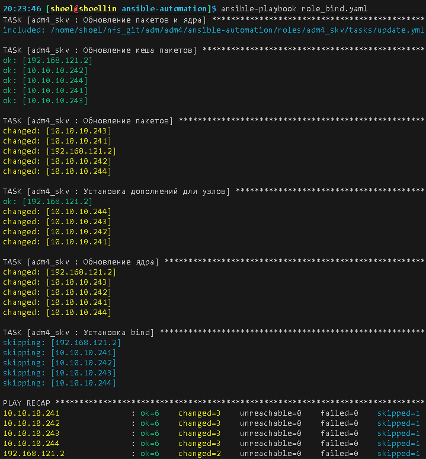

### Выполнение работы
#### Установка необходимых пакетов для FreeIPA-DC
```bash
# Подключение к основному серверу FreeIPA-DC
ssh -i ~/.ssh/id_kvm_host_to_vms \
-o "ProxyJump sadmin@alt-w-p11-route" \
-i ~/.ssh/id_vm sadmin@10.10.10.241

su -

# Если присутствую останавливаем конфликтующие службы
systemctl stop \
smb \
nmb \
krb5kdc \
slapd \
bind \
dnsmasq


# Чистка имеющихся настроек SAMBA
rm -f /etc/samba/smb.conf
rm -rf /var/lib/samba
rm -rf /var/cache/samba

# создание каталога для работы Домена
mkdir -p /var/lib/samba/sysvol

# Устанавливаем пакеты для FreeIPA-DC и графическое управление его настройками
apt-get update \
&& apt-get install -y \
haveged \
freeipa-server \
freeipa-server-dns

# Переименовываем имя сервера согласно FQDN имени домена 
hostnamectl set-hostname alt-s-p11-1.den.skv

# Имя узла и файл /etc/hosts
## порядок прописи FQDN и имя хоста ВАЖЕН!!!!
echo -e "$(ip -br a \
| awk 'NR > 1 \
{print $3}' \
| cut -d'/' -f1) \
$HOSTNAME.den.skv $HOSTNAME" \
>> /etc/hosts

cat /etc/hosts

# Убираем на интерфейсе со статикой серверы любые DNS
cat > /etc/net/ifaces/ens6/resolv.conf<<'EOF'
search den.skv
EOF

# Для сервиса DHCP поменяем внешние DNS на локальные
sed -i 's/77.88.8.8, 77.88.8.1/10.10.10.241, 10.10.10.254/' /etc/dhcp/dhcpd.conf

systemctl restart dhcpd

resolvconf -a ens6 < /etc/net/ifaces/ens6/resolv.conf

# перезапускаем службу etcnet управления сетью
systemctl restart network

# перезапускам интерфейс
ifdown ens6; ifup ens6

# проверка работы через кеширующий DNS
cat /etc/resolv.conf

# Запуск службы энтропии
systemctl enable --now haveged
```
#### Установка основного сервера и проверка
```bash
# Запуск интерактивного установщика
ipa-server-install

ipactl status
```

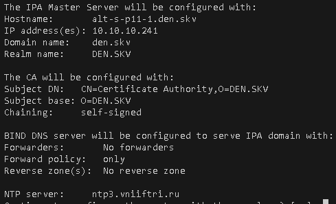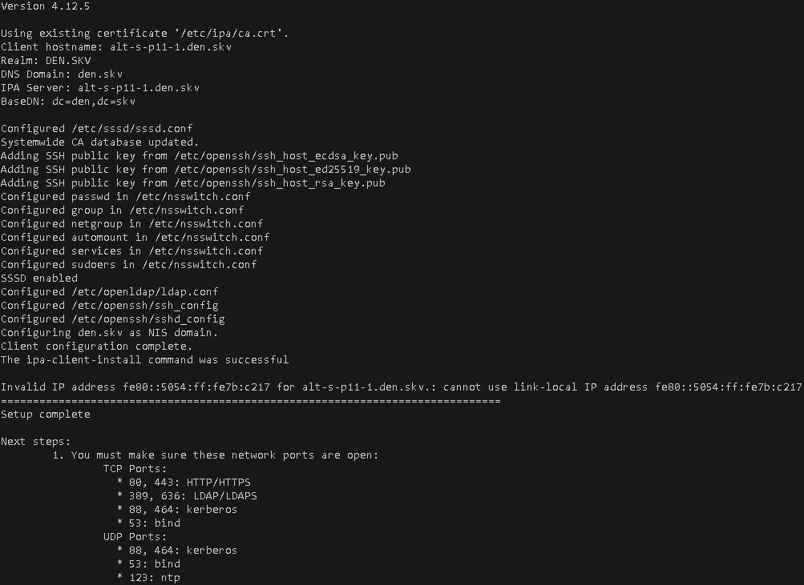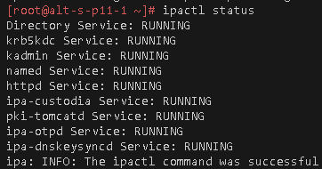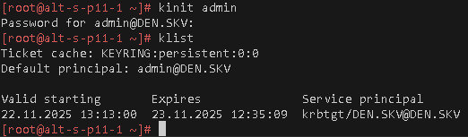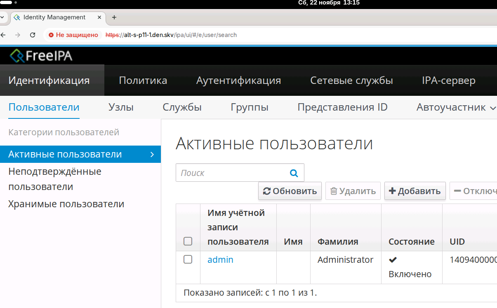

#### Создание пользователей и групп
```bash
ipa user-add \
Chapay_IV \
--first=Иван \
--last=Чапаев \
--displayname="Иван Васильевич Чапаев" \
--password

ipa group-add \
division_25 \
--desc "25-ая Чапаевская дивизия"

ipa user-find \
| grep 'пользователя'

ipa group-add-member \
division_25 \
--users=Chapay_IV

ipa group-add-member \
division_25 \
--users=petka_i

ipa group-add-member \
ordinarec \
--users=petka_i

ipa user-find | grep 'Имя ' \
&& ipa group-find | grep 'группы:' \
&& ipa group-show division_25 \
&& ipa group-show ordinarec
```
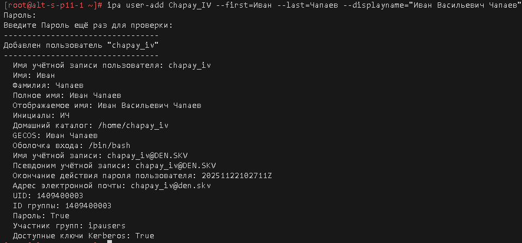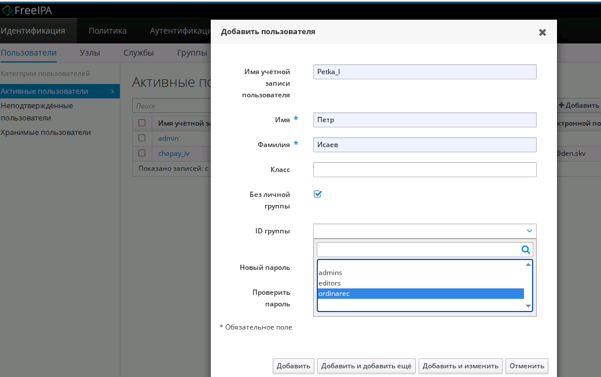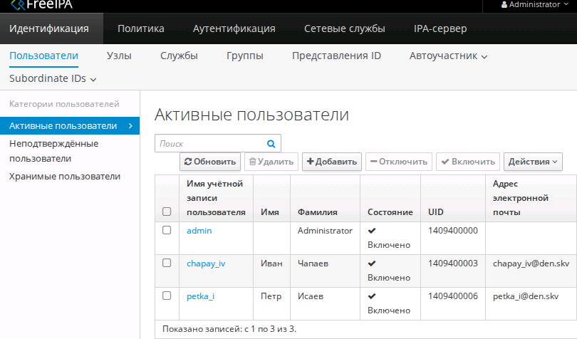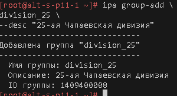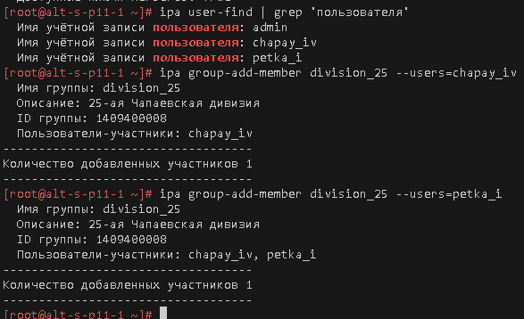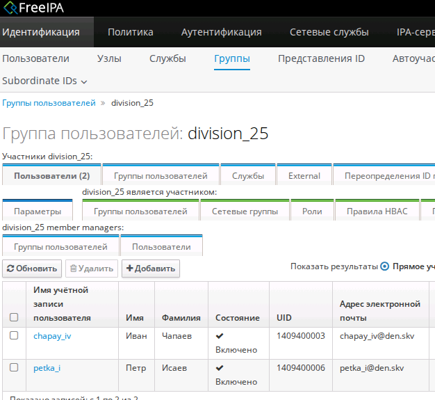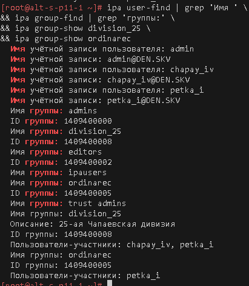

```bash
# Вход на станцию alt-w-p11-1
ssh -i ~/.ssh/id_kvm_host_to_vms \
-o "ProxyJump sadmin@192.168.121.2" \
-i ~/.ssh/id_vm sadmin@10.10.10.244

# Перезапускаем сетевые службы для обновления DNS по DHCP
systemctl restart network
systemctl restart NetworkManager

# Проверка связи через внешние и локальные DNS
cat /etc/resolv.conf

# Если присутствую останавливаем конфликтующие службы
systemctl stop \
smb \
nmb \
krb5kdc \
slapd \
bind \
dnsmasq

# Чистка имеющихся настроек SAMBA
rm -f /etc/samba/smb.conf
rm -rf /var/lib/samba
rm -rf /var/cache/samba

# Устанавливаем пакеты для FreeIPA-клиента
apt-get update \
&& apt-get install -y \
freeipa-client \
libsss_sudo \
krb5-kinit \
bind-utils \
libbind \
zip \
task-auth-freeipa \
freeipa-client-automount

# Переименовываем имя сервера согласно FQDN имени домена 
hostnamectl set-hostname alt-w-p11-1.den.skv

# Проверка возвращения ответа о службе kerberos от поднятого DC freeipa
host -t SRV _kerberos._udp.den.skv

ipa-client-install

# Проверка статуса нахождения в домене
system-auth status

# выход из хоста
exit
exit

# Авторизация под доменной учетной записью
ssh -i ~/.ssh/id_kvm_host_to_vms \
-o "ProxyJump sadmin@192.168.121.2" \
petka_i@10.10.10.244
```

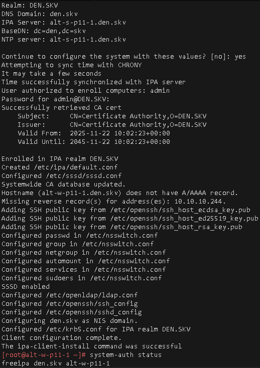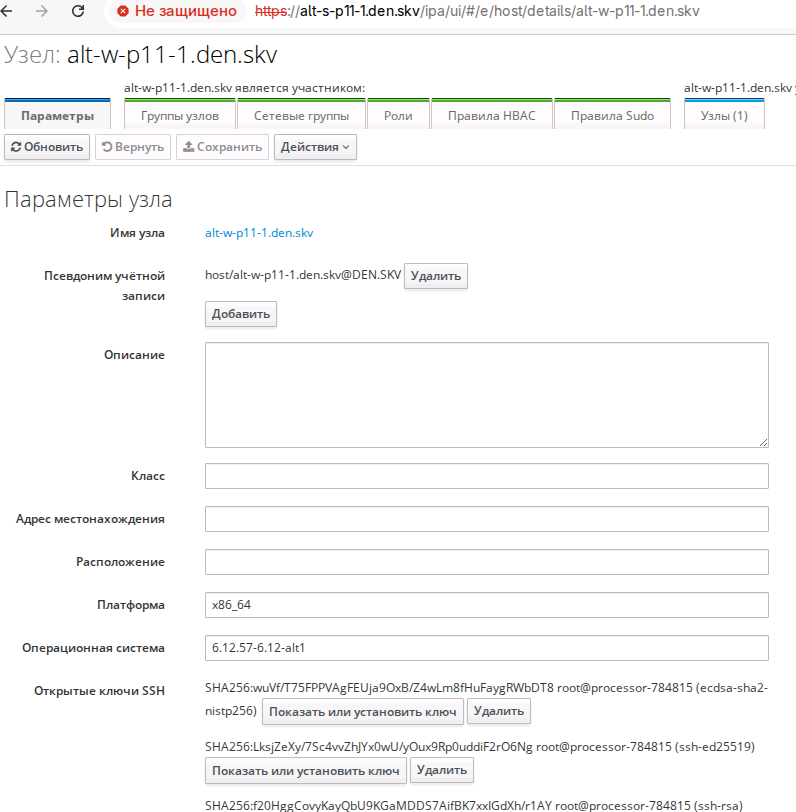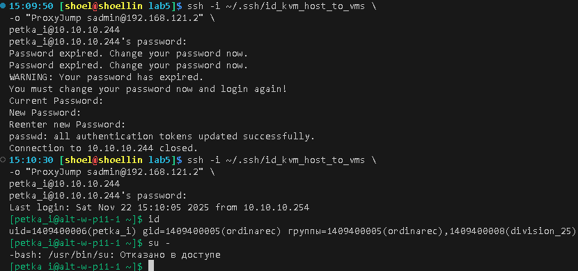

### Для github
```bash
git add . .. ../.. \
&& git status

git log --oneline

git commit -am "оформление для ADM4_lab5_upd2" \
&& git push -u altlinux main
```

