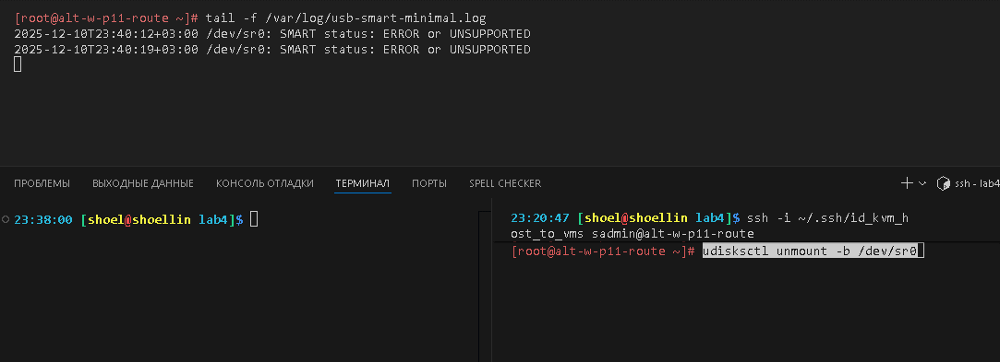

# Лабораторная работа 4 «`Обработка событий подключения съемных носителей`»
#### памятка для входа на машины локальной сети
```bash
# включаем агента и запущенному процессу регистрируем используемые ключи
eval $(ssh-agent) \
&& ssh-add ~/.ssh/id_vm \
&& ssh-add  ~/.ssh/id_kvm_host_to_vms

# Рабочая станция p11
ssh \
-i ~/.ssh/id_kvm_host_to_vms \
sadmin@alt-w-p11-route
```

## Предварительно
### Для github
```bash
cd nfs_git/adm

git config --global --add safe.directory .

git branch -v

git remote -v

git remote add altlinux https://github.com/shoelacevip12/altlinux_study.git

git log --oneline

git pull altlinux main

mkdir -p adm5/lab4

cd !$

mkdir img

touch README.md
```

### Подготовка и запуск стенда
```bash
# включаем агента-ssh
eval $(ssh-agent) \
&& ssh-add ~/.ssh/id_vm \
&& ssh-add  ~/.ssh/id_kvm_host_to_vms

# Выводим список ВМ стенда для напоминания
sudo virsh list --all

# Поочередный запуск всех сетей libvirt со 2ого по списку
sudo virsh net-list --all \
| awk 'NR > 3 {print $1}' \
| xargs -I {} sudo virsh net-start {}

# Запуск Рабочей станции p11
sudo virsh start \
--domain adm4_altlinux_w2
```

### Выполнение работы
```bash
# вход на хост
ssh \
-i ~/.ssh/id_kvm_host_to_vms \
sadmin@alt-w-p11-route

su -

# обновление системы и установка osec и osec-cronjob
apt-get update \
&& update-kernel -y \
&& apt-get dist-upgrade -y \

# Создание правила
cat > /etc/udev/rules.d/99-usb-on.rules <<'EOF'
# Для USB-флешек, дисков и т.п. (sd* и sr*)
ACTION=="add", SUBSYSTEMS=="usb", SUBSYSTEM=="block", KERNEL=="sd[a-z]*", \
RUN+="/bin/sh /etc/udev/usb_on_smart.sh %k"

ACTION=="change", SUBSYSTEM=="block", KERNEL=="sr[0-9]*", \
RUN+="/bin/sh /etc/udev/usb_on_smart.sh %k"
EOF

# Создание скрипта
cat > /etc/udev/usb_on_smart.sh <<'EOF'
#!/bin/sh
export PATH=/usr/bin:/bin:/usr/sbin:/sbin

dev="/dev/$1"
[ -b "$dev" ] || exit 0

# Получаем статус
status=$(smartctl -H "$dev" 2>&1 \
| grep -i 'SMART Health Status:' \
| sed 's/.*://; s/^[[:space:]]*//')

if [ -n "$status" ]; then
    # Используем date без -I
    ts=$(date '+%Y-%m-%dT%H:%M:%S%z')
    msg="$ts $dev: $status"
    echo "$msg" >> /var/log/usb-smart-minimal.log
fi
EOF

# Делаем скрипт исполняемым
chmod +x /etc/udev/usb_on_smart.sh
```
### Тестирование 1 монтирование образ диска
```bash
# Монтирование и размонтирование образа диска
udisksctl unmount -b /dev/sr0

udisksctl mount -b /dev/sr0
```

### Тестирование 2 проброс флешки на виртуальную машину с хоста
```bash
# Создание конфига монтирования флешки
cat > ./usb-device.xml <<EOF
<hostdev mode='subsystem' type='usb'>
  <source>
    <vendor id='0x346d'/>
    <product id='0x5678'/>
  </source>
</hostdev>
EOF

# Проброс флешки на ВМ
sudo virsh attach-device \
adm4_altlinux_w2 --config --live \
./usb-device.xml

# Отключение флешки от ВМ 
sudo virsh detach-device \
adm4_altlinux_w2 --config --live \
./usb-device.xml

# Проброс флешки на ВМ
sudo virsh attach-device \
adm4_altlinux_w2 --config --live \
./usb-device.xml

# Просмотр лог файла созданный скриптом
tail -f /var/log/usb-smart-minimal.log
```



### Для github
```bash
git add . .. ../.. \
&& git status

git log --oneline

git commit -am "оформление для ADM5_lab4_upd4" \
&& git push -u altlinux main
```