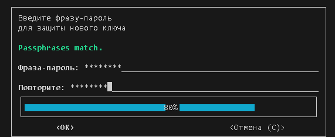
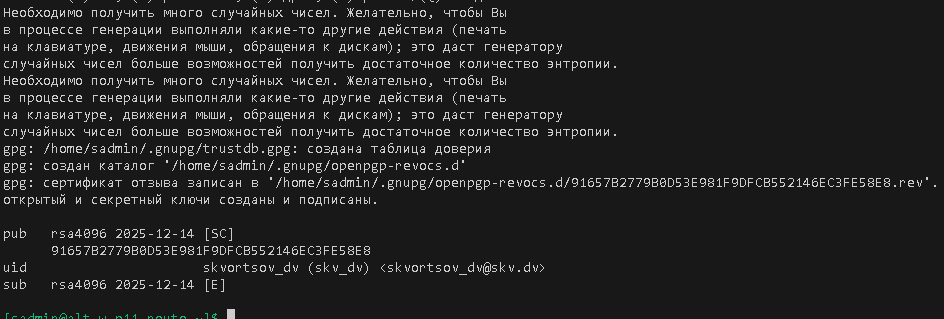
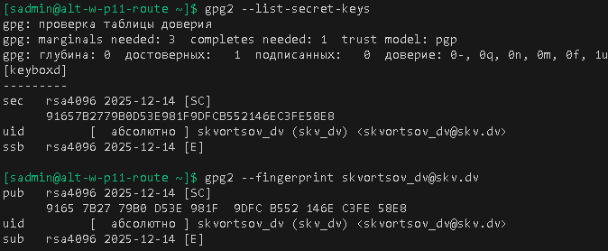
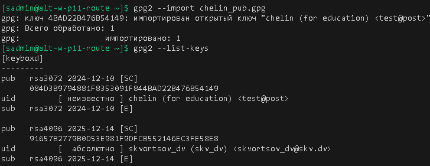
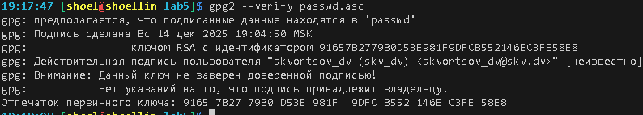
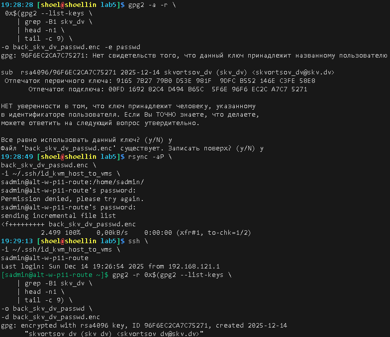
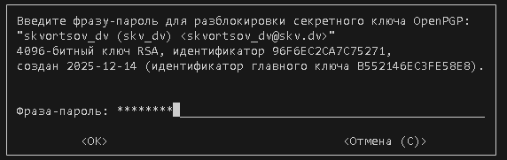
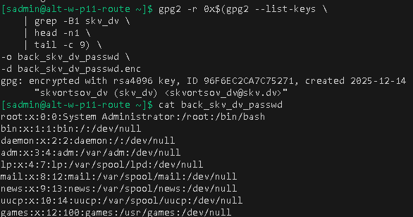

# Лабораторная работа 5 «`Использование GnuPG`»
#### памятка для входа на машины локальной сети
```bash
# включаем агента и запущенному процессу регистрируем используемые ключи
eval $(ssh-agent) \
&& ssh-add ~/.ssh/id_vm \
&& ssh-add  ~/.ssh/id_kvm_host_to_vms

# Рабочая станция p11
ssh \
-i ~/.ssh/id_kvm_host_to_vms \
sadmin@alt-w-p11-route
```

## Предварительно
### Для github
```bash
cd nfs_git/adm

git config --global --add safe.directory .

git branch -v

git remote -v

git remote add altlinux https://github.com/shoelacevip12/altlinux_study.git

git log --oneline

git pull altlinux main

mkdir -p adm5/{lab5,lab5/img}

cd adm5/lab5

touch README.md
```

### Подготовка и запуск стенда
```bash
# включаем агента-ssh
eval $(ssh-agent) \
&& ssh-add ~/.ssh/id_vm \
&& ssh-add  ~/.ssh/id_kvm_host_to_vms

# Выводим список ВМ стенда для напоминания
sudo virsh list --all

# Поочередный запуск всех сетей libvirt со 2ого по списку
sudo virsh net-list --all \
| awk 'NR > 3 {print $1}' \
| xargs -I {} sudo virsh net-start {}

# Выводим список снэпшотов ВМ стенда
sudo bash -c \
"for i in \$(virsh list --all \
| awk '/nux/ {print \$2}') ; do \
echo "\$i" && \
virsh snapshot-list --domain \$i; done"

# Откатываем хост adm4_altlinux_w2 на снэпшот 5 из-за отключенной флешки на хосте
sudo virsh snapshot-revert \
--snapshotname 5 \
--domain adm4_altlinux_w2

# Запуск Рабочей станции p11
sudo virsh start \
--domain adm4_altlinux_w2
```

### Выполнение работы
```bash
# Проброс публичного ключа chelin_pub.gpg на хост
rsync -aP \
chelin_pub.gpg \
-i ~/.ssh/id_kvm_host_to_vms \
sadmin@alt-w-p11-route:/home/sadmin

# вход на хост
ssh \
-i ~/.ssh/id_kvm_host_to_vms \
sadmin@alt-w-p11-route

su -

# обновление системы и установка gnupg и gnupg2
apt-get update \
&& update-kernel -y \
&& apt-get dist-upgrade -y \
&& apt-get install -y gnupg gnupg2

# выход из супер пользователя
exit

#Генерация пары ключей средствами gpg через интерактивные запросы
gpg2 --full-generate-key

# Проверка списка ключей
gpg2 --list-secret-keys

gpg2 --fingerprint skvortsov_dv@skv.dv
```


```bash
# Импорт публичного ключа 
gpg2 --import chelin_pub.gpg

# Вывод наличия ключей
gpg2 --list-keys
```


```bash
# Данные для шифрования
cp /etc/passwd ./

ll passwd
```
```bash
# Шифрование импортированным ключем chelin_pub.gpg
gpg2 -a -r \
 0x$(gpg2 --list-keys \
    | grep -B1 chelin \
    | head -n1 \
    | tail -c 9) \
-o passwd.enc -e passwd

# Выгрузка на хост машину
rsync -aP \
passwd.enc \
shoel@192.168.121.1:/home/shoel/nfs_git/adm/adm5/lab5/chelin_passwd.enc
```
```bash
# Экспорт личного открытого ключа для передачи в виде PGP PUBLIC KEY BLOCK 
gpg2 -o skv_dv.gpg \
--armor \
--export \
    0x$(gpg2 --list-keys \
    | grep -B1 skv_dv \
    | head -n1 \
    | tail -c 9)

# Шифрование личным ключем skv_dv.gpg
gpg2 -a -r \
 0x$(gpg2 --list-keys \
    | grep -B1 skv_dv \
    | head -n1 \
    | tail -c 9) \
-o skv_dv_passwd.enc -e passwd

# Выгрузка на хост машину
rsync -aP \
skv_dv.gpg \
skv_dv_passwd.enc \
shoel@192.168.121.1:/home/shoel/nfs_git/adm/adm5/lab5/
```
```bash
# Создание отсоединенной текстовой электронной подписи для файла /etc/passwd
gpg2 --sign \
--detach-sign \
--default-key \
 0x$(gpg2 --list-keys \
    | grep -B1 skv_dv \
    | head -n1 \
    | tail -c 9) \
--armor \
passwd

# Выгрузка на хост машину
rsync -aP \
passwd.asc \
passwd \
shoel@192.168.121.1:/home/shoel/nfs_git/adm/adm5/lab5/
```

### Проверка работы с личной подписью
```bash
# Выходи на хост с выгруженными файлами
exit

# Импорт личного публичного ключа
gpg2 --import skv_dv.gpg

# Проверка подписи личного ключа
gpg2 --verify passwd.asc

# Шифрование импортированным личным ключем skv_dv.gpg
gpg2 -a -r \
 0x$(gpg2 --list-keys \
    | grep -B1 skv_dv \
    | head -n1 \
    | tail -c 9) \
-o back_skv_dv_passwd.enc -e passwd

# Проброс файла back_skv_dv_passwd.enc зашифрованного публичным ключа skv_dv.gpg на хост с приватным ключем
rsync -aP \
back_skv_dv_passwd.enc \
-i ~/.ssh/id_kvm_host_to_vms \
sadmin@alt-w-p11-route:/home/sadmin/

# вход на хост
ssh \
-i ~/.ssh/id_kvm_host_to_vms \
sadmin@alt-w-p11-route

# Расшифровка back_skv_dv_passwd.enc в файл back_skv_dv_passwd
gpg2 -r 0x$(gpg2 --list-keys \
    | grep -B1 skv_dv \
    | head -n1 \
    | tail -c 9) \
-o back_skv_dv_passwd \
-d back_skv_dv_passwd.enc

# Вывод расшифрованного файла
cat back_skv_dv_passwd
```


### Для github
```bash
git add . .. ../.. \
&& git status

git log --oneline

git commit -am "оформление для ADM5_lab5_upd2" \
&& git push -u altlinux main
```