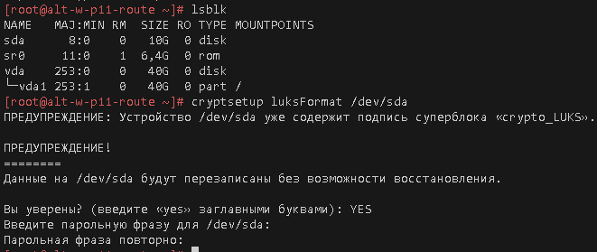
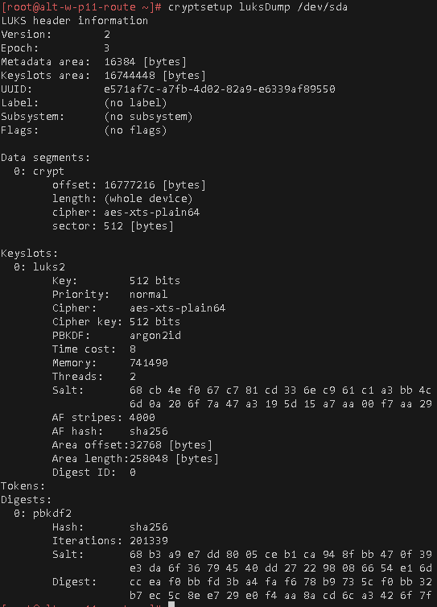
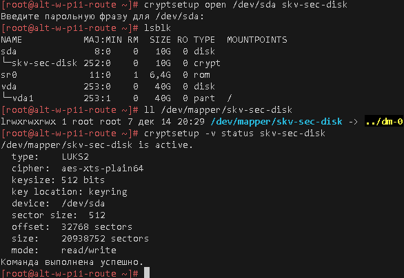
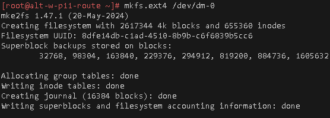
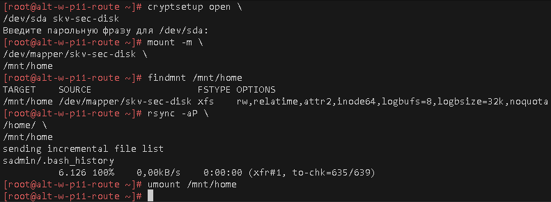
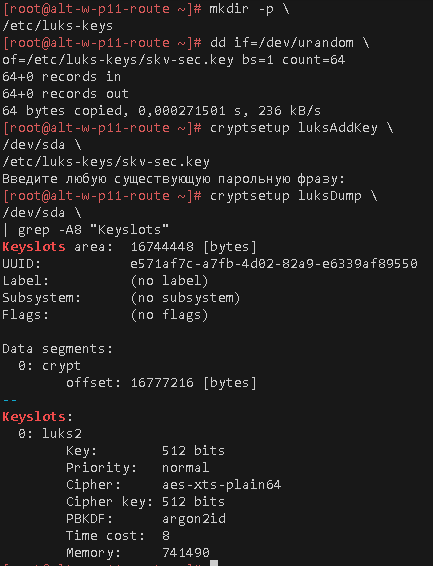
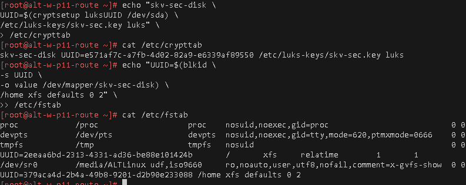
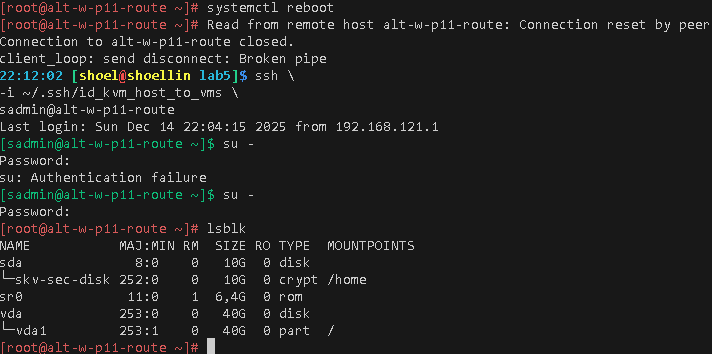
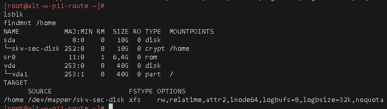

# Лабораторная работа 6 «`Использование LUKS`»
#### памятка для снепшотов и входа на машины локальной сети
```bash
# включаем агента и запущенному процессу регистрируем используемые ключи
eval $(ssh-agent) \
&& ssh-add ~/.ssh/id_vm \
&& ssh-add  ~/.ssh/id_kvm_host_to_vms

# Рабочая станция p11
ssh \
-i ~/.ssh/id_kvm_host_to_vms \
sadmin@alt-w-p11-route


#### Создание snapshot
sudo virsh snapshot-create-as \
--domain adm4_altlinux_w2 \
--name 6 \
--description "before_adm5_lab6" --atomic

# Откатываем на снэпшот 6
sudo virsh snapshot-revert \
--snapshotname 6 \
--domain adm4_altlinux_w2

# Удаляем снэпшот цепочки 6
sudo virsh snapshot-delete \
--domain adm4_altlinux_w2 \
--snapshotname 6
```

## Предварительно
### Для github
```bash
cd nfs_git/adm

git config --global --add safe.directory .

git branch -v

git remote -v

git remote add altlinux https://github.com/shoelacevip12/altlinux_study.git

git log --oneline

git pull altlinux main

mkdir -p adm5/{lab6,lab6/img}

cd adm5/lab6

touch README.md
```

### Подготовка и запуск стенда
```bash
# включаем агента-ssh
eval $(ssh-agent) \
&& ssh-add ~/.ssh/id_vm \
&& ssh-add  ~/.ssh/id_kvm_host_to_vms

# Выводим список ВМ стенда для напоминания
sudo virsh list --all

# Поочередный запуск всех сетей libvirt со 2ого по списку
sudo virsh net-list --all \
| awk 'NR > 3 {print $1}' \
| xargs -I {} sudo virsh net-start {}

# Создание нового раздела
sudo qemu-img create \
-f qcow2 \
/var/lib/libvirt/images/adm4_altlinux_w2-vda_2.qcow2 \
10G

# XML-конфиг для подключения диска к ВМ
cat > ./disk-device.xml <<EOF
<disk type='file' device='disk'>
  <driver name='qemu' type='qcow2'/>
  <source file='/var/lib/libvirt/images/adm4_altlinux_w2-vda_2.qcow2'/>
  <target dev='vdb' bus='virtio'/>
  <address type='pci' domain='0x0000' bus='0x00' slot='0x07' function='0x0'/>
</disk>
EOF

# Подключение диска к ВМ
sudo virsh attach-device \
  adm4_altlinux_w2 --config --live \
  ./disk-device.xml

# проверка диска
sudo virsh dumpxml \
adm4_altlinux_w2 \
| grep -A5 '<disk'

# Запуск Рабочей станции p11
sudo virsh start \
--domain adm4_altlinux_w2
```

### Выполнение работы
```bash
# вход на хост
ssh \
-i ~/.ssh/id_kvm_host_to_vms \
sadmin@alt-w-p11-route

su -

# обновление системы и установка gnupg и gnupg2
apt-get update \
&& update-kernel -y \
&& apt-get dist-upgrade -y \
&& apt-get install -y cryptsetup

# Для определения нового диска под шифрование
lsblk

# Создание Раздела LUKS на всем диске /dev/sda
cryptsetup luksFormat /dev/sda
```

```bash
# Проверка информации о LUKS разделе
cryptsetup luksDump /dev/sda
```

```bash
# Создаем отображение на новое блочное устройство dm-crypt
cryptsetup open /dev/sda skv-sec-disk

# Проверки отображения нового блочного устройства
lsblk

ll /dev/mapper/skv-sec-disk

cryptsetup -v status skv-sec-disk
```

```bash
# создание файловой системы на LUKS устройстве
mkfs.xfs /dev/dm-0
```


```bash
# Выключаем Машину
systemctl poweroff

#### Создание snapshot
sudo virsh snapshot-create-as \
--domain adm4_altlinux_w2 \
--name 6 \
--description "before_adm5_lab6" --atomic

# Запуск Рабочей станции p11
sudo virsh start \
--domain adm4_altlinux_w2

# вход на хост
ssh \
-i ~/.ssh/id_kvm_host_to_vms \
sadmin@alt-w-p11-route

su -
```
```bash
# Создаем отображение crypt устройства на случай перезагрузки
cryptsetup open \
/dev/sda skv-sec-disk

# Монтирование раздела LUKS для синхронизации данных
mount -m \
/dev/mapper/skv-sec-disk \
/mnt/home

# Проверка монтирования
findmnt /mnt/home

# синхронизация Каталога /home на новый раздел
rsync -aP \
/home/ \
/mnt/home

# Отмонтирование LUKS
umount /mnt/home
```


```bash
# Создаем каталог для ключей
mkdir -p \
/etc/luks-keys

# Генерируем 512-битный ключ с помощью /dev/urandom
dd if=/dev/urandom \
of=/etc/luks-keys/skv-sec.key \
bs=1 count=64

# Добавляем созданный ключ в каталог LUKS-ключей
cryptsetup luksAddKey \
/dev/sda \
/etc/luks-keys/skv-sec.key

# Проверка наличия новых занятых слотов ключей
cryptsetup luksDump \
/dev/sda \
| grep -A20 "Keyslots:"
```

```bash
# Организуем запись в /etc/crypttab на основе UUID 
# и указанием расположения ключа для автоматической загрузки
echo "skv-sec-disk \
UUID=$(cryptsetup luksUUID /dev/sda) \
/etc/luks-keys/skv-sec.key luks" \
> /etc/crypttab

# Проверка записи в /etc/crypttab
cat /etc/crypttab

# Добавляем запись в /etc/fstab на основе UUID /dev/mapper/skv-sec-disk
echo "UUID=$(blkid \
-s UUID \
-o value /dev/mapper/skv-sec-disk) \
/home xfs defaults 0 2" \
>> /etc/fstab

# Проверка записи в /etc/fstab
cat /etc/fstab
```

### Проверка работы на новом примонтированном разделе
```bash
# Перезагрузка 
systemctl reboot

# Вход на ВМ
ssh \
-i ~/.ssh/id_kvm_host_to_vms \
sadmin@alt-w-p11-route

su -

# Проверка Дисков и монтирований
lsblk

findmnt /home
```

### Для github
```bash
git add . .. ../.. \
&& git status

git log --oneline

git commit -am "оформление для ADM5_lab6_upd2" \
&& git push -u altlinux main
```