# Лабораторная работа 7 «`OpenVPN`»
#### памятка для снепшотов и входа на машины локальной сети
```bash
# включаем агента и запущенному процессу регистрируем используемые ключи
eval $(ssh-agent) \
&& ssh-add ~/.ssh/id_vm \
&& ssh-add  ~/.ssh/id_kvm_host_to_vms

# Рабочая станция p11
ssh \
-i ~/.ssh/id_kvm_host_to_vms \
sadmin@alt-w-p11-route

# Сервер CA
ssh -i ~/.ssh/id_kvm_host_to_vms \
-o "ProxyJump sadmin@alt-w-p11-route" \
-i ~/.ssh/id_vm sadmin@10.10.10.241

#### Создание snapshot
sudo virsh snapshot-create-as \
--domain adm4_altlinux_w2 \
--name 7 \
--description "before_adm5_lab7" --atomic

# Откатываем на снэпшот 7
sudo virsh snapshot-revert \
--snapshotname 7 \
--domain adm4_altlinux_w2

# Удаляем снэпшот цепочки 7
sudo virsh snapshot-delete \
--domain adm4_altlinux_w2 \
--snapshotname 7

# Удаляем снэпшот цепочки основного сервера alt-s-p11-1
sudo virsh snapshot-delete \
--domain adm4_altlinux_s1 \
--snapshotname 5

# Откатываем основной сервер alt-s-p11-1
sudo virsh snapshot-revert \
--snapshotname 2 \
--domain adm4_altlinux_s1

# Вход через шлюз 192.168.121.2 как прокси на машину локальной сети 10.10.10.241
ssh -i ~/.ssh/id_kvm_host_to_vms \
-o "ProxyJump sadmin@alt-w-p11-route" \
-i ~/.ssh/id_vm sadmin@alt-s-p11-1
```

## Предварительно
### Для github
```bash
cd nfs_git/adm

git config --global --add safe.directory .

git branch -v

git remote -v

git remote add altlinux https://github.com/shoelacevip12/altlinux_study.git

git log --oneline

git pull altlinux main

mkdir -p adm5/{lab7,lab7/img}

cd adm5/lab7

touch README.md
```
## План развертывания
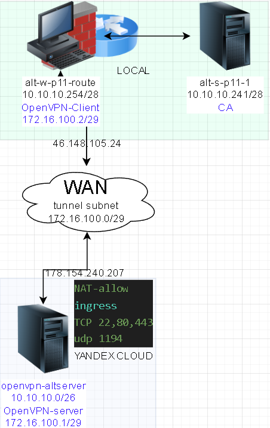
### Подготовка и запуск стенда
```bash
# включаем агента-ssh
eval $(ssh-agent) \
&& ssh-add ~/.ssh/id_vm \
&& ssh-add  ~/.ssh/id_kvm_host_to_vms

# Выводим список ВМ стенда для напоминания
sudo virsh list --all

# Поочередный запуск всех сетей libvirt со 2ого по списку
sudo virsh net-list --all \
| awk 'NR > 3 {print $1}' \
| xargs -I {} sudo virsh net-start {}

# Запуск Рабочей станции p11
sudo virsh start \
--domain adm4_altlinux_w2

# Запуск сервера CA
sudo virsh start \
--domain adm4_altlinux_s1
```

#### Подготовка для работы с yandex cloud
```bash
# вход на VPN-клиент
ssh \
-i ~/.ssh/id_kvm_host_to_vms \
sadmin@alt-w-p11-route

# Скачиваем скрипт для установки yandex console
curl -sSL https://storage.yandexcloud.net/yandexcloud-yc/install.sh \
| bash

# Применение новых переменных окружения в текущей сессии
source \
~/.bashrc
```
```bash
# инициализация подключения к уже созданному аккаунту yandex cloud
yc init
https://oauth.yandex.ru/authorize?response_type=token&client_id=xxxxxxxxxxxxxxxxxxxxxxxxxxxxxxxxxxxxxx
y0__xxxxxxxxxxxxxxxxxxxxxxxxxxxxxxxxxxxxxxxxxxxxxxxxxxxx
1
Y
1
```
```bash
# Вывод списка аккаунтов управления (сервисный аккаунт) для работы с новыми виртуальными машинами
yc iam service-account list

+----------------------+----------------------+--------+---------------------+-----------------------+
|          ID          |         NAME         | LABELS |     CREATED AT      | LAST AUTHENTICATED AT |
+----------------------+----------------------+--------+---------------------+-----------------------+
| ajxxxxxxxxxxxxxxxxxx | xxx-tesxxt           |        | 2025-12-10 07:49:05 |                       |
| ajxxxxxxxxxxxxxxxxxx | xxx-xxx-xxx-xxxxxxxx |        | 2025-12-10 01:49:46 |                       |
| ajxxxxxxxxxxxxxxxxxx | xxx                  |        | 2025-07-13 13:12:35 | 2025-12-17 19:50:00   |
+----------------------+----------------------+--------+---------------------+-----------------------+
```
```bash
# Добавления новых переменных окружения для авторизации на yandex cloud
cat >> .bashrc <<'EOF'
export YC_TOKEN=$(yc iam create-token --impersonate-service-account-id ajxxxxxxxxxxxxxxxxxx)
export YC_CLOUD_ID=$(yc config get cloud-id)
export YC_FOLDER_ID=$(yc config get folder-id)
EOF

# Применение переменных окружения
source .bashrc
```
```bash
# генерация пары ssh ключей для подключения к ВМ yandex cloud
ssh-keygen -f \
~/.ssh/id_skv_adm5_L7_ed25519 \
-t ed25519 -C "adm5_L7"
```
```bash
# Генерация пользователя с правами wheel
# переключение на суперпользователя без пароля 
# средствами cloud-init для yandex cloud
cat >cloud-init.yml<<'EOF'
#cloud-config
users:
  - name: skv
    groups: wheel
    shell: /bin/bash
    sudo: ["ALL=(ALL) NOPASSWD:ALL"]
    ssh_authorized_keys:
EOF
```
```bash
# подсовываем публичный ключ в cloud-init для авторизации пользователем ключем ssh
cat ~/.ssh/id_skv_adm5_L7_ed25519.pub \
| sed 's/ssh-/      - ssh-/' \
>> cloud-init.yml
```
```bash
# вход под суперпользователем
su -

# Скрипт установки последнего доступного terraform с зеркала yandex cloud
cat > terraform_for_altlinux.sh <<'EOF'
#!/bin/bash -x

# CREATED:
# vitaliy.natarov@yahoo.com
# Unix/Linux blog:
# http://linux-notes.org
# Vitaliy Natarov

# RECREATED:
# ArtamonovKA
# For AltLinux

#MODED:
#17.12.25
#Shoelacevip12
#For AltLinux p11 workstation

function install_terraform () {
        #
        if [ -f /etc/altlinux-release ] || [ -f /etc/redhat-release ] ; then
                #update OS
                apt-get update &> /dev/null -y && apt-get dist-upgrade &> /dev/null -y
                #
                if ! type -path "wget" > /dev/null 2>&1; then apt-get install wget &> /dev/null -y; fi
                if ! type -path "curl" > /dev/null 2>&1; then apt-get install curl &> /dev/null -y; fi
                if ! type -path "unzip" > /dev/null 2>&1; then apt-get install unzip &> /dev/null -y; fi
        OS=$(lsb_release -ds|cut -d '"' -f2|awk '{print $1}')
        OS_MAJOR_VERSION=$(sed -rn 's/.*([0-9]).[0-9].*/\1/p' /etc/redhat-release)
                OS_MINOR_VERSION=$(cat /etc/redhat-release | cut -d"." -f2| cut -d " " -f1)
                Bit_OS=$(uname -m | sed 's/x86_//;s/i[3-6]86/32/')
                echo "$OS-$OS_MAJOR_VERSION.$OS_MINOR_VERSION with $Bit_OS bit arch"
                #
                site="https://hashicorp-releases.yandexcloud.net/terraform/"
        Latest_terraform_version=$(curl -s "$site" --list-only | grep -E "terraform_" | grep -Ev "beta|alpha" | head -n1| cut -d ">" -f2| cut -d "<" -f1 | cut -d"_" -f2)
        URL_with_latest_terraform_package=$site$Latest_terraform_version
                #
                if [ "`uname -m`" == "x86_64" ]; then
                        Latest_terraform_package=$(curl -s "$URL_with_latest_terraform_package/" --list-only |grep -E "terraform_" | grep -E "linux_amd64"|cut -d ">" -f2| cut -d "<" -f1)
                        Current_link_to_archive=$URL_with_latest_terraform_package/$Latest_terraform_package
                elif [ "`uname -m`" == "i386|i686" ]; then
                        Latest_terraform_package=$(curl -s "$URL_with_latest_terraform_package/" --list-only |grep -E "terraform_" | grep -Ev "(SHA256SUMS|windows)"| grep -E "linux_386"|cut -d ">" -f2| cut -d "<" -f1)
                        Current_link_to_archive=$URL_with_latest_terraform_package/$Latest_terraform_package
                fi
                echo $Current_link_to_archive
                mkdir -p /usr/local/src/ && cd /usr/local/src/ && wget $Current_link_to_archive &> /dev/null
                unzip -o $Latest_terraform_package
                rm -rf /usr/local/src/$Latest_terraform_package*
                yes|mv -f /usr/local/src/terraform /usr/local/bin/terraform
                chmod +x /usr/local/bin/terraform
        else
        OS=$(uname -s)
        VER=$(uname -r)
        echo 'OS=' $OS 'VER=' $VER
        fi
}
install_terraform
echo "========================================================================================================";
echo "================================================FINISHED================================================";
echo "========================================================================================================";
terraform -version
EOF
```
```bash
# Делаем скрипт исполняемым
chmod +x terraform_for_altlinux.sh

# Запуск скрипта установки
./terraform_for_altlinux.sh

# выход из-под суперпользователя
exit
```
```bash
# указываем источник (yandex cloud), из которого будет устанавливаться провайдер
cat > ~/.terraformrc << 'EOF'
provider_installation {
  network_mirror {
    url = "https://terraform-mirror.yandexcloud.net/"
    include = ["registry.terraform.io/*/*"]
  }
  direct {
    exclude = ["registry.terraform.io/*/*"]
  }
}
EOF
```
#### Подготовка `.tf` файлов для развертывания ВМ на yandex cloud
```bash
# в папке с проектом создаем конфигурационный файл .tf:
# source — глобальный адрес источника провайдера.
# required_version — минимальная версия Terraform, с которой совместим провайдер.
# provider — название провайдера.
# zone — зона доступности, в которой по умолчанию будут создаваться все облачные ресурсы.
cat > providers.tf <<'EOF'
terraform {
  required_providers {
    yandex = {
      source = "yandex-cloud/yandex"
    }
  }
  required_version = ">= 0.13"
}

provider "yandex" {
  zone = "<зона_доступности_по_умолчанию>"
}
EOF
```
```bash
# в папке с проектом создаем отдельный конфигурационный файл .tf:
# где будет расписан какой образ из репозитория будет использоваться
# с какими параметрами
# Сетями
# Будет созданы виртуальные машины
cat > vms.tf <<'EOF'
#считываем данные об образе ОС
data "yandex_compute_image" "altserver" {
  family = "basealt-altserver"
}

resource "yandex_compute_instance" "openvpn-altserver" {
  name        = "openvpn-altserver"
  hostname    = "openvpn-altserver"
  platform_id = "standard-v2"
  zone        = "ru-central1-a" #зона ВМ должна совпадать с зоной subnet!!!

  resources {
    cores         = var.srv.cores
    memory        = var.srv.memory
    core_fraction = var.srv.core_fraction
  }

  boot_disk {
    initialize_params {
      image_id = data.yandex_compute_image.altserver.image_id
      type     = "network-hdd"
      size     = 20
    }
  }

  metadata = {
    # user-data          = file("./cloud-init.yml")
    serial-port-enable = 1
  }

  scheduling_policy { preemptible = true }

  network_interface {
    subnet_id          = yandex_vpc_subnet.skv_a.id #зона ВМ должна совпадать с зоной subnet!!!
    nat                = true
    security_group_ids = [yandex_vpc_security_group.LAN.id, yandex_vpc_security_group.openvpn-altserver.id]
  }
}
EOF
```
```bash
# в папке с проектом создаем отдельный конфигурационный файл .tf:
# с часто повторяющимися переменными в других файлах.tf
cat > variables.tf <<'EOF'
variable "dz" {
  type    = string
  default = "lab7-openvpn"
}

variable "cloud_id" {
  type    = string
  default = "b1gkumrn87pei2831blp"
}
variable "folder_id" {
  type    = string
  default = "b1g7qviodfc9v4k81sr5"
}

variable "srv" {
  type = map(number)
  default = {
    cores         = 4
    memory        = 4
    core_fraction = 20
  }
}
EOF
```
```bash
# в папке с проектом создаем отдельный конфигурационный файл .tf:
# с описанием структуры сетей и доступа
cat > network.tf <<'EOF'
#Общая облачная сеть yandex
resource "yandex_vpc_network" "skv" {
  name = "skv-adm5-${var.dz}"
}

#Подсеть zone A
resource "yandex_vpc_subnet" "skv_a" {
  name           = "skv-adm-${var.dz}-ru-central1-a"
  zone           = "ru-central1-a"
  network_id     = yandex_vpc_network.skv.id
  v4_cidr_blocks = ["10.10.10.0/26"]
  route_table_id = yandex_vpc_route_table.route.id
}

#Сеть под NAT
resource "yandex_vpc_gateway" "nat_gateway" {
  name = "adm-gateway-${var.dz}"
  shared_egress_gateway {}
}

#Шлюз для выхода в WAN
resource "yandex_vpc_route_table" "route" {
  name       = "adm-route-table-${var.dz}"
  network_id = yandex_vpc_network.skv.id

  static_route {
    destination_prefix = "0.0.0.0/0"
    gateway_id         = yandex_vpc_gateway.nat_gateway.id
  }
}

##Правила NAT
#Разрешаем Всем Входящие соединения по 22 порту по протоколу TCP, необходимо для proxy-jump
#Разрешаем Всем входящие соединения по протоколу TCP по 80,443 портам
#Разрешаем Всем входящие соединения по протоколу UDP по 1194
resource "yandex_vpc_security_group" "openvpn-altserver" {
  name       = "openvpn-altserver-${var.dz}"
  network_id = yandex_vpc_network.skv.id
  ingress {
    description    = "Allow 0.0.0.0/0"
    protocol       = "TCP"
    v4_cidr_blocks = ["0.0.0.0/0"]
    port           = 22
  }

  ingress {
    description    = "Allow HTTPS"
    protocol       = "TCP"
    port           = 443
    v4_cidr_blocks = ["0.0.0.0/0"]
  }

  ingress {
    description    = "Allow HTTP"
    protocol       = "TCP"
    port           = 80
    v4_cidr_blocks = ["0.0.0.0/0"]
  }

  ingress {
    description    = "Allow openvpn"
    protocol       = "udp"
    port           = 1194
    v4_cidr_blocks = ["0.0.0.0/0"]
  }
}

#Разрешаем всем из-под внутренних подсетей zone выход на любые ресурсы по любому протоколу
resource "yandex_vpc_security_group" "LAN" {
  name       = "LAN-${var.dz}"
  network_id = yandex_vpc_network.skv.id
  ingress {
    description    = "Allow 10.10.10.0/26"
    protocol       = "ANY"
    v4_cidr_blocks = ["10.10.10.0/26"]
    from_port      = 0
    to_port        = 65535
  }
  egress {
    description    = "Permit ANY"
    protocol       = "ANY"
    v4_cidr_blocks = ["0.0.0.0/0"]
    from_port      = 0
    to_port        = 65535
  }

}
EOF
```
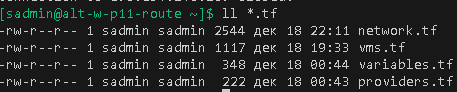
### Выполнение работы

#### Развертывание CA
```bash
# Подключение к CA
ssh -i ~/.ssh/id_kvm_host_to_vms \
-o "ProxyJump sadmin@alt-w-p11-route" \
-i ~/.ssh/id_vm sadmin@alt-s-p11-1

su -

# Обновление системы и установка easyrsa
apt-get update \
&& update-kernel -y \
&& apt-get dist-upgrade -y \
&& apt-get install -y easy-rsa tree
```
```bash
# Генерация структуры каталогов PKI и генерация сертификата CA
cd /srv \
&& easyrsa init-pki \
&& easyrsa build-ca
```
#### Генерация пар сертификатов\ключей для TLS VPN сертификатов

```bash
# Группа Диффи-Хелмана
easyrsa gen-dh

# сертификат\ключ VPN-сервера
easyrsa build-server-full \
openvpn-altserver \
nopass

# сертификат\ключ VPN-клиента
easyrsa build-client-full \
alt-w-p11-route \
nopass
```
```bash
# перенос генерации Диффи-Хелмана и пары сертификата\ключа для VPN-сервера
rsync -P /srv/pki/{ca.crt,dh.pem} \
/srv/pki/{private,issued}/openvpn-altserver* \
sadmin@alt-w-p11-route:~/openvpn-altserver/

# перенос генерации пары сертификата\ключа для VPN-клиента
rsync -P /srv/pki/{private,issued}/alt-w-p11-route* \
sadmin@alt-w-p11-route:~/
```
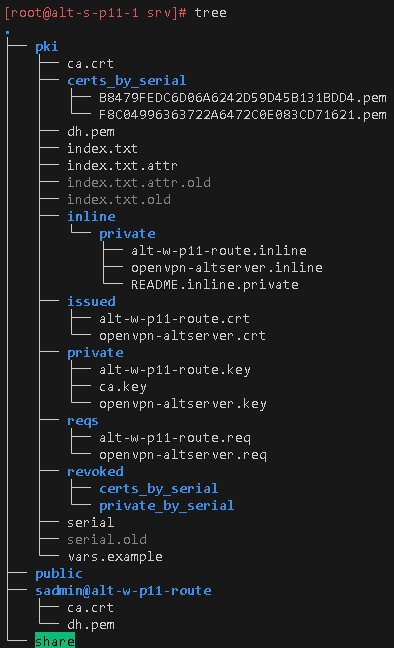

#### Подготовка VPN-клиента
```bash
# вход на VPN-клиент
ssh \
-i ~/.ssh/id_kvm_host_to_vms \
sadmin@alt-w-p11-route

# вход под суперпользователем
su -

# обновление системы и установка openvpn easy-rsa на клиенте соединения
apt-get update \
&& update-kernel -y \
&& apt-get dist-upgrade -y \
&& apt-get install -y \
openvpn \
easy-rsa
```
```bash
# Генерация Ключ HMAC
openvpn --genkey \
secret \
/etc/openvpn/keys/ta.key

# Копируем сгенерированный HMAC в папку для переноса ключей на VPN-сервер
cp /etc/openvpn/keys/ta.key \
/home/sadmin/openvpn-altserver/

chown sadmin:sadmin \
/home/sadmin/openvpn-altserver/ta.key
```
```bash
# Перенос скопированных клиентских сертификатов в каталог /etc/openvpn/keys/
mv /home/sadmin/{alt-w-p11-route.*,ca.*} \
/etc/openvpn/keys/

# Выставление желательных прав для ключей\сертификатов
chmod -R 600 /etc/openvpn/keys
```
```bash
# Создание конфига туннельного соединения-клиента по subnet топологии
cat > /etc/openvpn/client/tun0.conf <<'EOF'
dev tun0
  client
  nobind
  remote 1194
  proto udp4
  topology subnet
  pull
  cipher AES-256-CBC
  data-ciphers-fallback AES-256-CBC
  ca /etc/openvpn/keys/ca.crt
  cert /etc/openvpn/keys/alt-w-p11-route.crt
  key /etc/openvpn/keys/alt-w-p11-route.key
  tls-client
  remote-cert-eku "TLS Web Server Authentication"
  tls-auth /etc/openvpn/keys/ta.key 1
  auth-nocache
EOF
```
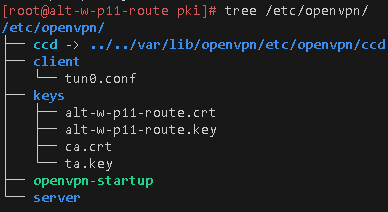

#### Подготовка сервера VPN
```bash
# Выход из-под суперпользователя
exit

# Инициализация провайдера yandex cloud через terraform
terraform init

# Проверка .tf конфигов и формирования файла tfplan для развертывания ВМ в yandex cloud
terraform validate \
&& terraform fmt  \
&& terraform init --upgrade \
&& terraform plan -out=tfplan

# Запуск развертывания ВМ и вывод внешнего IP для подключения в промежуточный файл openvpn-server
terraform apply "tfplan" \
&& yc compute instance list \
| awk '/[0-9]/{print $10}' \
> openvpn-server
```
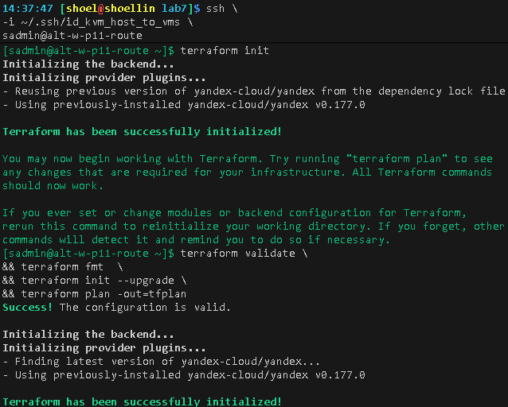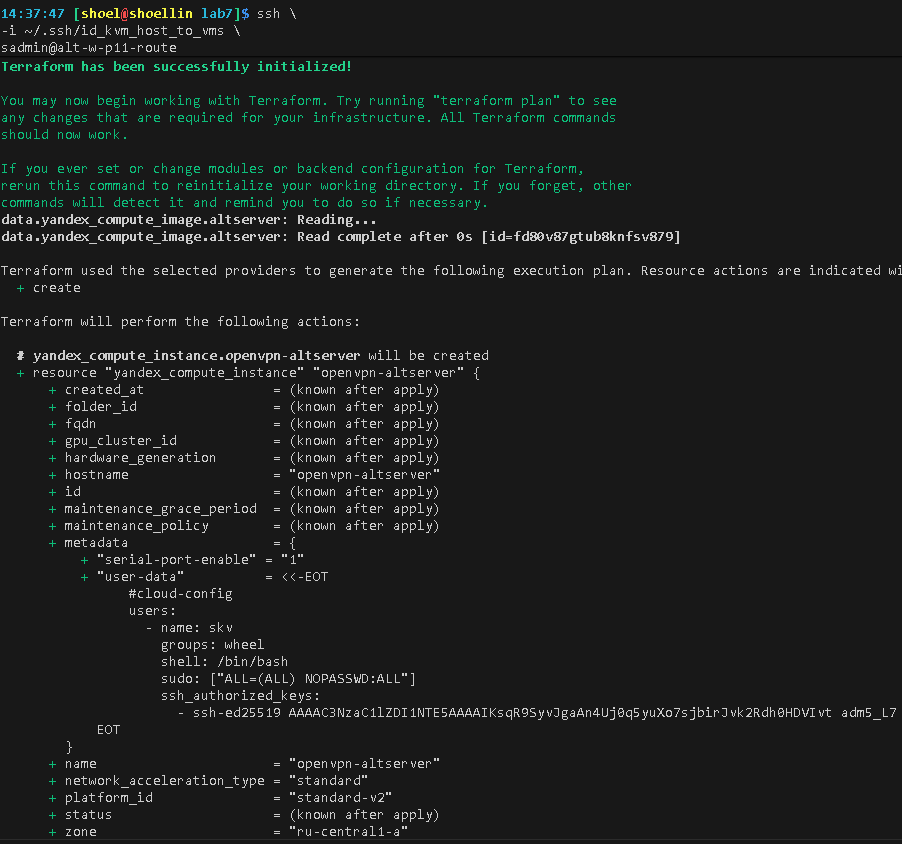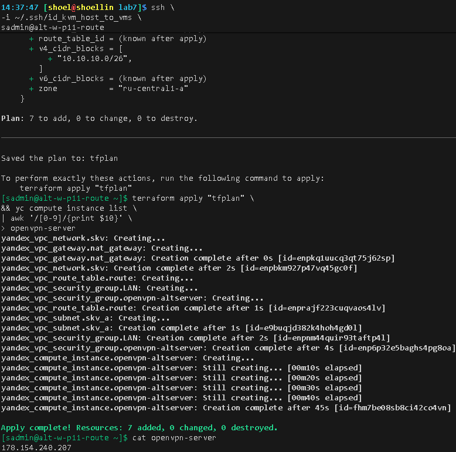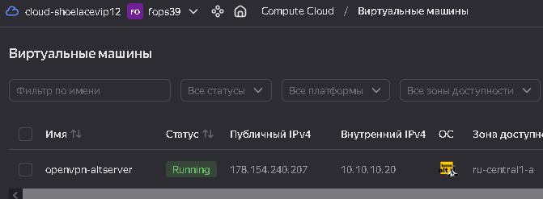
```bash
# Вход под суперпользователем
su -

# Донастройка конфига туннеля для VPN-клиента
sed -i "s|remote 1194|remote $(cat /home/sadmin/openvpn-server) 1194|" \
/etc/openvpn/client/tun0.conf

cat /etc/openvpn/client/tun0.conf

# Добавляем в hosts ip и имя внешнего сервера VPN 
# имя указанного хоста соответствует на чье имя был выписан сертификат из CA (openvpn-altserver)
echo "$(cat /home/sadmin/openvpn-server) \
openvpn-altserver \
openvpn-altserver.den.skv" \
>> /etc/hosts

cat /etc/hosts

# Включение и запуск службы VPN-клиента
systemctl enable --now openvpn-client@tun0

exit
```
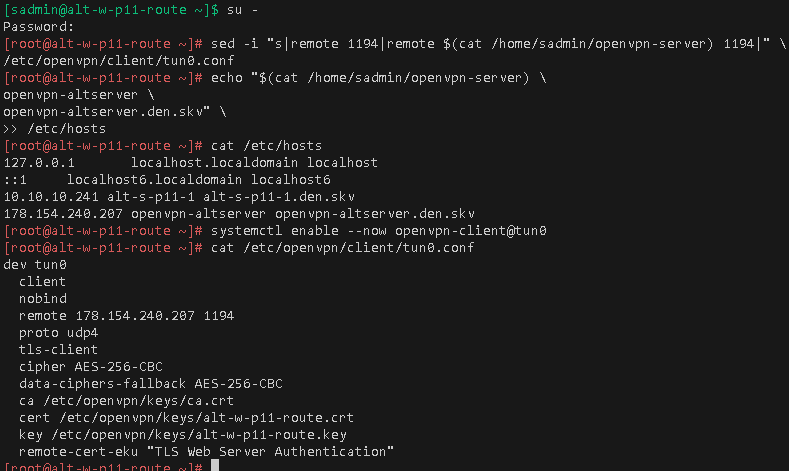

```bash
# перенос подготовленных ключей\сертификатов для VPN-сервера
rsync -rvP /home/sadmin/openvpn-altserver \
-e "ssh -i ~/.ssh/id_skv_adm5_L7_ed25519" \
skv@$(yc compute instance list \
    | awk ' /[0-9]/{print $10}'):~/

# Проверка переноса файлов для VPN-server
ssh -t -i \
~/.ssh/id_skv_adm5_L7_ed25519 \
skv@$(yc compute instance list \
    | awk ' /[0-9]/{print $10}') \
"ls -lR openvpn-altserver" 
```
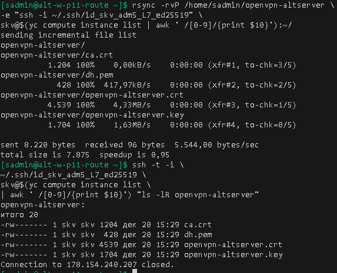
```bash
# Подключение к ВМ yandex cloud
ssh -i \
~/.ssh/id_skv_adm5_L7_ed25519 \
skv@$(yc compute instance list \
    | awk ' /[0-9]/{print $10}')

# Авторизация под суперпользователем
sudo su

# Обновление системы и установка easyrsa openvpn
apt-get update \
&& apt-get dist-upgrade -y \
&& apt-get install -y \
openvpn \
easy-rsa
```
```bash
# Перенос скопированных серверных сертификатов в каталог /etc/openvpn/keys/
mv /home/skv/openvpn-altserver/* \
/etc/openvpn/keys/

# Выставление желательных прав для ключей\сертификатов
chmod -R 600 \
/etc/openvpn/keys

# Ограничение прав до доступа к ключам
chown root:openvpn -R \
/etc/openvpn/keys
```
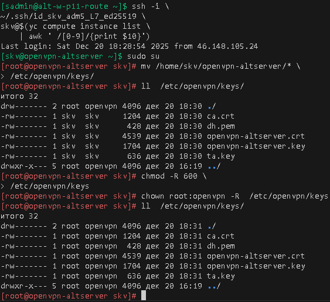
```bash
# Создание конфига туннельного соединения-клиента по subnet топологии
cat > /etc/openvpn/server/tun0.conf <<'EOF'
dev tun0
  local
  port 1194
  proto udp4
  keepalive 10 60
  topology subnet
  server 172.16.100.0 255.255.255.248
  data-ciphers-fallback AES-256-CBC
  cipher AES-256-CBC
  ca /etc/openvpn/keys/ca.crt
  dh /etc/openvpn/keys/dh.pem
  cert /etc/openvpn/keys/openvpn-altserver.crt
  key /etc/openvpn/keys/openvpn-altserver.key
  tls-server
  remote-cert-eku "TLS Web Client Authentication"
  tls-auth /etc/openvpn/keys/ta.key 0
EOF

sed -i "s@local@local $(ip -br a \
                      | awk '/e[tn]/{print $3}' \
                      | cut -d '/' -f1)@" \
/etc/openvpn/server/tun0.conf

cat /etc/openvpn/server/tun0.conf
```
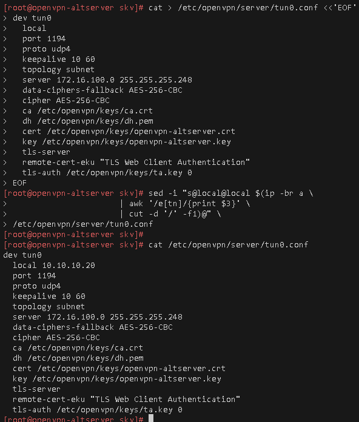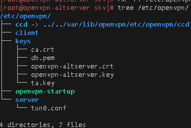
```bash
systemctl enable --now \
openvpn-server@tun0

journalctl \
-feu \
openvpn-server@tun0.service
```
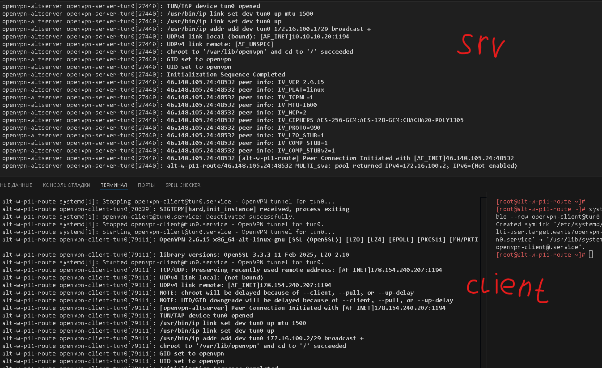

### Тестирование
#### Со стороны клиента
```bash
apt-get update \
&& apt-get dist-upgrade -y \
&& apt-get install -y \
perf3

# Отображение текущих ip маршрутов
ip r

# Отображение текущих ip интерфейсов
ip -br a

# Отображение внешнего ip выхода в WAN
curl 2ip.ru

ping 172.16.100.1 -c 2

ping 10.10.10.20 -c 2

# Добавление маршрута до внутренней сети в yandex cloud
ip r add 10.10.10.0/26 \
via 172.16.100.1 \
dev tun0

ping 10.10.10.20 -c 2

# тестирование пропускной способности через VPN до внутренней сети в yandex cloud
# В роли клиента
iperf3 -c 10.10.10.20
```
#### Со стороны сервера
```bash
apt-get update \
&& apt-get dist-upgrade -y \
&& apt-get install -y \
perf3

# Отображение текущих ip маршрутов
ip r

# Отображение текущих ip интерфейсов
ip -br a

# Отображение внешнего ip выхода в WAN
curl 2ip.ru
ping 172.16.100.2 -c 2

# тестирование пропускной способности через VPN до внутренней
# В роли сервера
iperf3 -s
```
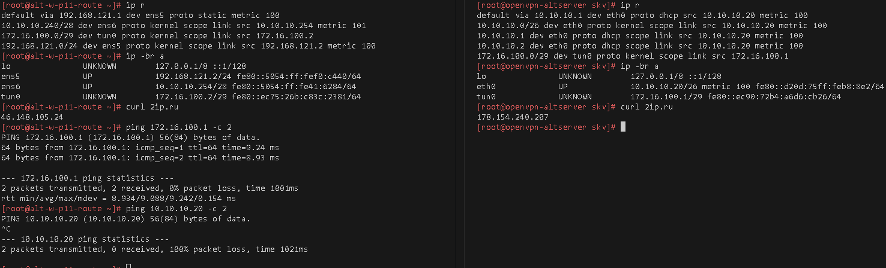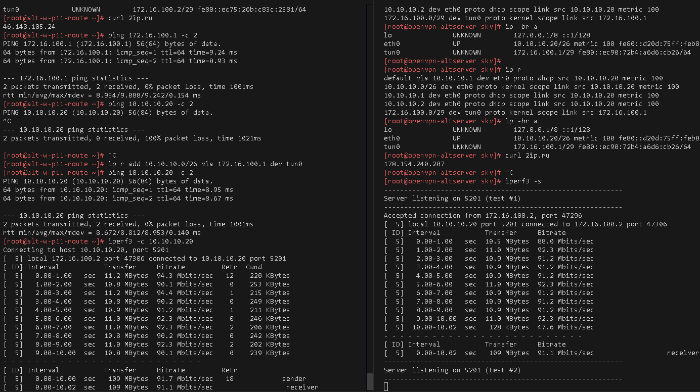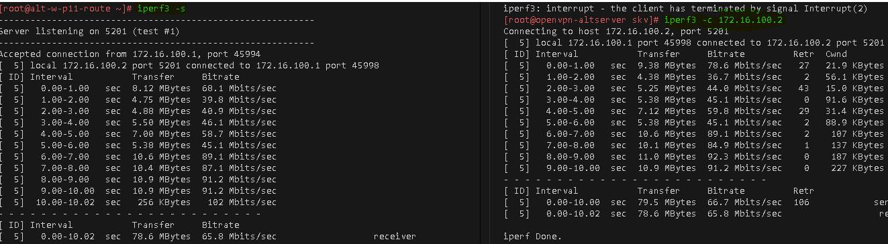


### Для github
```bash
terraform destroy

git add . .. ../.. \
&& git status

git log --oneline

git commit -am "оформление для ADM5_lab7_upd6" \
&& git push -u altlinux main
```