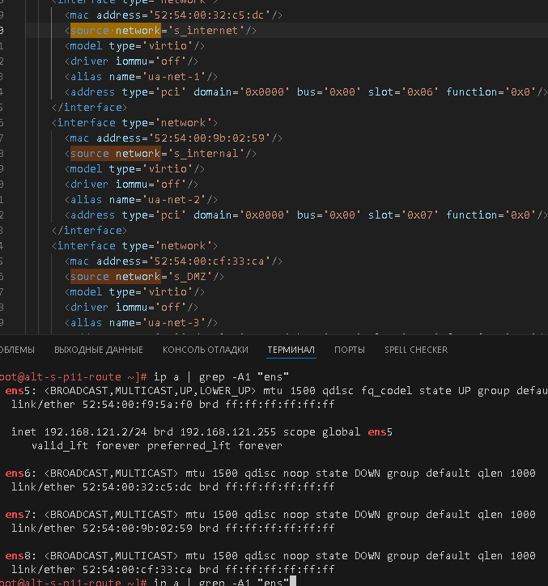
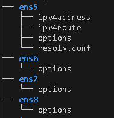
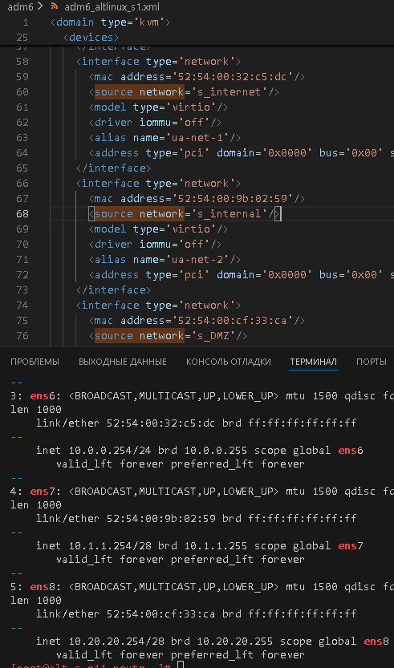
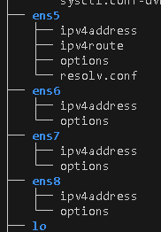
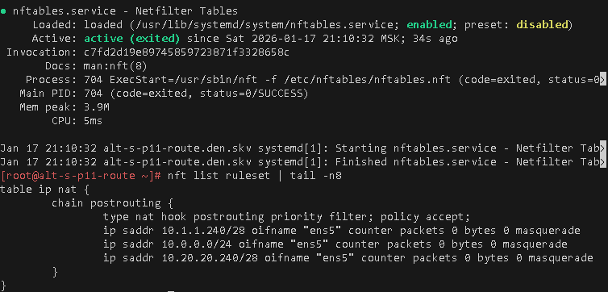
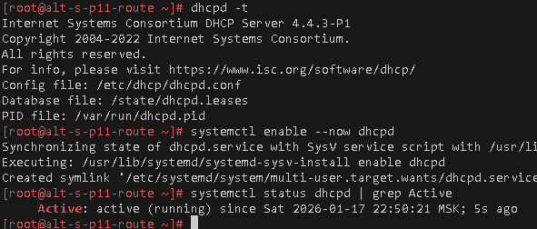
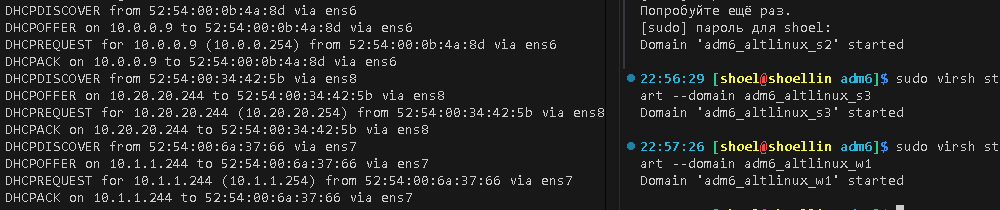

# «`Настройка локального стенда ОС Альт`»
### памятка для входа на машины локальной сети
```bash
# включаем агента и запущенному процессу регистрируем используемые ключи
eval $(ssh-agent) \
&& ssh-add ~/.ssh/id_vm \
&& ssh-add  ~/.ssh/id_kvm_host_to_vms

# вход через шлюз 192.168.121.2 как прокси на машину локальной сети 10.10.10.241
ssh -i ~/.ssh/id_kvm_host_to_vms \
-o "ProxyJump sadmin@192.168.121.2" \
-i ~/.ssh/id_vm sadmin@10.10.10.241
```

## Предварительно

### Для github и gitflic
```bash
cd ~/altlinux/adm

git init

git config --global \
user.email \
"shoelacevip21@gmail.com"

git config --global \
user.name \
"shoelacevip12"

git config --global \
--add safe.directory .

git remote add \
altlinux \
https://github.com/shoelacevip12/altlinux_study.git

git remote add \
altlinux_gf \
https://gitflic.ru/project/shoelacevip12/altlinux_study.git

git log \
--oneline

git pull \
altlinux main
```
дистрибутивы для платформы x86_64
- Альт Сервер
- Альт Рабочая станция
- [>>Дистрибутивы установки<<](https://getalt.org)
  - [>>Alt p11 server 11.0<<](https://download.basealt.ru/pub/distributions/ALTLinux/p11/images/server/x86_64/alt-server-11.0-x86_64.iso)
  - [>>Alt p11 рабочая станция 11.1<<](https://download.basealt.ru/pub/distributions/ALTLinux/p11/images/workstation/x86_64/alt-workstation-11.1-x86_64.iso)
### Создаем в среде виртуализации libvirt 5 виртуальных машины с общими характеристиками
- 3Гб ОЗУ
- 2 ядро CPU
- Диск размером 40 Гб
- Подсоединяем к ВМ ISO-образы с дистрибутивом Альт Сервера\Рабочая станция
#### своими сетями
- Сеть с сетевым интерфейсом типа bridge для `altlinux_s1` с выходом в интернет через хост машину
- Отдельная сеть с сетевым интерфейсом типа isolated для `altlinux_w1` и `altlinux_s1`
- Отдельная сеть с сетевым интерфейсом типа isolated для `altlinux_s1`, `altlinux_s2` и `altlinux_s4`
- Отдельная сеть с сетевым интерфейсом типа isolated для `altlinux_s1`, и `altlinux_s3`

### Подготовка структуры прохождения курса alt adm6 altnet
```bash
mkdir amd6

cd !$

mkdir -p lab{1..6}/img
```
### Установка vagrant для archlinux
```bash
yay -Ss vagrant

yay -Syu vagrant

vagrant --version
```
### Установка плагинов vagrant для совместимости с libvirt и qemu
```bash
vagrant plugin install \
--plugin-clean-sources \
--plugin-source https://rubygems.org \
vagrant-libvirt vagrant-mutate vagrant-qemu

vagrant plugin repair

vagrant plugin expunge \
--reinstall
```
### скачиваем образы для развертывания altlinux p11
```bash
wget -P \
~/iso/ \
https://download.basealt.ru/pub/distributions/ALTLinux/p11/images/server/x86_64/alt-server-11.0-x86_64.iso

wget -P \
~/iso/ \
https://download.basealt.ru/pub/distributions/ALTLinux/p11/images/workstation/x86_64/alt-workstation-11.1-x86_64.iso
```
#### Создаем файл vagrant для автоматического создания ВМ в количестве 5 шт
```bash
cat>vagrantfile<<'OEF'
# -*- mode: ruby -*-
# vi: set ft=ruby :

Vagrant.configure("2") do |config|

  # Путь к ISO образу ALT Linux p11
  altlinux_iso_path_s = "/home/shoel/iso/alt-server-11.0-x86_64.iso"
  altlinux_iso_path_w = "/home/shoel/iso/alt-workstation-11.1-x86_64.iso"

  # Общие настройки для провайдера libvirt
  config.vm.provider :libvirt do |libvirt|
    libvirt.driver = "kvm"
    libvirt.uri = 'qemu:///system'
    libvirt.memory = 3072
    libvirt.cpus = 2
    libvirt.nested = true
    libvirt.disk_driver :cache => 'none'
    libvirt.disk_bus = "virtio"
    libvirt.nic_model_type = "virtio"
    libvirt.storage :file, :size => '40G', :type => 'qcow2'
    libvirt.boot 'hd' # Загрузка с жесткого диска
    libvirt.boot 'cdrom' # Загрузка с CDROM (вторая опция)
    libvirt.management_network_name = "s_host-libvirt"
    libvirt.management_network_mode = "route"
    libvirt.management_network_guest_ipv6 = "no"
  end

  # --- Создание  ВМ для altlinux_s1 ROUTER ---
  config.vm.define "altlinux_s1" do |node_1|
    node_1.vm.hostname = "altlinux-s1" # Устанавливаем имя хоста для ВМ
    node_1.vm.communicator = "none" # Отключаем стандартный communicator (SSH), так как используется ISO

    # Настройки сети: только private_network
    node_1.vm.network "private_network",
                            libvirt__network_name: "s_internet", # Имя создаваемой сети
                            libvirt__forward_mode: "none", # Режим маршрутизации
                            libvirt__dhcp_enabled: false  # Отключаем DHCP в этой сети
    node_1.vm.network "private_network",
                            libvirt__network_name: "s_internal",
                            libvirt__forward_mode: "none",
                            libvirt__dhcp_enabled: false
    node_1.vm.network "private_network",
                            libvirt__network_name: "s_DMZ",
                            libvirt__forward_mode: "none",
                            libvirt__dhcp_enabled: false
    # Настройки провайдера libvirt для конкретной ВМ
    node_1.vm.provider :libvirt do |libvirt|
      libvirt.storage :file, :device => :cdrom, :path => altlinux_iso_path_s
    end

    # Заглушка для provisioner (не запускается)
    node_1.vm.provision "shell", inline: "echo 'altlinux_s1 VM created.'", run: "never"
  end

  # --- Создание 2 ВМ для altlinux_s internet ---
  # Цикл для создания 2-х одинаковых серверных ВМ
  # Все они будут использовать одну и ту же сеть 's_internet'
  [2,4].each do |i|
    config.vm.define "altlinux_s#{i}" do |node_2|
      node_2.vm.hostname = "altlinux-s#{i}" # Устанавливаем имя хоста для ВМ
      node_2.vm.communicator = "none" # Отключаем стандартный communicator (SSH), так как используется ISO

      # Настройки сети: только private_network
      node_2.vm.network "private_network",
                             libvirt__network_name: "s_internet", # Имя создаваемой сети
                             libvirt__forward_mode: "none", # Режим маршрутизации
                             libvirt__dhcp_enabled: false  # Отключаем DHCP в этой сети

      # Настройки провайдера libvirt для конкретной ВМ
      node_2.vm.provider :libvirt do |libvirt|
        libvirt.storage :file, :device => :cdrom, :path => altlinux_iso_path_s
      end

      # Заглушка для provisioner (не запускается)
      node_2.vm.provision "shell", inline: "echo 'altlinux_s#{i} VM created.'", run: "never"
    end
  end

  # --- Создание  ВМ для altlinux_s3 DMZ  ---
  config.vm.define "altlinux_s3" do |node_3|
    node_3.vm.hostname = "altlinux-s1" # Устанавливаем имя хоста для ВМ
    node_3.vm.communicator = "none" # Отключаем стандартный communicator (SSH), так как используется ISO

    # Настройки сети: только private_network
    node_3.vm.network "private_network",
                            libvirt__network_name: "s_DMZ", # Имя создаваемой сети
                            libvirt__forward_mode: "none", # Режим маршрутизации
                            libvirt__dhcp_enabled: false  # Отключаем DHCP в этой сети
    # Настройки провайдера libvirt для конкретной ВМ
    node_3.vm.provider :libvirt do |libvirt|
      libvirt.storage :file, :device => :cdrom, :path => altlinux_iso_path_s
    end
  end

  # --- Создание ВМ для altlinux_w1 ---
    config.vm.define "altlinux_w1" do |node_4|
      node_4.vm.hostname = "altlinux-w1"
      node_4.vm.communicator = "none"
      # Настройки сети: только private_network
      node_4.vm.network "private_network",
                            libvirt__network_name: "s_internal",
                            libvirt__forward_mode: "none",
                            libvirt__dhcp_enabled: false

      node_4.vm.provider :libvirt do |libvirt|
        libvirt.storage :file, :device => :cdrom, :path => altlinux_iso_path_w
        
      end
      node_4.vm.provision "shell", inline: "echo 'altlinux_w1 VM created.'", run: "never"
    end
end
OEF
```
#### Запуск из vagrant для автоматического создания ВМ в количестве 5 шт
```bash
vagrant up \
--no-destroy-on-error

sudo virsh list \
--all
```
#### Принудительная остановка машин и удаление секции DHCP libvirt в созданных сетях
```bash
sudo virsh list \
--all

# Остановка всех ВМ содержащих "nux" 
sudo bash -c \
"for i in \$(virsh list --all \
| awk '/nux/ {print \$1}'); do \
virsh destroy \$i; done"

# вывод всех доступных сетей
sudo virsh net-list \
--all

# Остановка всех сетей Libvirt начиная со 2ого по списку
sudo virsh net-list --all \
| awk 'NR > 3 {print $1}' \
| xargs -I {} sudo virsh net-destroy {}
```
##### Удаление DHCP в сети s_host-libvirt для выхода в интернет
```bash
# Запуск редактора сети s_host-libvirt для выхода в интернет
sudo virsh net-edit \
--network \
s_host-libvirt

# экспорт настроек созданных сетей libvirt
sudo virsh net-dumpxml \
s_host-libvirt \
> ./mngt_net.xml
```
```xml
<network>
  <name>s_host-libvirt</name>
  <uuid>9dbf7df8-3ca5-4ca2-8831-d8ff14f38030</uuid>
  <forward mode='route'/>
  <bridge name='virbr1' stp='on' delay='0'/>
  <mac address='52:54:00:ee:56:62'/>
  <ip address='192.168.121.1' netmask='255.255.255.0'>
  </ip>
</network>
```
##### Экспорт настроек других сетей
```bash
sudo virsh net-dumpxml \
s_internal \
> ./s_internal.xml
```
```xml
<network ipv6='yes'>
  <name>s_internal</name>
  <uuid>4bb0d14b-1716-40c3-8ec9-91d6e6f6ff3c</uuid>
  <bridge name='virbr3' stp='on' delay='0'/>
  <mac address='52:54:00:7f:6a:c4'/>
</network>
```
```bash
sudo virsh net-dumpxml \
s_DMZ \
> ./s_DMZ.xml
```
```xml
<network ipv6='yes'>
  <name>s_DMZ</name>
  <uuid>001cbae7-869b-40f6-8908-36aa79b7a5c2</uuid>
  <bridge name='virbr4' stp='on' delay='0'/>
  <mac address='52:54:00:cb:86:b6'/>
</network>
```
```bash
sudo virsh net-dumpxml \
s_internet \
> ./s_internet.xml
```
```xml
<network ipv6='yes'>
  <name>s_internet</name>
  <uuid>14121d01-8caf-43af-b73b-9e199cee8a11</uuid>
  <bridge name='virbr2' stp='on' delay='0'/>
  <mac address='52:54:00:c4:92:02'/>
</network>
```
##### Удаление mgt-сеть `s_host-libvirt` со всех виртуальных машин кроме adm4_altlinux_s1
```bash
# определяем список виртуальных машин поименно кроме adm4_altlinux_s1
sudo bash -c \
"virsh list --all \
| awk '/nux/ && !/x_s1/ {print \$2}'"

# определяем мак адреса интерфейсов для отключения
sudo bash -c \
"virsh list --all \
| awk '/nux/ && !/x_s1/ {print \$2}' \
| xargs -I {} virsh dumpxml {} \
| grep -B1 s_host-libvirt" \
| sed -n "s/.*<mac address='\([^']*\)'.*/\1/p"

# поочередное удаление интерфейсов выхода в интернет 
sudo virsh detach-interface \
adm6_altlinux_s2 \
--type network \
--mac 52:54:00:0e:da:0c \
--config

sudo virsh detach-interface \
adm6_altlinux_s3 \
--type network \
--mac 52:54:00:f6:a3:f2 \
--config

sudo virsh detach-interface \
adm6_altlinux_s4 \
--type network \
--mac 52:54:00:72:e9:84 \
--config

sudo virsh detach-interface \
adm6_altlinux_w1 \
--type network \
--mac 52:54:00:97:4b:d3 \
--config

# Экспорт настроек созданных ВМ
sudo bash -c \
"for i in \$(virsh list --all \
| awk '/nux/ {print \$2}') ; do \
virsh dumpxml \$i \
> \$i.xml; done"

sudo chmod 777 *.xml
```
### Для github и gitflic
```bash
git branch -v

git log --oneline

git switch main

git status

git rm -r --cached . ..

git add . .. \
&& git status

git remote -v

git commit -am "оформление для ADM6 развертка стенда" \
&& git push \
--set-upstream \
altlinux \
main \
&& git push \
--set-upstream \
altlinux_gf \
main
```

#### Запуск отредактированной сети, виртуальных машин
```bash
# поочередный запуск всех сетей libvirt со 2ого по списку
sudo virsh net-list --all \
| awk 'NR > 3 {print $1}' \
| xargs -I {} sudo virsh net-start {}

# поочередный запуск всех ВМ содержащих "nux"
sudo bash -c \
"for i in \$(virsh list --all \
| awk '/nux/ {print \$2}') ; do \
virsh start --domain \$i; done"

# добавление статических маршрутов с хостовой машины до изолированных сетей между ВМ
sudo ip route \
add 10.1.1.240/28 \
via 192.168.121.2 \
dev virbr1

sudo ip route \
add 10.0.0.0/24 \
via 192.168.121.2 \
dev virbr1

sudo ip route \
add 10.20.20.240/28 \
via 192.168.121.2 \
dev virbr1
```
#### Ручная установка ОС Альт.


#### Организация – маршрутизации на узле с 4-мя сетевыми интерфейсами


##### Донастройка сетей `s_internet`, `s_internal`,`s_DMZ` на узле `alt-s-p11-route`

 

```bash
# вход на bastion хост по паролю по ssh
> ~/.ssh/known_hosts \
&& ssh -t -o StrictHostKeyChecking=accept-new \
sadmin@192.168.121.2 \
"su -"

ip a \
| grep -A1 "ens"

# копируем настройки статических адресов для интерфейса с сетью s_internet
cp /etc/net/ifaces/ens{5,6}/options

# статический адрес для сети s_internet
echo '10.0.0.254/24' \
> /etc/net/ifaces/ens6/ipv4address

# копируем настройки статических адресов для интерфейса с сетью s_internal
cp /etc/net/ifaces/ens{5,7}/options

# статический адрес для сети s_internal
echo '10.1.1.254/28' \
> /etc/net/ifaces/ens7/ipv4address


# копируем настройки статических адресов для интерфейса с сетью s_DMZ
cp /etc/net/ifaces/ens{5,8}/options

# статический адрес для сети s_DMZ
echo '10.20.20.254/28' \
> /etc/net/ifaces/ens8/ipv4address

systemctl restart network
```
 
##### Промежуточное сохранение(snapshot) машины
```bash
systemctl poweroff

# Создание snapshot
### Основного сервера сети
sudo virsh snapshot-create-as \
--domain adm6_altlinux_s1 \
--name 1 \
--description "before_routing" --atomic

# запуск ВМ alt-s-p11-route
sudo virsh start \
--domain adm6_altlinux_s1
```
### Для github и gitflic
```bash
git log --oneline

git branch -v

git switch main

git status

git add . .. \
&& git status

git remote -v

git commit -am 'оформление для ADM6 развертка стенда 2' \
&& git push \
--set-upstream \
altlinux \
main \
&& git push \
--set-upstream \
altlinux_gf \
main
```
##### настройка nftables для узла стенда
```bash
# вход на bastion хост по паролю по ssh
> ~/.ssh/known_hosts \
&& ssh -t -o StrictHostKeyChecking=accept-new \
sadmin@192.168.121.2 \
"su -"

# включение внутренней маршрутизации пакетов между интерфейсами
sed -i 's/rd\ =\ 0/rd\ =\ 1/' \
/etc/net/sysctl.conf

systemctl restart network

# обновление системы и установка пакетов для nat-маршрутизации
apt-get update \
&& update-kernel -y \
&& apt-get dist-upgrade -y \
&& apt-get install -y \
nftables \
tree

# Включаем и добавляем в автозагрузку службу nftables:
systemctl enable --now \
nftables

# Создаём необходимую структуру для nftables (семейство, таблица, цепочка) для настройки NAT:
## где ens5 это интерфейс s_host-libvirt с выходом в реальную WAN сеть 
nft add table ip nat
nft add chain ip nat postrouting '{ type nat hook postrouting priority 0; }'
nft add rule ip nat postrouting ip saddr 10.1.1.240/28 oifname "ens5" counter masquerade
nft add rule ip nat postrouting ip saddr 10.0.0.0/24 oifname "ens5" counter masquerade
nft add rule ip nat postrouting ip saddr 10.20.20.240/28 oifname "ens5" counter masquerade

# Сохраняем правила nftables
nft list ruleset \
| tail -n8 \
| tee -a /etc/nftables/nftables.nft

systemctl reboot

su -

systemctl status \
nftables

nft list ruleset
```

##### Промежуточное сохранение(snapshot) машины
```bash
# выключение машины
systemctl poweroff

# вывод списка snapshot хоста
sudo virsh snapshot-list \
adm6_altlinux_s1

# удаление снимка
sudo virsh snapshot-delete \
--domain adm6_altlinux_s1 \
--snapshotname 1

# Создание snapshot
### Основного сервера сети
sudo virsh snapshot-create-as \
--domain adm6_altlinux_s1 \
--name 1 \
--description "before_dhcp-server" --atomic
```
### Для github и gitflic
```bash
git log --oneline

git branch -v

git switch main

git status

git add . .. \
&& git status

git remote -v

git commit -am 'оформление для ADM6 развертка стенда, проброс интернета' \
&& git push \
--set-upstream \
altlinux \
main \
&& git push \
--set-upstream \
altlinux_gf \
main
```

#### Создание пары ключей для работы по ssh стенда
```bash
# Поочередный запуск всех сетей libvirt со 2ого по списку
sudo virsh net-list --all \
| awk 'NR > 3 {print $1}' \
| xargs -I {} sudo virsh net-start {}

# запуск ВМ alt-s-p11-route
sudo virsh start \
--domain adm6_altlinux_s1

# генерация ключа ssh для подключения на ВМ
ssh-keygen -f \
~/.ssh/id_alt-adm6_2026_host_ed25519 \
-t ed25519 -C "cours_alt-adm6"

# Выставление прав на пары ключей
## для приватных ключей
chmod 600 \
~/.ssh/id_alt-adm6_2026_*_ed25519

## для публичных ключей
chmod 644 \
~/.ssh/id_alt-adm6_2026_*_ed25519.pub

# проброс ключа до alt-s-p11-route
> ~/.ssh/known_hosts \
&& ssh-copy-id \
-o StrictHostKeyChecking=accept-new \
-i ~/.ssh/id_alt-adm6_2026_host_ed25519.pub \
sadmin@192.168.121.2

# Включаем агента в текущей оснастке и прописываем в базу агента созданные и переправленные ключи
eval $(ssh-agent) \
&& ssh-add  ~/.ssh/id_alt-adm6_2026_host_ed25519

# вход на bastion хост по ключу по ssh
> ~/.ssh/known_hosts \
&& ssh -t -o StrictHostKeyChecking=accept-new \
sadmin@192.168.121.2 \
"su -"
```
#### настройка DHCP на узле стенда alt-s-p11-route
##### обновление системы и установка пакетов для DHCP-server
```bash
apt-get update \
&& update-kernel -y \
&& apt-get dist-upgrade -y \
&& apt-get install -y \
dhcp-server
```
##### Редактирование dhcpd конфига
```bash
cat > /etc/dhcp/dhcpd.conf << 'EOF'
# Глобальные параметры
## Предоставляется аренда IP-адреса на 2 дня
default-lease-time 172800;
# Максимально возможный срок аренды IP-адреса 3 дня
max-lease-time 259200;
# Доменные суффиксы
option domain-name "skv.dv";
## внешние DNS
option domain-name-servers 77.88.8.8, 77.88.8.1;

# Subnet для ens6 (10.0.0.254/24) s_internet
subnet 10.0.0.0 netmask 255.255.255.0 {
    # Шлюз по умолчанию
    option routers 10.0.0.254;
    option subnet-mask 255.255.255.0;
    option broadcast-address 10.0.0.255;
    # Локальный DNS для этой сети
    option domain-name-servers 10.0.0.254;
    # Определение диапазона
    range 10.0.0.10 10.0.0.20;
}

# Резервирование 2х серверов
host alt-s-p11-2 {
  hardware ethernet 52:54:00:0b:4a:8d;
  fixed-address 10.0.0.9;
  # Явное указание DNS для резервированных хостов
  option domain-name-servers 10.0.0.254;
}

host alt-s-p11-4 {
  hardware ethernet 52:54:00:5e:ef:61;
  fixed-address 10.0.0.8;
  option domain-name-servers 10.0.0.254;
}

# Subnet для ens7 (10.1.1.254/28) s_internal
subnet 10.1.1.240 netmask 255.255.255.240 {
    # Шлюз по умолчанию
    option routers 10.1.1.254;
    option subnet-mask 255.255.255.240;
    option broadcast-address 10.1.1.255;
    # Локальный DNS для этой сети
    option domain-name-servers 10.1.1.254;
    # Определение диапазона
    range 10.1.1.245 10.1.1.253;
}

# Резервирование alt workstation
host alt-w-p11-1 {
  hardware ethernet 52:54:00:6a:37:66;
  fixed-address 10.1.1.244;
  option domain-name-servers 10.1.1.254;
}

# Subnet для ens8 (10.20.20.254/28) s_DMZ
subnet 10.20.20.240 netmask 255.255.255.240 {
    option routers 10.20.20.254;
    option subnet-mask 255.255.255.240;
    option broadcast-address 10.20.20.255;
    # Локальный DNS для этой сети
    option domain-name-servers 10.20.20.254;
    range 10.20.20.245 10.20.20.253;
}

# Резервирование alt-s-p11-3
host alt-s-p11-3 {
  hardware ethernet 52:54:00:34:42:5b;
  fixed-address 10.20.20.244;
  option domain-name-servers 10.20.20.254;
}
EOF
```
##### проверка конфига и запуск DHCP
```bash
# проверка конфига
dhcpd -t

systemctl enable --now dhcpd

systemctl status dhcpd | grep Active
```
 

### Для github и gitflic
```bash
git log --oneline

git branch -v

git switch main

git status

git add . .. \
&& git status

git remote -v

git commit -am 'оформление для ADM6 развертка стенда, DHCP_update1' \
&& git push \
--set-upstream \
altlinux \
main \
&& git push \
--set-upstream \
altlinux_gf \
main
```
#### Промежуточное сохранение(snapshot) машины
```bash
# выключение машины
systemctl poweroff

# вывод списка snapshot хоста
sudo virsh snapshot-list \
adm6_altlinux_s1

# Создание snapshot
### Основного сервера сети
sudo virsh snapshot-create-as \
--domain adm6_altlinux_s1 \
--name 2 \
--description "after_dhcp-up" --atomic
```
#### Проброс ключей на машины
```bash
# Поочередный запуск всех сетей libvirt со 2ого по списку
sudo virsh net-list --all \
| awk 'NR > 3 {print $1}' \
| xargs -I {} sudo virsh net-start {}

# запуск ВМ alt-s-p11-route
sudo virsh start \
--domain adm6_altlinux_s1

# Поочередный запуск всех ВМ содержащих "nux"
sudo bash -c \
"for i in \$(virsh list --all \
| awk '/nux/ {print \$2}') ; do \
virsh start --domain \$i; done"
```
##### проброс ключей до виртуальных машин через alt-s-p11-route
```bash
# Включаем агента в текущей оснастке и прописываем в базу агента созданные и переправленные ключи
> ~/.ssh/known_hosts
eval $(ssh-agent) \
&& ssh-add  ~/.ssh/id_alt-adm6_2026_host_ed25519

# проверка подключения на alt-s-p11-1
ssh -t \
-i ~/.ssh/id_alt-adm6_2026_host_ed25519 \
-o StrictHostKeyChecking=accept-new \
sadmin@192.168.121.2 \
"ping ya.ru -c 3"

# на все сервера по ip списку цикла
for copyssh in 10.0.0.9 10.0.0.8 10.20.20.244 10.1.1.244; do
ssh-copy-id \
-i ~/.ssh/id_alt-adm6_2026_host_ed25519 \
-o "ProxyJump sadmin@192.168.121.2" \
-o StrictHostKeyChecking=accept-new \
sadmin@$copyssh
done

# тест работы proxyjump
for test in 10.0.0.9 10.0.0.8 10.20.20.244 10.1.1.244; do
ssh -t \
-i ~/.ssh/id_alt-adm6_2026_host_ed25519 \
-J sadmin@192.168.121.2 \
-o StrictHostKeyChecking=accept-new \
sadmin@$test \
hostnamectl
done
```
##### подготовка для работы с ansible
```bash
# на bastion-хосте alt-s-p11-1 вход под суперпользователем
ssh -t \
-i ~/.ssh/id_alt-adm6_2026_host_ed25519 \
-o StrictHostKeyChecking=accept-new \
sadmin@192.168.121.2 \
"su -"

# Установка пакетов для работы с ansible
apt-get update \
&& apt-get install \
python3 \
python3-module-yaml \
python3-module-jinja2 \
python3-module-json5 -y \

# на остальных хостах вход под суперпользователем
for ans in 10.0.0.9 10.0.0.8 10.20.20.244 10.1.1.244; do
ssh -t \
-i ~/.ssh/id_alt-adm6_2026_host_ed25519 \
-o StrictHostKeyChecking=accept-new \
sadmin@$ans \
"su -"
done

apt-get update \
&& apt-get install \
python3 \
python3-module-yaml \
python3-module-jinja2 \
python3-module-json5 -y \
&& systemctl reboot
```
### Для github и gitflic
```bash
git log --oneline

git branch -v

git switch main

git status

git add . .. \
&& git status

git remote -v

git commit -am 'оформление для ADM6 развертка стенда, проброс ключей update_2' \
&& git push \
--set-upstream \
altlinux \
main \
&& git push \
--set-upstream \
altlinux_gf \
main
```
## Памятка входа
```bash
# Включаем агента в текущей оснастке
> ~/.ssh/known_hosts
eval $(ssh-agent) \
&& ssh-add  ~/.ssh/id_alt-adm6_2026_host_ed25519

# Поочередный запуск всех сетей libvirt со 2ого по списку
sudo virsh net-list --all \
| awk 'NR > 3 {print $1}' \
| xargs -I {} sudo virsh net-start {}

# запуск ВМ alt-s-p11-route
sudo virsh start \
--domain adm6_altlinux_s1

# Поочередный запуск всех ВМ содержащих "nux"
sudo bash -c \
"for i in \$(virsh list --all \
| awk '/nux/ {print \$2}') ; do \
virsh start --domain \$i; done"

# вход на bastion-хост по ключу по ssh
ssh -t \
-i ~/.ssh/id_alt-adm6_2026_host_ed25519 \
-o StrictHostKeyChecking=accept-new \
sadmin@192.168.121.2 \
"su -"

# Памятка входа на хосты через alt-s-p11-1 по ключу по ssh
## хосты:
### 10.0.0.9 - alt-s-p11-2
### 10.0.0.8 - alt-s-p11-4
### 10.20.20.244 - alt-s-p11-3
### 10.1.1.244 - alt-w-p11-1.den.skv
ssh -t \
-i ~/.ssh/id_alt-adm6_2026_host_ed25519 \
-J sadmin@192.168.121.2 \
-o StrictHostKeyChecking=accept-new \
sadmin@ХОСТ \
"su -"

# скриптом поочередно на указанные хосты
for enter in 10.0.0.9 10.0.0.8 10.20.20.244 10.1.1.244; do
ssh -t \
-i ~/.ssh/id_alt-adm6_2026_host_ed25519 \
-J sadmin@192.168.121.2 \
-o StrictHostKeyChecking=accept-new \
sadmin@$enter \
"su -"
done
```
### Запуск ansible для стенда
```bash
# права на папку чтобы применились конфиги ansible и права на редактирования кешируемого файла ansible-vault
chmod o-w ansible-automation/
chmod g+w ansible-automation/tmp

# Вход в папку ansible для стенда
pushd ansible-automation/

# редактирование файла хранилища с чувствительными переменными для всех хостов
EDITOR=nano ansible-vault edit \
group_vars/all/vault.yml

# Запуск ansible-playbook согласно роли
> ~/.ssh/known_hosts
eval $(ssh-agent) \
&& ssh-add  ~/.ssh/id_alt-adm6_2026_host_ed25519
pushd ansible-automation/
ansible-playbook *.yaml --syntax-check \
&& ansible-playbook role_adm6_skv.yaml \
&& popd
```
### сохранение промежуточного состояния стенда
```bash
# Вход на все машины и выключение из-под самой ОС
for enter in 10.0.0.9 10.0.0.8 10.20.20.244 10.1.1.244; do
ssh -t \
-i ~/.ssh/id_alt-adm6_2026_host_ed25519 \
-J sadmin@192.168.121.2 \
-o StrictHostKeyChecking=accept-new \
sadmin@$enter \
"su -"
done

systemctl poweroff

ssh -t \
-o StrictHostKeyChecking=accept-new \
-i ~/.ssh/id_alt-adm6_2026_host_ed25519 \
sadmin@192.168.121.2 \
"su -"

systemctl poweroff
```
```bash
# Выводим список снэпшотов ВМ стенда
sudo bash -c \
"for i in \$(virsh list --all \
| awk '/nux/ {print \$2}') ; do \
echo "\$i" && \
virsh snapshot-list --domain \$i; done"

# Удаляем снэпшот цепочки сервера alt-s-p11-2 после настройки DNS службы
sudo virsh snapshot-delete \
--domain adm6_altlinux_s1 \
--snapshotname 2

# Создание snapshot
### Основного сервера сети стенда
sudo virsh snapshot-create-as \
--domain adm6_altlinux_s1 \
--name 2 \
--description "ansible_integration" --atomic

# Для остальных создание snapshot
for snap in s2 s3 s4 w1; do
sudo virsh snapshot-create-as \
--domain adm6_altlinux_$snap \
--name 2 \
--description "ansible_integration" --atomic
done
```
### Для github и gitflic
```bash
git log --oneline

git branch -v

git switch main

git status

git add . .. \
&& git status

git remote -v

git commit -am 'оформление для ADM6 развертка стенда, Ansible role ready_update1' \
&& git push \
--set-upstream \
altlinux \
main \
&& git push \
--set-upstream \
altlinux_gf \
main
```