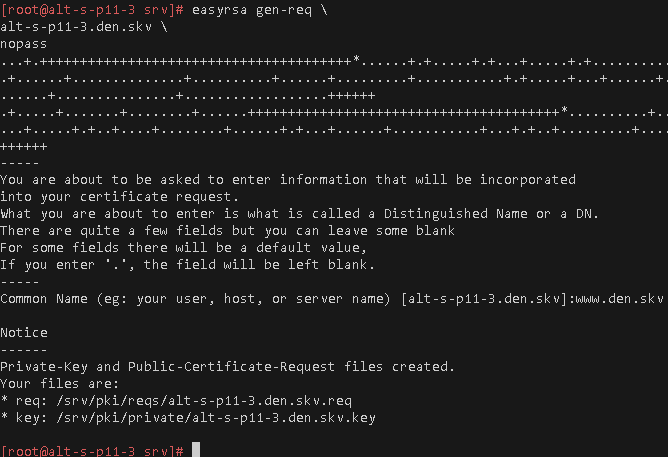
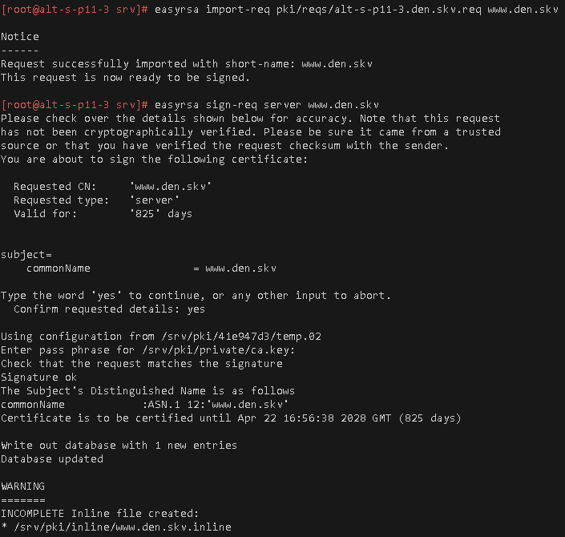
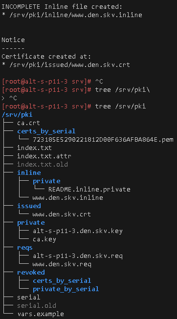
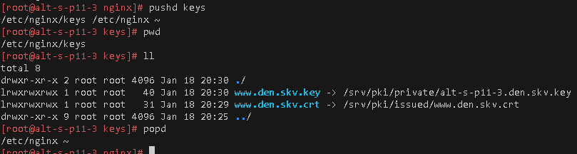
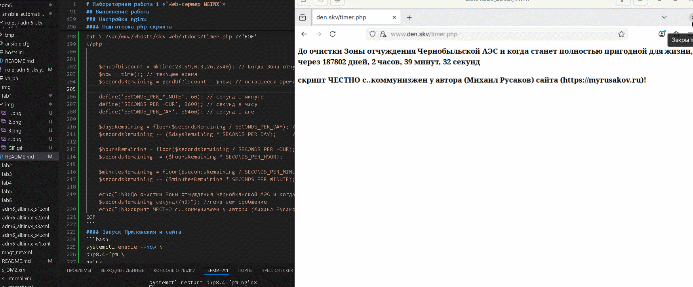

# Лабораторная работа 1 «`Web-сервер NGINX`» 
## Памятка входа
```bash
# Включаем агента в текущей оснастке
> ~/.ssh/known_hosts
eval $(ssh-agent) \
&& ssh-add  ~/.ssh/id_alt-adm6_2026_host_ed25519

# вход на bastion-хост по ключу по ssh
ssh -t \
-i ~/.ssh/id_alt-adm6_2026_host_ed25519 \
-o StrictHostKeyChecking=accept-new \
sadmin@192.168.121.2 \
"su -"

# Памятка входа на хосты через alt-s-p11-1 по ключу по ssh
## хосты:
### 10.0.0.9 - alt-s-p11-2 - internet
### 10.0.0.8 - alt-s-p11-4 - internet
### 10.20.20.244 - alt-s-p11-3 - DMZ
### 10.1.1.244 - alt-w-p11-1.den.skv - internal
ssh -t \
-i ~/.ssh/id_alt-adm6_2026_host_ed25519 \
-J sadmin@192.168.121.2 \
-o StrictHostKeyChecking=accept-new \
sadmin@ХОСТ \
"su -"

# скриптом поочередно на указанные хосты
for enter in 10.0.0.9 10.0.0.8 10.20.20.244 10.1.1.244; do
ssh -t \
-i ~/.ssh/id_alt-adm6_2026_host_ed25519 \
-J sadmin@192.168.121.2 \
-o StrictHostKeyChecking=accept-new \
sadmin@$enter \
"su -"
done
```


## Предварительно
### Запуск стенда
```bash
# Включаем агента в текущей оснастке
> ~/.ssh/known_hosts
eval $(ssh-agent) \
&& ssh-add  ~/.ssh/id_alt-adm6_2026_host_ed25519

# Поочередный запуск всех сетей libvirt со 2ого по списку
sudo virsh net-list --all \
| awk 'NR > 3 {print $1}' \
| xargs -I {} sudo virsh net-start {}

# запуск ВМ alt-s-p11-route (взаимодействие как через bastion-хост)
sudo virsh start \
--domain adm6_altlinux_s1

# Поочередный запуск для лабораторной работы ВМ alt-s-p11-3 - DMZ и alt-w-p11-1.den.skv - internal
for l1 in s3 w1; do \
sudo bash -c \
"virsh start \
--domain adm6_altlinux_$l1"
done
```
### Для github и gitflic
```bash
git log --oneline

git branch -v

git switch main

git status

git add . .. ../.. \
&& git status

git remote -v

git commit -am 'оформление для ADM6, lab1 nginx' \
&& git push \
--set-upstream \
altlinux \
main \
&& git push \
--set-upstream \
altlinux_gf \
main
```
## Выполнение работы
### на узле alt-s-p11-3 - DMZ создание самоподписанного сертификата
```bash
# Вход на хост alt-s-p11-3
ssh -t \
-i ~/.ssh/id_alt-adm6_2026_host_ed25519 \
-J sadmin@192.168.121.2 \
-o StrictHostKeyChecking=accept-new \
sadmin@10.20.20.244 \
"su -"

# Установка nginx и easy-rsa
apt-get update \
&& apt-get install -y \
nginx \
webserver-common \
php8.4-fpm-fcgi \
easy-rsa \
tree

# Генерация структуры каталогов PKI и генерация сертификата CA
cd /srv \
&& easyrsa init-pki \
&& easyrsa build-ca

# сами у себя генерируем запрос в файл с именем alt-s-p11-3.den.skv без пароля
# в common name указываем www.den.skv
easyrsa gen-req \
alt-s-p11-3.den.skv \
nopass

tree /srv/pki

# импортируем в центр сертификации запрос
easyrsa import-req \
pki/reqs/alt-s-p11-3.den.skv.req \
www.den.skv

# подписываем запрос с атрибутами для server для www.den.skv
easyrsa sign-req \
server \
www.den.skv

tree /srv/pki
```

  

### Настройка nginx
#### размещаем ключи и сертификат
```bash
# Создаем каталог под ключи и сертификат 
cd /etc/nginx/
mkdir keys

# прокидываем ключи и сертификат
pushd keys
ln -s \
/srv/pki/issued/www.den.skv.crt \
./
ln -s \
/srv/pki/private/alt-s-p11-3.den.skv.key \
./www.den.skv.key
popd
```



#### Подготовка конфига nginx
```bash
# создание каталогов расположения сайта-приложения и логов
mkdir -p \
/var/www/vhosts/skv-web/htdocs \
/var/www/vhosts/skv-web/logs/

# создание своего конфига сайта
cat > sites-available.d/den_skv_adm6.conf <<'EOF'
server {
        listen  443 ssl;
        server_name www.den.skv;
        ssl_certificate /etc/nginx/keys/www.den.skv.crt;
        ssl_certificate_key /etc/nginx/keys/www.den.skv.key;
        ssl_protocols TLSv1.2 TLSv1.3;

        location / {
            root /var/www/vhosts/skv-web/htdocs;
        }
        location ~ \.php$ {
            root /var/www/vhosts/skv-web/htdocs;
            include /etc/nginx/fastcgi_params;
                fastcgi_pass unix:/var/run/php8.4-fpm/php8.4-fpm.sock;
            fastcgi_param SCRIPT_FILENAME
            /var/www/vhosts/skv-web/htdocs/$fastcgi_script_name;
        }
                access_log /var/www/vhosts/skv-web/logs/access.log;
                error_log /var/www/vhosts/skv-web/error.log;
}
EOF

# Включаем сайт пробросом символьной ссылки 
ln -s \
/etc/nginx/sites-available.d/den_skv_adm6.conf \
/etc/nginx/sites-enabled.d/
```

#### Подготовка php скрипта
```bash
cat > /var/www/vhosts/skv-web/htdocs/timer.php <<'EOF'
<?php


    $endOfDiscount = mktime(23,59,0,3,26,2540); // Когда Зона отчуждения Чернобыльской АЭС станет полностью пригодной для жизни
    $now = time(); // текущее время
    $secondsRemaining = $endOfDiscount - $now; // оставшееся время

    define('SECONDS_PER_MINUTE', 60); // секунд в минуте
    define('SECONDS_PER_HOUR', 3600); // секунд в часу
    define('SECONDS_PER_DAY', 86400); // секунд в дне

    $daysRemaining = floor($secondsRemaining / SECONDS_PER_DAY); //дни, до даты
    $secondsRemaining -= ($daysRemaining * SECONDS_PER_DAY);     //обновляем переменную

    $hoursRemaining = floor($secondsRemaining / SECONDS_PER_HOUR); // часы до даты
    $secondsRemaining -= ($hoursRemaining * SECONDS_PER_HOUR);     //обновляем переменную

    $minutesRemaining = floor($secondsRemaining / SECONDS_PER_MINUTE); //минуты до даты
    $secondsRemaining -= ($minutesRemaining * SECONDS_PER_MINUTE);     //обновляем переменную

    echo("<h3>До очистки Зоны отчуждения Чернобыльской АЭС и когда станет полностью пригодной для жизни, через $daysRemaining дней, $hoursRemaining часов, $minutesRemaining минут, $secondsRemaining секунд</h3>"); //печатаем сообщение
    echo("<h3>скрипт ЧЕСТНО с..коммунизжен у автора (Михаил Русаков) сайта (https://myrusakov.ru)!</h3>");
EOF
```



#### Запуск Приложения и сайта
```bash
systemctl enable --now \
php8.4-fpm \
nginx
```
#### Распространение CA сертификата удостоверяющего центра на хост машину
```bash
# на сервере CA копируем сертификат удостоверяющего центра на хост машину
rsync -vP \
/srv/pki/ca.crt \
sadmin@10.1.1.244:~/

# На клиентской машине копируем сертификат удостоверяющего центра в соответствующи каталог
cp /home/sadmin/ca.crt \
/etc/pki/ca-trust/source/anchors/ \
&& update-ca-trust
```
### Для github и gitflic
```bash
rsync -vP \
/var/www/vhosts/skv-web/htdocs/timer.php \
shoel@192.168.121.1:/home/shoel/nfs_git/adm/adm6/lab1

rsync -vP \
sites-available.d/den_skv_adm6.conf \
shoel@192.168.121.1:/home/shoel/nfs_git/adm/adm6/lab1

git log --oneline

git branch -v

git switch main

git status

git add . .. ../.. \
&& git status

git remote -v

git commit -am 'оформление для ADM6, lab1 nginx_fpm_php_ready' \
&& git push \
--set-upstream \
altlinux \
main \
&& git push \
--set-upstream \
altlinux_gf \
main
```