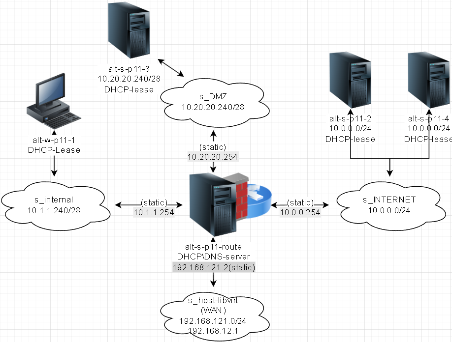

# Лабораторная работа 1 «`Web-сервер NGINX`» 
## Памятка входа
```bash
# Включаем агента в текущей оснастке
> ~/.ssh/known_hosts
eval $(ssh-agent) \
&& ssh-add  ~/.ssh/id_alt-adm6_2026_host_ed25519

# вход на bastion-хост по ключу по ssh
ssh -t \
-i ~/.ssh/id_alt-adm6_2026_host_ed25519 \
-o StrictHostKeyChecking=accept-new \
sadmin@192.168.121.2 \
"su -"

# Памятка входа на хосты через alt-s-p11-1 по ключу по ssh
## хосты:
### 10.0.0.9 - alt-s-p11-2 - internet
### 10.0.0.8 - alt-s-p11-4 - internet
### 10.20.20.244 - alt-s-p11-3 - DMZ
### 10.1.1.244 - alt-w-p11-1.den.skv - internal
ssh -t \
-i ~/.ssh/id_alt-adm6_2026_host_ed25519 \
-J sadmin@192.168.121.2 \
-o StrictHostKeyChecking=accept-new \
sadmin@ХОСТ \
"su -"

# скриптом поочередно на указанные хосты
for enter in 10.0.0.9 10.0.0.8 10.20.20.244 10.1.1.244; do
ssh -t \
-i ~/.ssh/id_alt-adm6_2026_host_ed25519 \
-J sadmin@192.168.121.2 \
-o StrictHostKeyChecking=accept-new \
sadmin@$enter \
"su -"
done
```



## Предварительно
### Запуск стенда
```bash
# Включаем агента в текущей оснастке
> ~/.ssh/known_hosts
eval $(ssh-agent) \
&& ssh-add  ~/.ssh/id_alt-adm6_2026_host_ed25519

# Поочередный запуск всех сетей libvirt со 2ого по списку
sudo virsh net-list --all \
| awk 'NR > 3 {print $1}' \
| xargs -I {} sudo virsh net-start {}

# запуск ВМ alt-s-p11-route (взаимодействие как через bastion-хост)
sudo virsh start \
--domain adm6_altlinux_s1

# Поочередный запуск для лабораторной работы ВМ alt-s-p11-3 - DMZ и alt-w-p11-1.den.skv - internal
for l1 in s3 w1; do \
sudo bash -c \
"virsh start \
--domain adm6_altlinux_$l1"
done
```
### Для github и gitflic
```bash
git log --oneline

git branch -v

git switch main

git status

git add . .. ../.. \
&& git status

git remote -v

git commit -am 'оформление для ADM6, lab1 nginx' \
&& git push \
--set-upstream \
altlinux \
main \
&& git push \
--set-upstream \
altlinux_gf \
main
```