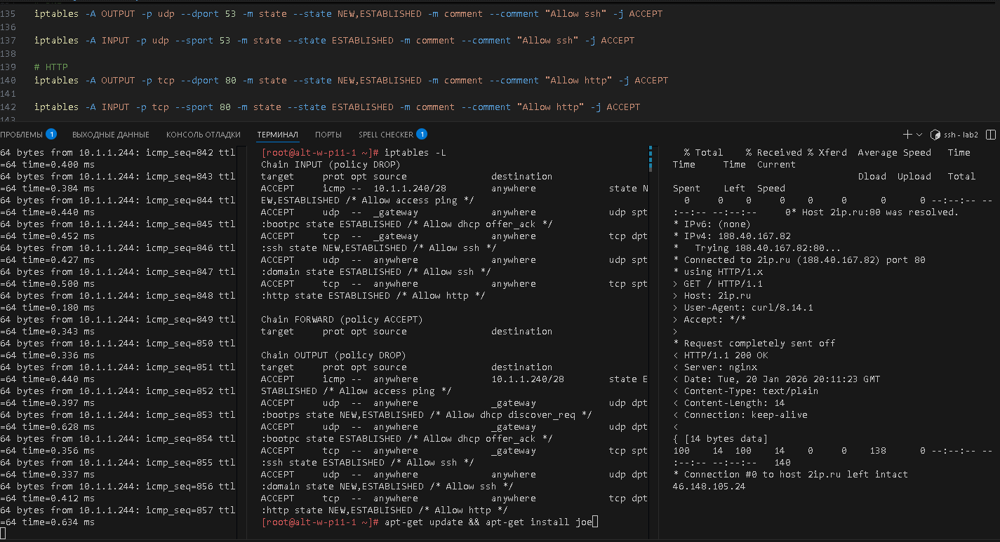
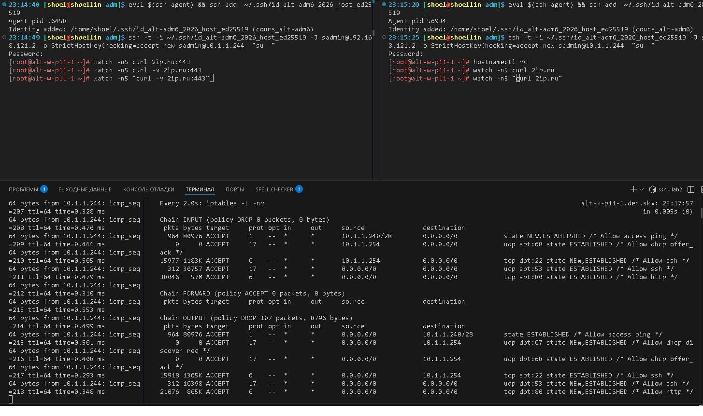

# Лабораторная работа 2 «`Настройка пакетной фильтрации средствами iptables`» 
## Памятка входа
```bash
# Включаем агента в текущей оснастке
> ~/.ssh/known_hosts
eval $(ssh-agent) \
&& ssh-add  ~/.ssh/id_alt-adm6_2026_host_ed25519

# вход на bastion-хост по ключу по ssh
ssh -t \
-i ~/.ssh/id_alt-adm6_2026_host_ed25519 \
-o StrictHostKeyChecking=accept-new \
sadmin@192.168.121.2 \
"su -"

# Памятка входа на хосты через alt-s-p11-1 по ключу по ssh
## хосты:
### 10.0.0.9 - alt-s-p11-2 - internet
### 10.0.0.8 - alt-s-p11-4 - internet
### 10.20.20.244 - alt-s-p11-3 - DMZ
### 10.1.1.244 - alt-w-p11-1.den.skv - internal
ssh -t \
-i ~/.ssh/id_alt-adm6_2026_host_ed25519 \
-J sadmin@192.168.121.2 \
-o StrictHostKeyChecking=accept-new \
sadmin@ХОСТ \
"su -"

# скриптом поочередно на указанные хосты
for enter in 10.0.0.9 10.0.0.8 10.20.20.244 10.1.1.244; do
ssh -t \
-i ~/.ssh/id_alt-adm6_2026_host_ed25519 \
-J sadmin@192.168.121.2 \
-o StrictHostKeyChecking=accept-new \
sadmin@$enter \
"su -"
done
```


## Предварительно
### Запуск стенда
```bash
cd adm6/lab2

# Включаем агента в текущей оснастке
> ~/.ssh/known_hosts
eval $(ssh-agent) \
&& ssh-add  ~/.ssh/id_alt-adm6_2026_host_ed25519

# Поочередный запуск всех сетей libvirt со 2ого по списку
sudo virsh net-list --all \
| awk 'NR > 3 {print $1}' \
| xargs -I {} sudo virsh net-start {}

# запуск ВМ alt-s-p11-route (взаимодействие как через bastion-хост)
sudo virsh start \
--domain adm6_altlinux_s1

# запуск для лабораторной работы ВМ alt-w-p11-1.den.skv - internal
for l1 in w1; do \
sudo bash -c \
"virsh start \
--domain adm6_altlinux_$l1"
done
```
### Для github и gitflic
```bash
git log --oneline

git branch -v

git switch main

git status

git add . .. ../.. \
&& git status

git remote -v

git commit -am 'оформление для ADM6, lab2 iptables' \
&& git push \
--set-upstream \
altlinux \
main \
&& git push \
--set-upstream \
altlinux_gf \
main
```
## Выполнение работы
### на узле alt-w-p11-1 - internal
```bash
# Вход на хост alt-s-p11-3
ssh -t \
-i ~/.ssh/id_alt-adm6_2026_host_ed25519 \
-J sadmin@192.168.121.2 \
-o StrictHostKeyChecking=accept-new \
sadmin@10.1.1.244 \
"su -"

# icmp  
iptables -A INPUT -p icmp -s 10.1.1.240/28 -m state --state NEW,ESTABLISHED -m comment --comment "Allow access ping" -j ACCEPT

iptables -A OUTPUT -p icmp -d 10.1.1.240/28 -m state --state ESTABLISHED -m comment --comment "Allow access ping" -j ACCEPT

# DHCP
iptables -A OUTPUT -p udp --dport 67 -d 10.1.1.254/32 -m state --state NEW,ESTABLISHED -m comment --comment "Allow dhcp discover_req" -j ACCEPT

iptables -A INPUT -p udp --sport 68 -s 10.1.1.254/32 -m state --state ESTABLISHED -m comment --comment "Allow dhcp offer_ack" -j ACCEPT

iptables -A OUTPUT -p udp --dport 68 -d 10.1.1.254/32 -m state --state ESTABLISHED -m comment --comment "Allow dhcp offer_ack" -j ACCEPT

# ssh
iptables -A INPUT -p tcp --dport 22 -s 10.1.1.254/32 -m state --state NEW,ESTABLISHED -m comment --comment "Allow ssh" -j ACCEPT

iptables -A OUTPUT -p tcp --sport 22 -d 10.1.1.254/32 -m state --state ESTABLISHED -m comment --comment "Allow ssh" -j ACCEPT

# DNS
iptables -A OUTPUT -p udp --dport 53 -m state --state NEW,ESTABLISHED -m comment --comment "Allow ssh" -j ACCEPT

iptables -A INPUT -p udp --sport 53 -m state --state ESTABLISHED -m comment --comment "Allow ssh" -j ACCEPT

# HTTP
iptables -A OUTPUT -p tcp --dport 80 -m state --state NEW,ESTABLISHED -m comment --comment "Allow http" -j ACCEPT

iptables -A INPUT -p tcp --sport 80 -m state --state ESTABLISHED -m comment --comment "Allow http" -j ACCEPT

iptables -P INPUT DROP && iptables -P OUTPUT DROP

```

 

### Для github и gitflic
```bash
# Поочередная остановка alt-w-p11-1.den.skv и alt-s-p11-1 - bastion и internal
for l1 in s1 w1; do \
sudo bash -c \
"virsh destroy --graceful \
--domain adm6_altlinux_$l1"
done

git log --oneline

git branch -v

git switch main

git status

git add . .. ../.. \
&& git status

git remote -v

git commit -am 'оформление для ADM6, lab2 statefull' \
&& git push \
--set-upstream \
altlinux \
main \
&& git push \
--set-upstream \
altlinux_gf \
main
```