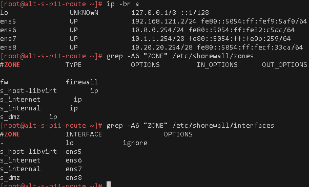
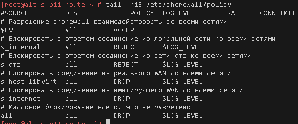
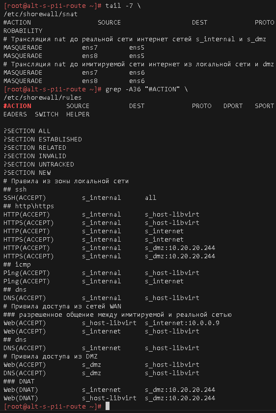
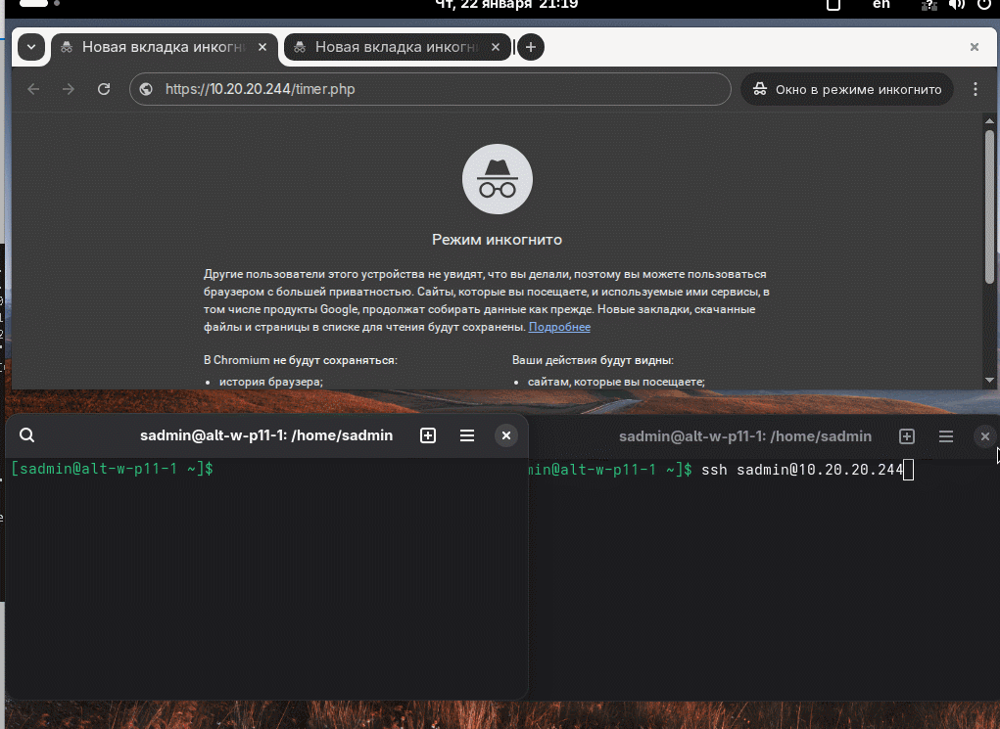

# Лабораторная работа 3 «`Межсетевой экран(shorewall)`» 
## Памятка входа
```bash
# Включаем агента в текущей оснастке
> ~/.ssh/known_hosts
eval $(ssh-agent) \
&& ssh-add  ~/.ssh/id_alt-adm6_2026_host_ed25519

# вход на bastion-хост по ключу по ssh
ssh -t \
-i ~/.ssh/id_alt-adm6_2026_host_ed25519 \
-o StrictHostKeyChecking=accept-new \
sadmin@192.168.121.2 \
"su -"

# Памятка входа на хосты через alt-s-p11-1 по ключу по ssh
## хосты:
### 10.0.0.9 - alt-s-p11-2 - internet
### 10.0.0.8 - alt-s-p11-4 - internet
### 10.20.20.244 - alt-s-p11-3 - DMZ
### 10.1.1.244 - alt-w-p11-1.den.skv - internal
ssh -t \
-i ~/.ssh/id_alt-adm6_2026_host_ed25519 \
-J sadmin@192.168.121.2 \
-o StrictHostKeyChecking=accept-new \
sadmin@ХОСТ \
"su -"

# скриптом поочередно на указанные хосты
for enter in 10.0.0.9 10.0.0.8 10.20.20.244 10.1.1.244; do
ssh -t \
-i ~/.ssh/id_alt-adm6_2026_host_ed25519 \
-J sadmin@192.168.121.2 \
-o StrictHostKeyChecking=accept-new \
sadmin@$enter \
"su -"
done
```


## Предварительно
### Запуск стенда
```bash
cd adm6/lab3

# Отображение списка snapshot машин стенда
for snap in s{1..4} w1; do \
sudo bash -c \
"virsh snapshot-list adm6_altlinux_$snap"; 
done 

# откат прошлых изменений на alt-w-p11-1
sudo virsh snapshot-revert \
--snapshotname 2 \
--domain adm6_altlinux_w1

# Включаем агента в текущей оснастке
> ~/.ssh/known_hosts
eval $(ssh-agent) \
&& ssh-add  ~/.ssh/id_alt-adm6_2026_host_ed25519

# Поочередный запуск всех сетей libvirt со 2ого по списку
sudo virsh net-list --all \
| awk 'NR > 3 {print $1}' \
| xargs -I {} sudo virsh net-start {}

# запуск ВМ alt-s-p11-route
sudo virsh start \
--domain adm6_altlinux_s1

# Поочередный запуск для лабораторной работы ВМ alt-s-p11-2 - internet и alt-w-p11-1.den.skv - internal
for l1 in s{2,3} w1; do \
sudo bash -c \
"virsh start \
--domain adm6_altlinux_$l1"
done
```
## Выполнение работы
### на узле alt-s-p11-1 (`bastion`)
#### чистка конфигурации nftables
```bash
# вход на bastion-хост по ключу по ssh
ssh -t \
-i ~/.ssh/id_alt-adm6_2026_host_ed25519 \
-o StrictHostKeyChecking=accept-new \
sadmin@192.168.121.2 \
"su -"

# чистка ранее развернутого nftables в режиме nat для всех внутренних сетей стенда
nft flush ruleset \
&& nft list ruleset

# Выключаем и исключаем из автозагрузки службу nftables:
systemctl disable --now \
nftables

# Перезапуск службы сети
systemctl restart network
```
#### Установка и предварительная настройка shorewall
```bash
# обновление списка пакетов и установка пакетов для shorewall
apt-get update \
&& apt-get install -y \
shorewall

# Проверка состояния net.ipv4.ip_forward = 1
grep "rd = " \
/etc/net/sysctl.conf 
```
#### Описание зон сетей
```bash
# Описание зоны реального выхода в интернет
echo "s_libvirt       ip" \
>> /etc/shorewall/zones

# Описание зоны имитации интернет
echo "s_internet      ip" \
>> /etc/shorewall/zones

# Описание локальной сети
echo "s_internal      ip" \
>> /etc/shorewall/zones

# Описание сети DMZ
echo "s_dmz           ip" \
>> /etc/shorewall/zones

# Вывод описания зон
grep -A6 "ZONE" /etc/shorewall/zones
```
#### Привязка зон к интерфейсам
```bash
# где:
# ens5 # - 192.168.121.0/24 - "s_host-libvirt" - сеть реального выхода в интернет
# ens6 # - 10.0.0.0/24 - "s_internet" - сеть имитации интернет
# ens7 # - 10.1.1.244 - "s_internal" - сеть локальной сети
# ens8 # - 10.20.20.244 - "s_dmz" - сеть DMZ
cat >> /etc/shorewall/interfaces <<'EOF'
-               lo            ignore
s_libvirt       ens5
s_internet      ens6
s_internal      ens7
s_dmz           ens8
EOF

# Вывод описания зон
grep -A6 "ZONE" /etc/shorewall/zones

# Вывод описания привязки зон к интерфейсам
grep -A6 "ZONE" /etc/shorewall/interfaces
```



#### Описание политик хождения трафика относительно зон и самого shorewall
```bash
cat >> /etc/shorewall/policy <<'EOF'
# Разрешение shorewall взаимодействовать со всеми сетями
$FW             all         ACCEPT
# Блокировать c ответом соединение из локальной сети ко всеми сетями
s_internal      all         REJECT      $LOG_LEVEL
# Блокировать c ответом соединение из сети dmz ко всеми сетями
s_dmz           all         REJECT      $LOG_LEVEL
# Массовое блокирование всего, что не разрешено
all             all         DROP        $LOG_LEVEL
EOF

# Вывод описания политик по умолчанию
tail \
/etc/shorewall/policy
```



##### Промежуточное сохранение(snapshot) машины
```bash
# выключение машины
systemctl poweroff

# вывод списка snapshot хоста
sudo virsh snapshot-list \
adm6_altlinux_s1

# Создание snapshot
### Основного сервера сети
sudo virsh snapshot-create-as \
--domain adm6_altlinux_s1 \
--name 3 \
--description "shorewall_policy" --atomic
```
##### Для github и gitflic
```bash
git log --oneline

git branch -v

git switch main

git status

git add . .. ../.. \
&& git status

git remote -v

git commit -am 'оформление для ADM6, lab3 shorewall Upd_2' \
&& git push \
--set-upstream \
altlinux \
main \
&& git push \
--set-upstream \
altlinux_gf \
main
```
#### Настройка правил трафика
```bash
# запуск ВМ alt-s-p11-route
sudo virsh start \
--domain adm6_altlinux_s1

# вход на bastion-хост по ключу по ssh
ssh -t \
-i ~/.ssh/id_alt-adm6_2026_host_ed25519 \
-o StrictHostKeyChecking=accept-new \
sadmin@192.168.121.2 \
"su -"

cat >> /etc/shorewall/rules <<'EOF'
## ssh
SSH(ACCEPT)         s_internal,s_libvirt      all
## http\https
HTTPS(ACCEPT)       s_internal      s_dmz:10.20.20.244
Web(ACCEPT)         s_internal      fw,s_libvirt,s_internet
Web(ACCEPT)         s_internet      fw,s_libvirt
## icmp
Ping(ACCEPT)        s_internal      fw,s_libvirt,s_internet
## dns
DNS(ACCEPT)         s_internal,s_internet   fw,s_libvirt
DNS(ACCEPT)         s_libvirt               fw
### для обновления пакетов хостов в dmz
DNS(ACCEPT)         s_dmz                   fw,s_libvirt
Web(ACCEPT)         s_dmz                   fw,s_libvirt
EOF

# Вывод описания правил
grep -A33 "#ACTION" \
/etc/shorewall/rules
```
#### Настройка правил NAT
```bash
# SNAT из контролируемых зон
cat >> /etc/shorewall/snat <<'EOF'
# ens5 # - 192.168.121.0/24 - "s_host-libvirt" - сеть реального выхода в интернет
# ens6 # - 10.0.0.0/24 - "s_internet" - сеть имитации интернет
# ens7 # - 10.1.1.244 - "s_internal" - сеть локальной сети
# ens8 # - 10.20.20.244 - "s_dmz" - сеть DMZ
# Трансляция nat до реальной сети интернет сетей s_internal и s_dmz
MASQUERADE          ens7        ens5
MASQUERADE          ens8        ens5
# Трансляция nat до имитируемой сети интернет из dmz
MASQUERADE          ens8        ens6
EOF

# вывод правил snat 
tail \
/etc/shorewall/snat

# Вывод описания правил и DNAT
grep -A36 "#ACTION" \
/etc/shorewall/rules
```



#### Запуск службы shorewall с прописанными правилами и политиками
```bash
# Включаем через конфигурацию постоянное состояние net.ipv4.ip_forward = 1
sed -i '/IP_FORWARDING/s/Keep/On/' \
/etc/shorewall/shorewall.conf

# Включаем разрешение на запуск службы
sed -i '/STARTUP_E/s/No/Yes/' \
/etc/shorewall/shorewall.conf

# Включаем запуск службы
systemctl enable \
--now \
shorewall
```


```bash
# Поочередная остановка запущенных ВМ
for l1 in s{1..4} w1; do \
sudo bash -c \
"virsh destroy --graceful \
--domain adm6_altlinux_$l1"
done

# Создание snapshot bastion-хоста
sudo virsh snapshot-create-as \
--domain adm6_altlinux_s1 \
--name 3 \
--description "nat+squid-proxy-cacher" --atomic
```
##### Для github и gitflic
```bash
git log --oneline

git branch -v

git switch main

git status

git add . .. ../.. \
&& git status

git remote -v

git commit -am 'оформление для ADM6, lab3 shorewall ready _update2' \
&& git push \
--set-upstream \
altlinux \
main \
&& git push \
--set-upstream \
altlinux_gf \
main
```