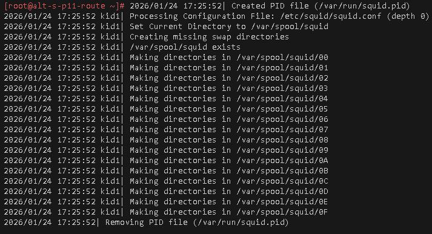
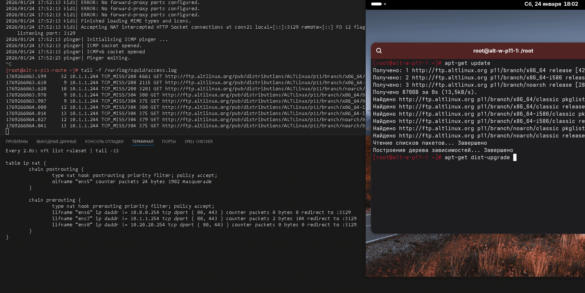
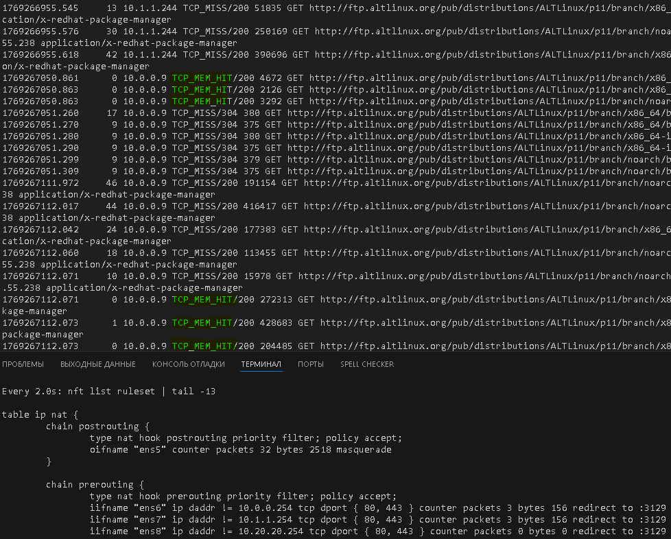

# Лабораторная работа 4 «`Прокси-сервер SQUID`» 
## Памятка входа
```bash
# Включаем агента в текущей оснастке
> ~/.ssh/known_hosts
eval $(ssh-agent) \
&& ssh-add  \
~/.ssh/id_alt-adm6_2026_host_ed25519

# вход на bastion-хост по ключу по ssh
ssh -t \
-i ~/.ssh/id_alt-adm6_2026_host_ed25519 \
-o StrictHostKeyChecking=accept-new \
sadmin@192.168.121.2 \
"su -"

# Памятка входа на хосты через alt-s-p11-1 по ключу по ssh
## хосты:
### 10.0.0.9 - alt-s-p11-2 - internet
### 10.0.0.8 - alt-s-p11-4 - internet
### 10.20.20.244 - alt-s-p11-3 - DMZ
### 10.1.1.244 - alt-w-p11-1.den.skv - internal
ssh -t \
-i ~/.ssh/id_alt-adm6_2026_host_ed25519 \
-J sadmin@192.168.121.2 \
-o StrictHostKeyChecking=accept-new \
sadmin@ХОСТ \
"su -"

# скриптом поочередно на указанные хосты
for enter in 10.0.0.9 10.0.0.8 10.20.20.244 10.1.1.244; do
ssh -t \
-i ~/.ssh/id_alt-adm6_2026_host_ed25519 \
-J sadmin@192.168.121.2 \
-o StrictHostKeyChecking=accept-new \
sadmin@$enter \
"su -"
done
```


## Предварительно
### Запуск стенда
```bash
cd adm6/lab4

# Отображение списка snapshot машин стенда
for snap in s{1..4} w1; do \
sudo bash -c \
"virsh snapshot-list adm6_altlinux_$snap"; 
done

# откат прошлых изменений на alt-w-p11-1 в сети s_internal
sudo virsh snapshot-revert \
--snapshotname 2 \
--domain adm6_altlinux_w1

# откат прошлых изменений на alt-s-p11-2 в сети s_internet
sudo virsh snapshot-revert \
--snapshotname 2 \
--domain adm6_altlinux_s2

# откат прошлых изменений на alt-s-p11-1(bastion)
sudo virsh snapshot-revert \
--snapshotname 2 \
--domain adm6_altlinux_s1

# Включаем агента в текущей оснастке
> ~/.ssh/known_hosts
eval $(ssh-agent) \
&& ssh-add  \
~/.ssh/id_alt-adm6_2026_host_ed25519

# Поочередный запуск всех сетей libvirt со 2ого по списку
sudo virsh net-list --all \
| awk 'NR > 3 {print $1}' \
| xargs -I {} sudo virsh net-start {}

# запуск ВМ alt-s-p11-route
sudo virsh start \
--domain adm6_altlinux_s1

# Поочередный запуск для лабораторной работы ВМ alt-s-p11-2 - internet и alt-w-p11-1.den.skv - internal
for l1 in w1 s2; do \
sudo bash -c \
"virsh start \
--domain adm6_altlinux_$l1"
done
```
## Выполнение работы
### на узле alt-s-p11-1 (`bastion`)
#### конфигурация nat через nftables 
```bash
# вход на bastion-хост по ключу по ssh
ssh -t \
-i ~/.ssh/id_alt-adm6_2026_host_ed25519 \
-o StrictHostKeyChecking=accept-new \
sadmin@192.168.121.2 \
"su -"

nft flush ruleset

apt-get remove \
nftables -y --purge

apt-get update \
&& apt-get install -y \
nftables

# Создаём необходимую структуру для nftables (семейство, таблица, цепочка) для настройки postrouting NAT:
## где ens5 это интерфейс s_host-libvirt с выходом в реальную WAN сеть 
nft add table ip nat
nft add chain ip nat postrouting '{ type nat hook postrouting priority 0; }'
nft add rule ip nat postrouting oifname "ens5" counter masquerade
# nft add rule ip nat postrouting ip saddr 10.1.1.240/28 oifname "ens5" counter masquerade
# nft add rule ip nat postrouting ip saddr 10.0.0.0/24 oifname "ens5" counter masquerade
# nft add rule ip nat postrouting ip saddr 10.20.20.240/28 oifname "ens5" counter masquerade

# Включаем и добавляем в автозагрузку службу nftables:
systemctl enable --now \
nftables

# Сохраняем правила nftables
nft list ruleset \
| tee -a /etc/nftables/nftables.nft

systemctl reboot

# Проверка что конфиг применяется
cat /etc/nftables/nftables.nft \
&& systemctl status nftables
```
#### Установка и предварительная настройка squid
```bash
# обновление списка пакетов и установка пакетов для shorewall
apt-get update \
&& apt-get install -y \
squid

# backup конфига
cp -f /etc/squid/squid.conf{,.bak}

# чистка конфига от комментариев
sed -i \
-e '/^[[:space:]]*#/d' \
-e '/^[[:space:]]*$/d' \
/etc/squid/squid.conf

# запуск службы
systemctl enable --now \
squid

systemctl status \
squid
```
#### Своя предварительная настройка squid
##### создаем свои acl списки сетей
```bash
# Добавляем acl локальной сети стенда
sed -i '/deny to_linklocal/a acl s_internal src 10.1.1.240\/28' \
/etc/squid/squid.conf

# Добавляем acl dmz сети стенда
sed -i '/deny to_linklocal/a acl s_dmz src 10.20.20.240\/28' \
/etc/squid/squid.conf

# Добавляем acl имитации сети WAN (s_intenret) сети стенда
sed -i '/deny to_linklocal/a acl s_internet src 10.0.0.0\/24' \
/etc/squid/squid.conf

squid -k reconfigure
```
##### Добавляем к acl спискам правило http_access 
```bash
sed -i '/acl s_internal/a http_access allow s_internal' \
/etc/squid/squid.conf

sed -i '/acl s_internet/a http_access allow s_internet' \
/etc/squid/squid.conf

sed -i '/acl s_dmz/a http_access allow s_dmz' \
/etc/squid/squid.conf

squid -k reconfigure
```
##### настройка режима кеширования
```bash
cat >> /etc/squid/squid.conf <<'EOF'
cache_mem 1024 MB
cache_dir ufs /var/spool/squid 2048 16 256
maximum_object_size 100 MB
maximum_object_size_in_memory 1 MB
EOF

squid -k reconfigure

squid -z
```



##### перенастройка для работы только в сквозном режиме
```bash
## Перенаправление prerouting для squid в прозрачном режиме
### HTTP\https
nft add chain ip nat prerouting '{ type nat hook prerouting priority 0; }'
nft add rule ip nat prerouting iifname "ens6" ip daddr != 10.0.0.254 tcp dport { 80, 443 } counter redirect to :3129
nft add rule ip nat prerouting iifname "ens7" ip daddr != 10.1.1.254 tcp dport { 80, 443 } counter redirect to :3129
nft add rule ip nat prerouting iifname "ens8" ip daddr != 10.20.20.254 tcp dport { 80, 443 } counter redirect to :3129

# Сохраняем правила nftables
nft list ruleset \
| tee -a /etc/nftables/nftables.nft

# Проверка что конфиг применяется
cat /etc/nftables/nftables.nft \
&& systemctl status nftables

# Перенастройка работы squid в только в сквозном режиме
sed -i 's/3128/3129 intercept/' \
/etc/squid/squid.conf

squid -k reconfigure
```

 

```bash
acl localnet src 0.0.0.1-0.255.255.255	# RFC 1122 "this" network (LAN)
acl localnet src 10.0.0.0/8		# RFC 1918 local private network (LAN)
acl localnet src 100.64.0.0/10		# RFC 6598 shared address space (CGN)
acl localnet src 169.254.0.0/16 	# RFC 3927 link-local (directly plugged) machines
acl localnet src 172.16.0.0/12		# RFC 1918 local private network (LAN)
acl localnet src 192.168.0.0/16		# RFC 1918 local private network (LAN)
acl localnet src fc00::/7       	# RFC 4193 local private network range
acl localnet src fe80::/10      	# RFC 4291 link-local (directly plugged) machines
acl SSL_ports port 443
acl Safe_ports port 80		# http
acl Safe_ports port 21		# ftp
acl Safe_ports port 443		# https
acl Safe_ports port 70		# gopher
acl Safe_ports port 210		# wais
acl Safe_ports port 1025-65535	# unregistered ports
acl Safe_ports port 280		# http-mgmt
acl Safe_ports port 488		# gss-http
acl Safe_ports port 591		# filemaker
acl Safe_ports port 777		# multiling http
http_access deny !Safe_ports
http_access deny CONNECT !SSL_ports
http_access allow localhost manager
http_access deny manager
http_access allow localhost
http_access deny to_localhost
http_access deny to_linklocal
acl s_internet src 10.0.0.0/24
http_access allow s_internet
acl s_dmz src 10.20.20.240/28
http_access allow s_dmz
acl s_internal src 10.1.1.240/28
http_access allow s_internal
http_access deny all
http_port 3129 intercept
coredump_dir /var/spool/squid
refresh_pattern ^ftp:		1440	20%	10080
refresh_pattern -i (/cgi-bin/|\?) 0	0%	0
refresh_pattern .		0	20%	4320
cache_mem 1024 MB
cache_dir ufs /var/spool/squid 2048 16 256
maximum_object_size 100 MB
maximum_object_size_in_memory 1 MB
```

##### Для github и gitflic
```bash
rsync -vP \
/etc/squid/squid.conf \
shoel@192.168.121.1:~/nfs_git/adm/adm6/lab4

git log --oneline

git branch -v

git switch main

git status

git add . .. ../.. \
&& git status

git remote -v

git commit -am 'оформление для ADM6, lab4 squid_update2' \
&& git push \
--set-upstream \
altlinux \
main \
&& git push \
--set-upstream \
altlinux_gf \
main
```