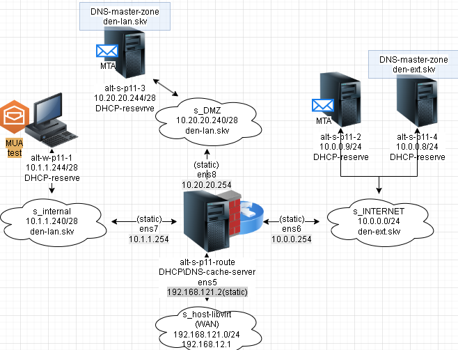

# Лабораторная работа 5 «`MTA postfix`» 
## Памятка входа
```bash
# Включаем агента в текущей оснастке
> ~/.ssh/known_hosts
eval $(ssh-agent) \
&& ssh-add  \
~/.ssh/id_alt-adm6_2026_host_ed25519

# вход на bastion-хост по ключу по ssh
ssh -t \
-i ~/.ssh/id_alt-adm6_2026_host_ed25519 \
-o StrictHostKeyChecking=accept-new \
sadmin@192.168.121.2 \
"su -"

# Памятка входа на хосты через alt-s-p11-1 по ключу по ssh
## хосты:
### 10.0.0.9 - alt-s-p11-2 - internet
### 10.0.0.8 - alt-s-p11-4 - internet
### 10.20.20.244 - alt-s-p11-3 - DMZ
### 10.1.1.244 - alt-w-p11-1.den.skv - internal
ssh -t \
-i ~/.ssh/id_alt-adm6_2026_host_ed25519 \
-J sadmin@192.168.121.2 \
-o StrictHostKeyChecking=accept-new \
sadmin@ХОСТ \
"su -"

# скриптом поочередно на указанные хосты
for enter in 10.0.0.9 10.0.0.8 10.20.20.244 10.1.1.244; do
ssh -t \
-i ~/.ssh/id_alt-adm6_2026_host_ed25519 \
-J sadmin@192.168.121.2 \
-o StrictHostKeyChecking=accept-new \
sadmin@$enter \
"su -"
done
```



## Предварительно
### Запуск стенда
```bash
cd adm6/lab5

# Отображение списка snapshot машин стенда
for snap in s{1..4} w1; do \
sudo bash -c \
"virsh snapshot-list adm6_altlinux_$snap"; 
done

# откат прошлых изменений на alt-w-p11-1 в сети s_internal
sudo virsh snapshot-revert \
--snapshotname 2 \
--domain adm6_altlinux_w1

# откат прошлых изменений на alt-s-p11-2 в сети s_internet
sudo virsh snapshot-revert \
--snapshotname 2 \
--domain adm6_altlinux_s2

# откат прошлых изменений на alt-s-p11-1(bastion)
sudo virsh snapshot-revert \
--snapshotname 3 \
--domain adm6_altlinux_s1

# Включаем агента в текущей оснастке
> ~/.ssh/known_hosts
eval $(ssh-agent) \
&& ssh-add  \
~/.ssh/id_alt-adm6_2026_host_ed25519

# Поочередный запуск всех сетей libvirt со 2ого по списку
sudo virsh net-list --all \
| awk 'NR > 3 {print $1}' \
| xargs -I {} sudo virsh net-start {}

# запуск ВМ alt-s-p11-route
sudo virsh start \
--domain adm6_altlinux_s1

# Поочередный запуск для лабораторной работы ВМ:
## alt-s-p11-4 - internet
## alt-s-p11-3 - dmz
## alt-w-p11-1 - internal
for l1 in w1 s{3,4}; do \
sudo bash -c \
"virsh start \
--domain adm6_altlinux_$l1"
done
```
## Выполнение работы
### на узле alt-s-p11-1 (`bastion`)
#### конфигурация DHCP для лабораторной работы
```bash
# вход на bastion-хост по ключу по ssh
ssh -t \
-i ~/.ssh/id_alt-adm6_2026_host_ed25519 \
-o StrictHostKeyChecking=accept-new \
sadmin@192.168.121.2 \
"su -"
```
##### конфигурация DHCP для DNS s_internet den-ext.skv
```bash
# убираем глобальный доменный суффикс
sed -i 's/option domain-name "skv.dv"/# option domain-name "skv.dv"/' \
/etc/dhcp/dhcpd.conf

# Добавляем доменный суффикс для сети subnet s_internet den-ext.skv
sed -i '/-servers 10.0.0.254;/a\    option domain-name "den-ext.skv";' \
/etc/dhcp/dhcpd.conf

# Добавляем будущий DNS сервер сети subnet s_internet домена den-ext.skv впереди кеширующего
sed -i 's|-servers 10.0.0.254;|-servers 10.0.0.8, 10.0.0.254;|' \
/etc/dhcp/dhcpd.conf
```
##### конфигурация DHCP для DNS s_internet,s_dmz den-lan.skv
```bash
# Добавляем доменный суффикс для сетей subnet s_internet,s_dmz den-lan.skv
sed -i '/-servers 10.1.1.254;/a\    option domain-name "den-lan.skv";' \
/etc/dhcp/dhcpd.conf

sed -i '/-servers 10.20.20.254;/a\    option domain-name "den-lan.skv";' \
/etc/dhcp/dhcpd.conf

# Добавляем будущий DNS сервер сетей subnet s_internet,s_dmz домена den-lan.skv впереди кеширующего
sed -i 's|-servers 10.1.1.254;|-servers 10.20.20.244, 10.1.1.254;|' \
/etc/dhcp/dhcpd.conf

sed -i 's|-servers 10.20.20.254;|-servers 10.20.20.244, 10.20.20.254;|' \
/etc/dhcp/dhcpd.conf
```
```bash
rsync -vP \
/etc/dhcp/dhcpd.conf \
shoel@192.168.121.1:~/nfs_git/adm/adm6/lab5
```
##### /etc/dhcp/dhcpd.conf
```bash
rsync -vP \
/etc/dhcp/dhcpd.conf \
shoel@192.168.121.1:~/nfs_git/adm/adm6/lab5/configs/dhcp_server
```
```ini
# Глобальные параметры
## Предоставляется аренда IP-адреса на 2 дня
default-lease-time 172800;
# Максимально возможный срок аренды IP-адреса 3 дня
max-lease-time 259200;
# Доменные суффиксы
# option domain-name "skv.dv";
## внешние DNS
option domain-name-servers 77.88.8.8, 77.88.8.1;

# Subnet для ens6 (10.0.0.254/24) s_internet
subnet 10.0.0.0 netmask 255.255.255.0 {
    # Шлюз по умолчанию
    option routers 10.0.0.254;
    option subnet-mask 255.255.255.0;
    option broadcast-address 10.0.0.255;
    # Локальный DNS для этой сети
    option domain-name-servers 10.0.0.8, 10.0.0.254;
    option domain-name "den-ext.skv";
    # Определение диапазона
    range 10.0.0.10 10.0.0.20;
}

# Резервирование 2х серверов
host alt-s-p11-2 {
  hardware ethernet 52:54:00:0b:4a:8d;
  fixed-address 10.0.0.9;
}

host alt-s-p11-4 {
  hardware ethernet 52:54:00:5e:ef:61;
  fixed-address 10.0.0.8;
}

# Subnet для ens7 (10.1.1.254/28) s_internal
subnet 10.1.1.240 netmask 255.255.255.240 {
    # Шлюз по умолчанию
    option routers 10.1.1.254;
    option subnet-mask 255.255.255.240;
    option broadcast-address 10.1.1.255;
    # Локальный DNS для этой сети
    option domain-name-servers 10.20.20.244, 10.1.1.254;
    option domain-name "den-lan.skv";
    # Определение диапазона
    range 10.1.1.245 10.1.1.253;
}

# Резервирование alt workstation
host alt-w-p11-1 {
  hardware ethernet 52:54:00:6a:37:66;
  fixed-address 10.1.1.244;
}

# Subnet для ens8 (10.20.20.254/28) s_DMZ
subnet 10.20.20.240 netmask 255.255.255.240 {
    option routers 10.20.20.254;
    option subnet-mask 255.255.255.240;
    option broadcast-address 10.20.20.255;
    # Локальный DNS для этой сети
    option domain-name-servers 10.20.20.244, 10.20.20.254;
    option domain-name "den-lan.skv";
    range 10.20.20.245 10.20.20.253;
}

# Резервирование alt-s-p11-3
host alt-s-p11-3 {
  hardware ethernet 52:54:00:34:42:5b;
  fixed-address 10.20.20.244;
}
```
#### Настройка службы BIND на кэширование на шлюзе сети и forward зон den-lan.skv и den-ext.skv.
```bash
cd /var/lib/bind

# даем доступ на dump кеша согласно пути по умолчанию в ./etc/options.conf
chmod g+x var 

# Forward зон прямого просмотра
cat >>./etc/local.conf<<'EOF'
zone "den-ext.skv" {
    type forward;
    forward only;
    forwarders { 10.0.0.8; };
};

zone "den-lan.skv" {
    type forward;
    forward only;
    forwarders { 10.20.20.244; };
};
EOF

# Forward зон обратного просмотра
cat >>./etc/local.conf<<'EOF'

zone "0.0.10.in-addr.arpa" {
    type forward;
    forward only;
    forwarders { 10.0.0.8; };
};

zone "20.20.10.in-addr.arpa" {
    type forward;
    forward only;
    forwarders { 10.20.20.244; };
};

zone "1.1.10.in-addr.arpa" {
    type forward;
    forward only;
    forwarders { 10.20.20.244; };
};
EOF
```
##### /var/lib/bind/etc/local.conf
```bash
rsync -vP /var/lib/bind/etc/local.conf\
shoel@192.168.121.1:~/nfs_git/adm/adm6/lab5/configs/dns_chacher
```
```ini
include "/etc/bind/rfc1912.conf";

// Consider adding the 1918 zones here,
// if they are not used in your organization.
//	include "/etc/bind/rfc1918.conf";

// Add other zones here
zone "den-ext.skv" {
    type forward;
    forward only;
    forwarders { 10.0.0.8; };
};

zone "den-lan.skv" {
    type forward;
    forward only;
    forwarders { 10.20.20.244; };
};

zone "0.0.10.in-addr.arpa" {
    type forward;
    forward only;
    forwarders { 10.0.0.8; };
};

zone "20.20.10.in-addr.arpa" {
    type forward;
    forward only;
    forwarders { 10.20.20.244; };
};

zone "1.1.10.in-addr.arpa" {
    type forward;
    forward only;
    forwarders { 10.20.20.244; };
};
```
##### /var/lib/bind/etc/options.conf
```bash
rsync -vP \
/var/lib/bind/etc/options.conf \
shoel@192.168.121.1:~/nfs_git/adm/adm6/lab5/configs/dns_chacher
```
```ini
options {
    version "unknown";
    directory "/etc/bind/zone";
    dump-file "/var/run/named/named_dump.db";
    statistics-file "/var/run/named/named.stats";
    recursing-file "/var/run/named/named.recursing";
    secroots-file "/var/run/named/named.secroots";
    pid-file none;
    
    listen-on { 127.0.0.1; 10.0.0.0/24; 10.1.1.240/28; 10.20.20.240/28; };
    listen-on-v6 { ::1; };
    
    allow-query { 127.0.0.1; 10.0.0.0/24; 10.1.1.240/28; 10.20.20.240/28; };
    allow-query-cache { 127.0.0.1; 10.0.0.0/24; 10.1.1.240/28; 10.20.20.240/28; };
    allow-recursion { 127.0.0.1; 10.0.0.0/24; 10.1.1.240/28; 10.20.20.240/28; };
    max-cache-ttl 86400;
};
```
##### Для github и gitflic
```bash
rsync -vP \
/etc/squid/squid.conf \
shoel@192.168.121.1:~/nfs_git/adm/adm6/lab4

git log --oneline

git branch -v

git switch main

git status

git add . .. ../.. \
&& git status

git remote -v

git commit -am 'оформление для ADM6, lab5 dns_cahcer_DHCP' \
&& git push \
--set-upstream \
altlinux \
main \
&& git push \
--set-upstream \
altlinux_gf \
main
```