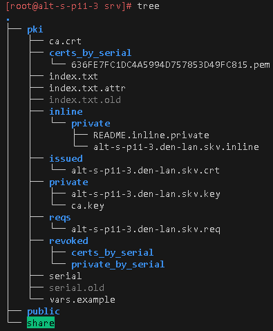
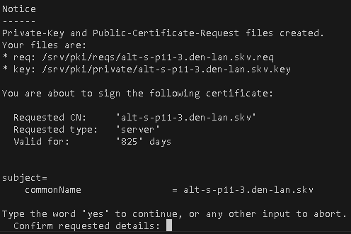
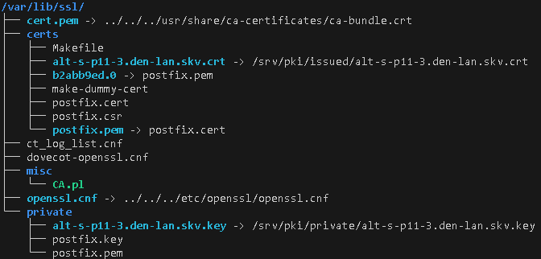
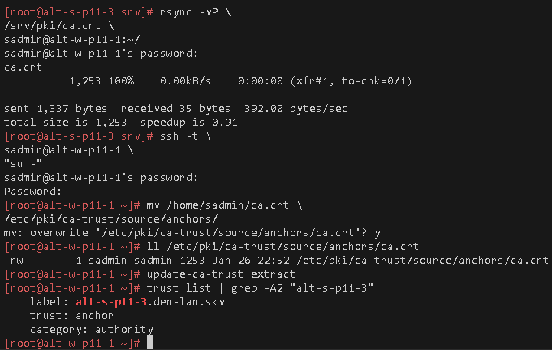
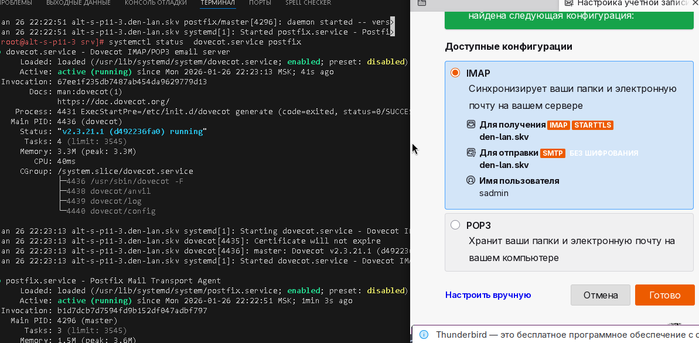
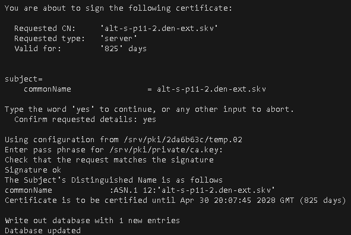
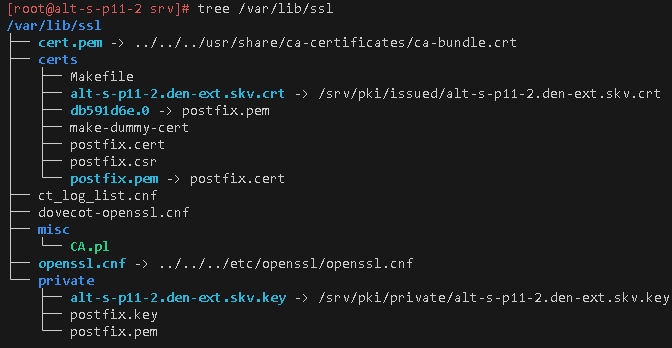
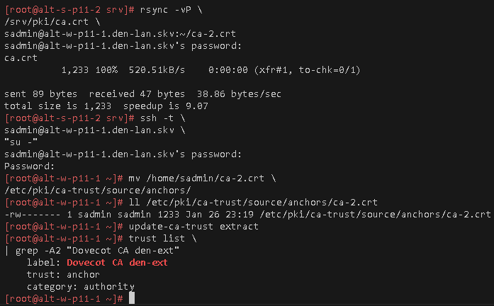
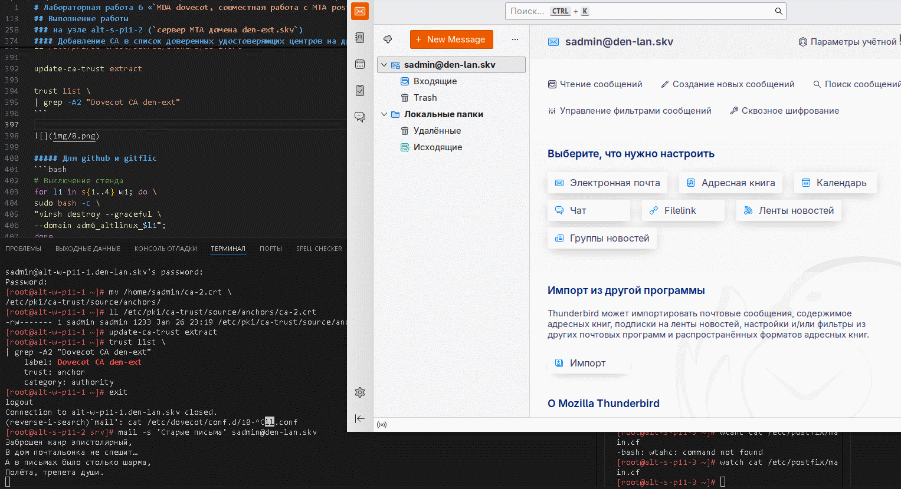
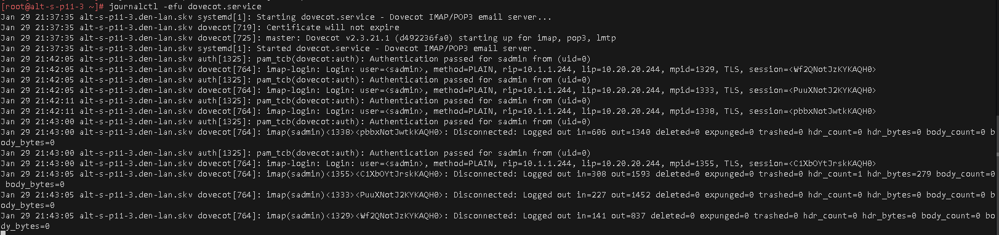

# Лабораторная работа 6 «`MDA dovecot, совместная работа с MTA postfix`» 
## Памятка входа
```bash
# Включаем агента в текущей оснастке
> ~/.ssh/known_hosts
eval $(ssh-agent) \
&& ssh-add  \
~/.ssh/id_alt-adm6_2026_host_ed25519

# вход на bastion-хост по ключу по ssh
ssh -t \
-i ~/.ssh/id_alt-adm6_2026_host_ed25519 \
-o StrictHostKeyChecking=accept-new \
sadmin@192.168.121.2 \
"su -"

# Памятка входа на хосты через alt-s-p11-1 по ключу по ssh
## хосты:
### 10.0.0.9 - alt-s-p11-2 - internet
### 10.0.0.8 - alt-s-p11-4 - internet
### 10.20.20.244 - alt-s-p11-3 - DMZ
### 10.1.1.244 - alt-w-p11-1.den-lan.skv - internal
ssh -t \
-i ~/.ssh/id_alt-adm6_2026_host_ed25519 \
-J sadmin@192.168.121.2 \
-o StrictHostKeyChecking=accept-new \
sadmin@ХОСТ \
"su -"

# скриптом поочередно на указанные хосты
for enter in 10.0.0.9 10.0.0.8 10.20.20.244 10.1.1.244; do
ssh -t \
-i ~/.ssh/id_alt-adm6_2026_host_ed25519 \
-J sadmin@192.168.121.2 \
-o StrictHostKeyChecking=accept-new \
sadmin@$enter \
"su -"
done
```


## Предварительно
### Запуск стенда
```bash
cd adm6/lab6

# Отображение списка snapshot машин стенда
for snap in s{1..4} w1; do \
sudo bash -c \
"virsh snapshot-list adm6_altlinux_$snap"; 
done

# создание snapshot ВМ перед дополнением к лабораторной работе 5
## бастион-хоста
sudo virsh snapshot-create-as \
--domain adm6_altlinux_s1 \
--name 4 \
--description \
"before_lab6+squid-proxy" \
--atomic

# Для сервера почты в домене den-ext.skv для сети s_INTERNET
sudo virsh snapshot-create-as \
--domain adm6_altlinux_s2 \
--name 4 \
--description \
"before_lab6_MTA-server_den-ext.skv" \
--atomic

# Для сервера почты в домене den-lan.skv для сети s_internal, s_dmz
sudo virsh snapshot-create-as \
--domain adm6_altlinux_s3 \
--name 4 \
--description \
"before_lab6_MTA_master-dns_den-lan.skv" \
--atomic

# Для мастера домена den-ext.skv для сети s_INTERNET
sudo virsh snapshot-create-as \
--domain adm6_altlinux_s4 \
--name 4 \
--description \
"before_lab6_master-dns_den-ext.skv" \
--atomic

# Включаем агента в текущей оснастке
> ~/.ssh/known_hosts
eval $(ssh-agent) \
&& ssh-add  \
~/.ssh/id_alt-adm6_2026_host_ed25519

# Поочередный запуск всех сетей libvirt со 2ого по списку
sudo virsh net-list --all \
| awk 'NR > 3 {print $1}' \
| xargs -I {} sudo virsh net-start {}

# запуск ВМ alt-s-p11-route
sudo virsh start \
--domain adm6_altlinux_s1

# Поочередный запуск для лабораторной работы ВМ:
## alt-s-p11-4 - internet
## alt-s-p11-2 - internet
## alt-s-p11-3 - dmz
## alt-w-p11-1 - internal
for l1 in w1 s{2..4}; do \
sudo bash -c \
"virsh start \
--domain adm6_altlinux_$l1"
done
```
## Выполнение работы
### на узле alt-s-p11-3 (`мастер зоны и сервер MTA домена den-lan.skv`)
#### Развертывание CA средствами Easyrsa
```bash
### 10.20.20.244 - alt-s-p11-3 - DMZ
ssh -t \
-i ~/.ssh/id_alt-adm6_2026_host_ed25519 \
-J sadmin@192.168.121.2 \
-o StrictHostKeyChecking=accept-new \
sadmin@10.20.20.244 \
"su -"

# Обновление кеша пакетов и установка easyrsa
apt-get update \
&& apt-get install -y \
easy-rsa \
tree
```
##### Генерация структуры каталогов PKI и генерация сертификата CA
```bash
# Генерация структуры каталогов PKI и генерация сертификата CA
pushd /srv \
&& easyrsa init-pki \
&& easyrsa build-ca
```
##### Генерация пар сертификатов\ключей для TLS Dovecot сертификатов
```bash
# сертификат\ключ
easyrsa build-server-full \
alt-s-p11-3.den-lan.skv \
nopass
```

 


#### Подготовка и Развертывание Dovecot
##### Подготовка формата хранения почты под Maildir
```bash
# отключение накопления почты из системных каталогов
sed -i 's/^mailbox_/# mailbox_/' \
/etc/postfix/main.cf

# включаем формат хранения почты в Maildir виде
echo 'home_mailbox = Maildir/' \
>> /etc/postfix/main.cf

# перезапуск службы
systemctl restart \
postfix.service

# Обновление кеша пакетов и установка Dovecot
apt-get update \
&& apt-get install -y \
dovecot \
postfix-dovecot

# отключение накопления почты из системных каталогов для dovecot
sed -i 's/^mail_location/# mail_location/' \
/etc/dovecot/conf.d/10-mail.conf 

# применяем настройку накопления почты в Maildir
sed -i 's|^#   mail_location = maild|mail_location = maild|' \
/etc/dovecot/conf.d/10-mail.conf 
```
##### настройка ssl сертификатов dovecot
```bash
# Указание софт-линком сгенерированного сертификата Easyrsa для dovecot
 ln -s \
 /srv/pki/issued/alt-s-p11-3.den-lan.skv.crt \
 /var/lib/ssl/certs/

# Указание софт-линком сгенерированного ключа к сертификату Easyrsa для dovecot
ln -s \
/srv/pki/private/alt-s-p11-3.den-lan.skv.key \
/var/lib/ssl/private/

# в конфигурации заменяем ssl_cert и ssl_key значения
sed -i 's|s/dovecot.pem$|s/alt-s-p11-3.den-lan.skv.crt|' \
/etc/dovecot/conf.d/10-ssl.conf

sed -i 's|e/dovecot.pem$|e/alt-s-p11-3.den-lan.skv.key|' \
/etc/dovecot/conf.d/10-ssl.conf
```



##### настройка аутентификации SASL
```bash
# включение smtp аутентификации на dovecot
sed -i '/# Postfix smtp-auth$/r /dev/stdin' \
/etc/dovecot/conf.d/10-master.conf <<'EOF'
  unix_listener /var/spool/postfix/private/auth {
    mode = 0666
  }
EOF

# Направляем MTA postfix на sasl-аутентификацию dovecot
cat >> /etc/postfix/main.cf <<'EOF'
smtpd_sasl_type = dovecot
smtpd_sasl_path = private/auth
smtpd_sasl_auth_enable = yes
EOF

# Первый запуск dovecot для инициализации
systemctl start \
dovecot.service \
&& systemctl stop \
dovecot.service

# запуск dovecot после первичной инициализации
systemctl enable --now \
dovecot.service

# перезапуск postfix
systemctl restart \
postfix.service
```
#### Добавление CA в список доверенных удостоверяющих центров на других хостах
```bash
# Перенос сертификата CA в домашний каталог пользователя sadmin другого хоста
rsync -vP \
/srv/pki/ca.crt \
sadmin@alt-w-p11-1:~/

# вход под суперпользователем другого хоста
ssh -t \
sadmin@alt-w-p11-1 \
"su -"

# Перенос сертификата удостоверяющего центра в соответствующий каталог
mv /home/sadmin/ca.crt \
/etc/pki/ca-trust/source/anchors/

ll /etc/pki/ca-trust/source/anchors/ca.crt

update-ca-trust extract

trust list | grep -A2 "alt-s-p11-3"
```


  


### на узле alt-s-p11-2 (`сервер MTA домена den-ext.skv`)
#### Развертывание CA средствами Easyrsa
```bash
### 10.0.0.9 - alt-s-p11-2 - s_internet
ssh -t \
-i ~/.ssh/id_alt-adm6_2026_host_ed25519 \
-J sadmin@192.168.121.2 \
-o StrictHostKeyChecking=accept-new \
sadmin@10.0.0.9 \
"su -"

# Обновление кеша пакетов и установка easyrsa
apt-get update \
&& apt-get install -y \
easy-rsa \
tree
```
##### Генерация структуры каталогов PKI и генерация сертификата CA
```bash
# Генерация структуры каталогов PKI и генерация сертификата CA
pushd /srv \
&& easyrsa init-pki \
&& easyrsa build-ca
```
##### Генерация пар сертификатов\ключей для TLS Dovecot сертификатов
```bash
# сертификат\ключ
easyrsa build-server-full \
alt-s-p11-2.den-ext.skv \
nopass
```



#### Подготовка и Развертывание Dovecot
##### Подготовка формата хранения почты под Maildir
```bash
# отключение накопления почты из системных каталогов
sed -i 's/^mailbox_/# mailbox_/' \
/etc/postfix/main.cf

# включаем формат хранения почты в Maildir виде
echo 'home_mailbox = Maildir/' \
>> /etc/postfix/main.cf

# перезапуск службы
systemctl restart \
postfix.service

# Обновление кеша пакетов и установка Dovecot
apt-get update \
&& apt-get install -y \
dovecot \
postfix-dovecot

# отключение накопления почты из системных каталогов для dovecot
sed -i 's/^mail_location/# mail_location/' \
/etc/dovecot/conf.d/10-mail.conf 

# применяем настройку накопления почты в Maildir
sed -i 's|^#   mail_location = maild|mail_location = maild|' \
/etc/dovecot/conf.d/10-mail.conf 
```
##### настройка ssl сертификатов dovecot
```bash
# Указание софт-линком сгенерированного сертификата Easyrsa для dovecot
ln -s \
/srv/pki/issued/alt-s-p11-2.den-ext.skv.crt \
/var/lib/ssl/certs/

# Указание софт-линком сгенерированного ключа к сертификату Easyrsa для dovecot
ln -s \
/srv/pki/private/alt-s-p11-2.den-ext.skv.key \
/var/lib/ssl/private/

# в конфигурации заменяем ssl_cert и ssl_key значения
sed -i 's|s/dovecot.pem$|s/alt-s-p11-2.den-ext.skv.crt|' \
/etc/dovecot/conf.d/10-ssl.conf

sed -i 's|e/dovecot.pem$|e/alt-s-p11-2.den-ext.skv.key|' \
/etc/dovecot/conf.d/10-ssl.conf
```



##### настройка аутентификации SASL
```bash
# включение smtp аутентификации на dovecot
sed -i '/# Postfix smtp-auth$/r /dev/stdin' \
/etc/dovecot/conf.d/10-master.conf <<'EOF'
  unix_listener /var/spool/postfix/private/auth {
    mode = 0666
  }
EOF

# Направляем MTA postfix на sasl-аутентификацию dovecot
cat >> /etc/postfix/main.cf <<'EOF'
smtpd_sasl_type = dovecot
smtpd_sasl_path = private/auth
smtpd_sasl_auth_enable = yes
EOF

# Первый запуск dovecot для инициализации
systemctl start \
dovecot.service \
&& systemctl stop \
dovecot.service

# запуск dovecot после первичной инициализации
systemctl enable --now \
dovecot.service

# перезапуск postfix
systemctl restart \
postfix.service
```
#### Добавление CA в список доверенных удостоверяющих центров на других хостах
```bash
# Перенос сертификата CA в домашний каталог пользователя sadmin другого хоста
rsync -vP \
/srv/pki/ca.crt \
sadmin@alt-w-p11-1.den-lan.skv:~/ca-2.crt

# вход под суперпользователем другого хоста
ssh -t \
sadmin@alt-w-p11-1.den-lan.skv \
"su -"

# Перенос сертификата удостоверяющего центра в соответствующий каталог
mv /home/sadmin/ca-2.crt \
/etc/pki/ca-trust/source/anchors/

ll /etc/pki/ca-trust/source/anchors/ca-2.crt

update-ca-trust extract

trust list \
| grep -A2 "Dovecot CA den-ext"
```

  

##### Для github и gitflic
```bash
# Выключение стенда
for l1 in s{1..4} w1; do \
sudo bash -c \
"virsh destroy --graceful \
--domain adm6_altlinux_$l1";
done

git log --oneline

git branch -v

git switch main

git status

git add . .. ../.. \
&& git status

git remote -v

git commit -am 'оформление для ADM6, lab6 mta_devecot_update2' \
&& git push \
--set-upstream \
altlinux \
main \
&& git push \
--set-upstream \
altlinux_gf \
main
```