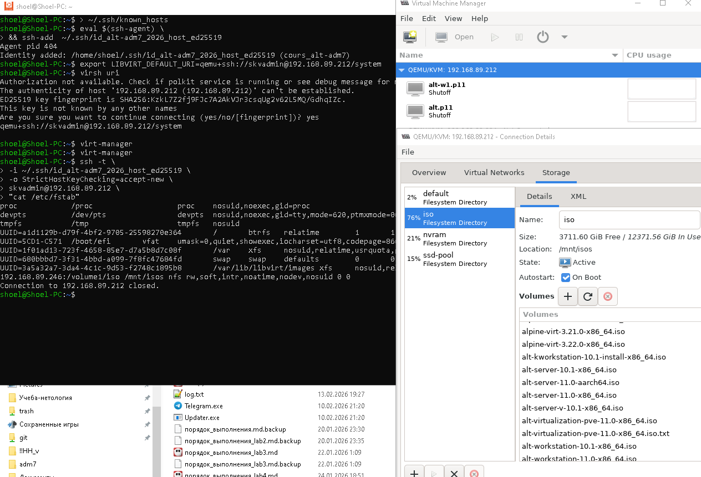

# Лабораторная работа 1 «`Установка и настройка базовой виртуализации`» 
## Памятка входа
```bash
# Включаем агента в текущей оснастке
> ~/.ssh/known_hosts
eval $(ssh-agent) \
&& ssh-add  ~/.ssh/id_alt-adm7_2026_host_ed25519

# вход на хост по ключу по ssh и вход под суперпользователя
ssh -t \
-i ~/.ssh/id_alt-adm7_2026_host_ed25519 \
-o StrictHostKeyChecking=accept-new \
skvadmin@192.168.89.212 \
"su -"
```
[>>>>>ПОДГОТОВКА ДЛЯ РАБОТЫ с модулем altvirt ADM7<<<<<](../README.md)


## Предварительно проверка примонтированного NFS
```bash
# Включаем агента в текущей оснастке
> ~/.ssh/known_hosts
eval $(ssh-agent) \
&& ssh-add  ~/.ssh/id_alt-adm7_2026_host_ed25519

ssh -t \
-i ~/.ssh/id_alt-adm7_2026_host_ed25519 \
-o StrictHostKeyChecking=accept-new \
skvadmin@192.168.89.212 \
"su -"

cat /etc/fstab
```
```bash
proc                                       /proc                   proc    nosuid,noexec,gid=proc                              0 0
devpts                                     /dev/pts                devpts  nosuid,noexec,gid=tty,mode=620,ptmxmode=0666        0 0
tmpfs                                      /tmp                    tmpfs   nosuid                                              0 0
UUID=a1d1129b-d79f-4bf2-9705-25598270e364  /                       btrfs   relatime                                            1 1
UUID=5CD1-C571                             /boot/efi               vfat    umask=0,quiet,showexec,iocharset=utf8,codepage=866  1 2
UUID=1f01ad13-723f-4658-85e7-d7a5b8d7c08f  /var                    xfs     nosuid,relatime,usrquota,grpquota                   1 2
UUID=680bbbd7-3f31-4bbd-a099-7f8fc47684fd  swap                    swap    defaults                                            0 0
UUID=3a5a32a7-3da4-4c1c-9d53-f2748c1895b8  /var/lib/libvirt/images xfs     nosuid,relatime,usrquota,grpquota                   1 3
192.168.89.246:/volume1/iso                /mnt/isos               nfs     rw,soft,intr,noatime,nodev,nosuid                   0 0
```

## Выполнение работы
```bash
exit
> ~/.ssh/known_hosts
eval $(ssh-agent) \
&& ssh-add  ~/.ssh/id_alt-adm7_2026_host_ed25519

export LIBVIRT_DEFAULT_URI=qemu+ssh://skvadmin@192.168.89.212/system

virsh uri

ssh \
-i ~/.ssh/id_alt-adm7_2026_host_ed25519 \
-o StrictHostKeyChecking=accept-new \
skvadmin@192.168.89.212

ssh -t \
-i ~/.ssh/id_alt-adm7_2026_host_ed25519 \
-o StrictHostKeyChecking=accept-new \
skvadmin@192.168.89.212 \
"cat /etc/fstab"
```



### Для github и gitflic
```bash
git log --oneline

git branch -v

git switch main

git status

git add . .. ../.. \
&& git status

git remote -v

git commit -am 'оформление для ADM7, lab1 base_kvm' \
&& git push \
--set-upstream \
altlinux \
main \
&& git push \
--set-upstream \
altlinux_gf \
main
```