# Лабораторная работа 2 «`Работа с гостевой виртуальной машиной`» 
## Памятка входа
```bash
# Включаем агента в текущей оснастке
> ~/.ssh/known_hosts
eval $(ssh-agent) \
&& ssh-add  ~/.ssh/id_alt-adm7_2026_host_ed25519

# вход на хост по ключу по ssh и вход под суперпользователя
ssh -t \
-i ~/.ssh/id_alt-adm7_2026_host_ed25519 \
-o StrictHostKeyChecking=accept-new \
skvadmin@192.168.89.212 \
"su -"
```
[>>>>>ПОДГОТОВКА ДЛЯ РАБОТЫ с модулем altvirt ADM7<<<<<](../README.md)

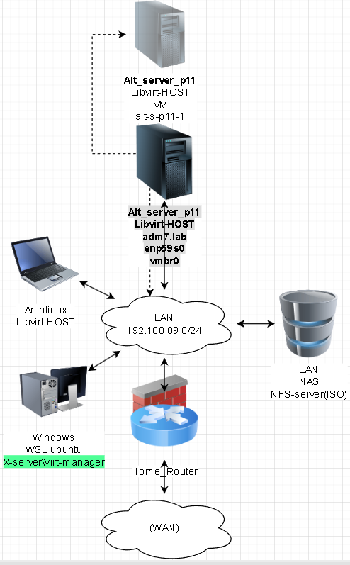

## Выполнение работы
### Задание 1. Работа с ВМ средствами virt-manager
```bash
# ЗАпуск агента ssh
> ~/.ssh/known_hosts
eval $(ssh-agent) \
&& ssh-add  ~/.ssh/id_alt-adm7_2026_host_ed25519

# Установка контекста удаленного доступа, как подключение по умолчанию, для подключения утилитой virsh
export LIBVIRT_DEFAULT_URI=qemu+ssh://skvadmin@192.168.89.212/system

# Подключение и вы вод рабочего окружения
virsh uri

# Запуск GUI оснастки
virt-manager

# Подключение на Физический хост
ssh \
-i ~/.ssh/id_alt-adm7_2026_host_ed25519 \
-o StrictHostKeyChecking=accept-new \
skvadmin@192.168.89.212

# Подключение на Виртуальный хост
ssh -t \
-i ~/.ssh/id_alt-adm7_2026_host_ed25519 \
-o StrictHostKeyChecking=accept-new \
skvadmin@192.168.89.212 \
"ip -br a"
```

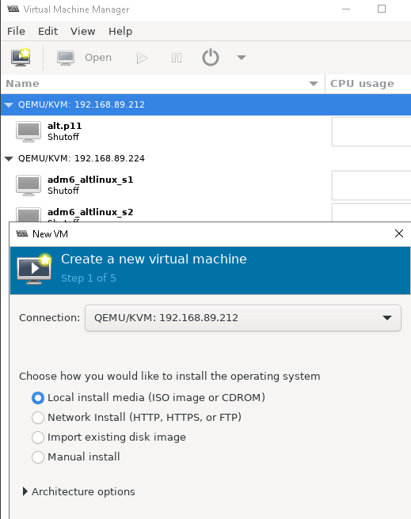
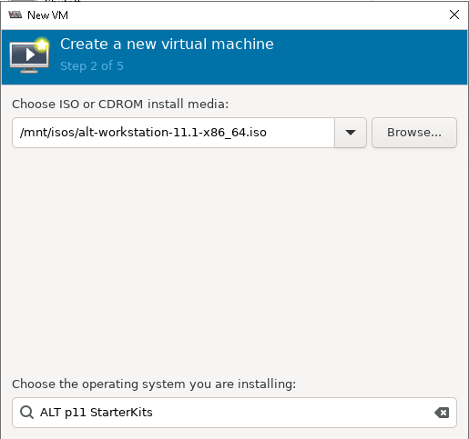
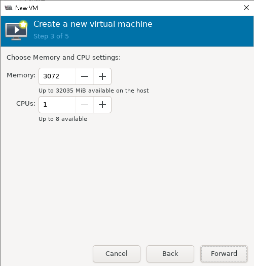
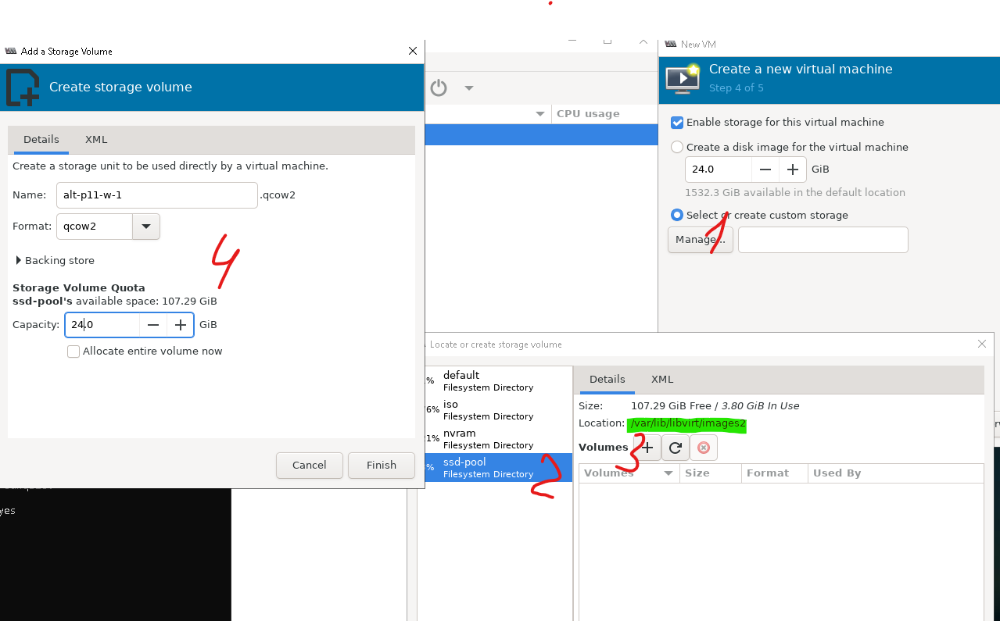
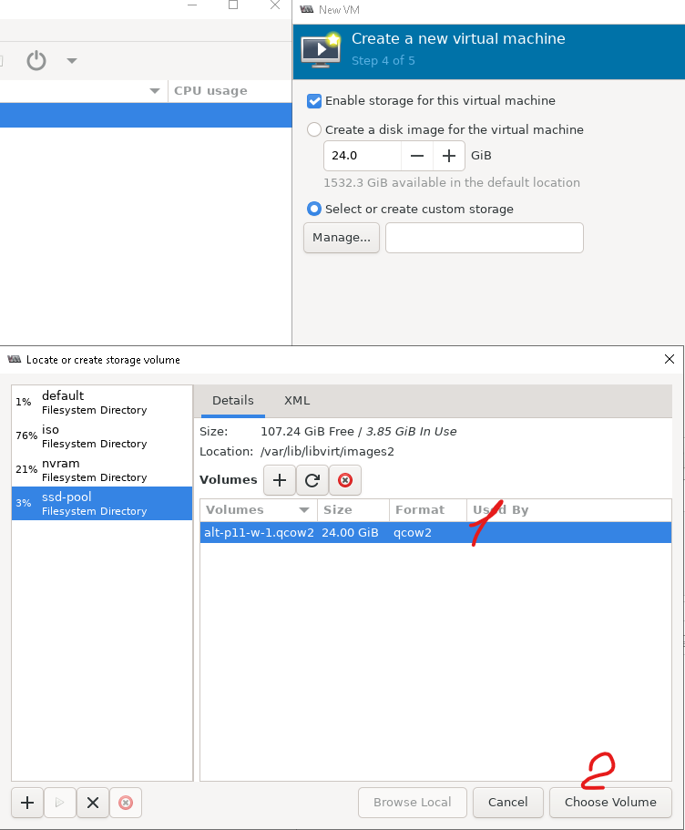
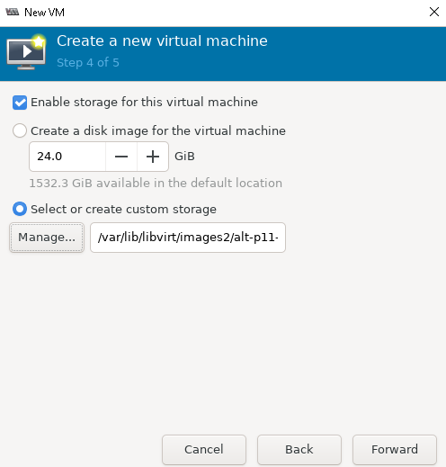
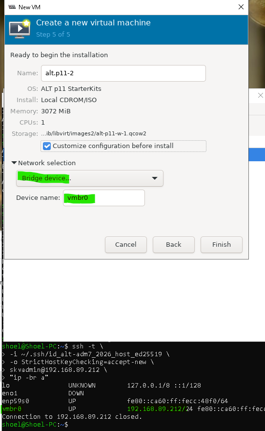
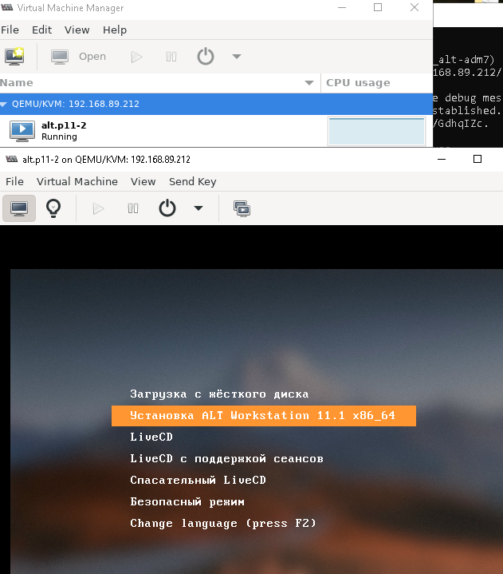

### Задание 2. Работа с ВМ средствами virt-manager
```bash
# Подключение на Физический хост под супер пользователем
ssh -t \
-i ~/.ssh/id_alt-adm7_2026_host_ed25519 \
-o StrictHostKeyChecking=accept-new \
skvadmin@192.168.89.212 \
"su -"

# Утилитой командной строки развертывание ВМ с параметрами и автоматическим созданием дисков созданием дисков
## 4 GB RAM изолированной памяти
## 2 Виртуальных ядра CPU
## Автоматическое создание дисков системы ВМ, если не существуют:
### в пуле "ssd-pool" размером 25 GB
### в пуле "default" размером в 100 GB
## Подключение существующего образа ISO установщика ОС
## Указание типа ОС ВМ "Linux"
## Указание типа дистрибутива "alt.p11"
## Указание возможности и протокола удаленного подключения "VNC"
## Указание, вместо стандартного NAT, создание интерфейса моста привязанного к интерфейсу "vmbr0" физического хоста
virt-install --name alt-p11-s1 \
--ram 4096 \
--vcpus=2 \
--disk pool=ssd-pool,size=24,bus=virtio,format=qcow2 \
--disk pool=default,size=100,bus=virtio,format=qcow2 \
--cdrom /mnt/isos/alt-server-11.0-x86_64.iso \
--os-type=linux \
--os-variant=alt.p11 \
--graphics vnc \
--network bridge=vmbr0
```

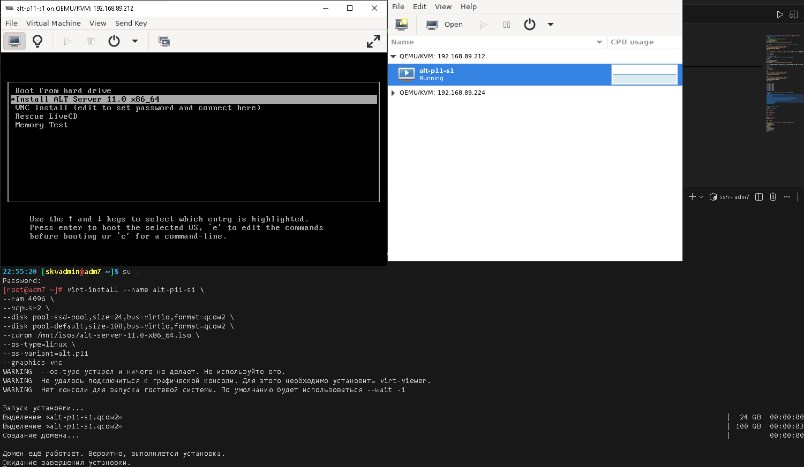
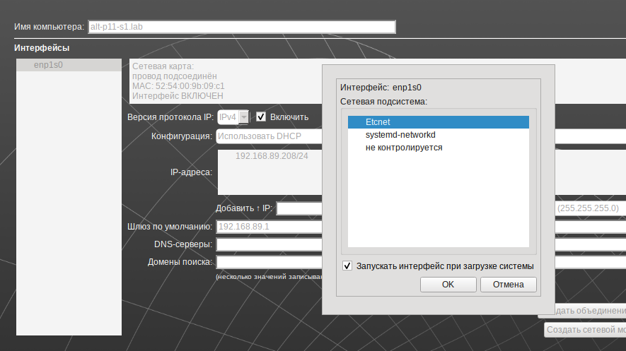
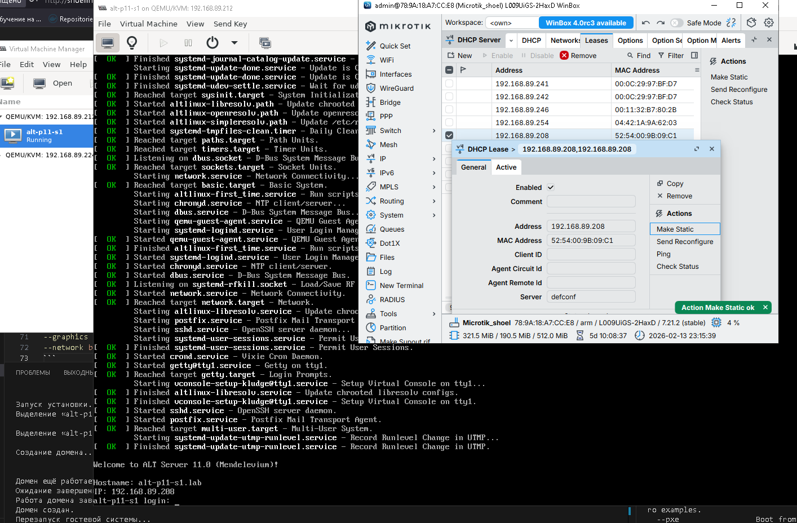

```bash
# Проброс публичного Ключа ssh на новый Виртуальны узел
ssh-copy-id \
-o StrictHostKeyChecking=accept-new \
-i ~/.ssh/id_alt-adm7_2026_host_ed25519.pub \
skvadmin@192.168.89.208

# Подключение на Виртуальный хост под супер пользователем
ssh -t \
-i ~/.ssh/id_alt-adm7_2026_host_ed25519 \
skvadmin@192.168.89.208 \
"su -"

# Обновление системы и установка пакетов для базовой виртуализации
apt-get update \
&& update-kernel -y \
&& apt-get dist-upgrade -y \
&& apt-get install -y  \
libvirt \
libvirt-daemon \
libvirt-kvm \
libvirt-qemu \
qemu-kvm \
libvirt-lxc \
virt-install \
libvirt-daemon-driver-storage-logical \
rpcbind \
bridge-utils \
nfs-clients \
nfs-server \
glusterfs11-server

# Добавляем пользовательской Учетной записи работать с libvirt в сессионном режиме
usermod -a -G \
vmusers \
skvadmin

# Запуск службы libvirt для удаленного подключения
systemctl enable --now \
libvirtd.service

systemctl poweroff
```

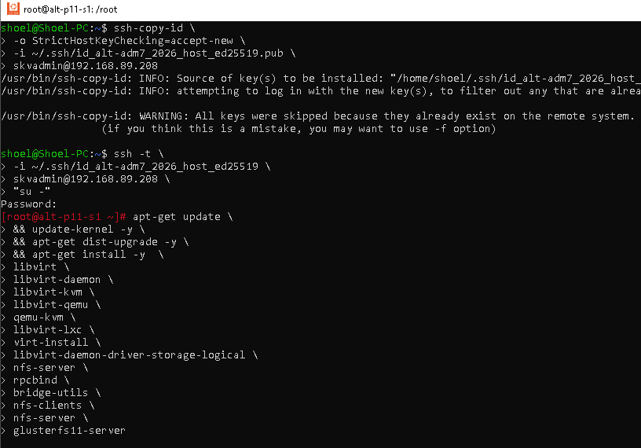
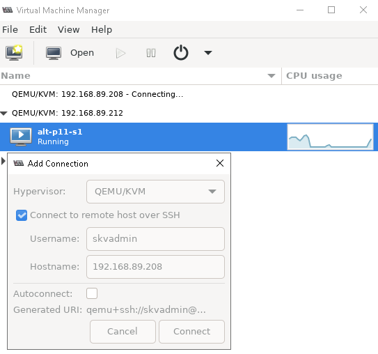
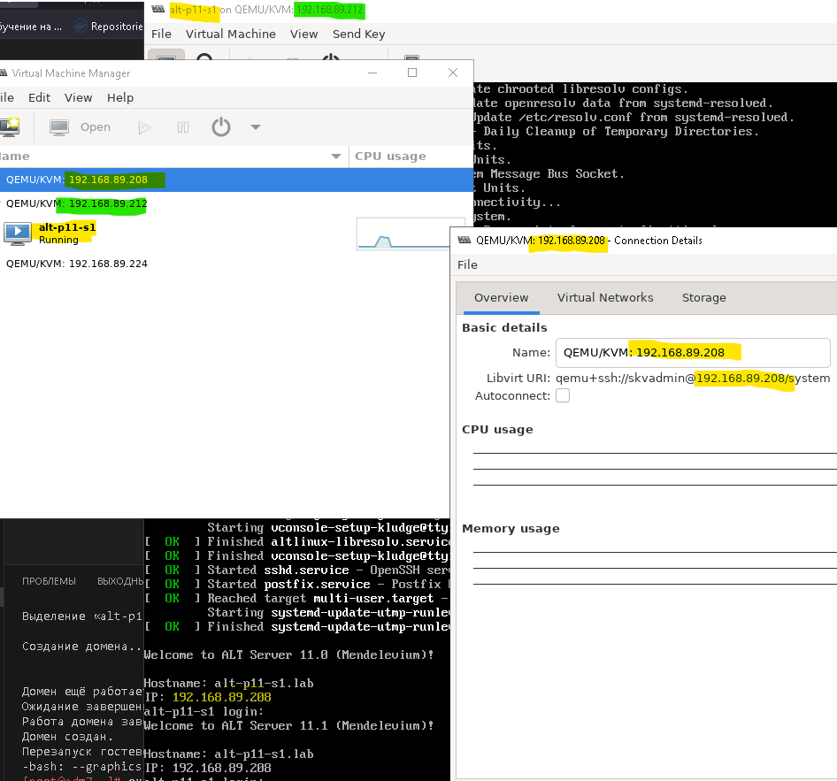

```bash
# Подключение на Физический хост под супер пользователем
ssh -t \
-i ~/.ssh/id_alt-adm7_2026_host_ed25519 \
skvadmin@192.168.89.212 \
su -

# Вывод списка всех виртуальных машин system контекста libvirt
virsh list --all

# Создание snapshot
### Основного сервера сети
virsh snapshot-create-as \
--domain alt-p11-s1 \
--name 1 \
--description "lab2" --atomic

# Скрипт перебора вм c именем alt и показать имеющиеся у них снимки
bash -c \
"for i in \$(virsh list --all \
| awk '/alt/ {print \$2}') ; do \
echo "\$i" \
&&virsh snapshot-list \
--domain \$i; done"
```

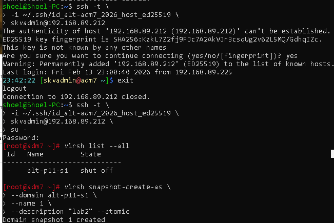
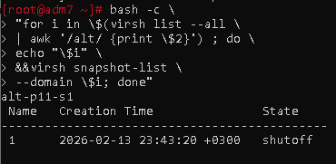
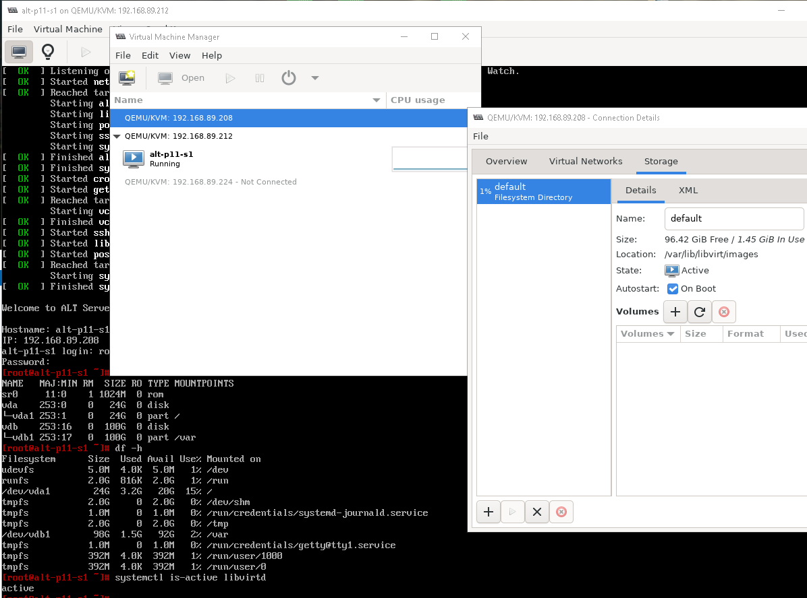
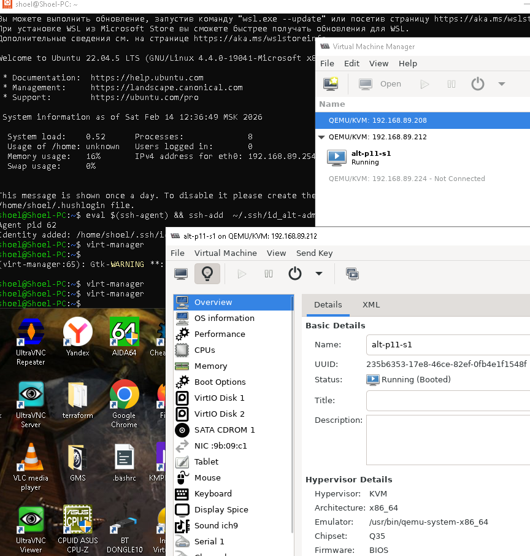
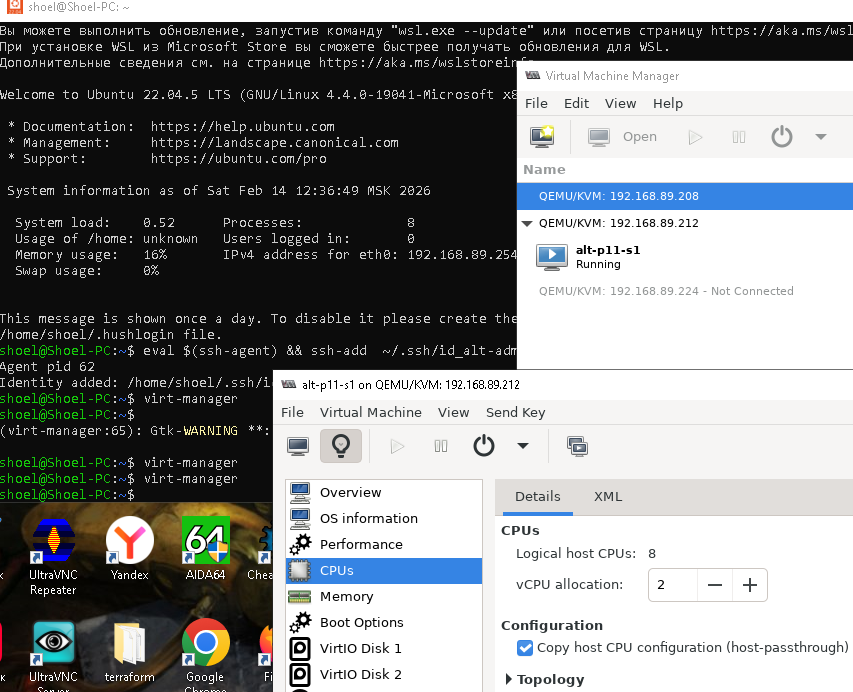
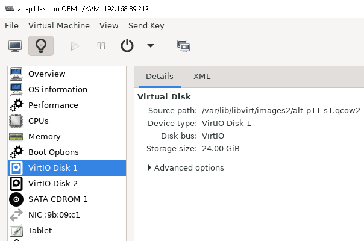
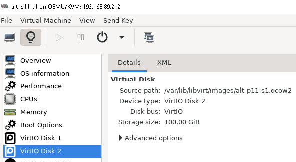
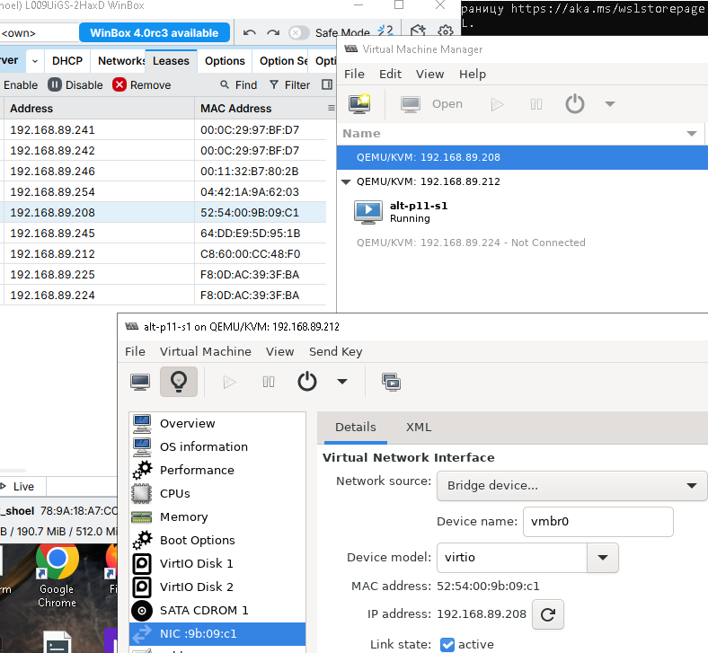


### Для github и gitflic
```bash
git log --oneline

git branch -v

git switch main

git status

git add . .. ../.. \
&& git status

git remote -v

git commit -am 'оформление для ADM7, lab2 base_kvm upd_2' \
&& git push \
--set-upstream \
altlinux \
main \
&& git push \
--set-upstream \
altlinux_gf \
main
```