# Лабораторная работа 3 «`Работа с сетевым хранилищем NFS`» 
## Памятка входа
```bash
# Включаем агента в текущей оснастке
> ~/.ssh/known_hosts
eval $(ssh-agent) \
&& ssh-add  ~/.ssh/id_alt-adm7_2026_host_ed25519

# вход на реальный хост по ключу по ssh и вход под суперпользователя
ssh -t \
-i ~/.ssh/id_alt-adm7_2026_host_ed25519 \
-o StrictHostKeyChecking=accept-new \
skvadmin@192.168.89.212 \
"su -"

# вход на на виртуальный KVM-хост по ключу по ssh и вход под суперпользователя
ssh -t \
-i ~/.ssh/id_alt-adm7_2026_host_ed25519 \
-o StrictHostKeyChecking=accept-new \
skvadmin@192.168.89.208 \
"su -"

# Вход под супер пользователем в контейнер lxc по ssh
ssh -i \
~/.ssh/id_alt-adm7_2026_host_ed25519 \
root@192.168.89.200
```
[>>>>>ПОДГОТОВКА ДЛЯ РАБОТЫ с модулем altvirt ADM7<<<<<](../README.md)

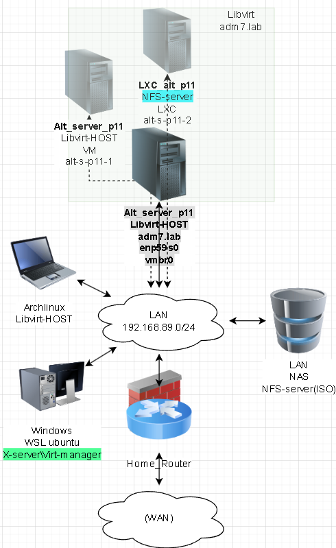

## Выполнение работы
### Настройка NFS-сервера
#### Запуск Виртуального хоста alt-p11-s1
```bash
# Запуск агента
> ~/.ssh/known_hosts
eval $(ssh-agent) \
&& ssh-add  ~/.ssh/id_alt-adm7_2026_host_ed25519

# Подключение на Физический хост под супер пользователем
ssh -t \
-i ~/.ssh/id_alt-adm7_2026_host_ed25519 \
-o StrictHostKeyChecking=accept-new \
skvadmin@192.168.89.212 \
"su -"

# Запуск Виртуального хоста
virsh start \
alt-p11-s1
```
### Создание lxc контейнера для libvirt
#### Скачивание файловой системы контейнера и распаковка
```bash
# Создание каталога для файловой системы контейнера
mkdir -p \
/var/lib/lxc/alt-p11-s1/rootfs

# Скачиваем и распаковываем rootfs один из
curl -o /tmp/alt-rootfs.tar.xz \
https://ftp.altlinux.org/pub/distributions/ALTLinux/images/p11/cloud/x86_64/alt-p11-rootfs-systemd-etcnet-x86_64.tar.xz

curl -o /tmp/alt-rootfs.tar.xz \
https://ftp.altlinux.org/pub/distributions/ALTLinux/images/p11/cloud/x86_64/alt-p11-rootfs-sysvinit-x86_64.tar.xz

tar -xJf \
/tmp/alt-rootfs.tar.xz \
-C /var/lib/lxc/alt-p11-s/rootfs

ll \
/var/lib/lxc/alt-p11-s/rootfs

# проброс ключа ssh на суперпользователя 
grep cours_alt-adm7 \
/home/skvadmin/.ssh/authorized_keys \
>>/var/lib/lxc/alt-p11-s/rootfs/root/.ssh/authorized_keys

# на всякий случай задать пароль для root "qwerty!2" в 
nano /var/lib/lxc/alt-p11-s/rootfs/etc/tcb/root/shadow
$6$jOJaaad3$213aac5XXw7XMVrtI8dPuwyJazAeMOoaq5QOvo.uf/7V70lA3PIsV7WAiM3d1SWPyDkPiVTvizRHta1P7ZyKs/
```
#### Создание пула на Физической Хостовой машине под nfs
```bash
# Список пулов физического хоста
virsh pool-list \
--all \
--details

# создание пула через pool-define-as с автосоданием каталога под NFS
virsh pool-define-as \
for_nfs \
dir - - - - \
"/var/lib/libvirt/images/for_nfs"

# Указание и построение пула как формат "dir"  
virsh pool-build \
for_nfs

# Включение пула для использования
virsh pool-start \
for_nfs

# авто-Включение пула для использования при перезапуске хоста
virsh pool-autostart \
for_nfs
```

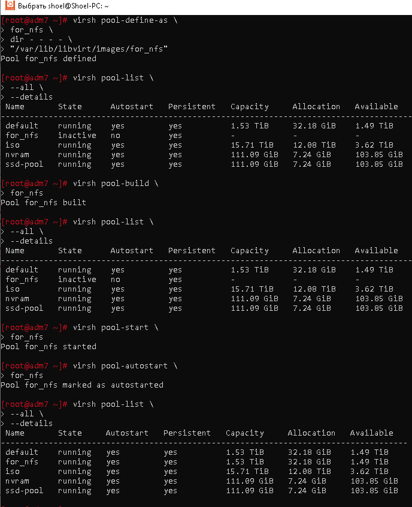

#### Создание конфига контейнера
```bash
cat > ~/lxc_alt-p11-s2.xml <<'EOF'
<domain type='lxc'>
  <name>lxc-alt-p11-s2</name>
  <memory unit='KiB'>4194304</memory>
  <vcpu>2</vcpu>
  <os>
    <type>exe</type>
    <init>/sbin/init</init>
  </os>
  <devices>
  <features>
    <capabilities policy='allow'>
    </capabilities>
  </features>
  <clock offset="timezone" timezone="Europe/Moscow" />
    <filesystem type='mount'>
      <source dir='/var/lib/lxc/alt-p11-s/rootfs'/>
      <target dir='/'/>
    </filesystem>
    <filesystem type='mount'>
      <source dir='/var/lib/libvirt/images/for_nfs'/>
      <target dir='/mnt/nfs-store'/>
    </filesystem>
    <interface type='bridge'>
      <source bridge='vmbr0'/>
      <ip address='192.168.89.200' family='ipv4' prefix='24'/>
      <route family='ipv4' address='0.0.0.0' gateway='192.168.89.1'/>
      <guest dev='eth0'/>
      <link state='up'/>
    </interface>
    <console type='pty'>
      <target type='lxc' port='0'/>
    </console>
    <tty/>
  </devices>
</domain>
EOF
```
#### регистрация и запуск контейнера lxc с системой инициализации systemV
```bash
# Удаление контейнера без удаления файлов
virsh -c lxc:/// \
undefine \
lxc-alt-p11-s2 2>/dev/null \
|| true

# Создание контейнера через созданный xml конфиг
virsh -c lxc:/// \
define \
~/lxc_alt-p11-s2.xml

# Запуск контейнера
virsh -c lxc:/// \
start lxc-alt-p11-s2

# Подключение к консоли "CTRL+ ]" отцепится
virsh -c lxc:/// \
console \
lxc-alt-p11-s2
```


#### Подготовка контейнера для работы в режиме сервера
```bash
# Вход под супер пользователем в контейнер lxc по ssh
ssh -i \
~/.ssh/id_alt-adm7_2026_host_ed25519 \
root@192.168.89.200

# Установка пакетов для nfs сервера и обновление пакетов контейнера
apt-get update \
&& apt-get dist-upgrade -y \
&& apt-get install -y \
rpcbind \
nfs-clients \
nfs-server

# Установка в режим сервера
control rpcbind server

# Запуск служб для сервера в системе инициализированной systemV
service rpcbind start
service nfs start

# выставляем в автозагрузку службы в системе инициализированной systemV
chkconfig rpcbind on
chkconfig idmapd on
chkconfig nfs on

# Проверка служб в системе инициализированной systemV
service rpcbind status
service nfslock status
service nfs status

# Прослушивание портов
rpcinfo -p

# Пробрасывам экспортируемый каталог
echo '/mnt/nfs-store 192.168.89.0/24(rw,no_root_squash,sync,no_subtree_check,nohide)' \
>> /etc/exports

# проверка правильности и экспорт каталогов
exportfs -vra

# выход из контейнера
exit
```


### Для github и gitflic
```bash
git log --oneline

git branch -v

git switch main

git status

git add . .. ../.. \
&& git status

git remote -v

git commit -am 'lab3 nfs_kvm lxc-run_2' \
&& git push \
--set-upstream \
altlinux \
main \
&& git push \
--set-upstream \
altlinux_gf \
main
```
### Подключение клиентов к NFS серверу
#### План инфраструктуры

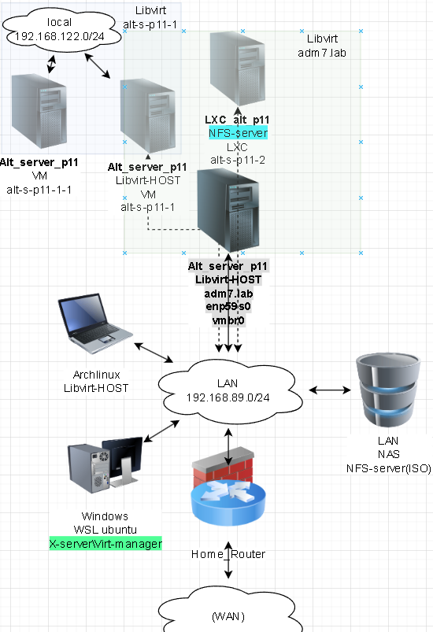

#### Установка и запуск служб
```bash
# вход на виртуальный KVM-хост по ключу по ssh и вход под суперпользователя
ssh -t \
-i ~/.ssh/id_alt-adm7_2026_host_ed25519 \
-o StrictHostKeyChecking=accept-new \
skvadmin@192.168.89.208 \
"su -"

# Обновление системы и установка необходимых пакетов для клиента nfs
apt-get update \
&& update-kernel -y \
&& apt-get dist-upgrade -y \
&& apt-get install -y  \
nfs-clients \
nfs-utils

# Запуск связанных служб клиента nfs 
systemctl enable --now \
nfs-client.target

# Проверка доступности NFS ресурса с lxc контейнера
showmount -e \
192.168.89.200
```
#### Монтирование ресурсов NFS
##### Монтирование хранилища для переноса виртуальных машин
```bash
# создание каталога точки монтирования
mkdir /var/lib/libvirt/images_nfs

# ручное Монтирование ресурса для проверки работы
mount -t nfs \
192.168.89.200:/mnt/nfs-store \
/var/lib/libvirt/images_nfs

# Просмотр примонтированного раздела
findmnt \
| grep -A2 images_nfs

# тестовое Создание и удаление файлов в примонтированном разделе
touch /var/lib/libvirt/images_nfs/{1..9}

rm !$

# Просмотр содержимого
ll /var/lib/libvirt/images_nfs/

# Добавление в автозагрузку системы
echo '192.168.89.200:/mnt/nfs-store /var/lib/libvirt/images_nfs nfs rw,hard,intr,relatime,_netdev 0 0' \
>>/etc/fstab

# создание конфига подключения пула как файловую систему
cat > ~/nfs_pool.xml <<'EOF'
<pool type="dir">
  <name>nfs-pool</name>
  <target>
    <path>/var/lib/libvirt/images_nfs</path>
  </target>
</pool>
EOF

# Определение пула из конфигурационного файла
virsh pool-define \
~/nfs_pool.xml

# Подготовка и Построение пула
virsh pool-build \
nfs-pool

# Запуск пула в работу libvirt
virsh pool-start \
nfs-pool

# Автозапуск пула при перезапуске системы
virsh pool-autostart \
nfs-pool
```
##### Монтирование хранилища для ISO образов для установки
```bash
#Поиск ресурсов для монтирования образов
showmount -e \
192.168.89.246

# создание каталога точки монтирования
mkdir /var/lib/libvirt/images_iso

# ручное Монтирование ресурса для проверки работы
mount -t nfs \
192.168.89.246:/volume1/iso \
/var/lib/libvirt/images_iso

# Просмотр примонтированного раздела
findmnt \
| grep -A2 images_iso

# Просмотр содержимого
ll /var/lib/libvirt/images_iso/

# Добавление в автозагрузку системы
echo '192.168.89.246:/volume1/iso /var/lib/libvirt/images_iso nfs ro,soft,fg,intr,noatime,_netdev 0 0' \
>>/etc/fstab

# создание конфига подключения пула как файловую систему
cat > ~/iso_pool.xml <<'EOF'
<pool type="dir">
  <name>iso-pool</name>
  <target>
    <path>/var/lib/libvirt/images_iso</path>
  </target>
</pool>
EOF

# Определение пула из конфигурационного файла
virsh pool-define \
~/iso_pool.xml

# Подготовка и Построение пула
virsh pool-build \
iso-pool

# Запуск пула в работу libvirt
virsh pool-start \
iso-pool

# Автозапуск пула при перезапуске системы
virsh pool-autostart \
iso-pool

virsh pool-list \
--all \
--details
```

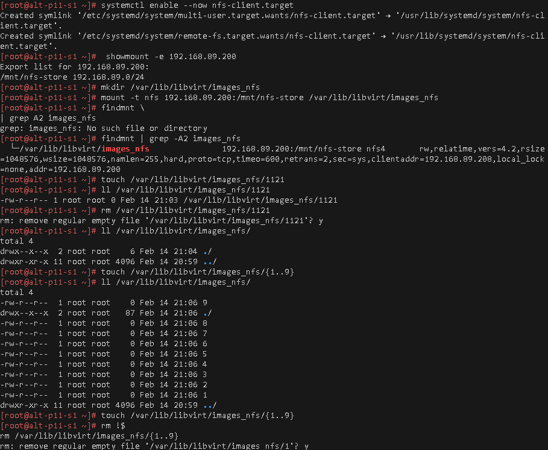
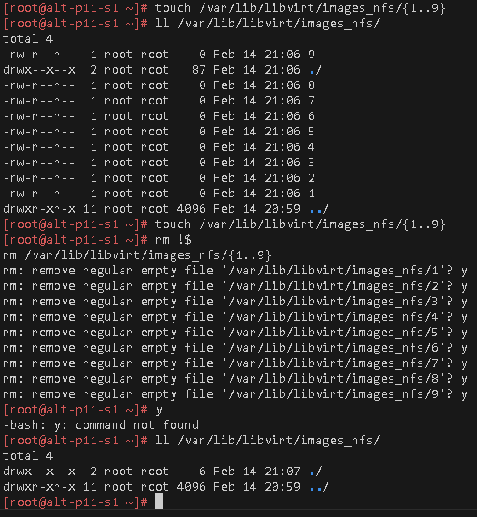
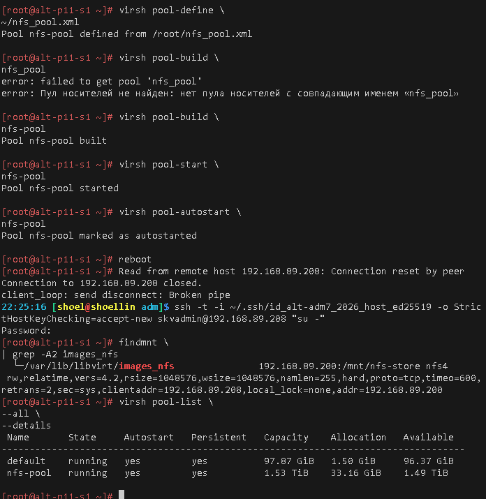

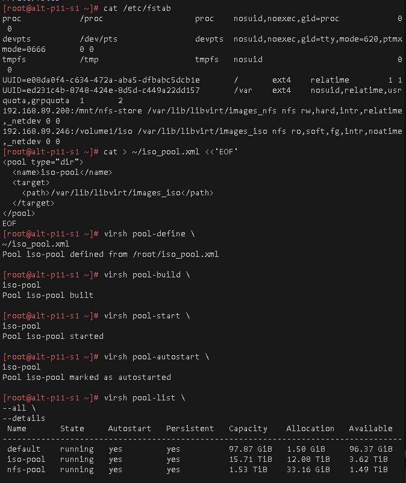

#### Создание ВМ для переноса на виртуальном Libvirt-хосте alt-p11-s1
```bash
# вход на на виртуальный KVM-хост по ключу по ssh и вход под суперпользователя
ssh -t \
-i ~/.ssh/id_alt-adm7_2026_host_ed25519 \
-o StrictHostKeyChecking=accept-new \
skvadmin@192.168.89.208 \
"su -"

# Отображение содержимого пула
virsh vol-list iso-pool \
| grep alt-server-

# Создание ВМ сервера на виртуальном 
virt-install --name alt-p11-s1-1 \
--ram 3072 \
--vcpus=1 \
--disk pool=default,size=30,bus=virtio,format=qcow2 \
--cdrom /var/lib/libvirt/images_iso/alt-server-11.0-x86_64.iso \
--os-type=linux \
--os-variant=alt.p11 \
--graphics vnc
```

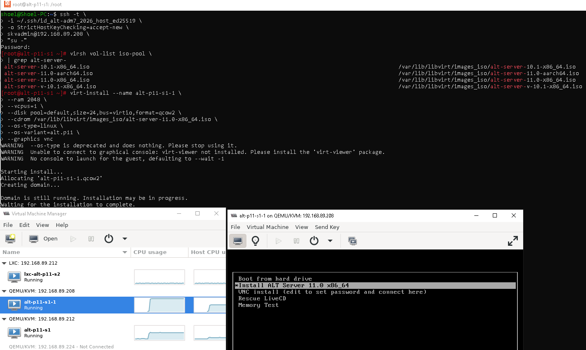
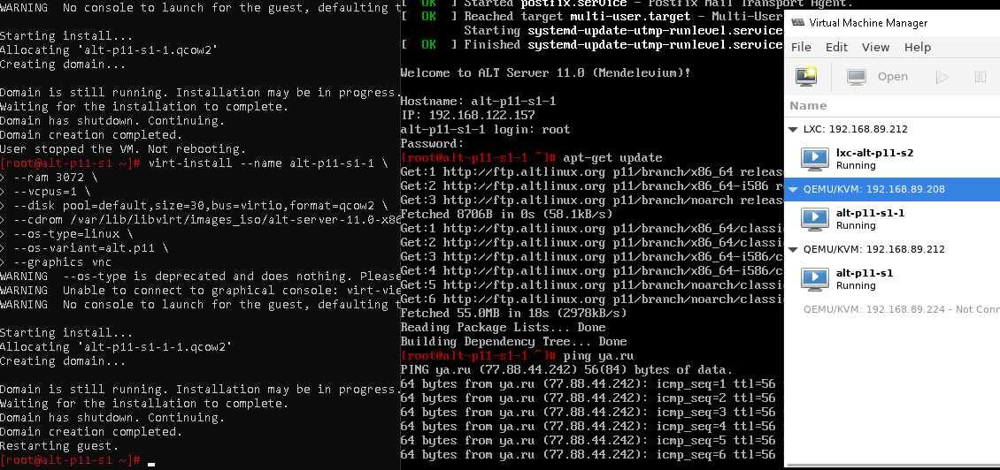

### Миграция в новый каталог
```bash
#  Расположение текущего диска на Виртуальной хостовой машине
virsh domblklist \
alt-p11-s1-1

# Выясняем какой размер был выделен ВМ на Виртуальной хостовой машине
virsh vol-list \
--pool default \
--details \
| grep alt-p11-s1-1

# Занимаемый размер созданной ВМ диска на Виртуальной хостовой машине
du -h \
/var/lib/libvirt/images/alt-p11-s1-1-1.qcow2

# Запуск живого копирования в новый пул nfs-pool диска система ВМ
virsh blockcopy \
alt-p11-s1-1 vda \
/var/lib/libvirt/images_nfs/alt-p11-s1-1-1.qcow2 \
--wait \
--verbose \
--transient-job \
--pivot

#  Расположение текущего диска на Виртуальной хостовой машине
virsh domblklist \
alt-p11-s1-1

# Часть конфига текущего расположения диска
virsh dumpxml \
alt-p11-s1-1 \
| grep -A5 "<disk"

# Удаление старого расположения
rm /var/lib/libvirt/images/alt-p11-s1-1-1.qcow2
```
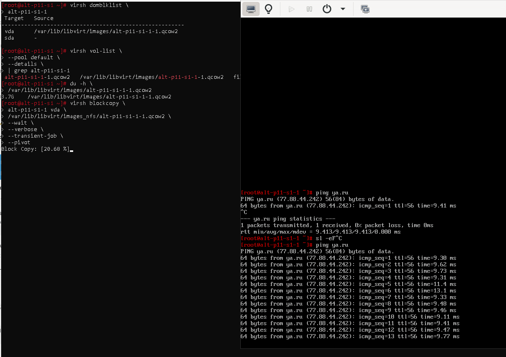
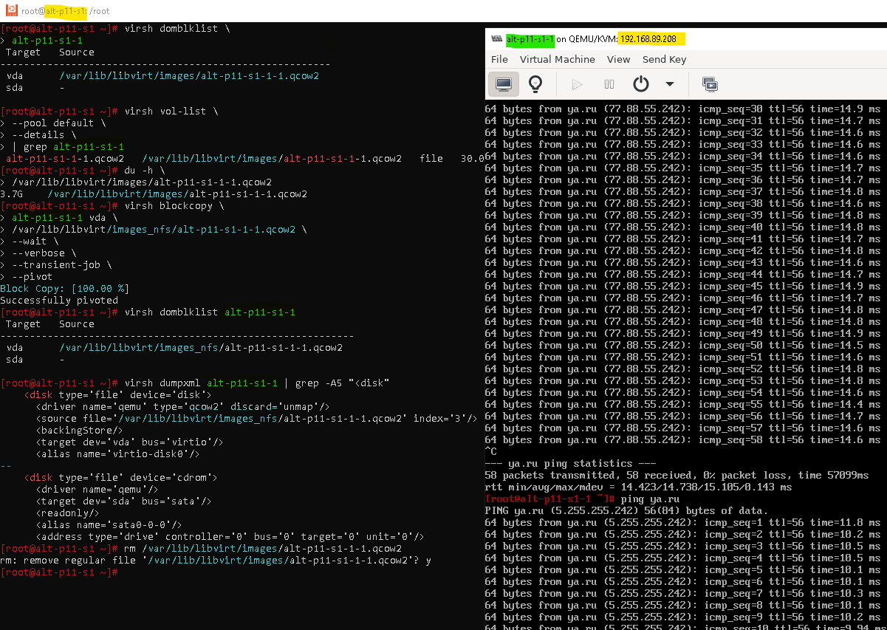

### Для github и gitflic
```bash
git log --oneline

git branch -v

git switch main

git status

git add . .. ../.. \
&& git status

git remote -v

git commit -am 'lab3 nfs upd_1' \
&& git push \
--set-upstream \
altlinux \
main \
&& git push \
--set-upstream \
altlinux_gf \
main
```