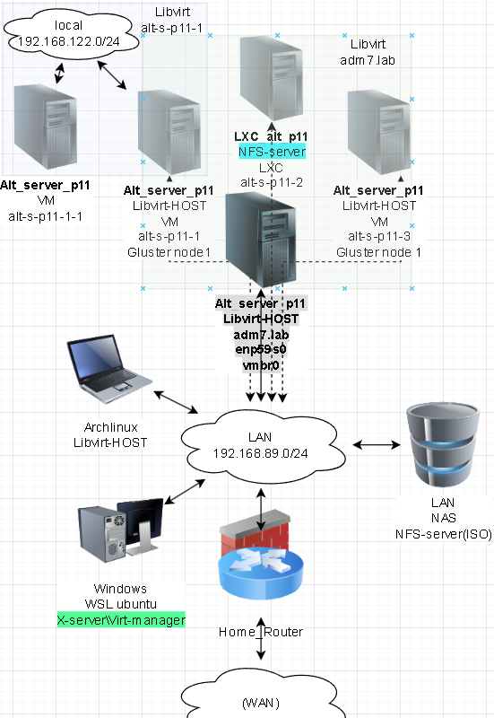
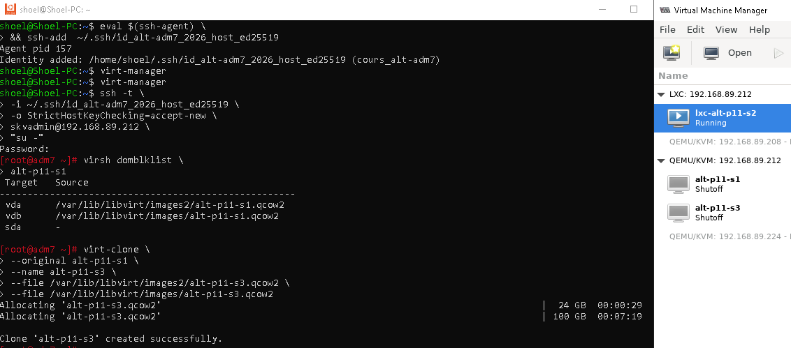
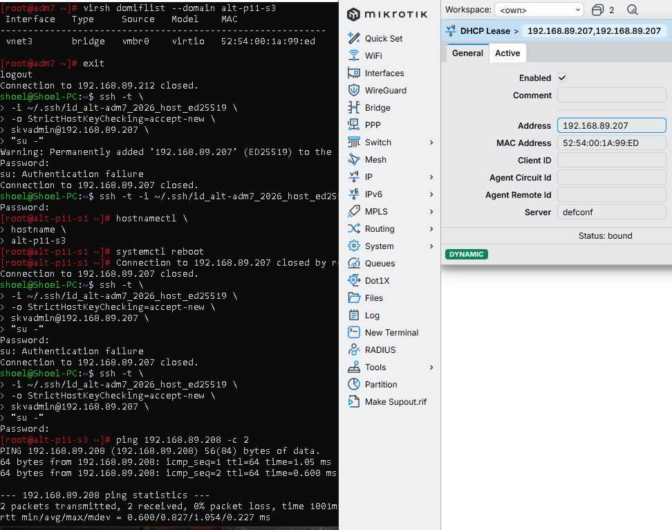
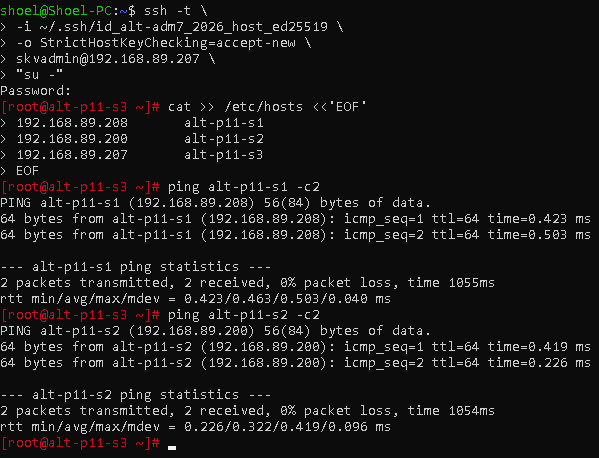
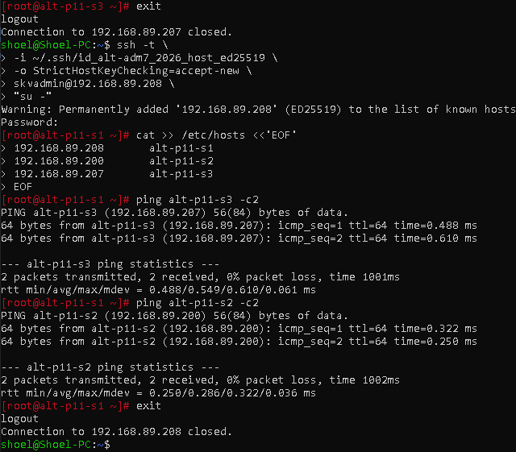
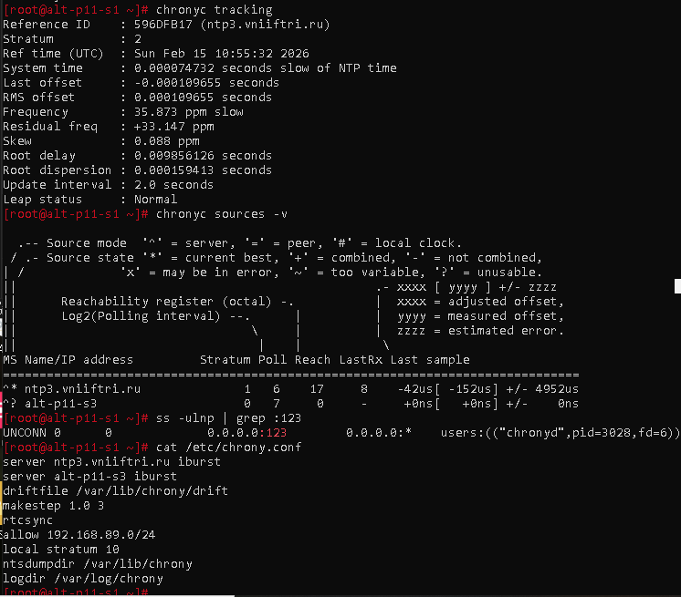
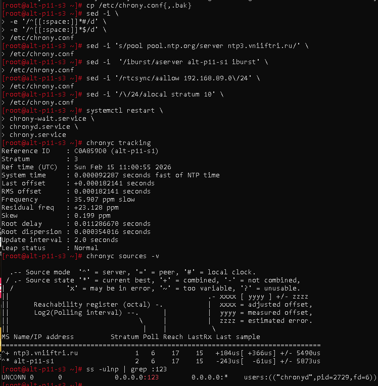
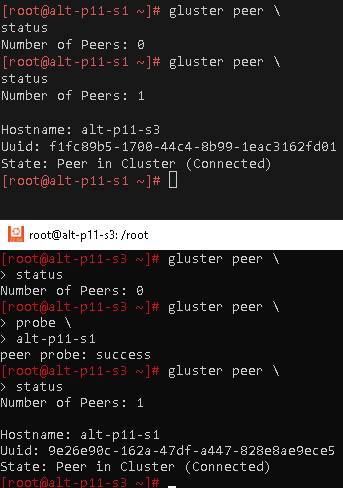
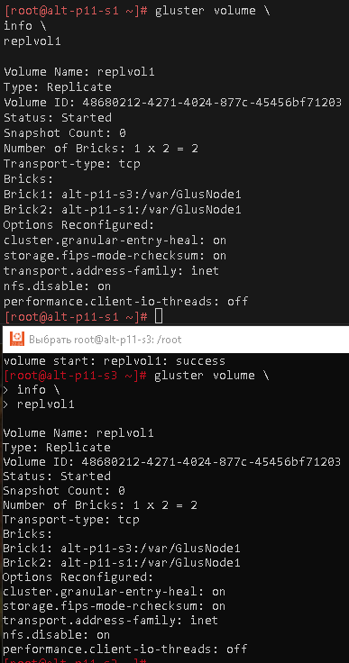

# Лабораторная работа 4 «`Развертывание распределенного хранилища GlusterFS`» 
## Памятка входа
```bash
# Включаем агента в текущей оснастке
> ~/.ssh/known_hosts
eval $(ssh-agent) \
&& ssh-add  ~/.ssh/id_alt-adm7_2026_host_ed25519

# вход на реальный хост по ключу по ssh и вход под суперпользователя
ssh -t \
-i ~/.ssh/id_alt-adm7_2026_host_ed25519 \
-o StrictHostKeyChecking=accept-new \
skvadmin@192.168.89.212 \
"su -"

# вход на виртуальный KVM-хост по ключу по ssh и вход под суперпользователя
ssh -t \
-i ~/.ssh/id_alt-adm7_2026_host_ed25519 \
-o StrictHostKeyChecking=accept-new \
skvadmin@192.168.89.208 \
"su -"

# вход на виртуальный KVM-хост по ключу по ssh и вход под суперпользователя
ssh -t \
-i ~/.ssh/id_alt-adm7_2026_host_ed25519 \
-o StrictHostKeyChecking=accept-new \
skvadmin@192.168.89.207 \
"su -"

# Вход под супер пользователем в контейнер lxc по ssh
ssh -i \
~/.ssh/id_alt-adm7_2026_host_ed25519 \
root@192.168.89.200
```
[>>>>>ПОДГОТОВКА ДЛЯ РАБОТЫ с модулем altvirt ADM7<<<<<](../README.md)



## Выполнение работы
### Задание 1. Клонирование ВМ Альт Сервер
```bash
# Запуск агента
> ~/.ssh/known_hosts
eval $(ssh-agent) \
&& ssh-add  ~/.ssh/id_alt-adm7_2026_host_ed25519

# Подключение на Физический хост под супер пользователем
ssh -t \
-i ~/.ssh/id_alt-adm7_2026_host_ed25519 \
-o StrictHostKeyChecking=accept-new \
skvadmin@192.168.89.212 \
"su -"

#  Расположение и порядок текущих дисков ВМ на Физической хостовой машине
virsh domblklist \
alt-p11-s1

# Клонирование ВМ, порядок указания соответствующих дисков определены в том же порядке, в котором были конфигурированы у оригинала
virt-clone \
--original alt-p11-s1 \
--name alt-p11-s3 \
--file /var/lib/libvirt/images2/alt-p11-s3.qcow2 \
--file /var/lib/libvirt/images/alt-p11-s3.qcow2

# запуск склонированной машины
virsh start \
--domain \
alt-p11-s3

# Вывод об интерфейсе склонированного хоста
virsh domiflist \
--domain \
alt-p11-s3

# Выход из Физической хостовой машины
exit

# вход на склонированный виртуальный KVM-хост по ключу по ssh и вход под суперпользователя
ssh -t \
-i ~/.ssh/id_alt-adm7_2026_host_ed25519 \
-o StrictHostKeyChecking=accept-new \
skvadmin@192.168.89.207 \
"su -"

# Смена имени хоста
hostnamectl \
hostname \
alt-p11-s3

# Перезагрузка
systemctl reboot
```




### Разрешение имен между хостами
#### на узле alt-p11-s3
```bash
# вход на склонированный виртуальный KVM-хост по ключу по ssh и вход под суперпользователя
ssh -t \
-i ~/.ssh/id_alt-adm7_2026_host_ed25519 \
-o StrictHostKeyChecking=accept-new \
skvadmin@192.168.89.207 \
"su -"

# Добавление в файл разрешение имен
cat >> /etc/hosts <<'EOF'
192.168.89.208       alt-p11-s1
192.168.89.200       alt-p11-s2
192.168.89.207       alt-p11-s3
EOF
```


#### на узле alt-p11-s1
```bash
# вход на виртуальный KVM-хост по ключу по ssh и вход под суперпользователя
ssh -t \
-i ~/.ssh/id_alt-adm7_2026_host_ed25519 \
-o StrictHostKeyChecking=accept-new \
skvadmin@192.168.89.208 \
"su -"

# Добавление в файл разрешение имен
cat >> /etc/hosts <<'EOF'
192.168.89.208       alt-p11-s1
192.168.89.200       alt-p11-s2
192.168.89.207       alt-p11-s3
EOF
```


### Задание 2. Развертывание GlusterFS
#### Подготовка и Установка GlusterFS на узле alt-p11-s1
##### Установка пакетов и запуск GlusterFS на узле alt-p11-s1
```bash
# вход на виртуальный KVM-хост по ключу по ssh и вход под суперпользователя
ssh -t \
-i ~/.ssh/id_alt-adm7_2026_host_ed25519 \
-o StrictHostKeyChecking=accept-new \
skvadmin@192.168.89.208 \
"su -"

# Создание каталога для использования в GlusterFS
mkdir /var/GlusNode1

apt-get update \
&& update-kernel -y \
&& apt-get dist-upgrade -y \
&& apt-get install -y  \
libvirt-daemon-driver-storage \
libvirt-daemon-driver-storage-core \
libvirt-daemon-driver-storage-gluster \
glusterfs11-server \
chrony

# Запуск Службы времени
systemctl enable --now \
glusterd.service
```
##### Настройка сервера времени узле alt-p11-s1
```bash
# Бэкап конфигурации
cp /etc/chrony.conf{,.bak}

# чистка конфига от комментариев
sed -i \
-e '/^[[:space:]]*#/d' \
-e '/^[[:space:]]*$/d' \
/etc/chrony.conf

# Перенастраиваем основной сервер на Московские серверы ВНИИФТРИ ntp3.vniiftri.ru
sed -i 's/pool pool.ntp.org/server ntp3.vniiftri.ru/' \
/etc/chrony.conf

# Добавляем как дополнительный сервер участника GlusterFS alt-p11-s3
sed -i  '/iburst/aserver alt-p11-s3 iburst' \
/etc/chrony.conf

# Указание что хост выступает в роли сервера времени для сети 192.168.89.0/24
sed -i '/rtcsync/aallow 192.168.89.0\/24' \
/etc/chrony.conf

# Указываем возможность отвечать клиентам, если к внешнему NTP серверу нет доступа
sed -i '/\/24/alocal stratum 10' \
/etc/chrony.conf

# Перезапуск служб NTP
systemctl restart \
chrony-wait.service \
chronyd.service \
chrony.service

# Проверка NTP с новым сервером
chronyc tracking
chronyc sources -v

# Проверка открытого порта для клиентов
ss -ulnp | grep :123
```
```
server ntp3.vniiftri.ru iburst
server alt-p11-s3 iburst
driftfile /var/lib/chrony/drift
makestep 1.0 3
rtcsync
allow 192.168.89.0/24
local stratum 10
ntsdumpdir /var/lib/chrony
logdir /var/log/chrony
```


#### Подготовка и Установка GlusterFS на узле alt-p11-s3
##### Установка пакетов и запуск GlusterFS на узле alt-p11-s3
```bash
# вход на виртуальный KVM-хост по ключу по ssh и вход под суперпользователя
ssh -t \
-i ~/.ssh/id_alt-adm7_2026_host_ed25519 \
-o StrictHostKeyChecking=accept-new \
skvadmin@192.168.89.207 \
"su -"

# Создание каталога для использования в GlusterFS
mkdir /var/GlusNode1

apt-get update \
&& update-kernel -y \
&& apt-get dist-upgrade -y \
&& apt-get install -y  \
libvirt-daemon-driver-storage \
libvirt-daemon-driver-storage-core \
libvirt-daemon-driver-storage-gluster \
glusterfs11-server \
chrony

# Запуск Службы времени
systemctl enable --now \
glusterd.service
```
##### Настройка сервера времени узле alt-p11-s3
```bash
# Бэкап конфигурации
cp /etc/chrony.conf{,.bak}

# чистка конфига от комментариев
sed -i \
-e '/^[[:space:]]*#/d' \
-e '/^[[:space:]]*$/d' \
/etc/chrony.conf

# Перенастраиваем основной сервер на Московские серверы ВНИИФТРИ ntp3.vniiftri.ru
sed -i 's/pool pool.ntp.org/server ntp3.vniiftri.ru/' \
/etc/chrony.conf

# Добавляем как дополнительный сервер участника GlusterFS alt-p11-s1
sed -i  '/iburst/aserver alt-p11-s1 iburst' \
/etc/chrony.conf

# Указание что хост выступает в роли сервера времени для сети 192.168.89.0/24
sed -i '/rtcsync/aallow 192.168.89.0\/24' \
/etc/chrony.conf

# Указываем возможность отвечать клиентам, если к внешнему NTP серверу нет доступа
sed -i '/\/24/alocal stratum 10' \
/etc/chrony.conf

# Перезапуск служб NTP
systemctl restart \
chrony-wait.service \
chronyd.service \
chrony.service

# Проверка NTP с новым сервером
chronyc tracking
chronyc sources -v

# Проверка открытого порта для клиентов
ss -ulnp | grep :123
```
```
server ntp3.vniiftri.ru iburst
server alt-p11-s1 iburst
driftfile /var/lib/chrony/drift
makestep 1.0 3
rtcsync
allow 192.168.89.0/24
local stratum 10
ntsdumpdir /var/lib/chrony
logdir /var/log/chrony
```


#### Создание кластера и Проверка узлов GlusterFS
##### со стороны узла alt-p11-s3
```bash
# команда проверки участвующих peer
gluster peer \
status

# Подключение участников Кластера
gluster peer \
probe \
alt-p11-s1

# Создание реплицируемого тома GlusterFS
gluster volume \
create \
replvol1 \
replica \
2 \
alt-p11-s3:/var/GlusNode1 \
alt-p11-s1:/var/GlusNode1 \
force

# Запуск в работу созданного тома
gluster volume \
start \
replvol1

# Просмотр информации о созданном томе GlusterFS
gluster volume \
info \
replvol1
```




### Для github и gitflic
```bash
git log --oneline

git branch -v

git switch main

git status

git add . .. ../.. \
&& git status

git remote -v

git commit -am 'lab4 glusterFS' \
&& git push \
--set-upstream \
altlinux \
main \
&& git push \
--set-upstream \
altlinux_gf \
main
```

#### 
```bash

```
#### 
```bash

```


#### 
```bash

```
