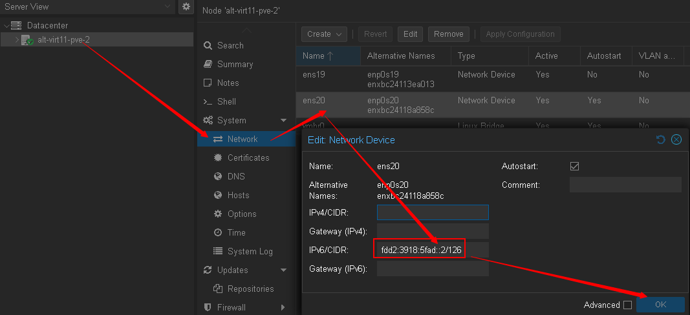
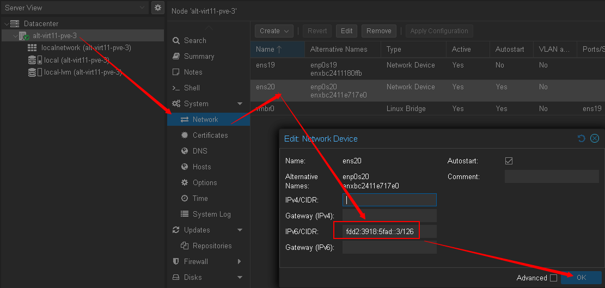
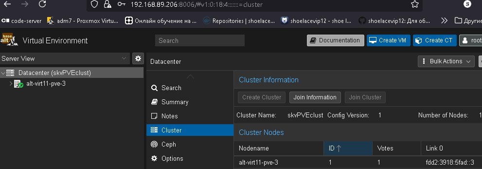
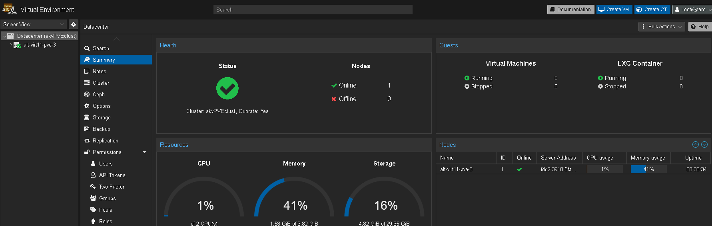
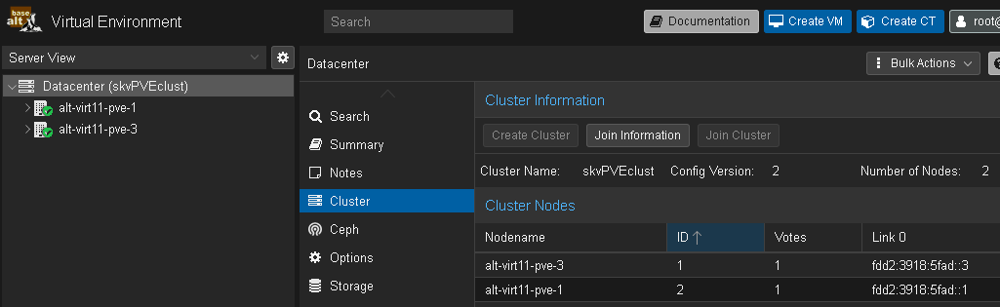
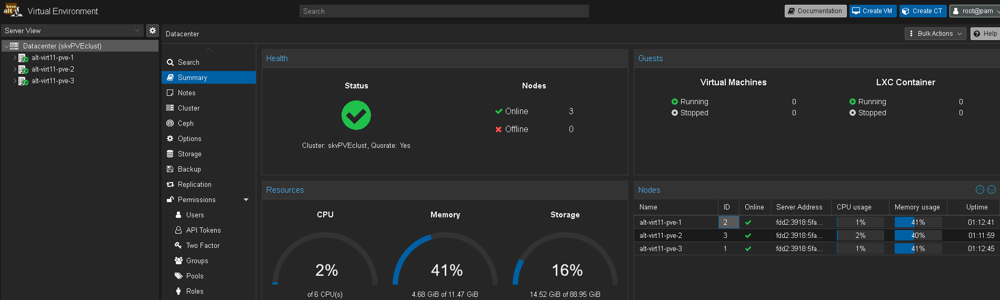
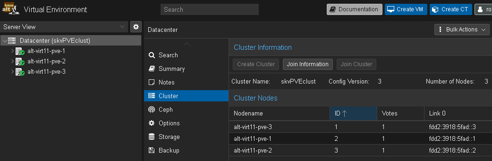

# Лабораторная работа 6 «`Развертывание PVE и создание PVE-кластера`» 
## Памятка входа
```bash
# Включаем агента в текущей оснастке
> ~/.ssh/known_hosts
eval $(ssh-agent) \
&& ssh-add  ~/.ssh/id_alt-adm7_2026_host_ed25519

# вход на реальный хост по ключу по ssh и вход под суперпользователя
ssh -t \
-i ~/.ssh/id_alt-adm7_2026_host_ed25519 \
-o StrictHostKeyChecking=accept-new \
skvadmin@192.168.89.212 \
"su -"

# вход на виртуальный pve-хост alt-virt11-pve-1 по ключу по ssh и вход под суперпользователя
ssh -t \
-i ~/.ssh/id_alt-adm7_2026_host_ed25519 \
-o StrictHostKeyChecking=accept-new \
skvadmin@192.168.89.208 \
"su -"

# вход на виртуальный pve-хост alt-virt11-pve-2 по ключу по ssh и вход под суперпользователя
ssh -t \
-i ~/.ssh/id_alt-adm7_2026_host_ed25519 \
-o StrictHostKeyChecking=accept-new \
skvadmin@192.168.89.207 \
"su -"

# вход на виртуальный pve-хост alt-virt11-pve-3 по ключу по ssh и вход под суперпользователя
ssh -t \
-i ~/.ssh/id_alt-adm7_2026_host_ed25519 \
-o StrictHostKeyChecking=accept-new \
skvadmin@192.168.89.206 \
"su -"

```
[>>>>>ПОДГОТОВКА ДЛЯ РАБОТЫ с модулем altvirt ADM7<<<<<](../lab6.0/README.md)


## Выполнение работы
### Со стороны первого узла alt-virt11-pve-1.lab
```bash
# Включаем агента в текущей оснастке
> ~/.ssh/known_hosts
eval $(ssh-agent) \
&& ssh-add  ~/.ssh/id_alt-adm7_2026_host_ed25519

# вход на виртуальный PVE-хост alt-virt11-pve-1 по ключу по ssh и вход под суперпользователя
ssh -t \
-i ~/.ssh/id_alt-adm7_2026_host_ed25519 \
-o StrictHostKeyChecking=accept-new \
skvadmin@192.168.89.208 \
"su -"

# Обновление узла
apt-get update \
&& update-kernel -y \
&& apt-get dist-upgrade -y

# Убираем из myhostname для отработки файла /etc/hosts в 11 платформе
sed -i 's/files myhostname dns/files dns/' \
/etc/nsswitch.conf
```
```
passwd:     files systemd
shadow:     tcb files
group:      files systemd
gshadow:    files


hosts:      files dns


ethers:     files
netmasks:   files
networks:   files
protocols:  files
rpc:        files
services:   files


automount:  files
aliases:    files
```
```bash
# Производим базовый вывод информации об ip адресации и интерфейсах
ip -br a

# к дополнительному интерфейсу, присваиваем ipv6 адрес
```
```
auto lo
iface lo inet loopback

iface ens19 inet manual

auto ens20
iface ens20 inet6 static
        address fdd2:3918:5fad::1/126

auto vmbr0
iface vmbr0 inet static
        address 192.168.89.208/24
        gateway 192.168.89.1
        bridge-ports ens19
        bridge-stp off
        bridge-fd 0
        dns-nameservers 192.168.89.1
        dns-search lab

source /etc/network/interfaces.d/*
```


```bash
# Изменение локального файла разрешения имен
# Добавляем себя из-за удаления myhostname в /etc/nsswitch.conf
cat > /etc/hosts <<'EOF'
::1             localhost ip6-localhost ip6-loopback
fdd2:3918:5fad::1 alt-virt11-pve-1.lab alt-virt11-pve-1
fdd2:3918:5fad::2 alt-virt11-pve-2.lab alt-virt11-pve-2
fdd2:3918:5fad::3 alt-virt11-pve-3.lab alt-virt11-pve-3

127.0.0.1       localhost.localdomain localhost
192.168.89.208 alt-virt11-pve-1.lab alt-virt11-pve-1
EOF

ping -c2 \
alt-virt11-pve-2.lab

ping -c2 \
alt-virt11-pve-3.lab
```
#### Формирование уникальной пары ключей для соседних хостов
```bash
# Формирование уникальной пары ключей для соседних хостов
ssh-keygen \
-f ~/.ssh/id_alt-adm7_pve1-to-pve2_ed25519 \
-t ed25519 \
-C "fr_pve1_to_pve2"

ssh-keygen \
-f ~/.ssh/id_alt-adm7_pve1-to-pve3_ed25519 \
-t ed25519 \
-C "fr_pve1_to_pve3"

# назначение правильных прав на пары ключей
chmod 600 \
~/.ssh/id_alt-adm7_*_ed25519

chmod 644 \
~/.ssh/id_alt-adm7_*_ed25519.pub
```
#### проброс ключей
##### до узла alt-virt11-pve-2.lab
```bash
# на узел alt-virt11-pve-2.lab сначала до ПОЛЬЗОВАТЕЛЕЙ с правами wheel
ssh-copy-id \
-o StrictHostKeyChecking=accept-new \
-i ~/.ssh/id_alt-adm7_pve1-to-pve2_ed25519.pub \
skvadmin@alt-virt11-pve-2.lab

# Вход на пользователя с возможностью перехода в суперпользователя
ssh -t \
-o StrictHostKeyChecking=accept-new \
-i ~/.ssh/id_alt-adm7_pve1-to-pve2_ed25519 \
skvadmin@alt-virt11-pve-2.lab \
"su -"

# Перенос проброшенного на пользователя с PVE1 публичного ключа на суперпользователя к подключенному хосту
grep fr_pve1 \
/home/skvadmin/.ssh/authorized_keys \
>> .ssh/authorized_keys

# проверка наличия
cat .ssh/authorized_keys

# Возращение на PV1
exit
```
```bash
# Проверка Входа на суперпользователя удаленного хоста напрямую
ssh -o StrictHostKeyChecking=accept-new \
-i ~/.ssh/id_alt-adm7_pve1-to-pve2_ed25519 \
root@alt-virt11-pve-2.lab

exit
```
##### до узла alt-virt11-pve-3.lab
```bash
# на узел alt-virt11-pve-3.lab сначала до ПОЛЬЗОВАТЕЛЕЙ с правами wheel
ssh-copy-id \
-o StrictHostKeyChecking=accept-new \
-i ~/.ssh/id_alt-adm7_pve1-to-pve3_ed25519.pub \
skvadmin@alt-virt11-pve-3.lab

# Вход на пользователя с возможностью перехода в суперпользователя
ssh -t \
-o StrictHostKeyChecking=accept-new \
-i ~/.ssh/id_alt-adm7_pve1-to-pve3_ed25519 \
skvadmin@alt-virt11-pve-3.lab \
"su -"

# Перенос проброшенного на пользователя с PVE1 публичного ключа на суперпользователя к подключенному хосту
grep fr_pve1 \
/home/skvadmin/.ssh/authorized_keys \
>> .ssh/authorized_keys

# проверка наличия нужного ключа
cat .ssh/authorized_keys

# Возращение на PVE1
exit
```
```bash
# Проверка Входа на суперпользователя удаленного хоста напрямую
ssh -t \
-o StrictHostKeyChecking=accept-new \
-i ~/.ssh/id_alt-adm7_pve1-to-pve3_ed25519 \
root@alt-virt11-pve-3.lab \
hostname -s
```
#### Настройка сервера времени
```bash
# Бэкап конфигурации
cp /etc/chrony.conf{,.bak}

# чистка конфига от комментариев
sed -i \
-e '/^[[:space:]]*#/d' \
-e '/^[[:space:]]*$/d' \
/etc/chrony.conf

# Перенастраиваем основной сервер на Московские серверы ВНИИФТРИ ntp3.vniiftri.ru
sed -i 's/pool pool.ntp.org/server ntp3.vniiftri.ru/' \
/etc/chrony.conf

# Добавляем как дополнительный сервер участника кластера PVE alt-virt11-pve-2
sed -i  '/iburst/aserver alt-virt11-pve-2.lab iburst' \
/etc/chrony.conf

# Добавляем как дополнительный сервер участника кластера PVE alt-virt11-pve-3
sed -i '/lab iburst/aserver alt-virt11-pve-3.lab iburst' \
/etc/chrony.conf

# Указание что хост выступает в роли сервера времени для сети fdd2:3918:5fad::/126
sed -i '/rtcsync/aallow fdd2:3918:5fad::/126' \
/etc/chrony.conf

# Указываем возможность отвечать клиентам, если к внешнему NTP серверу нет доступа
sed -i '/\/126/alocal stratum 10' \
/etc/chrony.conf

# Перезапуск служб NTP
systemctl restart \
chrony-wait.service \
chronyd.service \
chrony.service

# Проверка NTP с новым сервером
chronyc tracking
chronyc sources -v

# Проверка открытого порта для клиентов
ss -ulnp | grep :123
```
```
server ntp3.vniiftri.ru iburst
server alt-virt11-pve-2.lab iburst
server alt-virt11-pve-3.lab iburst
driftfile /var/lib/chrony/drift
makestep 1.0 3
rtcsync
allow fdd2:3918:5fad::/126
local stratum 10
ntsdumpdir /var/lib/chrony
logdir /var/log/chrony
```

### Со стороны первого узла alt-virt11-pve-2.lab
```bash
# Включаем агента в текущей оснастке
> ~/.ssh/known_hosts
eval $(ssh-agent) \
&& ssh-add  ~/.ssh/id_alt-adm7_2026_host_ed25519

# вход на виртуальный PVE-хост alt-virt11-pve-2 по ключу по ssh и вход под суперпользователя
ssh -t \
-i ~/.ssh/id_alt-adm7_2026_host_ed25519 \
-o StrictHostKeyChecking=accept-new \
skvadmin@192.168.89.207 \
"su -"

# Обновление узла
apt-get update \
&& update-kernel -y \
&& apt-get dist-upgrade -y

# Убираем из myhostname для отработки файла /etc/hosts в 11 платформе
sed -i 's/files myhostname dns/files dns/' \
/etc/nsswitch.conf
```
```
passwd:     files systemd
shadow:     tcb files
group:      files systemd
gshadow:    files

hosts:      files dns

ethers:     files
netmasks:   files
networks:   files
protocols:  files
rpc:        files
services:   files

automount:  files
aliases:    files
```
```bash
# Производим базовый вывод информации об ip адресации и интерфейсах
ip -br a

# к дополнительному интерфейсу, присваиваем ipv6 адрес
```
```
auto lo
iface lo inet loopback

iface ens19 inet manual

auto ens20
iface ens20 inet6 static
        address fdd2:3918:5fad::2/126

auto vmbr0
iface vmbr0 inet static
        address 192.168.89.207/24
        gateway 192.168.89.1
        bridge-ports ens19
        bridge-stp off
        bridge-fd 0
        dns-nameservers 192.168.89.1
        dns-search lab

source /etc/network/interfaces.d/*
```


```bash
# Изменение локального файла разрешения имен
# Добавляем себя из-за удаления myhostname в /etc/nsswitch.conf
cat > /etc/hosts <<'EOF'
::1             localhost ip6-localhost ip6-loopback
fdd2:3918:5fad::1 alt-virt11-pve-1.lab alt-virt11-pve-1
fdd2:3918:5fad::2 alt-virt11-pve-2.lab alt-virt11-pve-2
fdd2:3918:5fad::3 alt-virt11-pve-3.lab alt-virt11-pve-3

127.0.0.1       localhost.localdomain localhost
192.168.89.207 alt-virt11-pve-2.lab alt-virt11-pve-2
EOF

ping -c2 \
alt-virt11-pve-1.lab

ping -c2 \
alt-virt11-pve-3.lab
```
#### Формирование уникальной пары ключей для соседних хостов
```bash
# Формирование уникальной пары ключей для соседних хостов
ssh-keygen \
-f ~/.ssh/id_alt-adm7_pve2-to-pve1_ed25519 \
-t ed25519 \
-C "fr_pve2_to_pve1"

ssh-keygen \
-f ~/.ssh/id_alt-adm7_pve2-to-pve3_ed25519 \
-t ed25519 \
-C "fr_pve2_to_pve3"

# назначение правильных прав на пары ключей
chmod 600 \
~/.ssh/id_alt-adm7_*_ed25519

chmod 644 \
~/.ssh/id_alt-adm7_*_ed25519.pub
```
#### проброс ключей
##### до узла alt-virt11-pve-1.lab
```bash
# на узел alt-virt11-pve-1.lab сначала до ПОЛЬЗОВАТЕЛЕЙ с правами wheel
ssh-copy-id \
-o StrictHostKeyChecking=accept-new \
-i ~/.ssh/id_alt-adm7_pve2-to-pve1_ed25519.pub \
skvadmin@alt-virt11-pve-1.lab

# Вход на пользователя с возможностью перехода в суперпользователя
ssh -t \
-o StrictHostKeyChecking=accept-new \
-i ~/.ssh/id_alt-adm7_pve2-to-pve1_ed25519 \
skvadmin@alt-virt11-pve-1.lab \
"su -"

# Перенос проброшенного на пользователя с PVE2 публичного ключа на суперпользователя к подключенному хосту
grep fr_pve2 \
/home/skvadmin/.ssh/authorized_keys \
>> .ssh/authorized_keys

# проверка наличия
grep fr_pve2 \
.ssh/authorized_keys

# Возращение на PVE2
exit
```
```bash
# Проверка Входа на суперпользователя удаленного хоста напрямую
ssh -t \
-o StrictHostKeyChecking=accept-new \
-i ~/.ssh/id_alt-adm7_pve2-to-pve1_ed25519 \
root@alt-virt11-pve-1.lab \
hostname -s
```
##### до узла alt-virt11-pve-3.lab
```bash
# на узел alt-virt11-pve-3.lab сначала до ПОЛЬЗОВАТЕЛЕЙ с правами wheel
ssh-copy-id \
-o StrictHostKeyChecking=accept-new \
-i ~/.ssh/id_alt-adm7_pve2-to-pve3_ed25519.pub \
skvadmin@alt-virt11-pve-3.lab

# Вход на пользователя с возможностью перехода в суперпользователя
ssh -t \
-o StrictHostKeyChecking=accept-new \
-i ~/.ssh/id_alt-adm7_pve2-to-pve3_ed25519 \
skvadmin@alt-virt11-pve-3.lab \
"su -"

# Перенос проброшенного на пользователя с PVE2 публичного ключа на суперпользователя к подключенному хосту
grep fr_pve2 \
/home/skvadmin/.ssh/authorized_keys \
>> .ssh/authorized_keys

# проверка наличия нужного ключа
grep fr_pve2 \
.ssh/authorized_keys

# Возращение на PVE2
exit
```
```bash
# Проверка Входа на суперпользователя удаленного хоста напрямую
ssh -t \
-o StrictHostKeyChecking=accept-new \
-i ~/.ssh/id_alt-adm7_pve2-to-pve3_ed25519 \
root@alt-virt11-pve-3.lab \
hostname -s
```
#### Настройка сервера времени
```bash
# Бэкап конфигурации
cp /etc/chrony.conf{,.bak}

# чистка конфига от комментариев
sed -i \
-e '/^[[:space:]]*#/d' \
-e '/^[[:space:]]*$/d' \
/etc/chrony.conf

# Перенастраиваем основной сервер на Московские серверы ВНИИФТРИ ntp3.vniiftri.ru
sed -i 's/pool pool.ntp.org/server ntp3.vniiftri.ru/' \
/etc/chrony.conf

# Добавляем как дополнительный сервер участника кластера PVE alt-virt11-pve-1
sed -i  '/iburst/aserver alt-virt11-pve-1.lab iburst' \
/etc/chrony.conf

# Добавляем как дополнительный сервер участника кластера PVE alt-virt11-pve-3
sed -i '/lab iburst/aserver alt-virt11-pve-3.lab iburst' \
/etc/chrony.conf

# Указание что хост выступает в роли сервера времени для сети fdd2:3918:5fad::/126
sed -i '/rtcsync/aallow fdd2:3918:5fad::/126' \
/etc/chrony.conf

# Указываем возможность отвечать клиентам, если к внешнему NTP серверу нет доступа
sed -i '/\/126/alocal stratum 10' \
/etc/chrony.conf

# Перезапуск служб NTP
systemctl restart \
chrony-wait.service \
chronyd.service \
chrony.service

# Проверка NTP с новым сервером
chronyc tracking
chronyc sources -v

# Проверка открытого порта для клиентов
ss -ulnp | grep :123
```
```
server ntp3.vniiftri.ru iburst
server alt-virt11-pve-1.lab iburst
server alt-virt11-pve-3.lab iburst
driftfile /var/lib/chrony/drift
makestep 1.0 3
rtcsync
allow fdd2:3918:5fad::/126
local stratum 10
ntsdumpdir /var/lib/chrony
logdir /var/log/chrony
```


### Со стороны первого узла alt-virt11-pve-3.lab
```bash
# Включаем агента в текущей оснастке
> ~/.ssh/known_hosts
eval $(ssh-agent) \
&& ssh-add  ~/.ssh/id_alt-adm7_2026_host_ed25519

# вход на виртуальный PVE-хост alt-virt11-pve-3 по ключу по ssh и вход под суперпользователя
ssh -t \
-i ~/.ssh/id_alt-adm7_2026_host_ed25519 \
-o StrictHostKeyChecking=accept-new \
skvadmin@192.168.89.206 \
"su -"

# Обновление узла
apt-get update \
&& update-kernel -y \
&& apt-get dist-upgrade -y

# Убираем из myhostname для отработки файла /etc/hosts в 11 платформе
sed -i 's/files myhostname dns/files dns/' \
/etc/nsswitch.conf
```
```
passwd:     files systemd
shadow:     tcb files
group:      files systemd
gshadow:    files

# hosts:      files myhostname dns
hosts:      files dns

ethers:     files
netmasks:   files
networks:   files
protocols:  files
rpc:        files
services:   files

automount:  files
aliases:    files
```
```bash
# Производим базовый вывод информации об ip адресации и интерфейсах
ip -br a

# к дополнительному интерфейсу, присваиваем ipv6 адрес
```
```
auto lo
iface lo inet loopback

iface ens19 inet manual

auto ens20
iface ens20 inet6 static
        address fdd2:3918:5fad::3/126

auto vmbr0
iface vmbr0 inet static
        address 192.168.89.206/24
        gateway 192.168.89.1
        bridge-ports ens19
        bridge-stp off
        bridge-fd 0
        dns-nameservers 192.168.89.1
        dns-search lab

source /etc/network/interfaces.d/*
```


```bash
# Изменение локального файла разрешения имен
# Добавляем себя из-за удаления myhostname в /etc/nsswitch.conf
cat > /etc/hosts <<'EOF'
::1             localhost ip6-localhost ip6-loopback
fdd2:3918:5fad::1 alt-virt11-pve-1.lab alt-virt11-pve-1
fdd2:3918:5fad::2 alt-virt11-pve-2.lab alt-virt11-pve-2
fdd2:3918:5fad::3 alt-virt11-pve-3.lab alt-virt11-pve-3
fdd2:3918:5fad:: alt-virt11-pve-4.lab alt-virt11-pve-4

127.0.0.1       localhost.localdomain localhost
192.168.89.206 alt-virt11-pve-3.lab alt-virt11-pve-3
EOF

ping -c2 \
alt-virt11-pve-1.lab

ping -c2 \
alt-virt11-pve-2.lab
```
#### Формирование уникальной пары ключей для соседних хостов
```bash
# Формирование уникальной пары ключей для соседних хостов
ssh-keygen \
-f ~/.ssh/id_alt-adm7_pve3-to-pve1_ed25519 \
-t ed25519 \
-C "fr_pve3_to_pve1"

ssh-keygen \
-f ~/.ssh/id_alt-adm7_pve3-to-pve2_ed25519 \
-t ed25519 \
-C "fr_pve3_to_pve2"

# назначение правильных прав на пары ключей
chmod 600 \
~/.ssh/id_alt-adm7_*_ed25519

chmod 644 \
~/.ssh/id_alt-adm7_*_ed25519.pub
```
#### проброс ключей
##### до узла alt-virt11-pve-1.lab
```bash
# на узел alt-virt11-pve-1.lab сначала до ПОЛЬЗОВАТЕЛЕЙ с правами wheel
ssh-copy-id \
-o StrictHostKeyChecking=accept-new \
-i ~/.ssh/id_alt-adm7_pve3-to-pve1_ed25519.pub \
skvadmin@alt-virt11-pve-1.lab

# Вход на пользователя с возможностью перехода в суперпользователя
ssh -t \
-o StrictHostKeyChecking=accept-new \
-i ~/.ssh/id_alt-adm7_pve3-to-pve1_ed25519 \
skvadmin@alt-virt11-pve-1.lab \
"su -"

# Перенос проброшенного на пользователя с PVE3 публичного ключа на суперпользователя к подключенному хосту
grep fr_pve3 \
/home/skvadmin/.ssh/authorized_keys \
>> .ssh/authorized_keys

# проверка наличия
grep fr_pve3 \
.ssh/authorized_keys

# Возращение на PVE3
exit
```
```bash
# Проверка Входа на суперпользователя удаленного хоста напрямую
ssh -t \
-o StrictHostKeyChecking=accept-new \
-i ~/.ssh/id_alt-adm7_pve3-to-pve1_ed25519 \
root@alt-virt11-pve-1.lab \
hostname -s
```
##### до узла alt-virt11-pve-2.lab
```bash
# на узел alt-virt11-pve-2.lab сначала до ПОЛЬЗОВАТЕЛЕЙ с правами wheel
ssh-copy-id \
-o StrictHostKeyChecking=accept-new \
-i ~/.ssh/id_alt-adm7_pve3-to-pve2_ed25519.pub \
skvadmin@alt-virt11-pve-2.lab

# Вход на пользователя с возможностью перехода в суперпользователя
ssh -t \
-o StrictHostKeyChecking=accept-new \
-i ~/.ssh/id_alt-adm7_pve3-to-pve2_ed25519 \
skvadmin@alt-virt11-pve-2.lab \
"su -"

# Перенос проброшенного на пользователя с PVE3 публичного ключа на суперпользователя к подключенному хосту
grep fr_pve3 \
/home/skvadmin/.ssh/authorized_keys \
>> .ssh/authorized_keys

# проверка наличия нужного ключа
grep fr_pve3 \
.ssh/authorized_keys

# Возращение на PVE3
exit
```
```bash
# Проверка Входа на суперпользователя удаленного хоста напрямую
ssh -t \
-o StrictHostKeyChecking=accept-new \
-i ~/.ssh/id_alt-adm7_pve3-to-pve2_ed25519 \
root@alt-virt11-pve-2.lab \
hostname -s
```
#### Настройка сервера времени
```bash
# Бэкап конфигурации
cp /etc/chrony.conf{,.bak}

# чистка конфига от комментариев
sed -i \
-e '/^[[:space:]]*#/d' \
-e '/^[[:space:]]*$/d' \
/etc/chrony.conf

# Перенастраиваем основной сервер на Московские серверы ВНИИФТРИ ntp3.vniiftri.ru
sed -i 's/pool pool.ntp.org/server ntp3.vniiftri.ru/' \
/etc/chrony.conf

# Добавляем как дополнительный сервер участника кластера PVE alt-virt11-pve-1
sed -i  '/iburst/aserver alt-virt11-pve-1.lab iburst' \
/etc/chrony.conf

# Добавляем как дополнительный сервер участника кластера PVE alt-virt11-pve-2
sed -i '/lab iburst/aserver alt-virt11-pve-2.lab iburst' \
/etc/chrony.conf

# Указание что хост выступает в роли сервера времени для сети fdd2:3918:5fad::/126
sed -i '/rtcsync/aallow fdd2:3918:5fad::/126' \
/etc/chrony.conf

# Указываем возможность отвечать клиентам, если к внешнему NTP серверу нет доступа
sed -i '/\/126/alocal stratum 10' \
/etc/chrony.conf

# Перезапуск служб NTP
systemctl restart \
chrony-wait.service \
chronyd.service \
chrony.service

# Проверка NTP с новым сервером
chronyc tracking
chronyc sources -v

# Проверка открытого порта для клиентов
ss -ulnp | grep :123
```
```
server ntp3.vniiftri.ru iburst
server alt-virt11-pve-1.lab iburst
server alt-virt11-pve-2.lab iburst
driftfile /var/lib/chrony/drift
makestep 1.0 3
rtcsync
allow fdd2:3918:5fad::/126
local stratum 10
ntsdumpdir /var/lib/chrony
logdir /var/log/chrony
```
### Создание кластера PVE
#### Создание кластера с узла alt-virt11-pve-3.lab
```bash
# вход на виртуальный pve-хост alt-virt11-pve-3 по ключу по ssh и вход под суперпользователя
ssh -t \
-i ~/.ssh/id_alt-adm7_2026_host_ed25519 \
-o StrictHostKeyChecking=accept-new \
skvadmin@192.168.89.206 \
"su -"

# Создание Кластера с именем skvPVEclust
pvecm create \
skvPVEclust
```
```
Corosync Cluster Engine Authentication key generator.
Gathering 2048 bits for key from /dev/urandom.
Writing corosync key to /etc/corosync/authkey.
Writing corosync config to /etc/pve/corosync.conf
Restart corosync and cluster filesystem
```


#### Проверка статуса текущего создания
```bash
# Проверка состояние получившихся настроек corosync с 1 узлом  в кластере
cat /etc/pve/corosync.conf
```
```json
logging {
  debug: off
  to_syslog: yes
}

nodelist {
  node {
    name: alt-virt11-pve-3
    nodeid: 1
    quorum_votes: 1
    ring0_addr: fdd2:3918:5fad::3
  }
}

quorum {
  provider: corosync_votequorum
}

totem {
  cluster_name: skvPVEclust
  config_version: 1
  interface {
    linknumber: 0
  }
  ip_version: ipv4-6
  link_mode: passive
  secauth: on
  version: 2
}
```
```bash
# вывод статуса кластера с 1 нодой
pvecm status
```
```
Cluster information
-------------------
Name:             skvPVEclust
Config Version:   1
Transport:        knet
Secure auth:      on

Quorum information
------------------
Date:             Sat Feb 21 15:30:21 2026
Quorum provider:  corosync_votequorum
Nodes:            1
Node ID:          0x00000001
Ring ID:          1.5
Quorate:          Yes

Votequorum information
----------------------
Expected votes:   1
Highest expected: 1
Total votes:      1
Quorum:           1  
Flags:            Quorate 

Membership information
----------------------
    Nodeid      Votes Name
0x00000001          1 fdd2:3918:5fad::3 (local)
```




#### Расширение созданного кластера с узла alt-virt11-pve-1.lab
```bash
# вход на виртуальный pve-хост alt-virt11-pve-1 по ключу по ssh и вход под суперпользователя
ssh -t \
-i ~/.ssh/id_alt-adm7_2026_host_ed25519 \
-o StrictHostKeyChecking=accept-new \
skvadmin@192.168.89.208 \
"su -"

# Подключаем к участию в Кластере на созданном кластере хостом alt-virt11-pve-3
pvecm add \
alt-virt11-pve-3
```
```
Please enter superuser (root) password for 'alt-virt11-pve-3': ********    
Establishing API connection with host 'alt-virt11-pve-3'
The authenticity of host 'alt-virt11-pve-3' can't be established.
X509 SHA256 key fingerprint is 0B:A3:F1:AF:44:1D:B2:91:39:25:53:D4:5F:BA:71:44:67:B8:2F:19:47:A6:A5:5D:4C:8E:92:64:0F:88:BF:6E.
Are you sure you want to continue connecting (yes/no)? yes
Login succeeded.
check cluster join API version
No cluster network links passed explicitly, fallback to local node IP 'fdd2:3918:5fad::1'
Request addition of this node
Join request OK, finishing setup locally
stopping pve-cluster service
backup old database to '/var/lib/pve-cluster/backup/config-1771678306.sql.gz'
waiting for quorum...OK
(re)generate node files
generate new node certificate
merge authorized SSH keys
generated new node certificate, restart pveproxy and pvedaemon services
successfully added node 'alt-virt11-pve-1' to cluster.
```


```bash
# Проверка состояние получившихся настроек corosync с 2 узлами в кластере
cat /etc/pve/corosync.conf
```
```json
logging {
  debug: off
  to_syslog: yes
}

nodelist {
  node {
    name: alt-virt11-pve-1
    nodeid: 2
    quorum_votes: 1
    ring0_addr: fdd2:3918:5fad::1
  }
  node {
    name: alt-virt11-pve-3
    nodeid: 1
    quorum_votes: 1
    ring0_addr: fdd2:3918:5fad::3
  }
}

quorum {
  provider: corosync_votequorum
}

totem {
  cluster_name: skvPVEclust
  config_version: 2
  interface {
    linknumber: 0
  }
  ip_version: ipv4-6
  link_mode: passive
  secauth: on
  version: 2
}
```
```bash
# вывод статуса кластера с 2 нодами
pvecm status
```
```
Cluster information
-------------------
Name:             skvPVEclust
Config Version:   2
Transport:        knet
Secure auth:      on

Quorum information
------------------
Date:             Sat Feb 21 15:55:46 2026
Quorum provider:  corosync_votequorum
Nodes:            2
Node ID:          0x00000001
Ring ID:          1.9
Quorate:          Yes

Votequorum information
----------------------
Expected votes:   2
Highest expected: 2
Total votes:      2
Quorum:           2  
Flags:            Quorate 

Membership information
----------------------
    Nodeid      Votes Name
0x00000001          1 fdd2:3918:5fad::3 (local)
0x00000002          1 fdd2:3918:5fad::1
```




#### Расширение созданного кластера с узла alt-virt11-pve-2.lab
```bash
# вход на виртуальный pve-хост alt-virt11-pve-2 по ключу по ssh и вход под суперпользователя
ssh -t \
-i ~/.ssh/id_alt-adm7_2026_host_ed25519 \
-o StrictHostKeyChecking=accept-new \
skvadmin@192.168.89.207 \
"su -"

# Подключаем к участию в Кластере к любому участнику, как пример к alt-virt11-pve-1
pvecm add \
alt-virt11-pve-1
```
```
alt-virt11-pve-1
Please enter superuser (root) password for 'alt-virt11-pve-1': ********    
Establishing API connection with host 'alt-virt11-pve-1'
The authenticity of host 'alt-virt11-pve-1' can't be established.
X509 SHA256 key fingerprint is 6F:96:34:68:2D:C4:F3:7B:C4:C7:9A:B3:FA:EA:2B:3B:FE:5F:6D:FC:E9:35:A2:D4:1C:68:FE:8B:58:10:CB:72.
Are you sure you want to continue connecting (yes/no)? yes
Login succeeded.
check cluster join API version
No cluster network links passed explicitly, fallback to local node IP 'fdd2:3918:5fad::2'
Request addition of this node
Join request OK, finishing setup locally
stopping pve-cluster service
backup old database to '/var/lib/pve-cluster/backup/config-1771679158.sql.gz'
waiting for quorum...OK
(re)generate node files
generate new node certificate
merge authorized SSH keys
generated new node certificate, restart pveproxy and pvedaemon services
successfully added node 'alt-virt11-pve-2' to cluster.
```

```bash
# Проверка состояние получившихся настроек corosync с 3 узлами в кластере
cat /etc/pve/corosync.conf
```
```json
logging {
  debug: off
  to_syslog: yes
}

nodelist {
  node {
    name: alt-virt11-pve-1
    nodeid: 2
    quorum_votes: 1
    ring0_addr: fdd2:3918:5fad::1
  }
  node {
    name: alt-virt11-pve-2
    nodeid: 3
    quorum_votes: 1
    ring0_addr: fdd2:3918:5fad::2
  }
  node {
    name: alt-virt11-pve-3
    nodeid: 1
    quorum_votes: 1
    ring0_addr: fdd2:3918:5fad::3
  }
}

quorum {
  provider: corosync_votequorum
}

totem {
  cluster_name: skvPVEclust
  config_version: 3
  interface {
    linknumber: 0
  }
  ip_version: ipv4-6
  link_mode: passive
  secauth: on
  version: 2
}
```
```bash
# вывод статуса кластера с 3 нодами
pvecm status
```
```
Cluster information
-------------------
Name:             skvPVEclust
Config Version:   3
Transport:        knet
Secure auth:      on

Quorum information
------------------
Date:             Sat Feb 21 16:07:28 2026
Quorum provider:  corosync_votequorum
Nodes:            3
Node ID:          0x00000003
Ring ID:          1.d
Quorate:          Yes

Votequorum information
----------------------
Expected votes:   3
Highest expected: 3
Total votes:      3
Quorum:           2  
Flags:            Quorate 

Membership information
----------------------
    Nodeid      Votes Name
0x00000001          1 fdd2:3918:5fad::3
0x00000002          1 fdd2:3918:5fad::1
0x00000003          1 fdd2:3918:5fad::2 (local)
```





### Для github и gitflic
```bash
git log --oneline

git branch -v

git switch main

git status

git add . .. ../.. \
&& git status

git remote -v

git commit -am 'оформление для ADM7, lab6 prox_clus upd4' \
&& git push \
--set-upstream \
altlinux \
main \
&& git push \
--set-upstream \
altlinux_gf \
main
```