# Лабораторная работа 7 «`Базовая настройка PVE`» 
## Памятка входа
```bash
# Включаем агента в текущей оснастке
> ~/.ssh/known_hosts
eval $(ssh-agent) \
&& ssh-add  ~/.ssh/id_alt-adm7_2026_host_ed25519

# вход на реальный хост по ключу по ssh и вход под суперпользователя
ssh -t \
-i ~/.ssh/id_alt-adm7_2026_host_ed25519 \
-o StrictHostKeyChecking=accept-new \
skvadmin@192.168.89.212 \
"su -"

# вход на виртуальный pve-хост alt-virt11-pve-1 по ключу по ssh и вход под суперпользователя
ssh -t \
-i ~/.ssh/id_alt-adm7_2026_host_ed25519 \
-o StrictHostKeyChecking=accept-new \
skvadmin@192.168.89.208 \
"su -"

# вход на виртуальный pve-хост alt-virt11-pve-2 по ключу по ssh и вход под суперпользователя
ssh -t \
-i ~/.ssh/id_alt-adm7_2026_host_ed25519 \
-o StrictHostKeyChecking=accept-new \
skvadmin@192.168.89.207 \
"su -"

# вход на виртуальный pve-хост alt-virt11-pve-3 по ключу по ssh и вход под суперпользователя
ssh -t \
-i ~/.ssh/id_alt-adm7_2026_host_ed25519 \
-o StrictHostKeyChecking=accept-new \
skvadmin@192.168.89.206 \
"su -"

```
[>>>>>ПОДГОТОВКА ДЛЯ РАБОТЫ с модулем altvirt ADM7<<<<<](../lab6.0/README.md)

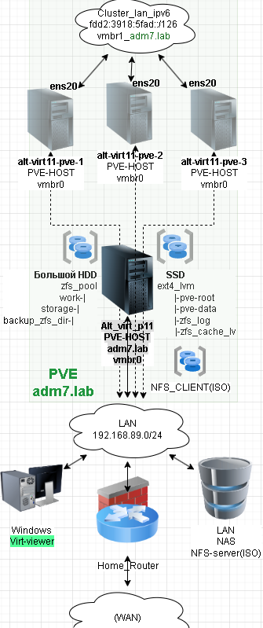

## Выполнение работы

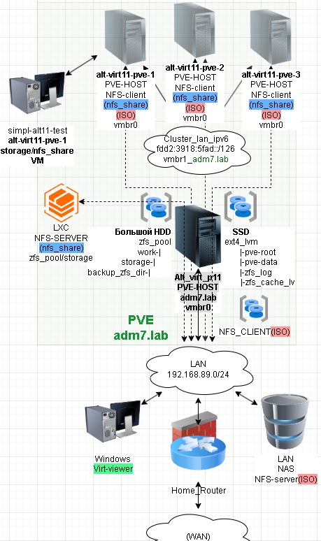

#### загрузка образа установки

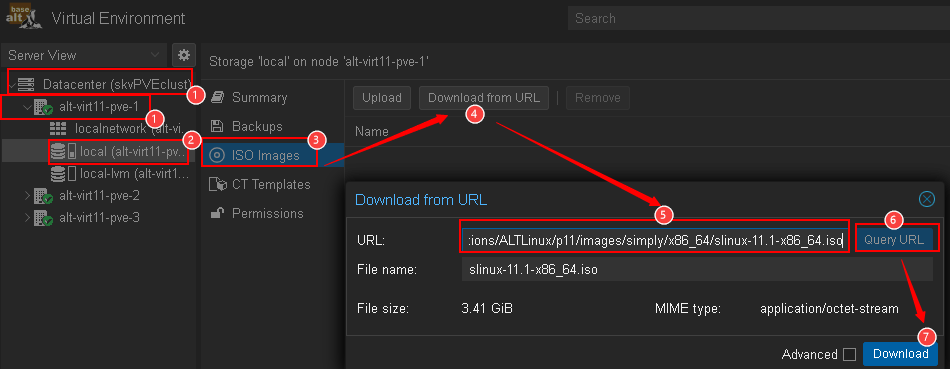
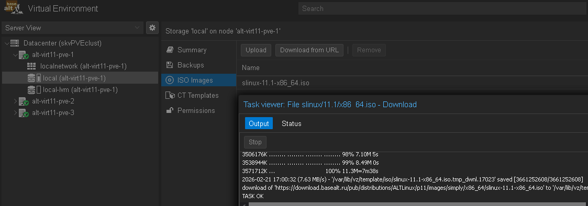
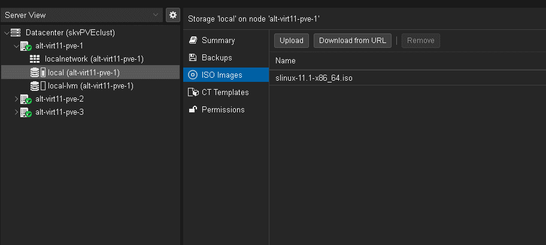

#### Создание ВМ

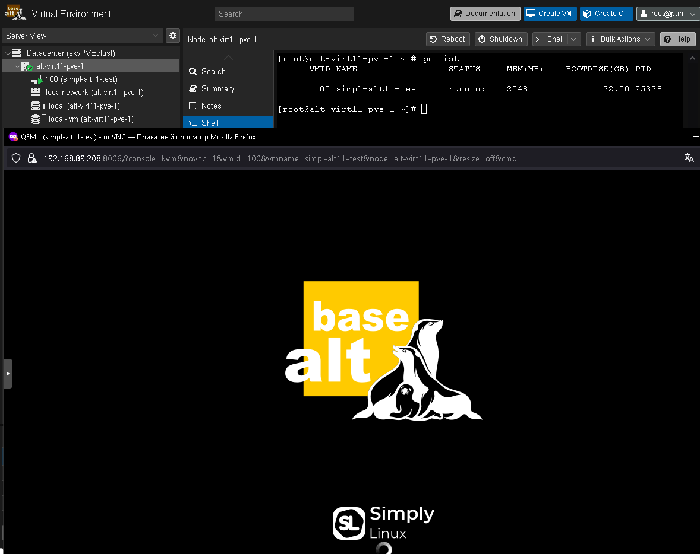

#### Настройка ВМ после создания
```bash
qm list

qm status 100

qm status 100

qm shutdown 100
```
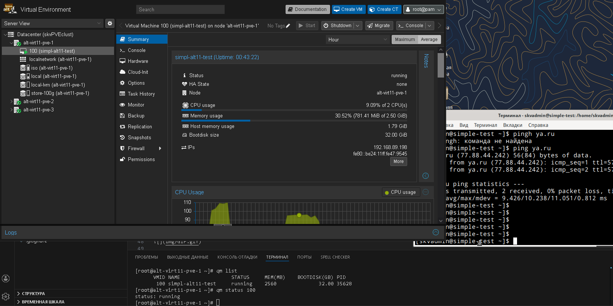
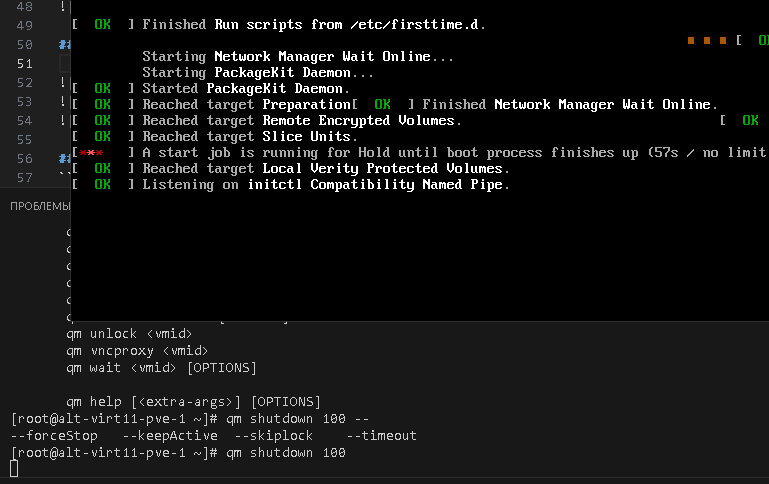

```bash
cat /etc/pve/qemu-server/100.conf
```
```
agent: 1
balloon: 1024
boot: order=scsi0;sata2;net0
cores: 2
cpu: x86-64-v2-AES
kvm: 0
memory: 2560
meta: creation-qemu=10.1.2,ctime=1771685122
name: simpl-alt11-test
net0: virtio=BC:24:11:47:95:45,bridge=vmbr0
numa: 0
ostype: l26
sata2: iso:iso/alt-p10-xfce-20240309-x86_64.iso,media=cdrom,size=1273880K
scsi0: store-100g:100/vm-100-disk-0.qcow2,iothread=1,size=32G
scsihw: virtio-scsi-single
smbios1: uuid=3aa86298-2d04-4bd1-b24c-818e1c7b7c22
sockets: 1
vmgenid: 76915612-2fdc-476e-8d79-1a0102836a80
```

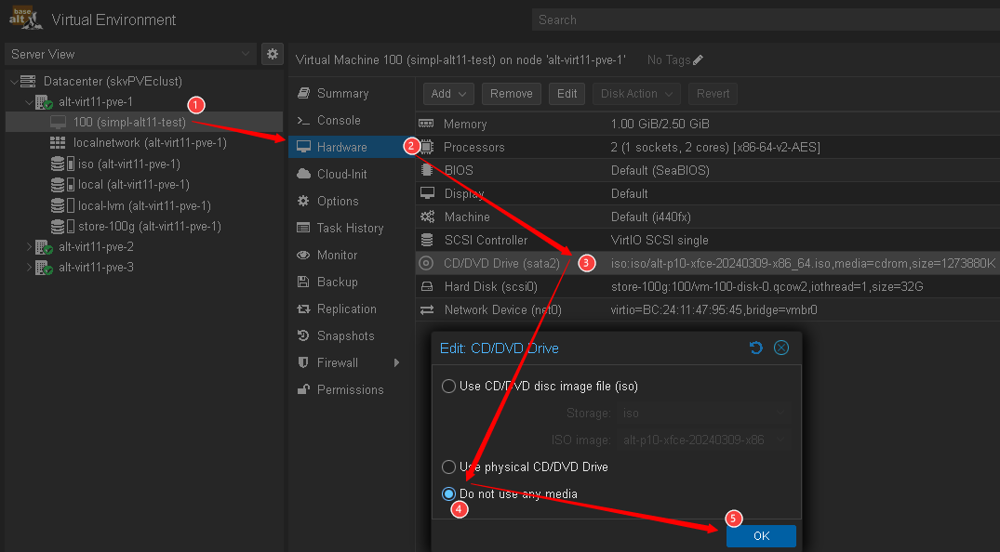

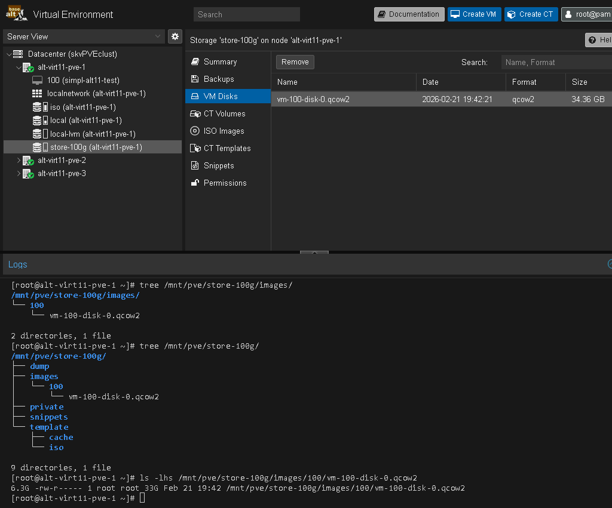


### Создание NFS сервера на lxc контейнере для PVE
#### Создание контейнера

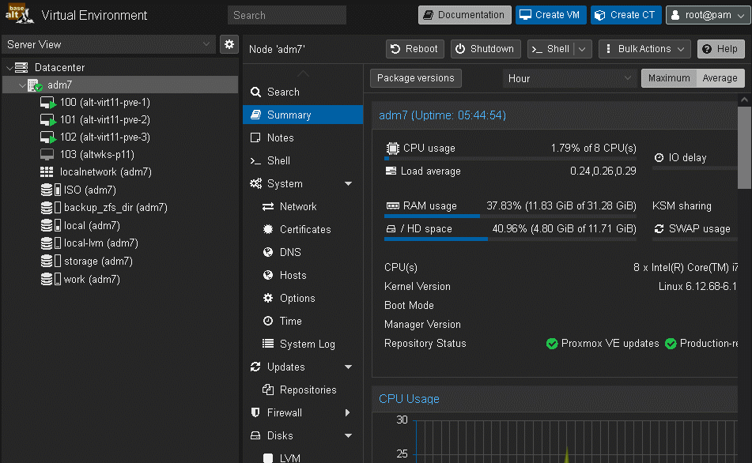

### Развертывание службы NFS
```bash
# Установка пакетов для nfs сервера и обновление пакетов контейнера
apt-get update \
&& apt-get dist-upgrade -y \
&& apt-get install -y \
rpcbind \
nfs-clients \
nfs-server

# Создание каталога для сервера
mkdir -p \
/srv/nfs-store

# Установка в режим сервера
control rpcbind server

# Запуск служб для сервера в системе инициализированной
systemctl enable \
--now \
rpcbind nfs

# Проверка служб
systemctl is-active \
rpcbind \
nfs

# Прослушивание портов
rpcinfo -p

# Пробрасывам экспортируемый каталог
echo '/srv/nfs-store 192.168.89.0/24(rw,no_root_squash,sync,no_subtree_check,nohide)' \
>> /etc/exports

# проверка правильности и экспорт каталогов
exportfs -vra
```

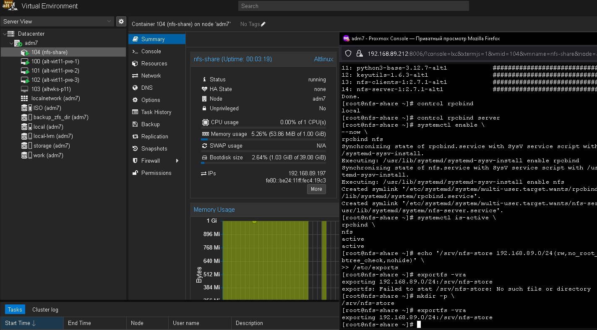
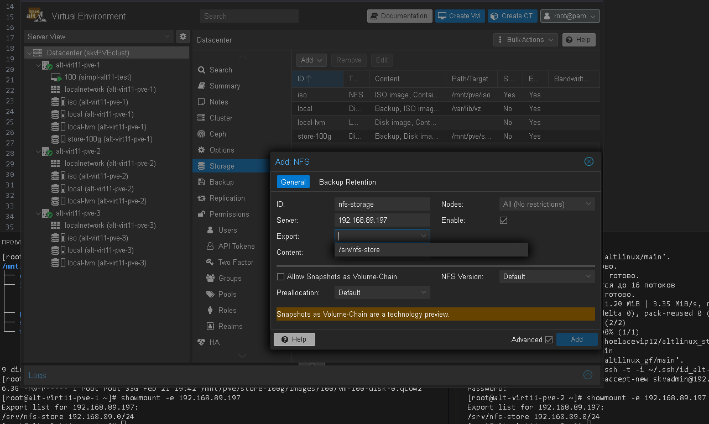
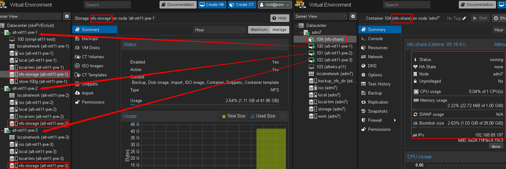

### Перемещение и клонирование
#### Миграция образа виртуальной машины в общее хранилище

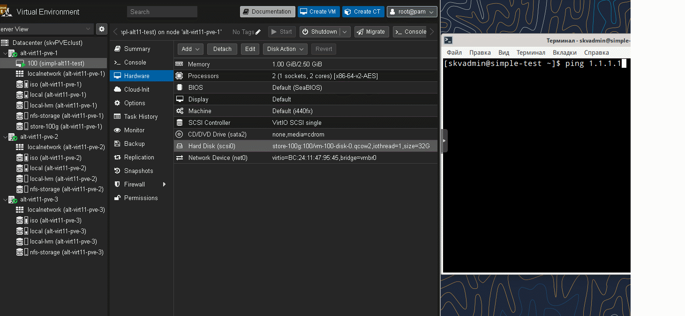

#### Выполнение полного клонирования

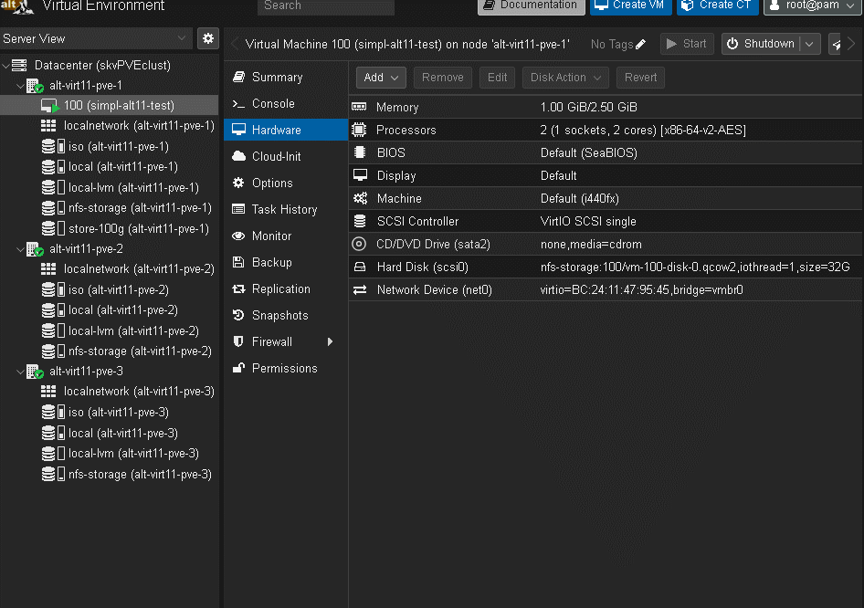

#### Создание шаблона ВМ и Выполнение связанного клонирования

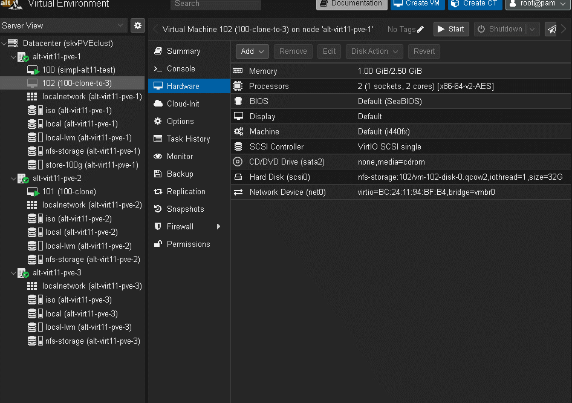

```bash
ll -sh \
/mnt/pve/nfs-storage/images/10{3,2,1}/
```
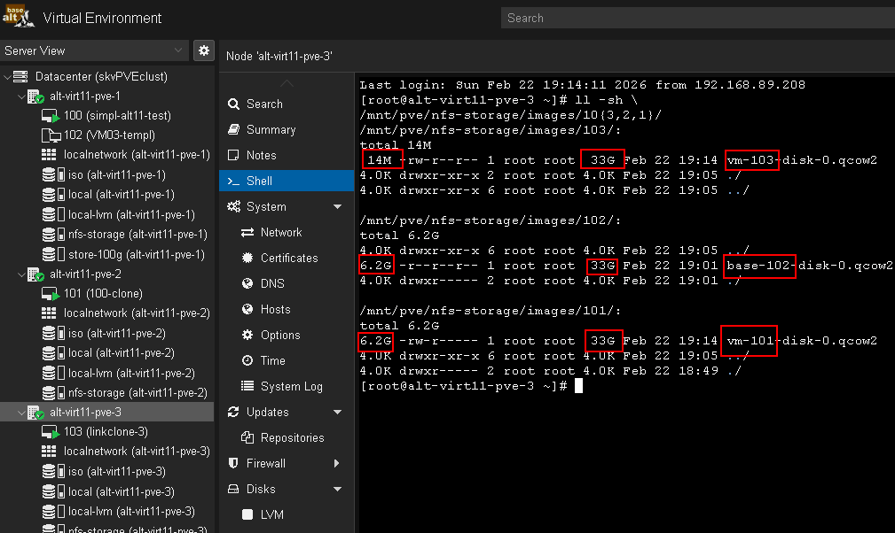

#### Проведение живой миграции

```bash
qm migrate \
100 \
alt-virt11-pve-2 \
--online
```
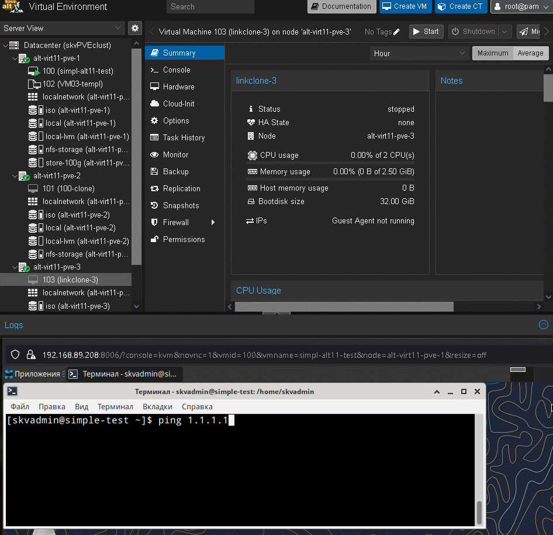

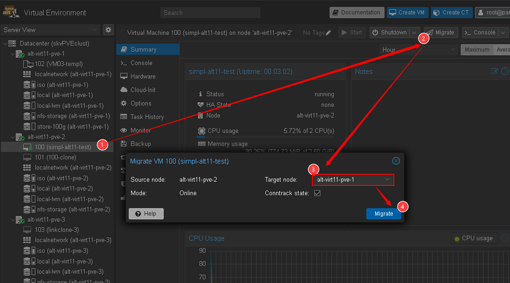

### Для github и gitflic
```bash
git log --oneline

git branch -v

git switch main

git status

git add . .. ../.. \
&& git status

git remote -v

git commit -am 'оформление для ADM7, lab7 prox_base upd_4' \
&& git push \
--set-upstream \
altlinux \
main \
&& git push \
--set-upstream \
altlinux_gf \
main
```