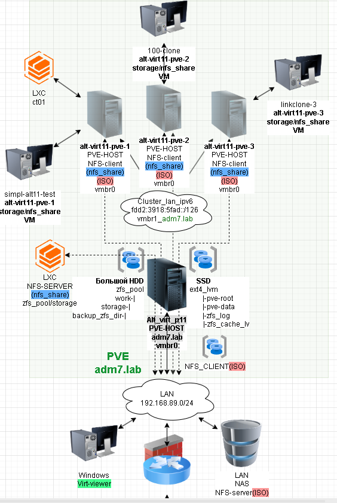
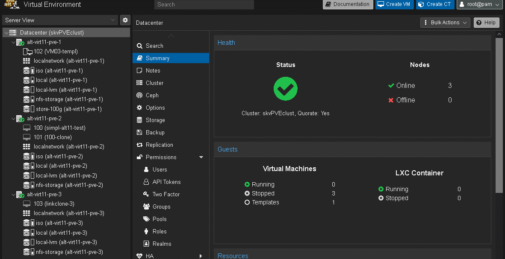
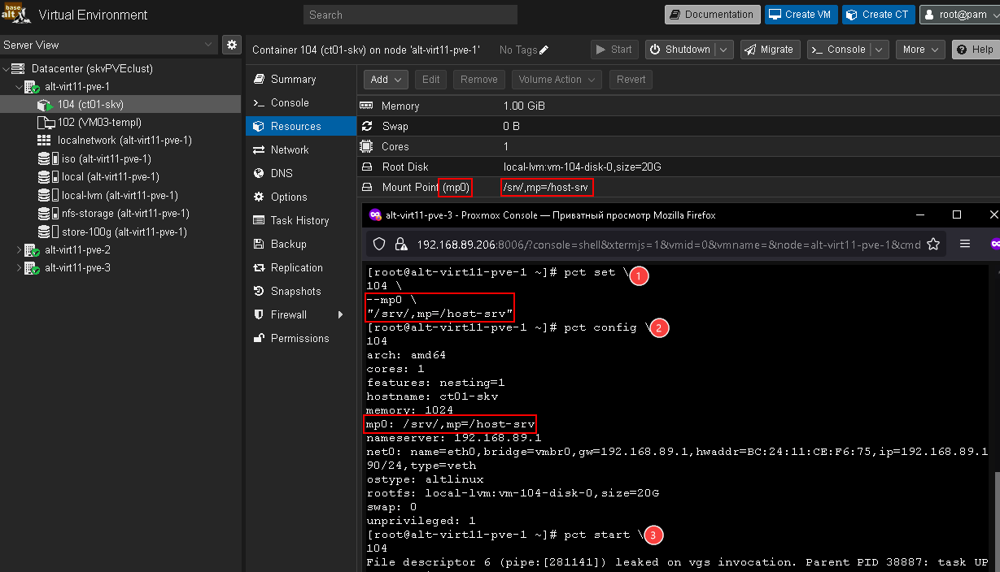
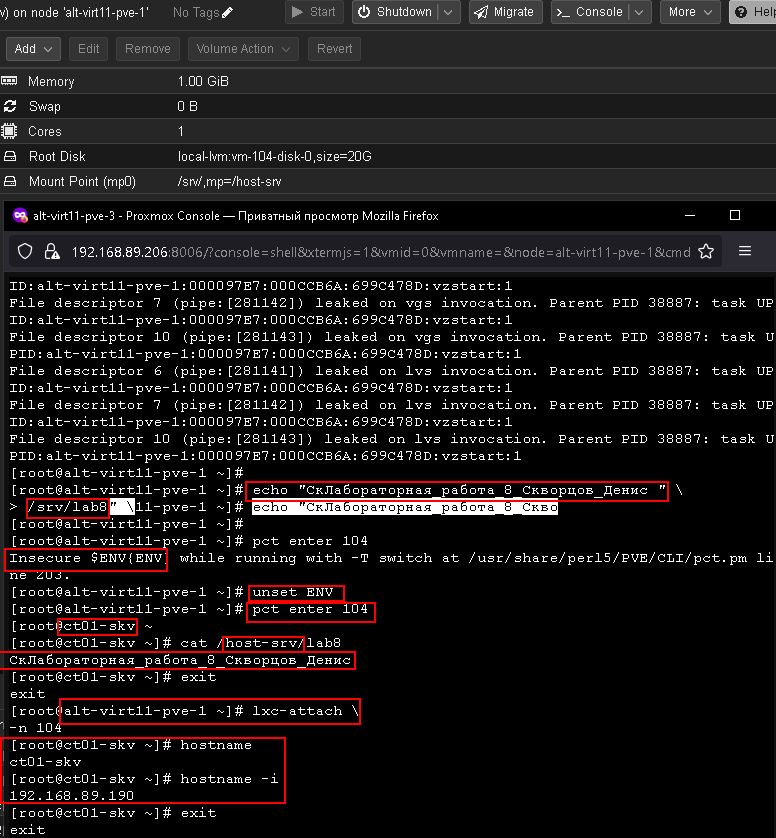

# Лабораторная работа 8 «`PVE Работа с контейнерами lxc`» 
## Памятка входа
```bash
# Включаем агента в текущей оснастке
> ~/.ssh/known_hosts
eval $(ssh-agent) \
&& ssh-add  ~/.ssh/id_alt-adm7_2026_host_ed25519

# вход на реальный хост по ключу по ssh и вход под суперпользователя
ssh -t \
-i ~/.ssh/id_alt-adm7_2026_host_ed25519 \
-o StrictHostKeyChecking=accept-new \
skvadmin@192.168.89.212 \
"su -"

# вход на виртуальный pve-хост alt-virt11-pve-1 по ключу по ssh и вход под суперпользователя
ssh -t \
-i ~/.ssh/id_alt-adm7_2026_host_ed25519 \
-o StrictHostKeyChecking=accept-new \
skvadmin@192.168.89.208 \
"su -"

# вход на виртуальный pve-хост alt-virt11-pve-2 по ключу по ssh и вход под суперпользователя
ssh -t \
-i ~/.ssh/id_alt-adm7_2026_host_ed25519 \
-o StrictHostKeyChecking=accept-new \
skvadmin@192.168.89.207 \
"su -"

# вход на виртуальный pve-хост alt-virt11-pve-3 по ключу по ssh и вход под суперпользователя
ssh -t \
-i ~/.ssh/id_alt-adm7_2026_host_ed25519 \
-o StrictHostKeyChecking=accept-new \
skvadmin@192.168.89.206 \
"su -"

```
[>>>>>ПОДГОТОВКА ДЛЯ РАБОТЫ с модулем altvirt ADM7<<<<<](../lab6.0/README.md)


## Выполнение работы



### Создание и настройка контейнера



#### Проброс папок узла в контейнер
```bash
# Монтирование папки
pct set \
104 \
--mp0 \
"/srv/,mp=/host-srv"

# Вывод конфигурации контейнера
pct config \
104
```
```
arch: amd64
cores: 1
features: nesting=1
hostname: ct01-skv
memory: 1024
mp0: /srv/,mp=/host-srv
nameserver: 192.168.89.1
net0: name=eth0,bridge=vmbr0,gw=192.168.89.1,hwaddr=BC:24:11:CE:F6:75,ip=192.168.89.190/24,type=veth
ostype: altlinux
rootfs: local-lvm:vm-104-disk-0,size=20G
swap: 0
unprivileged: 1
```

```bash
# Запуск контейнера
pct start \
104

# Создание файла на хосте
echo "СкЛабораторная_работа_8_Скворцов_Денис " \
> /srv/lab8

# Вход в контейнер из-под консоли сервера командой lxc
lxc-attach \
-n 104

# Или предварительно изменение переменных окружения для обхода защиты
unset ENV

pct enter \
104
```





### Для github и gitflic
```bash
git log --oneline

git branch -v

git switch main

git status

git add . .. ../.. \
&& git status

git remote -v

git commit -am 'оформление для ADM7, lab8' \
&& git push \
--set-upstream \
altlinux \
main \
&& git push \
--set-upstream \
altlinux_gf \
main
```