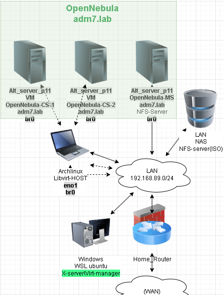
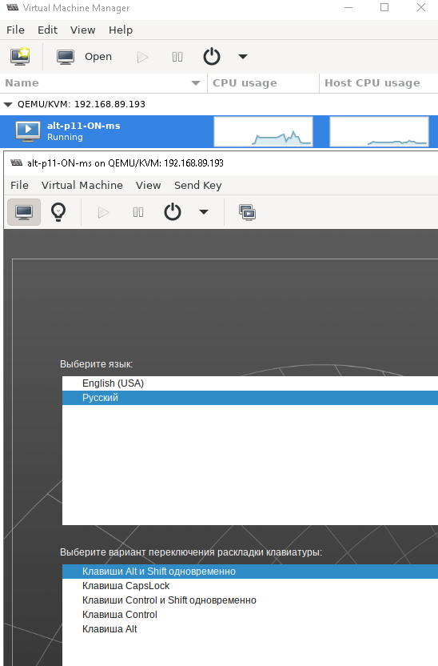
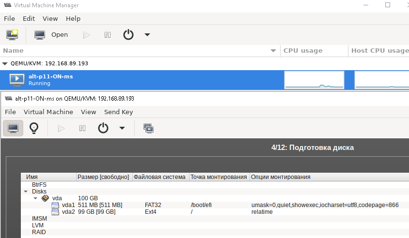
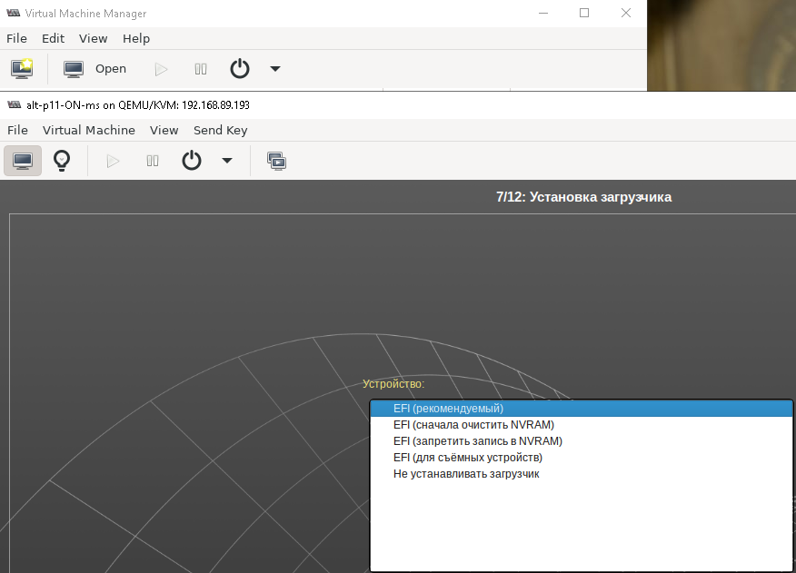
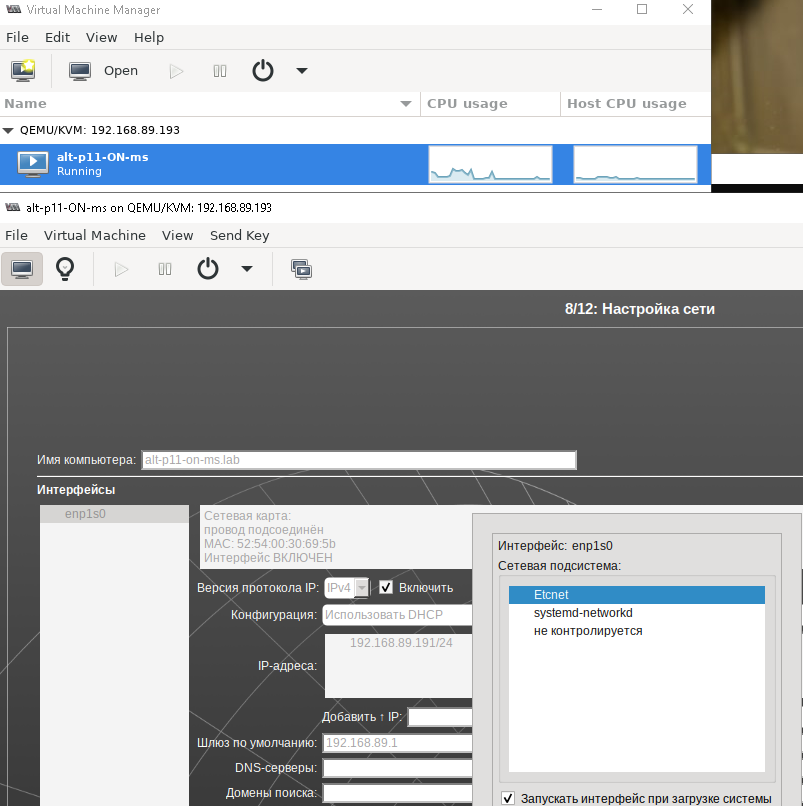
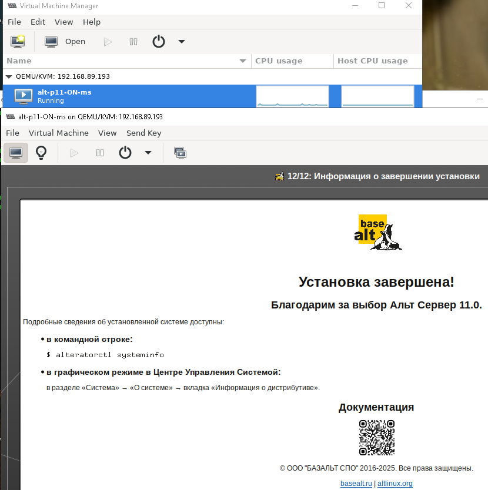
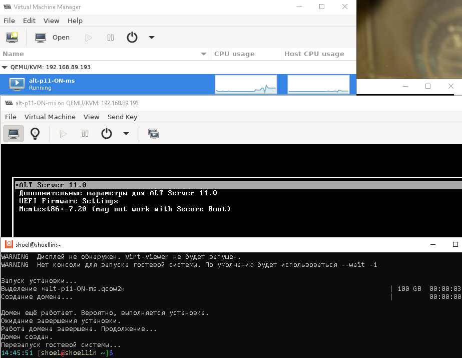
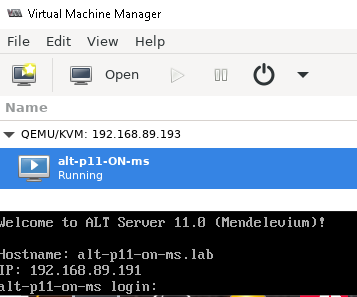

# Лабораторная работа 9 «`OpenNebula`» 
## Памятка входа
```bash
# Включаем агента в текущей оснастке для подключения к машине libvirt и виртуальной машине с OpenNebula-MS
> ~/.ssh/known_hosts
eval $(ssh-agent) \
&& ssh-add  ~/.ssh/id_kvm_host \
&& ssh-add ~/.ssh/id_alt-adm7_2026_host_ed25519


# вход на KVM-хост по ключу по ssh и вход под суперпользователя
ssh -t \
-i ~/.ssh/id_kvm_host \
-o StrictHostKeyChecking=accept-new \
shoel@192.168.89.193 \
"sudo su"

# вход на Виртуальны-хост по ключу по ssh и вход под суперпользователя
ssh -t \
-o StrictHostKeyChecking=accept-new \
-i ~/.ssh/id_alt-adm7_2026_host_ed25519.pub \
skvadmin@192.168.89.191 \
"su -"
```
## Подготовка

### Archlinux host libvirt kvm
#### Создание сети моста средствами systemd
```bash
# Включаем агента в текущей оснастке для подключения к KVM хост на archlinux
> ~/.ssh/known_hosts
eval $(ssh-agent) \
&& ssh-add  ~/.ssh/id_kvm_host

# вход на хост по ключу по ssh и вход под суперпользователя
ssh -t \
-i ~/.ssh/id_kvm_host \
-o StrictHostKeyChecking=accept-new \
shoel@192.168.89.193 \
"sudo su"

# отключаем и останавливаем NetworkManager и связанные службы
systemctl \
disable --now \
NetworkManager \
NetworkManager-wait-online

# Включение и запуск служб управления сетью systemd
systemctl \
enable --now \
systemd-networkd \
systemd-resolved


# Создание Интерфейс моста как устройства
cat >/etc/systemd/network/15-br0.netdev<<'EOF'
[NetDev]
Name=br0
Kind=bridge
EOF

# Привязка в существующем конфиге физического Ethernet к мосту
cat >/etc/systemd/network/10-eno1.network<<'EOF'
[Match]
Name=eno1

[Network]
Bridge=br0
EOF

# Сеть моста, создаем настройки IP
cat > /etc/systemd/network/15-br0.network <<'EOF'
[Match]
Name=br0

[Network]
DHCP=ipv4
EOF

# Перезапуск сетевой службы
systemctl restart \
systemd-networkd
```
### Развертывание ВМ средствами virt-manager, подключение с удаленного хоста
```bash
# ЗАпуск агента ssh
> ~/.ssh/known_hosts
eval $(ssh-agent) \
&& ssh-add  ~/.ssh/id_kvm_host

# Подключение на Физический хост
ssh \
-i ~/.ssh/id_kvm_host \
-o StrictHostKeyChecking=accept-new \
shoel@192.168.89.193

# Запуск формирования VM
## 6 GB RAM изолированной памяти
## 4 Виртуальных ядра CPU
## Автоматическое создание дисков системы ВМ, если не существуют:
### в пуле "VMst" размером в 100 GB
## Подключение существующего образа ISO установщика ОС
## Указание типа ОС ВМ "Linux"
## Указание типа дистрибутива "alt.p11"
## Указание возможности и протокола удаленного подключения "spice"
## Указание, вместо стандартного NAT, создание интерфейса моста привязанного к интерфейсу "br0" физического хоста
## Указание, инициализации Виртуальной машины в uefi
sudo virt-install --name alt-p11-ON-ms \
--ram 6144 \
--vcpus=4 \
--disk pool=VMs,size=100,bus=virtio,format=qcow2 \
--cdrom /home/shoel/iso/alt-server-11.0-x86_64.iso \
--os-type=linux \
--os-variant=alt.p11 \
--graphics spice \
--network bridge=br0 \
--boot uefi
```
```
WARNING  --os-type устарел и ничего не делает. Не используйте его.
WARNING  Дисплей не обнаружен. Virt-viewer не будет запущен.
WARNING  Нет консоли для запуска гостевой системы. По умолчанию будет использоваться --wait -1

Запуск установки...
Выделение «alt-p11-ON-ms.qcow2»                                                                  | 100 GB  00:00:03
Создание домена...                                                                               |         00:00:00

Домен ещё работает. Вероятно, выполняется установка.
Ожидание завершения установки.
```
#### Завершение установки средствами virt-manager
```bash
# Установка контекста удаленного доступа, как подключение по умолчанию, для подключения утилитой virsh
export LIBVIRT_DEFAULT_URI=qemu+ssh://shoel@192.168.89.193/system

# Подключение и вы вод рабочего окружения
virsh uri

# Запуск GUI оснастки
virt-manger
```









### Проброс ранее сгенерированного ключа ssh
```bash
ssh-copy-id \
-o StrictHostKeyChecking=accept-new \
-i ~/.ssh/id_alt-adm7_2026_host_ed25519.pub \
skvadmin@192.168.89.191
```
```
/usr/bin/ssh-copy-id: INFO: Source of key(s) to be installed: "/home/shoel/.ssh/id_alt-adm7_2026_host_ed25519.pub"
/usr/bin/ssh-copy-id: INFO: attempting to log in with the new key(s), to filter out any that are already installed
/usr/bin/ssh-copy-id: INFO: 1 key(s) remain to be installed -- if you are prompted now it is to install the new keys
skvadmin@192.168.89.191's password: 

Number of key(s) added: 1

Now try logging into the machine, with: "ssh -i /home/shoel/.ssh/id_alt-adm7_2026_host_ed25519 -o 'StrictHostKeyChecking=accept-new' 'skvadmin@192.168.89.191'"
and check to make sure that only the key(s) you wanted were added.
```
### Подключение и обновление Установленного узла
```bash
> ~/.ssh/known_hosts
eval $(ssh-agent) \
&& ssh-add  ~/.ssh/id_kvm_host \
&& ssh-add ~/.ssh/id_alt-adm7_2026_host_ed25519

# вход на Виртуальны-хост по ключу по ssh и вход под суперпользователя
ssh -t \
-o StrictHostKeyChecking=accept-new \
-i ~/.ssh/id_alt-adm7_2026_host_ed25519.pub \
skvadmin@192.168.89.191 \
"su -"

# Обновление системы
apt-get update \
&& update-kernel -y \
&& apt-get dist-upgrade -y
```
### Создание точки восстановления для дальнейшей работы
```bash
# Выключение ВМ
systemctl poweroff

eval $(ssh-agent) \
&& ssh-add  ~/.ssh/id_kvm_host \
&& ssh-add ~/.ssh/id_alt-adm7_2026_host_ed25519

# вход на KVM-хост по ключу по ssh
ssh -t \
-i ~/.ssh/id_kvm_host \
-o StrictHostKeyChecking=accept-new \
shoel@192.168.89.193

# Вывод списка всех виртуальных машин system контекста libvirt
sudo virsh list --all
```
```
[sudo] пароль для shoel:
 ID   Имя             Состояние
---------------------------------
 -    alt-p11-ON-ms   выключен
```
```bash
# Создание snapshot
sudo virsh snapshot-create-as \
--domain alt-p11-ON-ms \
--name 1 \
--description "lab9" --atomic
```

### Для github и gitflic
```bash
git log --oneline

git branch -v

git switch main

git status

git add . .. ../.. \
&& git status

git remote -v

git commit -am 'оформление для ADM7, lab9 opennebula' \
&& git push \
--set-upstream \
altlinux \
main \
&& git push \
--set-upstream \
altlinux_gf \
main
```
## Выполнение задания
### Установка сервера управления OpenNebula
```bash
apt-get update \
&& apt-get install -y  \
opennebula-server \
opennebula-common \
gem-opennebula-cli \
opennebula-flow \
opennebula-sunstone \
opennebula-gate \
gem-http-cookie

# Добавляем пользовательской Учетной записи работать с libvirt в сессионном режиме
usermod -a -G \
vmusers \
skvadmin

# Запуск службы libvirt для удаленного подключения
systemctl enable --now \
libvirtd.service

systemctl poweroff

# Подключение на Физический хост под супер пользователем
ssh -t \
-i ~/.ssh/id_alt-adm7_2026_host_ed25519 \
skvadmin@192.168.89.212 \
su -


```


