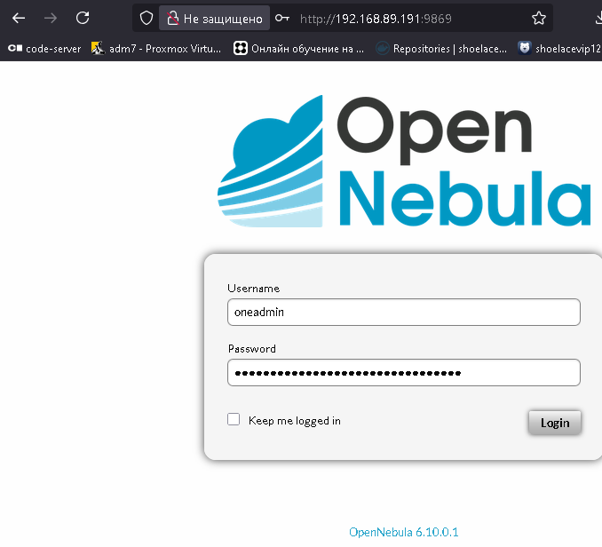
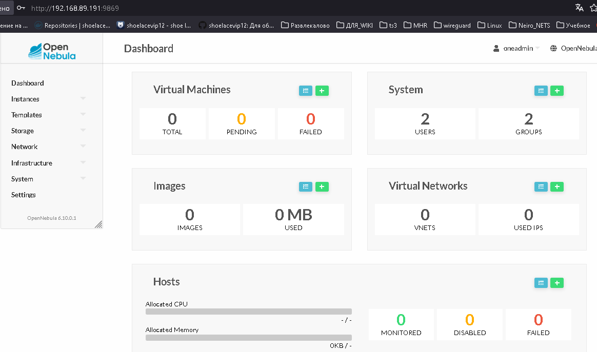
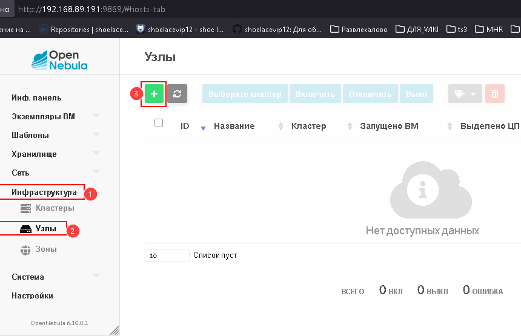
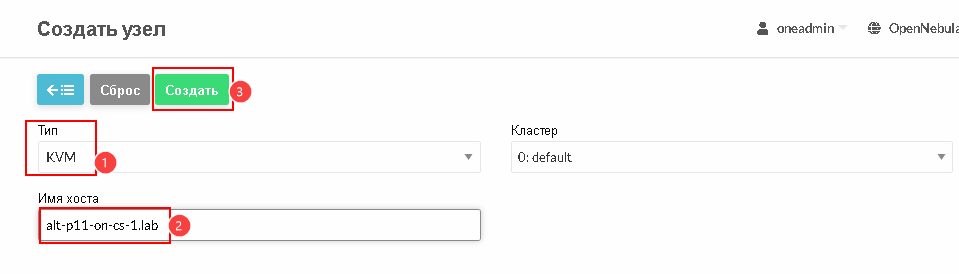

# Лабораторная работа 9 «`OpenNebula`» 
## Памятка входа
```bash
# Включаем агента в текущей оснастке для подключения к машине libvirt и виртуальной машине с OpenNebula-MS
> ~/.ssh/known_hosts
eval $(ssh-agent) \
&& ssh-add  ~/.ssh/id_kvm_host \
&& ssh-add ~/.ssh/id_alt-adm7_2026_host_ed25519


# вход на KVM-хост по ключу по ssh и вход под суперпользователя
ssh -t \
-i ~/.ssh/id_kvm_host \
-o StrictHostKeyChecking=accept-new \
shoel@192.168.89.193 \
"sudo su"

# вход на Виртуальны-хост по ключу по ssh и вход под суперпользователя
ssh -t \
-o StrictHostKeyChecking=accept-new \
-i ~/.ssh/id_alt-adm7_2026_host_ed25519.pub \
skvadmin@192.168.89.191 \
"su -"
```
## Подготовка

### Archlinux host libvirt kvm
#### Создание сети моста средствами systemd
```bash
# Включаем агента в текущей оснастке для подключения к KVM хост на archlinux
> ~/.ssh/known_hosts
eval $(ssh-agent) \
&& ssh-add  ~/.ssh/id_kvm_host

# вход на хост по ключу по ssh и вход под суперпользователя
ssh -t \
-i ~/.ssh/id_kvm_host \
-o StrictHostKeyChecking=accept-new \
shoel@192.168.89.193 \
"sudo su"

# отключаем и останавливаем NetworkManager и связанные службы
systemctl \
disable --now \
NetworkManager \
NetworkManager-wait-online

# Включение и запуск служб управления сетью systemd
systemctl \
enable --now \
systemd-networkd \
systemd-resolved


# Создание Интерфейс моста как устройства
cat >/etc/systemd/network/15-br0.netdev<<'EOF'
[NetDev]
Name=br0
Kind=bridge
EOF

# Привязка в существующем конфиге физического Ethernet к мосту
cat >/etc/systemd/network/10-eno1.network<<'EOF'
[Match]
Name=eno1

[Network]
Bridge=br0
EOF

# Сеть моста, создаем настройки IP
cat > /etc/systemd/network/15-br0.network <<'EOF'
[Match]
Name=br0

[Network]
DHCP=ipv4
EOF

# Перезапуск сетевой службы
systemctl restart \
systemd-networkd
```
### Развертывание ВМ средствами virt-manager, подключение с удаленного хоста
```bash
# ЗАпуск агента ssh
> ~/.ssh/known_hosts
eval $(ssh-agent) \
&& ssh-add  ~/.ssh/id_kvm_host

# Подключение на Физический хост
ssh \
-i ~/.ssh/id_kvm_host \
-o StrictHostKeyChecking=accept-new \
shoel@192.168.89.193

# Запуск формирования VM
## 6 GB RAM изолированной памяти
## 4 Виртуальных ядра CPU
## Автоматическое создание дисков системы ВМ, если не существуют:
### в пуле "VMst" размером в 100 GB
## Подключение существующего образа ISO установщика ОС
## Указание типа ОС ВМ "Linux"
## Указание типа дистрибутива "alt.p11"
## Указание возможности и протокола удаленного подключения "spice"
## Указание, вместо стандартного NAT, создание интерфейса моста привязанного к интерфейсу "br0" физического хоста
## Указание, инициализации Виртуальной машины в uefi
sudo virt-install --name alt-p11-ON-ms \
--ram 6144 \
--vcpus=4 \
--disk pool=VMs,size=100,bus=virtio,format=qcow2 \
--cdrom /home/shoel/iso/alt-server-11.0-x86_64.iso \
--os-type=linux \
--os-variant=alt.p11 \
--graphics spice \
--network bridge=br0 \
--boot uefi
```
```
WARNING  --os-type устарел и ничего не делает. Не используйте его.
WARNING  Дисплей не обнаружен. Virt-viewer не будет запущен.
WARNING  Нет консоли для запуска гостевой системы. По умолчанию будет использоваться --wait -1

Запуск установки...
Выделение «alt-p11-ON-ms.qcow2»                                                                  | 100 GB  00:00:03
Создание домена...                                                                               |         00:00:00

Домен ещё работает. Вероятно, выполняется установка.
Ожидание завершения установки.
```
#### Завершение установки средствами virt-manager
```bash
# Установка контекста удаленного доступа, как подключение по умолчанию, для подключения утилитой virsh
export LIBVIRT_DEFAULT_URI=qemu+ssh://shoel@192.168.89.193/system

# Подключение и вы вод рабочего окружения
virsh uri

# Запуск GUI оснастки
virt-manger
```


### Проброс ранее сгенерированного ключа ssh
```bash
ssh-copy-id \
-o StrictHostKeyChecking=accept-new \
-i ~/.ssh/id_alt-adm7_2026_host_ed25519.pub \
skvadmin@192.168.89.191
```
```
/usr/bin/ssh-copy-id: INFO: Source of key(s) to be installed: "/home/shoel/.ssh/id_alt-adm7_2026_host_ed25519.pub"
/usr/bin/ssh-copy-id: INFO: attempting to log in with the new key(s), to filter out any that are already installed
/usr/bin/ssh-copy-id: INFO: 1 key(s) remain to be installed -- if you are prompted now it is to install the new keys
skvadmin@192.168.89.191's password: 

Number of key(s) added: 1

Now try logging into the machine, with: "ssh -i /home/shoel/.ssh/id_alt-adm7_2026_host_ed25519 -o 'StrictHostKeyChecking=accept-new' 'skvadmin@192.168.89.191'"
and check to make sure that only the key(s) you wanted were added.
```
### Подключение и обновление Установленного узла
```bash
> ~/.ssh/known_hosts
eval $(ssh-agent) \
&& ssh-add  ~/.ssh/id_kvm_host \
&& ssh-add ~/.ssh/id_alt-adm7_2026_host_ed25519

# вход на Виртуальны-хост по ключу по ssh и вход под суперпользователя
ssh -t \
-o StrictHostKeyChecking=accept-new \
-i ~/.ssh/id_alt-adm7_2026_host_ed25519.pub \
skvadmin@192.168.89.191 \
"su -"

# Обновление системы
apt-get update \
&& update-kernel -y \
&& apt-get dist-upgrade -y
```
### Создание точки восстановления для дальнейшей работы
```bash
# Выключение ВМ
systemctl poweroff

eval $(ssh-agent) \
&& ssh-add  ~/.ssh/id_kvm_host \
&& ssh-add ~/.ssh/id_alt-adm7_2026_host_ed25519

# вход на KVM-хост по ключу по ssh
ssh -t \
-i ~/.ssh/id_kvm_host \
-o StrictHostKeyChecking=accept-new \
shoel@192.168.89.193

# Вывод списка всех виртуальных машин system контекста libvirt
sudo virsh list --all
```
```
[sudo] пароль для shoel:
 ID   Имя             Состояние
---------------------------------
 -    alt-p11-ON-ms   выключен
```
```bash
# Создание snapshot
sudo virsh snapshot-create-as \
--domain alt-p11-ON-ms \
--name 1 \
--description "lab9" --atomic
```

### Для github и gitflic
```bash
git log --oneline

git branch -v

git switch main

git status

git add . .. ../.. \
&& git status

git remote -v

git commit -am 'оформление для ADM7, lab9 opennebula' \
&& git push \
--set-upstream \
altlinux \
main \
&& git push \
--set-upstream \
altlinux_gf \
main
```
## Выполнение задания
### Подготовка и Установка сервера управления OpenNebula
#### Установка пакетов
```bash
> ~/.ssh/known_hosts
eval $(ssh-agent) \
&& ssh-add  ~/.ssh/id_kvm_host \
&& ssh-add ~/.ssh/id_alt-adm7_2026_host_ed25519

# вход на KVM-хост по ключу по ssh
ssh -t \
-i ~/.ssh/id_kvm_host \
-o StrictHostKeyChecking=accept-new \
shoel@192.168.89.193

# Вывод списка всех виртуальных машин system контекста libvirt
sudo virsh list --all

# Запуск Виртуальной машины 
sudo virsh start \
--domain alt-p11-ON-ms

# вход на Виртуальны-хост по ключу по ssh и вход под суперпользователя
ssh -t \
-o StrictHostKeyChecking=accept-new \
-i ~/.ssh/id_alt-adm7_2026_host_ed25519.pub \
skvadmin@192.168.89.191 \
"su -"

# Установка пакетов для сервера управления OpenNebula
apt-get update \
&& apt-get install -y \
opennebula-server \
opennebula-common \
gem-opennebula-cli \
opennebula-flow \
opennebula-sunstone \
opennebula-gate \
gem-http-cookie \
bridge-utils \
nfs-clients \
mariadb
```
#### Создание мостового интерфейса
```bash
# Производим базовый вывод информации об ip адресации и интерфейсах
ip -br a
```
```
lo               UNKNOWN        127.0.0.1/8 ::1/128 
enp1s0           UP             192.168.89.191/24 fe80::5054:ff:fe30:695b/64
```
```bash
# вывод имеющихся настроек интересующего интерфейса
cat /etc/net/ifaces/enp1s0/*
```
```
BOOTPROTO=dhcp
TYPE=eth
SYSTEMD_CONTROLLED=no
DISABLED=no
CONFIG_WIRELESS=no
SYSTEMD_BOOTPROTO=dhcp4
CONFIG_IPV4=yes
NM_CONTROLLED=no
ONBOOT=yes
```
```bash
# Создаем новый интерфейс путем копирования имеющихся настроек рабочего интерфейса
cp -r \
/etc/net/ifaces/{enp1s0,vmbr0}

# Меняем в новом интерфейсе тип интерфейса с ethernet на bridge
sed -i 's/eth/bri/' \
/etc/net/ifaces/vmbr0/options

# Добавляем опцию привязки мостового интерфейса к интерфейсу выхода в сеть
sed -i '/bri/aHOST=enp1s0' \
/etc/net/ifaces/vmbr0/options

# Убираем получения ip по dhcp у интерфейса с сетью 
sed -i "s/dhcp/static/" \
/etc/net/ifaces/enp1s0/options

sed -i "s/static4/static/" \
/etc/net/ifaces/enp1s0/options

# вывод информации об интерфейсе с сетью
cat /etc/net/ifaces/enp1s0/*
```
```
BOOTPROTO=static
TYPE=eth
SYSTEMD_CONTROLLED=no
DISABLED=no
CONFIG_WIRELESS=no
SYSTEMD_BOOTPROTO=static
CONFIG_IPV4=yes
NM_CONTROLLED=no
ONBOOT=yes
```
```bash
# вывод информации о мостовом интерфейсе
cat /etc/net/ifaces/vmbr0/*
```
```
BOOTPROTO=dhcp
TYPE=bri
HOST=enp1s0
SYSTEMD_CONTROLLED=no
DISABLED=no
CONFIG_WIRELESS=no
SYSTEMD_BOOTPROTO=dhcp4
CONFIG_IPV4=yes
NM_CONTROLLED=no
ONBOOT=yes
```
```bash
# Выключение и включения интерфейса  с сеть для сброса и перезапуск службы для запуска мостового
ifdown enp1s0 \
&& ifup enp1s0 \
&& systemctl restart network

ping ya.ru -c2
```
```
PING ya.ru (5.255.255.242) 56(84) bytes of data.
64 bytes from ya.ru (5.255.255.242): icmp_seq=1 ttl=57 time=10.4 ms
64 bytes from ya.ru (5.255.255.242): icmp_seq=2 ttl=57 time=10.4 ms

--- ya.ru ping statistics ---
2 packets transmitted, 2 received, 0% packet loss, time 1001ms
rtt min/avg/max/mdev = 10.382/10.409/10.436/0.027 ms
```
#### Работа с пользовательской учетной записью
```bash
# Вывод административной учетной записи OpenNebula с домашним каталогом в /var/lib/one
getent passwd \
oneadmin
```
```
oneadmin:x:9869:9869:Opennebula Daemon User:/var/lib/one:/bin/bash
```
```bash
# Вывод сформированного пароля для административной учетной записи OpenNebula oneadmin
cat /var/lib/one/.one/one_auth
```
```
oneadmin:9c30b60a974a24f5fa06a9daee42af9d
```
```bash
# Изменение пароля oneadmin для возможности входа в ОС как пользователь
passwd oneadmin
```
```
passwd: updating all authentication tokens for user oneadmin.

You can now choose the new password or passphrase.

A valid password should be a mix of upper and lower case letters, digits, and
other characters.  You can use a password containing at least 7 characters
from all of these classes, or a password containing at least 8 characters
from just 3 of these 4 classes.
An upper case letter that begins the password and a digit that ends it do not
count towards the number of character classes used.

A passphrase should be of at least 3 words, 11 to 72 characters long, and
contain enough different characters.

Alternatively, if no one else can see your terminal now, you can pick this as
your password: "Clinch4Mini-Least".

Enter new password: 
Weak password: not enough different characters or classes for this length.
Re-type new password: 
passwd: all authentication tokens updated successfully.
```
#### Подготовка под кластер высокой доступности для снижения простоев основных сервисов OpenNebula
```bash
# Установка MySQL (MariaDB) для хранения конфигурации (на сервере управления): 
systemctl enable --now \
mariadb.service

# Запуск скрипта предварительной установки
mysql_secure_installation
```
```
/usr/bin/mysql_secure_installation: Deprecated program name. It will be removed in a future release, use 'mariadb-secure-installation' instead

NOTE: RUNNING ALL PARTS OF THIS SCRIPT IS RECOMMENDED FOR ALL MariaDB
      SERVERS IN PRODUCTION USE!  PLEASE READ EACH STEP CAREFULLY!

In order to log into MariaDB to secure it, we'll need the current
password for the root user. If you've just installed MariaDB, and
haven't set the root password yet, you should just press enter here.

Enter current password for root (enter for none): 
OK, successfully used password, moving on...

Setting the root password or using the unix_socket ensures that nobody
can log into the MariaDB root user without the proper authorization.

Enable unix_socket authentication? [Y/n] Y
Enabled successfully!
Reloading privilege tables..
 ... Success!


You already have your root account protected, so you can safely answer 'n'.

Change the root password? [Y/n] Y
New password: 
Re-enter new password: 
Password updated successfully!
Reloading privilege tables..
 ... Success!


By default, a MariaDB installation has an anonymous user, allowing anyone
to log into MariaDB without having to have a user account created for
them.  This is intended only for testing, and to make the installation
go a bit smoother.  You should remove them before moving into a
production environment.

Remove anonymous users? [Y/n] Y
 ... Success!

Normally, root should only be allowed to connect from 'localhost'.  This
ensures that someone cannot guess at the root password from the network.

Disallow root login remotely? [Y/n] n
 ... skipping.

By default, MariaDB comes with a database named 'test' that anyone can
access.  This is also intended only for testing, and should be removed
before moving into a production environment.

Remove test database and access to it? [Y/n] Y
 - Dropping test database...
 ... Success!
 - Removing privileges on test database...
 ... Success!

Reloading the privilege tables will ensure that all changes made so far
will take effect immediately.

Reload privilege tables now? [Y/n] Y
 ... Success!

Cleaning up...

All done!  If you've completed all of the above steps, your MariaDB
installation should now be secure.

Thanks for using MariaDB!
```
```bash
# Вход в БД под пользователем root
mysql -u root
```
```
mysql: Deprecated program name. It will be removed in a future release, use '/usr/bin/mariadb' instead
Welcome to the MariaDB monitor.  Commands end with ; or \g.
Your MariaDB connection id is 12
Server version: 11.8.6-MariaDB-alt1 (ALT p11)

Copyright (c) 2000, 2018, Oracle, MariaDB Corporation Ab and others.

Type 'help;' or '\h' for help. Type '\c' to clear the current input statement.

MariaDB [(none)]> GRANT ALL PRIVILEGES ON opennebula.* TO 'oneadmin' IDENTIFIED BY 'Pa$$w0rD';
Query OK, 0 rows affected (0.012 sec)

MariaDB [(none)]> SET GLOBAL TRANSACTION ISOLATION LEVEL READ COMMITTED;
Query OK, 0 rows affected (0.000 sec)

MariaDB [(none)]> \q
Bye
```
```bash
# Сохранение конфигурации
cp /etc/one/oned.conf{,.bak}

# Настройка параметров доступа к базе данных
sed -i '/= "no" ]/r /dev/stdin' /etc/one/oned.conf << 'EOF'
DB = [ BACKEND = "mysql",
       SERVER  = "localhost",
       PORT    = 0,
       USER    = "oneadmin",
       PASSWD  = "Root1234",
       DB_NAME = "opennebula",
       CONNECTIONS = 25,
       COMPARE_BINARY = "no" ]
EOF
```
### Для github и gitflic
```bash
systemctl poweroff

# Создание snapshot
sudo virsh snapshot-create-as \
--domain alt-p11-ON-ms \
--name 2 \
--description "lab9_install" --atomic

git log --oneline

git branch -v

git switch main

git status

git add . .. ../.. \
&& git status

git remote -v

git commit -am 'оформление для ADM7, lab9 opennebula_install' \
&& git push \
--set-upstream \
altlinux \
main \
&& git push \
--set-upstream \
altlinux_gf \
main
```
#### Запуск OpenNebula Управляющего узла
```bash
> ~/.ssh/known_hosts
eval $(ssh-agent) \
&& ssh-add  ~/.ssh/id_kvm_host \
&& ssh-add ~/.ssh/id_alt-adm7_2026_host_ed25519

# вход на KVM-хост по ключу по ssh
ssh -t \
-i ~/.ssh/id_kvm_host \
-o StrictHostKeyChecking=accept-new \
shoel@192.168.89.193

# Вывод списка всех виртуальных машин system контекста libvirt
sudo virsh list --all

# Запуск Виртуальной машины 
sudo virsh start \
--domain alt-p11-ON-ms

# вход на Виртуальны-хост по ключу по ssh и вход под суперпользователя
ssh -t \
-o StrictHostKeyChecking=accept-new \
-i ~/.ssh/id_alt-adm7_2026_host_ed25519.pub \
skvadmin@192.168.89.191 \
"su -"

# Запуск служб
systemctl enable --now \
opennebula \
opennebula-sunstone
```
#### Проверка управляющего узла
```bash
# Проверка подключения к службе OpenNebula
oneuser show
```
```
USER 0 INFORMATION                                                              
ID              : 0                   
NAME            : oneadmin            
GROUP           : oneadmin            
PASSWORD        : 0e44611632e9dc009d378b54755b6c95a5ca85af6f00482cc561f9fcbc4b4937
AUTH_DRIVER     : core                
ENABLED         : Yes                 

TOKENS                                                                          

USER TEMPLATE                                                                   
TOKEN_PASSWORD="e364bd5a20f892d9a3ef230a3773b5c32e410df780f46f215c30e5939dd8746c"

VMS USAGE & QUOTAS                                                              

VMS USAGE & QUOTAS - RUNNING                                                    

DATASTORE USAGE & QUOTAS                                                        

NETWORK USAGE & QUOTAS                                                          

IMAGE USAGE & QUOTAS
```




### Подготовка Вычислительного узла
```bash
# Проброс ранее сгенерированного ключа ssh
ssh-copy-id \
-o StrictHostKeyChecking=accept-new \
-i ~/.ssh/id_alt-adm7_2026_host_ed25519.pub \
skvadmin@192.168.89.212

# Включаем агента в текущей оснастке
> ~/.ssh/known_hosts
eval $(ssh-agent) \
&& ssh-add  ~/.ssh/id_alt-adm7_2026_host_ed25519

# вход на реальный хост по ключу по ssh и вход под суперпользователя
ssh -t \
-i ~/.ssh/id_alt-adm7_2026_host_ed25519 \
-o StrictHostKeyChecking=accept-new \
skvadmin@192.168.89.212 \
"su -"

# Проверка наличе сетевого моста в системе
ip -br a
```
```
lo               UNKNOWN        127.0.0.1/8 ::1/128 
eno1             DOWN           
enp59s0          UP             fe80::ca60:ff:fecc:48f0/64 
vmbr0            UP             192.168.89.212/24 fe80::ca60:ff:fecc:48f0/6
```
```bash
# Проверка настроек интерфейса
cat /etc/net/ifaces/vmbr0/options 
```
```
TYPE=bri
ONBOOT=yes
DISABLED=no
NM_CONTROLLED=no
CONFIG_WIRELESS=no
CONFIG_IPV4=yes
CONFIG_IPV6=no
BOOTPROTO=dhcp
HOST="enp59s0"
SYSTEMD_BOOTPROTO=dhcp4
SYSTEMD_CONTROLLED=no
```
#### Обновление ОС и установка пакетов
```bash
apt-get update \
&& update-kernel -y \
&& apt-get dist-upgrade -y \
&& apt-get install -y \
opennebula-node-kvm \
nfs-clients \
kernel-modules-zfs-6.12 \
zfs-utils \
libvirt-daemon

# Запуск службы libvirtd  и добавление в автозапуск
systemctl enable --now \
libvirtd

# Перезагрузка для вступления в силу установленных модулей
systemctl reboot
```
#### Подготовка к созданию ZFS хранилища
```bash
# ручной запуск модуля zfs
modprobe zfs

# Проверка подключения модуля
lsmod \
| grep zfs
```
```
zfs  5980160  0
spl  139264  1 zfs
```
```bash
# установка загрузки модуля в автозагрузку
sed -i 's/#z/z/' \
/etc/modules-load.d/zfs.conf
```
```bash
# Проверка текущего состояния дисковой разметки в системе
lsblk
```
```
NAME   MAJ:MIN RM   SIZE RO TYPE MOUNTPOINTS
sda      8:0    0 223.6G  0 disk 
├─sda1   8:1    0   511M  0 part /boot/efi
├─sda2   8:2    0 221.7G  0 part /
└─sda3   8:3    0   1.2G  0 part 
└─sda4   8:4    0   198M  0 part 
sdb      8:16   0   1.8T  0 disk
```
#### Создание Структуры ZFS
```bash
# Ищем разделы sda3 sda4 по by-id
ls -lh \
/dev/disk/by-id/ \
| grep "D-part"
```
```
lrwxrwxrwx 1 root root 10 Mar  1 19:58 ata-KINGSTON_SUV500MS240G_50026B778352A11D-part1 -> ../../sda1
lrwxrwxrwx 1 root root 10 Mar  1 19:58 ata-KINGSTON_SUV500MS240G_50026B778352A11D-part2 -> ../../sda2
lrwxrwxrwx 1 root root 10 Mar  1 19:58 ata-KINGSTON_SUV500MS240G_50026B778352A11D-part3 -> ../../sda3
lrwxrwxrwx 1 root root 10 Mar  1 19:58 ata-KINGSTON_SUV500MS240G_50026B778352A11D-part4 -> ../../sda4
```
```bash
# Ищем раздел диска sdb по by-id
ls -lh \
/dev/disk/by-id/ \
| grep "sdb"
```
```
lrwxrwxrwx 1 root root  9 Mar  1 19:58 ata-ST2000DX002-2DV164_Z4ZBDWY1 -> ../../sdb
lrwxrwxrwx 1 root root  9 Mar  1 19:58 scsi-35000c500b24d440e -> ../../sdb
lrwxrwxrwx 1 root root  9 Mar  1 19:58 wwn-0x5000c500b24d440e -> ../../sdb
```
```bash
# Создаем точку монтирования /srv/zfs0, пул ZFS, L2ARC-кеш и ZIL-логи по идентификаторам
# -f - форсирование создания для перезаписи непустых дисков
# -m - точка монтирования (по умолчанию /pool)
zpool create \
-f -m /srv/zfs0 \
zpool-skv \
ata-ST2000DX002-2DV164_Z4ZBDWY1 \
log \
ata-KINGSTON_SUV500MS240G_50026B778352A11D-part4 \
cache \
ata-KINGSTON_SUV500MS240G_50026B778352A11D-part3
```
```bash
# Проверка статуса zfs
zpool status zpool-skv
```
```
pool: zpool-skv
 state: ONLINE
config:

        NAME                                                STATE     READ WRITE CKSUM
        zpool-skv                                           ONLINE       0     0     0
          ata-ST2000DX002-2DV164_Z4ZBDWY1                   ONLINE       0     0     0
        logs
          ata-KINGSTON_SUV500MS240G_50026B778352A11D-part4  ONLINE       0     0     0
        cache
          ata-KINGSTON_SUV500MS240G_50026B778352A11D-part3  ONLINE       0     0     0

errors: No known data errors
```

##### Создание датасетов

```bash
# Для образов с ОС рабочих машин
zfs create \
zpool-skv/working

# Для дополнительных  образов дисков к рабочим машинам и контейнерам
zfs create \
zpool-skv/storage

# Для клонирования и снэпшоты ZFS
zfs create \
zpool-skv/backup

# Просмотр содержимого
zfs list
```
```
NAME                USED  AVAIL  REFER  MOUNTPOINT
zpool-skv           804K  1.76T    96K  /srv/zfs0
zpool-skv/backup     96K  1.76T    96K  /srv/zfs0/backup
zpool-skv/storage    96K  1.76T    96K  /srv/zfs0/storage
zpool-skv/working    96K  1.76T    96K  /srv/zfs0/working
```
```bash
df -hT
```
```
Filesystem        Type      Size  Used Avail Use% Mounted on
udevfs            devtmpfs  5.0M  4.0K  5.0M   1% /dev
runfs             tmpfs      16G  1.1M   16G   1% /run
/dev/sdb2         ext4      218G  3.7G  203G   2% /
tmpfs             tmpfs      16G     0   16G   0% /dev/shm
efivarfs          efivarfs  128K   43K   81K  35% /sys/firmware/efi/efivars
tmpfs             tmpfs     1.0M     0  1.0M   0% /run/credentials/systemd-journald.service
tmpfs             tmpfs      16G     0   16G   0% /tmp
/dev/sdb1         vfat      510M  7.2M  503M   2% /boot/efi
tmpfs             tmpfs     1.0M     0  1.0M   0% /run/credentials/getty@tty1.service
tmpfs             tmpfs     3.2G  4.0K  3.2G   1% /run/user/1000
zpool-skv         zfs       1.8T  128K  1.8T   1% /srv/zfs0
zpool-skv/working zfs       1.8T  128K  1.8T   1% /srv/zfs0/working
zpool-skv/storage zfs       1.8T  128K  1.8T   1% /srv/zfs0/storage
zpool-skv/backup  zfs       1.8T  128K  1.8T   1% /srv/zfs0/backup
```
#### Настройка пользователя oneadmin на вычислительном узле
```bash
# Проверка наличия пользователя после установки
getent passwd \
oneadmin
```
```
oneadmin:x:9869:9869:Opennebula Daemon User:/var/lib/one:/bin/bash
```
```bash
# Смена пароля пользователя oneadmin для взаимодействия с ОС вычислительного узла
passwd oneadmin
```
```
passwd: updating all authentication tokens for user oneadmin.

You can now choose the new password or passphrase.

A valid password should be a mix of upper and lower case letters, digits, and
other characters.  You can use a password containing at least 7 characters
from all of these classes, or a password containing at least 8 characters
from just 3 of these 4 classes.
An upper case letter that begins the password and a digit that ends it do not
count towards the number of character classes used.

A passphrase should be of at least 3 words, 11 to 72 characters long, and
contain enough different characters.

Alternatively, if no one else can see your terminal now, you can pick this as
your password: "Hunger-detect4within".

Enter new password: 
Weak password: not enough different characters or classes for this length.
Re-type new password: 
passwd: all authentication tokens updated successfully.
```

### Организации связности между хостами
#### настройка на уровне /hosts на вычислительном узле alt-p11-on-cs-1
```bash
# Изменение локального файла разрешения имен
cat >> /etc/hosts <<'EOF'
192.168.89.191 alt-p11-on-ms.lab alt-p11-on-ms
192.168.89.212 alt-p11-on-cs-1.lab alt-p11-on-cs-1
EOF

ping -c2 \
alt-p11-on-cs-1

ping -c2 \
alt-p11-on-ms
```
#### проброс ключей на вычислительном узле alt-p11-on-cs-1
```bash
# Копируем эталонную пару ключей сформированную при установке с УПРАВЛЯЮЩЕГО узла alt-p11-on-ms
scp -r \
oneadmin@alt-p11-on-ms:~/.ssh \
/var/lib/one/
```
```
oneadmin@alt-p11-on-ms's password:
id_rsa             100% 2610     1.3MB/s   00:00    
authorized_keys    100%  580   358.4KB/s   00:00    
id_rsa.pub         100%  580   229.5KB/s   00:00    
config             100% 1444   781.7KB/s   00:00
```
```bash
# Смена владельца фалов для пользователя и группы oneadmin
chown oneadmin:oneadmin -R \
/var/lib/one/.ssh

# Просмотр прав доступа до файлов ключей
ls -al /var/lib/one/.ssh/
```
```
drwx------ 2 oneadmin oneadmin 4096 Mar  1 21:23 .
drwxr-x--- 3 oneadmin oneadmin 4096 Mar  1 21:43 ..
-rw------- 1 oneadmin oneadmin  580 Mar  1 21:23 authorized_keys
-rw------- 1 oneadmin oneadmin 1444 Mar  1 21:23 config
-rw------- 1 oneadmin oneadmin 2610 Mar  1 21:23 id_rsa
-rw-r--r-- 1 oneadmin oneadmin  580 Mar  1 21:23 id_rsa.pub
```
```bash
# Вход под пользователем oneadmin
su - oneadmin

# формируем файл .ssh/authorized_keys для формирования списка доверенных подключений
ssh-keyscan \
alt-p11-on-ms \
alt-p11-on-cs-1 \
>> .ssh/authorized_keys
```
```
# alt-p11-on-cs-1:22 SSH-2.0-OpenSSH_9.6
# alt-p11-on-ms:22 SSH-2.0-OpenSSH_9.6
# alt-p11-on-ms:22 SSH-2.0-OpenSSH_9.6
# alt-p11-on-ms:22 SSH-2.0-OpenSSH_9.6
# alt-p11-on-ms:22 SSH-2.0-OpenSSH_9.6
# alt-p11-on-ms:22 SSH-2.0-OpenSSH_9.6
# alt-p11-on-cs-1:22 SSH-2.0-OpenSSH_9.6
# alt-p11-on-cs-1:22 SSH-2.0-OpenSSH_9.6
# alt-p11-on-cs-1:22 SSH-2.0-OpenSSH_9.6
# alt-p11-on-cs-1:22 SSH-2.0-OpenSSH_9.6
```
```bash
# Проверка подключения по ключу на УПРАВЛЯЮЩИЙ хост alt-p11-on-ms
ssh -t \
-i /var/lib/one/.ssh/id_rsa \
oneadmin@alt-p11-on-ms \
"hostnamectl"
```
```
 Static hostname: alt-p11-on-ms.lab
       Icon name: computer-vm
         Chassis: vm 🖴
      Machine ID: fa3957402ec325958e28646769a425a9
         Boot ID: 7272eef2b1344d9eb1520e29cdd5aa2c
    AF_VSOCK CID: 1
  Virtualization: kvm
Operating System: ALT Server 11.1 (Mendelevium)
     CPE OS Name: cpe:/o:alt:server:11.1
          Kernel: Linux 6.12.68-6.12-alt1
    Architecture: x86-64
 Hardware Vendor: QEMU
  Hardware Model: Standard PC _Q35 + ICH9, 2009_
Firmware Version: unknown
   Firmware Date: Wed 2022-02-02
    Firmware Age: 4y 3w 6d                        
Connection to alt-p11-on-ms closed.
```
```bash
# Копируем эталонный список доверенных ssh подключений на УПРАВЛЯЮЩИЙ узл alt-p11-on-ms для пользователя oneadmin
scp \
.ssh/authorized_keys \
oneadmin@alt-p11-on-ms:~/.ssh/
```
```
authorized_keys   100% 2260     2.0MB/s   00:00 
```
```bash
# Проверка файла на нужном месте с нужными правами
ssh -t \
-i /var/lib/one/.ssh/id_rsa \
oneadmin@alt-p11-on-ms \
"ls -alh .ssh/authorized_keys"
```
```
-rw------- 1 oneadmin oneadmin 2.3K Mar  1 21:56 .ssh/authorized_keys
Connection to alt-p11-on-ms closed.
```
```bash
# Выход из пользователя oneadmin
exit
```
#### настройка на уровне /hosts на управляющем узле alt-p11-on-ms
```bash
# Изменение локального файла разрешения имен
cat >> /etc/hosts <<'EOF'
192.168.89.191 alt-p11-on-ms.lab alt-p11-on-ms
192.168.89.212 alt-p11-on-cs-1.lab alt-p11-on-cs-1
EOF

ping -c2 \
alt-p11-on-cs-1

ping -c2 \
alt-p11-on-ms
```

#### Настройка сервера времени Со стороны вычислительного узла alt-p11-on-cs-1
```bash
# Бэкап конфигурации
cp /etc/chrony.conf{,.bak}

# чистка конфига от комментариев
sed -i \
-e '/^[[:space:]]*#/d' \
-e '/^[[:space:]]*$/d' \
/etc/chrony.conf

# Перенастраиваем основной сервер на Московские серверы ВНИИФТРИ ntp3.vniiftri.ru
sed -i 's/pool pool.ntp.org/server ntp3.vniiftri.ru/' \
/etc/chrony.conf

# Добавляем как дополнительный сервер Управляющий сервер OpenNebula alt-p11-on-ms
sed -i  '/iburst/aserver alt-p11-on-ms.lab iburst' \
/etc/chrony.conf

# Указание что хост выступает в роли сервера времени для одного хоста 192.168.89.191 (alt-p11-on-ms)
sed -i '/rtcsync/aallow 192.168.89.191' \
/etc/chrony.conf

# Указываем возможность отвечать клиентам, если к внешнему NTP серверу нет доступа
sed -i '/\/126/alocal stratum 10' \
/etc/chrony.conf

# Перезапуск служб NTP
systemctl restart \
chrony-wait.service \
chronyd.service \
chrony.service

# Проверка NTP с новым сервером
chronyc tracking
```
```
Reference ID    : 596DFB17 (ntp3.vniiftri.ru)
Stratum         : 2
Ref time (UTC)  : Sun Mar 01 18:35:23 2026
System time     : 0.000026320 seconds slow of NTP time
Last offset     : -0.000548437 seconds
RMS offset      : 0.000548437 seconds
Frequency       : 17.831 ppm slow
Residual freq   : -49.106 ppm
Skew            : 0.184 ppm
Root delay      : 0.011581629 seconds
Root dispersion : 0.000144811 seconds
Update interval : 0.0 seconds
Leap status     : Normal
```
```bash
chronyc sources -v
```
```
  .-- Source mode  '^' = server, '=' = peer, '#' = local clock.
 / .- Source state '*' = current best, '+' = combined, '-' = not combined,
| /             'x' = may be in error, '~' = too variable, '?' = unusable.
||                                                 .- xxxx [ yyyy ] +/- zzzz
||      Reachability register (octal) -.           |  xxxx = adjusted offset,
||      Log2(Polling interval) --.      |          |  yyyy = measured offset,
||                                \     |          |  zzzz = estimated error.
||                                 |    |           \
MS Name/IP address         Stratum Poll Reach LastRx Last sample               
===============================================================================
^* ntp3.vniiftri.ru              1   6    17     6    +63us[ +583us] +/- 5130us
^? alt-p11-on-ms.lab             0   7     0     -     +0ns[   +0ns] +/-    0ns
```
```bash
# Проверка открытого порта для клиентов
ss -ulnp | grep :123
```
```
UNCONN 0  0  0.0.0.0:123  0.0.0.0:*  users:(("chronyd",pid=2988,fd=6))
```
```bash
# настройки NTP на вычислительном узле 
cat /etc/chrony.conf
```
```
server ntp3.vniiftri.ru iburst
server alt-p11-on-ms.lab iburst
driftfile /var/lib/chrony/drift
makestep 1.0 3
rtcsync
allow 192.168.89.191
ntsdumpdir /var/lib/chrony
logdir /var/log/chrony
```
#### настройка на уровне /hosts на управляющем узле alt-p11-on-ms
```bash
# Изменение локального файла разрешения имен
cat >> /etc/hosts <<'EOF'
192.168.89.191 alt-p11-on-ms.lab alt-p11-on-ms
192.168.89.212 alt-p11-on-cs-1.lab alt-p11-on-cs-1
EOF

ping -c2 \
alt-p11-on-cs-1

ping -c2 \
alt-p11-on-ms
```
#### Настройка сервера времени Со стороны управляющего узла alt-p11-on-ms
```bash
# Бэкап конфигурации
cp /etc/chrony.conf{,.bak}

# чистка конфига от комментариев
sed -i \
-e '/^[[:space:]]*#/d' \
-e '/^[[:space:]]*$/d' \
/etc/chrony.conf

# Перенастраиваем основной сервер на Московские серверы ВНИИФТРИ ntp3.vniiftri.ru
sed -i 's/pool pool.ntp.org/server ntp3.vniiftri.ru/' \
/etc/chrony.conf

# Добавляем как дополнительный сервер вычислительный сервер OpenNebula alt-p11-on-cs-1
sed -i  '/iburst/aserver alt-p11-on-cs-1.lab iburst' \
/etc/chrony.conf

# Указание что хост выступает в роли сервера времени для одного хоста 192.168.89.212 (alt-p11-on-cs-1)
sed -i '/rtcsync/aallow 192.168.89.212' \
/etc/chrony.conf

# Указываем возможность отвечать клиентам, если к внешнему NTP серверу нет доступа
sed -i '/\/126/alocal stratum 10' \
/etc/chrony.conf

# Перезапуск служб NTP
systemctl restart \
chrony-wait.service \
chronyd.service \
chrony.service

# Проверка NTP с новым сервером
chronyc tracking
```
```
Reference ID    : C0A859D4 (alt-p11-on-cs-1.lab)
Stratum         : 3
Ref time (UTC)  : Sun Mar 01 19:07:51 2026
System time     : 0.000115931 seconds slow of NTP time
Last offset     : -0.000252256 seconds
RMS offset      : 0.000252256 seconds
Frequency       : 29.927 ppm slow
Residual freq   : +4.413 ppm
Skew            : 0.051 ppm
Root delay      : 0.010391787 seconds
Root dispersion : 0.000246452 seconds
Update interval : 2.0 seconds
Leap status     : Normal
```
```bash
chronyc sources -v
```
```
  .-- Source mode  '^' = server, '=' = peer, '#' = local clock.
 / .- Source state '*' = current best, '+' = combined, '-' = not combined,
| /             'x' = may be in error, '~' = too variable, '?' = unusable.
||                                                 .- xxxx [ yyyy ] +/- zzzz
||      Reachability register (octal) -.           |  xxxx = adjusted offset,
||      Log2(Polling interval) --.      |          |  yyyy = measured offset,
||                                \     |          |  zzzz = estimated error.
||                                 |    |           \
MS Name/IP address         Stratum Poll Reach LastRx Last sample               
===============================================================================
^+ ntp3.vniiftri.ru              1   6    17    20   -300us[ -552us] +/- 6553us
^* alt-p11-on-cs-1.lab           2   6    17    19   +234us[  -19us] +/- 5410us
```
```bash
# Проверка открытого порта для клиентов
ss -ulnp | grep :123
```
```
UNCONN 0  0  0.0.0.0:123  0.0.0.0:*  users:(("chronyd",pid=8372,fd=6))
```
```bash
# настройки NTP на вычислительном узле 
cat /etc/chrony.conf
```
```
server ntp3.vniiftri.ru iburst
server alt-p11-on-cs-1.lab iburst
driftfile /var/lib/chrony/drift
makestep 1.0 3
rtcsync
allow 192.168.89.212
ntsdumpdir /var/lib/chrony
logdir /var/log/chrony
```
#### Проверка связности хостов со стороны УПРАВЛЯЮЩЕГО сервера
```bash
# Вход под пользователем oneadmin
su - oneadmin

# Проверка подключения по ключу на УПРАВЛЯЮЩИЙ хост alt-p11-on-ms
ssh -t \
-i .ssh/id_rsa \
oneadmin@alt-p11-on-cs-1 \
"hostnamectl"
```
```
Warning: Permanently added 'alt-p11-on-cs-1' (ED25519) to the list of known hosts.
 Static hostname: alt-p11-on-cs-1.lab
       Icon name: computer-desktop
         Chassis: desktop 🖥️
      Machine ID: 85175bf7b0a1abbd61d9365b69a46ed2
         Boot ID: 1765b811ed45475d8fb738802fc40d4b
Operating System: ALT Server 11.1 (Mendelevium)
     CPE OS Name: cpe:/o:alt:server:11.1
          Kernel: Linux 6.12.68-6.12-alt1
    Architecture: x86-64
 Hardware Vendor: ASUSTeK COMPUTER INC.
  Hardware Model: P8Z77-V PREMIUM
Firmware Version: 2104
   Firmware Date: Tue 2013-08-13
    Firmware Age: 12y 6month 2w 4d                
Connection to alt-p11-on-cs-1 closed.
```

### Создание точки восстановления для Управляющего узла
```bash
# Выключение ВМ
systemctl poweroff

eval $(ssh-agent) \
&& ssh-add  ~/.ssh/id_kvm_host \
; ssh-add ~/.ssh/id_alt-adm7_2026_host_ed25519

# вход на KVM-хост по ключу по ssh
ssh -t \
-i ~/.ssh/id_kvm_host \
-o StrictHostKeyChecking=accept-new \
shoel@192.168.89.193

# Вывод списка всех виртуальных машин system контекста libvirt
sudo virsh list --all
```
```
[sudo] пароль для shoel:
 ID   Имя             Состояние
---------------------------------
 -    alt-p11-ON-ms   выключен
```
```bash
# Создание snapshot
sudo virsh snapshot-create-as \
--domain alt-p11-ON-ms \
--name 3 \
--description "lab9_ready_for_connect" --atomic
```

### Для github и gitflic
```bash
git log --oneline

git branch -v

git switch main

git status

git add . .. ../.. \
&& git status

git remote -v

git commit -am 'оформление для ADM7, lab9 opennebula_ready_to_add' \
&& git push \
--set-upstream \
altlinux \
main \
&& git push \
--set-upstream \
altlinux_gf \
main
```


