# Лабораторная работа 9 «`OpenNebula`» 
## Памятка входа
```bash
# Включаем агента в текущей оснастке для подключения к машине libvirt и виртуальной машине с OpenNebula-MS
> ~/.ssh/known_hosts
eval $(ssh-agent) \
&& ssh-add  ~/.ssh/id_kvm_host \
&& ssh-add ~/.ssh/id_alt-adm7_2026_host_ed25519


# вход на KVM-хост по ключу по ssh и вход под суперпользователя
ssh -t \
-i ~/.ssh/id_kvm_host \
-o StrictHostKeyChecking=accept-new \
shoel@192.168.89.193 \
"sudo su"

# вход на Виртуальны-хост по ключу по ssh и вход под суперпользователя
ssh -t \
-o StrictHostKeyChecking=accept-new \
-i ~/.ssh/id_alt-adm7_2026_host_ed25519.pub \
skvadmin@192.168.89.191 \
"su -"
```
## Подготовка
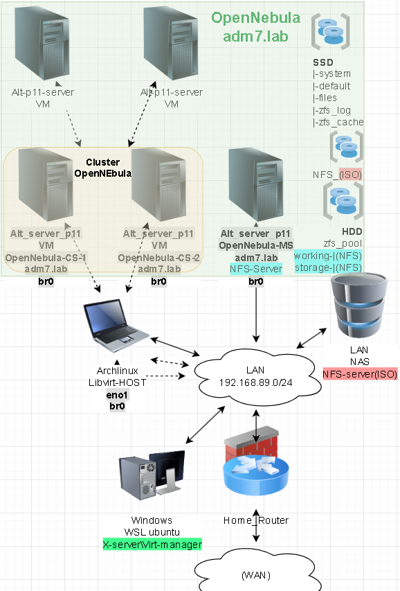
### Archlinux host libvirt kvm
#### Включение nested виртуализации
```bash
# Включаем агента в текущей оснастке для подключения к KVM хост на archlinux
> ~/.ssh/known_hosts
eval $(ssh-agent) \
&& ssh-add  ~/.ssh/id_kvm_host

# вход на хост по ключу по ssh и вход под суперпользователя
ssh -t \
-i ~/.ssh/id_kvm_host \
-o StrictHostKeyChecking=accept-new \
shoel@192.168.89.193 \
"sudo su"

# Проверка вложенной виртуализации компьютером на процессоре AMD 
# (если intel заменить amd в команде ниже)
cat /sys/module/kvm_amd/parameters/nested
```
```
1
```
```bash
# Предварительно выключить все виртуальные машины на хосте
# и выгрузить модуль ядра kvm для процессора amd
 sudo modprobe \
 -r \
 kvm_amd

# Включение модуля kvm с включенной nested виртуализацией, работающей до перезапуска хоста
options \
kvm_amd \
nested=1

# Выставление опции загрузки nested виртуализации в автозапуск
echo "options kvm_amd nested=1" \
>> /etc/modprobe.d/kvm.conf
```
#### Создание сети моста средствами systemd
```bash
# отключаем и останавливаем NetworkManager и связанные службы
systemctl \
disable --now \
NetworkManager \
NetworkManager-wait-online

# Включение и запуск служб управления сетью systemd
systemctl \
enable --now \
systemd-networkd \
systemd-resolved


# Создание Интерфейс моста как устройства
cat >/etc/systemd/network/15-br0.netdev<<'EOF'
[NetDev]
Name=br0
Kind=bridge
EOF

# Привязка в существующем конфиге физического Ethernet к мосту
cat >/etc/systemd/network/10-eno1.network<<'EOF'
[Match]
Name=eno1

[Network]
Bridge=br0
EOF

# Сеть моста, создаем настройки IP
cat > /etc/systemd/network/15-br0.network <<'EOF'
[Match]
Name=br0

[Network]
DHCP=ipv4
EOF

# Перезапуск сетевой службы
systemctl restart \
systemd-networkd
```
### Развертывание ВМ средствами virt-manager, подключение с удаленного хоста
```bash
# ЗАпуск агента ssh
> ~/.ssh/known_hosts
eval $(ssh-agent) \
&& ssh-add  ~/.ssh/id_kvm_host

# Подключение на Физический хост
ssh \
-i ~/.ssh/id_kvm_host \
-o StrictHostKeyChecking=accept-new \
shoel@192.168.89.193

# Запуск формирования VM
## 6 GB RAM изолированной памяти
## 4 Виртуальных ядра CPU
## Автоматическое создание дисков системы ВМ, если не существуют:
### в пуле "VMst" размером в 100 GB
## Подключение существующего образа ISO установщика ОС
## Указание типа ОС ВМ "Linux"
## Указание типа дистрибутива "alt.p11"
## Указание возможности и протокола удаленного подключения "spice"
## Указание, вместо стандартного NAT, создание интерфейса моста привязанного к интерфейсу "br0" физического хоста
## Указание, инициализации Виртуальной машины в uefi
sudo virt-install --name alt-p11-ON-cs-1 \
--ram 6144 \
--vcpus=4 \
--disk pool=VMs,size=100,bus=virtio,format=qcow2 \
--cdrom /home/shoel/iso/alt-server-11.0-x86_64.iso \
--os-type=linux \
--os-variant=alt.p11 \
--graphics spice \
--network bridge=br0 \
--boot uefi
```
```
WARNING  --os-type устарел и ничего не делает. Не используйте его.
WARNING  Дисплей не обнаружен. Virt-viewer не будет запущен.
WARNING  Нет консоли для запуска гостевой системы. По умолчанию будет использоваться --wait -1

Запуск установки...
Выделение «alt-p11-ON-cs-1.qcow2»    | 100 GB  00:00:01
Создание домена...                   |         00:00:00

Домен ещё работает. Вероятно, выполняется установка.
Ожидание завершения установки.
```
```bash
# Запуск формирования VM
## 6 GB RAM изолированной памяти
## 4 Виртуальных ядра CPU
## Автоматическое создание дисков системы ВМ, если не существуют:
### в пуле "VMst" размером в 100 GB
## Подключение существующего образа ISO установщика ОС
## Указание типа ОС ВМ "Linux"
## Указание типа дистрибутива "alt.p11"
## Указание возможности и протокола удаленного подключения "spice"
## Указание, вместо стандартного NAT, создание интерфейса моста привязанного к интерфейсу "br0" физического хоста
## Указание, инициализации Виртуальной машины в uefi
sudo virt-install --name alt-p11-ON-cs-2 \
--ram 6144 \
--vcpus=4 \
--disk pool=VMs,size=100,bus=virtio,format=qcow2 \
--cdrom /home/shoel/iso/alt-server-11.0-x86_64.iso \
--os-type=linux \
--os-variant=alt.p11 \
--graphics spice \
--network bridge=br0 \
--boot uefi
```
```
WARNING  --os-type устарел и ничего не делает. Не используйте его.
WARNING  Дисплей не обнаружен. Virt-viewer не будет запущен.
WARNING  Нет консоли для запуска гостевой системы. По умолчанию будет использоваться --wait -1

Запуск установки...
Выделение «alt-p11-ON-cs-2.qcow2»                                      | 100 GB  00:00:01     
Создание домена...                                                     |         00:00:00     

Домен ещё работает. Вероятно, выполняется установка.
Ожидание завершения установки.
Работа домена завершена. Продолжение...
```
#### Завершение установки средствами virt-manager
```bash
# Установка контекста удаленного доступа, как подключение по умолчанию, для подключения утилитой virsh
export LIBVIRT_DEFAULT_URI=qemu+ssh://shoel@192.168.89.193/system

# Подключение и вы вод рабочего окружения
virsh uri

# Запуск GUI оснастки
virt-manger
```


### Проброс ранее сгенерированного ключа ssh
```bash
ssh-copy-id \
-o StrictHostKeyChecking=accept-new \
-i ~/.ssh/id_alt-adm7_2026_host_ed25519.pub \
skvadmin@192.168.89.190
```
```
/usr/bin/ssh-copy-id: INFO: Source of key(s) to be installed: "/home/shoel/.ssh/id_alt-adm7_2026_host_ed25519.pub"
/usr/bin/ssh-copy-id: INFO: attempting to log in with the new key(s), to filter out any that are already installed
/usr/bin/ssh-copy-id: INFO: 1 key(s) remain to be installed -- if you are prompted now it is to install the new keys
skvadmin@192.168.89.190's password: 

Number of key(s) added: 1

Now try logging into the machine, with: "ssh -i /home/shoel/.ssh/id_alt-adm7_2026_host_ed25519 -o 'StrictHostKeyChecking=accept-new' 'skvadmin@192.168.89.190'"
and check to make sure that only the key(s) you wanted were added.
```
```bash
ssh-copy-id \
-o StrictHostKeyChecking=accept-new \
-i ~/.ssh/id_alt-adm7_2026_host_ed25519.pub \
skvadmin@192.168.89.189
```
```
/usr/bin/ssh-copy-id: INFO: Source of key(s) to be installed: "/home/shoel/.ssh/id_alt-adm7_2026_host_ed25519.pub"
/usr/bin/ssh-copy-id: INFO: attempting to log in with the new key(s), to filter out any that are already installed
/usr/bin/ssh-copy-id: INFO: 1 key(s) remain to be installed -- if you are prompted now it is to install the new keys
skvadmin@192.168.89.189's password: 

Number of key(s) added: 1

Now try logging into the machine, with: "ssh -i /home/shoel/.ssh/id_alt-adm7_2026_host_ed25519 -o 'StrictHostKeyChecking=accept-new' 'skvadmin@192.168.89.189'"
and check to make sure that only the key(s) you wanted were added.
```
### Подключение и обновление Установленного узла
```bash
> ~/.ssh/known_hosts
eval $(ssh-agent) \
&& ssh-add  ~/.ssh/id_kvm_host \
; ssh-add ~/.ssh/id_alt-adm7_2026_host_ed25519

# вход на Виртуальны-хост по ключу по ssh и вход под суперпользователя
ssh -t \
-o StrictHostKeyChecking=accept-new \
-i ~/.ssh/id_alt-adm7_2026_host_ed25519.pub \
skvadmin@192.168.89.190 \
"su -"

# Обновление системы
apt-get update \
&& update-kernel -y \
&& apt-get dist-upgrade -y

# вход на Виртуальны-хост по ключу по ssh и вход под суперпользователя
ssh -t \
-o StrictHostKeyChecking=accept-new \
-i ~/.ssh/id_alt-adm7_2026_host_ed25519.pub \
skvadmin@192.168.89.189 \
"su -"

# Обновление системы
apt-get update \
&& update-kernel -y \
&& apt-get dist-upgrade -y
```
### Создание точки восстановления для дальнейшей работы
```bash
# Выключение ВМ
systemctl poweroff

eval $(ssh-agent) \
&& ssh-add  ~/.ssh/id_kvm_host \
; ssh-add ~/.ssh/id_alt-adm7_2026_host_ed25519

# вход на KVM-хост по ключу по ssh
ssh -t \
-i ~/.ssh/id_kvm_host \
-o StrictHostKeyChecking=accept-new \
shoel@192.168.89.193

# Вывод списка всех виртуальных машин system контекста libvirt
sudo virsh list --all
```
```
 ID   Имя               Состояние
-----------------------------------
 -    alt-p11-ON-cs-1   выключен
 -    alt-p11-ON-cs-2   выключен
```
```bash
# Создание snapshot
sudo virsh snapshot-create-as \
--domain alt-p11-ON-cs-1 \
--name 1 \
--description "lab9" --atomic
```
```bash
# Создание snapshot
sudo virsh snapshot-create-as \
--domain alt-p11-ON-cs-2 \
--name 1 \
--description "lab9" --atomic
```

### Для github и gitflic
```bash
git log --oneline

git branch -v

git switch main

git status

git add . .. ../.. \
&& git status

git remote -v

git commit -am 'оформление для ADM7, lab9 opennebula' \
&& git push \
--set-upstream \
altlinux \
main \
&& git push \
--set-upstream \
altlinux_gf \
main
```
## Выполнение задания
### Подготовка Управляющего узла
```bash
# Проброс ранее сгенерированного ключа ssh
ssh-copy-id \
-o StrictHostKeyChecking=accept-new \
-i ~/.ssh/id_alt-adm7_2026_host_ed25519.pub \
skvadmin@192.168.89.212

# Включаем агента в текущей оснастке
> ~/.ssh/known_hosts
eval $(ssh-agent) \
&& ssh-add  ~/.ssh/id_alt-adm7_2026_host_ed25519

# вход на реальный хост по ключу по ssh и вход под суперпользователя
ssh -t \
-i ~/.ssh/id_alt-adm7_2026_host_ed25519 \
-o StrictHostKeyChecking=accept-new \
skvadmin@192.168.89.212 \
"su -"

# Проверка наличе сетевого моста в системе
ip -br a
```
```
lo               UNKNOWN        127.0.0.1/8 ::1/128 
eno1             DOWN           
enp59s0          UP             fe80::ca60:ff:fecc:48f0/64 
br0              UP             192.168.89.212/24 fe80::ca60:ff:fecc:48f0/64
```
```bash
# Проверка настроек интерфейса
cat /etc/net/ifaces/br0/options 
```
```
TYPE=bri
ONBOOT=yes
DISABLED=no
NM_CONTROLLED=no
CONFIG_WIRELESS=no
CONFIG_IPV4=yes
CONFIG_IPV6=no
BOOTPROTO=dhcp
HOST="enp59s0"
SYSTEMD_BOOTPROTO=dhcp4
SYSTEMD_CONTROLLED=no
```
#### Обновление ОС и установка пакетов
```bash
# Установка пакетов для сервера управления OpenNebula
apt-get update \
&& update-kernel -y \
&& apt-get dist-upgrade -y \
&& apt-get install -y \
opennebula-server \
opennebula-common \
gem-opennebula-cli \
opennebula-flow \
opennebula-sunstone \
opennebula-gate \
gem-http-cookie \
bridge-utils \
nfs-clients \
rpcbind \
nfs-server \
mariadb \
kernel-modules-zfs-6.12 \
zfs-utils


# Перезагрузка для вступления в силу установленных модулей
systemctl reboot
```
#### Подготовка к созданию ZFS хранилища
```bash
# ручной запуск модуля zfs
modprobe zfs

# Проверка подключения модуля
lsmod \
| grep zfs
```
```
zfs  5980160  0
spl  139264  1 zfs
```
```bash
# установка загрузки модуля в автозагрузку
sed -i 's/#z/z/' \
/etc/modules-load.d/zfs.conf
```
```bash
# Проверка текущего состояния дисковой разметки в системе
lsblk
```
```
NAME   MAJ:MIN RM   SIZE RO TYPE MOUNTPOINTS
sda      8:0    0 223.6G  0 disk 
├─sda1   8:1    0   511M  0 part /boot/efi
├─sda2   8:2    0 221.7G  0 part /
└─sda3   8:3    0   1.2G  0 part 
└─sda4   8:4    0   198M  0 part 
sdb      8:16   0   1.8T  0 disk
```
#### Создание Структуры ZFS
```bash
# Ищем разделы sda3 sda4 по by-id
ls -lh \
/dev/disk/by-id/ \
| grep "D-part"
```
```
lrwxrwxrwx 1 root root 10 Mar  1 19:58 ata-KINGSTON_SUV500MS240G_50026B778352A11D-part1 -> ../../sda1
lrwxrwxrwx 1 root root 10 Mar  1 19:58 ata-KINGSTON_SUV500MS240G_50026B778352A11D-part2 -> ../../sda2
lrwxrwxrwx 1 root root 10 Mar  1 19:58 ata-KINGSTON_SUV500MS240G_50026B778352A11D-part3 -> ../../sda3
lrwxrwxrwx 1 root root 10 Mar  1 19:58 ata-KINGSTON_SUV500MS240G_50026B778352A11D-part4 -> ../../sda4
```
```bash
# Ищем раздел диска sdb по by-id
ls -lh \
/dev/disk/by-id/ \
| grep "sdb"
```
```
lrwxrwxrwx 1 root root  9 Mar  1 19:58 ata-ST2000DX002-2DV164_Z4ZBDWY1 -> ../../sdb
lrwxrwxrwx 1 root root  9 Mar  1 19:58 scsi-35000c500b24d440e -> ../../sdb
lrwxrwxrwx 1 root root  9 Mar  1 19:58 wwn-0x5000c500b24d440e -> ../../sdb
```
```bash
# Создаем точку монтирования /srv/zfs0, пул ZFS, L2ARC-кеш и ZIL-логи по идентификаторам
# -f - форсирование создания для перезаписи непустых дисков
# -m - точка монтирования (по умолчанию /pool)
zpool create \
-f -m /srv/zfs0 \
zpool-skv \
ata-ST2000DX002-2DV164_Z4ZBDWY1 \
log \
ata-KINGSTON_SUV500MS240G_50026B778352A11D-part4 \
cache \
ata-KINGSTON_SUV500MS240G_50026B778352A11D-part3
```
```bash
# Проверка статуса zfs
zpool status zpool-skv
```
```
pool: zpool-skv
 state: ONLINE
config:

        NAME                                                STATE     READ WRITE CKSUM
        zpool-skv                                           ONLINE       0     0     0
          ata-ST2000DX002-2DV164_Z4ZBDWY1                   ONLINE       0     0     0
        logs
          ata-KINGSTON_SUV500MS240G_50026B778352A11D-part4  ONLINE       0     0     0
        cache
          ata-KINGSTON_SUV500MS240G_50026B778352A11D-part3  ONLINE       0     0     0

errors: No known data errors
```

##### Создание датасетов

```bash
# Для образов с ОС рабочих машин
zfs create \
zpool-skv/working

# Для дополнительных  образов дисков к рабочим машинам и контейнерам
zfs create \
zpool-skv/storage

# Для клонирования и снэпшоты ZFS
zfs create \
zpool-skv/backup

# Просмотр содержимого
zfs list
```
```
NAME                USED  AVAIL  REFER  MOUNTPOINT
zpool-skv           804K  1.76T    96K  /srv/zfs0
zpool-skv/backup     96K  1.76T    96K  /srv/zfs0/backup
zpool-skv/storage    96K  1.76T    96K  /srv/zfs0/storage
zpool-skv/working    96K  1.76T    96K  /srv/zfs0/working
```
```bash
df -hT
```
```
Filesystem        Type      Size  Used Avail Use% Mounted on
udevfs            devtmpfs  5.0M  4.0K  5.0M   1% /dev
runfs             tmpfs      16G  1.1M   16G   1% /run
/dev/sdb2         ext4      218G  3.7G  203G   2% /
tmpfs             tmpfs      16G     0   16G   0% /dev/shm
efivarfs          efivarfs  128K   43K   81K  35% /sys/firmware/efi/efivars
tmpfs             tmpfs     1.0M     0  1.0M   0% /run/credentials/systemd-journald.service
tmpfs             tmpfs      16G     0   16G   0% /tmp
/dev/sdb1         vfat      510M  7.2M  503M   2% /boot/efi
tmpfs             tmpfs     1.0M     0  1.0M   0% /run/credentials/getty@tty1.service
tmpfs             tmpfs     3.2G  4.0K  3.2G   1% /run/user/1000
zpool-skv         zfs       1.8T  128K  1.8T   1% /srv/zfs0
zpool-skv/working zfs       1.8T  128K  1.8T   1% /srv/zfs0/working
zpool-skv/storage zfs       1.8T  128K  1.8T   1% /srv/zfs0/storage
zpool-skv/backup  zfs       1.8T  128K  1.8T   1% /srv/zfs0/backup
```
#### Настройка пользователя oneadmin на Управляющем узле

```bash
# Вывод административной учетной записи OpenNebula с домашним каталогом в /var/lib/one
getent passwd \
oneadmin
```
```
oneadmin:x:9869:9869:Opennebula Daemon User:/var/lib/one:/bin/bash
```
```bash
# Вывод сформированного пароля для административной учетной записи OpenNebula oneadmin
cat /var/lib/one/.one/one_auth
```
```
oneadmin:0de84a56ad3b8f3b4002682feb3ea00a
```
```bash
# Изменение пароля oneadmin для возможности входа в ОС как пользователь
passwd oneadmin
```
```
passwd: updating all authentication tokens for user oneadmin.

You can now choose the new password or passphrase.

A valid password should be a mix of upper and lower case letters, digits, and
other characters.  You can use a password containing at least 7 characters
from all of these classes, or a password containing at least 8 characters
from just 3 of these 4 classes.
An upper case letter that begins the password and a digit that ends it do not
count towards the number of character classes used.

A passphrase should be of at least 3 words, 11 to 72 characters long, and
contain enough different characters.

Alternatively, if no one else can see your terminal now, you can pick this as
your password: "Clinch4Mini-Least".

Enter new password: 
Weak password: not enough different characters or classes for this length.
Re-type new password: 
passwd: all authentication tokens updated successfully.
```
#### Подготовка под кластер высокой доступности для снижения простоев основных сервисов OpenNebula
```bash
# Установка MySQL (MariaDB) для хранения конфигурации (на сервере управления): 
systemctl enable --now \
mariadb.service

# Запуск скрипта предварительной установки
mysql_secure_installation
```
```
/usr/bin/mysql_secure_installation: Deprecated program name. It will be removed in a future release, use 'mariadb-secure-installation' instead

NOTE: RUNNING ALL PARTS OF THIS SCRIPT IS RECOMMENDED FOR ALL MariaDB
      SERVERS IN PRODUCTION USE!  PLEASE READ EACH STEP CAREFULLY!

In order to log into MariaDB to secure it, we'll need the current
password for the root user. If you've just installed MariaDB, and
haven't set the root password yet, you should just press enter here.

Enter current password for root (enter for none): 
OK, successfully used password, moving on...

Setting the root password or using the unix_socket ensures that nobody
can log into the MariaDB root user without the proper authorization.

Enable unix_socket authentication? [Y/n] Y
Enabled successfully!
Reloading privilege tables..
 ... Success!


You already have your root account protected, so you can safely answer 'n'.

Change the root password? [Y/n] Y
New password: 
Re-enter new password: 
Password updated successfully!
Reloading privilege tables..
 ... Success!


By default, a MariaDB installation has an anonymous user, allowing anyone
to log into MariaDB without having to have a user account created for
them.  This is intended only for testing, and to make the installation
go a bit smoother.  You should remove them before moving into a
production environment.

Remove anonymous users? [Y/n] Y
 ... Success!

Normally, root should only be allowed to connect from 'localhost'.  This
ensures that someone cannot guess at the root password from the network.

Disallow root login remotely? [Y/n] n
 ... skipping.

By default, MariaDB comes with a database named 'test' that anyone can
access.  This is also intended only for testing, and should be removed
before moving into a production environment.

Remove test database and access to it? [Y/n] Y
 - Dropping test database...
 ... Success!
 - Removing privileges on test database...
 ... Success!

Reloading the privilege tables will ensure that all changes made so far
will take effect immediately.

Reload privilege tables now? [Y/n] Y
 ... Success!

Cleaning up...

All done!  If you've completed all of the above steps, your MariaDB
installation should now be secure.

Thanks for using MariaDB!
```
```bash
# Вход в БД под пользователем root
mysql -u root
```
```
mysql: Deprecated program name. It will be removed in a future release, use '/usr/bin/mariadb' instead
Welcome to the MariaDB monitor.  Commands end with ; or \g.
Your MariaDB connection id is 12
Server version: 11.8.6-MariaDB-alt1 (ALT p11)

Copyright (c) 2000, 2018, Oracle, MariaDB Corporation Ab and others.

Type 'help;' or '\h' for help. Type '\c' to clear the current input statement.

MariaDB [(none)]> GRANT ALL PRIVILEGES ON opennebula.* TO 'oneadmin' IDENTIFIED BY 'Pa$$w0rD';
Query OK, 0 rows affected (0.012 sec)

MariaDB [(none)]> SET GLOBAL TRANSACTION ISOLATION LEVEL READ COMMITTED;
Query OK, 0 rows affected (0.000 sec)

MariaDB [(none)]> \q
Bye
```
```bash
# Сохранение конфигурации
cp /etc/one/oned.conf{,.bak}

# Настройка параметров доступа к базе данных
sed -i '/= "no" ]/r /dev/stdin' /etc/one/oned.conf << 'EOF'
DB = [ BACKEND = "mysql",
       SERVER  = "localhost",
       PORT    = 0,
       USER    = "oneadmin",
       PASSWD  = "Root1234",
       DB_NAME = "opennebula",
       CONNECTIONS = 25,
       COMPARE_BINARY = "no" ]
EOF
```
#### Запуск OpenNebula Управляющего узла
```bash
# Запуск служб
systemctl enable --now \
opennebula \
opennebula-sunstone
```
#### Проверка управляющего узла
```bash
# Проверка подключения к службе OpenNebula
oneuser show
```
```
USER 0 INFORMATION                                                              
ID              : 0                   
NAME            : oneadmin            
GROUP           : oneadmin            
PASSWORD        : 0e44611632e9dc009d378b54755b6c95a5ca85af6f00482cc561f9fcbc4b4937
AUTH_DRIVER     : core                
ENABLED         : Yes                 

TOKENS                                                                          

USER TEMPLATE                                                                   
TOKEN_PASSWORD="e364bd5a20f892d9a3ef230a3773b5c32e410df780f46f215c30e5939dd8746c"

VMS USAGE & QUOTAS                                                              

VMS USAGE & QUOTAS - RUNNING                                                    

DATASTORE USAGE & QUOTAS                                                        

NETWORK USAGE & QUOTAS                                                          

IMAGE USAGE & QUOTAS
```


### Подготовка и Установка Вычислительных серверов OpenNebula
#### Установка пакетов
```bash
> ~/.ssh/known_hosts
eval $(ssh-agent) \
&& ssh-add  ~/.ssh/id_kvm_host \
; ssh-add ~/.ssh/id_alt-adm7_2026_host_ed25519

# вход на KVM-хост по ключу по ssh
ssh -t \
-i ~/.ssh/id_kvm_host \
-o StrictHostKeyChecking=accept-new \
shoel@192.168.89.193

# Вывод списка всех виртуальных машин system контекста libvirt
sudo virsh list --all

# Запуск Виртуальных машины 
sudo virsh start \
--domain alt-p11-ON-cs-1

sudo virsh start \
--domain alt-p11-ON-cs-2

# вход на Виртуальны-хост по ключу по ssh и вход под суперпользователя
ssh -t \
-o StrictHostKeyChecking=accept-new \
-i ~/.ssh/id_alt-adm7_2026_host_ed25519.pub \
skvadmin@192.168.89.190 \
"su -"

# Установка пакетов для вычислительного сервера OpenNebula
apt-get update \
&& apt-get install -y \
opennebula-node-kvm \
bridge-utils \
nfs-clients \
libvirt-daemon

# вход на Виртуальны-хост по ключу по ssh и вход под суперпользователя
ssh -t \
-o StrictHostKeyChecking=accept-new \
-i ~/.ssh/id_alt-adm7_2026_host_ed25519.pub \
skvadmin@192.168.89.189 \
"su -"

# Установка пакетов для вычислительного сервера OpenNebula
apt-get update \
&& apt-get install -y \
opennebula-node-kvm \
bridge-utils \
nfs-clients \
libvirt-daemon
```
#### Создание мостового интерфейса
```bash
# Производим базовый вывод информации об ip адресации и интерфейсах
ip -br a
```
```
lo               UNKNOWN        127.0.0.1/8 ::1/128 
enp1s0           UP             192.168.89.190/24 fe80::5054:ff:fea5:19b7/64
```
```
lo               UNKNOWN        127.0.0.1/8 ::1/128 
enp1s0           UP             192.168.89.189/24 fe80::5054:ff:fe25:5010/64
```

```bash
# вывод имеющихся настроек интересующего интерфейса
cat /etc/net/ifaces/enp1s0/*
```
```
BOOTPROTO=dhcp
TYPE=eth
SYSTEMD_CONTROLLED=no
DISABLED=no
CONFIG_WIRELESS=no
SYSTEMD_BOOTPROTO=dhcp4
CONFIG_IPV4=yes
NM_CONTROLLED=no
ONBOOT=yes
```
```bash
# Создаем новый интерфейс путем копирования имеющихся настроек рабочего интерфейса
cp -r \
/etc/net/ifaces/{enp1s0,br0}

# Меняем в новом интерфейсе тип интерфейса с ethernet на bridge
sed -i 's/eth/bri/' \
/etc/net/ifaces/br0/options

# Добавляем опцию привязки мостового интерфейса к интерфейсу выхода в сеть
sed -i '/bri/aHOST=enp1s0' \
/etc/net/ifaces/br0/options

# Убираем получения ip по dhcp у интерфейса с сетью 
sed -i "s/dhcp/static/" \
/etc/net/ifaces/enp1s0/options

sed -i "s/static4/static/" \
/etc/net/ifaces/enp1s0/options

# вывод информации об интерфейсе с сетью
cat /etc/net/ifaces/enp1s0/*
```
```
BOOTPROTO=static
TYPE=eth
SYSTEMD_CONTROLLED=no
DISABLED=no
CONFIG_WIRELESS=no
SYSTEMD_BOOTPROTO=static
CONFIG_IPV4=no
NM_CONTROLLED=no
ONBOOT=yes
CONFIG_IPV6=no
```
```bash
# вывод информации о мостовом интерфейсе
cat /etc/net/ifaces/br0/*
```
```
TYPE=bri
ONBOOT=yes
DISABLED=no
NM_CONTROLLED=no
CONFIG_WIRELESS=no
CONFIG_IPV4=yes
CONFIG_IPV6=no
BOOTPROTO=dhcp
HOST="enp1s0"
SYSTEMD_BOOTPROTO=dhcp4
SYSTEMD_CONTROLLED=no
```
```bash
# Выключение и включения интерфейса  с сеть для сброса и перезапуск службы для запуска мостового
ifdown enp1s0 \
&& ifup enp1s0 \
&& systemctl restart network

# Запуск службы libvirtd  и добавление в автозапуск
systemctl enable --now \
libvirtd

ping ya.ru -c2
```
```
PING ya.ru (5.255.255.242) 56(84) bytes of data.
64 bytes from ya.ru (5.255.255.242): icmp_seq=1 ttl=57 time=10.4 ms
64 bytes from ya.ru (5.255.255.242): icmp_seq=2 ttl=57 time=10.4 ms

--- ya.ru ping statistics ---
2 packets transmitted, 2 received, 0% packet loss, time 1001ms
rtt min/avg/max/mdev = 10.382/10.409/10.436/0.027 ms
```
#### Работа с пользовательской учетной записью
```bash
# Проверка наличия пользователя после установки
getent passwd \
oneadmin
```
```
oneadmin:x:9869:9869:Opennebula Daemon User:/var/lib/one:/bin/bash
```
```bash
# Смена пароля пользователя oneadmin для взаимодействия с ОС вычислительного узла
passwd oneadmin
```
```
passwd: updating all authentication tokens for user oneadmin.

You can now choose the new password or passphrase.

A valid password should be a mix of upper and lower case letters, digits, and
other characters.  You can use a password containing at least 7 characters
from all of these classes, or a password containing at least 8 characters
from just 3 of these 4 classes.
An upper case letter that begins the password and a digit that ends it do not
count towards the number of character classes used.

A passphrase should be of at least 3 words, 11 to 72 characters long, and
contain enough different characters.

Alternatively, if no one else can see your terminal now, you can pick this as
your password: "Hunger-detect4within".

Enter new password: 
Weak password: not enough different characters or classes for this length.
Re-type new password: 
passwd: all authentication tokens updated successfully.
```
### Для github и gitflic
```bash
systemctl poweroff

# Создание snapshot
sudo virsh snapshot-create-as \
--domain alt-p11-ON-cs-1 \
--name 2 \
--description "lab9_install" --atomic

sudo virsh snapshot-create-as \
--domain alt-p11-ON-cs-2 \
--name 2 \
--description "lab9_install" --atomic

git log --oneline

git branch -v

git switch main

git status

git add . .. ../.. \
&& git status

git remote -v

git commit -am 'оформление для ADM7, lab9 opennebula_install' \
&& git push \
--set-upstream \
altlinux \
main \
&& git push \
--set-upstream \
altlinux_gf \
main
```

```bash
> ~/.ssh/known_hosts
eval $(ssh-agent) \
&& ssh-add  ~/.ssh/id_kvm_host \
; ssh-add ~/.ssh/id_alt-adm7_2026_host_ed25519

# вход на KVM-хост по ключу по ssh
ssh -t \
-i ~/.ssh/id_kvm_host \
-o StrictHostKeyChecking=accept-new \
shoel@192.168.89.193

# Вывод списка всех виртуальных машин system контекста libvirt
sudo virsh list --all

# Запуск Виртуальной машины 
sudo virsh start \
--domain alt-p11-ON-cs-1

sudo virsh start \
--domain alt-p11-ON-cs-2

# вход на Виртуальны-хост по ключу по ssh и вход под суперпользователя
ssh -t \
-o StrictHostKeyChecking=accept-new \
-i ~/.ssh/id_alt-adm7_2026_host_ed25519.pub \
skvadmin@192.168.89.190 \
"su -"

# вход на Виртуальны-хост по ключу по ssh и вход под суперпользователя
ssh -t \
-o StrictHostKeyChecking=accept-new \
-i ~/.ssh/id_alt-adm7_2026_host_ed25519.pub \
skvadmin@192.168.89.189 \
"su -"
```

### Организации связности между хостами
#### настройка на уровне /hosts на вычислительных узлах и Управляющем узле
```bash
# Изменение локального файла разрешения имен
cat >> /etc/hosts <<'EOF'
192.168.89.212 alt-p11-on-ms.lab alt-p11-on-ms
192.168.89.190 alt-p11-on-cs-1.lab alt-p11-on-cs-1
192.168.89.189 alt-p11-on-cs-2.lab alt-p11-on-cs-2
EOF

ping -c2 \
alt-p11-on-cs-1

ping -c2 \
alt-p11-on-cs-2

ping -c2 \
alt-p11-on-ms
```
#### проброс ключей Со стороны Управляющего узла
```bash
eval $(ssh-agent) \
&& ssh-add  ~/.ssh/id_alt-adm7_2026_host_ed25519

# вход на реальный хост по ключу по ssh и вход под суперпользователя
ssh -t \
-i ~/.ssh/id_alt-adm7_2026_host_ed25519 \
-o StrictHostKeyChecking=accept-new \
skvadmin@192.168.89.212 \
"su -"

# Вход под пользователем oneadmin
su - oneadmin

# Копируем эталонную пару ключей сформированную при установке с УПРАВЛЯЮЩЕГО узла alt-p11-on-ms
scp -r \
/var/lib/one/.ssh \
oneadmin@alt-p11-on-cs-1:~/

scp -r \
/var/lib/one/.ssh \
oneadmin@alt-p11-on-cs-2:~/
```
```
oneadmin@alt-p11-on-cs-1's password:
id_rsa             100% 2610     1.3MB/s   00:00    
authorized_keys    100%  580   358.4KB/s   00:00    
id_rsa.pub         100%  580   229.5KB/s   00:00    
config             100% 1444   781.7KB/s   00:00
```
```
oneadmin@alt-p11-on-cs-2's password:
id_rsa             100% 2610     3.0MB/s   00:00     
authorized_keys    100%  580   686.8KB/s   00:00    
id_rsa.pub         100%  580   697.6KB/s   00:00    
config             100% 1444     1.4MB/s   00:00
```
```bash
# формируем файл .ssh/authorized_keys для формирования списка доверенных подключений
ssh-keyscan \
alt-p11-on-ms \
alt-p11-on-cs-1 \
alt-p11-on-cs-2 \
> .ssh/known_hosts
```
```
# alt-p11-on-ms:22 SSH-2.0-OpenSSH_9.6
# alt-p11-on-ms:22 SSH-2.0-OpenSSH_9.6
# alt-p11-on-ms:22 SSH-2.0-OpenSSH_9.6
# alt-p11-on-ms:22 SSH-2.0-OpenSSH_9.6
# alt-p11-on-ms:22 SSH-2.0-OpenSSH_9.6
# alt-p11-on-cs-1:22 SSH-2.0-OpenSSH_9.6
# alt-p11-on-cs-1:22 SSH-2.0-OpenSSH_9.6
# alt-p11-on-cs-1:22 SSH-2.0-OpenSSH_9.6
# alt-p11-on-cs-1:22 SSH-2.0-OpenSSH_9.6
# alt-p11-on-cs-1:22 SSH-2.0-OpenSSH_9.6
# alt-p11-on-cs-2:22 SSH-2.0-OpenSSH_9.6
# alt-p11-on-cs-2:22 SSH-2.0-OpenSSH_9.6
# alt-p11-on-cs-2:22 SSH-2.0-OpenSSH_9.6
# alt-p11-on-cs-2:22 SSH-2.0-OpenSSH_9.6
# alt-p11-on-cs-2:22 SSH-2.0-OpenSSH_9.6
```
```bash
# Повторяем копирование с новым файлом known_hosts
scp -r \
/var/lib/one/.ssh \
oneadmin@alt-p11-on-cs-1:~/

scp -r \
/var/lib/one/.ssh \
oneadmin@alt-p11-on-cs-2:~/
```
```
authorized_keys  100%  580   636.1KB/s   00:00    
known_hosts      100% 2523     2.3MB/s   00:00    
config           100% 1444     1.7MB/s   00:00    
id_rsa.pub       100%  580   780.8KB/s   00:00    
id_rsa           100% 2610     3.0MB/s   00:00 
```
```
authorized_keys  100%  580   692.8KB/s   00:00    
known_hosts      100% 2523     2.5MB/s   00:00    
config           100% 1444     1.7MB/s   00:00    
id_rsa.pub       100%  580   888.2KB/s   00:00    
id_rsa           100% 2610     3.6MB/s   00:00
```
```bash
# Проверка подключения по ключу c УПРАВЛЯЮЩЕГО хоста на вычислительные узлы
ssh -t \
-i .ssh/id_rsa \
oneadmin@alt-p11-on-cs-1 \
"hostnamectl"
```
```
 Static hostname: alt-p11-on-cs-1.lab
       Icon name: computer-vm
         Chassis: vm 🖴
      Machine ID: 1948bf8bc172f0268e533f9369a5ea3e
         Boot ID: 953e46046c05444086f2abe97116a1a8
    AF_VSOCK CID: 1
  Virtualization: kvm
Operating System: ALT Server 11.1 (Mendelevium)
     CPE OS Name: cpe:/o:alt:server:11.1
          Kernel: Linux 6.12.68-6.12-alt1
    Architecture: x86-64
 Hardware Vendor: QEMU
  Hardware Model: Standard PC _Q35 + ICH9, 2009_
Firmware Version: unknown
   Firmware Date: Wed 2022-02-02
    Firmware Age: 4y 4w                           
Connection to alt-p11-on-cs-1 closed.
```
```bash
ssh -t \
-i .ssh/id_rsa \
oneadmin@alt-p11-on-cs-2 \
"hostnamectl"
```
```
 Static hostname: alt-p11-on-cs-2.lab
       Icon name: computer-vm
         Chassis: vm 🖴
      Machine ID: 0f9c632ea6cc334f8a8a063e69a5e8e3
         Boot ID: 5ff5a4a753094c8286745d06adcb83df
    AF_VSOCK CID: 1
  Virtualization: kvm
Operating System: ALT Server 11.1 (Mendelevium)
     CPE OS Name: cpe:/o:alt:server:11.1
          Kernel: Linux 6.12.68-6.12-alt1
    Architecture: x86-64
 Hardware Vendor: QEMU
  Hardware Model: Standard PC _Q35 + ICH9, 2009_
Firmware Version: unknown
   Firmware Date: Wed 2022-02-02
    Firmware Age: 4y 4w                           
Connection to alt-p11-on-cs-2 closed.
```
```bash
# Проверка файлов на нужном месте с нужными правами
ssh -t \
-i .ssh/id_rsa \
oneadmin@alt-p11-on-cs-1 \
"ls -alh .ssh/"
```
```
total 28K
drwx------ 2 oneadmin oneadmin 4.0K Mar  3 00:07 .
drwxr-x--- 3 oneadmin oneadmin 4.0K Mar  2 23:39 ..
-rw------- 1 oneadmin oneadmin  580 Mar  3 00:22 authorized_keys
-rw------- 1 oneadmin oneadmin 1.5K Mar  3 00:22 config
-rw------- 1 oneadmin oneadmin 2.6K Mar  3 00:22 id_rsa
-rw-r--r-- 1 oneadmin oneadmin  580 Mar  3 00:22 id_rsa.pub
-rw-r--r-- 1 oneadmin oneadmin 2.5K Mar  3 00:22 known_hosts
Connection to alt-p11-on-cs-1 closed.
```
```bash
ssh -t \
-i .ssh/id_rsa \
oneadmin@alt-p11-on-cs-2 \
"ls -alh .ssh/"
```
```
total 28K
drwx------ 2 oneadmin oneadmin 4.0K Mar  3 00:22 .
drwxr-x--- 3 oneadmin oneadmin 4.0K Mar  2 23:39 ..
-rw------- 1 oneadmin oneadmin  580 Mar  3 00:22 authorized_keys
-rw------- 1 oneadmin oneadmin 1.5K Mar  3 00:22 config
-rw------- 1 oneadmin oneadmin 2.6K Mar  3 00:22 id_rsa
-rw-r--r-- 1 oneadmin oneadmin  580 Mar  3 00:22 id_rsa.pub
-rw-r--r-- 1 oneadmin oneadmin 2.5K Mar  3 00:22 known_hosts
Connection to alt-p11-on-cs-2 closed.
```

#### Проверка связности хостов со стороны Вычислительных серверов
```bash
# Вход под пользователем oneadmin
su - oneadmin

# Проверка подключения по ключу на УПРАВЛЯЮЩИЙ хост alt-p11-on-ms
ssh -t \
-i .ssh/id_rsa \
oneadmin@alt-p11-on-ms \
"hostnamectl"
```
```
 Static hostname: alt-p11-on-ms.lab
       Icon name: computer-desktop
         Chassis: desktop 🖥️
      Machine ID: e97297a723b01ed4ccbd18f069a5d3e2
         Boot ID: 09b2ea32ac534ab5b12f5515e73a8749
Operating System: ALT Server 11.1 (Mendelevium)
     CPE OS Name: cpe:/o:alt:server:11.1
          Kernel: Linux 6.12.68-6.12-alt1
    Architecture: x86-64
 Hardware Vendor: ASUSTeK COMPUTER INC.
  Hardware Model: P8Z77-V PREMIUM
Firmware Version: 2104
   Firmware Date: Tue 2013-08-13
    Firmware Age: 12y 6month 2w 5d                
Connection to alt-p11-on-ms closed.
```
```bash
# Выход из пользователя oneadmin
exit
```

#### Настройка сервера времени Со стороны вычислительного узла alt-p11-on-cs-1
```bash
eval $(ssh-agent) \
&& ssh-add  ~/.ssh/id_kvm_host \
; ssh-add ~/.ssh/id_alt-adm7_2026_host_ed25519

# вход на Виртуальны-хост по ключу по ssh и вход под суперпользователя
ssh -t \
-o StrictHostKeyChecking=accept-new \
-i ~/.ssh/id_alt-adm7_2026_host_ed25519.pub \
skvadmin@192.168.89.190 \
"su -"

# Бэкап конфигурации
cp /etc/chrony.conf{,.bak}

# чистка конфига от комментариев
sed -i \
-e '/^[[:space:]]*#/d' \
-e '/^[[:space:]]*$/d' \
/etc/chrony.conf

# Перенастраиваем основной сервер на Московские серверы ВНИИФТРИ ntp3.vniiftri.ru
sed -i 's/pool pool.ntp.org/server ntp3.vniiftri.ru/' \
/etc/chrony.conf

# Добавляем как дополнительный сервер Управляющий сервер OpenNebula alt-p11-on-ms
sed -i  '/iburst/aserver alt-p11-on-ms.lab iburst' \
/etc/chrony.conf

# Добавляем как дополнительный сервер Управляющий сервер OpenNebula alt-p11-on-cs-2
sed -i  '/iburst/aserver alt-p11-on-cs-2.lab iburst' \
/etc/chrony.conf

# Указание что хост выступает в роли сервера времени для двух хостов (alt-p11-on-ms и alt-p11-on-cs-2)
sed -i '/rtcsync/aallow 192.168.89.212' \
/etc/chrony.conf

sed -i '/rtcsync/aallow 192.168.89.189' \
/etc/chrony.conf

# Указываем возможность отвечать клиентам, если к внешнему NTP серверу нет доступа
sed -i '/212/alocal stratum 10' \
/etc/chrony.conf

# Перезапуск служб NTP
systemctl restart \
chrony-wait.service \
chronyd.service \
chrony.service

# Проверка NTP с новым сервером
chronyc tracking
```
```
Reference ID    : 596DFB17 (ntp3.vniiftri.ru)
Stratum         : 2
Ref time (UTC)  : Mon Mar 02 21:42:12 2026
System time     : 0.000000227 seconds fast of NTP time
Last offset     : -0.000539253 seconds
RMS offset      : 0.000539253 seconds
Frequency       : 29.766 ppm slow
Residual freq   : -143.347 ppm
Skew            : 0.222 ppm
Root delay      : 0.013059113 seconds
Root dispersion : 0.001243691 seconds
Update interval : 2.0 seconds
Leap status     : Normal
```
```bash
chronyc sources -v
```
```
  .-- Source mode  '^' = server, '=' = peer, '#' = local clock.
 / .- Source state '*' = current best, '+' = combined, '-' = not combined,
| /             'x' = may be in error, '~' = too variable, '?' = unusable.
||                                                 .- xxxx [ yyyy ] +/- zzzz
||      Reachability register (octal) -.           |  xxxx = adjusted offset,
||      Log2(Polling interval) --.      |          |  yyyy = measured offset,
||                                \     |          |  zzzz = estimated error.
||                                 |    |           \
MS Name/IP address         Stratum Poll Reach LastRx Last sample               
===============================================================================
^* ntp3.vniiftri.ru              1   6    17    19   -619us[-1158us] +/- 6560us
^? alt-p11-on-cs-2.lab           0   7     0     -     +0ns[   +0ns] +/-    0ns
^? alt-p11-on-ms.lab             0   7     0     -     +0ns[   +0ns] +/-    0ns
```
```bash
# Проверка открытого порта для клиентов
ss -ulnp | grep :123
```
```
UNCONN 0  0  0.0.0.0:123  0.0.0.0:*  users:(("chronyd",pid=2988,fd=6))
```
```bash
# настройки NTP на вычислительном узле 
cat /etc/chrony.conf
```
```
server ntp3.vniiftri.ru iburst
server alt-p11-on-ms.lab iburst
server alt-p11-on-cs-2.lab iburst
driftfile /var/lib/chrony/drift
makestep 1.0 3
rtcsync
allow 192.168.89.189
allow 192.168.89.212
local stratum 10
ntsdumpdir /var/lib/chrony
logdir /var/log/chrony
```
#### Настройка сервера времени Со стороны вычислительного узла alt-p11-on-cs-2
```bash
eval $(ssh-agent) \
&& ssh-add  ~/.ssh/id_kvm_host \
; ssh-add ~/.ssh/id_alt-adm7_2026_host_ed25519

# вход на Виртуальный-хост по ключу по ssh и вход под суперпользователя
ssh -t \
-o StrictHostKeyChecking=accept-new \
-i ~/.ssh/id_alt-adm7_2026_host_ed25519.pub \
skvadmin@192.168.89.189 \
"su -"

# Бэкап конфигурации
cp /etc/chrony.conf{,.bak}

# чистка конфига от комментариев
sed -i \
-e '/^[[:space:]]*#/d' \
-e '/^[[:space:]]*$/d' \
/etc/chrony.conf

# Перенастраиваем основной сервер на Московские серверы ВНИИФТРИ ntp3.vniiftri.ru
sed -i 's/pool pool.ntp.org/server ntp3.vniiftri.ru/' \
/etc/chrony.conf

# Добавляем как дополнительный сервер Управляющий сервер OpenNebula alt-p11-on-ms
sed -i  '/iburst/aserver alt-p11-on-ms.lab iburst' \
/etc/chrony.conf

# Добавляем как дополнительный сервер Управляющий сервер OpenNebula alt-p11-on-cs-1
sed -i  '/iburst/aserver alt-p11-on-cs-1.lab iburst' \
/etc/chrony.conf

# Указание что хост выступает в роли сервера времени для двух хостов (alt-p11-on-ms и alt-p11-on-cs-1)
sed -i '/rtcsync/aallow 192.168.89.212' \
/etc/chrony.conf

sed -i '/rtcsync/aallow 192.168.89.190' \
/etc/chrony.conf

# Указываем возможность отвечать клиентам, если к внешнему NTP серверу нет доступа
sed -i '/212/alocal stratum 10' \
/etc/chrony.conf

# Перезапуск служб NTP
systemctl restart \
chrony-wait.service \
chronyd.service \
chrony.service

# Проверка NTP с новым сервером
chronyc tracking
```
```
Reference ID    : C0A859BE (alt-p11-on-cs-1.lab)
Stratum         : 3
Ref time (UTC)  : Mon Mar 02 21:45:58 2026
System time     : 0.000302522 seconds fast of NTP time
Last offset     : +0.000424917 seconds
RMS offset      : 0.000424917 seconds
Frequency       : 29.776 ppm slow
Residual freq   : +9.227 ppm
Skew            : 0.167 ppm
Root delay      : 0.012571488 seconds
Root dispersion : 0.002103664 seconds
Update interval : 2.0 seconds
Leap status     : Normal
```
```bash
chronyc sources -v
```
```
  .-- Source mode  '^' = server, '=' = peer, '#' = local clock.
 / .- Source state '*' = current best, '+' = combined, '-' = not combined,
| /             'x' = may be in error, '~' = too variable, '?' = unusable.
||                                                 .- xxxx [ yyyy ] +/- zzzz
||      Reachability register (octal) -.           |  xxxx = adjusted offset,
||      Log2(Polling interval) --.      |          |  yyyy = measured offset,
||                                \     |          |  zzzz = estimated error.
||                                 |    |           \
MS Name/IP address         Stratum Poll Reach LastRx Last sample               
===============================================================================
^+ ntp3.vniiftri.ru              1   6    17    17   +810us[+1235us] +/- 5513us
^* alt-p11-on-cs-1.lab           2   6    17    17   -912us[ -487us] +/- 8332us
^? alt-p11-on-ms.lab             0   7     0     -     +0ns[   +0ns] +/-    0n
```
```bash
# Проверка открытого порта для клиентов
ss -ulnp | grep :123
```
```
UNCONN 0  0  0.0.0.0:123  0.0.0.0:*  users:(("chronyd",pid=2151,fd=6))
```
```bash
# настройки NTP на вычислительном узле 
cat /etc/chrony.conf
```
```
server ntp3.vniiftri.ru iburst
server alt-p11-on-ms.lab iburst
server alt-p11-on-cs-1.lab iburst
driftfile /var/lib/chrony/drift
makestep 1.0 3
rtcsync
allow 192.168.89.190
allow 192.168.89.212
local stratum 10
ntsdumpdir /var/lib/chrony
logdir /var/log/chrony
```

#### Настройка сервера времени Со стороны управляющего узла alt-p11-on-ms
```bash
eval $(ssh-agent) \
&& ssh-add  ~/.ssh/id_kvm_host \
; ssh-add ~/.ssh/id_alt-adm7_2026_host_ed25519

# вход на Виртуальный-хост по ключу по ssh и вход под суперпользователя
ssh -t \
-o StrictHostKeyChecking=accept-new \
-i ~/.ssh/id_alt-adm7_2026_host_ed25519.pub \
skvadmin@192.168.89.212 \
"su -"

# Бэкап конфигурации
cp /etc/chrony.conf{,.bak}

# чистка конфига от комментариев
sed -i \
-e '/^[[:space:]]*#/d' \
-e '/^[[:space:]]*$/d' \
/etc/chrony.conf

# Перенастраиваем основной сервер на Московские серверы ВНИИФТРИ ntp3.vniiftri.ru
sed -i 's/pool pool.ntp.org/server ntp3.vniiftri.ru/' \
/etc/chrony.conf

# Добавляем как дополнительный сервер Управляющий сервер OpenNebula alt-p11-on-cs-2
sed -i  '/iburst/aserver alt-p11-on-cs-2.lab iburst' \
/etc/chrony.conf

# Добавляем как дополнительный сервер Управляющий сервер OpenNebula alt-p11-on-cs-1
sed -i  '/iburst/aserver alt-p11-on-cs-1.lab iburst' \
/etc/chrony.conf

# Указание что хост выступает в роли сервера времени для двух хостов (alt-p11-on-cs-1 и alt-p11-on-cs-2)
sed -i '/rtcsync/aallow 192.168.89.189' \
/etc/chrony.conf

sed -i '/rtcsync/aallow 192.168.89.190' \
/etc/chrony.conf

# Указываем возможность отвечать клиентам, если к внешнему NTP серверу нет доступа
sed -i '/189/alocal stratum 10' \
/etc/chrony.conf

# Перезапуск служб NTP
systemctl restart \
chrony-wait.service \
chronyd.service \
chrony.service

# Проверка NTP с новым сервером
chronyc tracking
```
```
Reference ID    : 596DFB17 (ntp3.vniiftri.ru)
Stratum         : 2
Ref time (UTC)  : Mon Mar 02 21:54:07 2026
System time     : 0.000002890 seconds fast of NTP time
Last offset     : +0.000002928 seconds
RMS offset      : 0.000002928 seconds
Frequency       : 35.214 ppm slow
Residual freq   : -4.560 ppm
Skew            : 0.076 ppm
Root delay      : 0.010650611 seconds
Root dispersion : 0.000133322 seconds
Update interval : 2.0 seconds
Leap status     : Normal
```
```bash
chronyc sources -v
```
```
  .-- Source mode  '^' = server, '=' = peer, '#' = local clock.
 / .- Source state '*' = current best, '+' = combined, '-' = not combined,
| /             'x' = may be in error, '~' = too variable, '?' = unusable.
||                                                 .- xxxx [ yyyy ] +/- zzzz
||      Reachability register (octal) -.           |  xxxx = adjusted offset,
||      Log2(Polling interval) --.      |          |  yyyy = measured offset,
||                                \     |          |  zzzz = estimated error.
||                                 |    |           \
MS Name/IP address         Stratum Poll Reach LastRx Last sample               
===============================================================================
^* ntp3.vniiftri.ru              1   6    17    16   +159us[ +162us] +/- 5350us
^+ alt-p11-on-cs-1.lab           2   6    17    16    +61us[  +64us] +/- 5629us
^+ alt-p11-on-cs-2.lab           2   6    17    16   -168us[ -166us] +/- 5853us
```
```bash
# Проверка открытого порта для клиентов
ss -ulnp | grep :123
```
```
UNCONN 0  0  0.0.0.0:123  0.0.0.0:*  users:(("chronyd",pid=5842,fd=6))
```
```bash
# настройки NTP на вычислительном узле 
cat /etc/chrony.conf
```
```
server ntp3.vniiftri.ru iburst
server alt-p11-on-cs-1.lab iburst
server alt-p11-on-cs-2.lab iburst
driftfile /var/lib/chrony/drift
makestep 1.0 3
rtcsync
allow 192.168.89.190
allow 192.168.89.189
local stratum 10
ntsdumpdir /var/lib/chrony
logdir /var/log/chrony
```

### Создание точки восстановления для Вычислительных хостов
```bash
# Выключение ВМ
systemctl poweroff

eval $(ssh-agent) \
&& ssh-add  ~/.ssh/id_kvm_host \
; ssh-add ~/.ssh/id_alt-adm7_2026_host_ed25519

# вход на KVM-хост по ключу по ssh
ssh -t \
-i ~/.ssh/id_kvm_host \
-o StrictHostKeyChecking=accept-new \
shoel@192.168.89.193

# Вывод списка всех виртуальных машин system контекста libvirt
sudo virsh list --all
```
```
[sudo] пароль для shoel:
 ID   Имя               Состояние
-----------------------------------
 -    alt-p11-ON-cs-1   выключен
 -    alt-p11-ON-cs-2   выключен
```
```bash
# Создание snapshot
sudo virsh snapshot-create-as \
--domain alt-p11-ON-cs-1 \
--name 3 \
--description "lab9_ready_for_connect" --atomic


sudo virsh snapshot-create-as \
--domain alt-p11-ON-cs-2 \
--name 3 \
--description "lab9_ready_for_connect" --atomic
```

### Для github и gitflic
```bash
git log --oneline

git branch -v

git switch main

git status

git add . .. ../.. \
&& git status

git remote -v

git commit -am 'оформление для ADM7, lab9 opennebula_ready_to_add _upd1' \
&& git push \
--set-upstream \
altlinux \
main \
&& git push \
--set-upstream \
altlinux_gf \
main
```
### Подключение узла и проверка

```bash
eval $(ssh-agent) \
&& ssh-add  ~/.ssh/id_kvm_host \
; ssh-add ~/.ssh/id_alt-adm7_2026_host_ed25519

# вход на KVM-хост по ключу по ssh
ssh -t \
-i ~/.ssh/id_kvm_host \
-o StrictHostKeyChecking=accept-new \
shoel@192.168.89.193

# Вывод списка всех виртуальных машин system контекста libvirt
sudo virsh list --all
```
```
[sudo] пароль для shoel:
 ID   Имя               Состояние
-----------------------------------
 -    alt-p11-ON-cs-1   выключен
 -    alt-p11-ON-cs-2   выключен
```
```bash
# Создание snapshot
sudo virsh start \
--domain alt-p11-ON-cs-1


sudo virsh start \
--domain alt-p11-ON-cs-2

# Вход на управляющий узел под учетной записью oneadmin 
ssh -t \
-o StrictHostKeyChecking=accept-new \
-i ~/.ssh/id_alt-adm7_2026_host_ed25519.pub \
skvadmin@192.168.89.212 \
"su - oneadmin"

# Подключение вычислительных хостов OpenNebula
onehost create \
alt-p11-ON-cs-1 \
--im kvm \
--vm kvm
```
```
ID: 0
```
```bash
onehost create \
alt-p11-ON-cs-2 \
--im kvm \
--vm kvm
```
```
ID: 1
```


```bash
# Вывод общей информации о подключенных узлах
onehost list
```
```
ID NAME              CLUSTER    TVM      ALLOCATED_CPU      ALLOCATED_MEM STAT
  1 alt-p11-ON-cs-2   default      0       0 / 400 (0%)     0K / 5.7G (0%) on  
  0 alt-p11-ON-cs-1   default      0       0 / 400 (0%)     0K / 5.7G (0%) on
```

### Развертывание службы NFS на узле управления с zfs файловой системой
```bash
# Вход под суперпользователем
su -

# проверка наличия zfs dataset storage 
du -h /srv/zfs0/
```
```
512     /srv/zfs0/backup
512     /srv/zfs0/working
512     /srv/zfs0/storage
2,0K    /srv/zfs0/
```
```bash
# Установка в режим сервера
control rpcbind server

# Проверка выставленного параметра
control rpcbind
```
```
server
```
```bash
# Запуск служб для сервера в системе инициализированной
systemctl enable \
--now \
rpcbind nfs

# Проверка служб
systemctl is-active \
rpcbind \
nfs

# Прослушивание портов
rpcinfo -p
```
```
   program vers proto   port  service
    100000    4   tcp    111  portmapper
    100000    3   tcp    111  portmapper
    100000    2   tcp    111  portmapper
    100000    4   udp    111  portmapper
    100000    3   udp    111  portmapper
    100000    2   udp    111  portmapper
    100024    1   udp  41223  status
    100024    1   tcp  58349  status
    100005    1   udp  49221  mountd
    100005    1   tcp  42979  mountd
    100005    2   udp  38405  mountd
    100005    2   tcp  42607  mountd
    100005    3   udp  50316  mountd
    100005    3   tcp  37133  mountd
    100003    3   tcp   2049  nfs
    100003    4   tcp   2049  nfs
    100227    3   tcp   2049  nfs_acl
    100021    1   udp  42063  nlockmgr
    100021    3   udp  42063  nlockmgr
    100021    4   udp  42063  nlockmgr
    100021    1   tcp  36525  nlockmgr
    100021    3   tcp  36525  nlockmgr
    100021    4   tcp  36525  nlockmgr
```
```bash
# Пробрасывам экспортируемый каталог только для 2х хостов
cat > /etc/exports <<'EOF'
/srv/zfs0/storage 192.168.89.190(rw,no_root_squash,sync,no_subtree_check,nohide)
/srv/zfs0/storage 192.168.89.189(rw,no_root_squash,sync,no_subtree_check,nohide)
/srv/zfs0/storage 127.0.0.1(rw,no_root_squash,sync,no_subtree_check,nohide)
/srv/zfs0/working 192.168.89.190(rw,no_root_squash,sync,no_subtree_check,nohide)
/srv/zfs0/working 192.168.89.189(rw,no_root_squash,sync,no_subtree_check,nohide)
/srv/zfs0/working 127.0.0.1(rw,no_root_squash,sync,no_subtree_check,nohide)
EOF

# проверка правильности и экспорт каталогов
exportfs -vra
```
```
exporting 192.168.89.190:/srv/zfs0/working
exporting 192.168.89.189:/srv/zfs0/working
exporting 127.0.0.1:/srv/zfs0/working
exporting 192.168.89.190:/srv/zfs0/storage
exporting 192.168.89.189:/srv/zfs0/storage
exporting 127.0.0.1:/srv/zfs0/storage
```
### Создание NFS-хранилищ для OpenNebula на всех узлах
#### Монтирование раздела под образы Виртуальных машин
```bash
# Вход под пользователем Oneadmin
su - oneadmin

# Создаём точку монтирования на всех узлах
mkdir -p \
./datastores/100

# проверяем чтобы каталоги были под владельцами и полными правами oneadmin oneadmin 
ls -ld datastores/100
```
```
drwxr-xr-x 2 oneadmin oneadmin 4096 Mar  3 21:41 datastores/100
```
```bash
# Вход под суперпользователем на всех узлах
su -

# Добавляем в /etc/fstab для авто-монтирования на вычислительных узлах
echo 'alt-p11-on-ms:/srv/zfs0/storage /var/lib/one/datastores/100 nfs rw,hard,intr,relatime,_netdev 0 0' \
>> /etc/fstab

# Монтирование на основе файла /etc/fstab на вычислительных узлах
mount -a

# Сена владельца для создания образов
chown -R \
oneadmin:oneadmin \
/var/lib/one/datastores/100

# отображение примонтированного на вычислительных узлах
findmnt /var/lib/one/datastores/100
```
```
TARGET                      SOURCE                          FSTYPE OPTIONS
/var/lib/one/datastores/100 alt-p11-on-ms:/srv/zfs0/storage nfs4   rw,relatime,vers=4.2,rsize=1048576,wsize=1048576,namlen=255,hard,proto=tcp,timeo=600,retrans=2,sec=sys,clientaddr=192.168.89.190,local_lock=none,addr=192.168.89.212
```
```
TARGET                      SOURCE                          FSTYPE OPTIONS
/var/lib/one/datastores/100 alt-p11-on-ms:/srv/zfs0/storage nfs4   rw,relatime,vers=4.2,rsize=1048576,wsize=1048576,namlen=255,hard,proto=tcp,timeo=600,retrans=2,sec=sys,clientaddr=192.168.89.189,local_lock=none,addr=192.168.89.212
```
```bash
# Добавляем в /etc/fstab для авто-монтирования на самого себя на управляющем узле
echo '127.0.0.1:/srv/zfs0/storage /var/lib/one/datastores/100 nfs rw,hard,intr,relatime,_netdev 0 0' \
>> /etc/fstab
```
```bash
# Монтирование на основе файла /etc/fstab на управляющем узле
mount -a

# отображение примонтированного на управляющем узле
findmnt /var/lib/one/datastores/100
```
```
TARGET                      SOURCE                      FSTYPE OPTIONS
/var/lib/one/datastores/100 127.0.0.1:/srv/zfs0/storage nfs4   rw,relatime,vers=4.2,rsize=1048576,wsize=1048576,namlen=255,hard,proto=tcp,timeo=600,retrans=2,sec=sys,clientaddr=127.0.0.1,local_lock=none,addr=127.0.0.1
```
```bash
# Вход под пользователем Oneadmin
su - oneadmin

# Создаём точку монтирования на всех узлах
mkdir -p \
./datastores/102

# проверяем чтобы каталоги были под владельцами и полными правами oneadmin oneadmin 
ls -ld datastores/102
```
```
drwxr-xr-x 2 oneadmin oneadmin 4096 Mar  4 22:39 datastores/102
```
```bash
# Вход под суперпользователем на всех узлах
su -

# Добавляем в /etc/fstab для авто-монтирования на вычислительных узлах
echo 'alt-p11-on-ms:/srv/zfs0/working /var/lib/one/datastores/102 nfs rw,hard,intr,relatime,_netdev 0 0' \
>> /etc/fstab

# Монтирование на основе файла /etc/fstab на вычислительных узлах
mount -a

# отображение примонтированного на вычислительных узлах
findmnt /var/lib/one/datastores/102
```
```
TARGET                      SOURCE                          FSTYPE OPTIONS
/var/lib/one/datastores/102 alt-p11-on-ms:/srv/zfs0/working nfs4   rw,relatime,vers=4.2,rsize=1048576,wsize=1048576,namlen=255,hard,proto=tcp,timeo=600,retrans=2,sec=sys,clientaddr=192.168.89.189,local_lock=none,addr=192.168.89.212
```
```
TARGET                      SOURCE                          FSTYPE OPTIONS
/var/lib/one/datastores/102 alt-p11-on-ms:/srv/zfs0/working nfs4   rw,relatime,vers=4.2,rsize=1048576,wsize=1048576,namlen=255,hard,proto=tcp,timeo=600,retrans=2,sec=sys,clientaddr=192.168.89.190,local_lock=none,addr=192.168.89.212
```
```bash
# Добавляем в /etc/fstab для авто-монтирования на самого себя на управляющем узле
echo '127.0.0.1:/srv/zfs0/working /var/lib/one/datastores/102 nfs rw,hard,intr,relatime,_netdev 0 0' \
>> /etc/fstab
```
```bash
# Монтирование на основе файла /etc/fstab на управляющем узле
mount -a

# Сена владельца для создания образов
chown -R \
oneadmin:oneadmin \
/var/lib/one/datastores/102

# отображение примонтированного на управляющем узле
findmnt /var/lib/one/datastores/102
```
```
TARGET                      SOURCE                      FSTYPE OPTIONS
/var/lib/one/datastores/102 127.0.0.1:/srv/zfs0/working nfs4   rw,relatime,vers=4.2,rsize=1048576,wsize=1048576,namlen=255,hard,proto=tcp,timeo=600,retrans=2,sec=sys,clientaddr=127.0.0.1,local_lock=none,addr=127.0.0.1
```

#### Сброс счетчика при создании datastore OpenNebula 100,101,102 на управляющем узле
```bash
# вход под суперпользователем
su -

# Остановить службу
systemctl stop \
opennebula

# Бэкап базы данных
cp /var/lib/one/one.db{,.bak}

# Вход в базу данных
sqlite3 /var/lib/one/one.db
```

```sql
-- Проверить текущее значение счетчика id datastore
SELECT 'Before:' AS info, * FROM pool_control WHERE tablename = 'datastore_pool';
```
```
Before:|datastore_pool|101
```
```sql
-- Установить счетчик на 99 следующее ID создание datastore будет под ID 100
UPDATE pool_control SET last_oid = 99 WHERE tablename = 'datastore_pool';
```
```sql
-- Проверить результат
SELECT 'After:' AS info, * FROM pool_control WHERE tablename = 'datastore_pool';
```
```
After:|datastore_pool|99
```
#### Регистрация хранилища в OpenNebula на узле управления
```bash
# Выполнением под административно учетной записью OpenNebula
su - oneadmin

# Создаём конфигурацию хранилища
# NAME = Имя пула
# TYPE = Указания системного типа SYSTEM_DS 
# DS_MAD = для системных хранилищ не используется
# TM_MAD = shared позволяет ВМ мигрировать и работать с общими дисками
# BASE_PATH = Путь расположения в /var/lib/one/datastores/
# BRIDGE_LIST Перечисление всех хостов, которые будут использовать это хранилище 
# SAFE_DIRS = (для NFS важно) Безопасные директории 
cat > zfs_datastore.conf << 'EOF'
NAME            = "nfs_zfs_storage"
TYPE            = SYSTEM_DS
TM_MAD          = shared
BASE_PATH       = "/var/lib/one/datastores/100"
BRIDGE_LIST     = "alt-p11-on-ms alt-p11-on-cs-1 alt-p11-on-cs-2"
SAFE_DIRS       = "YES"
EOF

# Регистрируем хранилище
onedatastore create \
zfs_datastore.conf
```
```
ID: 100
```
```bash
# Узнаем Статус хранилища в OpenNebula
onedatastore show \
100
```
```
DATASTORE 100 INFORMATION                                                       
ID             : 100                 
NAME           : nfs_zfs_storage     
USER           : oneadmin            
GROUP          : oneadmin            
CLUSTERS       : 0                   
TYPE           : SYSTEM              
DS_MAD         : -                   
TM_MAD         : shared              
BASE PATH      : /var/lib/one//datastores/100
DISK_TYPE      : FILE                
STATE          : READY               

DATASTORE CAPACITY                                                              
TOTAL:         : 1.8T                
FREE:          : 1.8T                
USED:          : 1M                  
LIMIT:         : -                   

PERMISSIONS                                                                     
OWNER          : um-                 
GROUP          : u--                 
OTHER          : ---                 

DATASTORE TEMPLATE                                                              
ALLOW_ORPHANS="FORMAT"
BRIDGE_LIST="alt-p11-on-ms alt-p11-on-cs-1 alt-p11-on-cs-2"
DISK_TYPE="FILE"
DS_MIGRATE="YES"
SAFE_DIRS="YES"
SHARED="YES"
TM_MAD="shared"
TYPE="SYSTEM_DS"

IMAGES
```
```bash
# Выполнением под административно учетной записью OpenNebula
su - oneadmin

# Создаём конфигурацию хранилища
# NAME = Имя пула
# TYPE = Указания системного типа IMAGE_DS
# DS_MAD = для системных хранилищ не используется
# TM_MAD = shared позволяет ВМ мигрировать и работать с общими дисками
# BASE_PATH = Путь расположения в /var/lib/one/datastores/
# BRIDGE_LIST Перечисление всех хостов, которые будут использовать это хранилище 
# SAFE_DIRS = (для NFS важно) Безопасные директории 
cat > zfs_datastore_work.conf << 'EOF'
NAME            = "nfs_zfs_storage_working"
TYPE            = IMAGE_DS
DS_MAD          = fs
TM_MAD          = shared
BASE_PATH       = "/var/lib/one/datastores/102"
BRIDGE_LIST     = "alt-p11-on-ms alt-p11-on-cs-1 alt-p11-on-cs-2"
SAFE_DIRS       = "YES"
EOF

# Регистрируем хранилище
onedatastore create \
zfs_datastore_work.conf
```
```
ID: 102
```
```bash
# Узнаем Статус хранилища в OpenNebula
onedatastore show \
102
```
```
DATASTORE 102 INFORMATION                                                       
ID             : 102                 
NAME           : nfs_zfs_storage_working
USER           : oneadmin            
GROUP          : oneadmin            
CLUSTERS       : 0                   
TYPE           : IMAGE               
DS_MAD         : fs                  
TM_MAD         : shared              
BASE PATH      : /var/lib/one//datastores/102
DISK_TYPE      : FILE                
STATE          : READY               

DATASTORE CAPACITY                                                              
TOTAL:         : 1.8T                
FREE:          : 1.8T                
USED:          : 0M                  
LIMIT:         : -                   

PERMISSIONS                                                                     
OWNER          : um-                 
GROUP          : u--                 
OTHER          : ---                 

DATASTORE TEMPLATE                                                              
ALLOW_ORPHANS="FORMAT"
BRIDGE_LIST="alt-p11-on-ms alt-p11-on-cs-1 alt-p11-on-cs-2"
CLONE_TARGET="SYSTEM"
CLONE_TARGET_SSH="SYSTEM"
DISK_TYPE="FILE"
DISK_TYPE_SSH="FILE"
DS_MAD="fs"
LN_TARGET="NONE"
LN_TARGET_SSH="SYSTEM"
SAFE_DIRS="YES"
TM_MAD="shared"
TM_MAD_SYSTEM="ssh"
TYPE="IMAGE_DS"

IMAGES
```

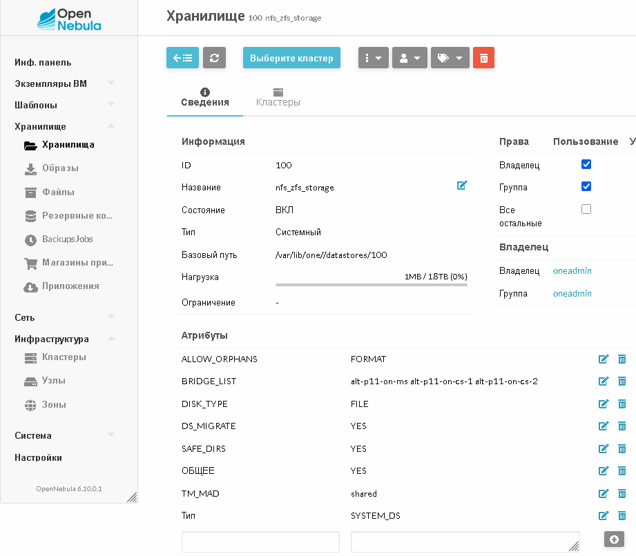
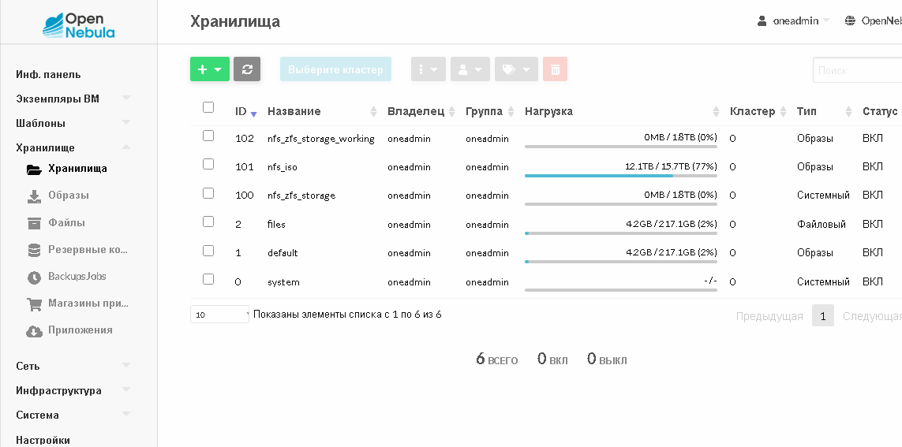

#### Монтирование раздела под ISO-образы
```bash
# Вход под пользователем Oneadmin
su - oneadmin

# Создаём точку монтирования на всех узлах
mkdir -p \
./datastores/101

# проверяем чтобы каталоги были под владельцами и полными правами oneadmin oneadmin 
ls -ld datastores/101
```
```
drwxr-xr-x 2 oneadmin oneadmin 4096 Mar  3 23:07 datastores/101
```
```bash
# Вход под суперпользователем  на всех узлах
su -

# Добавляем в /etc/fstab для авто-монтирования на всех узлах
echo '192.168.89.246:/volume1/iso /var/lib/one/datastores/101 nfs rw,soft,intr,noatime,nodev,nosuid 0 0' \
>> /etc/fstab

# Монтирование на основе файла /etc/fstab на вычислительных узлах
mount -a

# отображение примонтированного на вычислительных узлах
findmnt /var/lib/one/datastores/101
```
```
TARGET                      SOURCE                      FSTYPE OPTIONS
/var/lib/one/datastores/101 192.168.89.246:/volume1/iso nfs4   rw,nosuid,nodev,noatime,vers=4.1,rsize=131072,wsize=131072,namlen=255,soft,proto=tcp,timeo=600,retrans=2,sec=sys,clientaddr=192.168.89.190,local_lock=none,addr=192.168.89.246
```
#### Регистрация хранилище для ISO в OpenNebula на узле управления
```bash
# Выполнением под административно учетной записью OpenNebula
su - oneadmin

# Создаём конфигурацию хранилища
# NAME = Имя пула
# TYPE = Указания системного типа SYSTEM_DS 
# DS_MAD = для хранилищ c образами fs
# TM_MAD = shared позволяет ВМ мигрировать и работать с общими дисками
# BASE_PATH = Путь расположения в /var/lib/one/datastores/
# BRIDGE_LIST Перечисление всех хостов, которые будут использовать это хранилище
# SAFE_DIRS = (для NFS важно) Безопасные директории
cat > iso_datastore.conf << 'EOF'
NAME            = "nfs_iso"
TYPE            = IMAGE_DS
DS_MAD          = fs
TM_MAD          = shared
BASE_PATH       = "/var/lib/one/datastores/101"
BRIDGE_LIST     = "alt-p11-on-ms alt-p11-on-cs-1 alt-p11-on-cs-2"
SAFE_DIRS       = "YES"
EOF

# Регистрируем хранилище
onedatastore create \
iso_datastore.conf
```
```
ID: 101
```
```bash
# Узнаем Статус хранилища в OpenNebula
onedatastore show \
101
```
```
DATASTORE 101 INFORMATION                                                       
ID             : 101                 
NAME           : nfs_iso             
USER           : oneadmin            
GROUP          : oneadmin            
CLUSTERS       : 0                   
TYPE           : IMAGE               
DS_MAD         : fs                  
TM_MAD         : shared              
BASE PATH      : /var/lib/one//datastores/101
DISK_TYPE      : FILE                
STATE          : READY               

DATASTORE CAPACITY                                                              
TOTAL:         : 15.7T               
FREE:          : 3.6T                
USED:          : 12.1T               
LIMIT:         : -                   

PERMISSIONS                                                                     
OWNER          : um-                 
GROUP          : u--                 
OTHER          : ---                 

DATASTORE TEMPLATE                                                              
ALLOW_ORPHANS="FORMAT"
BRIDGE_LIST="alt-p11-on-ms alt-p11-on-cs-1 alt-p11-on-cs-2"
CLONE_TARGET="SYSTEM"
CLONE_TARGET_SSH="SYSTEM"
DISK_TYPE="FILE"
DISK_TYPE_SSH="FILE"
DS_MAD="fs"
LN_TARGET="NONE"
LN_TARGET_SSH="SYSTEM"
RESTRICTED_DIRS="/"
SAFE_DIRS="/var/tmp"
TM_MAD="shared"
TM_MAD_SYSTEM="ssh"
TYPE="IMAGE_DS"

IMAGES
```

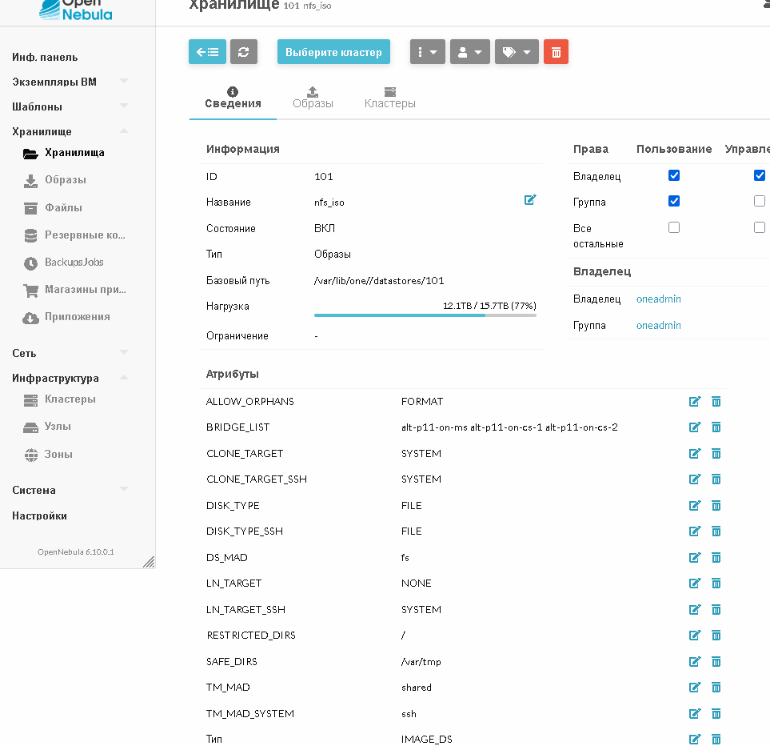

```bash
# Проверка состояния хранилищ
onedatastore list
```
```
  ID NAME                     SIZE  AVA CLUSTERS  IMAGES  TYPE DS  TM      STAT
 102 nfs_zfs_storage_working  1.8T  100 0         0       img  fs  shared  on
 101 nfs_iso                  15.7T 23% 0         0       img  fs  shared  on  
 100 nfs_zfs_storage          1.8T 100  0         0       sys  -   shared  on  
   2 files                    217.1G 93% 0        0       fil  fs  ssh     on  
   1 default                  217.1G 93% 0        0       img  fs  ssh     on  
   0 system                   -      -   0        0       sys  -   ssh     on
```
#### Регистрация отдельных iso образов на управляющем узле
```bash
# под oneadmin
su - oneadmin

# Проверка доступности iso файлов
ls -lh \
./datastores/101/ \
| grep alt
```
```
-rwxrwxrwx 1 1026 users 5,8G дек 28  2023 alt-kworkstation-10.1-install-x86_64.iso
-rwxrwxrwx 1 1026 users 1,3G фев 21 18:55 alt-p10-xfce-20240309-x86_64.iso
-rwxrwxrwx 1 1026 users 1,8G фев 21 18:38 alt-p11-xfce-latest-x86_64.iso
-rwxrwxrwx 1 1026 users 5,1G окт 16  2023 alt-server-10.1-x86_64.iso
-rwxrwxrwx 1 1026 users 3,9G сен  9 19:13 alt-server-11.0-aarch64.iso
-rwxrwxrwx 1 1026 users 4,2G июн 12  2025 alt-server-11.0-x86_64.iso
-rwxrwxrwx 1 1026 users 2,7G окт 16  2023 alt-server-v-10.1-x86_64.iso
-rwxrwxrwx 1 1026 users 2,2G фев  7 10:42 alt-virtualization-pve-11.0-x86_64.iso
-rwxrwxrwx 1 1026 users 6,9G окт 16  2023 alt-workstation-10.1-x86_64.iso
-rwxrwxrwx 1 1026 users 6,1G июн 11  2025 alt-workstation-11.0-x86_64.iso
-rwxrwxrwx 1 1024 users 6,4G сен  1  2025 alt-workstation-11.1-x86_64.iso
```
##### Обязательно указать хранилище как безопасное
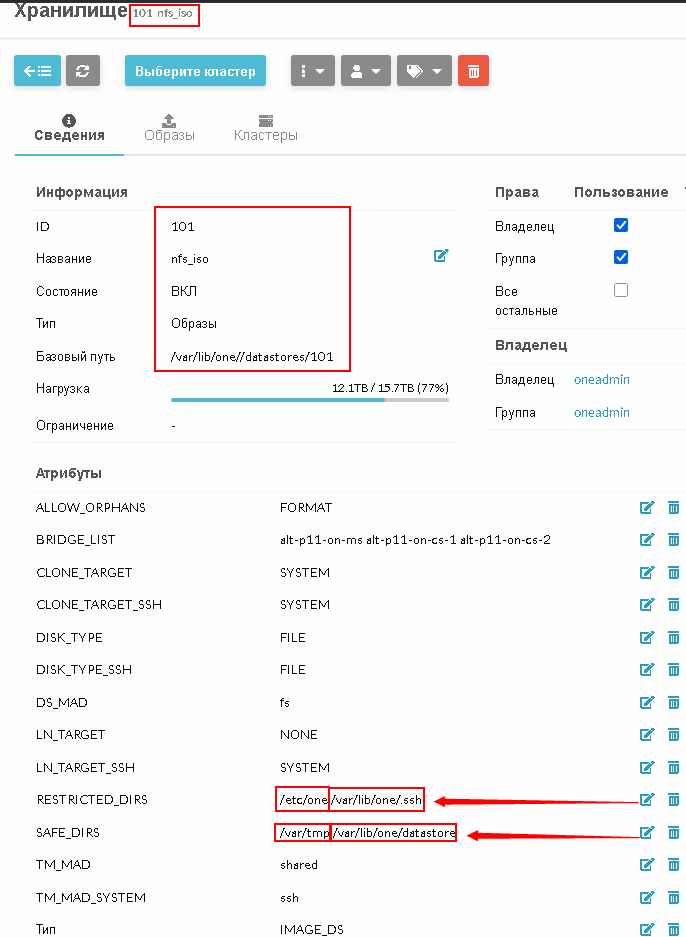

```bash
# Регистрация образа
oneimage create \
-d 101 \
--name "ALT Server 11.0 x86_64" \
--path /var/lib/one/datastores/101/alt-server-11.0-x86_64.iso \
--type CDROM
```
```
ID: 2
```
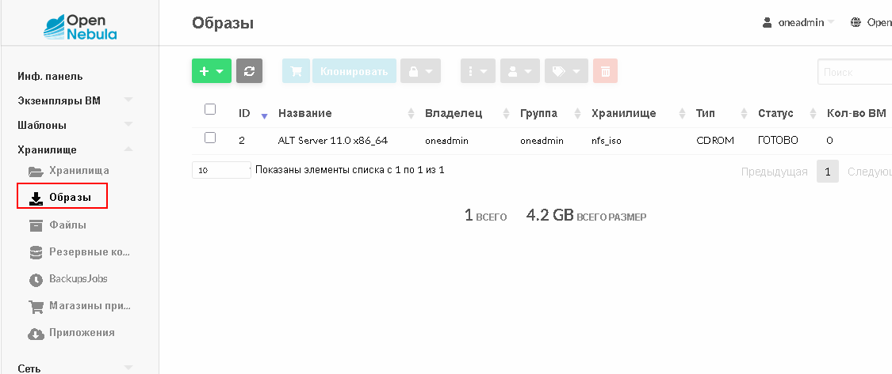

#### Создание DATABLOCK для установки ОС 
```bash
# Создаем datablock для установки ОС на основном хранилище default
oneimage create \
-d 102 \
--description "OS Alt installation" \
--name "ALT Server p11 datablock" \
--type DATABLOCK \
--format qcow2 \
--size 100G \
--persistent
```
```
ID: 19
```
```bash
oneimage show \
19
```
```
IMAGE 19 INFORMATION                                                            
ID             : 19                  
NAME           : ALT Server p11 datablock
USER           : oneadmin            
GROUP          : oneadmin            
LOCK           : None                
DATASTORE      : nfs_zfs_storage_working
TYPE           : DATABLOCK           
REGISTER TIME  : 03/05 00:00:14      
PERSISTENT     : Yes                 
SOURCE         : /var/lib/one//datastores/102/714d166dfd52a79f4d03aa0941ac039a
FORMAT         : qcow2               
SIZE           : 100G                
STATE          : rdy                 
RUNNING_VMS    : 0                   

PERMISSIONS                                                                     
OWNER          : um-                 
GROUP          : ---                 
OTHER          : ---                 

IMAGE TEMPLATE                                                                  
DESCRIPTION="OS Alt installation"
DEV_PREFIX="sd"
```

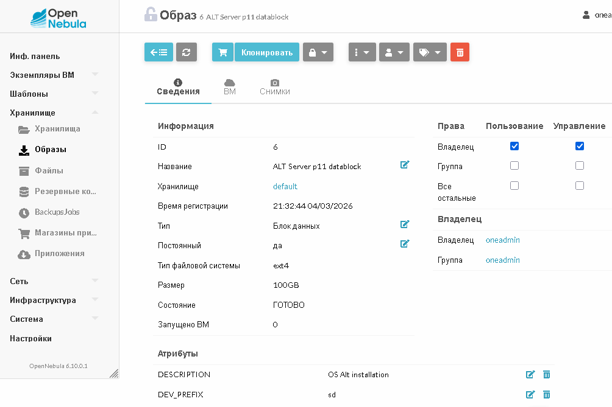

### Создание Виртуальной сети Bridged без привязки выхода в реальную сеть
```bash
# Создание конфигурации сети на управляющем узле
cat > virt-bridged.conf <<'EOF'
NAME = "VirtNetwork"
DESCRIPTION = "Сеть для внутренней коммуникации"
VN_MAD = "bridge"
BRIDGE = "vmbr0"
METHOD = "static"
IP6_METHOD="disable"
NETWORK_ADDRESS = "10.100.1.0"
NETWORK_MASK = "255.255.255.248"
GATEWAY = "10.100.1.1"
AR=[
    TYPE = "IP4",
    IP   = "10.100.1.2",
    SIZE = "5"
]
EOF

# Создание сети из созданного конфига
onevnet create \
virt-bridged.conf
```
```
ID: 0
```
```bash
# отображение сети
ID USER     GROUP    NAME            CLUSTERS   BRIDGE   STATE  LEASES OUTD ERRO
  0 oneadmin oneadmin VirtNetwork     0          vmbr0    rdy         0    0    0
```

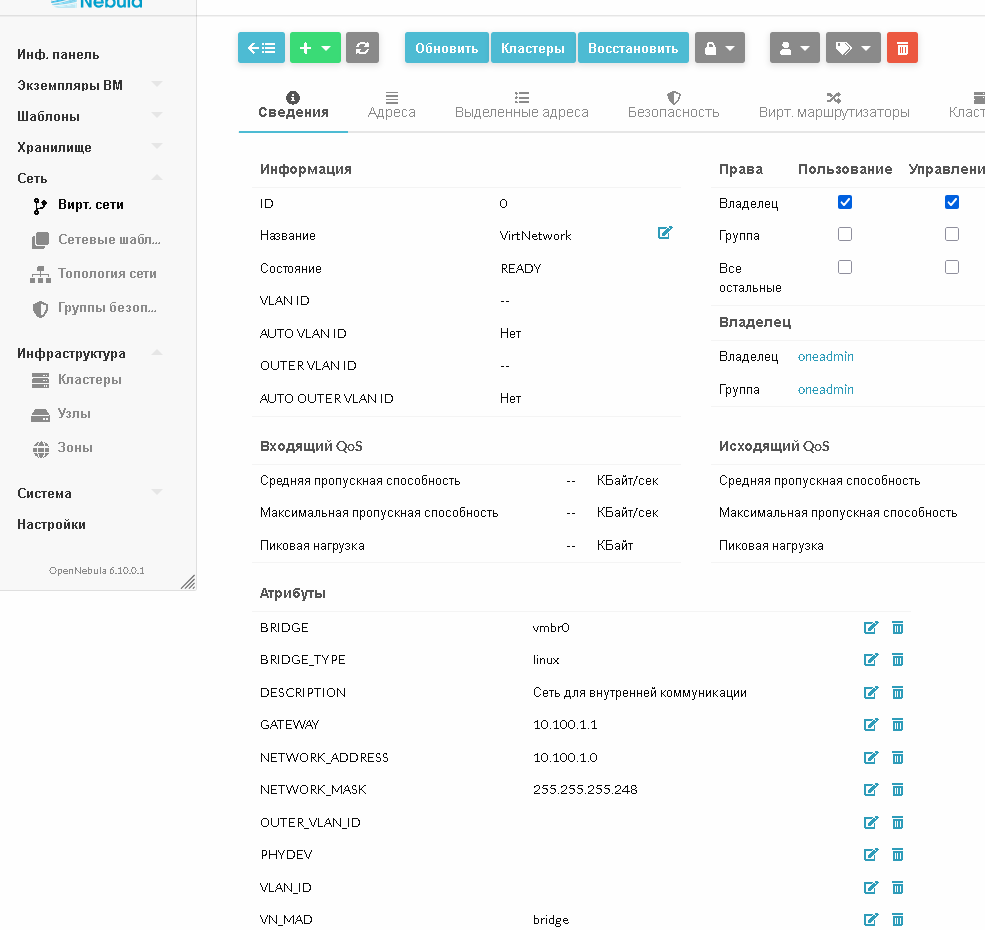
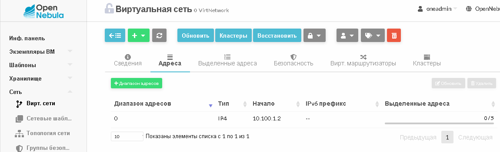

### Для github и gitflic
```bash
# Выключение вычислительных узлов
systemctl poweroff

# Создание snapshot
sudo virsh snapshot-create-as \
--domain alt-p11-ON-cs-1 \
--name 4 \
--description "lab9_nfs_ready" --atomic

sudo virsh snapshot-create-as \
--domain alt-p11-ON-cs-2 \
--name 4 \
--description "lab9_nfs_ready" --atomic

git log --oneline

git branch -v

git switch main

git status

git add . .. ../.. \
&& git status

git remote -v

git commit -am 'оформление для ADM7, lab9 opennebula_install' \
&& git push \
--set-upstream \
altlinux \
main \
&& git push \
--set-upstream \
altlinux_gf \
main
```

### Создание Шаблона виртуальной машины
```bash
# Создание конфигурации сети на управляющем узле
cat > temlp_alt_p11_serv <<'EOF'
NAME = "ALT Server P11 Template"
CONTEXT=[
  NETWORK="YES",
  SSH_PUBLIC_KEY="$USER[SSH_PUBLIC_KEY]" ]
CPU="2"
DESCRIPTION="Создание ВМ на вычислительном кластере"
DISK=[
  IMAGE="ALT Server 11.0 x86_64",
  IMAGE_UNAME="oneadmin" ]
DISK=[
  DEV_PREFIX="vd",
  IMAGE="ALT Server p11 datablock",
  IMAGE_UNAME="oneadmin" ]
GRAPHICS=[
  LISTEN="0.0.0.0",
  TYPE="SPICE" ]
HOT_RESIZE=[
  CPU_HOT_ADD_ENABLED="NO",
  MEMORY_HOT_ADD_ENABLED="NO" ]
HYPERVISOR="kvm"
LOGO="images/logos/alt.png"
MEMORY="2048"
MEMORY_RESIZE_MODE="BALLOONING"
MEMORY_UNIT_COST="MB"
NIC=[
  NETWORK="VirtNetwork",
  NETWORK_UNAME="oneadmin",
  SECURITY_GROUPS="0" ]
NIC_DEFAULT=[
  MODEL="Virtio" ]
OS=[
  ARCH="x86_64",
  BOOT="disk0,disk1" ]
SCHED_REQUIREMENTS="CLUSTER_ID=\"0\""
EOF

# создание шаблона на основе файла temlp_alt_p11_serv
onetemplate create \
temlp_alt_p11_serv
```
```
ID: 8
```
```bash
# информация о шаблоне с id 8
onetemplate show \
8
```
```
TEMPLATE 8 INFORMATION                                                          
ID             : 8                   
NAME           : ALT Server P11 Template
USER           : oneadmin            
GROUP          : oneadmin            
LOCK           : None                
REGISTER TIME  : 03/05 00:17:33      

PERMISSIONS                                                                     
OWNER          : um-                 
GROUP          : ---                 
OTHER          : ---                 

TEMPLATE CONTENTS                                                               
CONTEXT=[
  NETWORK="YES",
  SSH_PUBLIC_KEY="$USER[SSH_PUBLIC_KEY]" ]
CPU="2"
DESCRIPTION="Создание ВМ на вычислительном кластере"
DISK=[
  IMAGE="ALT Server 11.0 x86_64",
  IMAGE_UNAME="oneadmin" ]
DISK=[
  DEV_PREFIX="vd",
  IMAGE="ALT Server p11 datablock",
  IMAGE_UNAME="oneadmin" ]
GRAPHICS=[
  LISTEN="0.0.0.0",
  TYPE="SPICE" ]
HOT_RESIZE=[
  CPU_HOT_ADD_ENABLED="NO",
  MEMORY_HOT_ADD_ENABLED="NO" ]
HYPERVISOR="kvm"
LOGO="images/logos/alt.png"
MEMORY="2048"
MEMORY_RESIZE_MODE="BALLOONING"
MEMORY_UNIT_COST="MB"
NIC=[
  NETWORK="VirtNetwork",
  NETWORK_UNAME="oneadmin",
  SECURITY_GROUPS="0" ]
NIC_DEFAULT=[
  MODEL="Virtio" ]
OS=[
  ARCH="x86_64",
  BOOT="disk0,disk1" ]
SCHED_REQUIREMENTS="CLUSTER_ID=\"0\""
```

```bash
# Обновление шаблона на основе heredoc
onetemplate update 8 << 'EOF'
NAME = "ALT Server P11 Template"
CONTEXT=[
  NETWORK="YES",
  SSH_PUBLIC_KEY="$USER[SSH_PUBLIC_KEY]" ]
CPU="2"
DESCRIPTION="Создание ВМ на вычислительном кластере"
DISK=[
  IMAGE="ALT Server 11.0 x86_64",
  IMAGE_UNAME="oneadmin" ]
DISK=[
  DEV_PREFIX="vd",
  IMAGE="ALT Server p11 datablock",
  IMAGE_UNAME="oneadmin" ]
GRAPHICS=[
  LISTEN="0.0.0.0",
  TYPE="SPICE" ]
HOT_RESIZE=[
  CPU_HOT_ADD_ENABLED="NO",
  MEMORY_HOT_ADD_ENABLED="NO" ]
HYPERVISOR="kvm"
LOGO="images/logos/alt.png"
MEMORY="2048"
MEMORY_RESIZE_MODE="BALLOONING"
MEMORY_UNIT_COST="MB"
NIC=[
  NETWORK="VirtNetwork",
  NETWORK_UNAME="oneadmin",
  SECURITY_GROUPS="0" ]
NIC_DEFAULT=[
  MODEL="Virtio" ]
OS=[
  ARCH="x86_64",
  BOOT="disk1,disk0" ]
SCHED_REQUIREMENTS="CLUSTER_ID=\"0\""
EOF
```

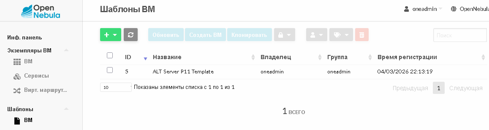

### Создание виртуальной машины на основе шаблона с ID 8
```bash
onetemplate \
instantiate 8
```
```
VM ID: 6
```

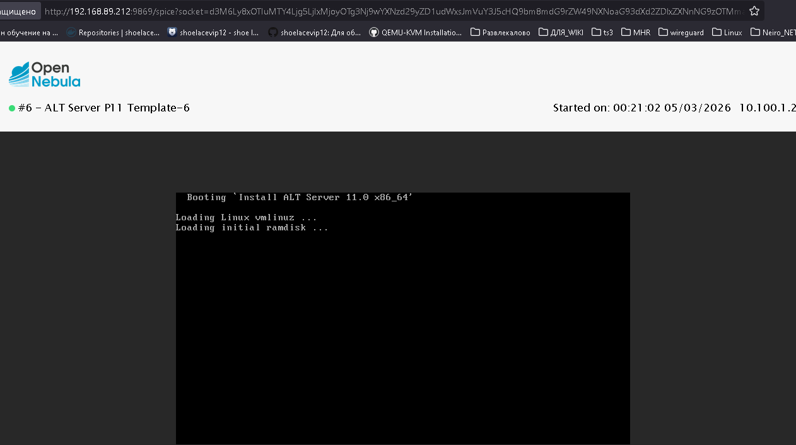


### Создание образа типа ОС из установленной ОС
```bash
# Удаляем виртуальную машину, оставляя созданный на основе шаблона для него образ диска с ОС
onevm terminate \
6

# Ищем созданный образ
oneimage list
```
```
ID USER     GROUP    NAME                       DATASTORE     SIZE TYPE PER STAT RVMS
19 oneadmin oneadmin ALT Server p11 datablock   nfs_zfs_st    100G DB   Yes rdy     0
  2 oneadmin oneadmin ALT Server 11.0 x86_64     nfs_iso       4.2G CD    No rdy     0
```

```bash
# Изменить тип блочного устройства на ОС
oneimage chtype \
19 \
OS

# И Еео состояние на Non Persistent
oneimage nonpersistent \
19
```
```bash
# Просмотр информации о об образе с ОС
oneimage show \
19
```
```
IMAGE 19 INFORMATION                                                            
ID             : 19                  
NAME           : ALT Server p11 datablock
USER           : oneadmin            
GROUP          : oneadmin            
LOCK           : None                
DATASTORE      : nfs_zfs_storage_working
TYPE           : OS                  
REGISTER TIME  : 03/05 00:00:14      
PERSISTENT     : No                  
SOURCE         : /var/lib/one//datastores/102/714d166dfd52a79f4d03aa0941ac039a
FORMAT         : qcow2               
SIZE           : 100G                
STATE          : rdy                 
RUNNING_VMS    : 0                   

PERMISSIONS                                                                     
OWNER          : um-                 
GROUP          : ---                 
OTHER          : ---                 

IMAGE TEMPLATE                                                                  
DESCRIPTION="OS Alt installation"
DEV_PREFIX="sd"
```

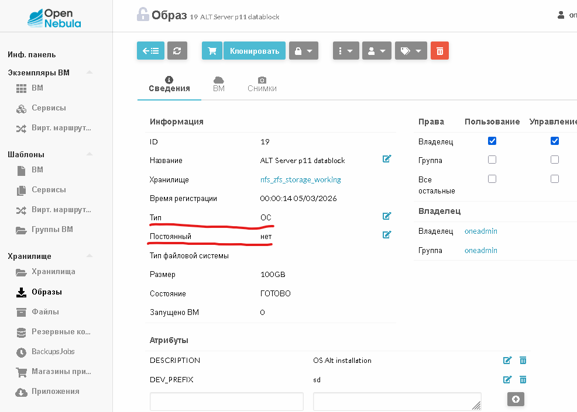


#### Развертывание несколько машин на основе шаблона и Non Persistent диска
```bash
# Создание на основе шаблона и в количестве 2-х ВМ за раз
onetemplate \
instantiate 8 \
--multiple 2
```
```
VM ID: 7
VM ID: 8
```

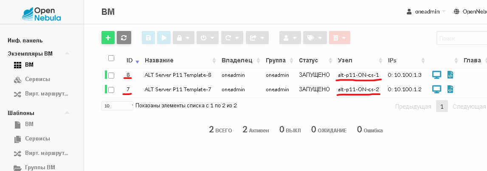
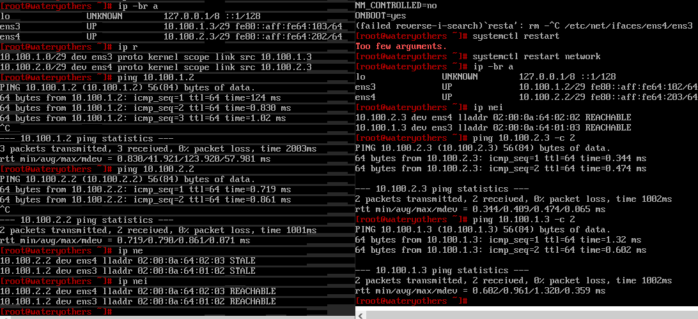


### Для github и gitflic
```bash
git log --oneline

git branch -v

git switch main

git status

git add . .. ../.. \
&& git status

git remote -v

git commit -am 'оформление для ADM7, lab9 clusters' \
&& git push \
--set-upstream \
altlinux \
main \
&& git push \
--set-upstream \
altlinux_gf \
main
```