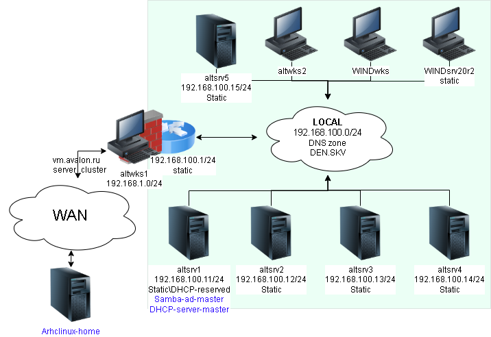

# Подготовка структуры прохождения курса altdomain
```bash
mkdir altdomain

cd !$

mkdir -p lab{1..8}/img
```


## Создание SSH-пары ключей
```bash
ssh-keygen \
-f ~/.ssh/id_alt-domain_2026_host_ed25519 \
-t ed25519 \
-C "cours_alt-domain"

chmod 600 \
~/.ssh/id_alt-domain_*_ed25519

chmod 644 \
~/.ssh/id_alt-domain_*_ed25519.pub
```
## Рабочий стенд


## Предварительные действия перед выполнением (Доступ до закрытого контура через Openvpn)
### Развертывание сервера Сертификации на сервере Openvpn
#### Установка пакетов на сервере Openvpn
```bash
# Поиск пакетов
sudo pacman \
-Ss \
openvpn

sudo pacman \
-Ss \
easyrsa

# Установка пакетов
sudo pacman \
-Syu \
easy-rsa \
openvpn
```
#### Генерация пар сертификатов\ключей для TLS VPN
```bash
# Генерация структуры каталогов PKI и генерация сертификата CA
cd /srv \
&& easyrsa init-pki \
&& easyrsa build-ca
```
```bash
# Группа Диффи-Хелмана
easyrsa gen-dh

# сертификат\ключ VPN-сервера
easyrsa build-server-full \
shoellin \
nopass

# сертификат\ключ VPN-клиента
easyrsa build-client-full \
altwks1 \
nopass
```
```bash
# Перенос в каталог для облачного хранилища генерации Диффи-Хелмана и пары сертификата\ключа для VPN-сервера
sudo cp -v \
/srv/pki/{ca.crt,dh.pem} \
/srv/pki/issued/altwks1.crt \
/srv/pki/private/altwks1.key \
~/nfs_git/
```
### Подготовка VPN-клиента
```bash
# вход под суперпользователем
su -

# обновление системы и установка openvpn easy-rsa на клиенте соединения
apt-get update \
&& update-kernel -y \
&& apt-get dist-upgrade -y \
&& apt-get install -y \
openvpn \
easy-rsa
```
```bash
# Генерация Ключ HMAC
openvpn --genkey \
secret \
/etc/openvpn/keys/ta.key

# Копируем сгенерированный HMAC в домашний каталог для обмена через файловое облако между VPN-сервер\клиентом
cp /etc/openvpn/keys/ta.key \
/home/sysadmin/

# взаимодействовать с файлом на уровне пользователя
chown sysadmin:sysadmin \
/home/sysadmin/ta.key
```
#### После обмена файлами ключей в домашней каталог
```bash
# Копирование всех необходимых файлов
cp /home/sysadmin/{ca.crt,altwks1.*,ta.key} \
/etc/openvpn/keys/

# Выставление желательных прав для ключей\сертификатов
chmod -R 600 /etc/openvpn/keys
```
```bash
# Создание конфига туннельного соединения-клиента по subnet топологии
cat > /etc/openvpn/client/tun0.conf <<'EOF'
dev tun0
  client
  nobind
  remote 185.215.60.84 1194
  proto udp4
  topology subnet
  pull
  cipher AES-256-CBC
  data-ciphers-fallback AES-256-CBC
  ca /etc/openvpn/keys/ca.crt
  cert /etc/openvpn/keys/altwks1.crt
  key /etc/openvpn/keys/altwks1.key
  tls-client
  remote-cert-eku "TLS Web Server Authentication"
  tls-auth /etc/openvpn/keys/ta.key 1
  auth-nocache
  tun-mtu 1400
  mssfix 1360
  fragment 1300
EOF
```


```bash
# Добавляем в hosts ip и имя внешнего сервера VPN 
# имя указанного хоста соответствует на чье имя был выписан сертификат из CA (openvpn-altserver)
echo -e "\n185.215.60.84 shoellin" \
>> /etc/hosts

# Включение и запуск службы VPN-клиента
systemctl enable \
--now \
openvpn-client@tun0
```
#### Подготовка службы сервера openVPN
```bash
# Создание каталога для пары ключей и сертификатов
sudo mkdir \
/etc/openvpn/keys/

# Копирование подготовленных файлов пары ключей и сертификатов для сервера
sudo cp -v pki/{issued,private}/shoellin.* \
/srv/pki/{ca.crt,dh.pem} \
/etc/openvpn/keys/

# Копирование Ключа HMAC созданного с VPN-клиента
sudo cp ~/nfs_git/ta.key \
/etc/openvpn/keys/

sudo chown \
root:openvpn -R \
/etc/openvpn/keys

# Выставление желательных прав для ключей\сертификатов
sudo chmod -R 600 \
/etc/openvpn/keys
```
```bash
# Создание конфига туннельного соединения-клиента по subnet топологии
sudo cat > /etc/openvpn/server/tun0.conf <<'EOF'
dev tun0
  local 192.168.89.193
  port 1194
  proto udp4
  keepalive 10 60
  topology subnet
  server 172.16.100.0 255.255.255.248
  data-ciphers-fallback AES-256-CBC
  cipher AES-256-CBC
  ca /etc/openvpn/keys/ca.crt
  dh /etc/openvpn/keys/dh.pem
  cert /etc/openvpn/keys/shoellin.crt
  key /etc/openvpn/keys/shoellin.key
  tls-server
  remote-cert-eku "TLS Web Client Authentication"
  tls-auth /etc/openvpn/keys/ta.key 0
  tun-mtu 1400
  mssfix 1360
  fragment 1300
EOF
```
```bash
# ЗАпуск службы
sudo systemctl enable \
--now \
openvpn-server@tun0
```
```bash
# Проверка соединения
ping -c2 172.16.100.2
```

### SSH обмен ключами
```bash
# проброс ключа до altwks1 через Openvpn
> ~/.ssh/known_hosts \
&& ssh-copy-id \
-o StrictHostKeyChecking=accept-new \
-i ~/.ssh/id_alt-domain_2026_host_ed25519.pub \
sysadmin@172.16.100.2
```
```bash
# Включаем агента в текущей оснастке и прописываем в базу агента созданные и переправленные ключи
eval $(ssh-agent) \
&& ssh-add \
~/.ssh/id_alt-domain_2026_host_ed25519
```

```bash
# вход на bastion хост по ключу по ssh
> ~/.ssh/known_hosts \
&& ssh -t -o StrictHostKeyChecking=accept-new \
sysadmin@172.16.100.2 \
"su -"
```
### Для github и gitflic
```bash
exit

git branch -v

git log --oneline

git switch main

git status

pushd \
..

git rm -r --cached \
. 

git add . \
&& git status

git remote -v

git commit -am "для создание VPN до контура стенда" \
&& git push \
--set-upstream \
altlinux \
main \
&& git push \
--set-upstream \
altlinux_gf \
main

popd
```