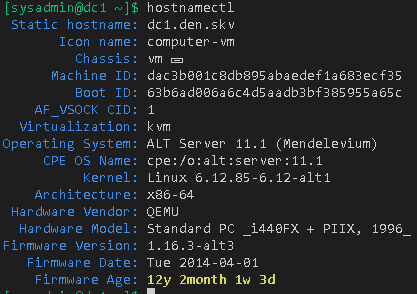
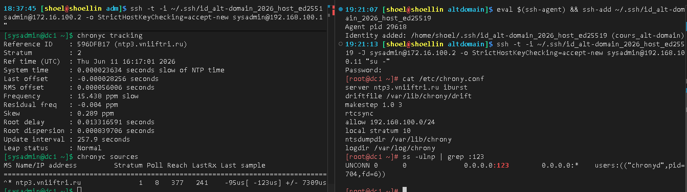
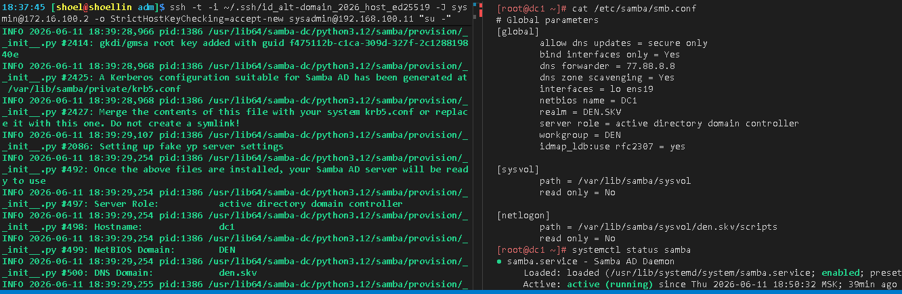
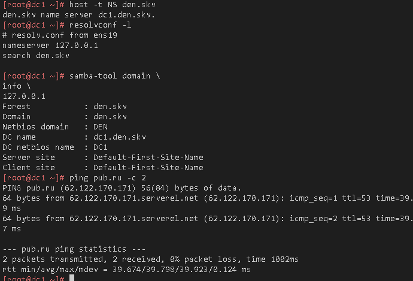
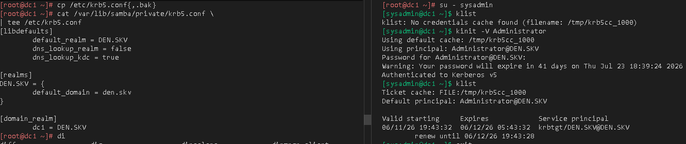
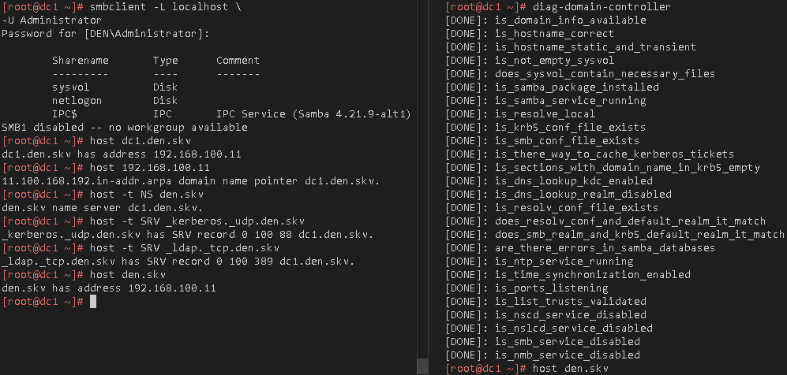

# Лабораторная работа 1 «`Установка Альт Домен`» 


## Памятка входа
```bash
# вход на bastion хост по ключу по ssh
eval $(ssh-agent) \
&& ssh-add \
~/.ssh/id_alt-domain_2026_host_ed25519

> ~/.ssh/known_hosts \
&& ssh -t -o StrictHostKeyChecking=accept-new \
sysadmin@172.16.100.2 \
"su -"
```
### SSH обмен ключами (проброс ключа до dc1 через altwks1)
```bash
# Копируем пару ключей на промежуточный хост altwks1
> ~/.ssh/known_hosts \
&& scp \
~/.ssh/id_alt-domain_2026_host_ed25519{,.pub} \
sysadmin@172.16.100.2:~/.ssh/

# Передаем публичный ключ на dc1
ssh -t -o StrictHostKeyChecking=accept-new \
sysadmin@172.16.100.2 \
"ssh-copy-id \
-o StrictHostKeyChecking=accept-new \
-i ~/.ssh/id_alt-domain_2026_host_ed25519.pub \
sysadmin@192.168.100.11"
```

<details>
<summary>Логи передачи файлов</summary>

```log
Agent pid 16341
Identity added: /home/shoel/.ssh/id_alt-domain_2026_host_ed25519 (cours_alt-domain)
```

```log
The authenticity of host '172.16.100.2 (172.16.100.2)' can't be established.
ED25519 key fingerprint is: SHA256:cHzpYMC7ONqD/C8zAWz/WJUD+byrCOvm9Ir7DOvEspM
This key is not known by any other names.
Are you sure you want to continue connecting (yes/no/[fingerprint])? yes
Warning: Permanently added '172.16.100.2' (ED25519) to the list of known hosts.
id_alt-domain_2026_host_ed25519                  100%  411    32.5KB/s   00:00    
id_alt-domain_2026_host_ed25519.pub              100%   98     7.5KB/s   00:00
```

```log
/bin/ssh-copy-id: INFO: Source of key(s) to be installed: "/home/sysadmin/.ssh/id_alt-domain_2026_host_ed25519.pub"
/bin/ssh-copy-id: INFO: attempting to log in with the new key(s), to filter out any that are already installed
/bin/ssh-copy-id: INFO: 1 key(s) remain to be installed -- if you are prompted now it is to install the new keys
sysadmin@192.168.100.11's password: 

Number of key(s) added: 1

Now try logging into the machine, with:   "ssh -o 'StrictHostKeyChecking=accept-new' 'sysadmin@192.168.100.11'"
and check to make sure that only the key(s) you wanted were added.

Connection to 172.16.100.2 closed.
```

</details>

### Проверка входа
```bash
ssh -t \
-i ~/.ssh/id_alt-domain_2026_host_ed25519 \
-J sysadmin@172.16.100.2 \
-o StrictHostKeyChecking=accept-new \
sysadmin@192.168.100.11 \
"hostnamectl && ip -br a"
```

<details>
<summary>вывод доступа до dc1</summary>

```log
 Static hostname: dc1
       Icon name: computer-vm
         Chassis: vm 🖴
      Machine ID: dac3b001c8db895abaedef1a683ecf35
         Boot ID: bc37f52a2d9b4f00af087cec56ca1c69
  Virtualization: kvm
Operating System: ALT Server 11.1 (Mendelevium)
     CPE OS Name: cpe:/o:alt:server:11.1
          Kernel: Linux 6.12.27-6.12-alt1
    Architecture: x86-64
 Hardware Vendor: QEMU
  Hardware Model: Standard PC _i440FX + PIIX, 1996_
Firmware Version: 1.16.3-alt3
   Firmware Date: Tue 2014-04-01
    Firmware Age: 12y 2month 1w 2d                 
lo               UNKNOWN        127.0.0.1/8 ::1/128 
ens19            UP             192.168.100.11/24 fe80::9c6e:f5ff:fe1f:c9e7/64 
Connection to 192.168.100.11 closed.
```

</details>

## Работа по развертыванию домена
```bash
ssh -t \
-i ~/.ssh/id_alt-domain_2026_host_ed25519 \
-J sysadmin@172.16.100.2 \
-o StrictHostKeyChecking=accept-new \
sysadmin@192.168.100.11 \
"su -"
```
### Смена имени под fqdn
```bash
hostnamectl \
set-hostname \
dc1.den.skv
```

### Устанавливаем имя NIS-домена
```bash
domainname den.skv
```



### Смена домена поиска и серверов домен контроллера

```bash
cat > /etc/net/ifaces/ens19/resolv.conf<<'EOF'
nameserver 77.88.8.8
nameserver 77.88.8.1
search den.skv
EOF
```

#### Вывод информации об интерфейсе
```bash
cat /etc/net/ifaces/ens19/*
```

<details>
<summary>ВЫВОД ОБЩИХ ПАРАМЕТРОВ интерфейса</summary>

```ini
192.168.100.11/24
default via 192.168.100.1
SYSTEMD_CONTROLLED=no
DISABLED=no
TYPE=eth
CONFIG_WIRELESS=no
BOOTPROTO=static
SYSTEMD_BOOTPROTO=static
CONFIG_IPV4=yes
NM_CONTROLLED=no
nameserver 77.88.8.8
nameserver 77.88.8.1
search den.skv
```

</details>

### Отключение IPV6
```bash
echo "net.ipv6.conf.all.disable_ipv6 = 1" \
| tee -a  /etc/sysctl.conf \
&& sysctl -p
```
#### Вывод о состоянии настроек ядра с IPV6
```bash

sysctl -a \
| grep "disable_ipv6"
```

<details>
<summary>вывод состояния ipv6</summary>

```log
net.ipv6.conf.all.disable_ipv6 = 1
net.ipv6.conf.default.disable_ipv6 = 1
net.ipv6.conf.ens19.disable_ipv6 = 1
net.ipv6.conf.lo.disable_ipv6 = 1
```

</details>

### Выключение и включения интерфейса
```bash
ifdown ens19 \
; ifup ens19 \
; systemctl restart network
```

### Проверка связи с WAN
```bash
ping ya.ru -c2
```

<details>
<summary>Проверка выхода в интернет</summary>

```log
PING ya.ru (77.88.44.242) 56(84) bytes of data.
64 bytes from ya.ru (77.88.44.242): icmp_seq=1 ttl=53 time=13.6 ms
64 bytes from ya.ru (77.88.44.242): icmp_seq=2 ttl=53 time=13.7 ms

--- ya.ru ping statistics ---
2 packets transmitted, 2 received, 0% packet loss, time 1002ms
rtt min/avg/max/mdev = 13.633/13.685/13.737/0.052 ms
```

</details>

### Подготовка и Установка необходимых пакетов для SAMBA-DC
```bash
# Если присутствую останавливаем конфликтующие службы
systemctl stop \
smb \
nmb \
krb5kdc \
slapd \
bind \
dnsmasq

# Устанавливаем пакеты для SAMBA-DC и графическое управление его настройками
apt-get update \
&& update-kernel -y \
&& apt-get dist-upgrade -y \
&& apt-get install -y \
alterator-net-domain \
task-samba-dc \
alterator-datetime \
chrony \
diag-domain-controller

# Чистка получившихся настроек SAMBA после установки
rm -fv /etc/samba/smb.conf \
&& rm -rfv /var/{lib,cache}/samba
```

<details>
<summary>ВЫВОД чистки</summary>

```log
removed '/etc/samba/smb.conf'
removed directory '/var/lib/samba/winbindd_privileged'
removed directory '/var/lib/samba/private'
removed directory '/var/lib/samba/sysvol'
removed directory '/var/lib/samba'
removed directory '/var/cache/samba'
```

</details>

### создание каталога Sysvol для работы Домена
```bash
mkdir -pv \
/var/lib/samba/sysvol
```

<details>
<summary>Создание sysvol</summary>

```log
mkdir: created directory '/var/lib/samba'
mkdir: created directory '/var/lib/samba/sysvol'
```

</details>

### перевод chrony в режим сервера
```bash
control chrony server
```

## Настройка сервера времени Со стороны основного домен контроллера
```bash
# Бэкап конфигурации
cp /etc/chrony.conf{,.bak}

# чистка конфига от комментариев
sed -i \
-e '/^[[:space:]]*#/d' \
-e '/^[[:space:]]*$/d' \
/etc/chrony.conf

# Перенастраиваем основной сервер на Московские серверы ВНИИФТРИ ntp3.vniiftri.ru
sed -i 's/pool pool.ntp.org/server ntp3.vniiftri.ru/' \
/etc/chrony.conf

# Указание что хост выступает в роли сервера времени для всей локальной сети 192.168.100.0/24
sed -i 's/allow all/allow 192.168.100.0\/24/' \
/etc/chrony.conf

# Указываем возможность отвечать клиентам, если к внешнему NTP серверу нет доступа
sed -i '/\/24/alocal stratum 10' \
/etc/chrony.conf

# Запуск служб NTP
systemctl enable --now \
chronyd.service

systemctl restart \
chronyd.service

# Запуск ручной синхронизации времени
systemctl restart \
chrony-wait.service

# Проверка NTP с новым сервером
chronyc tracking
```

<details>
<summary>Вывод текущего отслеживания времени</summary>

```log
Reference ID    : 596DFB17 (ntp3.vniiftri.ru)
Stratum         : 2
Ref time (UTC)  : Wed Jun 10 21:53:57 2026
System time     : 0.000000915 seconds fast of NTP time
Last offset     : +0.000001034 seconds
RMS offset      : 0.000001034 seconds
Frequency       : 15.113 ppm slow
Residual freq   : +12.367 ppm
Skew            : 0.556 ppm
Root delay      : 0.013971020 seconds
Root dispersion : 0.000484715 seconds
Update interval : 2.0 seconds
Leap status     : Normal
```

</details>

```bash
chronyc sources
```

<details>
<summary>Состояние синхронизации с источниками</summary>

```log
.-- Source mode  '^' = server, '=' = peer, '#' = local clock.
 / .- Source state '*' = current best, '+' = combined, '-' = not combined,
| /             'x' = may be in error, '~' = too variable, '?' = unusable.
||                                                 .- xxxx [ yyyy ] +/- zzzz
||      Reachability register (octal) -.           |  xxxx = adjusted offset,
||      Log2(Polling interval) --.      |          |  yyyy = measured offset,
||                                \     |          |  zzzz = estimated error.
||                                 |    |           \
MS Name/IP address         Stratum Poll Reach LastRx Last sample               
===============================================================================
^* ntp3.vniiftri.ru              1   6    17    48    -20us[  -19us] +/- 7017us
```

</details>

```bash
# Проверка открытого порта для клиентов
ss -ulnp | grep :123
```
```log
UNCONN 0      0            0.0.0.0:123        0.0.0.0:*    users:(("chronyd",pid=1613,fd=6))
```
```bash
# настройки NTP на вычислительном узле 
cat /etc/chrony.conf
```
```log
server ntp3.vniiftri.ru iburst
driftfile /var/lib/chrony/drift
makestep 1.0 3
rtcsync
allow 192.168.100.0/24
local stratum 10
ntsdumpdir /var/lib/chrony
logdir /var/log/chrony
```



### Смена редакции лиценирования с edition_server на edition_domain
```bash
alteratorctl editions set edition_domain
```

<details>
<summary>Смена редакции</summary>

```log
* ALT Domain (edition_domain)
  ALT Server (edition_server)
free(): invalid pointer
Aborted
```

</details>

### Смена dns на себя

```bash
cat > /etc/net/ifaces/ens19/resolv.conf<<'EOF'
nameserver 127.0.0.1
search den.skv
EOF
```
```bash
resolvconf -u
```

## Создание основного домен контроллера с командной строки
```bash
# –realm задает область Kerberos (LDAP), и DNS имени домена;
# –domain задает имя домена (имя рабочей группы);
# –adminpass пароль основного администратора домена;
# –server-role тип серверной роли.
# –use-rfc2307 схема Совмести UNIX систем с Active Directory 
# при использовании открытых SMB ресурсов sysvol и netlogon на контроллере домена
samba-tool domain provision \
--realm=den.skv \
--option="dns forwarder=77.88.8.8" \
--option="interfaces= lo ens19" \
--option="bind interfaces only=yes" \
--option="dns zone scavenging=yes" \
--option="allow dns updates=secure only" \
--domain den \
--server-role=dc \
--dns-backend=SAMBA_INTERNAL \
--use-rfc2307 \
--adminpass='1qaz@WSX'
```

<details>
<summary>ВЫВОД РАЗВЕРТЫВАНИЯ ДОМЕН-КОНТРОЛЕРА</summary>

```log
WARNING: Using passwords on command line is insecure. Installing the setproctitle python module will hide these from shortly after program start.
INFO 2026-06-11 18:39:18,861 pid:1386 /usr/lib64/samba-dc/python3.12/samba/provision/__init__.py #2112: Looking up IPv4 addresses
INFO 2026-06-11 18:39:18,862 pid:1386 /usr/lib64/samba-dc/python3.12/samba/provision/__init__.py #2129: Looking up IPv6 addresses
WARNING 2026-06-11 18:39:18,862 pid:1386 /usr/lib64/samba-dc/python3.12/samba/provision/__init__.py #2136: No IPv6 address will be assigned
INFO 2026-06-11 18:39:19,282 pid:1386 /usr/lib64/samba-dc/python3.12/samba/provision/__init__.py #2302: Setting up share.ldb
INFO 2026-06-11 18:39:19,376 pid:1386 /usr/lib64/samba-dc/python3.12/samba/provision/__init__.py #2306: Setting up secrets.ldb
INFO 2026-06-11 18:39:19,443 pid:1386 /usr/lib64/samba-dc/python3.12/samba/provision/__init__.py #2311: Setting up the registry
INFO 2026-06-11 18:39:19,648 pid:1386 /usr/lib64/samba-dc/python3.12/samba/provision/__init__.py #2314: Setting up the privileges database
INFO 2026-06-11 18:39:19,755 pid:1386 /usr/lib64/samba-dc/python3.12/samba/provision/__init__.py #2317: Setting up idmap db
INFO 2026-06-11 18:39:19,838 pid:1386 /usr/lib64/samba-dc/python3.12/samba/provision/__init__.py #2324: Setting up SAM db
INFO 2026-06-11 18:39:19,866 pid:1386 /usr/lib64/samba-dc/python3.12/samba/provision/__init__.py #887: Setting up sam.ldb partitions and settings
INFO 2026-06-11 18:39:19,868 pid:1386 /usr/lib64/samba-dc/python3.12/samba/provision/__init__.py #899: Setting up sam.ldb rootDSE
INFO 2026-06-11 18:39:19,889 pid:1386 /usr/lib64/samba-dc/python3.12/samba/provision/__init__.py #1312: Pre-loading the Samba 4 and AD schema
Unable to determine the DomainSID, can not enforce uniqueness constraint on local domainSIDs

INFO 2026-06-11 18:39:19,971 pid:1386 /usr/lib64/samba-dc/python3.12/samba/provision/__init__.py #1389: Adding DomainDN: DC=den,DC=skv
INFO 2026-06-11 18:39:20,017 pid:1386 /usr/lib64/samba-dc/python3.12/samba/provision/__init__.py #1421: Adding configuration container
INFO 2026-06-11 18:39:20,059 pid:1386 /usr/lib64/samba-dc/python3.12/samba/provision/__init__.py #1436: Setting up sam.ldb schema
INFO 2026-06-11 18:39:22,359 pid:1386 /usr/lib64/samba-dc/python3.12/samba/provision/__init__.py #1456: Setting up sam.ldb configuration data
INFO 2026-06-11 18:39:22,572 pid:1386 /usr/lib64/samba-dc/python3.12/samba/provision/__init__.py #1498: Setting up display specifiers
INFO 2026-06-11 18:39:23,878 pid:1386 /usr/lib64/samba-dc/python3.12/samba/provision/__init__.py #1506: Modifying display specifiers and extended rights
INFO 2026-06-11 18:39:23,913 pid:1386 /usr/lib64/samba-dc/python3.12/samba/provision/__init__.py #1513: Adding users container
INFO 2026-06-11 18:39:23,915 pid:1386 /usr/lib64/samba-dc/python3.12/samba/provision/__init__.py #1519: Modifying users container
INFO 2026-06-11 18:39:23,918 pid:1386 /usr/lib64/samba-dc/python3.12/samba/provision/__init__.py #1522: Adding computers container
INFO 2026-06-11 18:39:23,921 pid:1386 /usr/lib64/samba-dc/python3.12/samba/provision/__init__.py #1528: Modifying computers container
INFO 2026-06-11 18:39:23,923 pid:1386 /usr/lib64/samba-dc/python3.12/samba/provision/__init__.py #1532: Setting up sam.ldb data
INFO 2026-06-11 18:39:24,138 pid:1386 /usr/lib64/samba-dc/python3.12/samba/provision/__init__.py #1563: Setting up well known security principals
INFO 2026-06-11 18:39:24,180 pid:1386 /usr/lib64/samba-dc/python3.12/samba/provision/__init__.py #1577: Setting up sam.ldb users and groups
INFO 2026-06-11 18:39:24,395 pid:1386 /usr/lib64/samba-dc/python3.12/samba/provision/__init__.py #1585: Setting up self join
Repacking database from v1 to v2 format (first record CN=Max-Renew-Age,CN=Schema,CN=Configuration,DC=den,DC=skv)
Repack: re-packed 10000 records so far
Repacking database from v1 to v2 format (first record CN=licensingSiteSettings-Display,CN=415,CN=DisplaySpecifiers,CN=Configuration,DC=den,DC=skv)
Repacking database from v1 to v2 format (first record CN=Windows Authorization Access Group,CN=Builtin,DC=den,DC=skv)
INFO 2026-06-11 18:39:26,345 pid:1386 /usr/lib64/samba-dc/python3.12/samba/provision/sambadns.py #1196: Adding DNS accounts
INFO 2026-06-11 18:39:26,412 pid:1386 /usr/lib64/samba-dc/python3.12/samba/provision/sambadns.py #1230: Creating CN=MicrosoftDNS,CN=System,DC=den,DC=skv
INFO 2026-06-11 18:39:26,444 pid:1386 /usr/lib64/samba-dc/python3.12/samba/provision/sambadns.py #1243: Creating DomainDnsZones and ForestDnsZones partitions
INFO 2026-06-11 18:39:26,561 pid:1386 /usr/lib64/samba-dc/python3.12/samba/provision/sambadns.py #1248: Populating DomainDnsZones and ForestDnsZones partitions
Repacking database from v1 to v2 format (first record DC=_ldap._tcp.DomainDnsZones,DC=den.skv,CN=MicrosoftDNS,DC=DomainDnsZones,DC=den,DC=skv)
Repacking database from v1 to v2 format (first record CN=Infrastructure,DC=ForestDnsZones,DC=den,DC=skv)
INFO 2026-06-11 18:39:26,930 pid:1386 /usr/lib64/samba-dc/python3.12/samba/provision/__init__.py #2017: Setting up sam.ldb rootDSE marking as synchronized
INFO 2026-06-11 18:39:26,946 pid:1386 /usr/lib64/samba-dc/python3.12/samba/provision/__init__.py #2022: Fixing provision GUIDs
Temporarily overriding 'dsdb:schema update allowed' setting
Applied Forest Update 11: 27a03717-5963-48fc-ba6f-69faa33e70ed
Applied Forest Update 54: 134428a8-0043-48a6-bcda-63310d9ec4dd
Applied Forest Update 79: 21ae657c-6649-43c4-bbb3-7f184fdf58c1
Applied Forest Update 80: dca8f425-baae-47cd-b424-e3f6c76ed08b
Applied Forest Update 81: a662b036-dbbe-4166-b4ba-21abea17f9cc
Applied Forest Update 82: 9d17b863-18c3-497d-9bde-45ddb95fcb65
Applied Forest Update 83: 11c39bed-4bee-45f5-b195-8da0e05b573a
Applied Forest Update 84: 4664e973-cb20-4def-b3d5-559d6fe123e0
Applied Forest Update 85: 2972d92d-a07a-44ac-9cb0-bf243356f345
Applied Forest Update 86: 09a49cb3-6c54-4b83-ab20-8370838ba149
Applied Forest Update 87: 77283e65-ce02-4dc3-8c1e-bf99b22527c2
Applied Forest Update 88: 0afb7f53-96bd-404b-a659-89e65c269420
Applied Forest Update 89: c7f717ef-fdbe-4b4b-8dfc-fa8b839fbcfa
Applied Forest Update 90: 00232167-f3a4-43c6-b503-9acb7a81b01c
Applied Forest Update 91: 73a9515b-511c-44d2-822b-444a33d3bd33
Applied Forest Update 92: e0c60003-2ed7-4fd3-8659-7655a7e79397
Applied Forest Update 93: ed0c8cca-80ab-4b6b-ac5a-59b1d317e11f
Applied Forest Update 94: b6a6c19a-afc9-476b-8994-61f5b14b3f05
Applied Forest Update 95: defc28cd-6cb6-4479-8bcb-aabfb41e9713
Applied Forest Update 96: d6bd96d4-e66b-4a38-9c6b-e976ff58c56d
Applied Forest Update 97: bb8efc40-3090-4fa2-8a3f-7cd1d380e695
Applied Forest Update 98: 2d6abe1b-4326-489e-920c-76d5337d2dc5
Applied Forest Update 99: 6b13dfb5-cecc-4fb8-b28d-0505cea24175
Applied Forest Update 100: 92e73422-c68b-46c9-b0d5-b55f9c741410
Applied Forest Update 101: c0ad80b4-8e84-4cc4-9163-2f84649bcc42
Applied Forest Update 102: 992fe1d0-6591-4f24-a163-c820fcb7f308
Applied Forest Update 103: ede85f96-7061-47bf-b11b-0c0d999595b5
Applied Forest Update 104: ee0f3271-eb51-414a-bdac-8f9ba6397a39
Applied Forest Update 105: 587d52e0-507e-440e-9d67-e6129f33bb68
Applied Forest Update 106: ce24f0f6-237e-43d6-ac04-1e918ab04aac
Applied Forest Update 107: 7f77d431-dd6a-434f-ae4d-ce82928e498f
Applied Forest Update 108: ba14e1f6-7cd1-4739-804f-57d0ea74edf4
Applied Forest Update 109: 156ffa2a-e07c-46fb-a5c4-fbd84a4e5cce
Applied Forest Update 110: 7771d7dd-2231-4470-aa74-84a6f56fc3b6
Applied Forest Update 111: 49b2ae86-839a-4ea0-81fe-9171c1b98e83
Applied Forest Update 112: 1b1de989-57ec-4e96-b933-8279a8119da4
Applied Forest Update 113: 281c63f0-2c9a-4cce-9256-a238c23c0db9
Applied Forest Update 114: 4c47881a-f15a-4f6c-9f49-2742f7a11f4b
Applied Forest Update 115: 2aea2dc6-d1d3-4f0c-9994-66c1da21de0f
Applied Forest Update 116: ae78240c-43b9-499e-ae65-2b6e0f0e202a
Applied Forest Update 117: 261b5bba-3438-4d5c-a3e9-7b871e5f57f0
Applied Forest Update 118: 3fb79c05-8ea1-438c-8c7a-81f213aa61c2
Applied Forest Update 119: 0b2be39a-d463-4c23-8290-32186759d3b1
Applied Forest Update 120: f0842b44-bc03-46a1-a860-006e8527fccd
Applied Forest Update 121: 93efec15-4dd9-4850-bc86-a1f2c8e2ebb9
Applied Forest Update 122: 9e108d96-672f-40f0-b6bd-69ee1f0b7ac4
Applied Forest Update 123: 1e269508-f862-4c4a-b01f-420d26c4ff8c
Applied Forest Update 125: e1ab17ed-5efb-4691-ad2d-0424592c5755
Applied Forest Update 126: 0e848bd4-7c70-48f2-b8fc-00fbaa82e360
Applied Forest Update 127: 016f23f7-077d-41fa-a356-de7cfdb01797
Applied Forest Update 128: 49c140db-2de3-44c2-a99a-bab2e6d2ba81
Applied Forest Update 129: e0b11c80-62c5-47f7-ad0d-3734a71b8312
Applied Forest Update 130: 2ada1a2d-b02f-4731-b4fe-59f955e24f71
Applied Forest Update 131: b83818c1-01a6-4f39-91b7-a3bb581c3ae3
Applied Forest Update 132: bbbb9db0-4009-4368-8c40-6674e980d3c3
Applied Forest Update 133: f754861c-3692-4a7b-b2c2-d0fa28ed0b0b
Applied Forest Update 134: d32f499f-3026-4af0-a5bd-13fe5a331bd2
Applied Forest Update 135: 38618886-98ee-4e42-8cf1-d9a2cd9edf8b
Applied Forest Update 136: 328092fb-16e7-4453-9ab8-7592db56e9c4
Applied Forest Update 137: 3a1c887f-df0a-489f-b3f2-2d0409095f6e
Applied Forest Update 138: 232e831f-f988-4444-8e3e-8a352e2fd411
Applied Forest Update 139: ddddcf0c-bec9-4a5a-ae86-3cfe6cc6e110
Applied Forest Update 140: a0a45aac-5550-42df-bb6a-3cc5c46b52f2
Applied Forest Update 141: 3e7645f3-3ea5-4567-b35a-87630449c70c
Applied Forest Update 142: e634067b-e2c4-4d79-b6e8-73c619324d5e
Skip Domain Update 75: 5e1574f6-55df-493e-a671-aaeffca6a100
Skip Domain Update 76: d262aae8-41f7-48ed-9f35-56bbb677573d
Skip Domain Update 77: 82112ba0-7e4c-4a44-89d9-d46c9612bf91
Applied Domain Update 78: c3c927a6-cc1d-47c0-966b-be8f9b63d991
Applied Domain Update 79: 54afcfb9-637a-4251-9f47-4d50e7021211
Applied Domain Update 80: f4728883-84dd-483c-9897-274f2ebcf11e
Applied Domain Update 81: ff4f9d27-7157-4cb0-80a9-5d6f2b14c8ff
Applied Domain Update 82: 83c53da7-427e-47a4-a07a-a324598b88f7
Applied Domain Update 83: c81fc9cc-0130-4fd1-b272-634d74818133
Applied Domain Update 84: e5f9e791-d96d-4fc9-93c9-d53e1dc439ba
Applied Domain Update 85: e6d5fd00-385d-4e65-b02d-9da3493ed850
Applied Domain Update 86: 3a6b3fbf-3168-4312-a10d-dd5b3393952d
Applied Domain Update 87: 7f950403-0ab3-47f9-9730-5d7b0269f9bd
Applied Domain Update 88: 434bb40d-dbc9-4fe7-81d4-d57229f7b080
Applied Domain Update 89: a0c238ba-9e30-4ee6-80a6-43f731e9a5cd
INFO 2026-06-11 18:39:28,966 pid:1386 /usr/lib64/samba-dc/python3.12/samba/provision/__init__.py #2414: gkdi/gmsa root key added with guid f475112b-c1ca-309d-327f-2c128819840e
INFO 2026-06-11 18:39:28,968 pid:1386 /usr/lib64/samba-dc/python3.12/samba/provision/__init__.py #2425: A Kerberos configuration suitable for Samba AD has been generated at /var/lib/samba/private/krb5.conf
INFO 2026-06-11 18:39:28,968 pid:1386 /usr/lib64/samba-dc/python3.12/samba/provision/__init__.py #2427: Merge the contents of this file with your system krb5.conf or replace it with this one. Do not create a symlink!
INFO 2026-06-11 18:39:29,107 pid:1386 /usr/lib64/samba-dc/python3.12/samba/provision/__init__.py #2086: Setting up fake yp server settings
INFO 2026-06-11 18:39:29,254 pid:1386 /usr/lib64/samba-dc/python3.12/samba/provision/__init__.py #492: Once the above files are installed, your Samba AD server will be ready to use
INFO 2026-06-11 18:39:29,254 pid:1386 /usr/lib64/samba-dc/python3.12/samba/provision/__init__.py #497: Server Role:           active directory domain controller
INFO 2026-06-11 18:39:29,254 pid:1386 /usr/lib64/samba-dc/python3.12/samba/provision/__init__.py #498: Hostname:              dc1
INFO 2026-06-11 18:39:29,254 pid:1386 /usr/lib64/samba-dc/python3.12/samba/provision/__init__.py #499: NetBIOS Domain:        DEN
INFO 2026-06-11 18:39:29,254 pid:1386 /usr/lib64/samba-dc/python3.12/samba/provision/__init__.py #500: DNS Domain:            den.skv
INFO 2026-06-11 18:39:29,255 pid:1386 /usr/lib64/samba-dc/python3.12/samba/provision/__init__.py #501: DOMAIN SID:            S-1-5-21-1038836548-715763582-646683758
```

</details>

```bash
cat /etc/samba/smb.conf
```

<details>
<summary>Вывод получившихся настроек SAMBA DC</summary>

```ini
# Global parameters
[global]
        allow dns updates = secure only
        bind interfaces only = Yes
        dns forwarder = 77.88.8.8
        dns zone scavenging = Yes
        interfaces = lo ens19
        netbios name = DC1
        realm = DEN.SKV
        server role = active directory domain controller
        workgroup = DEN
        idmap_ldb:use rfc2307 = yes

[sysvol]
        path = /var/lib/samba/sysvol
        read only = No

[netlogon]
        path = /var/lib/samba/sysvol/den.skv/scripts
        read only = No
```

</details>

## Запуск/автозапуск служб Домена
```bash
systemctl enable \
--now samba
```



### Выставляем обновление записей dns 720 с интервалом обновления 30 дней
```bash
# --refreshinterval выставляем в часах
samba-tool dns \
zoneoptions \
dc1.den.skv \
den.skv \
--aging=1 \
--refreshinterval=720 \
-U administrator
```

<details>
<summary>Включение обновления записей</summary>

```log
Set Aging to 1
Set RefreshInterval to 720
```

</details>

### Создание обратной(PTR) зоны для всей сети `192.168.100.0/24`
```bash
samba-tool dns \
zonecreate \
dc1.den.skv \
100.168.192.in-addr.arpa \
-U administrator
```
<details>
<summary>Создание зоны</summary>

```log
Zone 100.168.192.in-addr.arpa created successfully
```

</details>

### Добавление записи типа PTR для обратной зоны 192.168.0.0/24 самого домен контролера
```bash
samba-tool dns \
add \
dc1.den.skv \
100.168.192.in-addr.arpa \
11 PTR \
dc1.den.skv \
-U administrator
```
<details>
<summary>Создание обратной записи на сам dc1 </summary>

```log
Record added successfully
```

</details>

### Вывод информации о созданной зоне
```bash
samba-tool dns \
zoneinfo \
dc1.den.skv \
100.168.192.in-addr.arpa \
-U administrator
```

<details>
<summary>ВЫВОД информации о зоне</summary>

```log
Password for [DEN\administrator]:
  pszZoneName                 : 100.168.192.in-addr.arpa
  dwZoneType                  : DNS_ZONE_TYPE_PRIMARY
  fReverse                    : TRUE
  fAllowUpdate                : DNS_ZONE_UPDATE_SECURE
  fPaused                     : FALSE
  fShutdown                   : FALSE
  fAutoCreated                : FALSE
  fUseDatabase                : TRUE
  pszDataFile                 : None
  aipMasters                  : []
  fSecureSecondaries          : DNS_ZONE_SECSECURE_NO_XFER
  fNotifyLevel                : DNS_ZONE_NOTIFY_LIST_ONLY
  aipSecondaries              : []
  aipNotify                   : []
  fUseWins                    : FALSE
  fUseNbstat                  : FALSE
  fAging                      : FALSE
  dwNoRefreshInterval         : 168
  dwRefreshInterval           : 168
  dwAvailForScavengeTime      : 0
  aipScavengeServers          : []
  dwRpcStructureVersion       : 0x2
  dwForwarderTimeout          : 0
  fForwarderSlave             : 0
  aipLocalMasters             : []
  dwDpFlags                   : DNS_DP_AUTOCREATED DNS_DP_DOMAIN_DEFAULT DNS_DP_ENLISTED 
  pszDpFqdn                   : DomainDnsZones.den.skv
  pwszZoneDn                  : DC=100.168.192.in-addr.arpa,CN=MicrosoftDNS,DC=DomainDnsZones,DC=den,DC=skv
  dwLastSuccessfulSoaCheck    : 0
  dwLastSuccessfulXfr         : 0
  fQueuedForBackgroundLoad    : FALSE
  fBackgroundLoadInProgress   : FALSE
  fReadOnlyZone               : FALSE
  dwLastXfrAttempt            : 0
  dwLastXfrResult             : 0
```

</details>

## Проверка поднятого домена
```bash
# Перезапуск
systemctl \
restart \
samba

# Проверка статуса
systemctl \
status \
samba
```

<details>
<summary>ВЫВОД СОСТОЯНИЯ ДОМЕН-КОНТРОЛЕРА</summary>

```log
● samba.service - Samba AD Daemon
     Loaded: loaded (/usr/lib/systemd/system/samba.service; enabled; preset: disabled)
     Active: active (running) since Thu 2026-06-11 18:50:32 MSK; 5s ago
 Invocation: b94af7be32ee410cb44e70ce74952d85
       Docs: man:samba(8)
             man:samba(7)
             man:smb.conf(5)
   Main PID: 1709 (samba)
     Status: "samba: ready to serve connections..."
      Tasks: 58 (limit: 4677)
     Memory: 175.6M (peak: 249M)
        CPU: 4.673s
     CGroup: /system.slice/samba.service
             ├─1709 /usr/sbin/samba --foreground --no-process-group
             ├─1710 /usr/sbin/samba --foreground --no-process-group
             ├─1711 /usr/sbin/samba --foreground --no-process-group
             ├─1712 /usr/sbin/samba --foreground --no-process-group
             ├─1713 /usr/sbin/samba --foreground --no-process-group
             ├─1714 /usr/sbin/samba --foreground --no-process-group
             ├─1715 /usr/sbin/samba --foreground --no-process-group
             ├─1716 /usr/sbin/samba --foreground --no-process-group
             ├─1717 /usr/sbin/samba --foreground --no-process-group
             ├─1718 /usr/sbin/samba --foreground --no-process-group
             ├─1719 /usr/sbin/smbd -D "--option=server role check:inhibit=yes" --foreground
             ├─1720 /usr/sbin/samba --foreground --no-process-group
             ├─1721 /usr/sbin/samba --foreground --no-process-group
             ├─1722 /usr/sbin/samba --foreground --no-process-group
             ├─1723 /usr/sbin/samba --foreground --no-process-group
             ├─1724 /usr/sbin/samba --foreground --no-process-group
             ├─1725 /usr/sbin/samba --foreground --no-process-group
             ├─1726 /usr/sbin/samba --foreground --no-process-group
             ├─1727 /usr/sbin/samba --foreground --no-process-group
             ├─1728 /usr/sbin/samba --foreground --no-process-group
             ├─1729 /usr/sbin/samba --foreground --no-process-group
             ├─1730 /usr/sbin/samba --foreground --no-process-group
             ├─1731 /usr/sbin/samba --foreground --no-process-group
             ├─1732 /usr/sbin/samba --foreground --no-process-group
             ├─1733 /usr/sbin/samba --foreground --no-process-group
             ├─1734 /usr/sbin/samba --foreground --no-process-group
             ├─1735 /usr/sbin/samba --foreground --no-process-group
             ├─1736 /usr/sbin/samba --foreground --no-process-group
             ├─1737 /usr/sbin/samba --foreground --no-process-group
             ├─1738 /usr/sbin/samba --foreground --no-process-group
             ├─1739 /usr/sbin/samba --foreground --no-process-group
             ├─1740 /usr/sbin/samba --foreground --no-process-group
             ├─1741 /usr/sbin/samba --foreground --no-process-group
             ├─1742 /usr/sbin/samba --foreground --no-process-group
             ├─1743 /usr/sbin/samba --foreground --no-process-group
             ├─1744 /usr/sbin/samba --foreground --no-process-group
             ├─1745 /usr/sbin/samba --foreground --no-process-group
             ├─1747 /usr/sbin/samba --foreground --no-process-group
             ├─1748 /usr/sbin/winbindd -D "--option=server role check:inhibit=yes" --foreground
             ├─1749 /usr/sbin/samba --foreground --no-process-group
             ├─1750 /usr/sbin/samba --foreground --no-process-group
             ├─1751 /usr/sbin/samba --foreground --no-process-group
             ├─1752 /usr/sbin/samba --foreground --no-process-group
             ├─1753 /usr/sbin/samba --foreground --no-process-group
             ├─1754 /usr/sbin/samba --foreground --no-process-group
             ├─1755 /usr/sbin/samba --foreground --no-process-group
             ├─1756 /usr/sbin/samba --foreground --no-process-group
             ├─1762 /usr/sbin/smbd -D "--option=server role check:inhibit=yes" --foreground
             ├─1763 /usr/sbin/smbd -D "--option=server role check:inhibit=yes" --foreground
             ├─1764 /usr/sbin/samba --foreground --no-process-group
             ├─1765 /usr/sbin/samba --foreground --no-process-group
             ├─1766 /usr/sbin/samba --foreground --no-process-group
             ├─1767 /usr/sbin/samba --foreground --no-process-group
             ├─1768 /usr/sbin/samba --foreground --no-process-group
             ├─1769 /usr/sbin/samba --foreground --no-process-group
             ├─1770 /usr/sbin/samba --foreground --no-process-group
             ├─1771 /usr/sbin/samba --foreground --no-process-group
             └─1772 /usr/sbin/winbindd -D "--option=server role check:inhibit=yes" --foreground

Jun 11 18:50:31 dc1.den.skv systemd[1]: Starting samba.service - Samba AD Daemon...
Jun 11 18:50:32 dc1.den.skv systemd[1]: Started samba.service - Samba AD Daemon.
```

</details>

```bash
# Базовая информация
samba-tool domain \
info \
127.0.0.1
```

<details>
<summary>ВЫВОД БАЗОВОЙ ИНФОРМАЦИИ О ДОМЕНЕ </summary>

```log
Forest           : den.skv
Domain           : den.skv
Netbios domain   : DEN
DC name          : dc1.den.skv
DC netbios name  : DC1
Server site      : Default-First-Site-Name
Client site      : Default-First-Site-Name
```
</details>

```bash
# Настройки конфига SAMBA
cat /etc/samba/smb.conf
```

<details>
<summary>ВЫВОД получившихся настроек SAMBA DC</summary>

```ini
# Global parameters
# Global parameters
[global]
        allow dns updates = secure only
        bind interfaces only = Yes
        dns forwarder = 77.88.8.8
        dns zone scavenging = Yes
        interfaces = lo ens19
        netbios name = DC1
        realm = DEN.SKV
        server role = active directory domain controller
        workgroup = DEN
        idmap_ldb:use rfc2307 = yes

[sysvol]
        path = /var/lib/samba/sysvol
        read only = No

[netlogon]
        path = /var/lib/samba/sysvol/den.skv/scripts
        read only = No
```

</details>

```bash
# Вывод диагностической утилиты
diag-domain-controller
```

<details>
<summary>Вывод ссумарной диагностики</summary>

```log
[DONE]: is_domain_info_available
[DONE]: is_hostname_correct
[DONE]: is_hostname_static_and_transient
[DONE]: is_not_empty_sysvol
[DONE]: does_sysvol_contain_necessary_files
[DONE]: is_samba_package_installed
[DONE]: is_samba_service_running
[DONE]: is_resolve_local
[DONE]: is_krb5_conf_file_exists
[DONE]: is_smb_conf_file_exists
[DONE]: is_there_way_to_cache_kerberos_tickets
[DONE]: is_sections_with_domain_name_in_krb5_empty
[DONE]: is_dns_lookup_kdc_enabled
[DONE]: is_dns_lookup_realm_disabled
[DONE]: is_resolv_conf_file_exists
[DONE]: does_resolv_conf_and_default_realm_it_match
[DONE]: does_smb_realm_and_krb5_default_realm_it_match
[DONE]: are_there_errors_in_samba_databases
[DONE]: is_ntp_service_running
[DONE]: is_time_synchronization_enabled
[DONE]: is_ports_listening
[DONE]: is_list_trusts_validated
[DONE]: is_nscd_service_disabled
[DONE]: is_nslcd_service_disabled
[DONE]: is_smb_service_disabled
[DONE]: is_nmb_service_disabled
```

</details>

```bash
# Вывод доступных Сетевых папок\Служб текущего хоста
smbclient -L localhost \
-U Administrator
```

<details>
<summary>Доступные сетевые папки домен-контролера</summary>

```log
Password for [DEN\Administrator]:

        Sharename       Type      Comment
        ---------       ----      -------
        sysvol          Disk      
        netlogon        Disk      
        IPC$            IPC       IPC Service (Samba 4.21.9-alt1)
SMB1 disabled -- no workgroup available
```

</details>

```bash
# текущие настройки resolvconf
resolvconf -l
```

<details>
<summary>текущие настройки resolvconf</summary>

```log
# resolv.conf from ens19
nameserver 127.0.0.1
search den.skv
```

</details>

```bash
# Первый пинг адреса(без кеша) до внешнего сайта
ping pub.ru -c 2
```

<details>
<summary>Первый пинг DNS-адреса (без кеша)</summary>

```log
PING pub.ru (62.122.170.171) 56(84) bytes of data.
64 bytes from 62.122.170.171.serverel.net (62.122.170.171): icmp_seq=1 ttl=53 time=40.0 ms
64 bytes from 62.122.170.171.serverel.net (62.122.170.171): icmp_seq=2 ttl=53 time=39.7 ms

--- pub.ru ping statistics ---
2 packets transmitted, 2 received, 0% packet loss, time 1001ms
rtt min/avg/max/mdev = 39.688/39.837/39.987/0.149 ms
```

</details>

```bash
# Резолв хоста за именем домена
host den.skv
```

<details>
<summary>A Запись на адрес домена</summary>

```log
den.skv has address 192.168.100.11
```

</details>

```bash
# Резолв хоста по fqdn
host dc1.den.skv
```

<details>
<summary>A Запись на адрес хоста</summary>

```log
dc1.den.skv has address 192.168.100.11
```

</details>

```bash
# Резолв хоста по PTR записи
host 192.168.100.11
```
<details>
<summary>PTR Запись на адрес хоста</summary>

```log
11.100.168.192.in-addr.arpa domain name pointer dc1.den.skv.
```

</details>

```bash
# Резолв DNS-сервер записи домена
host -t NS den.skv
```

<details>
<summary>NS Запись на сервер имен</summary>

```log
den.skv name server dc1.den.skv.
```




</details>

```bash
# Резолв записи Службы kerberos в домене den.skv
host -t SRV _kerberos._udp.den.skv
```

<details>
<summary>SRV Запись на службу kerberos</summary>

```log
_kerberos._udp.den.skv has SRV record 0 100 88 dc1.den.skv.
```

</details>

```bash
# Резолв записи Службы ldap в домене den.skv
host -t SRV _ldap._tcp.den.skv
```
<details>
<summary>SRV Запись на службу ldap</summary>

```log
_ldap._tcp.den.skv has SRV record 0 100 389 dc1.den.skv.
```

</details>

### Локальная Проверка работы Kerberos
```bash
# backup стандартного конфига /etc/krb5.conf
cp /etc/krb5.conf{,.bak}

# Заменяем настройки Kerberos для клиентского обращение к серверу созданные доменом
cat /var/lib/samba/private/krb5.conf \
| tee /etc/krb5.conf
```

<details>
<summary>Крнфиг настроек клиентского обращения kerberos</summary>

```log
[libdefaults]
        default_realm = DEN.SKV
        dns_lookup_realm = false
        dns_lookup_kdc = true

[realms]
DEN.SKV = {
        default_domain = den.skv
}

[domain_realm]
        dc1 = DEN.SKV
```

</details>



```bash
# Вход под обычным локальным пользователем хоста
su - sysadmin

# проверка имеющихся белетов kerberos
klist
```

<details>
<summary>вывод отсутствия билета</summary>

```log
klist: No credentials cache found (filename: /tmp/krb5cc_1000)
```

</details>

```bash
# удаление имеющихся ключей kerberos (если есть)
kdestroy
```
```bash
# Получение белета kerberos администратора домена
kinit -V Administrator
```
```log
Using default cache: /tmp/krb5cc_1000
Using principal: Administrator@DEN.SKV
Password for Administrator@DEN.SKV: 
Warning: Your password will expire in 41 days on Thu Jul 23 18:39:24 2026
Authenticated to Kerberos v5
```
```bash
# Проверка получения белета
klist
```

<details>
<summary>Информация о билете</summary>

```log
Ticket cache: FILE:/tmp/krb5cc_1000
Default principal: Administrator@DEN.SKV

Valid starting     Expires            Service principal
06/11/26 19:16:12  06/12/26 05:16:12  krbtgt/DEN.SKV@DEN.SKV
        renew until 06/12/26 19:16:03
```

</details>



### Для github и gitflic
```bash
exit

git branch -v

git log --oneline

git switch main

git status

pushd \
..

git rm -r --cached \
. ../

git add . ../ \
&& git status

git remote -v

git commit -am "AD SAMBA_INTERNAL" \
&& git push \
--set-upstream \
altlinux \
main \
&& git push \
--set-upstream \
altlinux_gf \
main

popd
```