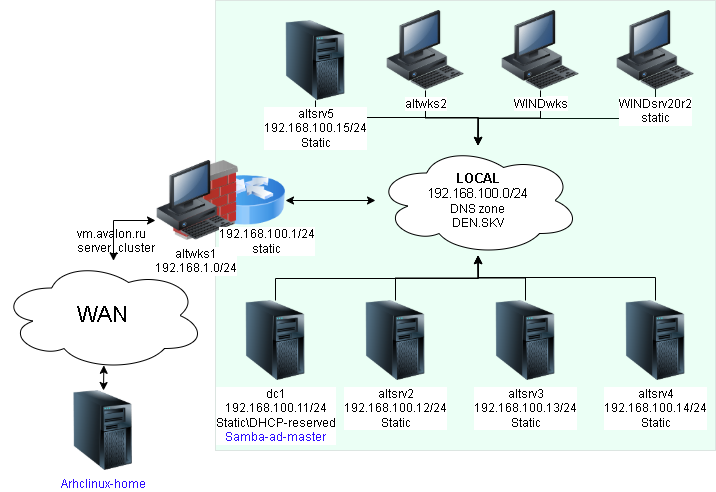
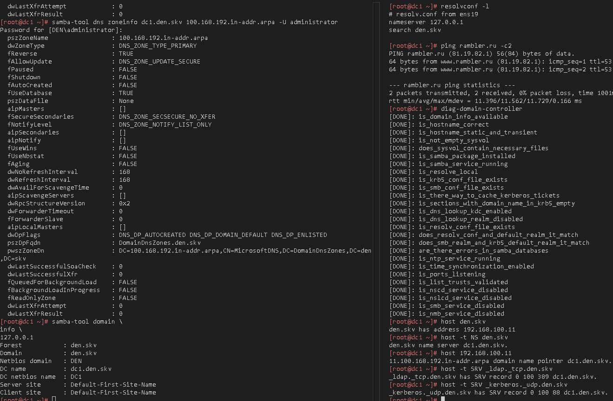

# Лабораторная работа 2 «`Миграция домена с SAMBA_INTERNAL на BIND9_DLZ`» 



## Памятка входа
```bash
# вход на bastion хост по ключу по ssh
eval $(ssh-agent) \
&& ssh-add \
~/.ssh/id_alt-domain_2026_host_ed25519

# Хост altwks1
> ~/.ssh/known_hosts \
&& ssh -t -o StrictHostKeyChecking=accept-new \
sysadmin@172.16.100.2 \
"su -"

# Хост dc1
ssh -t \
-i ~/.ssh/id_alt-domain_2026_host_ed25519 \
-J sysadmin@172.16.100.2 \
-o StrictHostKeyChecking=accept-new \
sysadmin@192.168.100.11 \
"su -"
```
## Остановка службы в режиме samba_internal
```bash
systemctl stop samba
```
## Чистка конфига `/etc/samba/smb.conf`  и отключение от настроек dns
```bash
sed -i '/dns forwarder/d' \
/etc/samba/smb.conf

sed -i '/bind interfaces/d' \
/etc/samba/smb.conf

sed -i '/allow dns/d' \
/etc/samba/smb.conf

sed -i '/dns zone/d' \
/etc/samba/smb.conf

sed -i '/server role/a\        server services = -dns' \
/etc/samba/smb.conf

cat /etc/samba/smb.conf
```

<details>
<summary>Вывод конфига smaba без внутренней службы dns</summary>

```ini
# Global parameters
[global]
        interfaces = lo ens19
        netbios name = DC1
        realm = DEN.SKV
        server role = active directory domain controller
        server services = -dns
        workgroup = DEN
        idmap_ldb:use rfc2307 = yes

[sysvol]
        path = /var/lib/samba/sysvol
        read only = No

[netlogon]
        path = /var/lib/samba/sysvol/den.skv/scripts
        read only = No
```

</details>

## Установка пакета Bind9
```bash
apt-get update \
&& apt-get install -y \
bind \
bind-utils
```
## Отключение chroot bind
```bash
control bind-chroot disabled
```
### Вывод chroot с каталогом /var/lib/bind/
```bash
control bind-chroot
```

<details>
<summary>Состояние bind chroot</summary>

```log
disabled
```

</details>

## Изменение настроек `/etc/sysconfig/bind`
```bash
# Отключение KRB5RCACHETYPE
grep -q KRB5RCACHETYPE /etc/sysconfig/bind \
|| echo 'KRB5RCACHETYPE="none"' \
| tee -a /etc/sysconfig/bind

# Указываем на работу только на IPv4
sed -i 's/S=""/S="-4"/' \
/etc/sysconfig/bind

cat !$
```

<details>
<summary>содержимое /etc/sysconfig/bind</summary>

```log
cat /etc/sysconfig/bind
# ISC named startup options
# Use -4 for ipv4 only behaviour. See named(8) for details.

# EXTRAOPTIONS can be used to override any other options (the last passed wins)
EXTRAOPTIONS=""

# Starting with bind 9.10, chrooted mode is under control(1).
CHROOT="-t /"
# As of bind 9.11.19-alt3 the dropping of Linux capabilities is under control(1).
#RETAIN_CAPS="-r"
KRB5RCACHETYPE="none"
```

</details>

## Подключение плагина BIND_DLZ в конфиге `/etc/bind/named.conf`
```bash
grep -q 'bind-dns' /etc/bind/named.conf \
|| echo 'include "/var/lib/samba/bind-dns/named.conf";' \
| tee -a /etc/bind/named.conf

cat !$
```

<details>
<summary>содержимое /etc/bind/named.conf</summary>

```log
cat /etc/bind/named.conf
// This is the primary configuration file for the BIND DNS server named.
//
// If you are just adding zones, please do that in /var/lib/bind/etc/bind/local.conf

include "/etc/bind/options.conf";
include "/etc/bind/rndc.conf";
include "/etc/bind/local.conf";
include "/var/lib/samba/bind-dns/named.conf";
```

</details>

## Формирование настроек `/etc/bind/options.conf`
```bash
# бэкап стандартных настроек bind
cp -v /etc/bind/options.conf{,.bak}

# Подведение конфига под работу bind_dlz
cat > /etc/bind/options.conf <<'EOF'
options {
    version "unknown";
    directory "/etc/bind/zone";
    dump-file "/var/run/named/named_dump.db";
    statistics-file "/var/run/named/named.stats";
    recursing-file "/var/run/named/named.recursing";
    secroots-file "/var/run/named/named.secroots";
    pid-file none;
    
    tkey-gssapi-keytab "/var/lib/samba/bind-dns/dns.keytab";
    minimal-responses yes;
    validate-except { "den.skv"; };
    
    listen-on { 127.0.0.1; 192.168.100.11; };
    listen-on-v6 { ::1; };
    
    forward first;
    forwarders { 77.88.8.8; 77.88.8.1; };

    allow-query { localhost; localnets; };
    allow-query-cache { localhost; localnets; };
    allow-recursion { localhost; localnets; };
    max-cache-ttl 86400;
};

logging {
        category lame-servers {null;};
};
EOF
```

## Миграция с `Samba_internal` на `bind9_dlz`
```bash
samba_upgradedns \
--dns-backend=BIND9_DLZ
```

<details>
<summary>лог миграции</summary>

```
Reading domain information
DNS accounts already exist
No zone file /var/lib/samba/bind-dns/dns/DEN.SKV.zone (normal)
DNS partitions already exist
Adding dns-dc1 account
check_spn_alias_collision: trying to add SPN 'DNS/dc1.den.skv' on 'CN=dns-dc1,CN=Users,DC=den,DC=skv' when 'host/dc1.den.skv' is on 'CN=DC1,OU=Domain Controllers,DC=den,DC=skv'
See /var/lib/samba/bind-dns/named.conf for an example configuration include file for BIND
and /var/lib/samba/bind-dns/named.txt for further documentation required for secure DNS updates
Finished upgrading DNS
```

</details>

## Проверка настроек dns после миграции
```bash
named-checkconf -p
```

<details>
<summary>лог проверки конфигов dns</summary>

```log
controls {
        inet 127.0.0.1 port 953 allow {
                "localhost";
        } keys {
                "rndc-key";
        };
};
logging {
        category "lame-servers" {
                "null";
        };
};
options {
        directory "/etc/bind/zone";
        dump-file "/var/run/named/named_dump.db";
        listen-on  {
                127.0.0.1/32;
                192.168.100.11/32;
        };
        listen-on-v6  {
                ::1/128;
        };
        pid-file none;
        recursing-file "/var/run/named/named.recursing";
        secroots-file "/var/run/named/named.secroots";
        statistics-file "/var/run/named/named.stats";
        tkey-gssapi-keytab "/var/lib/samba/bind-dns/dns.keytab";
        version "unknown";
        allow-query-cache {
                "localhost";
                "localnets";
        };
        allow-recursion {
                "localhost";
                "localnets";
        };
        max-cache-ttl 86400;
        minimal-responses yes;
        validate-except {
                "den.skv";
        };
        allow-query {
                "localhost";
                "localnets";
        };
        forward first;
        forwarders {
                77.88.8.8;
                77.88.8.1;
        };
};
dlz "AD DNS Zone" {
        database "dlopen /usr/lib64/samba-dc/bind9/dlz_bind9_18.so";
};
key "rndc-key" {
        algorithm "hmac-sha256";
        secret "G+ZkxQCdLuteFekVLH2iW9c8iiyAXKbYM25ZFAhDBhQ=";
};
zone "localhost" {
        type master;
        file "localhost";
        allow-update {
                "none";
        };
};
zone "localdomain" {
        type master;
        file "localdomain";
        allow-update {
                "none";
        };
};
zone "127.in-addr.arpa" {
        type master;
        file "127.in-addr.arpa";
        allow-update {
                "none";
        };
};
zone "0.in-addr.arpa" {
        type master;
        file "empty";
        allow-update {
                "none";
        };
};
zone "255.in-addr.arpa" {
        type master;
        file "empty";
        allow-update {
                "none";
        };
};
```

</details>

## ЗАпуск Служб `SAMBA-DC` и `Bind9`
```bash
systemctl enable --now samba bind
```
## Провекрка проверка что члужбы включились
```bash
systemctl is-active samba bind
```

<details>
<summary>лог активности запущенных служб</summary>

```log
Synchronizing state of samba.service with SysV service script with /usr/lib/systemd/systemd-sysv-install.
Executing: /usr/lib/systemd/systemd-sysv-install enable samba
Synchronizing state of bind.service with SysV service script with /usr/lib/systemd/systemd-sysv-install.
Executing: /usr/lib/systemd/systemd-sysv-install enable bind
Created symlink '/etc/systemd/system/multi-user.target.wants/bind.service' → '/usr/lib/systemd/system/bind.service'.
```

```log
active
active
```

</details>

## Диагностика работы Контролера домена 
```bash
# Утилитой диагностики
diag-domain-controller
```

<details>
<summary>лог диагностики</summary>

```log
[DONE]: is_domain_info_available
[DONE]: is_hostname_correct
[DONE]: is_hostname_static_and_transient
[DONE]: is_not_empty_sysvol
[DONE]: does_sysvol_contain_necessary_files
[DONE]: is_samba_package_installed
[DONE]: is_samba_service_running
[DONE]: is_resolve_local
[DONE]: is_krb5_conf_file_exists
[DONE]: is_smb_conf_file_exists
[DONE]: is_there_way_to_cache_kerberos_tickets
[DONE]: is_sections_with_domain_name_in_krb5_empty
[DONE]: is_dns_lookup_kdc_enabled
[DONE]: is_dns_lookup_realm_disabled
[DONE]: is_resolv_conf_file_exists
[DONE]: does_resolv_conf_and_default_realm_it_match
[DONE]: does_smb_realm_and_krb5_default_realm_it_match
[DONE]: are_there_errors_in_samba_databases
[DONE]: is_ntp_service_running
[DONE]: is_time_synchronization_enabled
[DONE]: is_ports_listening
[DONE]: is_list_trusts_validated
[DONE]: is_nscd_service_disabled
[DONE]: is_nslcd_service_disabled
[DONE]: is_smb_service_disabled
[DONE]: is_nmb_service_disabled
```

</details>

```bash
# текущие настройки resolvconf
resolvconf -l
```

<details>
<summary>текущие настройки resolvconf</summary>

```log
# resolv.conf from ens19
nameserver 127.0.0.1
search den.skv
```

</details>

```bash
# Первый пинг адреса(без кеша) до внешнего сайта
ping rambler.ru -c2
```

<details>
<summary>Первый пинг DNS-адреса (без кеша)</summary>

```log
PING rambler.ru (81.19.82.1) 56(84) bytes of data.
64 bytes from www.rambler.ru (81.19.82.1): icmp_seq=1 ttl=53 time=11.7 ms
64 bytes from www.rambler.ru (81.19.82.1): icmp_seq=2 ttl=53 time=11.4 ms

--- rambler.ru ping statistics ---
2 packets transmitted, 2 received, 0% packet loss, time 1001ms
rtt min/avg/max/mdev = 11.396/11.562/11.729/0.166 ms
```

</details>

```bash
# Резолв хоста за именем домена
host den.skv
```

<details>
<summary>A Запись на адрес домена</summary>

```log
den.skv has address 192.168.100.11
```

</details>

```bash
# Резолв хоста по fqdn
host dc1.den.skv
```

<details>
<summary>A Запись на адрес хоста</summary>

```log
dc1.den.skv has address 192.168.100.11
```

</details>

```bash
# Резолв хоста по PTR записи
host 192.168.100.11
```
<details>
<summary>PTR Запись на адрес хоста</summary>

```log
11.100.168.192.in-addr.arpa domain name pointer dc1.den.skv.
```

</details>

```bash
# Резолв DNS-сервер записи домена
host -t NS den.skv
```

<details>
<summary>NS Запись на сервер имен</summary>

```log
den.skv name server dc1.den.skv.
```

</details>

```bash
# Резолв записи Службы kerberos в домене den.skv
host -t SRV _kerberos._udp.den.skv
```

<details>
<summary>SRV Запись на службу kerberos</summary>

```log
_kerberos._udp.den.skv has SRV record 0 100 88 dc1.den.skv.
```

</details>

```bash
# Резолв записи Службы ldap в домене den.skv
host -t SRV _ldap._tcp.den.skv
```
<details>
<summary>SRV Запись на службу ldap</summary>

```log
_ldap._tcp.den.skv has SRV record 0 100 389 dc1.den.skv.
```

</details>


### Вывод информации о созданной зоне
```bash
samba-tool dns \
zoneinfo \
dc1.den.skv \
100.168.192.in-addr.arpa \
-U administrator
```

<details>
<summary>ВЫВОД информации о зоне</summary>

```log
Password for [DEN\administrator]:
  pszZoneName                 : 100.168.192.in-addr.arpa
  dwZoneType                  : DNS_ZONE_TYPE_PRIMARY
  fReverse                    : TRUE
  fAllowUpdate                : DNS_ZONE_UPDATE_SECURE
  fPaused                     : FALSE
  fShutdown                   : FALSE
  fAutoCreated                : FALSE
  fUseDatabase                : TRUE
  pszDataFile                 : None
  aipMasters                  : []
  fSecureSecondaries          : DNS_ZONE_SECSECURE_NO_XFER
  fNotifyLevel                : DNS_ZONE_NOTIFY_LIST_ONLY
  aipSecondaries              : []
  aipNotify                   : []
  fUseWins                    : FALSE
  fUseNbstat                  : FALSE
  fAging                      : FALSE
  dwNoRefreshInterval         : 168
  dwRefreshInterval           : 168
  dwAvailForScavengeTime      : 0
  aipScavengeServers          : []
  dwRpcStructureVersion       : 0x2
  dwForwarderTimeout          : 0
  fForwarderSlave             : 0
  aipLocalMasters             : []
  dwDpFlags                   : DNS_DP_AUTOCREATED DNS_DP_DOMAIN_DEFAULT DNS_DP_ENLISTED 
  pszDpFqdn                   : DomainDnsZones.den.skv
  pwszZoneDn                  : DC=100.168.192.in-addr.arpa,CN=MicrosoftDNS,DC=DomainDnsZones,DC=den,DC=skv
  dwLastSuccessfulSoaCheck    : 0
  dwLastSuccessfulXfr         : 0
  fQueuedForBackgroundLoad    : FALSE
  fBackgroundLoadInProgress   : FALSE
  fReadOnlyZone               : FALSE
  dwLastXfrAttempt            : 0
  dwLastXfrResult             : 0
```

</details>



### Для github и gitflic
```bash
exit

git branch -v

git log --oneline

git switch main

git status

pushd \
..

git rm -r --cached \
. ../

git add . ../ \
&& git status

git remote -v

git commit -am "AD SAMBA_INTERNAL migration to Bind9_dlz" \
&& git push \
--set-upstream \
altlinux \
main \
&& git push \
--set-upstream \
altlinux_gf \
main

popd
```