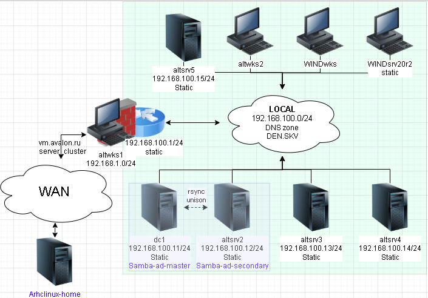

# Лабораторная работа 3 «`Миграция домена с SAMBA_INTERNAL на BIND9_DLZ`»



## Памятка входа

```bash
# Регистрация сгенерированного ssh агентом
eval $(ssh-agent) \
&& ssh-add \
~/.ssh/id_alt-domain_2026_host_ed25519

# Хост altwks1
> ~/.ssh/known_hosts \
&& ssh -t -o StrictHostKeyChecking=accept-new \
sysadmin@172.16.100.2 \
"su -"

# Хост dc1
ssh -t \
-i ~/.ssh/id_alt-domain_2026_host_ed25519 \
-J sysadmin@172.16.100.2 \
-o StrictHostKeyChecking=accept-new \
sysadmin@192.168.100.11 \
"su -"

# Хост dc2
ssh -t \
-i ~/.ssh/id_alt-domain_2026_host_ed25519 \
-J sysadmin@172.16.100.2 \
-o StrictHostKeyChecking=accept-new \
sysadmin@192.168.100.12 \
"su -"
```

## Подготовка для работы

```bash
# Регистрация сгенерированного ssh агентом
eval $(ssh-agent) \
&& ssh-add \
~/.ssh/id_alt-domain_2026_host_ed25519

# Вход на Хост altwks1
> ~/.ssh/known_hosts \
&& ssh -t -o StrictHostKeyChecking=accept-new \
sysadmin@172.16.100.2 \
"su -"

# Проверяем наличие пары ключей ssh на altwks1
find /home/sysadmin/.ssh/ \
| grep alt-domain
```

<details>
<summary>Проверка наличия пары ssh</summary>

```log
/home/sysadmin/.ssh/id_alt-domain_2026_host_ed25519.pub
/home/sysadmin/.ssh/id_alt-domain_2026_host_ed25519
```

</details>

### Проброс ключей

```bash
# проброс ключа до Управляемых хостов
for ip in 12; do \
ssh-copy-id \
-o StrictHostKeyChecking=accept-new \
-i /home/sysadmin/.ssh/id_alt-domain_2026_host_ed25519.pub \
sysadmin@192.168.100.$ip; done
```

<details>
<summary>лог проброса ключа для подключения</summary>

```log
/usr/bin/ssh-copy-id: INFO: Source of key(s) to be installed: "/home/sysadmin/.ssh/id_alt-domain_2026_host_ed25519.pub"
/usr/bin/ssh-copy-id: INFO: attempting to log in with the new key(s), to filter out any that are already installed
/usr/bin/ssh-copy-id: INFO: 1 key(s) remain to be installed -- if you are prompted now it is to install the new keys
sysadmin@192.168.100.12's password: 

Number of key(s) added: 1

Now try logging into the machine, with:   "ssh -o 'StrictHostKeyChecking=accept-new' 'sysadmin@192.168.100.12'"
and check to make sure that only the key(s) you wanted were added.
```

</details>

### Проверка входа

```bash
for ip in 12; do \
ssh -t \
-i ~/.ssh/id_alt-domain_2026_host_ed25519 \
-J sysadmin@172.16.100.2 \
-o StrictHostKeyChecking=accept-new \
sysadmin@192.168.100."$ip" \
"hostnamectl && ip -br a" ; done
```

<details>
<summary>вывод доступа до dc2</summary>

```log
Warning: Permanently added '192.168.100.12' (ED25519) to the list of known hosts.
 Static hostname: altsrv2
       Icon name: computer-vm
         Chassis: vm 🖴
      Machine ID: dac3b001c8db895abaedef1a683ecf35
         Boot ID: 2ea6ce68dc084087b8f8bed09cb9d7ae
  Virtualization: kvm
Operating System: ALT Server 11.1 (Mendelevium)
     CPE OS Name: cpe:/o:alt:server:11.1
          Kernel: Linux 6.12.27-6.12-alt1
    Architecture: x86-64
 Hardware Vendor: QEMU
  Hardware Model: Standard PC _i440FX + PIIX, 1996_
Firmware Version: 1.16.3-alt3
   Firmware Date: Tue 2014-04-01
    Firmware Age: 12y 2month 1w 5d                 
lo               UNKNOWN        127.0.0.1/8 ::1/128 
ens19            UP             192.168.100.12/24 fe80::e08b:3dff:fefd:ceeb/64 
Connection to 192.168.100.12 closed.
```

</details>

## Ход работы

### Смена имени хоста и перезагрузка

```bash
ssh -t \
-i ~/.ssh/id_alt-domain_2026_host_ed25519 \
-J sysadmin@172.16.100.2 \
-o StrictHostKeyChecking=accept-new \
sysadmin@192.168.100.12 \
"su -c \
'hostnamectl \
set-hostname \
dc2.den.skv \
&& domainname den.skv \
&& systemctl reboot'"
```

### Смена домена поиска и dns для первичного обновления системы

```bash
ssh -t \
-i ~/.ssh/id_alt-domain_2026_host_ed25519 \
-J sysadmin@172.16.100.2 \
-o StrictHostKeyChecking=accept-new \
sysadmin@192.168.100.12 \
"su -c \
'cat > /etc/net/ifaces/ens19/resolv.conf<<'EOF'
nameserver 77.88.8.8
nameserver 77.88.8.1
search den.skv
EOF'"
```

### Отключение IPV6

```bash
ssh -t \
-i ~/.ssh/id_alt-domain_2026_host_ed25519 \
-J sysadmin@172.16.100.2 \
-o StrictHostKeyChecking=accept-new \
sysadmin@192.168.100.12 \
"su -c \
'echo "net.ipv6.conf.all.disable_ipv6 = 1" \
| tee -a  /etc/sysctl.conf \
&& systemctl reboot'"
```

<details>
<summary>вывод изменения ipv6</summary>

```log
net.ipv6.conf.all.disable_ipv6 = 1
Connection to 192.168.100.12 closed.
```

</details>

### проверка изменений resolvconf и ipv6 после перезагрузки

```bash
ssh -t \
-i ~/.ssh/id_alt-domain_2026_host_ed25519 \
-J sysadmin@172.16.100.2 \
-o StrictHostKeyChecking=accept-new \
sysadmin@192.168.100.12 \
"su -c \
'ip -br a \
&& /usr/sbin/resolvconf -l'"
```

<details>
<summary>вывод resolvconf для обновления системы</summary>

```log
Password: 
lo               UNKNOWN        127.0.0.1/8 
ens19            UP             192.168.100.12/24 
# resolv.conf from ens19
nameserver 77.88.8.8
nameserver 77.88.8.1
search den.skv

Connection to 192.168.100.12 closed.
```

</details>

### Останавливаем конфликтующие службы

```bash
for ip in 12; do \
ssh -t \
-i ~/.ssh/id_alt-domain_2026_host_ed25519 \
-J sysadmin@172.16.100.2 \
-o StrictHostKeyChecking=accept-new \
sysadmin@192.168.100."$ip" \
"su -c \
'export PATH=/root/bin:/usr/sbin:/usr/bin:/sbin:/bin:/usr/local/sbin:/usr/local/bin:/usr/games \
&& systemctl stop \
smb \
nmb \
krb5kdc \
slapd \
bind \
dnsmasq'" ; done
```

<details>
<summary>ВЫВОД остановки</summary>

```log
Password: 
Failed to stop smb.service: Unit smb.service not loaded.
Failed to stop nmb.service: Unit nmb.service not loaded.
Failed to stop krb5kdc.service: Unit krb5kdc.service not loaded.
Failed to stop slapd.service: Unit slapd.service not loaded.
Failed to stop dnsmasq.service: Unit dnsmasq.service not loaded.
Connection to 192.168.100.12 closed.
```

</details>

### Установка необходимых пакетов на dc2

```bash
for ip in 12; do \
ssh -t \
-i ~/.ssh/id_alt-domain_2026_host_ed25519 \
-J sysadmin@172.16.100.2 \
-o StrictHostKeyChecking=accept-new \
sysadmin@192.168.100."$ip" \
"su -c \
'export PATH=/root/bin:/usr/sbin:/usr/bin:/sbin:/bin:/usr/local/sbin:/usr/local/bin:/usr/games \
&& apt-get update \
&& apt-get dist-upgrade -y \
&& apt-get -y install \
alterator-update-kernel \
update-kernel \
alterator-net-domain \
task-samba-dc \
alterator-datetime \
chrony \
diag-domain-controller \
bind \
bind-utils \
&& update-kernel -y \
&& systemctl reboot'" ; done
```

### Чистка настроек SAMBA после обновления и установки системы

```bash
for ip in 12; do \
ssh -t \
-i ~/.ssh/id_alt-domain_2026_host_ed25519 \
-J sysadmin@172.16.100.2 \
-o StrictHostKeyChecking=accept-new \
sysadmin@192.168.100."$ip" \
"su -c \
'export PATH=/root/bin:/usr/sbin:/usr/bin:/sbin:/bin:/usr/local/sbin:/usr/local/bin:/usr/games \
&& rm -fv /etc/samba/smb.conf \
&& rm -rfv /var/{lib,cache}/samba \
&& mkdir -pv /var/lib/samba/sysvol'" ; done
```

<details>
<summary>ВЫВОД чистки</summary>

```log
Password: 
removed '/etc/samba/smb.conf'
removed directory '/var/lib/samba/winbindd_privileged'
removed directory '/var/lib/samba/private'
removed directory '/var/lib/samba/sysvol'
removed directory '/var/lib/samba'
removed directory '/var/cache/samba'
mkdir: created directory '/var/lib/samba'
mkdir: created directory '/var/lib/samba/sysvol'
Connection to 192.168.100.12 closed.
```

</details>

### Настройка chrony

#### Смена домена поиска и dns на основной dc

```bash
for ip in 12; do \
ssh -t \
-i ~/.ssh/id_alt-domain_2026_host_ed25519 \
-J sysadmin@172.16.100.2 \
-o StrictHostKeyChecking=accept-new \
sysadmin@192.168.100."$ip" \
"su -c \
'export PATH=/root/bin:/usr/sbin:/usr/bin:/sbin:/bin:/usr/local/sbin:/usr/local/bin:/usr/games \
&& cat > /etc/net/ifaces/ens19/resolv.conf<<'EOF'
nameserver 192.168.100.11
search den.skv
EOF'" ; done
```

#### применение изменений reolver

```bash
for ip in 12; do \
ssh -t \
-i ~/.ssh/id_alt-domain_2026_host_ed25519 \
-J sysadmin@172.16.100.2 \
-o StrictHostKeyChecking=accept-new \
sysadmin@192.168.100."$ip" \
"su -c \
'export PATH=/root/bin:/usr/sbin:/usr/bin:/sbin:/bin:/usr/local/sbin:/usr/local/bin:/usr/games \
&& ifdown ens19 \
; systemctl restart network \
; ifup ens19 \
&& resolvconf -u'" ; done
```

#### Проверка изменений reolver

```bash
for ip in 12; do \
ssh -t \
-i ~/.ssh/id_alt-domain_2026_host_ed25519 \
-J sysadmin@172.16.100.2 \
-o StrictHostKeyChecking=accept-new \
sysadmin@192.168.100."$ip" \
"su -c \
'export PATH=/root/bin:/usr/sbin:/usr/bin:/sbin:/bin:/usr/local/sbin:/usr/local/bin:/usr/games \
&& resolvconf -l'" ; done
```

<details>
<summary>Проверка смены resolver</summary>

```log
Password: 
# resolv.conf from ens19
nameserver 192.168.100.11
search den.skv

Connection to 192.168.100.12 closed.
```

</details>

### Прменение настроек

```bash
for ip in 12; do \
ssh -t \
-i ~/.ssh/id_alt-domain_2026_host_ed25519 \
-J sysadmin@172.16.100.2 \
-o StrictHostKeyChecking=accept-new \
sysadmin@192.168.100."$ip" \
"su -c \
'export PATH=/root/bin:/usr/sbin:/usr/bin:/sbin:/bin:/usr/local/sbin:/usr/local/bin:/usr/games \
&& control chrony server \
&& cp /etc/chrony.conf{,.bak} \
&& cat > /etc/chrony.conf<<'EOF'
server dc1.den.skv iburst
server ntp3.vniiftri.ru iburst
driftfile /var/lib/chrony/drift
makestep 1.0 3
rtcsync
allow 192.168.100.0/24
local stratum 10
ntsdumpdir /var/lib/chrony
logdir /var/log/chrony
EOF'" ; done
```

### Запуск chrony и проверка

```bash
for ip in 12; do \
ssh -t \
-i ~/.ssh/id_alt-domain_2026_host_ed25519 \
-J sysadmin@172.16.100.2 \
-o StrictHostKeyChecking=accept-new \
sysadmin@192.168.100."$ip" \
"su -c \
'export PATH=/root/bin:/usr/sbin:/usr/bin:/sbin:/bin:/usr/local/sbin:/usr/local/bin:/usr/games \
&& systemctl enable --now chronyd.service \
&& systemctl restart chronyd.service chrony-wait.service \
&& chronyc tracking \
&& chronyc sources'" ; done
```

<details>
<summary>Проверка работы chrony</summary>

```log
Password: 
Synchronizing state of chronyd.service with SysV service script with /usr/lib/systemd/systemd-sysv-install.
Executing: /usr/lib/systemd/systemd-sysv-install enable chronyd
Reference ID    : C0A8640B (dc1.den.skv)
Stratum         : 3
Ref time (UTC)  : Sat Jun 13 17:11:06 2026
System time     : 0.000011954 seconds slow of NTP time
Last offset     : -0.000032191 seconds
RMS offset      : 0.000032191 seconds
Frequency       : 15.329 ppm slow
Residual freq   : +0.266 ppm
Skew            : 0.108 ppm
Root delay      : 0.014728057 seconds
Root dispersion : 0.000441694 seconds
Update interval : 0.0 seconds
Leap status     : Normal
MS Name/IP address         Stratum Poll Reach LastRx Last sample               
===============================================================================
^* dc1.den.skv                   2   6     7     1    -98us[ -130us] +/- 7792us
^+ ntp3.vniiftri.ru              1   6     7     1   +272us[ +240us] +/- 6961us
```

</details>


### Развертывание bind

#### Отключение bind-chroot и подготовка в /etc/sysconfig/bind

```bash
ssh -t \
-i ~/.ssh/id_alt-domain_2026_host_ed25519 \
-J sysadmin@172.16.100.2 \
-o StrictHostKeyChecking=accept-new \
sysadmin@192.168.100.12 \
"su -c \
'export PATH=/root/bin:/usr/sbin:/usr/bin:/sbin:/bin:/usr/local/sbin:/usr/local/bin:/usr/games \
&& control bind-chroot disabled \
&& control bind-chroot \
&& cat > /etc/sysconfig/bind<<'EOF'
# ISC named startup options
# Use -4 for ipv4 only behaviour. See named(8) for details.

# EXTRAOPTIONS can be used to override any other options (the last passed wins)
EXTRAOPTIONS=\"-4\"

# Starting with bind 9.10, chrooted mode is under control(1).
CHROOT=\"-t /\"
# As of bind 9.11.19-alt3 the dropping of Linux capabilities is under control(1).
#RETAIN_CAPS=\"-r\"
KRB5RCACHETYPE=\"none\"
EOF'"
```

#### Включение samba плагина для Bind 
```bash
ssh -t \
-i ~/.ssh/id_alt-domain_2026_host_ed25519 \
-J sysadmin@172.16.100.2 \
-o StrictHostKeyChecking=accept-new \
sysadmin@192.168.100.12 \
"su -c \
'export PATH=/root/bin:/usr/sbin:/usr/bin:/sbin:/bin:/usr/local/sbin:/usr/local/bin:/usr/games \
&& cat >/etc/bind/named.conf<<'EOF'
// This is the primary configuration file for the BIND DNS server named.
//
// If you are just adding zones, please do that in /var/lib/bind/etc/bind/local.conf

include \"/etc/bind/options.conf\";
include \"/etc/bind/rndc.conf\";
include \"/etc/bind/local.conf\";
include \"/var/lib/samba/bind-dns/named.conf\";
EOF'"
```

#### Настройки bind под локальный сервер
```bash
ssh -t \
-i ~/.ssh/id_alt-domain_2026_host_ed25519 \
-J sysadmin@172.16.100.2 \
-o StrictHostKeyChecking=accept-new \
sysadmin@192.168.100.12 \
"su -c \
'export PATH=/root/bin:/usr/sbin:/usr/bin:/sbin:/bin:/usr/local/sbin:/usr/local/bin:/usr/games \
&& cat > /etc/bind/options.conf <<'EOF'
options {
    version \"unknown\";
    directory \"/etc/bind/zone\";
    dump-file \"/var/run/named/named_dump.db\";
    statistics-file \"/var/run/named/named.stats\";
    recursing-file \"/var/run/named/named.recursing\";
    secroots-file \"/var/run/named/named.secroots\";
    pid-file none;
    
    tkey-gssapi-keytab \"/var/lib/samba/bind-dns/dns.keytab\";
    minimal-responses yes;
    validate-except { \"den.skv\"; };
    
    listen-on { 127.0.0.1; 192.168.100.12; };
    listen-on-v6 { ::1; };
    
    forward first;
    forwarders { 77.88.8.8; 77.88.8.1; };

    allow-query { localhost; localnets; };
    allow-query-cache { localhost; localnets; };
    allow-recursion { localhost; localnets; };
    max-cache-ttl 86400;
};

logging {
        category lame-servers {null;};
};
EOF'"
```

#### Проверки Внесенных изменений

```bash
ssh -t \
-i ~/.ssh/id_alt-domain_2026_host_ed25519 \
-J sysadmin@172.16.100.2 \
-o StrictHostKeyChecking=accept-new \
sysadmin@192.168.100.12 \
"su -c \
'export PATH=/root/bin:/usr/sbin:/usr/bin:/sbin:/bin:/usr/local/sbin:/usr/local/bin:/usr/games \
&& named-checkconf -p /etc/bind/options.conf \
&& cat /etc/sysconfig/bind \
&& cat /etc/bind/named.conf'"
```

<details>
<summary>содержимое измененных конфигов под BIND9</summary>

```log
Password: 
logging {
        category "lame-servers" {
                "null";
        };
};
options {
        directory "/etc/bind/zone";
        dump-file "/var/run/named/named_dump.db";
        listen-on  {
                127.0.0.1/32;
                192.168.100.12/32;
        };
        listen-on-v6  {
                ::1/128;
        };
        pid-file none;
        recursing-file "/var/run/named/named.recursing";
        secroots-file "/var/run/named/named.secroots";
        statistics-file "/var/run/named/named.stats";
        tkey-gssapi-keytab "/var/lib/samba/bind-dns/dns.keytab";
        version "unknown";
        allow-query-cache {
                "localhost";
                "localnets";
        };
        allow-recursion {
                "localhost";
                "localnets";
        };
        max-cache-ttl 86400;
        minimal-responses yes;
        validate-except {
                "den.skv";
        };
        allow-query {
                "localhost";
                "localnets";
        };
        forward first;
        forwarders {
                77.88.8.8;
                77.88.8.1;
        };
};
# ISC named startup options
# Use -4 for ipv4 only behaviour. See named(8) for details.

# EXTRAOPTIONS can be used to override any other options (the last passed wins)
EXTRAOPTIONS="-4"

# Starting with bind 9.10, chrooted mode is under control(1).
CHROOT="-t /"
# As of bind 9.11.19-alt3 the dropping of Linux capabilities is under control(1).
#RETAIN_CAPS=-r
KRB5RCACHETYPE="none"
// This is the primary configuration file for the BIND DNS server named.
//
// If you are just adding zones, please do that in /var/lib/bind/etc/bind/local.conf

include "/etc/bind/options.conf";
include "/etc/bind/rndc.conf";
include "/etc/bind/local.conf";
include "/var/lib/samba/bind-dns/named.conf";
Connection to 192.168.100.12 closed.
```

</details>

### Смена редакции лиценирования с edition_server на edition_domain

```bash
ssh -t \
-i ~/.ssh/id_alt-domain_2026_host_ed25519 \
-J sysadmin@172.16.100.2 \
-o StrictHostKeyChecking=accept-new \
sysadmin@192.168.100.12 \
"su -c \
'export PATH=/root/bin:/usr/sbin:/usr/bin:/sbin:/bin:/usr/local/sbin:/usr/local/bin:/usr/games \
&& alteratorctl editions set edition_domain \
&& alteratorctl editions'"
```

<details>
<summary>Смена редакции</summary>

```log
Password: 
* ALT Domain (edition_domain)
  ALT Server (edition_server)
free(): invalid pointer
Connection to 192.168.100.12 closed.
```

</details>

### Прменение настроек kerberos

```bash
ssh -t \
-i ~/.ssh/id_alt-domain_2026_host_ed25519 \
-J sysadmin@172.16.100.2 \
-o StrictHostKeyChecking=accept-new \
sysadmin@192.168.100.12 \
"su -c \
'export PATH=/root/bin:/usr/sbin:/usr/bin:/sbin:/bin:/usr/local/sbin:/usr/local/bin:/usr/games \
&& cat > /etc/krb5.conf<<'EOF'
[libdefaults]
        default_realm = DEN.SKV
        dns_lookup_realm = false
        dns_lookup_kdc = true

[realms]
DEN.SKV = {
        default_domain = den.skv
}

[domain_realm]
        dc1 = DEN.SKV
EOF'"
```

### Подготовка A и PTR записей до ввода второго Домен контролера

```bash
ssh -t \
-i ~/.ssh/id_alt-domain_2026_host_ed25519 \
-J sysadmin@172.16.100.2 \
-o StrictHostKeyChecking=accept-new \
sysadmin@192.168.100.11 \
"su -c \
'export PATH=/root/bin:/usr/sbin:/usr/bin:/sbin:/bin:/usr/local/sbin:/usr/local/bin:/usr/games \
&& samba-tool dns \
add \
dc1.den.skv \
den.skv \
DC2 \
A \
192.168.100.12 \
-U Administrator \
&& samba-tool dns \
add \
dc1.den.skv \
100.168.192.in-addr.arpa \
12 PTR \
dc2.den.skv \
-U Administrator'"
```

<details>
<summary>лог добавления записей на основном DC</summary>

```log
Warning: Permanently added '192.168.100.11' (ED25519) to the list of known hosts.
Password: 
Password for [DEN\Administrator]:
Record added successfully
Password for [DEN\Administrator]:
Record added successfully
Connection to 192.168.100.11 closed.
```

</details>

### Проверка dns записей и настроек kerberos со стороны DC2 перед развертыванием

```bash
ssh -t \
-i ~/.ssh/id_alt-domain_2026_host_ed25519 \
-J sysadmin@172.16.100.2 \
-o StrictHostKeyChecking=accept-new \
sysadmin@192.168.100.12 \
"su -c \
'export PATH=/root/bin:/usr/sbin:/usr/bin:/sbin:/bin:/usr/local/sbin:/usr/local/bin:/usr/games \
&& host dc2 192.168.100.11 \
&& host 192.168.100.12 192.168.100.11 \
&& cat /etc/krb5.conf \
&& resolvconf -l'"
```

<details>
<summary>Проверка готовности перед вводом в домен</summary>

```log
Password: 
Using domain server:
Name: 192.168.100.11
Address: 192.168.100.11#53
Aliases: 

dc2.den.skv has address 192.168.100.12
Using domain server:
Name: 192.168.100.11
Address: 192.168.100.11#53
Aliases: 

12.100.168.192.in-addr.arpa domain name pointer dc2.den.skv.
includedir /etc/krb5.conf.d/
[logging]
[libdefaults]
 dns_lookup_kdc = true
 dns_lookup_realm = false
 ticket_lifetime = 24h
 renew_lifetime = 7d
 forwardable = true
 rdns = false
 default_realm = DEN.SKV
 default_ccache_name = KEYRING:persistent:%{uid}
[realms]
[domain_realm]
# resolv.conf from ens19
nameserver 192.168.100.11
search den.skv

Connection to 192.168.100.12 closed.
```

</details>

### Создание основного домен контроллера с командной строки

#### Предварительно получение kerberos для root

```bash
ssh -t \
-i ~/.ssh/id_alt-domain_2026_host_ed25519 \
-J sysadmin@172.16.100.2 \
-o StrictHostKeyChecking=accept-new \
sysadmin@192.168.100.12 \
"su -c \
'export PATH=/root/bin:/usr/sbin:/usr/bin:/sbin:/bin:/usr/local/sbin:/usr/local/bin:/usr/games \
&& kinit -V Administrator'"
```

<details>
<summary>Получение билета администратора домена</summary>

```log
Password: 
Using default cache: persistent:0:0
Using principal: Administrator@DEN.SKV
Password for Administrator@DEN.SKV: 
Warning: Your password will expire in 39 days on Thu Jul 23 18:39:24 2026
Authenticated to Kerberos v5
Connection to 192.168.100.12 closed.
```

</details>

#### Ввода в домен DC2

```bash
ssh -t \
-i ~/.ssh/id_alt-domain_2026_host_ed25519 \
-J sysadmin@172.16.100.2 \
-o StrictHostKeyChecking=accept-new \
sysadmin@192.168.100.12 \
"su -c \
'export PATH=/root/bin:/usr/sbin:/usr/bin:/sbin:/bin:/usr/local/sbin:/usr/local/bin:/usr/games \
&& kinit -V Administrator \
&& samba-tool domain join den.skv DC -UAdministrator \
--realm=den.skv \
--dns-backend=BIND9_DLZ \
--option=\"idmap_ldb:use rfc2307 = yes\" \
--option=\"interfaces= lo ens19\"'"
```

<details>
<summary>Лог ввода в домен</summary>

```log
Password: 
Using default cache: /tmp/krb5cc_0
Using principal: Administrator@DEN.SKV
Password for Administrator@DEN.SKV: 
Warning: Your password will expire in 39 days on Thu Jul 23 18:39:24 2026
Authenticated to Kerberos v5
INFO 2026-06-13 22:59:14,688 pid:1436 /usr/lib64/samba-dc/python3.12/samba/join.py #104: Finding a writeable DC for domain 'den.skv'
INFO 2026-06-13 22:59:14,719 pid:1436 /usr/lib64/samba-dc/python3.12/samba/join.py #106: Found DC dc1.den.skv
Password for [WORKGROUP\Administrator]:
INFO 2026-06-13 22:59:21,860 pid:1436 /usr/lib64/samba-dc/python3.12/samba/join.py #358: Reconnecting to naming master 174bc76c-293b-41b6-9b20-4f39082af8e6._msdcs.den.skv
INFO 2026-06-13 22:59:22,014 pid:1436 /usr/lib64/samba-dc/python3.12/samba/join.py #365: DNS name of new naming master is dc1.den.skv
INFO 2026-06-13 22:59:22,016 pid:1436 /usr/lib64/samba-dc/python3.12/samba/join.py #1640: workgroup is DEN
INFO 2026-06-13 22:59:22,016 pid:1436 /usr/lib64/samba-dc/python3.12/samba/join.py #1643: realm is den.skv
Adding CN=DC2,OU=Domain Controllers,DC=den,DC=skv
Adding CN=DC2,CN=Servers,CN=Default-First-Site-Name,CN=Sites,CN=Configuration,DC=den,DC=skv
Adding CN=NTDS Settings,CN=DC2,CN=Servers,CN=Default-First-Site-Name,CN=Sites,CN=Configuration,DC=den,DC=skv
Adding SPNs to CN=DC2,OU=Domain Controllers,DC=den,DC=skv
Setting account password for DC2$
Enabling account
Adding DNS account CN=dns-DC2,CN=Users,DC=den,DC=skv with dns/ SPN
Setting account password for dns-DC2
Calling bare provision
INFO 2026-06-13 22:59:23,347 pid:1436 /usr/lib64/samba-dc/python3.12/samba/provision/__init__.py #2112: Looking up IPv4 addresses
INFO 2026-06-13 22:59:23,347 pid:1436 /usr/lib64/samba-dc/python3.12/samba/provision/__init__.py #2129: Looking up IPv6 addresses
WARNING 2026-06-13 22:59:23,348 pid:1436 /usr/lib64/samba-dc/python3.12/samba/provision/__init__.py #2136: No IPv6 address will be assigned
INFO 2026-06-13 22:59:23,719 pid:1436 /usr/lib64/samba-dc/python3.12/samba/provision/__init__.py #2302: Setting up share.ldb
INFO 2026-06-13 22:59:23,804 pid:1436 /usr/lib64/samba-dc/python3.12/samba/provision/__init__.py #2306: Setting up secrets.ldb
INFO 2026-06-13 22:59:23,876 pid:1436 /usr/lib64/samba-dc/python3.12/samba/provision/__init__.py #2311: Setting up the registry
INFO 2026-06-13 22:59:24,117 pid:1436 /usr/lib64/samba-dc/python3.12/samba/provision/__init__.py #2314: Setting up the privileges database
INFO 2026-06-13 22:59:24,232 pid:1436 /usr/lib64/samba-dc/python3.12/samba/provision/__init__.py #2317: Setting up idmap db
INFO 2026-06-13 22:59:24,309 pid:1436 /usr/lib64/samba-dc/python3.12/samba/provision/__init__.py #2324: Setting up SAM db
INFO 2026-06-13 22:59:24,330 pid:1436 /usr/lib64/samba-dc/python3.12/samba/provision/__init__.py #887: Setting up sam.ldb partitions and settings
INFO 2026-06-13 22:59:24,331 pid:1436 /usr/lib64/samba-dc/python3.12/samba/provision/__init__.py #899: Setting up sam.ldb rootDSE
INFO 2026-06-13 22:59:24,348 pid:1436 /usr/lib64/samba-dc/python3.12/samba/provision/__init__.py #1312: Pre-loading the Samba 4 and AD schema
Unable to determine the DomainSID, can not enforce uniqueness constraint on local domainSIDs

INFO 2026-06-13 22:59:24,444 pid:1436 /usr/lib64/samba-dc/python3.12/samba/provision/__init__.py #2425: A Kerberos configuration suitable for Samba AD has been generated at /var/lib/samba/private/krb5.conf
INFO 2026-06-13 22:59:24,445 pid:1436 /usr/lib64/samba-dc/python3.12/samba/provision/__init__.py #2427: Merge the contents of this file with your system krb5.conf or replace it with this one. Do not create a symlink!
Provision OK for domain DN DC=den,DC=skv
INFO 2026-06-13 22:59:24,462 pid:1436 /usr/lib64/samba-dc/python3.12/samba/join.py #999: Starting replication
Schema-DN[CN=Schema,CN=Configuration,DC=den,DC=skv] objects[402/1770] linked_values[0/0]
Schema-DN[CN=Schema,CN=Configuration,DC=den,DC=skv] objects[804/1770] linked_values[0/0]
Schema-DN[CN=Schema,CN=Configuration,DC=den,DC=skv] objects[1206/1770] linked_values[0/0]
Schema-DN[CN=Schema,CN=Configuration,DC=den,DC=skv] objects[1608/1770] linked_values[0/0]
Schema-DN[CN=Schema,CN=Configuration,DC=den,DC=skv] objects[1770/1770] linked_values[0/0]
Analyze and apply schema objects
Partition[CN=Configuration,DC=den,DC=skv] objects[402/1733] linked_values[0/1]
Partition[CN=Configuration,DC=den,DC=skv] objects[804/1733] linked_values[0/1]
Partition[CN=Configuration,DC=den,DC=skv] objects[1206/1733] linked_values[0/1]
Partition[CN=Configuration,DC=den,DC=skv] objects[1608/1733] linked_values[0/1]
Partition[CN=Configuration,DC=den,DC=skv] objects[1733/1733] linked_values[66/66]
Replicating critical objects from the base DN of the domain
Partition[DC=den,DC=skv] objects[99/99] linked_values[23/23]
Partition[DC=den,DC=skv] objects[285/285] linked_values[23/23]
Done with always replicated NC (base, config, schema)
Replicating DC=DomainDnsZones,DC=den,DC=skv
Partition[DC=DomainDnsZones,DC=den,DC=skv] objects[45/45] linked_values[0/0]
Replicating DC=ForestDnsZones,DC=den,DC=skv
Partition[DC=ForestDnsZones,DC=den,DC=skv] objects[18/18] linked_values[0/0]
Exop on[CN=RID Manager$,CN=System,DC=den,DC=skv] objects[3] linked_values[0]
INFO 2026-06-13 22:59:30,923 pid:1436 /usr/lib64/samba-dc/python3.12/samba/join.py #1119: Committing SAM database - this may take some time
Repacking database from v1 to v2 format (first record CN=Max-Renew-Age,CN=Schema,CN=Configuration,DC=den,DC=skv)
Repack: re-packed 10000 records so far
Repacking database from v1 to v2 format (first record CN=licensingSiteSettings-Display,CN=415,CN=DisplaySpecifiers,CN=Configuration,DC=den,DC=skv)
Repacking database from v1 to v2 format (first record DC=_ldap._tcp.DomainDnsZones,DC=den.skv,CN=MicrosoftDNS,DC=DomainDnsZones,DC=den,DC=skv)
Repacking database from v1 to v2 format (first record CN=Infrastructure,DC=ForestDnsZones,DC=den,DC=skv)
Repacking database from v1 to v2 format (first record CN=Windows Authorization Access Group,CN=Builtin,DC=den,DC=skv)
INFO 2026-06-13 22:59:33,687 pid:1436 /usr/lib64/samba-dc/python3.12/samba/join.py #1139: Committed SAM database
INFO 2026-06-13 22:59:33,695 pid:1436 /usr/lib64/samba-dc/python3.12/samba/join.py #1215: Adding 1 remote DNS records for DC2.den.skv
INFO 2026-06-13 22:59:33,935 pid:1436 /usr/lib64/samba-dc/python3.12/samba/join.py #1277: Adding DNS A record DC2.den.skv for IPv4 IP: 192.168.100.12
INFO 2026-06-13 22:59:34,023 pid:1436 /usr/lib64/samba-dc/python3.12/samba/join.py #1305: Adding DNS CNAME record 4ff322f5-2e71-41b7-983c-1c7576717636._msdcs.den.skv for DC2.den.skv
INFO 2026-06-13 22:59:34,114 pid:1436 /usr/lib64/samba-dc/python3.12/samba/join.py #1330: All other DNS records (like _ldap SRV records) will be created samba_dnsupdate on first startup
INFO 2026-06-13 22:59:34,115 pid:1436 /usr/lib64/samba-dc/python3.12/samba/join.py #1336: Replicating new DNS records in DC=DomainDnsZones,DC=den,DC=skv
Partition[DC=DomainDnsZones,DC=den,DC=skv] objects[3/3] linked_values[0/0]
INFO 2026-06-13 22:59:34,200 pid:1436 /usr/lib64/samba-dc/python3.12/samba/join.py #1336: Replicating new DNS records in DC=ForestDnsZones,DC=den,DC=skv
Partition[DC=ForestDnsZones,DC=den,DC=skv] objects[2/2] linked_values[0/0]
INFO 2026-06-13 22:59:34,254 pid:1436 /usr/lib64/samba-dc/python3.12/samba/join.py #1351: Sending DsReplicaUpdateRefs for all the replicated partitions
INFO 2026-06-13 22:59:34,352 pid:1436 /usr/lib64/samba-dc/python3.12/samba/join.py #1381: Setting isSynchronized and dsServiceName
INFO 2026-06-13 22:59:34,376 pid:1436 /usr/lib64/samba-dc/python3.12/samba/join.py #1396: Setting up secrets database
INFO 2026-06-13 22:59:35,131 pid:1436 /usr/lib64/samba-dc/python3.12/samba/provision/sambadns.py #1326: See /var/lib/samba/bind-dns/named.conf for an example configuration include file for BIND
INFO 2026-06-13 22:59:35,132 pid:1436 /usr/lib64/samba-dc/python3.12/samba/provision/sambadns.py #1328: and /var/lib/samba/bind-dns/named.txt for further documentation required for secure DNS updates
INFO 2026-06-13 22:59:35,132 pid:1436 /usr/lib64/samba-dc/python3.12/samba/join.py #1657: Joined domain DEN (SID S-1-5-21-1038836548-715763582-646683758) as a DC
Connection to 192.168.100.12 closed.
```

</details>

#### Вывод получившихся настроек

```bash
ssh -t \
-i ~/.ssh/id_alt-domain_2026_host_ed25519 \
-J sysadmin@172.16.100.2 \
-o StrictHostKeyChecking=accept-new \
sysadmin@192.168.100.12 \
"su -c \
'export PATH=/root/bin:/usr/sbin:/usr/bin:/sbin:/bin:/usr/local/sbin:/usr/local/bin:/usr/games \
&& cat /etc/samba/smb.conf'"
```

<details>
<summary>Вывод получившихся настроек SAMBA DC</summary>

```ini
Password: 
# Global parameters
[global]
        interfaces = lo ens19
        netbios name = DC2
        realm = DEN.SKV
        server role = active directory domain controller
        server services = s3fs, rpc, nbt, wrepl, ldap, cldap, kdc, drepl, winbindd, ntp_signd, kcc, dnsupdate
        workgroup = DEN
        idmap_ldb:use rfc2307  = yes

[sysvol]
        path = /var/lib/samba/sysvol
        read only = No

[netlogon]
        path = /var/lib/samba/sysvol/den.skv/scripts
        read only = No
Connection to 192.168.100.12 closed.
```

</details>

#### Запуск служб

```bash
ssh -t \
-i ~/.ssh/id_alt-domain_2026_host_ed25519 \
-J sysadmin@172.16.100.2 \
-o StrictHostKeyChecking=accept-new \
sysadmin@192.168.100.12 \
"su -c \
'export PATH=/root/bin:/usr/sbin:/usr/bin:/sbin:/bin:/usr/local/sbin:/usr/local/bin:/usr/games \
&& systemctl enable --now samba bind \
&& systemctl is-active samba bind'"
```

<details>
<summary>лог активности запущенных служб</summary>

```log
Password: 
Synchronizing state of samba.service with SysV service script with /usr/lib/systemd/systemd-sysv-install.
Executing: /usr/lib/systemd/systemd-sysv-install enable samba
Synchronizing state of bind.service with SysV service script with /usr/lib/systemd/systemd-sysv-install.
Executing: /usr/lib/systemd/systemd-sysv-install enable bind
Created symlink '/etc/systemd/system/multi-user.target.wants/samba.service' → '/usr/lib/systemd/system/samba.service'.
Created symlink '/etc/systemd/system/multi-user.target.wants/bind.service' → '/usr/lib/systemd/system/bind.service'.
active
active
Connection to 192.168.100.12 closed.
```

</details>

### Для github и gitflic
```bash
exit

git branch -v

git log --oneline

git switch main

git status

pushd \
..

git rm -r --cached \
. ../

git add . ../ \
&& git status

git remote -v

git commit -am "Secondary AD BIND9_DLZ" \
&& git push \
--set-upstream \
altlinux \
main \
&& git push \
--set-upstream \
altlinux_gf \
main

popd
```