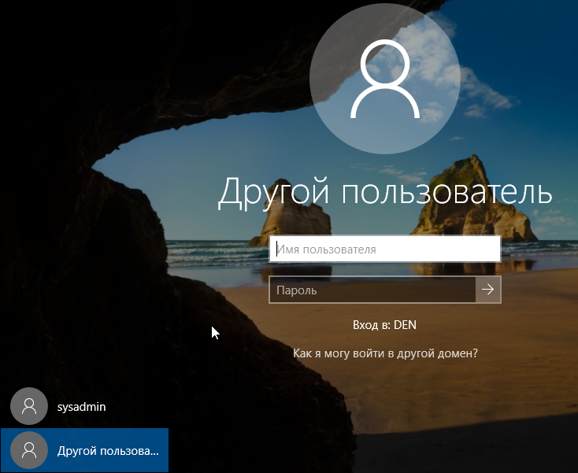
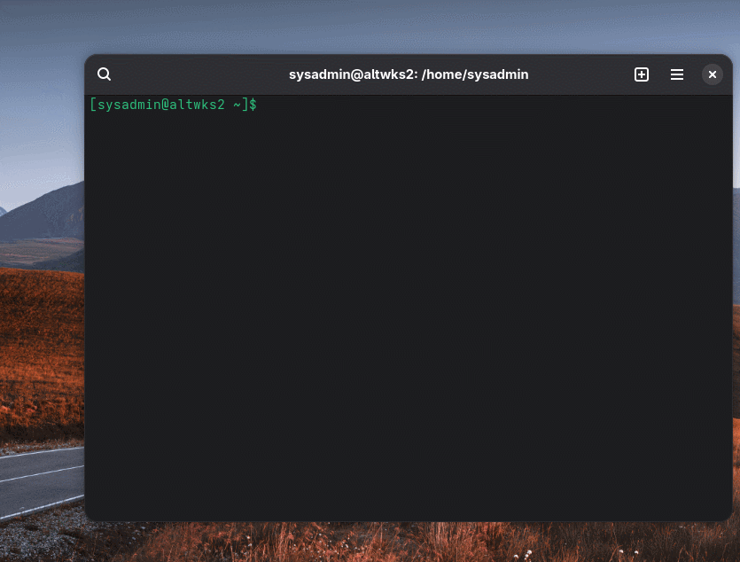
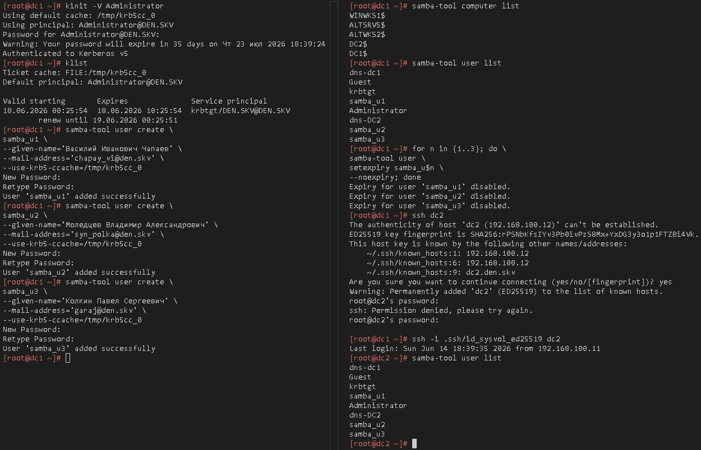
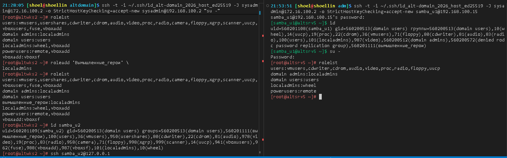
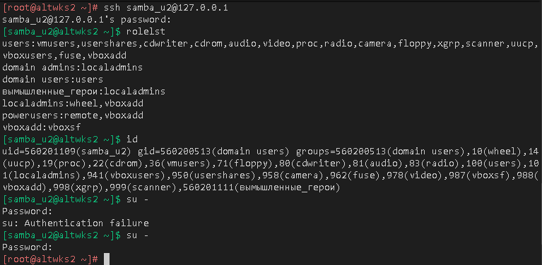

# Лабораторная работа 4 «`Добавление узлов в Альт Домен`»


## Памятка входа

```bash
# Регистрация сгенерированного ssh агентом
eval $(ssh-agent) \
&& ssh-add \
~/.ssh/id_alt-domain_2026_host_ed25519

# Хост altwks1
> ~/.ssh/known_hosts \
&& ssh -t -o StrictHostKeyChecking=accept-new \
sysadmin@172.16.100.2 \
"su -"

# Хост dc1
ssh -t \
-i ~/.ssh/id_alt-domain_2026_host_ed25519 \
-J sysadmin@172.16.100.2 \
-o StrictHostKeyChecking=accept-new \
sysadmin@192.168.100.11 \
"su -"

# Хост dc2
ssh -t \
-i ~/.ssh/id_alt-domain_2026_host_ed25519 \
-J sysadmin@172.16.100.2 \
-o StrictHostKeyChecking=accept-new \
sysadmin@192.168.100.12 \
"su -"

# Хост altsrv3
ssh -t \
-i ~/.ssh/id_alt-domain_2026_host_ed25519 \
-J sysadmin@172.16.100.2 \
-o StrictHostKeyChecking=accept-new \
sysadmin@192.168.100.13 \
"su -"

# Хост altwks2
ssh -t \
-i ~/.ssh/id_alt-domain_2026_host_ed25519 \
-J sysadmin@172.16.100.2 \
-o StrictHostKeyChecking=accept-new \
sysadmin@192.168.100.2 \
"su -"
```

## Подготовка для работы

```bash
# Регистрация сгенерированного ssh агентом
eval $(ssh-agent) \
&& ssh-add \
~/.ssh/id_alt-domain_2026_host_ed25519

# Вход на Хост altwks1
> ~/.ssh/known_hosts \
&& ssh -t -o StrictHostKeyChecking=accept-new \
sysadmin@172.16.100.2 \
"su -"

# Проверяем наличие пары ключей ssh на altwks1
find /home/sysadmin/.ssh/ \
| grep alt-domain
```

<details>
<summary>Проверка наличия пары ssh</summary>

```log
/home/sysadmin/.ssh/id_alt-domain_2026_host_ed25519.pub
/home/sysadmin/.ssh/id_alt-domain_2026_host_ed25519
```

</details>

### Проброс ключей

#### Linux систем

```bash
# проброс ключа до Управляемых хостов linux
for ip in {2,15} ; do \
ssh-copy-id \
-o StrictHostKeyChecking=accept-new \
-i /home/sysadmin/.ssh/id_alt-domain_2026_host_ed25519.pub \
sysadmin@192.168.100.$ip ; done
```

<details>
<summary>лог проброса ключа для подключения</summary>

```log
/usr/bin/ssh-copy-id: INFO: Source of key(s) to be installed: "/home/sysadmin/.ssh/id_alt-domain_2026_host_ed25519.pub"
/usr/bin/ssh-copy-id: INFO: attempting to log in with the new key(s), to filter out any that are already installed
/usr/bin/ssh-copy-id: INFO: 1 key(s) remain to be installed -- if you are prompted now it is to install the new keys
sysadmin@192.168.100.2's password: 

Number of key(s) added: 1

Now try logging into the machine, with:   "ssh -o 'StrictHostKeyChecking=accept-new' 'sysadmin@192.168.100.2'"
and check to make sure that only the key(s) you wanted were added.

/usr/bin/ssh-copy-id: INFO: Source of key(s) to be installed: "/home/sysadmin/.ssh/id_alt-domain_2026_host_ed25519.pub"

/usr/bin/ssh-copy-id: INFO: Source of key(s) to be installed: "/home/sysadmin/.ssh/id_alt-domain_2026_host_ed25519.pub"
/usr/bin/ssh-copy-id: INFO: attempting to log in with the new key(s), to filter out any that are already installed
/usr/bin/ssh-copy-id: INFO: 1 key(s) remain to be installed -- if you are prompted now it is to install the new keys
sysadmin@192.168.100.15's password: 

Number of key(s) added: 1

Now try logging into the machine, with:   "ssh -o 'StrictHostKeyChecking=accept-new' 'sysadmin@192.168.100.15'"
and check to make sure that only the key(s) you wanted were added.
```

</details>

#### Windows систем

##### Вход под пользователем с парой ssh ключей

```bash
su - sysadmin

find ~/.ssh/id_alt-domain_2026_host_ed25519*

eval $(ssh-agent) \
&& ssh-add \
~/.ssh/id_alt-domain_2026_host_ed25519
```

<details>
<summary>вход под пользователем с ключами</summary>

```log
/home/sysadmin/.ssh/id_alt-domain_2026_host_ed25519
/home/sysadmin/.ssh/id_alt-domain_2026_host_ed25519.pub
```
```log
Agent pid 2731
Identity added: /home/sysadmin/.ssh/id_alt-domain_2026_host_ed25519 (cours_alt-domain)
```

</details>

##### Проброс публичного ключа для доступа под локальной административной УЗ 

```bash
scp ~/.ssh/id_alt-domain_2026_host_ed25519.pub \
192.168.100.9:C:\\ProgramData\\ssh\\administrators_authorized_keys
```

<details>
<summary>лог проброса ключа</summary>

```log
id_alt-domain_2026_host_ed25519.pub     100%   98    42.9KB/s   00:00
```

</details>

##### Внесение изменений настроек по доступу по ключам

```bash
# # Убираем строгую проверку доступа до проброшенных ключей
# ssh -t 192.168.100.9 "echo StrictModes no>> C:\ProgramData\ssh\sshd_config"

# # Даем разрешение авторизации по ключам
# ssh -t 192.168.100.9 "echo PubkeyAuthentication yes>> C:\ProgramData\ssh\sshd_config"

ssh -t 192.168.100.9 "type C:\ProgramData\ssh\sshd_config"
```

<details>
<summary>лог вывода настроек по умолчанию</summary>

```log
# This is the sshd server system-wide configuration file.  See
# sshd_config(5) for more information.

# The strategy used for options in the default sshd_config shipped with
# OpenSSH is to specify options with their default value where
# possible, but leave them commented.  Uncommented options override the
# default value.

#Port 22
#AddressFamily any
#ListenAddress 0.0.0.0
#ListenAddress ::

#HostKey __PROGRAMDATA__/ssh/ssh_host_rsa_key
#HostKey __PROGRAMDATA__/ssh/ssh_host_ecdsa_key
#HostKey __PROGRAMDATA__/ssh/ssh_host_ed25519_key

# Ciphers and keying
#RekeyLimit default none

# Logging
#SyslogFacility AUTH
#LogLevel INFO

# Authentication:

#LoginGraceTime 2m
#PermitRootLogin prohibit-password
#StrictModes yes
#MaxAuthTries 6
#MaxSessions 10

#PubkeyAuthentication yes

# The default is to check both .ssh/authorized_keys and .ssh/authorized_keys2
# but this is overridden so installations will only check .ssh/authorized_keys
AuthorizedKeysFile      .ssh/authorized_keys

#AuthorizedPrincipalsFile none

# For this to work you will also need host keys in %programData%/ssh/ssh_known_hosts
#HostbasedAuthentication no
# Change to yes if you don't trust ~/.ssh/known_hosts for
# HostbasedAuthentication
#IgnoreUserKnownHosts no
# Don't read the user's ~/.rhosts and ~/.shosts files
#IgnoreRhosts yes

# To disable tunneled clear text passwords, change to no here!
#PasswordAuthentication yes
#PermitEmptyPasswords no

# GSSAPI options
#GSSAPIAuthentication no

#AllowAgentForwarding yes
#AllowTcpForwarding yes
#GatewayPorts no
#PermitTTY yes
#PrintMotd yes
#PrintLastLog yes
#TCPKeepAlive yes
#PermitUserEnvironment no
#Compression delayed
#ClientAliveInterval 0
#ClientAliveCountMax 3
#UseDNS no
#MaxStartups 10:30:100
#PermitTunnel no
#ChrootDirectory none
#VersionAddendum none

# no default banner path
#Banner none

# override default of no subsystems
Subsystem       sftp    sftp-server.exe

# Example of overriding settings on a per-user basis 
#Match User anoncvs
#       AllowTcpForwarding no
#       PermitTTY no
#       ForceCommand cvs server

Match Group administrators
       AuthorizedKeysFile __PROGRAMDATA__/ssh/administrators_authorized_keys
Connection to 192.168.100.9 closed.
```

</details>

##### Перезагрузка системы

```bash
ssh -t 192.168.100.9 "shutdown /r /t 00"
```

##### Вход под пользователем с административными правами по ключу

```bash
ssh -i  ~/.ssh/id_alt-domain_2026_host_ed25519 sysadmin@192.168.100.9
```

### Windows Смена имени хоста

#### Вывод текущего имени

```shell
hostname
```

<details>
<summary>имя хоста</summary>

```log
win10

```

</details>

#### Смена имени хоста

```shell
wmic computersystem where caption='win10' rename winwks1
```

<details>
<summary>Смена имени хоста</summary>

```log
€¤Ґв ўлЇ®«ҐЁҐ (\\WIN10\ROOT\CIMV2:Win32_ComputerSystem.Name="WIN10")->rename()
ЊҐв®¤ гбЇҐи® ўл§ў .
Џ а ¬Ґвал ўлў®¤ :
instance of __PARAMETERS
{
        ReturnValue = 0;
};
```

</details>

#### Перезагрузка системы windows

```shell
shutdown /r /t 00
```

### Windows Проверка изменения имени хоста

#### Вход по ssh

```shell
ssh -i  ~/.ssh/id_alt-domain_2026_host_ed25519 sysadmin@192.168.100.9
```

#### Проверка изменения имени хоста

```shell
hostname
```

<details>
<summary>Смена имени хоста</summary>

```log
winwks1

```

</details>

### Windows Смена DNS на сервера развернутого домена

#### Определение интерфейса

```shell
netsh interface show interface
```

<details>
<summary>Список интерфесов</summary>

```log
Состояние адм.  Состояние     Тип              Имя интерфейса
---------------------------------------------------------------------
Разрешен       Подключен      Выделенный       Ethernet
```

</details>

#### Прописываем основной и вторичные DNS

```shell
netsh interface ip set dns name="Ethernet" source=static address="192.168.100.11"

netsh interface ip add dns name="Ethernet" address="192.168.100.12" index=2
```

#### Проверяем DNS на интерфейсе и пприменяем настройки

```shell
# Запуск powershell
powershell

# Чистка DNS
ipconfig /flushdns

# Вывод совпадений вывод об интерфейсе по слову DNS
ipconfig /all | Select-String -Pattern "DNS" -Context 0,1
```

<details>
<summary>применение настрок и вывод DNS</summary>

```log
Настройка протокола IP для Windows

Кэш сопоставителя DNS успешно очищен.
```

```log
>    Ћб®ў®© DNS-бгддЁЄб  . . . . . . :  
     ’ЁЇ 㧫 . . . . . . . . . . . . . : ѓЁЎаЁ¤л©
>    DNS-бгддЁЄб Ї®¤Є«о票п . . . . . :
     ЋЇЁб ЁҐ. . . . . . . . . . . . . : Red Hat VirtIO Ethernet Adapter
>    DNS-бҐаўҐал. . . . . . . . . . . : 192.168.100.11 
                                         192.168.100.12
```

</details>

### Windows Ввод в Домен

```shell
# Запуск powershell
powershellll

# Прописывам перменные логина и пароля Администратора домена
$securePassword = ConvertTo-SecureString "1qaz@WSX" -AsPlainText -Force
$credential = New-Object System.Management.Automation.PSCredential("DEN\Administrator", $securePassword)

# команда ввода в домен с импользованием перемнных credential
Add-Computer -DomainName "den.skv" -Credential $credential

shutdown.exe /r /t 00
```

<details>
<summary>ПРЕДУПРЕЖДЕНИЕ после ввода машины</summary>

```log
ПРЕДУПРЕЖДЕНИЕ: Изменения вступят в силу после перезагрузки компьютера winwks1. 
```

</details>




### Altlinux Ввод в Домен

#### ВВод в Домен altwks2

##### Предворительная подготовка

```bash
# Вход под супер пользователем
ssh -t \
-o StrictHostKeyChecking=accept-new \
sysadmin@192.168.100.2 \
"su -"
```

```bash
# Отключение IPv6
echo "net.ipv6.conf.all.disable_ipv6 = 1" \
| tee -a  /etc/sysctl.conf \
&& sysctl -p
```

<details>
<summary>Вывод добавленного содержимого /etc/sysctl.conf</summary>

```log
net.ipv6.conf.all.disable_ipv6 = 1
```

</details>

```bash
# Вывод о состоянии настроек ядра с IPV6
sysctl -a \
| grep "disable_ipv6"
```

<details>
<summary>Вывод о состоянии настроек ядра с IPV6</summary>

```log
net.ipv6.conf.all.disable_ipv6 = 1
net.ipv6.conf.default.disable_ipv6 = 1
net.ipv6.conf.ens19.disable_ipv6 = 1
net.ipv6.conf.lo.disable_ipv6 = 1
```

</details>

```bash
# Смена DNS на интерфейсе и домен поиска
cat > /etc/net/ifaces/ens20/resolv.conf<<'EOF'
nameserver 192.168.100.11
nameserver 192.168.100.12
search den.skv
EOF
```

```bash
# Перезапуск интерфеса и сетевых служб
ifdown ens20 \
; systemctl restart network NetworkManager \
; ifup ens20
```

```bash
# Вывод изменений в resolver
resolvconf -l
```

<details>
<summary>вывод resolvconf для обновления системы</summary>

```log
# resolv.conf from NetworkManager
# Generated by NetworkManager
search den.skv
nameserver 192.168.100.11
nameserver 192.168.100.12
```

</details>

```bash
# Обновление системы и установка пакетов
apt-get update \
&& update-kernel -y \
&& apt-get dist-upgrade -y \
&& apt-get -y install \
samba-common \
samba-client \
task-auth-ad-sssd \
bind-utils \
diag-domain-client \
&& systemctl reboot
```

```bash
# Вход под супер пользователем
ssh -t \
-o StrictHostKeyChecking=accept-new \
sysadmin@192.168.100.2 \
"su -"
```

```bash
# Преднастройка Kerberos
sed -i "s/# default_realm = EXAMPLE.COM/ default_realm = DEN.SKV/" \
/etc/krb5.conf

sed -i 's/realm = true/realm = false/' \
/etc/krb5.conf

cat /etc/krb5.conf
```

<details>
<summary>вывод krb5.conf</summary>

```log
cat /etc/krb5.conf
includedir /etc/krb5.conf.d/

[logging]
# default = FILE:/var/log/krb5libs.log
# kdc = FILE:/var/log/krb5kdc.log
# admin_server = FILE:/var/log/kadmind.log

[libdefaults]
 dns_lookup_kdc = true
 dns_lookup_realm = false
 ticket_lifetime = 24h
 renew_lifetime = 7d
 forwardable = true
 rdns = false
 default_realm = DEN.SKV
 default_ccache_name = KEYRING:persistent:%{uid}

[realms]
# EXAMPLE.COM = {
#  default_domain = example.com
# }

[domain_realm]
# .example.com = EXAMPLE.COM
# example.com = EXAMPLE.COM
```

</details>



```bash
ssh -t \
-i  ~/.ssh/id_alt-domain_2026_host_ed25519 \
sysadmin@192.168.100.2 \
"su -"
```

```bash
hostname -f

system-auth status
```

<details>
<summary>Статус проверок</summary>

```log
altwks2.den.skv
```

```log
ad DEN.SKV ALTWKS2 DEN
```

```log
[DONE]: Check hostname persistance

[DONE]: Test hostname is FQDN (not short)

[DONE]: System authentication method

[DONE]: Domain system authentication enabled

[DONE]: System policy method

[WARN]: System group policy enabled

[DONE]: Check Kerberos configuration exists

[DONE]: Kerberos credential cache status

[DONE]: Using keyring as kerberos credential cache

[DONE]: Check DNS lookup kerberos KDC status

[DONE]: Check machine crendetial cache is exists

[DONE]: Check machine credentials list in keytab

[DONE]: Check nameserver resolver configuration

[DONE]: Compare krb5 realm and first search domain

[DONE]: Check Samba configuration

[DONE]: Compare samba and krb5 realms

[DONE]: Check Samba domain realm

[DONE]: Check hostname FQDN domainname

[DONE]: Check time synchronization

[DONE]: Time synchronization enabled

[DONE]: Check nameservers availability

[DONE]: Trace Kerberos authentication process

[DONE]: Check domain controllers list

[DONE]: Check Kerberos and LDAP SRV-records

[DONE]: Compare NetBIOS name and hostname

[DONE]: Check common packages

[FAIL]: Check group policy packages

[DONE]: Check SSSD AD packages

[WARN]: Check SSSD Winbind packages
```

</details>

#### ВВод в Домен altsrv5

##### Предворительная подготовка

```bash
# Вход под супер пользователем
ssh -t \
-o StrictHostKeyChecking=accept-new \
sysadmin@192.168.100.15 \
"su -"
```

```bash
# Отключение IPv6
echo "net.ipv6.conf.all.disable_ipv6 = 1" \
| tee -a  /etc/sysctl.conf \
&& sysctl -p
```

<details>
<summary>Вывод добавленного содержимого /etc/sysctl.conf</summary>

```log
net.ipv6.conf.all.disable_ipv6 = 1
```

</details>

```bash
# Вывод о состоянии настроек ядра с IPV6
sysctl -a \
| grep "disable_ipv6"
```

<details>
<summary>Вывод о состоянии настроек ядра с IPV6</summary>

```log
net.ipv6.conf.all.disable_ipv6 = 1
net.ipv6.conf.default.disable_ipv6 = 1
net.ipv6.conf.ens19.disable_ipv6 = 1
net.ipv6.conf.lo.disable_ipv6 = 1
```

</details>

```bash
# Смена DNS на интерфейсе и домен поиска
cat > /etc/net/ifaces/ens19/resolv.conf<<'EOF'
nameserver 192.168.100.11
nameserver 192.168.100.12
search den.skv
EOF
```

```bash
# Перезапуск интерфеса и сетевых служб
ifdown ens19 \
; systemctl restart network \
; ifup ens19
```

```bash
# Вывод изменений в resolver
resolvconf -l
```

<details>
<summary>вывод resolvconf для обновления системы</summary>

```log
# resolv.conf from ens19
nameserver 192.168.100.11
nameserver 192.168.100.12
search den.skv
```

</details>

```bash
# Обновление системы и установка пакетов
apt-get update \
&& update-kernel -y \
&& apt-get dist-upgrade -y \
&& apt-get -y install \
samba-common \
samba-client \
task-auth-ad-sssd \
bind-utils \
diag-domain-client \
qemu-guest-agent
```

```bash
# Включение PVE агента в автозапуск
systemctl enable qemu-guest-agent
```

```bash
# Перезагрузка системы
systemctl reboot
```

##### Ввод в домен

```bash
# Вход под супер пользователем
ssh -t \
-o StrictHostKeyChecking=accept-new \
sysadmin@192.168.100.15 \
"su -"
```

```bash
# Переменные для ввода в домен
host_name="$(hostname)"
domain=den.skv
WORKGR=DEN
_REALM=DEN.SKV
_DNS_ADM=Administrator

mkdir -p /tmp/.private/root/

sed -i "s/# default_realm = EXAMPLE.COM/ default_realm = "$_REALM"/" \
/etc/krb5.conf

sed -i 's/realm = true/realm = false/' \
/etc/krb5.conf

cat /etc/krb5.conf

hostnamectl hostname "$host_name"."$domain" --static

domainname "$domain"

kinit -V "$_DNS_ADM" \
&& system-auth write \
ad \
"$domain" \
"$host_name" \
"$WORKGR" \
&& systemctl reboot
```

<details>
<summary>Лог входа в домен</summary>

```log
includedir /etc/krb5.conf.d/

[logging]
# default = FILE:/var/log/krb5libs.log
# kdc = FILE:/var/log/krb5kdc.log
# admin_server = FILE:/var/log/kadmind.log

[libdefaults]
 dns_lookup_kdc = true
 dns_lookup_realm = false
 ticket_lifetime = 24h
 renew_lifetime = 7d
 forwardable = true
 rdns = false
 default_realm = DEN.SKV
 default_ccache_name = KEYRING:persistent:%{uid}

[realms]
# EXAMPLE.COM = {
#  default_domain = example.com
# }

[domain_realm]
# .example.com = EXAMPLE.COM
# example.com = EXAMPLE.COM
Using default cache: persistent:0:0
Using principal: Administrator@DEN.SKV
Password for Administrator@DEN.SKV: 
Warning: Your password will expire in 35 days on Чт 23 июл 2026 18:39:24
Authenticated to Kerberos v5
gensec_gse_client_prepare_ccache: Kinit for ALTSRV5$@den.skv to access ldap/dc1.den.skv failed: Client not found in Kerberos database: NT_STATUS_LOGON_FAILURE
Using short domain name -- DEN
Joined 'ALTSRV5' to dns domain 'den.skv'
Successfully registered hostname with DNS
```

</details>

```bash
ssh -t \
-i  ~/.ssh/id_alt-domain_2026_host_ed25519 \
sysadmin@192.168.100.15 \
"su -"
```

```bash
hostname -f

system-auth status
```

<details>
<summary>Статус проверок</summary>

```log
altsrv5.den.skv
```

```log
ad DEN.SKV ALTSRV5 DEN
```

```log
[DONE]: Check hostname persistance

[DONE]: Test hostname is FQDN (not short)

[DONE]: System authentication method

[DONE]: Domain system authentication enabled

[DONE]: System policy method

[WARN]: System group policy enabled

[DONE]: Check Kerberos configuration exists

[DONE]: Kerberos credential cache status

[DONE]: Using keyring as kerberos credential cache

[DONE]: Check DNS lookup kerberos KDC status

[DONE]: Check machine crendetial cache is exists

[DONE]: Check machine credentials list in keytab

[DONE]: Check nameserver resolver configuration

[DONE]: Compare krb5 realm and first search domain

[DONE]: Check Samba configuration

[DONE]: Compare samba and krb5 realms

[DONE]: Check Samba domain realm

[DONE]: Check hostname FQDN domainname

[DONE]: Check time synchronization

[DONE]: Time synchronization enabled

[DONE]: Check nameservers availability

[DONE]: Trace Kerberos authentication process

[DONE]: Check domain controllers list

[DONE]: Check Kerberos and LDAP SRV-records

[DONE]: Compare NetBIOS name and hostname

[DONE]: Check common packages

[FAIL]: Check group policy packages

[DONE]: Check SSSD AD packages

[WARN]: Check SSSD Winbind packages
```

</details>


### Создание первых пользователей AD

```bash
# под суперпользователем на основной домен контроллер
ssh -t \
-o StrictHostKeyChecking=accept-new \
sysadmin@192.168.100.11 \
"su -"
```

#### Получение билета Администратора домена

```bash
kinit -V Administrator
```

<details>
<summary>Вывод получения билета</summary>

```log
Using default cache: /tmp/krb5cc_0
Using principal: Administrator@DEN.SKV
Password for Administrator@DEN.SKV: 
Warning: Your password will expire in 35 days on Чт 23 июл 2026 18:39:24
Authenticated to Kerberos v5
[root@dc1 ~]# klist 
Ticket cache: FILE:/tmp/krb5cc_0
Default principal: Administrator@DEN.SKV

Valid starting       Expires              Service principal
18.06.2026 00:25:54  18.06.2026 10:25:54  krbtgt/DEN.SKV@DEN.SKV
        renew until 19.06.2026 00:25:51
```

</details>

#### Создание пользователей

```bash
samba-tool user create \
samba_u1 \
--given-name='Василий Иванович Чапаев' \
--mail-address='chapay_vi@den.skv' \
--use-krb5-ccache=/tmp/krb5cc_0
```

<details>
<summary>Лог создания</summary>

```log
New Password: 
Retype Password: 
User 'samba_u1' added successfully
```

</details>

```bash
samba-tool user create \
samba_u2 \
--given-name='Моледцев Владимир Александрович' \
--mail-address='syn_polka@den.skv' \
--use-krb5-ccache=/tmp/krb5cc_0
```

<details>
<summary>Лог создания</summary>

```log
New Password: 
Retype Password: 
User 'samba_u2' added successfully
```

</details>

```bash
samba-tool user create \
samba_u3 \
--given-name='Колкин Павел Сергеевич' \
--mail-address='garaj@den.skv' \
--use-krb5-ccache=/tmp/krb5cc_0
```

<details>
<summary>Лог создания</summary>

```log
New Password: 
Retype Password: 
User 'samba_u3' added successfully
```

</details>

#### Включение пользователей

```bash
# Просмотр списка имеющихся пользователей
samba-tool user \
list
```

<details>
<summary>Список пользователей</summary>

```log
dns-dc1
Guest
krbtgt
samba_u1
Administrator
dns-DC2
samba_u2
samba_u3
```

</details>

```bash
# Разблокировка созданных учетных записей по шаблону EXP
for n in {1..3}; do \
samba-tool user \
setexpiry samba_u$n \
--noexpiry; done
```

<details>
<summary>Лог активации пользователей</summary>

```log
Expiry for user 'samba_u1' disabled.
Expiry for user 'samba_u2' disabled.
Expiry for user 'samba_u3' disabled.
```

</details>




### Создание групп пользователей

```bash
# Создание групп
samba-tool group add \
'Вымышленные_герои'
```

<details>
<summary>Лог создания пользователей
</summary>

```log
Added group Вымышленные_герои
```

</details>

```bash
# Списки имеющихся групп
samba-tool group \
list 
```

<details>
<summary>
Список групп домена
</summary>

```log
list 
Domain Computers
Event Log Readers
Read-only Domain Controllers
IIS_IUSRS
Remote Desktop Users
Users
Incoming Forest Trust Builders
Enterprise Admins
Denied RODC Password Replication Group
Replicator
RAS and IAS Servers
DnsUpdateProxy
Administrators
Terminal Server License Servers
Distributed COM Users
Backup Operators
Schema Admins
Вымышленные_герои
Cert Publishers
Protected Users
Network Configuration Operators
Account Operators
Group Policy Creator Owners
Certificate Service DCOM Access
Enterprise Read-only Domain Controllers
Domain Guests
Domain Controllers
Performance Log Users
Domain Users
Domain Admins
Print Operators
Windows Authorization Access Group
DnsAdmins
Server Operators
Guests
Pre-Windows 2000 Compatible Access
Cryptographic Operators
Allowed RODC Password Replication Group
Performance Monitor Users
```

</details>

### Добавление пользователей в группы

```bash
# Добавление пользователей в группы
for n in {1..3}; do \
samba-tool group addmembers \
'Вымышленные_герои' \
samba_u$n ; done
```

```bash
samba-tool group addmembers \
'Domain Admins' \
samba_u1
```

<details>
<summary>Лог добавления пользователей в группу
</summary>

```log
Added members to group Вымышленные_герои
Added members to group Вымышленные_герои
Added members to group Вымышленные_герои
```

```log
Added members to group Domain Admins
```

</details>

```bash
# Проверка членства в группах
for g in \
{'Вымышленные_герои','Domain Users','Domain Admins'}; do \
echo "---$g---"
samba-tool group listmembers "$g"; done
```

<details>
<summary>Вывод списка пользователей групп</summary>

```log
---Вымышленные_герои---
samba_u3
samba_u2
samba_u1
---Domain Users---
Administrator
krbtgt
samba_u3
dns-DC2
samba_u2
samba_u1
dns-dc1
---Domain Admins---
Administrator
samba_u1
```

</details>

### Добавление Доменной группы из AD в роль localadmins

#### Вход на узел введенный в домен

```bash
ssh -t \
-i ~/.ssh/id_alt-domain_2026_host_ed25519 \
-J sysadmin@172.16.100.2 \
-o StrictHostKeyChecking=accept-new \
sysadmin@192.168.100.2 \
"su -"
```

#### Предварительный вывод

```bash
rolelst
```

<details>
<summary>Вывод списка ролей и привилегий до ввода группы домена</summary>

```log
users:vmusers,usershares,cdwriter,cdrom,audio,video,proc,radio,camera,floppy,xgrp,scanner,uucp,vboxusers,fuse,vboxadd
domain admins:localadmins
domain users:users
localadmins:wheel,vboxadd
powerusers:remote,vboxadd
vboxadd:vboxsf
```

</details>

#### Добавление Доменной группы из AD

```bash
roleadd 'Вымышленные_герои' \
localadmins
```

```bash
# Проверка вывода предоставленных привелегий
rolelst
```

<details>
<summary>Проверка предоставления привелегий</summary>

```log
users:vmusers,usershares,cdwriter,cdrom,audio,video,proc,radio,camera,floppy,xgrp,scanner,uucp,vboxusers,fuse,vboxadd
domain admins:localadmins
domain users:users
вымышленные_герои:localadmins
localadmins:wheel,vboxadd
powerusers:remote,vboxadd
vboxadd:vboxsf
```

</details>





### Для github и gitflic

```bash
exit

git branch -v

git log --oneline

git switch main

git status

pushd \
..

git rm -r --cached \
. ../

git add . ../ \
&& git status

git remote -v

git commit -am "Client_domain" \
&& git push \
--set-upstream \
altlinux \
main \
&& git push \
--set-upstream \
altlinux_gf \
main

popd
```