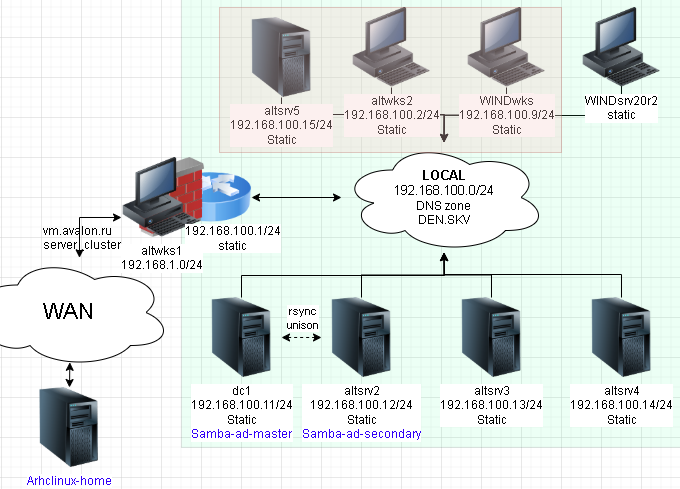
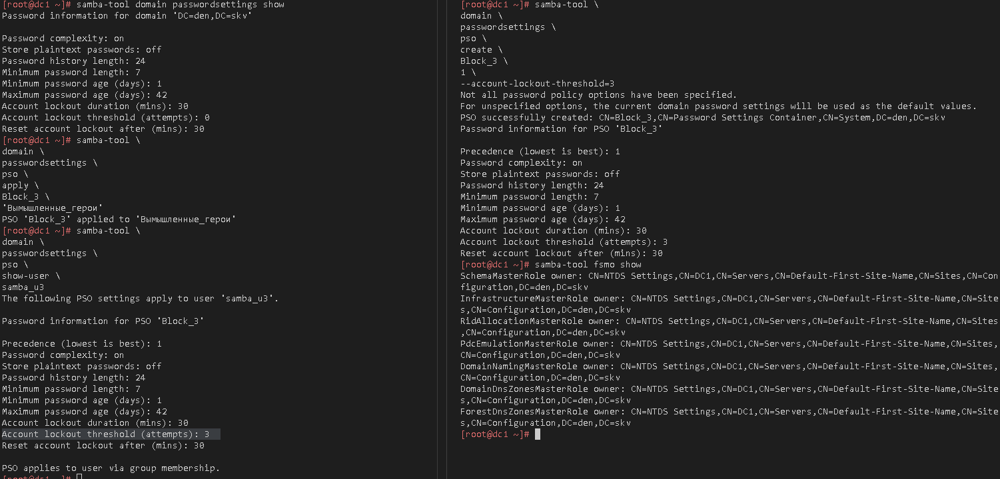
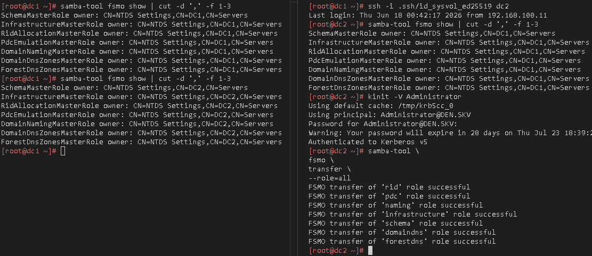

# Лабораторная работа 5 «`Работа с объектами в Альт Домен`»



## Памятка входа

```bash
# Регистрация сгенерированного ssh агентом
eval $(ssh-agent) \
&& ssh-add \
~/.ssh/id_alt-domain_2026_host_ed25519

# Хост altwks1
> ~/.ssh/known_hosts \
&& ssh -t -o StrictHostKeyChecking=accept-new \
sysadmin@172.16.100.2 \
"su -"

# Хост dc1
ssh -t \
-i ~/.ssh/id_alt-domain_2026_host_ed25519 \
-J sysadmin@172.16.100.2 \
-o StrictHostKeyChecking=accept-new \
sysadmin@192.168.100.11 \
"su -"

# Хост dc2
ssh -t \
-i ~/.ssh/id_alt-domain_2026_host_ed25519 \
-J sysadmin@172.16.100.2 \
-o StrictHostKeyChecking=accept-new \
sysadmin@192.168.100.12 \
"su -"

# Хост altsrv5
ssh -t \
-i ~/.ssh/id_alt-domain_2026_host_ed25519 \
-J sysadmin@172.16.100.2 \
-o StrictHostKeyChecking=accept-new \
sysadmin@192.168.100.15 \
"su -"

# Хост altwks2
ssh -t \
-i ~/.ssh/id_alt-domain_2026_host_ed25519 \
-J sysadmin@172.16.100.2 \
-o StrictHostKeyChecking=accept-new \
sysadmin@192.168.100.2 \
"su -"
```

## Подготовка для работы

```bash
# Регистрация сгенерированного ssh агентом
eval $(ssh-agent) \
&& ssh-add \
~/.ssh/id_alt-domain_2026_host_ed25519

# Вход на Хост altwks1
> ~/.ssh/known_hosts \
&& ssh -t -o StrictHostKeyChecking=accept-new \
sysadmin@172.16.100.2 \
"su -"

# Проверяем наличие пары ключей ssh на altwks1
find /home/sysadmin/.ssh/ \
| grep alt-domain
```

<details>
<summary>
Проверка наличия пары ssh
</summary>

```log
/home/sysadmin/.ssh/id_alt-domain_2026_host_ed25519.pub
/home/sysadmin/.ssh/id_alt-domain_2026_host_ed25519
```

</details>

## Создание PSO с установкой блокировки УЗ

### Вход на домен контролер 

```bash
ssh -t \
-i ~/.ssh/id_alt-domain_2026_host_ed25519 \
-J sysadmin@172.16.100.2 \
-o StrictHostKeyChecking=accept-new \
sysadmin@192.168.100.11 \
"su -"
```

### Получение билета администратора

```bash
kinit -V Administrator

klist
```

<details>
<summary>
Лог получения билета администратора
</summary>

```log
Using default cache: /tmp/krb5cc_0
Using principal: Administrator@DEN.SKV
Password for Administrator@DEN.SKV: 
Warning: Your password will expire in 28 days on Thu Jul 23 18:39:24 2026
Authenticated to Kerberos v5
```


</details>


### Проверка членства в группах

```bash
for g in \
{'Вымышленные_герои','Domain Users','Domain Admins'}; do \
echo "---$g---"
samba-tool group listmembers "$g"; done
```

<details>
<summary>
Вывод списка пользователей групп
</summary>

```log
---Вымышленные_герои---
samba_u3
samba_u2
samba_u1
---Domain Users---
Administrator
krbtgt
samba_u3
dns-DC2
samba_u2
samba_u1
dns-dc1
---Domain Admins---
Administrator
samba_u1
```

</details>

### Вывод стандартно политики PSO

```bash
samba-tool domain \
passwordsettings \
show
```

<details>
<summary>
Вывод настроек парольной политики по умолчанию
</summary>

```log
Password information for domain 'DC=den,DC=skv'

Password complexity: on
Store plaintext passwords: off
Password history length: 24
Minimum password length: 7
Minimum password age (days): 1
Maximum password age (days): 42
Account lockout duration (mins): 30
Account lockout threshold (attempts): 0
Reset account lockout after (mins): 30
```

</details>

### Создание политики блокировки УЗ после 3ех неправильных попыток ввода пароля

```bash
samba-tool \
domain \
passwordsettings \
pso \
create \
Block_3 \
1 \
--account-lockout-threshold=3
```

<details>
<summary>
Лог о создании политики
</summary>

```log
Not all password policy options have been specified.
For unspecified options, the current domain password settings will be used as the default values.
PSO successfully created: CN=Block_3,CN=Password Settings Container,CN=System,DC=den,DC=skv
Password information for PSO 'Block_3'

Precedence (lowest is best): 1
Password complexity: on
Store plaintext passwords: off
Password history length: 24
Minimum password length: 7
Minimum password age (days): 1
Maximum password age (days): 42
Account lockout duration (mins): 30
Account lockout threshold (attempts): 3
Reset account lockout after (mins): 30
```

</details>

### Назначение созданной политик группе `Вымышленные_герои`

```bash
samba-tool \
domain \
passwordsettings \
pso \
apply \
Block_3 \
'Вымышленные_герои'
```

<details>
<summary>
Лог о применении парольной политики
</summary>

```log
PSO 'Block_3' applied to 'Вымышленные_герои'
```

</details>

### Вывод применения политики к пользователю из группы AD

```bash
samba-tool \
domain \
passwordsettings \
pso \
show-user \
samba_u3 
```



## Передача ролей FSMO на второй контроллер домена

### Вывод текущего владельца FSMO ролей

```bash
samba-tool fsmo show \
| cut -d ',' -f 1-3
```

<details>
<summary>
вывод ролей FSMO до трансфера
</summary>

```log
SchemaMasterRole owner: CN=NTDS Settings,CN=DC1,CN=Servers
InfrastructureMasterRole owner: CN=NTDS Settings,CN=DC1,CN=Servers
RidAllocationMasterRole owner: CN=NTDS Settings,CN=DC1,CN=Servers
PdcEmulationMasterRole owner: CN=NTDS Settings,CN=DC1,CN=Servers
DomainNamingMasterRole owner: CN=NTDS Settings,CN=DC1,CN=Servers
DomainDnsZonesMasterRole owner: CN=NTDS Settings,CN=DC1,CN=Servers
ForestDnsZonesMasterRole owner: CN=NTDS Settings,CN=DC1,CN=Servers
```

</details>

### Вход на контролер домена которому планируем трансфер FSMO

```bash
ssh -i \
.ssh/id_sysvol_ed25519 dc2
```

### Авторизация под администратором домен котролера

```bash
kinit -V Administrator
```

<details>
<summary>
вывод трансфера ролей FSMO на другой контролер домена
</summary>

```log
Using default cache: /tmp/krb5cc_0
Using principal: Administrator@DEN.SKV
Password for Administrator@DEN.SKV: 
Warning: Your password will expire in 28 days on Thu Jul 23 18:39:24 2026
Authenticated to Kerberos v5
```

</details>


### ЗАпуск трансфера FSMO

```bash
samba-tool \
fsmo \
transfer \
--role=all
```

<details>
<summary>
вывод трансфера ролей FSMO на другой контролер домена
</summary>

```log
FSMO transfer of 'rid' role successful
FSMO transfer of 'pdc' role successful
FSMO transfer of 'naming' role successful
FSMO transfer of 'infrastructure' role successful
FSMO transfer of 'schema' role successful
FSMO transfer of 'domaindns' role successful
FSMO transfer of 'forestdns' role successful
```

</details>



### Для github и gitflic

```bash
exit

git branch -v

git log --oneline

git switch main

git status

pushd \
..

git rm -r --cached \
. ../

git add . ../ \
&& git status

git remote -v

git commit -am "PSO_FSMO" \
&& git push \
--set-upstream \
altlinux \
main \
&& git push \
--set-upstream \
altlinux_gf \
main

popd
```