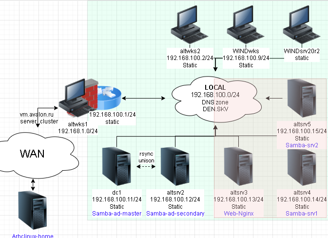
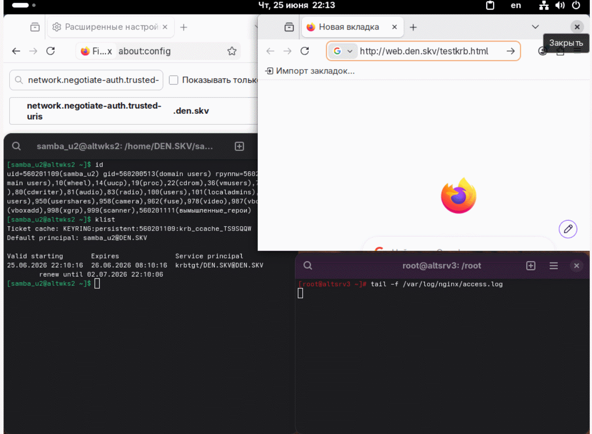
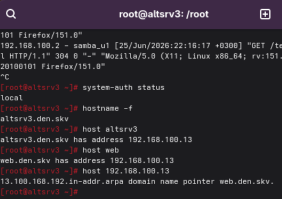

# Лабораторная работа 6 «`Интеграция служб в Альт Домен`»



## Памятка входа

```bash
# Регистрация сгенерированного ssh агентом
eval $(ssh-agent) \
&& ssh-add \
~/.ssh/id_alt-domain_2026_host_ed25519

# Хост altwks1
> ~/.ssh/known_hosts \
&& ssh -t -o StrictHostKeyChecking=accept-new \
sysadmin@172.16.100.2 \
"su -"

# Хост dc1
ssh -t \
-i ~/.ssh/id_alt-domain_2026_host_ed25519 \
-J sysadmin@172.16.100.2 \
-o StrictHostKeyChecking=accept-new \
sysadmin@192.168.100.11 \
"su -"

# Хост dc2
ssh -t \
-i ~/.ssh/id_alt-domain_2026_host_ed25519 \
-J sysadmin@172.16.100.2 \
-o StrictHostKeyChecking=accept-new \
sysadmin@192.168.100.12 \
"su -"

# Хост altsrv3 (Nginx)
ssh -t \
-i ~/.ssh/id_alt-domain_2026_host_ed25519 \
-J sysadmin@172.16.100.2 \
-o StrictHostKeyChecking=accept-new \
sysadmin@192.168.100.14 \
"su -"


# Хост altsrv4 (Samba-server1)
ssh -t \
-i ~/.ssh/id_alt-domain_2026_host_ed25519 \
-J sysadmin@172.16.100.2 \
-o StrictHostKeyChecking=accept-new \
sysadmin@192.168.100.14 \
"su -"

# Хост altsrv5 (Samba-server2)
ssh -t \
-i ~/.ssh/id_alt-domain_2026_host_ed25519 \
-J sysadmin@172.16.100.2 \
-o StrictHostKeyChecking=accept-new \
sysadmin@192.168.100.15 \
"su -"

# Хост altwks2
ssh -t \
-i ~/.ssh/id_alt-domain_2026_host_ed25519 \
-J sysadmin@172.16.100.2 \
-o StrictHostKeyChecking=accept-new \
sysadmin@192.168.100.2 \
"su -"
```

## Подготовка для работы

```bash
# Регистрация сгенерированного ssh агентом
eval $(ssh-agent) \
&& ssh-add \
~/.ssh/id_alt-domain_2026_host_ed25519

# Вход на Хост altwks1
> ~/.ssh/known_hosts \
&& ssh -t -o StrictHostKeyChecking=accept-new \
sysadmin@172.16.100.2

# Проверяем наличие пары ключей ssh на altwks1
find /home/sysadmin/.ssh/ \
| grep alt-domain
```

<details>
<summary>
Проверка наличия пары ssh
</summary>

```log
/home/sysadmin/.ssh/id_alt-domain_2026_host_ed25519.pub
/home/sysadmin/.ssh/id_alt-domain_2026_host_ed25519
```

</details>

### Копирование ssh ключей на узлы

```bash
for ip in 192.168.100.13 192.168.100.14; do
ssh-copy-id \
-i .ssh/id_alt-domain_2026_host_ed25519.pub \
$ip; done
```

<details>
<summary>
Лог копирования ssh ключей на узлы
</summary>

```log
/usr/bin/ssh-copy-id: INFO: Source of key(s) to be installed: ".ssh/id_alt-domain_2026_host_ed25519.pub"
/usr/bin/ssh-copy-id: INFO: attempting to log in with the new key(s), to filter out any that are already installed
/usr/bin/ssh-copy-id: INFO: 1 key(s) remain to be installed -- if you are prompted now it is to install the new keys
sysadmin@192.168.100.13's password: 

Number of key(s) added: 1

Now try logging into the machine, with:   "ssh '192.168.100.13'"
and check to make sure that only the key(s) you wanted were added.

/usr/bin/ssh-copy-id: INFO: Source of key(s) to be installed: ".ssh/id_alt-domain_2026_host_ed25519.pub"
/usr/bin/ssh-copy-id: INFO: attempting to log in with the new key(s), to filter out any that are already installed
/usr/bin/ssh-copy-id: INFO: 1 key(s) remain to be installed -- if you are prompted now it is to install the new keys
sysadmin@192.168.100.14's password: 

Number of key(s) added: 1

Now try logging into the machine, with:   "ssh '192.168.100.14'"
and check to make sure that only the key(s) you wanted were added.
```

</details>

### Вход на сервер Nginx

```bash
ssh -t \
-i ~/.ssh/id_alt-domain_2026_host_ed25519 \
-J sysadmin@172.16.100.2 \
-o StrictHostKeyChecking=accept-new \
sysadmin@192.168.100.13 \
"su -"
```

### Отключение IPv6

```bash
echo "net.ipv6.conf.all.disable_ipv6 = 1" \
| tee -a  /etc/sysctl.conf \
&& sysctl -p
```

<details>
<summary>
Вывод добавленного содержимого /etc/sysctl.conf
</summary>

```log
net.ipv6.conf.all.disable_ipv6 = 1
```

</details>

```bash
# Вывод о состоянии настроек ядра с IPV6
sysctl -a \
| grep "disable_ipv6"
```

<details>
<summary>
Вывод о состоянии настроек ядра с IPV6
</summary>

```log
net.ipv6.conf.all.disable_ipv6 = 1
net.ipv6.conf.default.disable_ipv6 = 1
net.ipv6.conf.ens19.disable_ipv6 = 1
net.ipv6.conf.lo.disable_ipv6 = 1
```

</details>

### Смена DNS на интерфейсе и домен поиска

```bash
cat > /etc/net/ifaces/ens19/resolv.conf<<'EOF'
nameserver 192.168.100.11
nameserver 192.168.100.12
search den.skv
EOF
```

### Перезапуск интерфейса и сетевых служб

```bash

ifdown ens19 \
; systemctl restart network \
; ifup ens19
```

### Вывод изменений в resolver

```bash

resolvconf -l
```

<details>
<summary>
вывод resolvconf для обновления системы
</summary>

```log
# resolv.conf from ens19
nameserver 192.168.100.11
nameserver 192.168.100.12
search den.skv
```

</details>

### Смена имени под fqdn

```bash
hostnamectl \
set-hostname \
altsrv3.den.skv
```

### Устанавливаем имя NIS-домена

```bash
domainname den.skv
```

### Обновление системы и Установка пакетов для Web-Nginx

```bash
apt-get update \
&& update-kernel -y \
&& apt-get dist-upgrade -y \
&& apt-get -y install \
nginx \
webserver-common \
nginx-spnego \
qemu-guest-agent \
&& systemctl enable --now qemu-guest-agent
```

### Преднастройка Kerberos

```bash
sed -i "s/# default_realm = EXAMPLE.COM/ default_realm = DEN.SKV/" \
/etc/krb5.conf

sed -i 's/realm = true/realm = false/' \
/etc/krb5.conf

cat /etc/krb5.conf
```

<details>
<summary>
вывод krb5.conf
</summary>

```log
includedir /etc/krb5.conf.d/

[logging]
# default = FILE:/var/log/krb5libs.log
# kdc = FILE:/var/log/krb5kdc.log
# admin_server = FILE:/var/log/kadmind.log

[libdefaults]
 dns_lookup_kdc = true
 dns_lookup_realm = false
 ticket_lifetime = 24h
 renew_lifetime = 7d
 forwardable = true
 rdns = false
 default_realm = DEN.SKV
 default_ccache_name = KEYRING:persistent:%{uid}

[realms]
# EXAMPLE.COM = {
#  default_domain = example.com
# }

[domain_realm]
# .example.com = EXAMPLE.COM
# example.com = EXAMPLE.COM
```

</details>

### Перезагрузка хоста Nginx-web

```bash
systemctl reboot
```

## Выполнение работы на домен контроллере

### Вход на домен контроллер

```bash
ssh -t \
-i ~/.ssh/id_alt-domain_2026_host_ed25519 \
-J sysadmin@172.16.100.2 \
-o StrictHostKeyChecking=accept-new \
sysadmin@192.168.100.12 \
"su -"
```

### Получение билета kerberos для администратора

```bash
kinit -V Administrator
```

<details>
<summary>
вывод kinit
</summary>

```log
Using default cache: /tmp/krb5cc_0
Using principal: Administrator@DEN.SKV
Password for Administrator@DEN.SKV: 
Warning: Your password will expire in 27 days on Thu Jul 23 18:39:24 2026
Authenticated to Kerberos v5
```

</details>

### Добавить A-запись для Web-сервера по реальному имени хоста

```bash
samba-tool dns \
add \
dc2.den.skv \
den.skv \
altsrv3 A 192.168.100.13 \
--use-krb5-ccache=/tmp/krb5cc_0
```

### Добавить A-запись для Web-сервера по дополнительному имени хоста

```bash
samba-tool dns \
add \
dc2.den.skv \
den.skv \
web A 192.168.100.13 \
--use-krb5-ccache=/tmp/krb5cc_0
```

### Добавить PTR-запись для Web-сервера дополнительного имени хоста

```bash
samba-tool dns \
add dc2.den.skv \
100.168.192.in-addr.arpa 13 PTR web.den.skv \
--use-krb5-ccache=/tmp/krb5cc_0
```

### SPN и Keytab-файл для Web-сервера

#### Создание пользователя для аутентификации по keytab-файлу

```bash
samba-tool user \
add \
--random-password webauth \
--use-krb5-ccache=/tmp/krb5cc_0

samba-tool user \
setpassword \
webauth \
--random-password

samba-tool user \
setexpiry webauth \
--noexpiry
```

#### Изменение `userPrincipalName:` webauth@`den.skv` на webauth@`DEN.SKV`

```bash
EDITOR=nano samba-tool user edit webauth

Modified User 'webauth' successfully
```

#### Создание SPN на учетную запись и Keytab-файла

```bash
samba-tool spn \
add \
HTTP/web.den.skv \
webauth

samba-tool spn \
add \
HTTP/web.den.skv@DEN.SKV \
webauth

samba-tool domain \
exportkeytab \
/tmp/nginx_web.keytab \
--principal=HTTP/web.den.skv@DEN.SKV
```

### Проверка авторизации по keytab-файлу

```bash
klist -ke /tmp/nginx_web.keytab

kinit -5 -V -k -t /tmp/nginx_web.keytab \
HTTP/web.den.skv@den.skv
```

<details>
<summary>
вывод klist
</summary>

```log
Keytab name: FILE:/tmp/nginx_web.keytab
KVNO Principal
---- --------------------------------------------------------------------------
   4 HTTP/web.den.skv@DEN.SKV (DEPRECATED:arcfour-hmac) 
```

```log
HTTP/web.den.skv@den.skv
Using default cache: /tmp/krb5cc_0
Using principal: HTTP/web.den.skv@den.skv
Using keytab: /tmp/nginx_web.keytab
kinit: Keytab contains no suitable keys for HTTP/web.den.skv@den.skv while getting initial credentials
```

</details>

#### Проброс экспортированного keytab-файла по scp

```bash
scp \
/tmp/nginx_web.keytab \
sysadmin@altsrv3:/tmp/nginx_web.keytab
```

## Выполнение работы на Web-сервере

### Вход на Web-сервер

```bash
ssh -t \
-i ~/.ssh/id_alt-domain_2026_host_ed25519 \
-J sysadmin@172.16.100.2 \
-o StrictHostKeyChecking=accept-new \
sysadmin@192.168.100.13 \
"su -"
```

### Включение модуля spnego

```bash
ln -vs /etc/nginx/modules-available.d/http_auth_spnego.conf \
/etc/nginx
/modules-enabled.d/
```

<details>
<summary>
вывод при создании ссылки для включения модуля
</summary>

```log
/modules-enabled.d/
'/etc/nginx/modules-enabled.d/http_auth_spnego.conf' -> '/etc/nginx/modules-available.d/http_auth_spnego.conf'
```

</details>

### Создание nginx конфиг сайта из default.conf

```bash
cp -v /etc/nginx/sites-available.d/{default,web_skv}.conf
```

<details>
<summary>
вывод при создании конфиг сайта
</summary>

```log
'/etc/nginx/sites-available.d/default.conf' -> '/etc/nginx/sites-available.d/web_skv.conf'
```

</details>

### Внесение настроек в конфиг сайта

```bash
sed -i \
's/127.0.0.1/*/' \
/etc/nginx/sites-available.d/web_skv.conf

sed -i \
's/listen  \[/#listen  \[/' \
/etc/nginx/sites-available.d/web_skv.conf

sed -i \
's/localhost localhost.localdomain/web.den.skv/' \
/etc/nginx/sites-available.d/web_skv.conf

sed -i '/root\ \/var\/www\/html;/r /dev/stdin' \
/etc/nginx/sites-available.d/web_skv.conf <<'EOF'
                auth_gss on;
                auth_gss_realm DEN.SKV;
                auth_gss_keytab /etc/nginx/nginx_web.keytab;
                auth_gss_service_name HTTP/web.den.skv;
                auth_gss_allow_basic_fallback off;
                satisfy all;
                error_page 401 /401.html;
                location = /401.html {
                    root /var/www/html;
                    internal;
                }
EOF

cat /etc/nginx/sites-available.d/web_skv.conf
```

<details>
<summary>
вывод настроек после внесения настроек в конфиг сайта
</summary>

```json
#load_module modules/ngx_http_geoip_module.so;
#load_module modules/ngx_http_perl_module.so;
#load_module modules/ngx_mail_module.so;
#load_module modules/ngx_stream_module.so;

server {
        listen  *:80;
        #listen  [::1]:80;
        # can't use wildcards in first server_name
        server_name web.den.skv;

        location / {
            root /var/www/html;
                auth_gss on;
                auth_gss_realm DEN.SKV;
                auth_gss_keytab /etc/nginx/nginx_web.keytab;
                auth_gss_service_name HTTP/web.den.skv;
                auth_gss_allow_basic_fallback off;
                satisfy all;
                error_page 401 /401.html;
                location = /401.html {
                    root /var/www/html;
                    internal;
                }
                # autoindex off;
                # autoindex_exact_size on;
                # autoindex_localtime off;

                # expires off;

                # cooperate with mod_realip in apache-1.3 or mod_rpaf in apache-2.x
                #       proxy_redirect off;
                #       proxy_set_header Host $host;
                #       proxy_set_header X-Real-IP $remote_addr;
                #       proxy_set_header X-Forwarded-For $remote_addr;
                #       proxy_pass http://back.end.addr.ess:80/;
                #
                # NB: it's better for URI canonicalization that apache sits on :80
                # (even if that's only *:80)
                #
                # see also set_real_ip_from, real_ip_header if this nginx
                # would need to cooperate with another one acting as a frontend
        }

#               charset         on;
#               source_charset  koi8-r;

                access_log  /var/log/nginx/access.log;
}
```

</details>

### Создание страницы 401.html для отказа в доступе

```bash
cat > /var/www/html/401.html <<'EOF'
<!DOCTYPE html>
<html>
<head><title>401 Authorization Required</title></head>
<body>
<h1>401 Unauthorized</h1>
<p>Kerberos authentication failed. Access denied.</p>
</body>
</html>
EOF
```

### Создание главно страницы testkrb.html для сайта

```bash
cat > /var/www/html/testkrb.html <<'EOF'
<!DOCTYPE html>
<html>
<head>
<meta charset="UTF-8">
</head>
<body>
<h1>
Что-то рабочее с авторизацией по kerberos!
</h1>
</body>
</html>
EOF
```

### Создание символьной ссылки на конфиг nginx `web_skv.conf`

```bash
ln -vs \
/etc/nginx/sites-available.d/web_skv.conf \
/etc/nginx/sites-enabled.d/
```

<details>
<summary>
вывод при создании символьной ссылки на конфиг nginx `web_skv.conf`
</summary>

```log
'/etc/nginx/sites-enabled.d/web_skv.conf' -> '/etc/nginx/sites-available.d/web_skv.conf'
```

</details>

### перенос keytab-файла в директорию `/etc/nginx`

```bash
mv -v /tmp/nginx_web.keytab \
/etc/nginx/
```

<details>
<summary>
вывод при перемещении keytab-файла
</summary>

```log
copied '/tmp/nginx_web.keytab' -> '/etc/nginx/nginx_web.keytab'
removed '/tmp/nginx_web.keytab'
```

</details>

### Проверка конфига nginx на корректность синтаксиса

```bash
nginx -t
```

<details>
<summary>
вывод при проверке конфига
</summary>

```log
nginx: the configuration file /etc/nginx/nginx.conf syntax is ok
nginx: configuration file /etc/nginx/nginx.conf test is successful
```

</details>

### Смена владельца keytab-файла на `_nginx:_nginx`

```bash
chown -v _nginx:_nginx \
/etc/nginx/nginx_web.keytab
```

<details>
<summary>
вывод при смене владельца keytab-файла
</summary>

```log
changed ownership of '/etc/nginx/nginx_web.keytab' from sysadmin:sysadmin to _nginx:_nginx
```

</details>

### Ограничение прав к keytab-файлу (0440)

```bash
chmod -v 0440 \
/etc/nginx/nginx_web.keytab
```

<details>
<summary>
вывод при ограничении прав к keytab-файлу
</summary>

```log
mode of '/etc/nginx/nginx_web.keytab' changed from 0600 (rw-------) to 0440 (r--r-----)
```

</details>

### Запуск nginx

```bash
systemctl enable --now nginx
```

### Тест аутентификации Kerberos для сайта

```bash
curl --negotiate -u : http://web.den.skv/testkrb.html
```

<details>
<summary>
вывод при тесте аутентификации Kerberos
</summary>

```html
<!DOCTYPE html>
<html>
<head>
<meta charset="UTF-8">
</head>
<body>
<h1>
Что-то рабочее с авторизацией по kerberos!
</h1>
</body>
</html>
```

</details>

---




---

## Для github и gitflic

```bash
exit

git branch -v

git log --oneline

git switch main

git status

pushd \
..

git rm -r --cached \
. ../

git add . ../ \
&& git status

git remote -v

git commit -am "Kerberos_DFS" \
&& git push \
--set-upstream \
altlinux \
main \
&& git push \
--set-upstream \
altlinux_gf \
main \
&& git push \
--set-upstream \
altlinux_sc \
main

popd
```
