# Лабораторная работа 7 «`Интеграция служб в Альт Домен`»

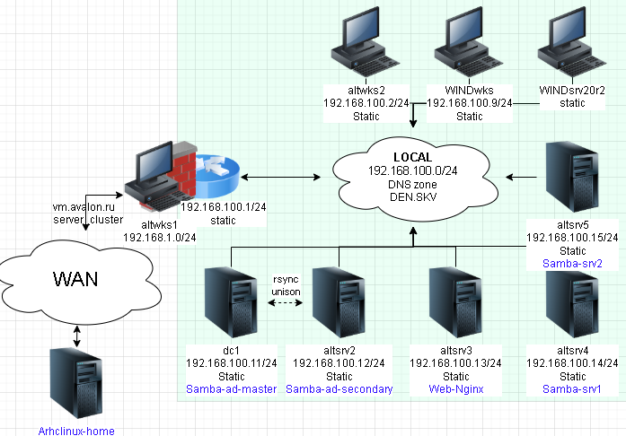

## Памятка входа

```bash
# Регистрация сгенерированного ssh агентом
eval $(ssh-agent) \
&& ssh-add \
~/.ssh/id_alt-domain_2026_host_ed25519

# Хост altwks1
> ~/.ssh/known_hosts \
&& ssh -t -o StrictHostKeyChecking=accept-new \
sysadmin@172.16.100.2 \
"su -"

# Хост dc1
ssh -t \
-i ~/.ssh/id_alt-domain_2026_host_ed25519 \
-J sysadmin@172.16.100.2 \
-o StrictHostKeyChecking=accept-new \
sysadmin@192.168.100.11 \
"su -"

# Хост dc2
ssh -t \
-i ~/.ssh/id_alt-domain_2026_host_ed25519 \
-J sysadmin@172.16.100.2 \
-o StrictHostKeyChecking=accept-new \
sysadmin@192.168.100.12 \
"su -"

# Хост altsrv3 (Nginx)
ssh -t \
-i ~/.ssh/id_alt-domain_2026_host_ed25519 \
-J sysadmin@172.16.100.2 \
-o StrictHostKeyChecking=accept-new \
sysadmin@192.168.100.14 \
"su -"


# Хост altsrv4 (Samba-server1)
ssh -t \
-i ~/.ssh/id_alt-domain_2026_host_ed25519 \
-J sysadmin@172.16.100.2 \
-o StrictHostKeyChecking=accept-new \
sysadmin@192.168.100.14 \
"su -"

# Хост altsrv5 (Samba-server2)
ssh -t \
-i ~/.ssh/id_alt-domain_2026_host_ed25519 \
-J sysadmin@172.16.100.2 \
-o StrictHostKeyChecking=accept-new \
sysadmin@192.168.100.15 \
"su -"

# Хост altwks2
ssh -t \
-i ~/.ssh/id_alt-domain_2026_host_ed25519 \
-J sysadmin@172.16.100.2 \
-o StrictHostKeyChecking=accept-new \
sysadmin@192.168.100.2 \
"su -"
```

## Подготовка для работы

```bash
# Регистрация сгенерированного ssh агентом
eval $(ssh-agent) \
&& ssh-add \
~/.ssh/id_alt-domain_2026_host_ed25519

# Вход на Хост altwks1
> ~/.ssh/known_hosts \
&& ssh -t -o StrictHostKeyChecking=accept-new \
sysadmin@172.16.100.2

# Проверяем наличие пары ключей ssh на altwks1
find /home/sysadmin/.ssh/ \
| grep alt-domain
```

<details>
<summary>
Проверка наличия пары ssh
</summary>

```log
/home/sysadmin/.ssh/id_alt-domain_2026_host_ed25519.pub
/home/sysadmin/.ssh/id_alt-domain_2026_host_ed25519
```

</details>

## Выполнение работы

### Вход на сервер dc2 что является владельцем FSMO

```bash
ssh -t \
-i ~/.ssh/id_alt-domain_2026_host_ed25519 \
-J sysadmin@172.16.100.2 \
-o StrictHostKeyChecking=accept-new \
sysadmin@192.168.100.12 \
"su -"
```

### Проверка что сервер является владельцем fsmo

```bash
samba-tool fsmo show \
| cut -d ',' -f 1-2
```

<details>
<summary>
Лог проверки что сервер является владельцем fsmo
</summary>

```log
SchemaMasterRole owner: CN=NTDS Settings,CN=DC2
InfrastructureMasterRole owner: CN=NTDS Settings,CN=DC2
RidAllocationMasterRole owner: CN=NTDS Settings,CN=DC2
PdcEmulationMasterRole owner: CN=NTDS Settings,CN=DC2
DomainNamingMasterRole owner: CN=NTDS Settings,CN=DC2
DomainDnsZonesMasterRole owner: CN=NTDS Settings,CN=DC2
ForestDnsZonesMasterRole owner: CN=NTDS Settings,CN=DC2
```

</details>

### Обновление пакетов и Установка пакетов admx-политик

```bash
apt-get update \
&& apt-get -y install \
admx-* \
tree \
&& admx-msi-setup
```

### Перенос установленных политик в `/var/lib/samba/sysvol`

```bash
kinit -V Administrator \
&& samba-tool gpo \
admxload \
--use-krb5-ccache=/tmp/krb5cc_0
```

<details>
<summary>
Лог переноса установленных политик в `/var/lib/samba/sysvol`
</summary>

```log
Using default cache: /tmp/krb5cc_0
Using principal: Administrator@DEN.SKV
Password for Administrator@DEN.SKV: 
Warning: Your password will expire in 23 days on Thu Jul 23 18:39:24 2026
Authenticated to Kerberos v5
Installing ADMX templates to the Central Store prevents Windows from displaying its own templates in the Group Policy Management Console. You will need to install these templates from https://www.microsoft.com/en-us/download/102157 to continue using Windows Administrative Templates.
```

</details>

### отображение списка политик командой find

```bash
find /var/lib/samba/sysvol | tail
```

<details>
<summary>
Лог отображения списка политик командой find
</summary>

```log
/var/lib/samba/sysvol/den.skv/Policies/PolicyDefinitions/nb-no/DataCollection.adml
/var/lib/samba/sysvol/den.skv/Policies/PolicyDefinitions/nb-no/Msi-FileRecovery.adml
/var/lib/samba/sysvol/den.skv/Policies/PolicyDefinitions/nb-no/CredentialProviders.adml
/var/lib/samba/sysvol/den.skv/Policies/PolicyDefinitions/nb-no/ExploitGuard.adml
/var/lib/samba/sysvol/den.skv/Policies/PolicyDefinitions/nb-no/WindowsBackup.adml
/var/lib/samba/sysvol/den.skv/Policies/PolicyDefinitions/nb-no/Display.adml
/var/lib/samba/sysvol/den.skv/Policies/PolicyDefinitions/nb-no/MobilePCMobilityCenter.adml
/var/lib/samba/sysvol/den.skv/Policies/PolicyDefinitions/nb-no/WindowsRemoteShell.adml
/var/lib/samba/sysvol/den.skv/Policies/PolicyDefinitions/nb-no/DnsClient.adml
/var/lib/samba/sysvol/den.skv/Policies/PolicyDefinitions/DataCollection.admx
```

</details>

### Проверка синхронизации sysvol ранее созданной службой dc1

```bash
journalctl -eu sysvol-syn.service
```

<details>
<summary>
Лог проверки синхронизации sysvol ранее созданной службой на dc1
</summary>

```log
Jun 29 21:16:10 dc1.den.skv unison[4105]: Failed [sysvol/den.skv/Policies/PolicyDefinitions/zh-TW/thunderbird.adml]: Destination updated during synchronization
Jun 29 21:16:10 dc1.den.skv unison[4105]: Failed [sysvol/den.skv/Policies/PolicyDefinitions/zh-TW/thunderbird.adml]: Destination updated during synchronizat>
Jun 29 21:16:10 dc1.den.skv unison[4105]: The file sysvol/den.skv/Policies/PolicyDefinitions/zh-TW/thunderbird.adml has been created
Jun 29 21:16:11 dc1.den.skv unison[4105]: Failed [sysvol/den.skv/Policies/PolicyDefinitions/zh-TW/wlansvc.adml]: Destination updated during synchronization
Jun 29 21:16:11 dc1.den.skv unison[4105]: The file sysvol/den.skv/Policies/PolicyDefinitions/zh-TW/wlansvc.adml has been created
Jun 29 21:16:11 dc1.den.skv unison[4105]: Failed [sysvol/den.skv/Policies/PolicyDefinitions/zh-TW/wwansvc.adml]: Destination updated during synchronization
Jun 29 21:16:11 dc1.den.skv unison[4105]: The file sysvol/den.skv/Policies/PolicyDefinitions/zh-TW/wwansvc.adml has been created
Jun 29 21:16:11 dc1.den.skv systemd[1]: sysvol-syn.service: Deactivated successfully.
Jun 29 21:16:11 dc1.den.skv systemd[1]: Finished sysvol-syn.service - Sysvol sync.
```

</details>

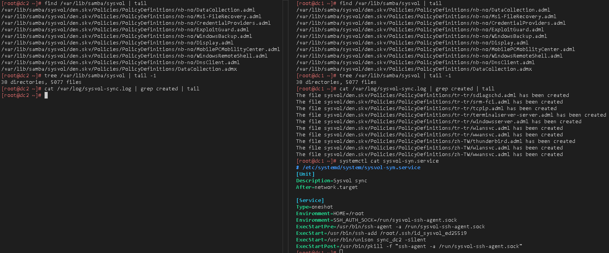

### Вход на рабочую станцию введенную в домен altwks2

```bash
ssh -t \
-i ~/.ssh/id_alt-domain_2026_host_ed25519 \
-J sysadmin@172.16.100.2 \
-o StrictHostKeyChecking=accept-new \
sysadmin@192.168.100.2 \
"su -"
```

### Обновление пакетов и Установка пакетов управления\клиентских\диагностических утилит групповых политик

```bash
apt-get update \
&& apt-get -y install \
admx-* \
tree \
admc \
gpui \
gpupdate \
alterator-gpupdate \
gpresult \
&& admx-msi-setup
```

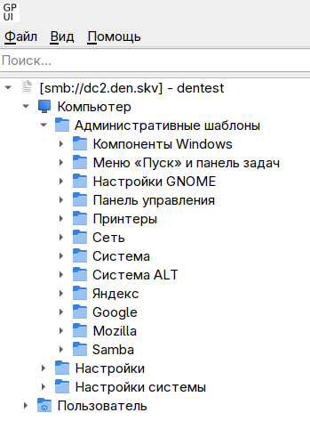
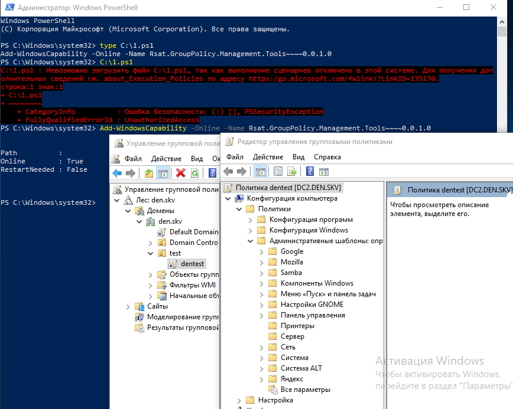

### Включение применения групповых политик и ввод в обозначенный режим workstation

#### Вывод доступного списка профилей групповых политик

```bash
gpupdate-setup list
```

<details>
<summary>
Вывод доступного списка профилей групповых политик
</summary>

```log
workstation
ad-domain-controller
server
```

</details>

#### Вывод текущего режима групповых политик

```bash
gpupdate-setup status \
&& gpupdate-setup active-policy \
&& gpupdate-setup default-policy
```

<details>
<summary>
Вывод текущего режима групповых политик
</summary>

```log
disabled
default
workstation
```

</details>

#### Применение и активация профиля групповых политик в `workstation`

```bash
gpupdate-setup \
write \
enable \
workstation \
&& systemctl daemon-reload
```

<details>
<summary>
Применение и активация профиля групповых политик в `workstation`
</summary>

```log
Warning: The unit file, source configuration file or drop-ins of autofs.service changed on disk. Run 'systemctl daemon-reload' to reload units.
Created symlink '/etc/systemd/system/multi-user.target.wants/gpupdate-scripts-run.service' → '/usr/lib/systemd/system/gpupdate-scripts-run.service'.
Created symlink '/etc/systemd/user/default.target.wants/gpupdate-scripts-run-user.service' → '/usr/lib/systemd/user/gpupdate-scripts-run-user.service'.
Created symlink '/etc/systemd/system/timers.target.wants/gpupdate.timer' → '/usr/lib/systemd/system/gpupdate.timer'.
Created symlink '/etc/systemd/user/timers.target.wants/gpupdate-user.timer' → '/usr/lib/systemd/user/gpupdate-user.timer'.
```

</details>

#### Вывод режима групповых политик

```bash
gpupdate-setup status \
&& gpupdate-setup active-policy \
&& gpupdate-setup default-policy
```

<details>
<summary>
Вывод текущего режима групповых политик
</summary>

```log
enabled
workstation
workstation
```

</details>

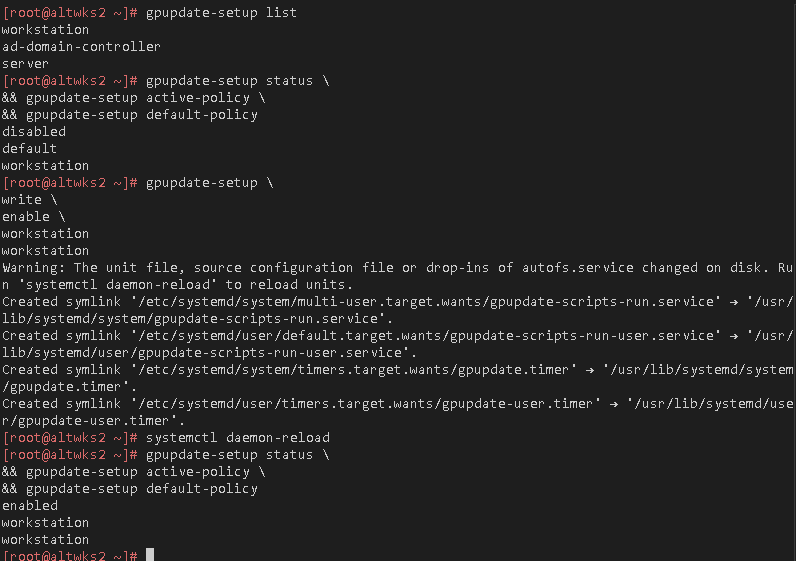

#### Копирование файлов по ssh через jump-proxy


```bash
scp -i ~/.ssh/id_alt-domain_2026_host_ed25519 \
-o StrictHostKeyChecking=accept-new \
-J sysadmin@172.16.100.2 \
./WindowsTH-KB2693643-x64.msu \
samba_u1@192.168.100.14:/srv/samba/dfs/WindowsTH-KB2693643-x64.msu
```

### Создание политики подключения SMB-ресурса к сессии доменного пользователя

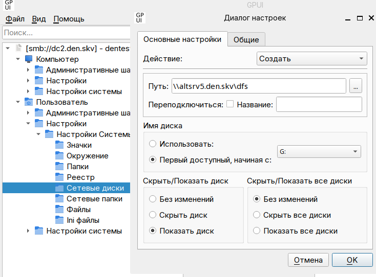
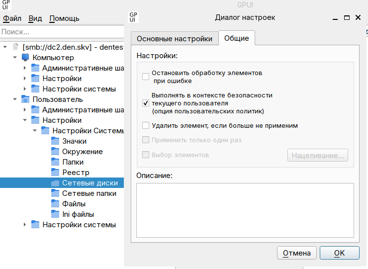
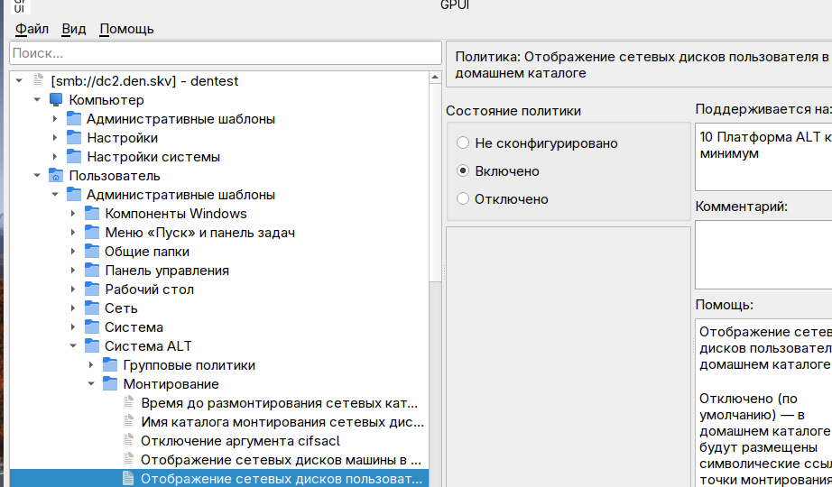
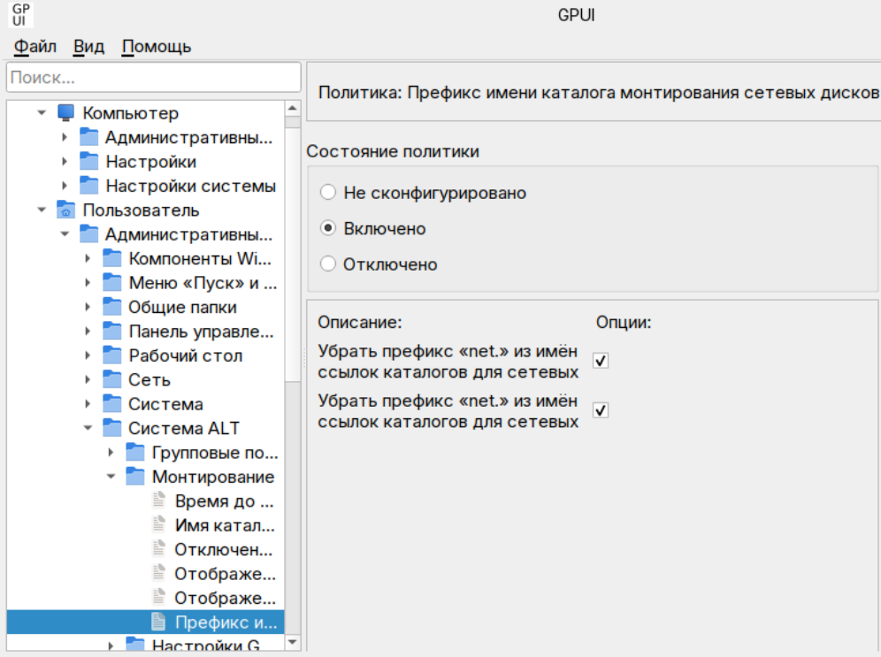
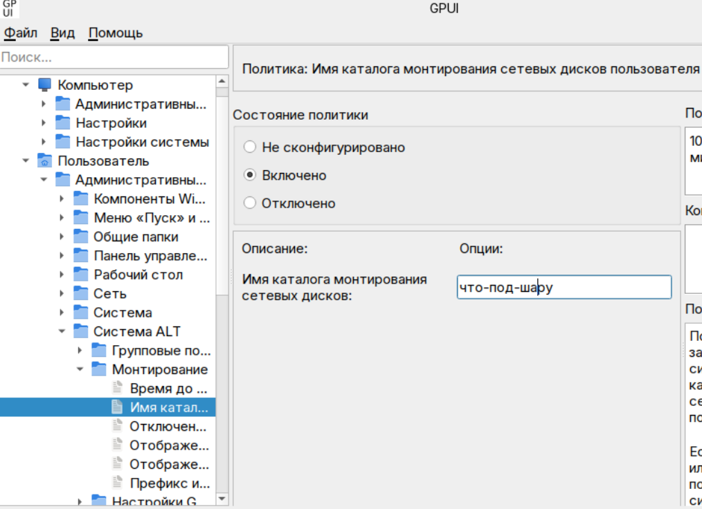

### Применение политики для группы

#### Сетевые папки

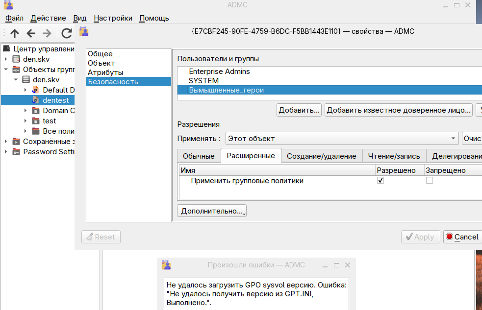


#### Установка пакетов

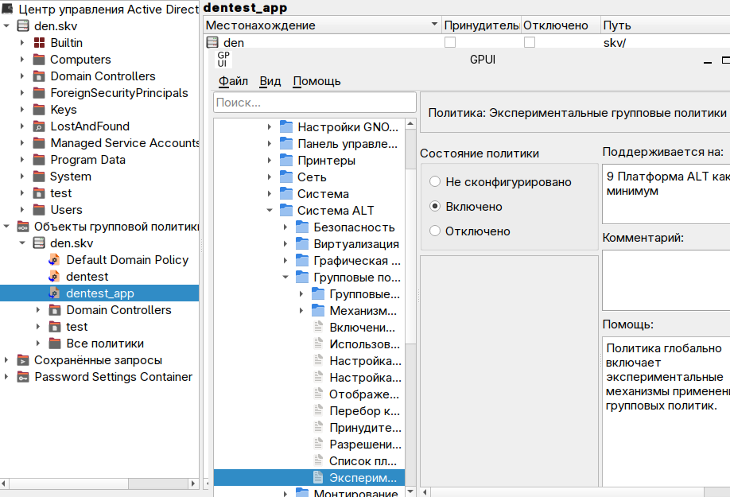
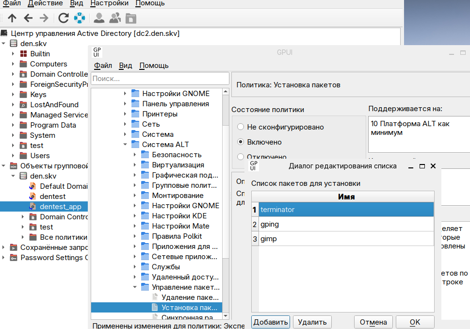

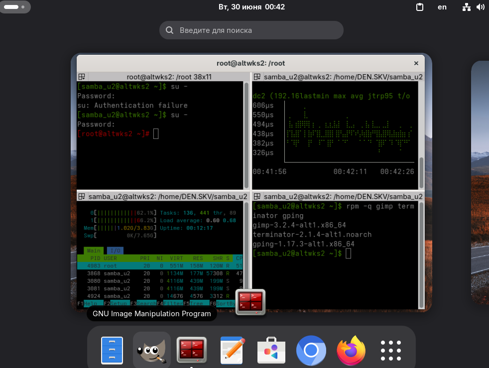

## Для github и gitflic

```bash
exit

git branch -v

git log --oneline

git switch main

git status

pushd \
..

git rm -r --cached \
. ../

git add . ../ \
&& git status

git remote -v

git commit -am "GPO" \
&& git push \
--set-upstream \
altlinux \
main \
&& git push \
--set-upstream \
altlinux_gf \
main \
&& git push \
--set-upstream \
altlinux_sc \
main

popd
```
