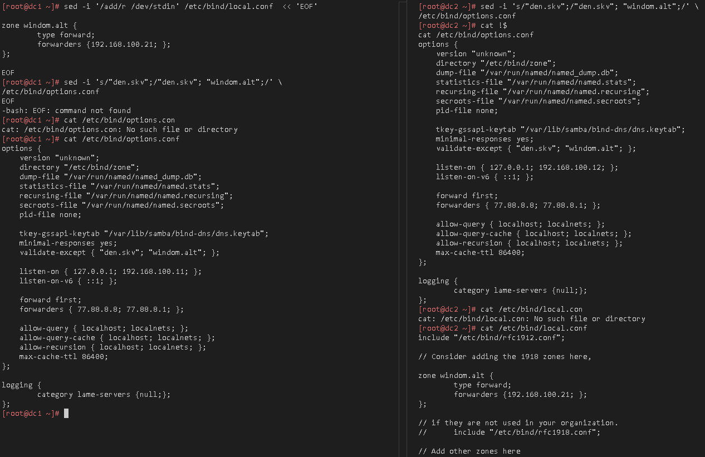
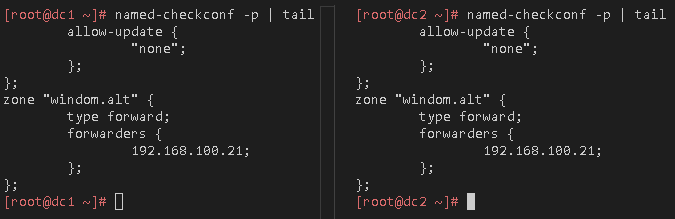
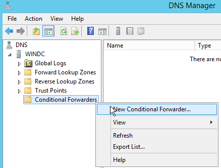
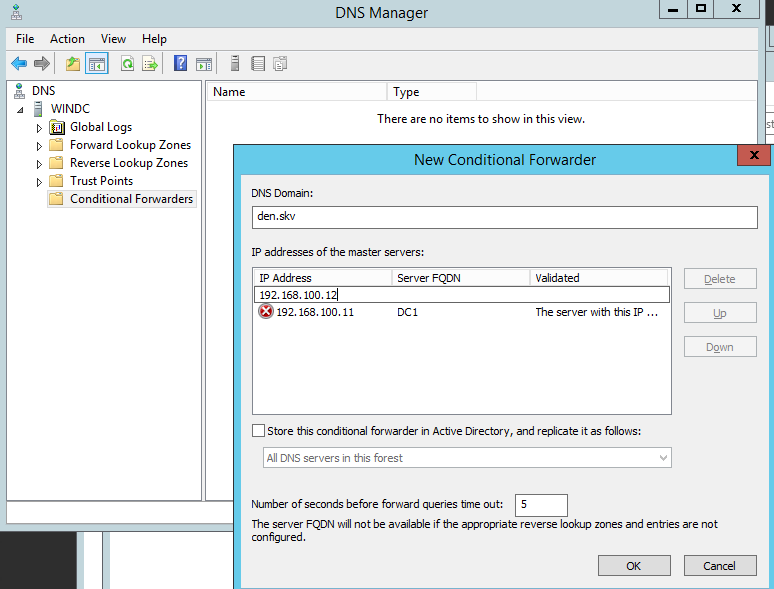
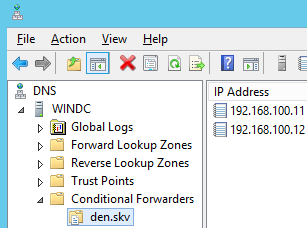

# Лабораторная работа 8 «`Создание доверительных отношений`»


## Памятка входа

```bash
# Регистрация сгенерированного ssh агентом
eval $(ssh-agent) \
&& ssh-add \
~/.ssh/id_alt-domain_2026_host_ed25519

# Хост altwks1
> ~/.ssh/known_hosts \
&& ssh -t -o StrictHostKeyChecking=accept-new \
sysadmin@172.16.100.2 \
"su -"

# Хост dc1
ssh -t \
-i ~/.ssh/id_alt-domain_2026_host_ed25519 \
-J sysadmin@172.16.100.2 \
-o StrictHostKeyChecking=accept-new \
sysadmin@192.168.100.11 \
"su -"

# Хост dc2
ssh -t \
-i ~/.ssh/id_alt-domain_2026_host_ed25519 \
-J sysadmin@172.16.100.2 \
-o StrictHostKeyChecking=accept-new \
sysadmin@192.168.100.12 \
"su -"

# Хост altsrv3 (Nginx)
ssh -t \
-i ~/.ssh/id_alt-domain_2026_host_ed25519 \
-J sysadmin@172.16.100.2 \
-o StrictHostKeyChecking=accept-new \
sysadmin@192.168.100.14 \
"su -"


# Хост altsrv4 (Samba-server1)
ssh -t \
-i ~/.ssh/id_alt-domain_2026_host_ed25519 \
-J sysadmin@172.16.100.2 \
-o StrictHostKeyChecking=accept-new \
sysadmin@192.168.100.14 \
"su -"

# Хост altsrv5 (Samba-server2)
ssh -t \
-i ~/.ssh/id_alt-domain_2026_host_ed25519 \
-J sysadmin@172.16.100.2 \
-o StrictHostKeyChecking=accept-new \
sysadmin@192.168.100.15 \
"su -"

# Хост altwks2
ssh -t \
-i ~/.ssh/id_alt-domain_2026_host_ed25519 \
-J sysadmin@172.16.100.2 \
-o StrictHostKeyChecking=accept-new \
sysadmin@192.168.100.2 \
"su -"
```

## Подготовка для работы

```bash
# Регистрация сгенерированного ssh агентом
eval $(ssh-agent) \
&& ssh-add \
~/.ssh/id_alt-domain_2026_host_ed25519

# Вход на Хост altwks1
> ~/.ssh/known_hosts \
&& ssh -t -o StrictHostKeyChecking=accept-new \
sysadmin@172.16.100.2

# Проверяем наличие пары ключей ssh на altwks1
find /home/sysadmin/.ssh/ \
| grep alt-domain
```

<details>
<summary>
Проверка наличия пары ssh
</summary>

```log
/home/sysadmin/.ssh/id_alt-domain_2026_host_ed25519.pub
/home/sysadmin/.ssh/id_alt-domain_2026_host_ed25519
```

</details>

## Выполнение работы

### Разрешение DNS имен forwarding на обоих dns в домен контролерах

#### подключение на узлы домен контролеров Alt

```bash
# Хост dc1
ssh -t \
-i ~/.ssh/id_alt-domain_2026_host_ed25519 \
-J sysadmin@172.16.100.2 \
-o StrictHostKeyChecking=accept-new \
sysadmin@192.168.100.11 \
"su -"

# Хост dc2
ssh -t \
-i ~/.ssh/id_alt-domain_2026_host_ed25519 \
-J sysadmin@172.16.100.2 \
-o StrictHostKeyChecking=accept-new \
sysadmin@192.168.100.12 \
"su -"
```

#### создание forward зоны на dns Домена MS

```bash
sed -i '/add/r /dev/stdin' /etc/bind/local.conf  << 'EOF'

zone windom.alt {
        type forward;
        forwarders {192.168.100.21; };
};

EOF

cat /etc/bind/local.conf
```

<details>
<summary>
Проверка наличия forward зоны на dns Домена MS
</summary>

```log
include "/etc/bind/rfc1912.conf";

// Consider adding the 1918 zones here,

zone windom.alt {
        type forward;
        forwarders {192.168.100.21; };
};

// if they are not used in your organization.
//      include "/etc/bind/rfc1918.conf";

// Add other zones here
```

</details>

#### Отключение DNSsec для себя и домена MS

```bash
sed -i 's/"den.skv";/"den.skv"; "windom.alt";/' \
/etc/bind/options.conf

cat /etc/bind/options.conf
```

dnssec-validation no;

<details>
<summary>
Проверка наличия DNSsec для себя и домена MS
</summary>

```log
options {
    version "unknown";
    directory "/etc/bind/zone";
    dump-file "/var/run/named/named_dump.db";
    statistics-file "/var/run/named/named.stats";
    recursing-file "/var/run/named/named.recursing";
    secroots-file "/var/run/named/named.secroots";
    pid-file none;
    
    tkey-gssapi-keytab "/var/lib/samba/bind-dns/dns.keytab";
    minimal-responses yes;
    validate-except { "den.skv"; "windom.alt"; };
    
    listen-on { 127.0.0.1; 192.168.100.11; };
    listen-on-v6 { ::1; };
    
    forward first;
    forwarders { 77.88.8.8; 77.88.8.1; };

    allow-query { localhost; localnets; };
    allow-query-cache { localhost; localnets; };
    allow-recursion { localhost; localnets; };
    max-cache-ttl 86400;
};

logging {
        category lame-servers {null;};
};
```

```log
options {
    version "unknown";
    directory "/etc/bind/zone";
    dump-file "/var/run/named/named_dump.db";
    statistics-file "/var/run/named/named.stats";
    recursing-file "/var/run/named/named.recursing";
    secroots-file "/var/run/named/named.secroots";
    pid-file none;
    
    tkey-gssapi-keytab "/var/lib/samba/bind-dns/dns.keytab";
    minimal-responses yes;
    validate-except { "den.skv"; "windom.alt"; };
    
    listen-on { 127.0.0.1; 192.168.100.12; };
    listen-on-v6 { ::1; };
    
    forward first;
    forwarders { 77.88.8.8; 77.88.8.1; };

    allow-query { localhost; localnets; };
    allow-query-cache { localhost; localnets; };
    allow-recursion { localhost; localnets; };
    max-cache-ttl 86400;
};

logging {
        category lame-servers {null;};
};
```

</details>




#### со стороны MS AD





## Для github и gitflic

```bash
exit

git branch -v

git log --oneline

git switch main

git status

pushd \
..

git rm -r --cached \
. ../

git add . ../ \
&& git status

git remote -v

git commit -am "alt_trust_to_ms" \
&& git push \
--set-upstream \
altlinux \
main \
&& git push \
--set-upstream \
altlinux_gf \
main \
&& git push \
--set-upstream \
altlinux_sc \
main

popd
```
