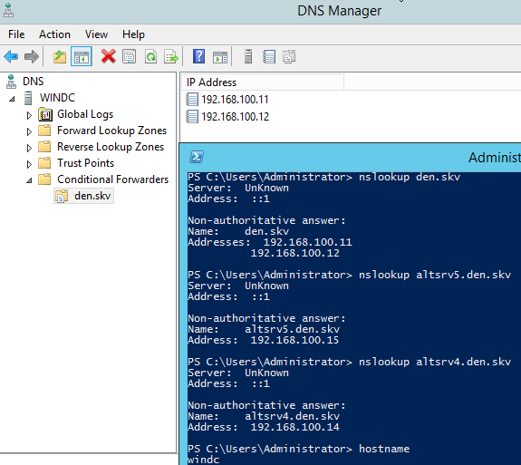
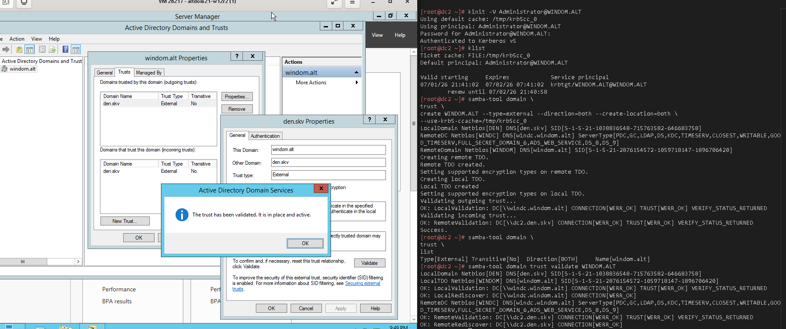
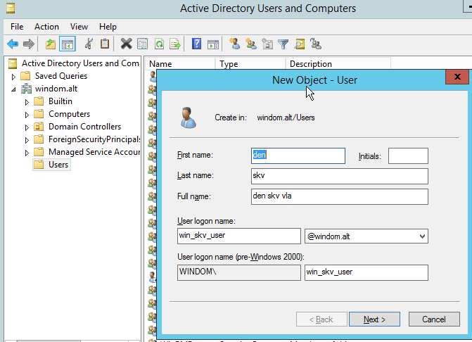
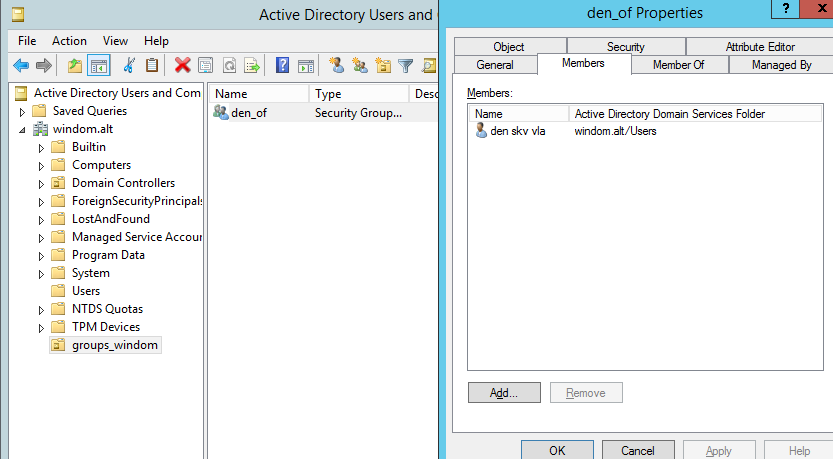

# Лабораторная работа 8 «`Создание доверительных отношений`»


## Памятка входа

```bash
# Регистрация сгенерированного ssh агентом
eval $(ssh-agent) \
&& ssh-add \
~/.ssh/id_alt-domain_2026_host_ed25519

# Хост altwks1
> ~/.ssh/known_hosts \
&& ssh -t -o StrictHostKeyChecking=accept-new \
sysadmin@172.16.100.2 \
"su -"

# Хост dc1
ssh -t \
-i ~/.ssh/id_alt-domain_2026_host_ed25519 \
-J sysadmin@172.16.100.2 \
-o StrictHostKeyChecking=accept-new \
sysadmin@192.168.100.11 \
"su -"

# Хост dc2
ssh -t \
-i ~/.ssh/id_alt-domain_2026_host_ed25519 \
-J sysadmin@172.16.100.2 \
-o StrictHostKeyChecking=accept-new \
sysadmin@192.168.100.12 \
"su -"

# Хост altsrv3 (Nginx)
ssh -t \
-i ~/.ssh/id_alt-domain_2026_host_ed25519 \
-J sysadmin@172.16.100.2 \
-o StrictHostKeyChecking=accept-new \
sysadmin@192.168.100.14 \
"su -"


# Хост altsrv4 (Samba-server1)
ssh -t \
-i ~/.ssh/id_alt-domain_2026_host_ed25519 \
-J sysadmin@172.16.100.2 \
-o StrictHostKeyChecking=accept-new \
sysadmin@192.168.100.14 \
"su -"

# Хост altsrv5 (Samba-server2)
ssh -t \
-i ~/.ssh/id_alt-domain_2026_host_ed25519 \
-J sysadmin@172.16.100.2 \
-o StrictHostKeyChecking=accept-new \
sysadmin@192.168.100.15 \
"su -"

# Хост altwks2
ssh -t \
-i ~/.ssh/id_alt-domain_2026_host_ed25519 \
-J sysadmin@172.16.100.2 \
-o StrictHostKeyChecking=accept-new \
sysadmin@192.168.100.2 \
"su -"
```

## Подготовка для работы

```bash
# Регистрация сгенерированного ssh агентом
eval $(ssh-agent) \
&& ssh-add \
~/.ssh/id_alt-domain_2026_host_ed25519

# Вход на Хост altwks1
> ~/.ssh/known_hosts \
&& ssh -t -o StrictHostKeyChecking=accept-new \
sysadmin@172.16.100.2

# Проверяем наличие пары ключей ssh на altwks1
find /home/sysadmin/.ssh/ \
| grep alt-domain
```

<details>
<summary>
Проверка наличия пары ssh
</summary>

```log
/home/sysadmin/.ssh/id_alt-domain_2026_host_ed25519.pub
/home/sysadmin/.ssh/id_alt-domain_2026_host_ed25519
```

</details>

## Выполнение работы

### Разрешение DNS имен forwarding на обоих dns в домен контролерах

#### подключение на узлы домен контролеров Alt

```bash
# Хост dc1
ssh -t \
-i ~/.ssh/id_alt-domain_2026_host_ed25519 \
-J sysadmin@172.16.100.2 \
-o StrictHostKeyChecking=accept-new \
sysadmin@192.168.100.11 \
"su -"

# Хост dc2
ssh -t \
-i ~/.ssh/id_alt-domain_2026_host_ed25519 \
-J sysadmin@172.16.100.2 \
-o StrictHostKeyChecking=accept-new \
sysadmin@192.168.100.12 \
"su -"
```

#### создание forward зоны на dns Домена MS

```bash
sed -i '/add/r /dev/stdin' /etc/bind/local.conf  << 'EOF'

zone windom.alt {
        type forward;
        forwarders {192.168.100.21; };
};

EOF

cat /etc/bind/local.conf
```

<details>
<summary>
Проверка наличия forward зоны на dns Домена MS
</summary>

```log
include "/etc/bind/rfc1912.conf";

// Consider adding the 1918 zones here,

zone windom.alt {
        type forward;
        forwarders {192.168.100.21; };
};

// if they are not used in your organization.
//      include "/etc/bind/rfc1918.conf";

// Add other zones here
```

</details>

#### Отключение DNSsec для себя и домена MS

```bash
sed -i 's/"den.skv";/"den.skv"; "windom.alt";/' \
/etc/bind/options.conf

cat /etc/bind/options.conf

systemctl restart bind
```

dnssec-validation no;

<details>
<summary>
Проверка наличия DNSsec для себя и домена MS
</summary>

```log
options {
    version "unknown";
    directory "/etc/bind/zone";
    dump-file "/var/run/named/named_dump.db";
    statistics-file "/var/run/named/named.stats";
    recursing-file "/var/run/named/named.recursing";
    secroots-file "/var/run/named/named.secroots";
    pid-file none;
    
    tkey-gssapi-keytab "/var/lib/samba/bind-dns/dns.keytab";
    minimal-responses yes;
    validate-except { "den.skv"; "windom.alt"; };
    
    listen-on { 127.0.0.1; 192.168.100.11; };
    listen-on-v6 { ::1; };
    
    forward first;
    forwarders { 77.88.8.8; 77.88.8.1; };

    allow-query { localhost; localnets; };
    allow-query-cache { localhost; localnets; };
    allow-recursion { localhost; localnets; };
    max-cache-ttl 86400;
};

logging {
        category lame-servers {null;};
};
```

```log
options {
    version "unknown";
    directory "/etc/bind/zone";
    dump-file "/var/run/named/named_dump.db";
    statistics-file "/var/run/named/named.stats";
    recursing-file "/var/run/named/named.recursing";
    secroots-file "/var/run/named/named.secroots";
    pid-file none;
    
    tkey-gssapi-keytab "/var/lib/samba/bind-dns/dns.keytab";
    minimal-responses yes;
    validate-except { "den.skv"; "windom.alt"; };
    
    listen-on { 127.0.0.1; 192.168.100.12; };
    listen-on-v6 { ::1; };
    
    forward first;
    forwarders { 77.88.8.8; 77.88.8.1; };

    allow-query { localhost; localnets; };
    allow-query-cache { localhost; localnets; };
    allow-recursion { localhost; localnets; };
    max-cache-ttl 86400;
};

logging {
        category lame-servers {null;};
};
```

</details>


#### со стороны MS AD




### Создание доверительных отношений со стороны Alt домена

#### Вход на домен контролер с пролью FSMO dc2

```bash
# Хост dc2
ssh -t \
-i ~/.ssh/id_alt-domain_2026_host_ed25519 \
-J sysadmin@172.16.100.2 \
-o StrictHostKeyChecking=accept-new \
sysadmin@192.168.100.12 \
"su -"
```

#### Через инструментарий samba-tool создание доверительных отношений со стороны Alt домена

```bash
kinit -V Administrator@WINDOM.ALT

klist

samba-tool domain \
trust \
create WINDOM.ALT --type=external --direction=both --create-location=both \
--use-krb5-ccache=/tmp/krb5cc_0
```

<details>
<summary>
Вывод создания доверительных отношений
</summary>

```log
Using default cache: /tmp/krb5cc_0
Using principal: Administrator@WINDOM.ALT
Password for Administrator@WINDOM.ALT: 
Authenticated to Kerberos v5
```

```log
Ticket cache: FILE:/tmp/krb5cc_0
Default principal: Administrator@WINDOM.ALT

Valid starting     Expires            Service principal
07/01/26 21:41:02  07/02/26 07:41:02  krbtgt/WINDOM.ALT@WINDOM.ALT
        renew until 07/02/26 21:40:58
```

```log
LocalDomain Netbios[DEN] DNS[den.skv] SID[S-1-5-21-1038836548-715763582-646683758]
RemoteDC Netbios[WINDC] DNS[windc.windom.alt] ServerType[PDC,GC,LDAP,DS,KDC,TIMESERV,CLOSEST,WRITABLE,GOOD_TIMESERV,FULL_SECRET_DOMAIN_6,ADS_WEB_SERVICE,DS_8,DS_9]
RemoteDomain Netbios[WINDOM] DNS[windom.alt] SID[S-1-5-21-2876154572-1059718147-1896706420]
Creating remote TDO.
Remote TDO created.
Setting supported encryption types on remote TDO.
Creating local TDO.
Local TDO created
Setting supported encryption types on local TDO.
Validating outgoing trust...
OK: LocalValidation: DC[\\windc.windom.alt] CONNECTION[WERR_OK] TRUST[WERR_OK] VERIFY_STATUS_RETURNED
Validating incoming trust...
OK: RemoteValidation: DC[\\dc2.den.skv] CONNECTION[WERR_OK] TRUST[WERR_OK] VERIFY_STATUS_RETURNED
Success.
```

</details>

#### Вывод списка доверительных отношений

```bash
samba-tool domain \
trust \
list
```

<details>
<summary>
Вывод списка доверительных отношений
</summary>

```log
Type[External] Transitive[No]  Direction[BOTH]     Name[windom.alt]
```

</details>

#### Проверка доверительных отношений

```bash
samba-tool domain \
trust \
validate \
WINDOM.ALT
```

<details>
<summary>
Вывод проверки доверительных отношений
</summary>

```log
LocalDomain Netbios[DEN] DNS[den.skv] SID[S-1-5-21-1038836548-715763582-646683758]
LocalTDO Netbios[WINDOM] DNS[windom.alt] SID[S-1-5-21-2876154572-1059718147-1896706420]
OK: LocalValidation: DC[\\windc.windom.alt] CONNECTION[WERR_OK] TRUST[WERR_OK] VERIFY_STATUS_RETURNED
OK: LocalRediscover: DC[\\windc.windom.alt] CONNECTION[WERR_OK]
RemoteDC Netbios[WINDC] DNS[windc.windom.alt] ServerType[PDC,GC,LDAP,DS,KDC,TIMESERV,CLOSEST,WRITABLE,GOOD_TIMESERV,FULL_SECRET_DOMAIN_6,ADS_WEB_SERVICE,DS_8,DS_9]
OK: RemoteValidation: DC[\\dc2.den.skv] CONNECTION[WERR_OK] TRUST[WERR_OK] VERIFY_STATUS_RETURNED
OK: RemoteRediscover: DC[\\dc2.den.skv] CONNECTION[WERR_OK]
```

</details>



### Создание пользователя в домене MS



### Проверки со стороны пользовательских машин в домене Alt

#### Вход на машину в домене Alt под пользовательской УЗ

```bash
ssh -t -\
i ~/.ssh/id_alt-domain_2026_host_ed25519 \
-J sysadmin@172.16.100.2 \
-o StrictHostKeyChecking=accept-new \
sysadmin@192.168.100.2 \
"su -"
```

#### Присоединение машины в домен через winbind

```bash
# Обновление системы и установка пакетов
apt-get update \
&& update-kernel -y \
&& apt-get dist-upgrade -y \
&& apt-get -y install \
samba-common \
samba-client \
task-auth-ad-winbind \
bind-utils \
diag-domain-client \
admx-* \
tree \
admc \
gpui \
gpupdate \
alterator-gpupdate \
gpresult \
&& admx-msi-setup \
&& systemctl reboot
```

```bash
# Переменные для ввода в домен
host_name="$(hostname)"
domain=den.skv
WORKGR=DEN
_REALM=DEN.SKV
_DNS_ADM=Administrator

mkdir -p /tmp/.private/root/

sed -i "s/# default_realm = EXAMPLE.COM/ default_realm = "$_REALM"/" \
/etc/krb5.conf

sed -i 's/realm = true/realm = false/' \
/etc/krb5.conf

cat /etc/krb5.conf

hostnamectl hostname "$host_name"."$domain" --static

domainname "$domain"

kinit -V "$_DNS_ADM" \
&& system-auth write \
ad \
"$domain" \
"$host_name" \
"$WORKGR" \
--winbind \
--gpo \
&& systemctl reboot
```

#### Проверка принадлежности и доверия

```bash
wbinfo --own-domain

wbinfo -n WINDOM\\win_skv_user

wbinfo -i WINDOM\\win_skv_user

wbinfo -a WINDOM\\win_skv_user
```

<details>
<summary>
Вывод принадлежности, доверия и тест авторизации
</summary>

```log
DEN
```

```log
S-1-5-21-2876154572-1059718147-1896706420-2103 SID_USER (1)
```

```log
WINDOM\win_skv_user:*:100002:100009:den skv vla:/home/DEN.SKV/win_skv_user:/bin/bash
```

```log
Enter WINDOM.ALT\win_skv_user's password: 
plaintext password authentication succeeded
Enter WINDOM.ALT\win_skv_user's password: 
challenge/response password authentication succeeded
```

</details>

#### на домен контролере запрос списка пользователей через samba-tool

```bash
samba-tool user \
list \
-H ldap://windc.windom.alt \
--use-krb5-ccache=/tmp/krb5cc_0
```

<details>
<summary>
Вывод списка пользователей домена MS
</summary>

```log
Administrator
krbtgt
win_skv_user
Guest
```

</details>

### Создание группы пользователей в домене Alt

```bash
samba-tool group add \
'Office'
```

<details>
<summary>
Создание группы
</summary>

```log
Added group Office
```

</details>


#### Добавление пользователей в группу по SID_USER

```bash
samba-tool group addmembers \
'Office' \
S-1-5-21-2876154572-1059718147-1896706420-2103
```

<details>
<summary>
Добавление пользователей в группу
</summary>

```log
Added members to group Office
```

</details>

#### Вывод участников группы в домене Alt

```bash
samba-tool group \
listmembers \
'Office'
```

<details>
<summary>
Вывод участников группы
</summary>

```log
S-1-5-21-2876154572-1059718147-1896706420-2103
```

</details>



## Для github и gitflic

```bash
exit

git branch -v

git log --oneline

git switch main

git status

pushd \
..

git rm -r --cached \
. ../

git add . ../ \
&& git status

git remote -v

git commit -am "alt_trust_to_ms" \
&& git push \
--set-upstream \
altlinux \
main \
&& git push \
--set-upstream \
altlinux_gf \
main \
&& git push \
--set-upstream \
altlinux_sc \
main

popd
```
